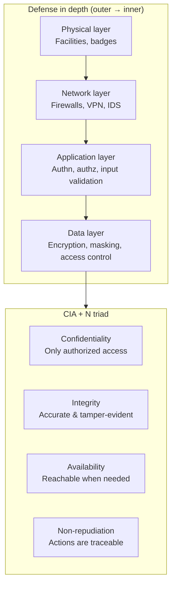

# Data Security: Protecting Data Assets

**After this lesson:** You can describe the core goals of data security (confidentiality, integrity, availability), explain defense in depth at a high level, and read the code sketches as common patterns—not as copy-paste production systems.

## Introduction

**Data security** protects data from **unauthorized access**, **tampering**, and **loss** across storage, networks, and applications. Privacy asks whether you *should* hold certain data; security asks how you *protect* what you are allowed to hold.

### Video

<div class="video-embed">
<iframe width="560" height="315" src="https://www.youtube.com/embed/inWWhTJ_0Zs" frameborder="0" allow="accelerometer; autoplay; clipboard-write; encrypted-media; gyroscope; picture-in-picture" allowfullscreen></iframe>
</div>

*IBM Technology — Cybersecurity basics*

## Goals and layers

### Protection goals (CIA + N)

- **Confidentiality** — Only **authorized** people and systems can read the data. Leaks and oversharing break confidentiality.
- **Integrity** — Data is **accurate and complete**; changes are intentional and detectable.
- **Availability** — Authorized users can use systems and data when needed. Attacks and outages can target availability.
- **Non-repudiation** — Actors cannot plausibly deny sending or receiving data; important for audits and contracts.



*"Defense in depth" means one layer failing doesn't compromise the whole system. Each ring must be breached separately.*

### Defense in depth (layers)

Teams stack controls so one failure does not mean total failure:

1. **Physical** — Facilities, badges, environmental controls. Still relevant in the cloud: providers run the buildings.
2. **Network** — Firewalls, segmentation, VPNs, intrusion detection—so one compromised laptop does not mean the whole network.
3. **Application** — **Authentication** (identity), **authorization** (permissions), **input validation** (block malicious input), **session management** (tokens, expiry).
4. **Data** — **Encryption**, **access controls**, **masking** in lower environments, **secure deletion** when data must go away.

## Implementation guide (illustrative)

### Encryption

**Symmetric** keys are fast for bulk data. **Asymmetric** (public/private) pairs help with **key exchange** and **signatures** but are expensive for large payloads. **Hybrid** encryption mixes both: encrypt the payload with a random session key, then encrypt that key for the recipient.

**Example:**

<div class="code-explainer" data-code-explainer>
<div class="code-explainer__code">


class EncryptionService:
    def __init__(self):
        self.symmetric_key = self.generate_symmetric_key()
        self.key_pair = self.generate_key_pair()

    def symmetric_encryption(self, data):
        """AES encryption for large data"""
        cipher = AES.new(self.symmetric_key, AES.MODE_GCM)
        ciphertext, tag = cipher.encrypt_and_digest(data)
        return {
            'ciphertext': ciphertext,
            'nonce': cipher.nonce,
            'tag': tag
        }

    def asymmetric_encryption(self, data):
        """RSA encryption for small data"""
        cipher = PKCS1_OAEP.new(self.key_pair.publickey())
        return cipher.encrypt(data)

    def hybrid_encryption(self, data):
        """Hybrid encryption for secure data transfer"""
        # Generate session key
        session_key = get_random_bytes(16)

        # Encrypt data with session key
        encrypted_data = self.symmetric_encryption(data)

        # Encrypt session key with recipient's public key
        encrypted_session_key = self.asymmetric_encryption(session_key)

        return {
            'encrypted_data': encrypted_data,
            'encrypted_session_key': encrypted_session_key
        }


</div>
<aside class="code-explainer__callouts" aria-label="Code walkthrough">
  <div class="code-callout" data-lines="1-4" data-tint="1">
    <div class="code-callout__meta">
      <span class="code-callout__lines"></span>
      <span class="code-callout__title">Key Initialisation</span>
    </div>
    <div class="code-callout__body">
      <p>Generates both a symmetric AES key for bulk data and an RSA key-pair for key exchange at startup.</p>
    </div>
  </div>
  <div class="code-callout" data-lines="6-15" data-tint="2">
    <div class="code-callout__meta">
      <span class="code-callout__lines"></span>
      <span class="code-callout__title">Symmetric Encryption</span>
    </div>
    <div class="code-callout__body">
      <p>Uses AES-GCM mode which provides both confidentiality (ciphertext) and authenticity (tag), returning the nonce needed for decryption.</p>
    </div>
  </div>
  <div class="code-callout" data-lines="17-20" data-tint="3">
    <div class="code-callout__meta">
      <span class="code-callout__lines"></span>
      <span class="code-callout__title">Asymmetric Encryption</span>
    </div>
    <div class="code-callout__body">
      <p>RSA-OAEP encrypts small payloads (like session keys) with the recipient's public key so only they can decrypt.</p>
    </div>
  </div>
  <div class="code-callout" data-lines="22-36" data-tint="4">
    <div class="code-callout__meta">
      <span class="code-callout__lines"></span>
      <span class="code-callout__title">Hybrid Encryption</span>
    </div>
    <div class="code-callout__body">
      <p>Combines both: generates a random session key, encrypts the data symmetrically, then encrypts the session key asymmetrically—the pattern used in TLS.</p>
    </div>
  </div>
</aside>
</div>

**When each pattern shows up:** Symmetric encryption is typical for **disk or database** encryption when one system holds the key. Asymmetric is used for **establishing trust** between parties (TLS handshakes, signing). Hybrid is **TLS-like**: combine fast symmetric bulk encryption with asymmetric protection of the session key.

### Access control

**RBAC** assigns permissions to **roles** (analyst, admin), then assigns users to roles. **ABAC** (below) can depend on attributes (department, clearance, resource sensitivity) and context (time, location)—more flexible, more complex to configure.

#### Role-based access control (RBAC)

**Example**:

<div class="code-explainer" data-code-explainer>
<div class="code-explainer__code">


class RBACSystem:
    def __init__(self):
        self.roles = {}
        self.user_roles = {}
        self.permissions = {}

    def create_role(self, role_name, permissions):
        """Create a new role with specified permissions"""
        self.roles[role_name] = {
            'permissions': permissions,
            'created_at': datetime.now(),
            'modified_at': datetime.now()
        }

    def assign_role(self, user_id, role_name):
        """Assign role to user"""
        if role_name not in self.roles:
            raise ValueError(f"Role {role_name} does not exist")

        self.user_roles[user_id] = role_name
        self.log_role_assignment(user_id, role_name)

    def check_permission(self, user_id, permission):
        """Check if user has specific permission"""
        role = self.user_roles.get(user_id)
        if not role:
            return False

        return permission in self.roles[role]['permissions']

    def audit_access(self, user_id):
        """Audit user's access patterns"""
        return {
            'user_id': user_id,
            'role': self.user_roles.get(user_id),
            'permissions': self.get_user_permissions(user_id),
            'access_history': self.get_access_history(user_id)
        }


</div>
<aside class="code-explainer__callouts" aria-label="Code walkthrough">
  <div class="code-callout" data-lines="1-6" data-tint="1">
    <div class="code-callout__meta">
      <span class="code-callout__lines"></span>
      <span class="code-callout__title">State Stores</span>
    </div>
    <div class="code-callout__body">
      <p>Three dicts hold roles, user-to-role assignments, and permissions—the minimal state for an RBAC system.</p>
    </div>
  </div>
  <div class="code-callout" data-lines="8-14" data-tint="2">
    <div class="code-callout__meta">
      <span class="code-callout__lines"></span>
      <span class="code-callout__title">Role Creation</span>
    </div>
    <div class="code-callout__body">
      <p>Records the permission set plus creation/modification timestamps so you can audit when a role was last changed.</p>
    </div>
  </div>
  <div class="code-callout" data-lines="16-22" data-tint="3">
    <div class="code-callout__meta">
      <span class="code-callout__lines"></span>
      <span class="code-callout__title">Role Assignment</span>
    </div>
    <div class="code-callout__body">
      <p>Validates the role exists before mapping a user to it, then logs the assignment for the audit trail.</p>
    </div>
  </div>
  <div class="code-callout" data-lines="24-38" data-tint="4">
    <div class="code-callout__meta">
      <span class="code-callout__lines"></span>
      <span class="code-callout__title">Permission Check and Audit</span>
    </div>
    <div class="code-callout__body">
      <p>Looks up the user's role and checks membership in its permission set; the audit method returns a snapshot for access reviews.</p>
    </div>
  </div>
</aside>
</div>

**Access Levels Example:**
```python
PERMISSION_LEVELS = {
    'admin': {
        'read': True,
        'write': True,
        'delete': True,
        'manage_users': True
    },
    'manager': {
        'read': True,
        'write': True,
        'delete': False,
        'manage_users': False
    },
    'user': {
        'read': True,
        'write': False,
        'delete': False,
        'manage_users': False
    }
}
```

---

#### Attribute-based access control (ABAC)

Policies can depend on **who** the user is, **what** the resource is, and **context** (device, time). Large enterprises use ABAC when RBAC alone is too coarse.

**Example**:

<div class="code-explainer" data-code-explainer>
<div class="code-explainer__code">


class ABACSystem:
    def __init__(self):
        self.policy_engine = PolicyEngine()
        self.context_manager = ContextManager()

    def evaluate_access(self, user, resource, action, context):
        """Evaluate access based on attributes"""
        policy_decision = self.policy_engine.evaluate({
            'user_attributes': {
                'department': user.department,
                'clearance_level': user.clearance_level,
                'location': user.location
            },
            'resource_attributes': {
                'classification': resource.classification,
                'owner': resource.owner,
                'type': resource.type
            },
            'action': action,
            'context': {
                'time': context.current_time,
                'location': context.location,
                'device': context.device_type
            }
        })

        self.log_access_decision(
            user, resource, action, policy_decision
        )

        return policy_decision


</div>
<aside class="code-explainer__callouts" aria-label="Code walkthrough">
  <div class="code-callout" data-lines="1-4" data-tint="1">
    <div class="code-callout__meta">
      <span class="code-callout__lines"></span>
      <span class="code-callout__title">Policy Engine</span>
    </div>
    <div class="code-callout__body">
      <p>Injects a policy engine (evaluates rules) and a context manager (supplies runtime context like time and device).</p>
    </div>
  </div>
  <div class="code-callout" data-lines="6-25" data-tint="2">
    <div class="code-callout__meta">
      <span class="code-callout__lines"></span>
      <span class="code-callout__title">Attribute Bundle</span>
    </div>
    <div class="code-callout__body">
      <p>Packages user attributes (department, clearance, location), resource attributes (classification, owner, type), the requested action, and environmental context into one dict for the policy engine.</p>
    </div>
  </div>
  <div class="code-callout" data-lines="27-31" data-tint="3">
    <div class="code-callout__meta">
      <span class="code-callout__lines"></span>
      <span class="code-callout__title">Log and Return</span>
    </div>
    <div class="code-callout__body">
      <p>Every access decision is logged before it is returned so security teams can review who accessed what and under which context.</p>
    </div>
  </div>
</aside>
</div>

## Security monitoring and incident response

**Monitoring** watches logs and metrics for suspicious patterns. **Incident response** is the playbook when something bad happens: contain, investigate, recover, document. Both are essential in production; detecting late is expensive.

### Security monitoring

**Example**:

<div class="code-explainer" data-code-explainer>
<div class="code-explainer__code">


class SecurityMonitor:
    def __init__(self):
        self.alert_manager = AlertManager()
        self.threat_detector = ThreatDetector()

    def monitor_system_activity(self):
        """Real-time security monitoring"""
        while True:
            # Collect security metrics
            metrics = self.collect_security_metrics()

            # Analyze for threats
            threats = self.threat_detector.analyze(metrics)

            # Handle detected threats
            for threat in threats:
                self.handle_threat(threat)

            time.sleep(self.monitoring_interval)

    def handle_threat(self, threat):
        """Handle detected security threat"""
        severity = self.assess_threat_severity(threat)

        response = {
            'high': self.emergency_response,
            'medium': self.standard_response,
            'low': self.log_and_monitor
        }[severity]

        return response(threat)


</div>
<aside class="code-explainer__callouts" aria-label="Code walkthrough">
  <div class="code-callout" data-lines="1-4" data-tint="1">
    <div class="code-callout__meta">
      <span class="code-callout__lines"></span>
      <span class="code-callout__title">Monitor Setup</span>
    </div>
    <div class="code-callout__body">
      <p>Injects an alert manager for notifications and a threat detector for analysing collected metrics.</p>
    </div>
  </div>
  <div class="code-callout" data-lines="6-19" data-tint="2">
    <div class="code-callout__meta">
      <span class="code-callout__lines"></span>
      <span class="code-callout__title">Monitoring Loop</span>
    </div>
    <div class="code-callout__body">
      <p>Continuously collects metrics, analyses for threats, and dispatches handlers—sleeping between cycles to avoid CPU saturation.</p>
    </div>
  </div>
  <div class="code-callout" data-lines="21-31" data-tint="3">
    <div class="code-callout__meta">
      <span class="code-callout__lines"></span>
      <span class="code-callout__title">Severity Dispatch</span>
    </div>
    <div class="code-callout__body">
      <p>Maps severity levels to handler functions using a dict so adding a new severity level is a single-line change.</p>
    </div>
  </div>
</aside>
</div>

### Incident response

**Example**:

<div class="code-explainer" data-code-explainer>
<div class="code-explainer__code">


class IncidentResponse:
    def __init__(self):
        self.incident_manager = IncidentManager()
        self.forensics = ForensicsTools()

    def handle_security_incident(self, incident):
        """Handle security incident"""
        # Containment
        self.contain_incident(incident)

        # Investigation
        evidence = self.collect_evidence(incident)
        analysis = self.analyze_incident(evidence)

        # Recovery
        recovery_plan = self.create_recovery_plan(analysis)
        self.execute_recovery(recovery_plan)

        # Documentation
        self.document_incident({
            'incident': incident,
            'evidence': evidence,
            'analysis': analysis,
            'recovery': recovery_plan,
            'lessons_learned': self.compile_lessons_learned()
        })

    def contain_incident(self, incident):
        """Implement containment measures"""
        containment_actions = {
            'data_breach': self.isolate_affected_systems,
            'malware': self.quarantine_infected_systems,
            'ddos': self.activate_ddos_protection,
            'unauthorized_access': self.revoke_access_tokens
        }

        action = containment_actions.get(
            incident.type, self.default_containment
        )
        return action(incident)


</div>
<aside class="code-explainer__callouts" aria-label="Code walkthrough">
  <div class="code-callout" data-lines="1-4" data-tint="1">
    <div class="code-callout__meta">
      <span class="code-callout__lines"></span>
      <span class="code-callout__title">Response Setup</span>
    </div>
    <div class="code-callout__body">
      <p>An incident manager coordinates the workflow; forensics tools handle evidence collection and analysis.</p>
    </div>
  </div>
  <div class="code-callout" data-lines="6-26" data-tint="2">
    <div class="code-callout__meta">
      <span class="code-callout__lines"></span>
      <span class="code-callout__title">Four-Phase Response</span>
    </div>
    <div class="code-callout__body">
      <p>Follows the standard IR playbook in order: contain → investigate → recover → document, building an evidence trail at each step.</p>
    </div>
  </div>
  <div class="code-callout" data-lines="28-39" data-tint="3">
    <div class="code-callout__meta">
      <span class="code-callout__lines"></span>
      <span class="code-callout__title">Containment Dispatch</span>
    </div>
    <div class="code-callout__body">
      <p>Maps incident type to a specific containment action (isolate, quarantine, DDoS protection, revoke tokens) with a safe default.</p>
    </div>
  </div>
</aside>
</div>

## Baselines and assessments (illustrative)

**Baseline** means a known-good configuration: patches, hardened settings, monitoring enabled. **Assessments** (scans, reviews) find gaps before attackers do.

### Security baseline

<div class="code-explainer" data-code-explainer>
<div class="code-explainer__code">


class SecurityBaseline:
    def __init__(self):
        self.scanner = VulnerabilityScanner()
        self.config_manager = ConfigurationManager()

    def implement_baseline(self, system):
        """Implement security baseline"""
        # Secure configuration
        self.config_manager.apply_hardening(system)

        # Update management
        self.update_system(system)

        # Access control
        self.implement_access_controls(system)

        # Monitoring
        self.setup_monitoring(system)

        return self.verify_baseline(system)


</div>
<aside class="code-explainer__callouts" aria-label="Code walkthrough">
  <div class="code-callout" data-lines="1-4" data-tint="1">
    <div class="code-callout__meta">
      <span class="code-callout__lines"></span>
      <span class="code-callout__title">Baseline Setup</span>
    </div>
    <div class="code-callout__body">
      <p>Injects a vulnerability scanner and a configuration manager so hardening and scanning are handled by dedicated services.</p>
    </div>
  </div>
  <div class="code-callout" data-lines="6-16" data-tint="2">
    <div class="code-callout__meta">
      <span class="code-callout__lines"></span>
      <span class="code-callout__title">Hardening Steps</span>
    </div>
    <div class="code-callout__body">
      <p>Applies secure configuration, installs updates, and sets access controls—the three pillars of a security baseline—in a defined order.</p>
    </div>
  </div>
  <div class="code-callout" data-lines="18-21" data-tint="3">
    <div class="code-callout__meta">
      <span class="code-callout__lines"></span>
      <span class="code-callout__title">Monitor and Verify</span>
    </div>
    <div class="code-callout__body">
      <p>Enables monitoring before verifying the baseline so the system is observable from the moment hardening is confirmed.</p>
    </div>
  </div>
</aside>
</div>

### Regular security assessment

<div class="code-explainer" data-code-explainer>
<div class="code-explainer__code">


class SecurityAssessment:
    def __init__(self):
        self.vulnerability_scanner = VulnerabilityScanner()
        self.penetration_tester = PenetrationTester()

    def conduct_assessment(self, target):
        """Conduct security assessment"""
        results = {
            'vulnerability_scan': self.vulnerability_scanner.scan(target),
            'penetration_test': self.penetration_tester.test(target),
            'configuration_review': self.review_configuration(target),
            'access_control_audit': self.audit_access_controls(target)
        }

        return self.generate_assessment_report(results)


</div>
<aside class="code-explainer__callouts" aria-label="Code walkthrough">
  <div class="code-callout" data-lines="1-4" data-tint="1">
    <div class="code-callout__meta">
      <span class="code-callout__lines"></span>
      <span class="code-callout__title">Assessment Setup</span>
    </div>
    <div class="code-callout__body">
      <p>Injects two specialist tools: a vulnerability scanner for automated checks and a penetration tester for adversarial simulation.</p>
    </div>
  </div>
  <div class="code-callout" data-lines="6-15" data-tint="2">
    <div class="code-callout__meta">
      <span class="code-callout__lines"></span>
      <span class="code-callout__title">Four-Domain Scan</span>
    </div>
    <div class="code-callout__body">
      <p>Runs vulnerability scanning, penetration testing, configuration review, and access control audit in parallel, gathering all results before reporting.</p>
    </div>
  </div>
  <div class="code-callout" data-lines="17" data-tint="3">
    <div class="code-callout__meta">
      <span class="code-callout__lines"></span>
      <span class="code-callout__title">Report Generation</span>
    </div>
    <div class="code-callout__body">
      <p>Passes the aggregated results to a report generator so findings from all four domains appear in one structured output.</p>
    </div>
  </div>
</aside>
</div>

## Common pitfalls

- **Shared passwords or API keys in notebooks** — Treat secrets like production; use environment variables and rotation.
- **Over-relying on perimeter security** — Insider risk and misconfigured buckets matter; layer controls and audit access.
- **Ignoring updates** — Unpatched dependencies are a common breach path.

## Next Steps

### In this submodule

Continue to [Workflow concepts](./workflow-concepts.md). Then start [Introduction to Python](../1.2-intro-python/README.md).

### Going deeper on your own

Specialists go further with **SIEM** tooling, **zero trust** architectures, **threat hunting**, and formal programs (ISO 27001, SOC 2, NIST CSF). For this course, focus on **hygiene**: least privilege, patching, secrets management, and logging—most incidents still exploit basics.

## Additional resources

- [NIST Cybersecurity Framework](https://www.nist.gov/cyberframework)
- [OWASP Security Guidelines](https://owasp.org/www-project-security-guidelines/)
- [Cloud Security Alliance](https://cloudsecurityalliance.org/)
- [SANS Security Resources](https://www.sans.org/security-resources/)
- [ISO 27001 Standard](https://www.iso.org/isoiec-27001-information-security.html)

