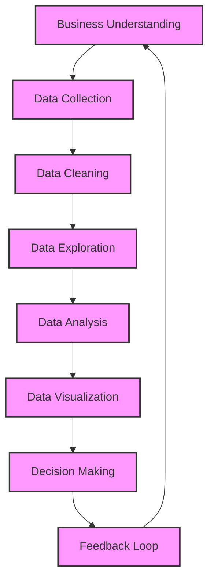
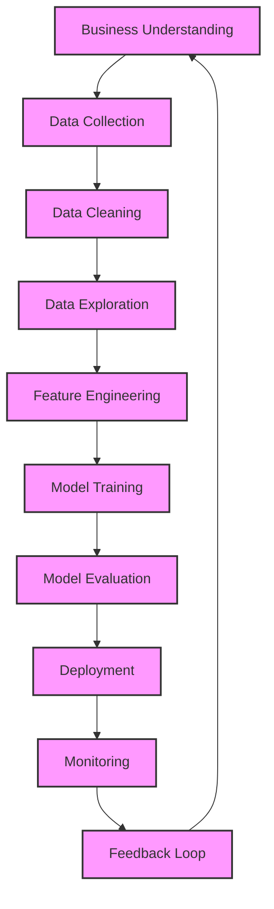

# Workflows and Lifecycle

**After this lesson:** You can describe the main stages of the analytics and data science lifecycles, explain what happens in each stage in plain language, and see how a single business question travels through the pipeline.

### Video

<iframe width="560" height="315" src="https://www.youtube.com/embed/b9HMF4hqW0A" frameborder="0" allow="accelerometer; autoplay; clipboard-write; encrypted-media; gyroscope; picture-in-picture" allowfullscreen></iframe>

*Ken Jee — The data science workflow*

## Why “lifecycle” is a useful mental model

Real projects are not linear. You revisit earlier steps when you discover bad data, a vague question, or a model that fails in production. Still, teams use **lifecycle** diagrams so everyone shares the same vocabulary: what “business understanding” means, when collection ends and cleaning begins, and where modeling fits in.

**Analytics** lifecycles emphasize understanding the past and present and communicating to stakeholders. **Data science** lifecycles add **features**, **models**, **deployment**, and **monitoring** because the deliverable is often a system that scores or predicts, not only a report.

## Data Analytics Lifecycle

The **Data Analytics Lifecycle** is a structured way to turn a business question into a decision-ready answer. Each stage has a purpose; skipping one usually creates expensive rework later.

### What each stage means in practice

1. **Business understanding** — You translate a vague goal (“improve retention”) into something measurable (e.g. “reduce 30-day churn among mobile signups by X%”). You agree on success criteria, constraints, and who decides when the work is done.

2. **Data collection** — You gather or access data that can answer the question: databases, exports, APIs, surveys, or partners. You also record *where* data came from and *when*, so later analyses stay trustworthy.

3. **Data cleaning** — You fix or standardize formats, handle missing values, remove duplicates, and document assumptions. Cleaning is not “making data pretty”; it is making the data **faithful** to reality.

4. **Data exploration** — You summarize distributions, relationships, and outliers with tables and charts. The goal is to build intuition before you claim strong conclusions.

5. **Data analysis** — You apply statistics or rules to answer the business question (e.g. compare segment A vs B, estimate impact of a campaign). This is where you test hypotheses or quantify uncertainty, not only where you draw charts.

6. **Data visualization** — You choose charts and narratives that match the audience: executives need clarity and decisions; analysts may need detail. Good visuals support the analysis; they do not replace it.

7. **Decision making** — Stakeholders use insights to change pricing, policies, or operations. Your job is to make trade-offs and limitations explicit so decisions are informed, not overconfident.

8. **Feedback loop** — Results feed new questions. Maybe the intervention worked, or maybe the metric moved for a different reason. The loop sends you back to business understanding or data collection with sharper questions.

### Mini example: same question through several stages

Imagine an online shop asks: *“Are weekend discount emails worth the cost?”*

- **Business understanding** — Define “worth it” (revenue lift vs cost, time window), and who owns the decision.
- **Collection** — Pull email sends, opens, clicks, and orders for a defined period; include a control group if you run experiments.
- **Cleaning** — Align time zones, dedupe customers, fix currency, and treat missing clicks as “no engagement.”
- **Exploration** — Plot order rates by day and segment; check for seasonality.
- **Analysis** — Compare uplift vs control; check if the effect holds across regions.
- **Visualization** — One clear chart of incremental revenue and a short table of caveats.
- **Decision** — Continue, pause, or redesign the campaign; document what you would measure next.
- **Feedback** — After the next campaign, compare results and refine the question.

You do not need code to think this way; the lifecycle is about **order of thinking**, not tools.

## Data Science Lifecycle

The **Data Science Lifecycle** describes projects whose main output is a **model or scoring system** that must work in production, not only a dashboard or report. It overlaps with analytics early on, then **branches** into engineering-heavy steps.

### Stages shared with analytics

**Business understanding** through **data exploration** match the analytics lifecycle: clarify the goal, get data, clean it, and explore. The difference is that you are already thinking about **predictive inputs** (features) and **how** a model will be used (latency, fairness, refresh cadence).

### What changes after exploration

5. **Feature engineering** — You turn raw fields into inputs models can learn from: ratios, time windows, rolling averages, categorical encodings, or text embeddings. Good features often matter more than a fancier algorithm.

6. **Model training** — You fit one or more algorithms to data, tune hyperparameters, and validate on held-out data. Training is iterative: you discover data issues and return to cleaning or features.

7. **Model evaluation** — You measure performance with metrics that match the problem (accuracy, calibration, precision/recall, RMSE, etc.) and check behavior across subgroups so you do not ship silent failures for part of your users.

8. **Deployment** — You expose the model via APIs, batch jobs, or apps, with versioning and rollback. This is where analytics and software engineering meet.

9. **Monitoring** — In production, data drift, broken pipelines, or changing user behavior can degrade models. Monitoring tracks inputs, outputs, and errors so you can retrain or intervene.

10. **Feedback loop** — New data, errors, and business changes inform the next cycle. The loop often starts with monitoring or stakeholder feedback, not only with a new slide deck.

### Analytics vs data science in one sentence

Use the **analytics lifecycle** when the deliverable is **insight and communication**; use the **data science lifecycle** when the deliverable is a **learned system** that must be trained, evaluated, deployed, and watched over time.

## Common pitfalls

- **Skipping business understanding** — Jumping to models or dashboards before the question and success criteria are clear wastes time and misleads stakeholders. Write the question and the metric in one sentence before you touch data.

- **Handoffs without documentation** — The next person (or future you) needs a short data dictionary, list of assumptions, and where code and inputs live. “It’s in the notebook” is not enough for a team.

- **Treating deployment as an afterthought** — For data science work, monitoring, logging, and rollback plans belong in the lifecycle from the start. A model that only works on the training laptop is not finished.

## Next steps

You have reached the end of submodule 1.1. Continue to [Introduction to Python](../1.2-intro-python/README.md), or return to the [module 1 overview](../README.md).
