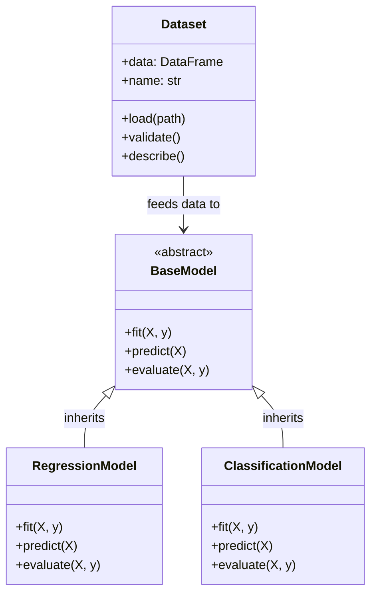

# Python Classes and Objects in Data Science

**After this lesson:** you can explain the core ideas in “Python Classes and Objects in Data Science” and reproduce the examples here in your own notebook or environment.

> **Visualize OOP:** Python Tutor can show object creation and method calls!

> **AI Helper:** "Explain classes using real-world objects as examples"

> **Interactive:** Practice OOP concepts in your own Colab notebooks

### Video

<div class="video-embed">
<iframe width="560" height="315" src="https://www.youtube.com/embed/ZDa-Z5JzLYM" frameborder="0" allow="accelerometer; autoplay; clipboard-write; encrypted-media; gyroscope; picture-in-picture" allowfullscreen></iframe>
</div>

*Corey Schafer — Python OOP: classes and instances*

## Introduction to object-oriented programming

**Object-oriented programming (OOP)** groups **state** (attributes) with **behavior** (methods) in **classes**. You build **instances** (objects) from those blueprints. Libraries you already use (`DataFrame`, estimators in scikit-learn) are OOP under the hood; learning classes helps you read their APIs and package your own helpers cleanly.

### Core OOP concepts

- **Encapsulation** — Keep related fields and functions together (a `Dataset` class that knows how to validate itself) instead of scattering dicts across files.
- **Inheritance** — Reuse and specialize behavior (`BaseModel` → `RegressionModel`) without duplicating every method.
- **Polymorphism** — Call the same method name on different types (`fit`, `transform`) and let each class implement the details.
- **Abstraction** — Expose a simple interface (`model.predict(X)`) while hiding optimization details inside the class.



*`BaseModel` defines the **interface** (`fit`, `predict`, `evaluate`); subclasses override the details. This is exactly how scikit-learn estimators are structured.*

### Why OOP in data science?

Teams use classes for **reusable pipelines**, **shared evaluation code**, and **wrappers** around models or APIs. You can write good analysis without heavy OOP, but you cannot avoid **reading** objects once you use pandas and sklearn.

## Design Patterns in Data Science

### 1. Factory Pattern

<div class="code-explainer" data-code-explainer>
<div class="code-explainer__code">


from abc import ABC, abstractmethod
from typing import Dict, Type

class Model(ABC):
   @abstractmethod
   def train(self, X, y):
       pass

   @abstractmethod
   def predict(self, X):
       pass

class RandomForestModel(Model):
   def train(self, X, y):
       print("Training Random Forest")

   def predict(self, X):
       print("Predicting with Random Forest")

class XGBoostModel(Model):
   def train(self, X, y):
       print("Training XGBoost")

   def predict(self, X):
       print("Predicting with XGBoost")

class ModelFactory:
   _models: Dict[str, Type[Model]] = {
       'random_forest': RandomForestModel,
       'xgboost': XGBoostModel
   }

   @classmethod
   def create_model(cls, model_type: str) -> Model:
       if model_type not in cls._models:
           raise ValueError(f"Unknown model type: {model_type}")
       return cls._models[model_type]()


</div>
<aside class="code-explainer__callouts" aria-label="Code walkthrough">
  <div class="code-callout" data-lines="1-2" data-tint="1">
    <div class="code-callout__meta">
      <span class="code-callout__lines"></span>
      <span class="code-callout__title">Imports</span>
    </div>
    <div class="code-callout__body">
      <p>Import <code>ABC</code> and <code>abstractmethod</code> for defining abstract base classes, plus type hints for the registry dict.</p>
    </div>
  </div>
  <div class="code-callout" data-lines="4-11" data-tint="2">
    <div class="code-callout__meta">
      <span class="code-callout__lines"></span>
      <span class="code-callout__title">Abstract Base</span>
    </div>
    <div class="code-callout__body">
      <p><code>Model</code> is an abstract class declaring <code>train</code> and <code>predict</code> as required — any subclass must implement both or Python raises a <code>TypeError</code>.</p>
    </div>
  </div>
  <div class="code-callout" data-lines="13-25" data-tint="3">
    <div class="code-callout__meta">
      <span class="code-callout__lines"></span>
      <span class="code-callout__title">Concrete Models</span>
    </div>
    <div class="code-callout__body">
      <p>Each concrete class fulfills the contract by implementing <code>train</code> and <code>predict</code>. Swapping implementations is easy without touching the factory.</p>
    </div>
  </div>
  <div class="code-callout" data-lines="27-37" data-tint="4">
    <div class="code-callout__meta">
      <span class="code-callout__lines"></span>
      <span class="code-callout__title">Factory Class</span>
    </div>
    <div class="code-callout__body">
      <p><code>ModelFactory</code> maps string names to classes. <code>create_model</code> looks up the right class and instantiates it — callers never import concrete model classes directly.</p>
    </div>
  </div>
</aside>
</div>

### 2. Strategy Pattern

<div class="code-explainer" data-code-explainer>
<div class="code-explainer__code">


from typing import Protocol, Dict, Any

class FeatureEngineeringStrategy(Protocol):
   def engineer_features(self, data: pd.DataFrame) -> pd.DataFrame:
       ...

class DateFeatures:
   def engineer_features(self, data: pd.DataFrame) -> pd.DataFrame:
       for col in data.select_dtypes('datetime64'):
           data[f'{col}_year'] = data[col].dt.year
           data[f'{col}_month'] = data[col].dt.month
       return data

class TextFeatures:
   def engineer_features(self, data: pd.DataFrame) -> pd.DataFrame:
       for col in data.select_dtypes('object'):
           data[f'{col}_length'] = data[col].str.len()
           data[f'{col}_word_count'] = data[col].str.split().str.len()
       return data

class FeatureEngineer:
   def __init__(self, strategies: List[FeatureEngineeringStrategy]):
       self.strategies = strategies

   def apply_all(self, data: pd.DataFrame) -> pd.DataFrame:
       for strategy in self.strategies:
           data = strategy.engineer_features(data)
       return data


</div>
<aside class="code-explainer__callouts" aria-label="Code walkthrough">
  <div class="code-callout" data-lines="1-5" data-tint="1">
    <div class="code-callout__meta">
      <span class="code-callout__lines"></span>
      <span class="code-callout__title">Protocol Interface</span>
    </div>
    <div class="code-callout__body">
      <p><code>FeatureEngineeringStrategy</code> is a structural interface: any class with an <code>engineer_features</code> method qualifies, no explicit inheritance needed.</p>
    </div>
  </div>
  <div class="code-callout" data-lines="7-13" data-tint="2">
    <div class="code-callout__meta">
      <span class="code-callout__lines"></span>
      <span class="code-callout__title">Date Strategy</span>
    </div>
    <div class="code-callout__body">
      <p><code>DateFeatures</code> extracts year and month from every datetime column, adding them as new numeric features the model can use.</p>
    </div>
  </div>
  <div class="code-callout" data-lines="15-20" data-tint="3">
    <div class="code-callout__meta">
      <span class="code-callout__lines"></span>
      <span class="code-callout__title">Text Strategy</span>
    </div>
    <div class="code-callout__body">
      <p><code>TextFeatures</code> computes character length and word count for string columns — simple proxies for text complexity.</p>
    </div>
  </div>
  <div class="code-callout" data-lines="22-28" data-tint="4">
    <div class="code-callout__meta">
      <span class="code-callout__lines"></span>
      <span class="code-callout__title">Context Class</span>
    </div>
    <div class="code-callout__body">
      <p><code>FeatureEngineer</code> accepts a list of strategies and chains them in <code>apply_all</code>. Adding a new strategy requires no changes here — just pass it in at construction.</p>
    </div>
  </div>
</aside>
</div>

### 3. Observer Pattern

<div class="code-explainer" data-code-explainer>
<div class="code-explainer__code">


from typing import List, Protocol
from dataclasses import dataclass
from datetime import datetime

class ModelObserver(Protocol):
   def update(self, metrics: Dict[str, float]):
       ...

@dataclass
class ModelMetrics:
   timestamp: datetime
   metrics: Dict[str, float]

class MetricsLogger(ModelObserver):
   def __init__(self):
       self.history: List[ModelMetrics] = []

   def update(self, metrics: Dict[str, float]):
       self.history.append(
           ModelMetrics(datetime.now(), metrics)
       )

class AlertSystem(ModelObserver):
   def __init__(self, threshold: float):
       self.threshold = threshold

   def update(self, metrics: Dict[str, float]):
       if metrics.get('error', 0) > self.threshold:
           print(f"Alert: Model error {metrics['error']} "
                 f"exceeded threshold {self.threshold}")

class ObservableModel:
   def __init__(self):
       self._observers: List[ModelObserver] = []

   def attach(self, observer: ModelObserver):
       self._observers.append(observer)

   def notify(self, metrics: Dict[str, float]):
       for observer in self._observers:
           observer.update(metrics)


</div>
<aside class="code-explainer__callouts" aria-label="Code walkthrough">
  <div class="code-callout" data-lines="1-11" data-tint="1">
    <div class="code-callout__meta">
      <span class="code-callout__lines"></span>
      <span class="code-callout__title">Observer Interface &amp; Data</span>
    </div>
    <div class="code-callout__body">
      <p><code>ModelObserver</code> is the subscriber interface; <code>ModelMetrics</code> is a dataclass that bundles a timestamp with the metrics dict for structured storage.</p>
    </div>
  </div>
  <div class="code-callout" data-lines="13-21" data-tint="2">
    <div class="code-callout__meta">
      <span class="code-callout__lines"></span>
      <span class="code-callout__title">Metrics Logger</span>
    </div>
    <div class="code-callout__body">
      <p>Appends every update to a history list so you can replay or analyze training metrics over time.</p>
    </div>
  </div>
  <div class="code-callout" data-lines="23-31" data-tint="3">
    <div class="code-callout__meta">
      <span class="code-callout__lines"></span>
      <span class="code-callout__title">Alert System</span>
    </div>
    <div class="code-callout__body">
      <p>A second independent observer that fires an alert when error exceeds a configurable threshold — added without modifying any existing code.</p>
    </div>
  </div>
  <div class="code-callout" data-lines="33-41" data-tint="4">
    <div class="code-callout__meta">
      <span class="code-callout__lines"></span>
      <span class="code-callout__title">Observable Model</span>
    </div>
    <div class="code-callout__body">
      <p>The subject maintains a list of observers and calls <code>update</code> on each in <code>notify</code>. The model itself knows nothing about logging or alerting.</p>
    </div>
  </div>
</aside>
</div>

## Testing and Debugging

### Unit Testing

<div class="code-explainer" data-code-explainer>
<div class="code-explainer__code">


import unittest
from typing import List, Dict

class TestMLPipeline(unittest.TestCase):
   def setUp(self):
       self.sample_data = pd.DataFrame({
           'feature1': [1, 2, np.nan, 4],
           'feature2': ['A', None, 'B', 'A']
       })

       self.pipeline = MLPipeline([
           MissingValueImputer(),
           FeatureScaler()
       ])

   def test_missing_value_imputation(self):
       result = self.pipeline.transform(self.sample_data)
       self.assertFalse(result.isnull().any().any())

   def test_feature_scaling(self):
       result = self.pipeline.transform(self.sample_data)
       numeric_cols = result.select_dtypes(include=[np.number]).columns
       for col in numeric_cols:
           self.assertAlmostEqual(result[col].mean(), 0, places=2)
           self.assertAlmostEqual(result[col].std(), 1, places=2)

if __name__ == '__main__':
   unittest.main()


</div>
<aside class="code-explainer__callouts" aria-label="Code walkthrough">
  <div class="code-callout" data-lines="4-14" data-tint="1">
    <div class="code-callout__meta">
      <span class="code-callout__lines"></span>
      <span class="code-callout__title">Test Setup</span>
    </div>
    <div class="code-callout__body">
      <p><code>setUp</code> runs before every test method, creating a fresh DataFrame with known nulls and a pipeline to transform it.</p>
    </div>
  </div>
  <div class="code-callout" data-lines="16-18" data-tint="2">
    <div class="code-callout__meta">
      <span class="code-callout__lines"></span>
      <span class="code-callout__title">Null Check Test</span>
    </div>
    <div class="code-callout__body">
      <p>Asserts that after imputation, no <code>NaN</code> values remain anywhere in the output DataFrame.</p>
    </div>
  </div>
  <div class="code-callout" data-lines="20-26" data-tint="3">
    <div class="code-callout__meta">
      <span class="code-callout__lines"></span>
      <span class="code-callout__title">Scaling Test</span>
    </div>
    <div class="code-callout__body">
      <p>Verifies standard scaling: each numeric column should have mean ≈ 0 and std ≈ 1 after <code>FeatureScaler</code> runs.</p>
    </div>
  </div>
  <div class="code-callout" data-lines="28-29" data-tint="4">
    <div class="code-callout__meta">
      <span class="code-callout__lines"></span>
      <span class="code-callout__title">Run Tests</span>
    </div>
    <div class="code-callout__body">
      <p>Standard entry point so the test suite runs when the file is executed directly with <code>python test_pipeline.py</code>.</p>
    </div>
  </div>
</aside>
</div>

### Debugging Tips

1. **Use Logging Effectively**

<div class="code-explainer" data-code-explainer>
<div class="code-explainer__code">


import logging

logging.basicConfig(
   level=logging.INFO,
   format='%(asctime)s - %(name)s - %(levelname)s - %(message)s'
)

logger = logging.getLogger(__name__)

class DebuggableTransformer(BaseTransformer):
   def transform(self, X: pd.DataFrame) -> pd.DataFrame:
       logger.info(f"Starting transformation on {X.shape} data")
       try:
           result = self._transform_implementation(X)
           logger.info("Transformation successful")
           return result
       except Exception as e:
           logger.error(f"Transformation failed: {str(e)}")
           raise


</div>
<aside class="code-explainer__callouts" aria-label="Code walkthrough">
  <div class="code-callout" data-lines="1-8" data-tint="1">
    <div class="code-callout__meta">
      <span class="code-callout__lines"></span>
      <span class="code-callout__title">Logger Setup</span>
    </div>
    <div class="code-callout__body">
      <p>Configure a module-level logger with timestamps and severity levels. Using <code>__name__</code> means each module gets its own logger namespace.</p>
    </div>
  </div>
  <div class="code-callout" data-lines="10-19" data-tint="2">
    <div class="code-callout__meta">
      <span class="code-callout__lines"></span>
      <span class="code-callout__title">Instrumented Transform</span>
    </div>
    <div class="code-callout__body">
      <p>Logs data shape on entry, success on exit, and the exception message on failure before re-raising — so the caller still sees the error while the log captures full context.</p>
    </div>
  </div>
</aside>
</div>

2. **Data Validation**

<div class="code-explainer" data-code-explainer>
<div class="code-explainer__code">


from dataclasses import dataclass
from typing import Optional, List

@dataclass
class DataValidationResult:
   is_valid: bool
   errors: List[str]
   warnings: List[str]

class DataValidator:
   def validate(self, data: pd.DataFrame) -> DataValidationResult:
       errors = []
       warnings = []

       # Check for missing values
       missing = data.isnull().sum()
       if missing.any():
           warnings.append(
               f"Missing values found in columns: "
               f"{missing[missing > 0].index.tolist()}"
           )

       # Check data types
       if not all(data.select_dtypes(include=[np.number]).columns):
           errors.append("Non-numeric data found in feature columns")

       return DataValidationResult(
           is_valid=len(errors) == 0,
           errors=errors,
           warnings=warnings
       )


</div>
<aside class="code-explainer__callouts" aria-label="Code walkthrough">
  <div class="code-callout" data-lines="1-8" data-tint="1">
    <div class="code-callout__meta">
      <span class="code-callout__lines"></span>
      <span class="code-callout__title">Result Dataclass</span>
    </div>
    <div class="code-callout__body">
      <p><code>DataValidationResult</code> is a typed container for validation output — separating hard errors from soft warnings lets callers decide how strict to be.</p>
    </div>
  </div>
  <div class="code-callout" data-lines="10-22" data-tint="2">
    <div class="code-callout__meta">
      <span class="code-callout__lines"></span>
      <span class="code-callout__title">Missing Value Check</span>
    </div>
    <div class="code-callout__body">
      <p>Counts nulls per column; columns with any missing values are reported as a warning (non-fatal) with their names listed for easy diagnosis.</p>
    </div>
  </div>
  <div class="code-callout" data-lines="24-31" data-tint="3">
    <div class="code-callout__meta">
      <span class="code-callout__lines"></span>
      <span class="code-callout__title">Type Check &amp; Return</span>
    </div>
    <div class="code-callout__body">
      <p>Flags non-numeric data as a hard error, then returns a result whose <code>is_valid</code> field is <code>True</code> only when the errors list is empty.</p>
    </div>
  </div>
</aside>
</div>

## Error Handling Best Practices

### 1. Custom Exceptions

<div class="code-explainer" data-code-explainer>
<div class="code-explainer__code">


class PipelineError(Exception):
   """Base exception for pipeline errors"""
   pass

class DataValidationError(PipelineError):
   """Raised when data validation fails"""
   pass

class ModelError(PipelineError):
   """Raised when model operations fail"""
   pass

class TransformerError(PipelineError):
   """Raised when transformer operations fail"""
   def __init__(self, transformer_name: str, message: str):
       self.transformer_name = transformer_name
       super().__init__(f"{transformer_name}: {message}")


</div>
<aside class="code-explainer__callouts" aria-label="Code walkthrough">
  <div class="code-callout" data-lines="1-3" data-tint="1">
    <div class="code-callout__meta">
      <span class="code-callout__lines"></span>
      <span class="code-callout__title">Base Exception</span>
    </div>
    <div class="code-callout__body">
      <p><code>PipelineError</code> is the root of the hierarchy — callers can catch this single type to handle any pipeline failure.</p>
    </div>
  </div>
  <div class="code-callout" data-lines="5-12" data-tint="2">
    <div class="code-callout__meta">
      <span class="code-callout__lines"></span>
      <span class="code-callout__title">Specialised Subclasses</span>
    </div>
    <div class="code-callout__body">
      <p><code>DataValidationError</code> and <code>ModelError</code> are plain subclasses — their type alone communicates the failure category without any extra data.</p>
    </div>
  </div>
  <div class="code-callout" data-lines="14-17" data-tint="3">
    <div class="code-callout__meta">
      <span class="code-callout__lines"></span>
      <span class="code-callout__title">Transformer Error</span>
    </div>
    <div class="code-callout__body">
      <p>Stores the transformer name as an attribute and formats it into the message string so tracebacks immediately identify which step failed.</p>
    </div>
  </div>
</aside>
</div>

### 2. Graceful Error Handling

<div class="code-explainer" data-code-explainer>
<div class="code-explainer__code">


class RobustPipeline:
   def __init__(self, steps: List[BaseTransformer]):
       self.steps = steps
       self.errors: List[Dict] = []

   def process(self, data: pd.DataFrame) -> Optional[pd.DataFrame]:
       try:
           # Validate input data
           validation_result = DataValidator().validate(data)
           if not validation_result.is_valid:
               raise DataValidationError(
                   f"Validation failed: {validation_result.errors}"
               )

           # Process each step
           current_data = data
           for step in self.steps:
               try:
                   current_data = step.transform(current_data)
               except Exception as e:
                   self.errors.append({
                       'step': step.__class__.__name__,
                       'error': str(e),
                       'timestamp': datetime.now()
                   })
                   raise TransformerError(
                       step.__class__.__name__, str(e)
                   )

           return current_data

       except Exception as e:
           self.errors.append({
               'step': 'pipeline',
               'error': str(e),
               'timestamp': datetime.now()
           })
           raise PipelineError(f"Pipeline failed: {str(e)}")


</div>
<aside class="code-explainer__callouts" aria-label="Code walkthrough">
  <div class="code-callout" data-lines="1-4" data-tint="1">
    <div class="code-callout__meta">
      <span class="code-callout__lines"></span>
      <span class="code-callout__title">Pipeline Init</span>
    </div>
    <div class="code-callout__body">
      <p>Stores the list of transformer steps and an <code>errors</code> log that accumulates failure records throughout the pipeline's lifetime.</p>
    </div>
  </div>
  <div class="code-callout" data-lines="6-13" data-tint="2">
    <div class="code-callout__meta">
      <span class="code-callout__lines"></span>
      <span class="code-callout__title">Input Validation</span>
    </div>
    <div class="code-callout__body">
      <p>Runs <code>DataValidator</code> before any transformation — raises a typed <code>DataValidationError</code> immediately if the data doesn't meet requirements.</p>
    </div>
  </div>
  <div class="code-callout" data-lines="15-28" data-tint="3">
    <div class="code-callout__meta">
      <span class="code-callout__lines"></span>
      <span class="code-callout__title">Step Execution</span>
    </div>
    <div class="code-callout__body">
      <p>Each step runs in its own try/except. Failures are logged with step name and timestamp, then re-raised as <code>TransformerError</code> for specific error identification.</p>
    </div>
  </div>
  <div class="code-callout" data-lines="30-38" data-tint="4">
    <div class="code-callout__meta">
      <span class="code-callout__lines"></span>
      <span class="code-callout__title">Outer Handler</span>
    </div>
    <div class="code-callout__body">
      <p>Catches any uncaught exception at the pipeline level, logs it as a pipeline-level error, and wraps it in a <code>PipelineError</code> for the caller.</p>
    </div>
  </div>
</aside>
</div>

## Performance Optimization

### 1. Parallel Processing

<div class="code-explainer" data-code-explainer>
<div class="code-explainer__code">


from concurrent.futures import ThreadPoolExecutor, ProcessPoolExecutor
from typing import Callable

class ParallelTransformer(BaseTransformer):
   def __init__(self, func: Callable, n_jobs: int = -1):
       self.func = func
       self.n_jobs = n_jobs

   def transform(self, X: pd.DataFrame) -> pd.DataFrame:
       # Split data into chunks
       chunks = np.array_split(X, self.n_jobs)

       # Process chunks in parallel
       with ProcessPoolExecutor(max_workers=self.n_jobs) as executor:
           results = list(executor.map(self.func, chunks))

       # Combine results
       return pd.concat(results)


</div>
<aside class="code-explainer__callouts" aria-label="Code walkthrough">
  <div class="code-callout" data-lines="4-7" data-tint="1">
    <div class="code-callout__meta">
      <span class="code-callout__lines"></span>
      <span class="code-callout__title">Constructor</span>
    </div>
    <div class="code-callout__body">
      <p>Accepts any callable transformation function and a worker count. Setting <code>n_jobs=-1</code> is conventional for "use all available CPUs".</p>
    </div>
  </div>
  <div class="code-callout" data-lines="9-11" data-tint="2">
    <div class="code-callout__meta">
      <span class="code-callout__lines"></span>
      <span class="code-callout__title">Data Splitting</span>
    </div>
    <div class="code-callout__body">
      <p><code>np.array_split</code> divides the DataFrame into <code>n_jobs</code> roughly equal chunks to distribute across workers.</p>
    </div>
  </div>
  <div class="code-callout" data-lines="13-18" data-tint="3">
    <div class="code-callout__meta">
      <span class="code-callout__lines"></span>
      <span class="code-callout__title">Parallel Execution</span>
    </div>
    <div class="code-callout__body">
      <p>A <code>ProcessPoolExecutor</code> maps the function over all chunks in parallel processes, then <code>pd.concat</code> reassembles the results in the original order.</p>
    </div>
  </div>
</aside>
</div>

### 2. Memory Optimization

<div class="code-explainer" data-code-explainer>
<div class="code-explainer__code">


class MemoryEfficientPipeline:
   def __init__(self, steps: List[BaseTransformer]):
       self.steps = steps

   def transform(self, X: pd.DataFrame) -> pd.DataFrame:
       # Process data in chunks
       chunk_size = 1000
       chunks = []

       for chunk in pd.read_csv('large_file.csv', chunksize=chunk_size):
           # Process each chunk through pipeline
           for step in self.steps:
               chunk = step.transform(chunk)
           chunks.append(chunk)

       return pd.concat(chunks)


</div>
<aside class="code-explainer__callouts" aria-label="Code walkthrough">
  <div class="code-callout" data-lines="1-3" data-tint="1">
    <div class="code-callout__meta">
      <span class="code-callout__lines"></span>
      <span class="code-callout__title">Init</span>
    </div>
    <div class="code-callout__body">
      <p>Stores the list of transformer steps to apply sequentially to each data chunk.</p>
    </div>
  </div>
  <div class="code-callout" data-lines="5-10" data-tint="2">
    <div class="code-callout__meta">
      <span class="code-callout__lines"></span>
      <span class="code-callout__title">Chunked Reading</span>
    </div>
    <div class="code-callout__body">
      <p><code>pd.read_csv</code> with <code>chunksize</code> streams the file in 1,000-row batches rather than loading everything into RAM at once.</p>
    </div>
  </div>
  <div class="code-callout" data-lines="11-16" data-tint="3">
    <div class="code-callout__meta">
      <span class="code-callout__lines"></span>
      <span class="code-callout__title">Process &amp; Concat</span>
    </div>
    <div class="code-callout__body">
      <p>Each chunk is passed through every pipeline step before being collected; <code>pd.concat</code> joins all processed chunks into one final DataFrame.</p>
    </div>
  </div>
</aside>
</div>

## Advanced Data Science Classes

---

### Machine Learning Pipeline

Example of a modular ML pipeline:

<div class="code-explainer" data-code-explainer>
<div class="code-explainer__code">


from abc import ABC, abstractmethod
from typing import List, Dict, Any, Optional, Union
import pandas as pd
import numpy as np
from sklearn.base import BaseEstimator, TransformerMixin

class BaseTransformer(ABC):
   """Abstract base class for transformers"""

   @abstractmethod
   def fit(self, X: pd.DataFrame) -> 'BaseTransformer':
       """Fit transformer to data"""
       pass

   @abstractmethod
   def transform(self, X: pd.DataFrame) -> pd.DataFrame:
       """Transform data"""
       pass

   def fit_transform(self, X: pd.DataFrame) -> pd.DataFrame:
       """Fit and transform data"""
       return self.fit(X).transform(X)

class MissingValueImputer(BaseTransformer):
   """Handle missing values in dataset"""

   def __init__(
       self,
       numeric_strategy: str = 'mean',
       categorical_strategy: str = 'mode'
   ):
       self.numeric_strategy = numeric_strategy
       self.categorical_strategy = categorical_strategy
       self.fill_values = {}

   def fit(self, X: pd.DataFrame) -> 'MissingValueImputer':
       """Calculate fill values from data"""
       numeric_cols = X.select_dtypes(include=[np.number]).columns
       categorical_cols = X.select_dtypes(exclude=[np.number]).columns

       # Calculate fill values for numeric columns
       for col in numeric_cols:
           if self.numeric_strategy == 'mean':
               self.fill_values[col] = X[col].mean()
           elif self.numeric_strategy == 'median':
               self.fill_values[col] = X[col].median()

       # Calculate fill values for categorical columns
       for col in categorical_cols:
           if self.categorical_strategy == 'mode':
               self.fill_values[col] = X[col].mode()[0]

       return self

   def transform(self, X: pd.DataFrame) -> pd.DataFrame:
       """Fill missing values"""
       X = X.copy()
       for col, fill_value in self.fill_values.items():
           X[col] = X[col].fillna(fill_value)
       return X

class OutlierHandler(BaseTransformer):
   """Handle outliers in numeric columns"""

   def __init__(self, threshold: float = 3.0):
       self.threshold = threshold
       self.bounds = {}

   def fit(self, X: pd.DataFrame) -> 'OutlierHandler':
       """Calculate outlier bounds"""
       numeric_cols = X.select_dtypes(include=[np.number]).columns

       for col in numeric_cols:
           Q1 = X[col].quantile(0.25)
           Q3 = X[col].quantile(0.75)
           IQR = Q3 - Q1
           self.bounds[col] = {
               'lower': Q1 - self.threshold * IQR,
               'upper': Q3 + self.threshold * IQR
           }

       return self

   def transform(self, X: pd.DataFrame) -> pd.DataFrame:
       """Handle outliers"""
       X = X.copy()
       for col, bounds in self.bounds.items():
           mask = (X[col] < bounds['lower']) | (X[col] > bounds['upper'])
           X.loc[mask, col] = np.nan
       return X

class FeatureScaler(BaseTransformer):
   """Scale numeric features"""

   def __init__(self, method: str = 'standard'):
       self.method = method
       self.scalers = {}

   def fit(self, X: pd.DataFrame) -> 'FeatureScaler':
       """Calculate scaling parameters"""
       numeric_cols = X.select_dtypes(include=[np.number]).columns

       for col in numeric_cols:
           if self.method == 'standard':
               self.scalers[col] = {
                   'mean': X[col].mean(),
                   'std': X[col].std()
               }
           elif self.method == 'minmax':
               self.scalers[col] = {
                   'min': X[col].min(),
                   'max': X[col].max()
               }

       return self

   def transform(self, X: pd.DataFrame) -> pd.DataFrame:
       """Scale features"""
       X = X.copy()
       for col, scaler in self.scalers.items():
           if self.method == 'standard':
               X[col] = (X[col] - scaler['mean']) / scaler['std']
           elif self.method == 'minmax':
               X[col] = (X[col] - scaler['min']) / (
                   scaler['max'] - scaler['min']
               )
       return X

class MLPipeline:
   """Machine learning pipeline"""

   def __init__(
       self,
       transformers: List[BaseTransformer],
       model: Optional[BaseEstimator] = None
   ):
       self.transformers = transformers
       self.model = model

   def fit(
       self,
       X: pd.DataFrame,
       y: Optional[pd.Series] = None
   ) -> 'MLPipeline':
       """Fit pipeline to data"""
       data = X.copy()

       # Fit transformers
       for transformer in self.transformers:
           data = transformer.fit_transform(data)

       # Fit model if provided
       if self.model is not None and y is not None:
           self.model.fit(data, y)

       return self

   def transform(self, X: pd.DataFrame) -> pd.DataFrame:
       """Transform data through pipeline"""
       data = X.copy()

       # Apply transformations
       for transformer in self.transformers:
           data = transformer.transform(data)

       return data

   def predict(self, X: pd.DataFrame) -> np.ndarray:
       """Make predictions"""
       if self.model is None:
           raise ValueError("No model provided")

       # Transform data and predict
       data = self.transform(X)
       return self.model.predict(data)

# Using the ML pipeline
from sklearn.ensemble import RandomForestClassifier

# Create sample data
df = pd.DataFrame({
   'age': [25, 30, np.nan, 100, 35],
   'income': [50000, 60000, 75000, 1000000, 65000],
   'category': ['A', 'B', 'A', 'C', 'B'],
   'target': [0, 1, 1, 1, 0]
})

# Create pipeline
pipeline = MLPipeline(
   transformers=[
       MissingValueImputer(),
       OutlierHandler(threshold=2.0),
       FeatureScaler(method='standard')
   ],
   model=RandomForestClassifier(random_state=42)
)

# Split features and target
X = df.drop('target', axis=1)
y = df['target']

# Fit pipeline
pipeline.fit(X, y)

# Make predictions
predictions = pipeline.predict(X)
print("\nPredictions:", predictions)


</div>
<aside class="code-explainer__callouts" aria-label="Code walkthrough">
  <div class="code-callout" data-lines="1-22" data-tint="1">
    <div class="code-callout__meta">
      <span class="code-callout__lines"></span>
      <span class="code-callout__title">Base Transformer</span>
    </div>
    <div class="code-callout__body">
      <p><code>BaseTransformer</code> defines the <code>fit</code>/<code>transform</code> contract all steps must implement, plus a free <code>fit_transform</code> convenience method.</p>
    </div>
  </div>
  <div class="code-callout" data-lines="24-59" data-tint="2">
    <div class="code-callout__meta">
      <span class="code-callout__lines"></span>
      <span class="code-callout__title">Missing Value Imputer</span>
    </div>
    <div class="code-callout__body">
      <p><code>fit</code> computes fill values (mean/median for numeric, mode for categorical) from training data; <code>transform</code> applies those stored values to new data.</p>
    </div>
  </div>
  <div class="code-callout" data-lines="61-85" data-tint="3">
    <div class="code-callout__meta">
      <span class="code-callout__lines"></span>
      <span class="code-callout__title">Outlier Handler</span>
    </div>
    <div class="code-callout__body">
      <p>Computes IQR-based bounds per column during <code>fit</code>, then replaces outliers with <code>NaN</code> in <code>transform</code> — a common pre-processing step before imputation.</p>
    </div>
  </div>
  <div class="code-callout" data-lines="87-118" data-tint="4">
    <div class="code-callout__meta">
      <span class="code-callout__lines"></span>
      <span class="code-callout__title">Feature Scaler</span>
    </div>
    <div class="code-callout__body">
      <p>Supports standard (z-score) and min-max scaling; parameters are learned in <code>fit</code> and applied identically to train and test sets.</p>
    </div>
  </div>
  <div class="code-callout" data-lines="120-162" data-tint="1">
    <div class="code-callout__meta">
      <span class="code-callout__lines"></span>
      <span class="code-callout__title">ML Pipeline Class</span>
    </div>
    <div class="code-callout__body">
      <p>Orchestrates any list of transformers plus an optional estimator. <code>fit</code> chains <code>fit_transform</code> steps then trains the model; <code>predict</code> runs the transform chain before calling the model.</p>
    </div>
  </div>
  <div class="code-callout" data-lines="164-182" data-tint="2">
    <div class="code-callout__meta">
      <span class="code-callout__lines"></span>
      <span class="code-callout__title">Usage Example</span>
    </div>
    <div class="code-callout__body">
      <p>Builds a sample DataFrame with nulls and an outlier, wires up the three-step pipeline with a <code>RandomForestClassifier</code>, then fits and predicts in two lines.</p>
    </div>
  </div>
</aside>
</div>

---

### Data Pipeline Architecture

Example of a data processing pipeline:

<div class="code-explainer" data-code-explainer>
<div class="code-explainer__code">


from abc import ABC, abstractmethod
from typing import List, Dict, Any, Optional
import pandas as pd
import numpy as np
from datetime import datetime
import logging

class DataPipelineStep(ABC):
   """Abstract base class for pipeline steps"""

   @abstractmethod
   def process(self, data: pd.DataFrame) -> pd.DataFrame:
       """Process data"""
       pass

   @abstractmethod
   def get_step_name(self) -> str:
       """Get step name"""
       pass

class DataLoader(DataPipelineStep):
   """Load data from various sources"""

   def __init__(self, filepath: str):
       self.filepath = filepath

   def process(self, data: Optional[pd.DataFrame] = None) -> pd.DataFrame:
       """Load data from file"""
       if self.filepath.endswith('.csv'):
           return pd.read_csv(self.filepath)
       elif self.filepath.endswith('.parquet'):
           return pd.read_parquet(self.filepath)
       else:
           raise ValueError(f"Unsupported file type: {self.filepath}")

   def get_step_name(self) -> str:
       return "DataLoader"

class DataCleaner(DataPipelineStep):
   """Clean and preprocess data"""

   def __init__(
       self,
       drop_duplicates: bool = True,
       handle_missing: bool = True
   ):
       self.drop_duplicates = drop_duplicates
       self.handle_missing = handle_missing

   def process(self, data: pd.DataFrame) -> pd.DataFrame:
       """Clean data"""
       df = data.copy()

       if self.drop_duplicates:
           df = df.drop_duplicates()

       if self.handle_missing:
           numeric_cols = df.select_dtypes(include=[np.number]).columns
           df[numeric_cols] = df[numeric_cols].fillna(
               df[numeric_cols].mean()
           )

           categorical_cols = df.select_dtypes(exclude=[np.number]).columns
           df[categorical_cols] = df[categorical_cols].fillna(
               df[categorical_cols].mode().iloc[0]
           )

       return df

   def get_step_name(self) -> str:
       return "DataCleaner"

class FeatureEngineer(DataPipelineStep):
   """Create new features"""

   def __init__(self, date_columns: List[str]):
       self.date_columns = date_columns

   def process(self, data: pd.DataFrame) -> pd.DataFrame:
       """Engineer features"""
       df = data.copy()

       for col in self.date_columns:
           df[col] = pd.to_datetime(df[col])
           df[f"{col}_year"] = df[col].dt.year
           df[f"{col}_month"] = df[col].dt.month
           df[f"{col}_day"] = df[col].dt.day
           df[f"{col}_dayofweek"] = df[col].dt.dayofweek

       return df

   def get_step_name(self) -> str:
       return "FeatureEngineer"

class DataPipeline:
   """Data processing pipeline"""

   def __init__(self, steps: List[DataPipelineStep]):
       self.steps = steps
       self.logger = self._setup_logger()

   def _setup_logger(self) -> logging.Logger:
       """Setup logging"""
       logger = logging.getLogger(__name__)
       logger.setLevel(logging.INFO)

       if not logger.handlers:
           handler = logging.StreamHandler()
           formatter = logging.Formatter(
               '%(asctime)s - %(name)s - %(levelname)s - %(message)s'
           )
           handler.setFormatter(formatter)
           logger.addHandler(handler)

       return logger

   def run(self, data: Optional[pd.DataFrame] = None) -> pd.DataFrame:
       """Run pipeline"""
       current_data = data
       start_time = datetime.now()

       self.logger.info("Starting pipeline execution")

       for step in self.steps:
           step_start = datetime.now()
           self.logger.info(f"Running step: {step.get_step_name()}")

           try:
               current_data = step.process(current_data)

               step_duration = datetime.now() - step_start
               self.logger.info(
                   f"Completed step: {step.get_step_name()} "
                   f"in {step_duration.total_seconds():.2f} seconds"
               )

           except Exception as e:
               self.logger.error(
                   f"Error in step {step.get_step_name()}: {str(e)}"
               )
               raise

       total_duration = datetime.now() - start_time
       self.logger.info(
           f"Pipeline completed in {total_duration.total_seconds():.2f} "
           "seconds"
       )

       return current_data

# Using the data pipeline
# Create pipeline steps
steps = [
   DataLoader('data.csv'),
   DataCleaner(drop_duplicates=True, handle_missing=True),
   FeatureEngineer(date_columns=['date'])
]

# Create and run pipeline
pipeline = DataPipeline(steps)
try:
   result = pipeline.run()
   print("\nPipeline execution successful")
   print("\nProcessed data shape:", result.shape)
except Exception as e:
   print(f"\nPipeline execution failed: {str(e)}")


</div>
<aside class="code-explainer__callouts" aria-label="Code walkthrough">
  <div class="code-callout" data-lines="1-20" data-tint="1">
    <div class="code-callout__meta">
      <span class="code-callout__lines"></span>
      <span class="code-callout__title">Abstract Step</span>
    </div>
    <div class="code-callout__body">
      <p><code>DataPipelineStep</code> mandates a <code>process</code> method and a <code>get_step_name</code> string on every concrete step — used for logging and error messages.</p>
    </div>
  </div>
  <div class="code-callout" data-lines="22-38" data-tint="2">
    <div class="code-callout__meta">
      <span class="code-callout__lines"></span>
      <span class="code-callout__title">Data Loader</span>
    </div>
    <div class="code-callout__body">
      <p>Reads CSV or Parquet based on file extension, raising a clear error for unsupported formats so the pipeline fails fast with a useful message.</p>
    </div>
  </div>
  <div class="code-callout" data-lines="40-68" data-tint="3">
    <div class="code-callout__meta">
      <span class="code-callout__lines"></span>
      <span class="code-callout__title">Data Cleaner</span>
    </div>
    <div class="code-callout__body">
      <p>Optionally drops duplicate rows, then fills numeric nulls with column means and categorical nulls with the mode — both controlled by constructor flags.</p>
    </div>
  </div>
  <div class="code-callout" data-lines="70-86" data-tint="4">
    <div class="code-callout__meta">
      <span class="code-callout__lines"></span>
      <span class="code-callout__title">Feature Engineer</span>
    </div>
    <div class="code-callout__body">
      <p>Parses specified date columns and expands each into year, month, day, and day-of-week numeric features for downstream models.</p>
    </div>
  </div>
  <div class="code-callout" data-lines="88-130" data-tint="1">
    <div class="code-callout__meta">
      <span class="code-callout__lines"></span>
      <span class="code-callout__title">Pipeline Orchestrator</span>
    </div>
    <div class="code-callout__body">
      <p><code>DataPipeline.run</code> iterates steps, logs start/end times and durations for each, and re-raises any step exception after logging the error with its step name.</p>
    </div>
  </div>
  <div class="code-callout" data-lines="132-143" data-tint="2">
    <div class="code-callout__meta">
      <span class="code-callout__lines"></span>
      <span class="code-callout__title">Usage Example</span>
    </div>
    <div class="code-callout__body">
      <p>Wires three steps into a pipeline and runs it inside a try/except so any step failure prints a human-readable message rather than a raw traceback.</p>
    </div>
  </div>
</aside>
</div>

```

Pipeline execution failed: [Errno 2] No such file or directory: 'data.csv'
```

## Practice Exercises for Data Science
Try these advanced exercises:

1. **Create a Feature Selection System**

   ```python
  # Build classes for:
  # - Feature importance calculation
  # - Correlation analysis
  # - Feature selection based on metrics
  # - Feature ranking and visualization
   ```

2. **Implement a Model Evaluation Pipeline**

   ```python
  # Create classes for:
  # - Cross-validation
  # - Metric calculation
  # - Model comparison
  # - Results visualization
   ```

3. **Build an Automated Report Generator**

   ```python
  # Develop classes for:
  # - Data profiling
  # - Statistical analysis
  # - Visualization generation
  # - Report formatting
   ```

Remember:

- Use type hints for better code documentation
- Implement proper error handling
- Consider performance implications
- Write unit tests for your classes
- Follow SOLID principles

Happy coding!

## Additional Resources

1. **Books**
  - "Clean Code" by Robert C. Martin
  - "Design Patterns" by Gang of Four
  - "Python Patterns" by Brandon Rhodes

2. **Online Resources**
  - [Real Python OOP Tutorials](https://realpython.com/python3-object-oriented-programming/)
  - [Python Design Patterns](https://python-patterns.guide/)
  - [Scikit-learn Development Guide](https://scikit-learn.org/stable/developers/index.html)

3. **Tools**
  - [PyTest](https://docs.pytest.org/) for testing
  - [Black](https://github.com/psf/black) for code formatting
  - [Mypy](http://mypy-lang.org/) for type checking

Remember: "Clean code is not written by following a set of rules. You don't become a software craftsman by learning a list of heuristics. Professionalism and craftsmanship come from values that drive disciplines." - Robert C. Martin

---

## Modern Learning Tips

### Use AI for OOP Learning
```
"Explain the difference between classes and objects using real-world examples"
"Show me when to use inheritance vs composition"
"Review my class design: [paste code]"
"Create practice exercises for OOP concepts"
```

### Visualize with Python Tutor
Perfect for visualizing:
- Object creation and initialization
- Method calls and **self**
- Inheritance relationships
- Instance vs class variables

### Debug with Modern Tools
- Use VS Code / Cursor debugger
- Set breakpoints in methods
- Inspect object attributes
- Step through method calls

> **Video Help:** See [Video Resources](./video-resources.md) - OOP section for detailed tutorials

## Common pitfalls

- **Forgetting self** — Instance methods need **self** as the first parameter so Python can pass the object.
- **Confusing class and instance attributes** — Mutable class-level defaults (like lists) are shared across instances unless you set them in **__init__**.
- **Overusing inheritance** — Prefer composition when you only need to reuse behavior without an “is-a” relationship.

## Next steps

Continue to [Modules](./modules.md) to organize code across files and reuse libraries.

Happy coding!
