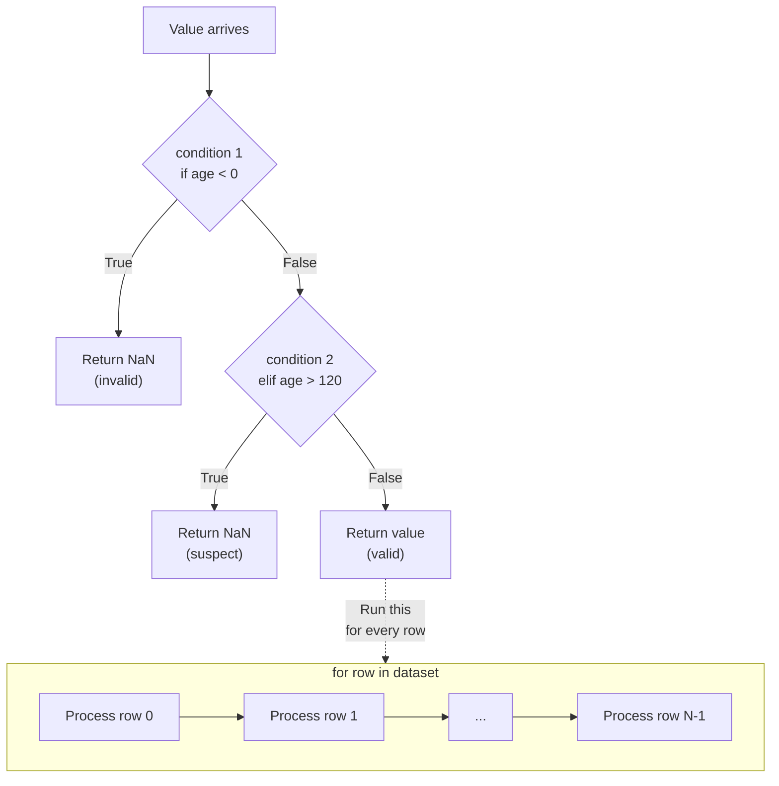

# Conditions and Iterations in Data Analysis

**After this lesson:** you can explain the core ideas in “Conditions and Iterations in Data Analysis” and reproduce the examples here in your own notebook or environment.

> **Best for Visualization:** Loops and conditions are AMAZING in Python Tutor - watch the flow!

> **AI Starter:** "Explain if-else statements using real-world decision-making examples"

> **Practice:** Run the examples locally or in [Google Colab](https://colab.research.google.com). This submodule ships notebooks for [basic syntax](./notebooks/01-basic-syntax.ipynb), [data structures](./notebooks/02-data-structures.ipynb), and [functions](./notebooks/03-functions.ipynb); paste loop and branch examples there if you want a notebook environment.

### Video

<div class="video-embed">
<iframe width="560" height="315" src="https://www.youtube.com/embed/6iF8Xb7Z3wQ" frameborder="0" allow="accelerometer; autoplay; clipboard-write; encrypted-media; gyroscope; picture-in-picture" allowfullscreen></iframe>
</div>

*Corey Schafer — Loops and iteration in Python*

**How this fits together:** `if` / `elif` / `else` choose what runs once; `for` and `while` repeat work. Data pipelines use both: **validate** a row with branches, **scan** a table with loops, or prefer vectorized NumPy/pandas later. Master the ideas here so you can read any script that filters, iterates, or retries.



*`if/elif/else` picks one branch per value; a `for` loop runs the same block for every item in a collection.*

## Making Decisions with Conditions

---

### Understanding If Statements in Data Analysis

Conditions are crucial for data filtering and validation:

```python
import pandas as pd
import numpy as np

# Data validation example
def validate_age(age):
   if age < 0:
       return np.nan  # Invalid age
   elif age > 120:
       return np.nan  # Likely invalid age
   else:
       return age

# Handling missing values
def process_value(value):
   if pd.isna(value):
       return 0  # Replace missing with default
   elif np.isinf(value):
       return np.nan  # Handle infinity
   else:
       return value
```

 **Remember**: Always validate your data before analysis!

> **Watch Control Flow:**
> Paste this into Python Tutor - watch which branch executes!
> ```python
> age = 25
> 
> if age < 18:
>   category = "Minor"
>   discount = 0.1
> elif age < 65:
>   category = "Adult"
>   discount = 0
> else:
>   category = "Senior"
>   discount = 0.2
> 
> print(f"{category}: {discount * 100}% discount")
> ```

```
Adult: 0% discount
```

> **Experiment:** Ask AI: "Create 5 real-world scenarios that use if-elif-else"

---

### If-Else in Data Processing

Common data processing scenarios:

```python
import pandas as pd

# Data quality check
def check_data_quality(df):
   if df.isnull().sum().any():
       print("Warning: Dataset contains missing values")
       missing_stats = df.isnull().sum()
       print(f"Missing value counts:\n{missing_stats}")
   else:
       print("Data quality check passed: No missing values")

# Outlier detection
def flag_outlier(value, mean, std):
   if abs(value - mean) > 3 * std:
       return 'outlier'
   else:
       return 'normal'
```

Real-world example:

```python
# Sales data analysis
def analyze_sales_performance(sales_value, target):
   if sales_value >= target * 1.2:
       return 'Exceptional'
   elif sales_value >= target:
       return 'Met Target'
   elif sales_value >= target * 0.8:
       return 'Near Target'
   else:
       return 'Below Target'
```

---

### Multiple Conditions in Data Analysis

Complex data processing decisions:

<div class="code-explainer" data-code-explainer>
<div class="code-explainer__code">


import pandas as pd
import numpy as np

def categorize_customer(purchase_amount, frequency, tenure):
   """Categorize customer based on multiple metrics"""
   if purchase_amount > 1000 and frequency > 12:
       if tenure > 2:
           return 'Premium'
       else:
           return 'High Value'
   elif purchase_amount > 500 or frequency > 6:
       return 'Regular'
   else:
       return 'Standard'

# Data transformation example
def transform_value(value, data_type):
   if pd.isna(value):
       return np.nan
   elif data_type == 'numeric':
       if isinstance(value, str):
           try:
               return float(value.replace(',', ''))
           except ValueError:
               return np.nan
       else:
           return float(value)
   elif data_type == 'categorical':
       return str(value).lower().strip()
   else:
       return value


</div>
<aside class="code-explainer__callouts" aria-label="Code walkthrough">
  <div class="code-callout" data-lines="1-2" data-tint="1">
    <div class="code-callout__meta">
      <span class="code-callout__lines"></span>
      <span class="code-callout__title">Imports</span>
    </div>
    <div class="code-callout__body">
      <p>Both pandas and NumPy are imported at the top since the functions below rely on pandas null checks and NumPy NaN.</p>
    </div>
  </div>
  <div class="code-callout" data-lines="4-15" data-tint="2">
    <div class="code-callout__meta">
      <span class="code-callout__lines"></span>
      <span class="code-callout__title">Customer Segmentation</span>
    </div>
    <div class="code-callout__body">
      <p>Combines <code>and</code> / <code>or</code> and nested <code>if</code> to segment customers into four tiers based on spend, frequency, and tenure.</p>
    </div>
  </div>
  <div class="code-callout" data-lines="17-31" data-tint="3">
    <div class="code-callout__meta">
      <span class="code-callout__lines"></span>
      <span class="code-callout__title">Type-Aware Transform</span>
    </div>
    <div class="code-callout__body">
      <p>Guards against null and infinity first, then branches on <code>data_type</code> to coerce numeric strings or normalise categorical strings.</p>
    </div>
  </div>
</aside>
</div>

---

### Nested Conditions in Feature Engineering

Complex feature creation:

<div class="code-explainer" data-code-explainer>
<div class="code-explainer__code">


def create_age_features(df):
   """Create age-related features for analysis"""

   def categorize_age(age, gender):
       if pd.isna(age):
           return 'Unknown'
       else:
           if gender == 'F':
               if age < 25:
                   return 'Young Adult Female'
               elif age < 45:
                   return 'Adult Female'
               else:
                   return 'Senior Female'
           else:  # gender == 'M'
               if age < 25:
                   return 'Young Adult Male'
               elif age < 45:
                   return 'Adult Male'
               else:
                   return 'Senior Male'

   df['age_category'] = df.apply(
       lambda row: categorize_age(row['age'], row['gender']),
       axis=1
   )
   return df


</div>
<aside class="code-explainer__callouts" aria-label="Code walkthrough">
  <div class="code-callout" data-lines="1-21" data-tint="1">
    <div class="code-callout__meta">
      <span class="code-callout__lines"></span>
      <span class="code-callout__title">Nested Age Classifier</span>
    </div>
    <div class="code-callout__body">
      <p>The inner function handles a null guard first, then branches on gender, then on age brackets—three levels of nesting for six distinct labels.</p>
    </div>
  </div>
  <div class="code-callout" data-lines="23-27" data-tint="2">
    <div class="code-callout__meta">
      <span class="code-callout__lines"></span>
      <span class="code-callout__title">Row-Wise Apply</span>
    </div>
    <div class="code-callout__body">
      <p>Uses <code>df.apply(..., axis=1)</code> to call the inner function once per row, passing both the <code>age</code> and <code>gender</code> columns as a unit.</p>
    </div>
  </div>
</aside>
</div>

## Data Filtering and Comparison

---

### Comparison Operations in Pandas

Efficient data filtering:

```python
import pandas as pd
import numpy as np

# Load sample data
df = pd.DataFrame({
   'value': [10, 20, 30, 40, 50],
   'category': ['A', 'B', 'A', 'B', 'C']
})

# Single condition
high_values = df[df['value'] > 30]

# Multiple conditions
filtered_data = df[
   (df['value'] > 20) & 
   (df['category'] == 'A')
]

# Complex filtering
def filter_outliers(df, columns, n_std=3):
   """Filter outliers based on standard deviation"""
   for col in columns:
       mean = df[col].mean()
       std = df[col].std()
       df = df[
           (df[col] >= mean - n_std * std) &
           (df[col] <= mean + n_std * std)
       ]
   return df
```

 **Performance Tip**: Use vectorized operations instead of loops for filtering!

> **Speed Comparison:**
> Run this in Google Colab to see the difference:
> ```python
> import pandas as pd
> import numpy as np
> import time
> 
> # Create large dataset
> df = pd.DataFrame({'value': np.random.randint(0, 100, 1000000)})
> 
> # Slow: Loop approach
> start = time.time()
> result = []
> for val in df['value']:
>   if val > 50:
>     result.append(val)
> loop_time = time.time() - start
> 
> # Fast: Vectorized approach
> start = time.time()
> result = df[df['value'] > 50]
> vector_time = time.time() - start
> 
> print(f"Loop: {loop_time:.4f}s")
> print(f"Vectorized: {vector_time:.4f}s")
> print(f"Speedup: {loop_time/vector_time:.1f}x faster!")
> ```

```
Loop: 0.0535s
Vectorized: 0.0029s
Speedup: 18.6x faster!
```

> **Learn Why:** Ask: "Why are vectorized operations faster than loops in pandas?"

---

### Logical Operations in Data Analysis

Combining multiple conditions:

<div class="code-explainer" data-code-explainer>
<div class="code-explainer__code">


import pandas as pd

# Data quality checks
def check_data_validity(df):
   """Check various data quality conditions"""

   conditions = {
       'missing_values': df.isnull().sum().sum() > 0,
       'negative_values': (df.select_dtypes(include=[np.number]) < 0).any().any(),
       'duplicates': df.duplicated().any(),
       'outliers': detect_outliers(df)
   }

   if any(conditions.values()):
       print("Data quality issues found:")
       for issue, exists in conditions.items():
           if exists:
               print(f"- {issue.replace('_', ' ').title()}")
       return False
   else:
       print("All data quality checks passed")
       return True

def detect_outliers(df, threshold=3):
   """Detect outliers using Z-score method"""
   numeric_cols = df.select_dtypes(include=[np.number]).columns
   has_outliers = False

   for col in numeric_cols:
       z_scores = np.abs((df[col] - df[col].mean()) / df[col].std())
       if (z_scores > threshold).any():
           has_outliers = True
           break

   return has_outliers


</div>
<aside class="code-explainer__callouts" aria-label="Code walkthrough">
  <div class="code-callout" data-lines="1-3" data-tint="1">
    <div class="code-callout__meta">
      <span class="code-callout__lines"></span>
      <span class="code-callout__title">Import</span>
    </div>
    <div class="code-callout__body">
      <p>Only pandas is imported here; NumPy is used via <code>np</code> from the surrounding module scope.</p>
    </div>
  </div>
  <div class="code-callout" data-lines="4-22" data-tint="2">
    <div class="code-callout__meta">
      <span class="code-callout__lines"></span>
      <span class="code-callout__title">Validity Check</span>
    </div>
    <div class="code-callout__body">
      <p>Evaluates four quality conditions into a dict, then loops over any that are True to print a labelled report—returns False if any issue is found.</p>
    </div>
  </div>
  <div class="code-callout" data-lines="24-35" data-tint="3">
    <div class="code-callout__meta">
      <span class="code-callout__lines"></span>
      <span class="code-callout__title">Outlier Detection</span>
    </div>
    <div class="code-callout__body">
      <p>Computes Z-scores per numeric column and short-circuits with <code>break</code> on the first column that exceeds the threshold, avoiding unnecessary work.</p>
    </div>
  </div>
</aside>
</div>

## Efficient Data Iteration

---

### Vectorized Operations vs. Loops

Understanding performance implications:

<div class="code-explainer" data-code-explainer>
<div class="code-explainer__code">


import pandas as pd
import numpy as np

# Slow: Using loops
def slow_calculation(df):
   results = []
   for index, row in df.iterrows():
       value = row['value']
       if value > 0:
           results.append(np.log(value))
       else:
           results.append(np.nan)
   return results

# Fast: Using vectorized operations
def fast_calculation(df):
   return np.where(
       df['value'] > 0,
       np.log(df['value']),
       np.nan
   )

# Fast: Using pandas methods
def process_data(df):
   # Calculate statistics
   df['z_score'] = (df['value'] - df['value'].mean()) / df['value'].std()

   # Apply multiple conditions
   conditions = [
       (df['z_score'] < -2),
       (df['z_score'] >= -2) & (df['z_score'] <= 2),
       (df['z_score'] > 2)
   ]
   choices = ['Low', 'Normal', 'High']

   df['category'] = np.select(conditions, choices, default='Unknown')
   return df


</div>
<aside class="code-explainer__callouts" aria-label="Code walkthrough">
  <div class="code-callout" data-lines="1-13" data-tint="1">
    <div class="code-callout__meta">
      <span class="code-callout__lines"></span>
      <span class="code-callout__title">Loop Approach</span>
    </div>
    <div class="code-callout__body">
      <p>Iterates row-by-row with <code>iterrows()</code>, branching on sign to compute <code>log</code> or append NaN—correct but slow for large DataFrames.</p>
    </div>
  </div>
  <div class="code-callout" data-lines="15-21" data-tint="2">
    <div class="code-callout__meta">
      <span class="code-callout__lines"></span>
      <span class="code-callout__title">Vectorized Equivalent</span>
    </div>
    <div class="code-callout__body">
      <p><code>np.where</code> applies the same condition across the entire column at once—no Python loop, so typically 10–100x faster.</p>
    </div>
  </div>
  <div class="code-callout" data-lines="23-37" data-tint="3">
    <div class="code-callout__meta">
      <span class="code-callout__lines"></span>
      <span class="code-callout__title">Multi-Label Select</span>
    </div>
    <div class="code-callout__body">
      <p>Computes a Z-score column then uses <code>np.select</code> with three boolean masks to assign Low / Normal / High labels in a single vectorised pass.</p>
    </div>
  </div>
</aside>
</div>

---

### Efficient Iteration When Necessary

Some cases require iteration:

<div class="code-explainer" data-code-explainer>
<div class="code-explainer__code">


import pandas as pd
from tqdm import tqdm # Progress bar

def process_large_dataset(df, chunk_size=1000):
   """Process large dataset in chunks"""
   results = []

   # Iterate over chunks
   for i in tqdm(range(0, len(df), chunk_size)):
       chunk = df.iloc[i:i + chunk_size].copy()

       # Process chunk
       processed_chunk = process_chunk(chunk)
       results.append(processed_chunk)

   return pd.concat(results)

def process_chunk(chunk):
   """Process individual chunk of data"""
   # Perform calculations
   chunk['calculated'] = chunk['value'].apply(complex_calculation)

   # Apply transformations
   chunk['transformed'] = np.where(
       chunk['calculated'] > 0,
       np.log(chunk['calculated']),
       0
   )

   return chunk


</div>
<aside class="code-explainer__callouts" aria-label="Code walkthrough">
  <div class="code-callout" data-lines="1-2" data-tint="1">
    <div class="code-callout__meta">
      <span class="code-callout__lines"></span>
      <span class="code-callout__title">Imports</span>
    </div>
    <div class="code-callout__body">
      <p>Imports <code>tqdm</code> alongside pandas to wrap the chunk loop in a progress bar so long-running jobs show their progress.</p>
    </div>
  </div>
  <div class="code-callout" data-lines="4-16" data-tint="2">
    <div class="code-callout__meta">
      <span class="code-callout__lines"></span>
      <span class="code-callout__title">Chunk Iteration</span>
    </div>
    <div class="code-callout__body">
      <p>Steps through the DataFrame in <code>chunk_size</code> slices using <code>iloc</code>, processes each chunk separately, then concatenates all results at the end.</p>
    </div>
  </div>
  <div class="code-callout" data-lines="18-30" data-tint="3">
    <div class="code-callout__meta">
      <span class="code-callout__lines"></span>
      <span class="code-callout__title">Chunk Processing</span>
    </div>
    <div class="code-callout__body">
      <p>Applies a custom calculation per value, then uses <code>np.where</code> to log-transform positive results and set zeros for non-positive ones.</p>
    </div>
  </div>
</aside>
</div>

 **Performance Tip**: Use chunking for large datasets that don't fit in memory!

---

### Working with Time Series Data

Efficient time series processing:

<div class="code-explainer" data-code-explainer>
<div class="code-explainer__code">


import pandas as pd

def analyze_time_series(df):
   """Analyze time series data with rolling windows"""

   # Sort by date
   df = df.sort_values('date')

   # Calculate rolling statistics
   df['rolling_mean'] = df['value'].rolling(window=7).mean()
   df['rolling_std'] = df['value'].rolling(window=7).std()

   # Detect trends
   df['trend'] = np.where(
       df['rolling_mean'] > df['rolling_mean'].shift(1),
       'Upward',
       'Downward'
   )

   return df

def process_by_group(df, group_col, value_col):
   """Process data by groups efficiently"""

   def group_operation(group):
       return pd.Series({
           'mean': group[value_col].mean(),
           'std': group[value_col].std(),
           'count': len(group),
           'has_outliers': detect_outliers(group[value_col])
       })

   return df.groupby(group_col).apply(group_operation)


</div>
<aside class="code-explainer__callouts" aria-label="Code walkthrough">
  <div class="code-callout" data-lines="1" data-tint="1">
    <div class="code-callout__meta">
      <span class="code-callout__lines"></span>
      <span class="code-callout__title">Import</span>
    </div>
    <div class="code-callout__body">
      <p>Only pandas is needed here; NumPy is accessed via the module-level <code>np</code> alias for the trend comparison.</p>
    </div>
  </div>
  <div class="code-callout" data-lines="3-20" data-tint="2">
    <div class="code-callout__meta">
      <span class="code-callout__lines"></span>
      <span class="code-callout__title">Rolling Window Analysis</span>
    </div>
    <div class="code-callout__body">
      <p>Sorts by date, computes 7-day rolling mean and standard deviation, then classifies each point as Upward or Downward by comparing the mean to its previous value.</p>
    </div>
  </div>
  <div class="code-callout" data-lines="22-33" data-tint="3">
    <div class="code-callout__meta">
      <span class="code-callout__lines"></span>
      <span class="code-callout__title">Group Statistics</span>
    </div>
    <div class="code-callout__body">
      <p>Applies an inner function to each group that returns a Series of summary stats—mean, std, count, and an outlier flag—via <code>groupby.apply</code>.</p>
    </div>
  </div>
</aside>
</div>

## Common Data Processing Patterns

---

### Pattern: Data Validation

Common validation patterns:

<div class="code-explainer" data-code-explainer>
<div class="code-explainer__code">


import pandas as pd
import numpy as np

class DataValidator:
   def __init__(self, df):
       self.df = df
       self.validation_results = []

   def validate_numeric_range(self, column, min_val, max_val):
       """Validate numeric values are within range"""
       mask = self.df[column].between(min_val, max_val)
       invalid = self.df[~mask]
       if len(invalid) > 0:
           self.validation_results.append(
               f"Found {len(invalid)} values outside range "
               f"[{min_val}, {max_val}] in {column}"
           )

   def validate_categorical(self, column, valid_categories):
       """Validate categorical values"""
       invalid = self.df[~self.df[column].isin(valid_categories)]
       if len(invalid) > 0:
           self.validation_results.append(
               f"Found {len(invalid)} invalid categories in {column}"
           )

   def get_validation_report(self):
       """Generate validation report"""
       if self.validation_results:
           return "\n".join(self.validation_results)
       return "All validations passed"


</div>
<aside class="code-explainer__callouts" aria-label="Code walkthrough">
  <div class="code-callout" data-lines="1-8" data-tint="1">
    <div class="code-callout__meta">
      <span class="code-callout__lines"></span>
      <span class="code-callout__title">Validator Init</span>
    </div>
    <div class="code-callout__body">
      <p>Stores the DataFrame and an empty list for accumulating issue messages so all checks can be batched before reporting.</p>
    </div>
  </div>
  <div class="code-callout" data-lines="10-18" data-tint="2">
    <div class="code-callout__meta">
      <span class="code-callout__lines"></span>
      <span class="code-callout__title">Range Validation</span>
    </div>
    <div class="code-callout__body">
      <p>Uses <code>between</code> to create a boolean mask, inverts it to find out-of-range rows, and appends a message only when violations exist.</p>
    </div>
  </div>
  <div class="code-callout" data-lines="20-30" data-tint="3">
    <div class="code-callout__meta">
      <span class="code-callout__lines"></span>
      <span class="code-callout__title">Category Validation and Report</span>
    </div>
    <div class="code-callout__body">
      <p>Checks that all values are in the allowed set using <code>isin</code>, then <code>get_validation_report</code> joins all collected messages or returns a pass confirmation.</p>
    </div>
  </div>
</aside>
</div>

---

### Pattern: Data Cleaning

Standard cleaning operations:

<div class="code-explainer" data-code-explainer>
<div class="code-explainer__code">


class DataCleaner:
   def __init__(self, df):
       self.df = df.copy()

   def clean_numeric(self, column):
       """Clean numeric column"""
       # Replace invalid values with NaN
       self.df[column] = pd.to_numeric(
           self.df[column],
           errors='coerce'
       )

       # Remove outliers
       z_scores = np.abs(
           (self.df[column] - self.df[column].mean()) /
           self.df[column].std()
       )
       self.df.loc[z_scores > 3, column] = np.nan

   def clean_categorical(self, column):
       """Clean categorical column"""
       # Standardize categories
       self.df[column] = self.df[column].str.lower().str.strip()

       # Replace rare categories
       value_counts = self.df[column].value_counts()
       rare_categories = value_counts[value_counts < 10].index
       self.df.loc[
           self.df[column].isin(rare_categories),
           column
       ] = 'other'

   def get_cleaned_data(self):
       """Return cleaned dataset"""
       return self.df


</div>
<aside class="code-explainer__callouts" aria-label="Code walkthrough">
  <div class="code-callout" data-lines="1-3" data-tint="1">
    <div class="code-callout__meta">
      <span class="code-callout__lines"></span>
      <span class="code-callout__title">Safe Copy Init</span>
    </div>
    <div class="code-callout__body">
      <p>Makes a copy of the DataFrame at construction so the original is never mutated by the cleaning methods.</p>
    </div>
  </div>
  <div class="code-callout" data-lines="5-18" data-tint="2">
    <div class="code-callout__meta">
      <span class="code-callout__lines"></span>
      <span class="code-callout__title">Numeric Cleaning</span>
    </div>
    <div class="code-callout__body">
      <p>Coerces non-numeric strings to NaN with <code>pd.to_numeric</code>, then nulls out values whose Z-score exceeds 3 standard deviations.</p>
    </div>
  </div>
  <div class="code-callout" data-lines="20-34" data-tint="3">
    <div class="code-callout__meta">
      <span class="code-callout__lines"></span>
      <span class="code-callout__title">Categorical Cleaning</span>
    </div>
    <div class="code-callout__body">
      <p>Lowercases and strips whitespace for consistency, then collapses infrequent categories (fewer than 10 rows) into <code>'other'</code> to reduce cardinality.</p>
    </div>
  </div>
</aside>
</div>

## Practice Exercises

> **Pro Tip:** Start with simple examples in Python Tutor, then scale up in Colab!

### Exercise 1: Grade Calculator
```python
def assign_grade(score):
   """
   Assign letter grade based on score:
   90-100: A
   80-89: B
   70-79: C
   60-69: D
   Below 60: F
   """
   # Your code here...
   pass

# Test with multiple scores
scores = [95, 87, 73, 62, 58, 91]
for score in scores:
   grade = assign_grade(score)
   print(f"Score {score}: Grade {grade}")
```

```
Score 95: Grade None
Score 87: Grade None
Score 73: Grade None
Score 62: Grade None
Score 58: Grade None
Score 91: Grade None
```

> **Visualize:** Paste into Python Tutor to see the loop iterate!
> **Ask:** "What are best practices for grade boundaries in code?"

### Exercise 2: Data Validator with Loops
```python
def validate_dataset(data):
   """
   Check each value in data:
   - Flag if negative
   - Flag if above 1000
   - Count valid values
   - Return report
   """
   report = {
       'total': 0,
       'valid': 0,
       'negative': 0,
       'too_high': 0
   }
   
   # Your code here...
   
   return report

# Test it:
test_data = [10, -5, 50, 1200, 30, -10, 800, 45]
result = validate_dataset(test_data)
print(result)
```

```
{'total': 0, 'valid': 0, 'negative': 0, 'too_high': 0}
```

> **Watch Counters:** Python Tutor shows how report values update in the loop!
> **Improve:** "Suggest ways to make this validation function more robust"

### Exercise 3: Nested Loops for Matrix Operations
```python
def process_matrix(matrix):
   """
   Process a 2D matrix:
   - Find max value in each row
   - Calculate sum of each column
   - Find overall maximum
   """
   # Example matrix:
   # [[1, 2, 3],
   #  [4, 5, 6],
   #  [7, 8, 9]]
   
   # Your code here...
   pass

# Test it:
matrix = [
   [10, 20, 30],
   [40, 50, 60],
   [70, 80, 90]
]
result = process_matrix(matrix)
```

> **Nested Loop Visualization:** Python Tutor makes nested loops crystal clear!
> **Challenge:** "Show me how to do this with numpy instead of loops"

### Exercise 4: While Loop for Data Processing
```python
def process_until_threshold(data, threshold=100):
   """
   Process data items until sum reaches threshold:
   - Add values one by one
   - Stop when threshold reached
   - Return: items used, total, remaining items
   """
   # Your code here...
   pass

# Test it:
values = [10, 20, 15, 30, 25, 40, 20]
used, total, remaining = process_until_threshold(values, threshold=100)
print(f"Used {used} items, Total: {total}, Remaining: {remaining}")
```

> **Safety First:** Python Tutor helps catch infinite loops before they crash!
> **Learn:** "When should I use while loops vs for loops?"

## Advanced Challenges

### Challenge 1: Fizz Buzz (Classic Interview Question!)
```python
# Print numbers 1-100, but:
# - "Fizz" for multiples of 3
# - "Buzz" for multiples of 5
# - "FizzBuzz" for multiples of both
# Your code here...
```

### Challenge 2: Pattern Matching
Create a function that finds patterns in data sequences.

### Challenge 3: Data Grouping
Group data into categories based on multiple conditions.

> **Video Help:** [Video Resources](./video-resources.md) - Loops & Conditions section

## Common Mistakes & Debugging

### Mistake 1: Infinite Loops
```python
# Wrong (avoid):
i = 0
while i < 5:
   print(i)
   # Forgot to increment!

# Right (preferred):
i = 0
while i < 5:
   print(i)
   i += 1
```

> **Catch It Early:** Python Tutor shows you're stuck before you crash!

### Mistake 2: Off-by-One Errors
```python
# Common mistake
numbers = [10, 20, 30, 40, 50]

# Wrong (avoid):
for i in range(len(numbers)):
   print(numbers[i + 1])  # Will crash!

# Right (preferred):
for i in range(len(numbers)):
   print(numbers[i])

# Better (preferred):
for number in numbers:
   print(number)
```

> **See The Error:** Python Tutor shows exactly where index goes out of bounds!

### Mistake 3: Modifying List While Iterating
```python
# Wrong (avoid):
numbers = [1, 2, 3, 4, 5]
for num in numbers:
   if num % 2 == 0:
       numbers.remove(num)  # Dangerous!

# Right (preferred):
numbers = [1, 2, 3, 4, 5]
numbers = [num for num in numbers if num % 2 != 0]
```

> **Debug:** "Why shouldn't I modify a list while iterating over it?"

Remember:

- Use vectorized operations when possible
- Consider memory efficiency 
- Handle edge cases
- Validate results
- **Visualize loops in Python Tutor to understand flow**
- **Use AI to debug logical errors**
- **Test with edge cases (empty lists, single items, etc.)**

## Common pitfalls

- **Off-by-one errors** — Check whether your range includes the last index; **range(len(x))** vs **range(len(x)-1)** trips people up.
- **Modifying a list while iterating** — Prefer building a new list or iterate over a copy.
- **Infinite loops** — Ensure the condition can become false (especially with **while**).

## Next steps

Continue to [Functions](./functions.md) to package logic into reusable pieces.

Happy analyzing!
