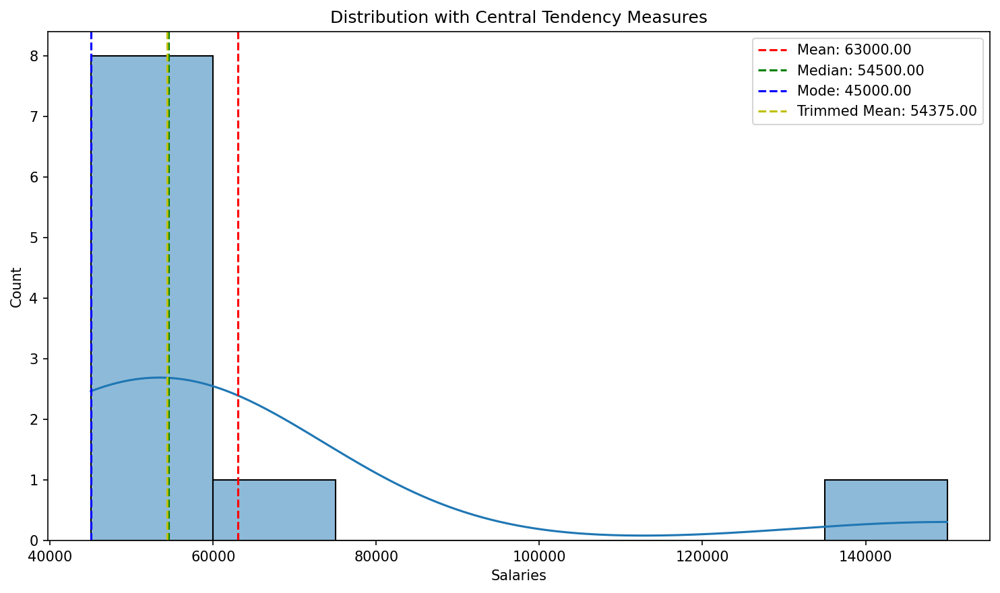
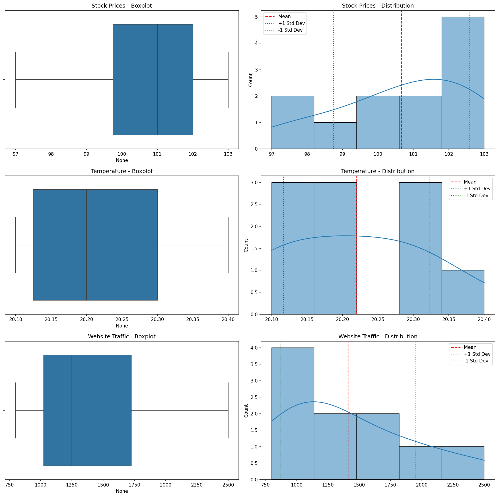
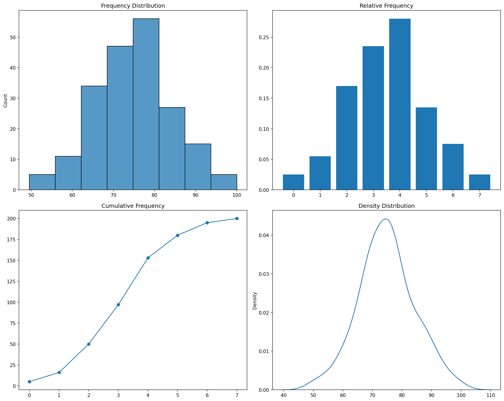
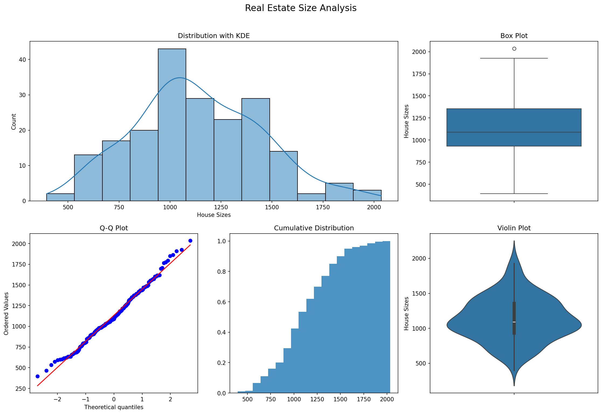

# One-Variable Statistics with Python

**After this lesson:** you can explain the core ideas in “One-Variable Statistics with Python” and reproduce the examples here in your own notebook or environment.

### Video

<div class="video-embed">
<iframe width="560" height="315" src="https://www.youtube.com/embed/IFKQLDmRK0Y" frameborder="0" allow="accelerometer; autoplay; clipboard-write; encrypted-media; gyroscope; picture-in-picture" allowfullscreen></iframe>
</div>

*StatQuest with Josh Starmer — Quantiles and percentiles, clearly explained*

## Overview

**Prerequisites:** Python basics and [Introduction to Statistics](./README.md) context; optional NumPy for the examples.

**Why this lesson:** Before comparing groups or fitting models, you must **summarize one column** well: center, spread, shape, and outliers. Those numbers (`describe`, mean/median, quartiles, histograms) are the vocabulary for every later statistics and ML lesson.

## Understanding One-Variable Statistics

### What is One-Variable Statistics?

**Univariate** (one-variable) statistics describes a **single** column or measurement: where it sits, how wide it is, and whether it is skewed. Let's explore with Python:

```python
import numpy as np
import pandas as pd
import matplotlib.pyplot as plt
import seaborn as sns

# Sample dataset: Student test scores
scores = np.array([75, 82, 95, 68, 90, 88, 76, 89, 94, 83])

# Create a pandas Series for better analysis
scores_series = pd.Series(scores, name='Test Scores')

# Basic summary
print("Summary Statistics:")
print(scores_series.describe())

# Visualize distribution
plt.figure(figsize=(10, 6))
sns.histplot(scores_series, kde=True)
plt.title('Distribution of Test Scores')
plt.show()
```


```
Summary Statistics:
count    10.000000
mean     84.000000
std       8.844333
min      68.000000
25%      77.500000
50%      85.500000
75%      89.750000
max      95.000000
Name: Test Scores, dtype: float64
```

This gives us a quick overview of:

- Central tendency (mean, median)
- Spread (std, quartiles)
- Distribution shape

---

### Real-World Applications

Let's analyze real estate data:

<div class="code-explainer" data-code-explainer>
<div class="code-explainer__code">


# Sample house prices (in thousands)
house_prices = pd.Series([
    250, 280, 295, 310, 460, 475,
    285, 290, 310, 330, 380, 400
], name='House Prices ($K)')

def analyze_distribution(data: pd.Series) -> None:
    """Analyze and visualize data distribution"""
    stats = {
        'mean': data.mean(),
        'median': data.median(),
        'std': data.std(),
        'skewness': data.skew(),
        'kurtosis': data.kurtosis()
    }

    print("\nDistribution Analysis:")
    for stat, value in stats.items():
        print(f"{stat.title()}: {value:.2f}")

    fig, (ax1, ax2) = plt.subplots(1, 2, figsize=(15, 5))

    sns.histplot(data, kde=True, ax=ax1)
    ax1.axvline(stats['mean'], color='r', linestyle='--',
                label=f"Mean: {stats['mean']:.2f}")
    ax1.axvline(stats['median'], color='g', linestyle='--',
                label=f"Median: {stats['median']:.2f}")
    ax1.legend()
    ax1.set_title('Distribution with Mean and Median')

    sns.boxplot(y=data, ax=ax2)
    ax2.set_title('Boxplot with Quartiles')

    plt.tight_layout()
    plt.show()

# Analyze house prices
analyze_distribution(house_prices)


<figure>

<figcaption>Figure 1: Distribution with Mean and Median</figcaption>
</figure>

```

Distribution Analysis:
Mean: 338.75
Median: 310.00
Std: 73.21
Skewness: 0.92
Kurtosis: -0.35
```


</div>
<aside class="code-explainer__callouts" aria-label="Code walkthrough">
  <div class="code-callout" data-lines="1-5" data-tint="1">
    <div class="code-callout__meta">
      <span class="code-callout__lines"></span>
      <span class="code-callout__title">Sample Data</span>
    </div>
    <div class="code-callout__body">
      <p>Creates a pandas Series of house prices in thousands—small enough to inspect but realistic enough to show skew.</p>
    </div>
  </div>
  <div class="code-callout" data-lines="7-21" data-tint="2">
    <div class="code-callout__meta">
      <span class="code-callout__lines"></span>
      <span class="code-callout__title">Five-Number Summary</span>
    </div>
    <div class="code-callout__body">
      <p>Computes mean, median, std, skewness, and kurtosis into a dict then prints each—covering center, spread, and shape in one pass.</p>
    </div>
  </div>
  <div class="code-callout" data-lines="23-37" data-tint="3">
    <div class="code-callout__meta">
      <span class="code-callout__lines"></span>
      <span class="code-callout__title">Dual-Panel Plot</span>
    </div>
    <div class="code-callout__body">
      <p>Plots a histogram+KDE with mean and median reference lines on the left, and a boxplot showing quartiles and outliers on the right.</p>
    </div>
  </div>
</aside>
</div>


```

Distribution Analysis:
Mean: 338.75
Median: 310.00
Std: 73.21
Skewness: 0.92
Kurtosis: -0.35
```

## Measures of Central Tendency

---

### Mean, Median, and Mode in Python

Let's implement all three measures:

<div class="code-explainer" data-code-explainer>
<div class="code-explainer__code">


class CentralTendency:
    """Calculate and compare central tendency measures"""

    def __init__(self, data: pd.Series):
        self.data = data
        self.results = self._calculate_measures()

    def _calculate_measures(self) -> dict:
        """Calculate all central tendency measures"""
        return {
            'mean': self.data.mean(),
            'median': self.data.median(),
            'mode': self.data.mode()[0],
            'trimmed_mean': stats.trim_mean(self.data, 0.1)
        }

    def compare_measures(self) -> None:
        """Compare different measures visually"""
        plt.figure(figsize=(10, 6))
        sns.histplot(self.data, kde=True)

        colors = ['r', 'g', 'b', 'y']
        labels = ['Mean', 'Median', 'Mode', 'Trimmed Mean']

        for (measure, value), color, label in zip(
            self.results.items(), colors, labels
        ):
            plt.axvline(
                value, color=color, linestyle='--',
                label=f"{label}: {value:.2f}"
            )

        plt.title('Distribution with Central Tendency Measures')
        plt.legend()
        plt.show()

    def print_summary(self) -> None:
        """Print summary of central tendency measures"""
        print("\nCentral Tendency Measures:")
        for measure, value in self.results.items():
            print(f"{measure.title()}: {value:.2f}")

# Example with salary data
salaries = pd.Series([
    45000, 48000, 51000, 52000, 54000,
    55000, 57000, 58000, 60000, 150000
], name='Salaries')

ct = CentralTendency(salaries)
ct.print_summary()
ct.compare_measures()


<figure>

<figcaption>Figure 2: Distribution with Central Tendency Measures</figcaption>
</figure>

```

Central Tendency Measures:
Mean: 63000.00
Median: 54500.00
Mode: 45000.00
Trimmed_Mean: 54375.00
```


</div>
<aside class="code-explainer__callouts" aria-label="Code walkthrough">
  <div class="code-callout" data-lines="1-15" data-tint="1">
    <div class="code-callout__meta">
      <span class="code-callout__lines"></span>
      <span class="code-callout__title">Four Measures</span>
    </div>
    <div class="code-callout__body">
      <p>Computes mean, median, mode, and a 10%-trimmed mean at construction time so all visualisation and print methods share the same pre-calculated dict.</p>
    </div>
  </div>
  <div class="code-callout" data-lines="17-34" data-tint="2">
    <div class="code-callout__meta">
      <span class="code-callout__lines"></span>
      <span class="code-callout__title">Visual Comparison</span>
    </div>
    <div class="code-callout__body">
      <p>Overlays four coloured vertical lines on the histogram so you can see how far the mean is pulled from the median by the outlier salary of 150,000.</p>
    </div>
  </div>
  <div class="code-callout" data-lines="36-50" data-tint="3">
    <div class="code-callout__meta">
      <span class="code-callout__lines"></span>
      <span class="code-callout__title">Print and Demo</span>
    </div>
    <div class="code-callout__body">
      <p>Prints each measure and runs the visualization on a salary series that includes one outlier at 150,000 to show mean distortion.</p>
    </div>
  </div>
</aside>
</div>


```

Central Tendency Measures:
Mean: 63000.00
Median: 54500.00
Mode: 45000.00
Trimmed_Mean: 54375.00
```

 **Pro Tip**: Use `trimmed_mean` when your data has outliers but you still want to use a mean-like measure!

---

### When to Use Each Measure

Let's create a function to help choose the appropriate measure:

```python
def recommend_central_measure(data: pd.Series) -> str:
    """Recommend appropriate central tendency measure"""
    # Calculate key statistics
    skewness = data.skew()
    has_outliers = (
        np.abs(stats.zscore(data)) > 3
    ).any()
    is_symmetric = abs(skewness) < 0.5
    
    # Create recommendation
    if is_symmetric and not has_outliers:
        return (
            "Recommend: Mean\n"
            "Reason: Data is symmetric without outliers"
        )
    elif has_outliers:
        return (
            "Recommend: Median\n"
            "Reason: Data contains outliers"
        )
    else:
        return (
            "Recommend: Both Mean and Median\n"
            "Reason: Data is moderately skewed"
        )

# Example usage
datasets = {
    'Symmetric': pd.Series(np.random.normal(100, 10, 1000)),
    'With Outliers': pd.Series([*np.random.normal(100, 10, 99), 500]),
    'Skewed': pd.Series(np.random.exponential(5, 1000))
}

for name, data in datasets.items():
    print(f"\n{name} Dataset:")
    print(recommend_central_measure(data))
```

```

Symmetric Dataset:
Recommend: Median
Reason: Data contains outliers

With Outliers Dataset:
Recommend: Median
Reason: Data contains outliers

Skewed Dataset:
Recommend: Median
Reason: Data contains outliers
```

## Measures of Variability

---

### Calculating Spread Measures

Let's create a comprehensive spread analyzer:

<div class="code-explainer" data-code-explainer>
<div class="code-explainer__code">


class SpreadAnalyzer:
    """Analyze data spread using various measures"""

    def __init__(self, data: pd.Series):
        self.data = data
        self.stats = self._calculate_stats()

    def _calculate_stats(self) -> dict:
        """Calculate various spread statistics"""
        q1, q3 = self.data.quantile([0.25, 0.75])
        iqr = q3 - q1
        return {
            'range': self.data.max() - self.data.min(),
            'std': self.data.std(),
            'variance': self.data.var(),
            'mad': self.data.mad(),
            'iqr': iqr,
            'quartiles': {'Q1': q1, 'Q3': q3}
        }

    def identify_outliers(self) -> pd.Series:
        """Identify outliers using IQR method"""
        q1 = self.stats['quartiles']['Q1']
        q3 = self.stats['quartiles']['Q3']
        iqr = self.stats['iqr']
        lower_bound = q1 - 1.5 * iqr
        upper_bound = q3 + 1.5 * iqr
        return self.data[(self.data < lower_bound) | (self.data > upper_bound)]

    def plot_spread(self) -> None:
        """Visualize data spread"""
        fig, (ax1, ax2) = plt.subplots(2, 1, figsize=(12, 10))
        sns.boxplot(x=self.data, ax=ax1)
        ax1.set_title('Boxplot with Quartiles')

        sns.histplot(self.data, kde=True, ax=ax2)
        mean = self.data.mean()
        std = self.stats['std']
        ax2.axvline(mean, color='r', linestyle='--', label='Mean')
        ax2.axvline(mean + std, color='g', linestyle=':', label='+1 Std Dev')
        ax2.axvline(mean - std, color='g', linestyle=':', label='-1 Std Dev')
        ax2.legend()
        ax2.set_title('Distribution with Standard Deviation')
        plt.tight_layout()
        plt.show()

    def print_summary(self) -> None:
        """Print spread analysis summary"""
        print("\nSpread Analysis:")
        for measure, value in self.stats.items():
            if measure != 'quartiles':
                print(f"{measure.title()}: {value:.2f}")
        print("\nQuartiles:")
        for q, v in self.stats['quartiles'].items():
            print(f"{q}: {v:.2f}")
        outliers = self.identify_outliers()
        if len(outliers) > 0:
            print(f"\nFound {len(outliers)} outliers:")
            print(outliers.values)

# Example with temperature data
temperatures = pd.Series([
    18.5, 19.2, 20.1, 19.8, 20.2, 20.5,
    19.9, 20.3, 25.0, 18.9, 19.5, 20.0
], name='Daily Temperatures')

spread = SpreadAnalyzer(temperatures)
spread.print_summary()
spread.plot_spread()


</div>
<aside class="code-explainer__callouts" aria-label="Code walkthrough">
  <div class="code-callout" data-lines="1-19" data-tint="1">
    <div class="code-callout__meta">
      <span class="code-callout__lines"></span>
      <span class="code-callout__title">Spread Statistics</span>
    </div>
    <div class="code-callout__body">
      <p>Computes range, std, variance, MAD, IQR, and Q1/Q3 at init—five spread measures for comprehensive spread characterisation.</p>
    </div>
  </div>
  <div class="code-callout" data-lines="21-27" data-tint="2">
    <div class="code-callout__meta">
      <span class="code-callout__lines"></span>
      <span class="code-callout__title">IQR Outlier Detection</span>
    </div>
    <div class="code-callout__body">
      <p>Uses the 1.5×IQR fence rule—the same logic behind boxplot whiskers—to return a filtered Series of extreme values.</p>
    </div>
  </div>
  <div class="code-callout" data-lines="29-62" data-tint="3">
    <div class="code-callout__meta">
      <span class="code-callout__lines"></span>
      <span class="code-callout__title">Plot and Summary</span>
    </div>
    <div class="code-callout__body">
      <p>Stacks a boxplot and a histogram with ±1 std dev lines, then prints all spread metrics and flags any outliers found by the IQR method.</p>
    </div>
  </div>
</aside>
</div>

---

### Understanding Variability in Context

Let's analyze variability in different scenarios:

<div class="code-explainer" data-code-explainer>
<div class="code-explainer__code">


def compare_variability(datasets: dict) -> None:
    """Compare variability across different datasets"""
    fig, axes = plt.subplots(
        len(datasets), 2, figsize=(15, 5 * len(datasets))
    )
    results = {}

    for (name, data), (ax1, ax2) in zip(datasets.items(), axes):
        stats = {
            'std': data.std(),
            'iqr': data.quantile(0.75) - data.quantile(0.25),
            'cv': data.std() / data.mean()
        }
        results[name] = stats

        sns.boxplot(x=data, ax=ax1)
        ax1.set_title(f'{name} - Boxplot')

        sns.histplot(data, kde=True, ax=ax2)
        ax2.set_title(f'{name} - Distribution')
        mean = data.mean()
        ax2.axvline(mean, color='r', linestyle='--', label='Mean')
        ax2.axvline(mean + stats['std'], color='g', linestyle=':', label='+1 Std Dev')
        ax2.axvline(mean - stats['std'], color='g', linestyle=':', label='-1 Std Dev')
        ax2.legend()

    plt.tight_layout()
    plt.show()

    print("\nVariability Comparison:")
    for measure in ['std', 'iqr', 'cv']:
        print(f"\n{measure.upper()}:")
        for name, st in results.items():
            print(f"{name}: {st[measure]:.3f}")

# Example datasets
datasets = {
    'Stock Prices': pd.Series([100, 102, 101, 103, 98, 99, 102, 101, 100, 103, 97, 102]),
    'Temperature': pd.Series([20.1, 20.3, 20.2, 20.1, 20.4, 20.2, 20.3, 20.1, 20.2, 20.3]),
    'Website Traffic': pd.Series([1000, 1500, 800, 2000, 1200, 1800, 900, 2500, 1100, 1300])
}
compare_variability(datasets)


<figure>

<figcaption>Figure 3: Stock Prices - Boxplot</figcaption>
</figure>

```

Variability Comparison:

STD:
Stock Prices: 1.923
Temperature: 0.103
Website Traffic: 542.525

IQR:
Stock Prices: 2.250
Temperature: 0.175
Website Traffic: 700.000

CV:
Stock Prices: 0.019
Temperature: 0.005
Website Traffic: 0.385
```


</div>
<aside class="code-explainer__callouts" aria-label="Code walkthrough">
  <div class="code-callout" data-lines="1-14" data-tint="1">
    <div class="code-callout__meta">
      <span class="code-callout__lines"></span>
      <span class="code-callout__title">Per-Dataset Stats</span>
    </div>
    <div class="code-callout__body">
      <p>For each dataset computes std, IQR, and coefficient of variation (CV)—CV normalises spread by the mean so datasets on different scales can be compared.</p>
    </div>
  </div>
  <div class="code-callout" data-lines="16-26" data-tint="2">
    <div class="code-callout__meta">
      <span class="code-callout__lines"></span>
      <span class="code-callout__title">Side-by-Side Plots</span>
    </div>
    <div class="code-callout__body">
      <p>Places a boxplot and histogram with ±1 std dev lines for each dataset in its own row so shapes and spreads are visually comparable.</p>
    </div>
  </div>
  <div class="code-callout" data-lines="28-42" data-tint="3">
    <div class="code-callout__meta">
      <span class="code-callout__title">Print Comparison</span>
      <span class="code-callout__lines"></span>
    </div>
    <div class="code-callout__body">
      <p>Prints std, IQR, and CV grouped by measure so you can read down each column to see which dataset is most variable.</p>
    </div>
  </div>
</aside>
</div>


```

Variability Comparison:

STD:
Stock Prices: 1.923
Temperature: 0.103
Website Traffic: 542.525

IQR:
Stock Prices: 2.250
Temperature: 0.175
Website Traffic: 700.000

CV:
Stock Prices: 0.019
Temperature: 0.005
Website Traffic: 0.385
```

## Frequency Distributions and Visualization

---

### Creating Frequency Distributions

Let's create a comprehensive frequency analyzer:

<div class="code-explainer" data-code-explainer>
<div class="code-explainer__code">


class FrequencyAnalyzer:
    """Analyze and visualize frequency distributions"""

    def __init__(self, data: pd.Series, bins: Optional[int] = None):
        self.data = data
        self.bins = bins or self._suggest_bins()
        self.freq_dist = self._calculate_frequency()

    def _suggest_bins(self) -> int:
        """Suggest number of bins using Sturge's rule"""
        return int(1 + 3.322 * np.log10(len(self.data)))

    def _calculate_frequency(self) -> pd.DataFrame:
        """Calculate frequency distribution"""
        hist, bin_edges = np.histogram(self.data, bins=self.bins)
        freq_df = pd.DataFrame({
            'bin_start': bin_edges[:-1],
            'bin_end': bin_edges[1:],
            'frequency': hist
        })
        freq_df['relative_freq'] = freq_df['frequency'] / len(self.data)
        freq_df['cumulative_freq'] = freq_df['frequency'].cumsum()
        freq_df['cumulative_relative'] = freq_df['relative_freq'].cumsum()
        return freq_df

    def plot_distributions(self) -> None:
        """Create visualization suite"""
        fig, ((ax1, ax2), (ax3, ax4)) = plt.subplots(2, 2, figsize=(15, 12))

        sns.histplot(self.data, bins=self.bins, ax=ax1)
        ax1.set_title('Frequency Distribution')

        ax2.bar(range(len(self.freq_dist)), self.freq_dist['relative_freq'])
        ax2.set_title('Relative Frequency')

        ax3.plot(range(len(self.freq_dist)), self.freq_dist['cumulative_freq'], marker='o')
        ax3.set_title('Cumulative Frequency')

        sns.kdeplot(self.data, ax=ax4)
        ax4.set_title('Density Distribution')

        plt.tight_layout()
        plt.show()

    def print_summary(self) -> None:
        """Print frequency distribution summary"""
        print("\nFrequency Distribution Summary:")
        print(self.freq_dist.round(3))
        print(f"\nDistribution Statistics:")
        print(f"Number of bins: {self.bins}")
        print(f"Most common bin frequency: {self.freq_dist['frequency'].max()}")
        print(f"Median frequency: {self.freq_dist['frequency'].median()}")

# Example with student grades
grades = pd.Series(np.random.normal(75, 10, 200).clip(0, 100))
freq_analyzer = FrequencyAnalyzer(grades)
freq_analyzer.print_summary()
freq_analyzer.plot_distributions()


<figure>

<figcaption>Figure 4: Frequency Distribution</figcaption>
</figure>

```

Frequency Distribution Summary:
   bin_start  bin_end  ...  cumulative_freq  cumulative_relative
0     49.569   55.873  ...                5                0.025
1     55.873   62.177  ...               16                0.080
2     62.177   68.480  ...               50                0.250
3     68.480   74.784  ...               97                0.485
4     74.784   81.088  ...              153                0.765
5     81.088   87.392  ...              180                0.900
6     87.392   93.696  ...              195                0.975
7     93.696  100.000  ...              200                1.000

[8 rows x 6 columns]

Distribution Statistics:
Number of bins: 8
Most common bin frequency: 56
Median frequency: 21.0
```


</div>
<aside class="code-explainer__callouts" aria-label="Code walkthrough">
  <div class="code-callout" data-lines="1-7" data-tint="1">
    <div class="code-callout__meta">
      <span class="code-callout__lines"></span>
      <span class="code-callout__title">Init with Auto-Bins</span>
    </div>
    <div class="code-callout__body">
      <p>Uses Sturge's rule (<code>1 + 3.322·log₁₀(n)</code>) to suggest the bin count if none is given, then pre-computes the full frequency table at construction.</p>
    </div>
  </div>
  <div class="code-callout" data-lines="13-23" data-tint="2">
    <div class="code-callout__meta">
      <span class="code-callout__lines"></span>
      <span class="code-callout__title">Frequency Table</span>
    </div>
    <div class="code-callout__body">
      <p>Builds a DataFrame with bin edges, counts, relative frequencies, and cumulative frequencies—the four columns needed for standard frequency distribution tables.</p>
    </div>
  </div>
  <div class="code-callout" data-lines="25-55" data-tint="3">
    <div class="code-callout__meta">
      <span class="code-callout__lines"></span>
      <span class="code-callout__title">Four-Panel View</span>
    </div>
    <div class="code-callout__body">
      <p>Creates a 2×2 grid: histogram, relative frequency bar chart, cumulative frequency line, and KDE—covering every standard distribution visualisation in one call.</p>
    </div>
  </div>
</aside>
</div>


```

Frequency Distribution Summary:
   bin_start  bin_end  ...  cumulative_freq  cumulative_relative
0     50.809   56.763  ...                2                0.010
1     56.763   62.718  ...               19                0.095
2     62.718   68.672  ...               48                0.240
3     68.672   74.626  ...               90                0.450
4     74.626   80.581  ...              136                0.680
5     80.581   86.535  ...              173                0.865
6     86.535   92.490  ...              193                0.965
7     92.490   98.444  ...              200                1.000

[8 rows x 6 columns]

Distribution Statistics:
Number of bins: 8
Most common bin frequency: 46
Median frequency: 24.5
```

---

### Advanced Visualization Techniques

Let's create publication-quality visualizations:

<div class="code-explainer" data-code-explainer>
<div class="code-explainer__code">


def create_analysis_dashboard(
    data: pd.Series,
    title: str = "Data Analysis Dashboard"
) -> None:
    """Create comprehensive data analysis dashboard"""
    fig = plt.figure(figsize=(15, 10))
    gs = fig.add_gridspec(2, 3)

    ax1 = fig.add_subplot(gs[0, :2])
    sns.histplot(data, kde=True, ax=ax1)
    ax1.set_title('Distribution with KDE')

    ax2 = fig.add_subplot(gs[0, 2])
    sns.boxplot(y=data, ax=ax2)
    ax2.set_title('Box Plot')

    ax3 = fig.add_subplot(gs[1, 0])
    stats.probplot(data, dist="norm", plot=ax3)
    ax3.set_title('Q-Q Plot')

    ax4 = fig.add_subplot(gs[1, 1])
    ax4.hist(data, bins=20, density=True, cumulative=True, alpha=0.8)
    ax4.set_title('Cumulative Distribution')

    ax5 = fig.add_subplot(gs[1, 2])
    sns.violinplot(y=data, ax=ax5)
    ax5.set_title('Violin Plot')

    fig.suptitle(title, size=16, y=1.02)
    plt.tight_layout()
    plt.show()

    print("\nSummary Statistics:")
    print(data.describe().round(2))

    print("\nNormality Tests:")
    _, shapiro_p = stats.shapiro(data)
    _, ks_p = stats.kstest(data, 'norm', args=(data.mean(), data.std()))
    print(f"Shapiro-Wilk p-value: {shapiro_p:.4f}")
    print(f"Kolmogorov-Smirnov p-value: {ks_p:.4f}")

# Example with real estate data
house_sizes = pd.Series(
    np.random.lognormal(7, 0.3, 200),
    name='House Sizes'
)
create_analysis_dashboard(house_sizes, "Real Estate Size Analysis")


<figure>

<figcaption>Figure 5: Real Estate Size Analysis</figcaption>
</figure>

```

Summary Statistics:
count     200.00
mean     1132.98
std       313.56
min       395.29
25%       931.21
50%      1090.36
75%      1355.10
max      2035.50
Name: House Sizes, dtype: float64

Normality Tests:
Shapiro-Wilk p-value: 0.2564
Kolmogorov-Smirnov p-value: 0.4943
```


</div>
<aside class="code-explainer__callouts" aria-label="Code walkthrough">
  <div class="code-callout" data-lines="1-27" data-tint="1">
    <div class="code-callout__meta">
      <span class="code-callout__lines"></span>
      <span class="code-callout__title">Five-Panel Layout</span>
    </div>
    <div class="code-callout__body">
      <p>Uses <code>GridSpec</code> to arrange histogram+KDE, boxplot, Q-Q plot, cumulative distribution, and violin plot in a single figure for a complete distributional view.</p>
    </div>
  </div>
  <div class="code-callout" data-lines="29-38" data-tint="2">
    <div class="code-callout__meta">
      <span class="code-callout__lines"></span>
      <span class="code-callout__title">Normality Tests</span>
    </div>
    <div class="code-callout__body">
      <p>Runs Shapiro-Wilk (best for small samples) and Kolmogorov-Smirnov against a normal reference and prints both p-values for formal normality assessment.</p>
    </div>
  </div>
  <div class="code-callout" data-lines="40-44" data-tint="3">
    <div class="code-callout__meta">
      <span class="code-callout__lines"></span>
      <span class="code-callout__title">Demo: Log-Normal</span>
    </div>
    <div class="code-callout__body">
      <p>Generates right-skewed house sizes from a log-normal distribution so the dashboard's Q-Q and histogram show a non-normal shape for contrast.</p>
    </div>
  </div>
</aside>
</div>


```

Summary Statistics:
count     200.00
mean     1104.03
std       327.64
min       530.00
25%       863.68
50%      1040.83
75%      1306.60
max      2367.40
Name: House Sizes, dtype: float64

Normality Tests:
Shapiro-Wilk p-value: 0.0000
Kolmogorov-Smirnov p-value: 0.0924
```

## Practice Exercises

Try these data analysis exercises:

1. **Analyze Customer Data**

   ```python
   # Create functions to:
   # - Load and clean customer data
   # - Calculate key statistics
   # - Identify customer segments
   # - Visualize distributions
   ```

2. **Financial Analysis**

   ```python
   # Build analysis tools for:
   # - Stock price distributions
   # - Return calculations
   # - Risk metrics
   # - Performance visualization
   ```

3. **Environmental Data**

   ```python
   # Analyze temperature data:
   # - Identify seasonal patterns
   # - Detect anomalies
   # - Calculate climate metrics
   # - Create time-based visualizations
   ```

Remember:

- Use appropriate statistical measures
- Create clear visualizations
- Handle outliers appropriately
- Document your analysis
- Consider the context of your data

## Common pitfalls

- **Mean with outliers** — A few extreme values can pull the mean; pair it with the median or a plot.
- **Mixing population and sample notation** — Be clear whether you report a population parameter or a sample statistic.
- **Reporting spread without scale** — A standard deviation is easier to interpret next to the mean and **n**.

## Next steps

Continue to [Probability fundamentals](./probability-fundamentals.md), then follow the submodule order in [Introduction to Statistics](./README.md).

Happy analyzing!
