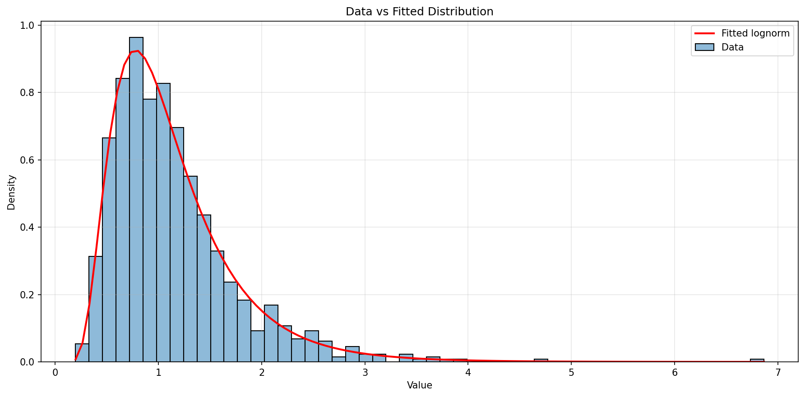
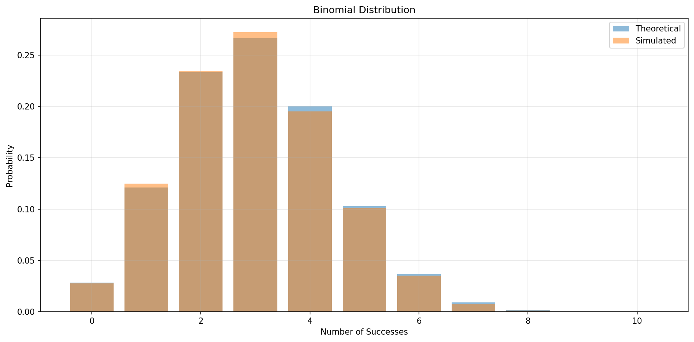
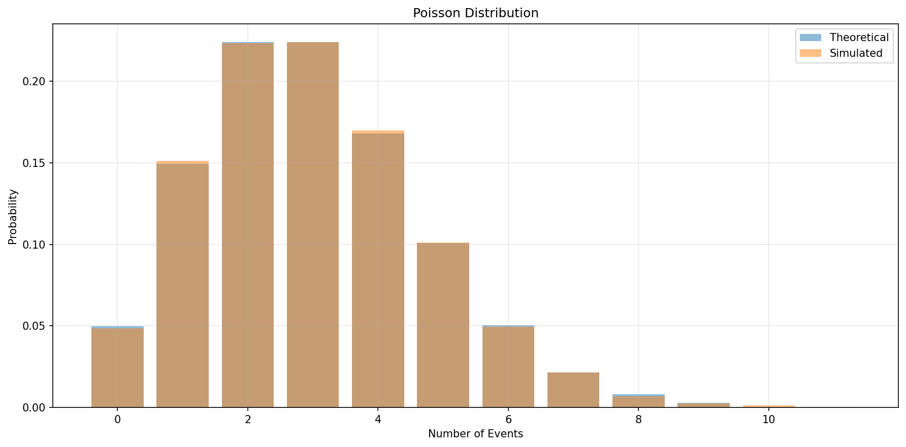
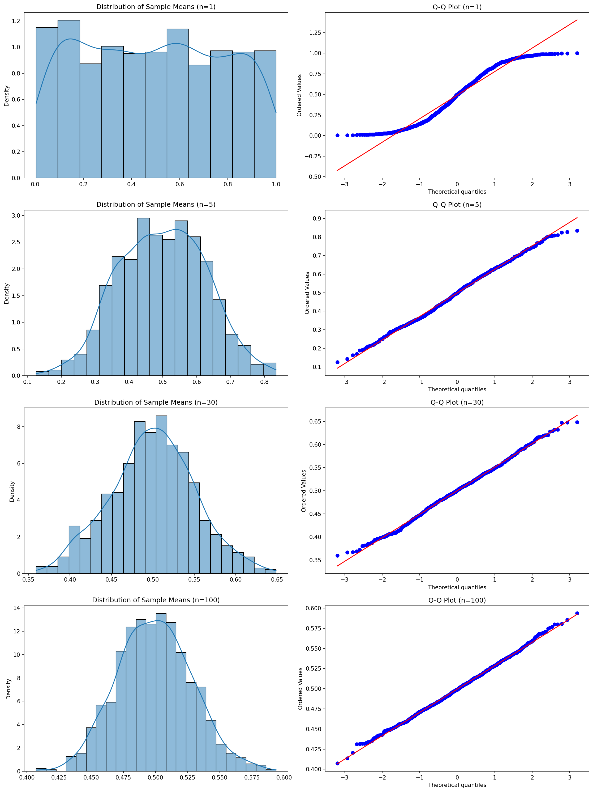
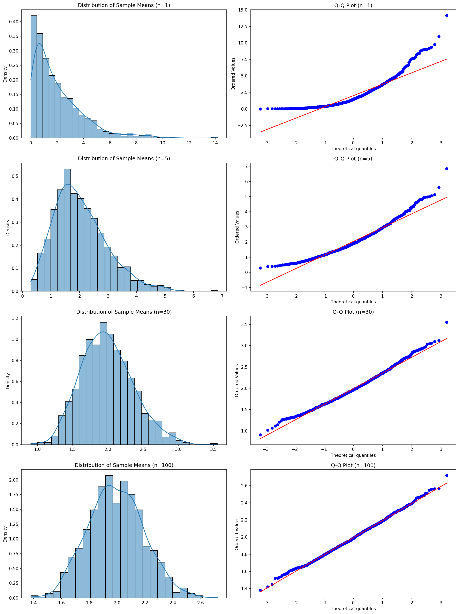

# Probability Distribution Families with Python

**After this lesson:** you can explain the core ideas in “Probability Distribution Families with Python” and reproduce the examples here in your own notebook or environment.

### Video

<div class="video-embed">
<iframe width="560" height="315" src="https://www.youtube.com/embed/qBigTk9VwNU" frameborder="0" allow="accelerometer; autoplay; clipboard-write; encrypted-media; gyroscope; picture-in-picture" allowfullscreen></iframe>
</div>

*StatQuest with Josh Starmer — The binomial distribution*

## Understanding distribution families

A **family** is a shape of randomness described by a formula and **parameters** (for example Normal: mean and standard deviation; Binomial: number of trials and success probability). Changing parameters changes the curve or the histogram, but the **same family** still answers the same kind of real-world question.

**Discrete** families (Binomial, Poisson) describe counts and frequencies. **Continuous** families (Normal, Exponential) describe measurements and waiting times. The code below lets you **sample** and **plot** several parameter settings side by side so you build intuition for “what happens when we change *n*, *p*, *lambda*, *sigma*?”

### Exploring families in Python

Let's explore different distribution families using Python:

<div class="code-explainer" data-code-explainer>
<div class="code-explainer__code">


import numpy as np
import pandas as pd
import matplotlib.pyplot as plt
import seaborn as sns
from scipy import stats
from typing import List, Dict, Tuple, Optional

class DistributionFamilyExplorer:
    """Explore and analyze distribution families"""

    def __init__(self, random_seed: Optional[int] = None):
        """Initialize explorer with optional seed"""
        if random_seed is not None:
            np.random.seed(random_seed)
        plt.style.use('seaborn')

    def plot_distribution_family(
        self,
        family: str,
        params_list: List[Dict[str, float]],
        n_samples: int = 1000
    ) -> None:
        """
        Plot distribution family with different parameters

        Args:
            family: Name of distribution family
            params_list: List of parameter dictionaries
            n_samples: Number of samples to generate
        """
        plt.figure(figsize=(12, 6))

        for params in params_list:
            if family == 'normal':
                data = np.random.normal(
                    loc=params['mean'],
                    scale=params['std'],
                    size=n_samples
                )
                label = f"μ={params['mean']}, σ={params['std']}"

            elif family == 'binomial':
                data = np.random.binomial(
                    n=params['n'],
                    p=params['p'],
                    size=n_samples
                )
                label = f"n={params['n']}, p={params['p']}"

            elif family == 'poisson':
                data = np.random.poisson(
                    lam=params['lambda'],
                    size=n_samples
                )
                label = f"λ={params['lambda']}"

            else:
                raise ValueError(f"Unknown family: {family}")

            if family == 'binomial':
                # For discrete distributions
                values, counts = np.unique(
                    data, return_counts=True
                )
                plt.bar(
                    values,
                    counts/n_samples,
                    alpha=0.5,
                    label=label
                )
            else:
                # For continuous distributions
                sns.kdeplot(data, label=label)

        plt.title(f'{family.title()} Distribution Family')
        plt.xlabel('Value')
        plt.ylabel('Density/Probability')
        plt.legend()
        plt.grid(True, alpha=0.3)
        plt.show()

# Example usage
explorer = DistributionFamilyExplorer(random_seed=42)

# Normal distribution family
normal_params = [
    {'mean': 0, 'std': 1},
    {'mean': 0, 'std': 2},
    {'mean': -2, 'std': 1.5}
]
explorer.plot_distribution_family('normal', normal_params)

# Binomial distribution family
binomial_params = [
    {'n': 10, 'p': 0.5},
    {'n': 20, 'p': 0.3},
    {'n': 15, 'p': 0.7}
]
explorer.plot_distribution_family('binomial', binomial_params)

# Poisson distribution family
poisson_params = [
    {'lambda': 2},
    {'lambda': 5},
    {'lambda': 8}
]
explorer.plot_distribution_family('poisson', poisson_params)


</div>
<aside class="code-explainer__callouts" aria-label="Code walkthrough">
  <div class="code-callout" data-lines="1-7" data-tint="1">
    <div class="code-callout__meta">
      <span class="code-callout__lines"></span>
      <span class="code-callout__title">Imports</span>
    </div>
    <div class="code-callout__body">
      <p>Brings in NumPy for sampling, Matplotlib/Seaborn for plotting, and SciPy's <code>stats</code> module for distribution functions.</p>
    </div>
  </div>
  <div class="code-callout" data-lines="9-16" data-tint="2">
    <div class="code-callout__meta">
      <span class="code-callout__lines"></span>
      <span class="code-callout__title">Explorer Init</span>
    </div>
    <div class="code-callout__body">
      <p>Seeds NumPy's random state for reproducibility and applies the seaborn style globally so all plots share consistent aesthetics.</p>
    </div>
  </div>
  <div class="code-callout" data-lines="18-59" data-tint="3">
    <div class="code-callout__meta">
      <span class="code-callout__lines"></span>
      <span class="code-callout__title">Sample Generation</span>
    </div>
    <div class="code-callout__body">
      <p>Branches on <code>family</code> to draw samples with the correct NumPy function, building a human-readable label from the parameter values for the legend.</p>
    </div>
  </div>
  <div class="code-callout" data-lines="61-76" data-tint="4">
    <div class="code-callout__meta">
      <span class="code-callout__lines"></span>
      <span class="code-callout__title">Discrete vs Continuous</span>
    </div>
    <div class="code-callout__body">
      <p>Binomial data is discrete so it's plotted as a bar chart of observed proportions; continuous families (Normal, Poisson) use KDE for a smooth density curve.</p>
    </div>
  </div>
  <div class="code-callout" data-lines="78-109" data-tint="1">
    <div class="code-callout__meta">
      <span class="code-callout__lines"></span>
      <span class="code-callout__title">Usage Examples</span>
    </div>
    <div class="code-callout__body">
      <p>Calls the explorer three times with different parameter sets to compare how changing μ/σ, n/p, or λ shifts and reshapes each distribution family.</p>
    </div>
  </div>
</aside>
</div>

---

### Distribution Fitting and Testing

Let's create tools for fitting distributions to data:

<div class="code-explainer" data-code-explainer>
<div class="code-explainer__code">


class DistributionFitter:
    """Fit and test probability distributions"""

    def __init__(self):
        """Initialize distribution families to test"""
        self.distributions = [
            stats.norm,
            stats.expon,
            stats.gamma,
            stats.lognorm,
            stats.weibull_min
        ]

    def fit_distribution(
        self,
        data: np.ndarray,
        dist: stats.rv_continuous
    ) -> Tuple[float, np.ndarray]:
        """
        Fit distribution and calculate goodness of fit

        Args:
            data: Input data
            dist: Distribution to fit

        Returns:
            Tuple of (p-value, parameters)
        """
        # Fit distribution
        params = dist.fit(data)

        # Perform Kolmogorov-Smirnov test
        _, p_value = stats.kstest(
            data,
            dist.name,
            params
        )

        return p_value, params

    def find_best_fit(
        self,
        data: np.ndarray
    ) -> Dict[str, Any]:
        """
        Find best fitting distribution

        Args:
            data: Input data

        Returns:
            Dictionary with best fit results
        """
        results = []

        for dist in self.distributions:
            try:
                p_value, params = self.fit_distribution(
                    data, dist
                )
                results.append({
                    'distribution': dist,
                    'p_value': p_value,
                    'params': params
                })
            except Exception as e:
                print(f"Error fitting {dist.name}: {str(e)}")

        # Sort by p-value
        results.sort(key=lambda x: x['p_value'], reverse=True)
        return results[0]

    def plot_fit_comparison(
        self,
        data: np.ndarray,
        fitted_dist: Dict[str, Any]
    ) -> None:
        """Plot data with fitted distribution"""
        plt.figure(figsize=(12, 6))

        # Plot histogram of data
        sns.histplot(
            data,
            stat='density',
            alpha=0.5,
            label='Data'
        )

        # Plot fitted distribution
        x = np.linspace(min(data), max(data), 100)
        dist = fitted_dist['distribution']
        params = fitted_dist['params']
        y = dist.pdf(x, *params)

        plt.plot(x, y, 'r-', lw=2,
                label=f'Fitted {dist.name}')

        plt.title('Data vs Fitted Distribution')
        plt.xlabel('Value')
        plt.ylabel('Density')
        plt.legend()
        plt.grid(True, alpha=0.3)
        plt.show()

        # Print fit statistics
        print("\nFit Statistics:")
        print(f"Best fit distribution: {dist.name}")
        print(f"P-value: {fitted_dist['p_value']:.4f}")
        print("\nParameters:")
        for i, param in enumerate(params):
            print(f"Parameter {i+1}: {param:.4f}")

# Example usage
fitter = DistributionFitter()

# Generate sample data
np.random.seed(42)
data = np.random.lognormal(mean=0, sigma=0.5, size=1000)

# Find and plot best fit
best_fit = fitter.find_best_fit(data)
fitter.plot_fit_comparison(data, best_fit)


<figure>

<figcaption>Figure 1: Data vs Fitted Distribution</figcaption>
</figure>

```

Fit Statistics:
Best fit distribution: lognorm
P-value: 0.9511

Parameters:
Parameter 1: 0.5209
Parameter 2: 0.0546
Parameter 3: 0.9478
```


</div>
<aside class="code-explainer__callouts" aria-label="Code walkthrough">
  <div class="code-callout" data-lines="1-12" data-tint="1">
    <div class="code-callout__meta">
      <span class="code-callout__lines"></span>
      <span class="code-callout__title">Candidate Distributions</span>
    </div>
    <div class="code-callout__body">
      <p>The constructor stores five SciPy continuous distribution objects to try when fitting. Adding more families is as simple as appending to this list.</p>
    </div>
  </div>
  <div class="code-callout" data-lines="14-40" data-tint="2">
    <div class="code-callout__meta">
      <span class="code-callout__lines"></span>
      <span class="code-callout__title">Single Fit + KS Test</span>
    </div>
    <div class="code-callout__body">
      <p><code>fit_distribution</code> uses MLE to estimate parameters, then runs a Kolmogorov-Smirnov test — the p-value measures how well the data matches the fitted distribution.</p>
    </div>
  </div>
  <div class="code-callout" data-lines="42-68" data-tint="3">
    <div class="code-callout__meta">
      <span class="code-callout__lines"></span>
      <span class="code-callout__title">Best Fit Selection</span>
    </div>
    <div class="code-callout__body">
      <p>Tries every candidate distribution, collects p-values, sorts them descending, and returns the best-fitting one — failures for a specific family are silently skipped.</p>
    </div>
  </div>
  <div class="code-callout" data-lines="70-110" data-tint="4">
    <div class="code-callout__meta">
      <span class="code-callout__lines"></span>
      <span class="code-callout__title">Visualization</span>
    </div>
    <div class="code-callout__body">
      <p>Overlays the fitted PDF (red line) on a histogram of the data, then prints the winning distribution name, KS p-value, and fitted parameters for review.</p>
    </div>
  </div>
  <div class="code-callout" data-lines="112-120" data-tint="1">
    <div class="code-callout__meta">
      <span class="code-callout__lines"></span>
      <span class="code-callout__title">Usage Example</span>
    </div>
    <div class="code-callout__body">
      <p>Generates 1,000 log-normal samples and runs the full fit pipeline — the fitter should correctly identify <code>lognorm</code> as the best fit.</p>
    </div>
  </div>
</aside>
</div>


```

Fit Statistics:
Best fit distribution: lognorm
P-value: 0.9511

Parameters:
Parameter 1: 0.5209
Parameter 2: 0.0546
Parameter 3: 0.9478
```

## Common Distribution Families

---

### Binomial Distribution

Let's implement tools for working with binomial distributions:

<div class="code-explainer" data-code-explainer>
<div class="code-explainer__code">


class BinomialAnalyzer:
    """Analyze binomial distributions"""

    def __init__(
        self,
        n: int,
        p: float,
        random_seed: Optional[int] = None
    ):
        """
        Initialize analyzer

        Args:
            n: Number of trials
            p: Probability of success
            random_seed: Random seed
        """
        self.n = n
        self.p = p
        if random_seed is not None:
            np.random.seed(random_seed)

    def simulate_trials(
        self,
        n_simulations: int = 1000
    ) -> pd.Series:
        """Simulate binomial trials"""
        return pd.Series(
            np.random.binomial(self.n, self.p, n_simulations),
            name='Successes'
        )

    def calculate_probability(
        self,
        k: int
    ) -> float:
        """Calculate probability of exactly k successes"""
        return stats.binom.pmf(k, self.n, self.p)

    def plot_distribution(
        self,
        data: Optional[pd.Series] = None
    ) -> None:
        """Plot binomial distribution"""
        plt.figure(figsize=(12, 6))

        # Plot theoretical probabilities
        x = np.arange(0, self.n + 1)
        pmf = stats.binom.pmf(x, self.n, self.p)
        plt.bar(x, pmf, alpha=0.5, label='Theoretical')

        # Plot simulated data if provided
        if data is not None:
            value_counts = data.value_counts(normalize=True)
            plt.bar(value_counts.index, value_counts.values,
                   alpha=0.5, label='Simulated')

        plt.title('Binomial Distribution')
        plt.xlabel('Number of Successes')
        plt.ylabel('Probability')
        plt.legend()
        plt.grid(True, alpha=0.3)
        plt.show()

        # Print statistics
        print("\nDistribution Statistics:")
        print(f"Mean: {self.n * self.p:.2f}")
        print(f"Variance: {self.n * self.p * (1-self.p):.2f}")
        if data is not None:
            print("\nSimulated Statistics:")
            print(data.describe().round(2))

# Example usage
analyzer = BinomialAnalyzer(n=10, p=0.3, random_seed=42)

# Simulate trials
simulated_data = analyzer.simulate_trials(10000)

# Plot distribution
analyzer.plot_distribution(simulated_data)

# Calculate specific probability
prob_5 = analyzer.calculate_probability(5)
print(f"\nProbability of exactly 5 successes: {prob_5:.4f}")


<figure>

<figcaption>Figure 2: Binomial Distribution</figcaption>
</figure>

```

Distribution Statistics:
Mean: 3.00
Variance: 2.10

Simulated Statistics:
count    10000.00
mean         2.97
std          1.43
min          0.00
25%          2.00
50%          3.00
75%          4.00
max          8.00
Name: Successes, dtype: float64

Probability of exactly 5 successes: 0.1029
```


</div>
<aside class="code-explainer__callouts" aria-label="Code walkthrough">
  <div class="code-callout" data-lines="1-21" data-tint="1">
    <div class="code-callout__meta">
      <span class="code-callout__lines"></span>
      <span class="code-callout__title">Analyzer Init</span>
    </div>
    <div class="code-callout__body">
      <p>Stores <code>n</code> (trials) and <code>p</code> (success probability) as instance attributes. The optional seed makes all downstream sampling reproducible.</p>
    </div>
  </div>
  <div class="code-callout" data-lines="23-31" data-tint="2">
    <div class="code-callout__meta">
      <span class="code-callout__lines"></span>
      <span class="code-callout__title">Simulate Trials</span>
    </div>
    <div class="code-callout__body">
      <p>Runs <code>n_simulations</code> independent binomial experiments using the stored parameters and returns the counts as a named Series.</p>
    </div>
  </div>
  <div class="code-callout" data-lines="33-38" data-tint="3">
    <div class="code-callout__meta">
      <span class="code-callout__lines"></span>
      <span class="code-callout__title">Exact Probability</span>
    </div>
    <div class="code-callout__body">
      <p>Uses the closed-form PMF to compute P(X = k) exactly — faster and more precise than counting from simulations.</p>
    </div>
  </div>
  <div class="code-callout" data-lines="40-68" data-tint="4">
    <div class="code-callout__meta">
      <span class="code-callout__lines"></span>
      <span class="code-callout__title">Plot &amp; Stats</span>
    </div>
    <div class="code-callout__body">
      <p>Overlays the theoretical PMF bars with simulated proportions (when provided), then prints analytical mean/variance alongside the simulation's descriptive stats for comparison.</p>
    </div>
  </div>
  <div class="code-callout" data-lines="70-80" data-tint="1">
    <div class="code-callout__meta">
      <span class="code-callout__lines"></span>
      <span class="code-callout__title">Usage Example</span>
    </div>
    <div class="code-callout__body">
      <p>Models 10 trials with 30% success probability, simulates 10,000 experiments, and checks the exact probability of getting exactly 5 successes.</p>
    </div>
  </div>
</aside>
</div>


```

Distribution Statistics:
Mean: 3.00
Variance: 2.10

Simulated Statistics:
count    10000.00
mean         2.97
std          1.43
min          0.00
25%          2.00
50%          3.00
75%          4.00
max          8.00
Name: Successes, dtype: float64

Probability of exactly 5 successes: 0.1029
```

---

### Poisson Distribution

Implementation for Poisson distributions:

<div class="code-explainer" data-code-explainer>
<div class="code-explainer__code">


class PoissonAnalyzer:
    """Analyze Poisson distributions"""

    def __init__(
        self,
        lambda_: float,
        random_seed: Optional[int] = None
    ):
        """
        Initialize analyzer

        Args:
            lambda_: Average rate
            random_seed: Random seed
        """
        self.lambda_ = lambda_
        if random_seed is not None:
            np.random.seed(random_seed)

    def simulate_events(
        self,
        n_simulations: int = 1000
    ) -> pd.Series:
        """Simulate Poisson events"""
        return pd.Series(
            np.random.poisson(self.lambda_, n_simulations),
            name='Events'
        )

    def calculate_probability(
        self,
        k: int
    ) -> float:
        """Calculate probability of exactly k events"""
        return stats.poisson.pmf(k, self.lambda_)

    def plot_distribution(
        self,
        data: Optional[pd.Series] = None,
        max_k: Optional[int] = None
    ) -> None:
        """Plot Poisson distribution"""
        if max_k is None:
            max_k = int(self.lambda_ * 3)

        plt.figure(figsize=(12, 6))

        # Plot theoretical probabilities
        x = np.arange(0, max_k + 1)
        pmf = stats.poisson.pmf(x, self.lambda_)
        plt.bar(x, pmf, alpha=0.5, label='Theoretical')

        # Plot simulated data if provided
        if data is not None:
            value_counts = data.value_counts(normalize=True)
            plt.bar(value_counts.index, value_counts.values,
                   alpha=0.5, label='Simulated')

        plt.title('Poisson Distribution')
        plt.xlabel('Number of Events')
        plt.ylabel('Probability')
        plt.legend()
        plt.grid(True, alpha=0.3)
        plt.show()

        # Print statistics
        print("\nDistribution Statistics:")
        print(f"Mean: {self.lambda_:.2f}")
        print(f"Variance: {self.lambda_:.2f}")
        if data is not None:
            print("\nSimulated Statistics:")
            print(data.describe().round(2))

# Example usage
analyzer = PoissonAnalyzer(lambda_=3, random_seed=42)

# Simulate events
simulated_data = analyzer.simulate_events(10000)

# Plot distribution
analyzer.plot_distribution(simulated_data)

# Calculate specific probability
prob_5 = analyzer.calculate_probability(5)
print(f"\nProbability of exactly 5 events: {prob_5:.4f}")


<figure>

<figcaption>Figure 3: Poisson Distribution</figcaption>
</figure>

```

Distribution Statistics:
Mean: 3.00
Variance: 3.00

Simulated Statistics:
count    10000.00
mean         2.99
std          1.72
min          0.00
25%          2.00
50%          3.00
75%          4.00
max         11.00
Name: Events, dtype: float64

Probability of exactly 5 events: 0.1008
```


</div>
<aside class="code-explainer__callouts" aria-label="Code walkthrough">
  <div class="code-callout" data-lines="1-19" data-tint="1">
    <div class="code-callout__meta">
      <span class="code-callout__lines"></span>
      <span class="code-callout__title">Analyzer Init</span>
    </div>
    <div class="code-callout__body">
      <p>Stores <code>lambda_</code> (the average event rate). For a Poisson distribution, mean and variance are both equal to λ — a key property highlighted in the print output.</p>
    </div>
  </div>
  <div class="code-callout" data-lines="21-29" data-tint="2">
    <div class="code-callout__meta">
      <span class="code-callout__lines"></span>
      <span class="code-callout__title">Simulate Events</span>
    </div>
    <div class="code-callout__body">
      <p>Generates independent event counts using NumPy's Poisson sampler and wraps them in a named Series for easy downstream analysis.</p>
    </div>
  </div>
  <div class="code-callout" data-lines="31-36" data-tint="3">
    <div class="code-callout__meta">
      <span class="code-callout__lines"></span>
      <span class="code-callout__title">Exact PMF</span>
    </div>
    <div class="code-callout__body">
      <p>Computes P(X = k) from the closed-form Poisson PMF — use this when you need a precise probability, not a simulation estimate.</p>
    </div>
  </div>
  <div class="code-callout" data-lines="38-70" data-tint="4">
    <div class="code-callout__meta">
      <span class="code-callout__lines"></span>
      <span class="code-callout__title">Plot &amp; Stats</span>
    </div>
    <div class="code-callout__body">
      <p>Auto-scales the x-axis to 3λ, then overlays theoretical and simulated bars. Prints both the true mean/variance (equal for Poisson) and simulation descriptive stats.</p>
    </div>
  </div>
  <div class="code-callout" data-lines="72-82" data-tint="1">
    <div class="code-callout__meta">
      <span class="code-callout__lines"></span>
      <span class="code-callout__title">Usage Example</span>
    </div>
    <div class="code-callout__body">
      <p>Models a rate of 3 events per interval, simulates 10,000 observations, and checks the probability of exactly 5 events in one interval.</p>
    </div>
  </div>
</aside>
</div>


```

Distribution Statistics:
Mean: 3.00
Variance: 3.00

Simulated Statistics:
count    10000.00
mean         2.99
std          1.72
min          0.00
25%          2.00
50%          3.00
75%          4.00
max         11.00
Name: Events, dtype: float64

Probability of exactly 5 events: 0.1008
```

---

### Normal Distribution and Central Limit Theorem

Let's demonstrate the Central Limit Theorem:

<div class="code-explainer" data-code-explainer>
<div class="code-explainer__code">


class CLTDemonstrator:
    """Demonstrate Central Limit Theorem"""

    def __init__(self, random_seed: Optional[int] = None):
        if random_seed is not None:
            np.random.seed(random_seed)

    def generate_sample_means(
        self,
        distribution: str,
        params: Dict[str, float],
        sample_size: int,
        n_samples: int
    ) -> np.ndarray:
        """
        Generate means of random samples

        Args:
            distribution: Base distribution
            params: Distribution parameters
            sample_size: Size of each sample
            n_samples: Number of samples

        Returns:
            Array of sample means
        """
        if distribution == 'uniform':
            data = np.random.uniform(
                params['low'],
                params['high'],
                (n_samples, sample_size)
            )
        elif distribution == 'exponential':
            data = np.random.exponential(
                params['scale'],
                (n_samples, sample_size)
            )
        else:
            raise ValueError(f"Unknown distribution: {distribution}")

        return np.mean(data, axis=1)

    def plot_clt_demonstration(
        self,
        distribution: str,
        params: Dict[str, float],
        sample_sizes: List[int],
        n_samples: int = 1000
    ) -> None:
        """Plot CLT demonstration"""
        n_sizes = len(sample_sizes)
        fig, axes = plt.subplots(
            n_sizes, 2,
            figsize=(15, 5 * n_sizes)
        )

        for i, size in enumerate(sample_sizes):
            # Generate sample means
            means = self.generate_sample_means(
                distribution,
                params,
                size,
                n_samples
            )

            # Plot histogram
            sns.histplot(
                means,
                stat='density',
                kde=True,
                ax=axes[i, 0]
            )
            axes[i, 0].set_title(
                f'Distribution of Sample Means (n={size})'
            )

            # Q-Q plot
            stats.probplot(
                means,
                dist='norm',
                plot=axes[i, 1]
            )
            axes[i, 1].set_title(
                f'Q-Q Plot (n={size})'
            )

        plt.tight_layout()
        plt.show()

        # Print statistics for each sample size
        print("\nSample Statistics:")
        for size in sample_sizes:
            means = self.generate_sample_means(
                distribution,
                params,
                size,
                n_samples
            )
            print(f"\nSample Size: {size}")
            print(f"Mean: {np.mean(means):.4f}")
            print(f"Std Dev: {np.std(means):.4f}")
            _, p_value = stats.normaltest(means)
            print(f"Normality Test p-value: {p_value:.4f}")

# Example usage
demonstrator = CLTDemonstrator(random_seed=42)

# Demonstrate CLT with uniform distribution
params = {'low': 0, 'high': 1}
sample_sizes = [1, 5, 30, 100]

print("\nCLT Demonstration (Uniform Distribution):")
demonstrator.plot_clt_demonstration(
    'uniform',
    params,
    sample_sizes
)

# Demonstrate CLT with exponential distribution
params = {'scale': 2}
print("\nCLT Demonstration (Exponential Distribution):")
demonstrator.plot_clt_demonstration(
    'exponential',
    params,
    sample_sizes
)


<figure>

<figcaption>Figure 4: Distribution of Sample Means (n=1)</figcaption>
</figure>


<figure>

<figcaption>Figure 5: Distribution of Sample Means (n=1)</figcaption>
</figure>

```

CLT Demonstration (Uniform Distribution):

Sample Statistics:

Sample Size: 1
Mean: 0.4996
Std Dev: 0.2745
Normality Test p-value: 0.0000

Sample Size: 5
Mean: 0.5071
Std Dev: 0.1311
Normality Test p-value: 0.0926

Sample Size: 30
Mean: 0.5025
Std Dev: 0.0536
Normality Test p-value: 0.4245

Sample Size: 100
Mean: 0.5010
Std Dev: 0.0296
Normality Test p-value: 0.9482

CLT Demonstration (Exponential Distribution):

Sample Statistics:

Sample Size: 1
Mean: 2.0838
Std Dev: 2.1226
Normality Test p-value: 0.0000

Sample Size: 5
Mean: 2.0069
Std Dev: 0.9192
Normality Test p-value: 0.0000

Sample Size: 30
Mean: 1.9851
Std Dev: 0.3591
Normality Test p-value: 0.0000

Sample Size: 100
Mean: 2.0066
Std Dev: 0.2044
Normality Test p-value: 0.0019
```


</div>
<aside class="code-explainer__callouts" aria-label="Code walkthrough">
  <div class="code-callout" data-lines="1-6" data-tint="1">
    <div class="code-callout__meta">
      <span class="code-callout__lines"></span>
      <span class="code-callout__title">Init</span>
    </div>
    <div class="code-callout__body">
      <p>Seeds the random state so the CLT demonstration produces the same plots each run — important for reproducible teaching examples.</p>
    </div>
  </div>
  <div class="code-callout" data-lines="8-42" data-tint="2">
    <div class="code-callout__meta">
      <span class="code-callout__lines"></span>
      <span class="code-callout__title">Sample Mean Generation</span>
    </div>
    <div class="code-callout__body">
      <p>Draws an <code>(n_samples × sample_size)</code> matrix from the chosen distribution, then collapses each row to its mean — each row is one simulated sample of size <code>sample_size</code>.</p>
    </div>
  </div>
  <div class="code-callout" data-lines="44-87" data-tint="3">
    <div class="code-callout__meta">
      <span class="code-callout__lines"></span>
      <span class="code-callout__title">Histogram + Q-Q Plots</span>
    </div>
    <div class="code-callout__body">
      <p>For each sample size, creates a row of two subplots: a KDE histogram showing the shape of the sampling distribution, and a Q-Q plot to test for normality visually.</p>
    </div>
  </div>
  <div class="code-callout" data-lines="89-102" data-tint="4">
    <div class="code-callout__meta">
      <span class="code-callout__lines"></span>
      <span class="code-callout__title">Normality Tests</span>
    </div>
    <div class="code-callout__body">
      <p>Prints mean, std dev, and D'Agostino-Pearson normality test p-value for each sample size — as <em>n</em> grows the p-value should rise, confirming the CLT.</p>
    </div>
  </div>
  <div class="code-callout" data-lines="104-122" data-tint="1">
    <div class="code-callout__meta">
      <span class="code-callout__lines"></span>
      <span class="code-callout__title">Two Base Distributions</span>
    </div>
    <div class="code-callout__body">
      <p>Runs the demonstration on a Uniform and an Exponential base distribution to show the CLT holds regardless of the original distribution's shape.</p>
    </div>
  </div>
</aside>
</div>


```

CLT Demonstration (Uniform Distribution):

Sample Statistics:

Sample Size: 1
Mean: 0.4996
Std Dev: 0.2745
Normality Test p-value: 0.0000

Sample Size: 5
Mean: 0.5071
Std Dev: 0.1311
Normality Test p-value: 0.0926

Sample Size: 30
Mean: 0.5025
Std Dev: 0.0536
Normality Test p-value: 0.4245

Sample Size: 100
Mean: 0.5010
Std Dev: 0.0296
Normality Test p-value: 0.9482

CLT Demonstration (Exponential Distribution):

Sample Statistics:

Sample Size: 1
Mean: 2.0838
Std Dev: 2.1226
Normality Test p-value: 0.0000

Sample Size: 5
Mean: 2.0069
Std Dev: 0.9192
Normality Test p-value: 0.0000

Sample Size: 30
Mean: 1.9851
Std Dev: 0.3591
Normality Test p-value: 0.0000

Sample Size: 100
Mean: 2.0066
Std Dev: 0.2044
Normality Test p-value: 0.0019
```

## Practice Exercises

Try these distribution analysis exercises:

1. **Customer Service Analysis**

   ```python
   # Create functions to:
   # - Analyze call arrival patterns
   # - Fit appropriate distribution
   # - Calculate staffing requirements
   ```

2. **Manufacturing Quality Control**

   ```python
   # Build tools to:
   # - Model defect rates
   # - Calculate control limits
   # - Predict batch quality
   ```

3. **Financial Risk Analysis**

   ```python
   # Implement system to:
   # - Analyze return distributions
   # - Calculate Value at Risk
   # - Model portfolio risk
   ```

Remember:

- Choose appropriate distribution family
- Validate distribution assumptions
- Consider sample size effects
- Use visualization for insights
- Document your analysis

## Common pitfalls

- **Using a famous name without checking fit** — “It’s Normal because we always use Normal” is wrong; use plots and domain knowledge.
- **Ignoring parameter constraints** — Rate parameters must be positive; probabilities must stay in **[0, 1]**.
- **Mixing discrete and continuous** — PMF vs PDF: different rules for summing vs integrating.

## Next steps

Continue to [Two-variable statistics](./two-variable-statistics.md), then [Data foundation with NumPy](../1.4-data-foundation-linear-algebra/README.md) starting with [Introduction to NumPy](../1.4-data-foundation-linear-algebra/intro-numpy.md).

Happy analyzing!
