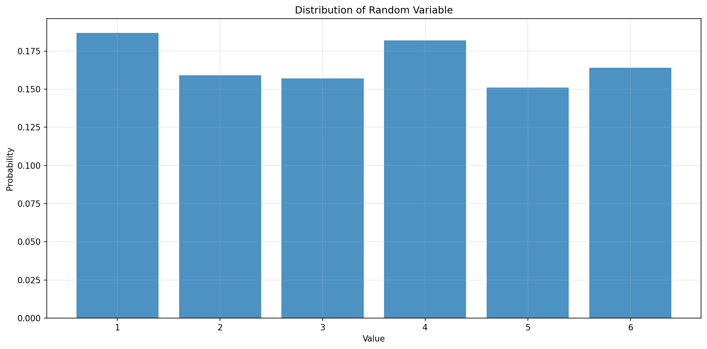
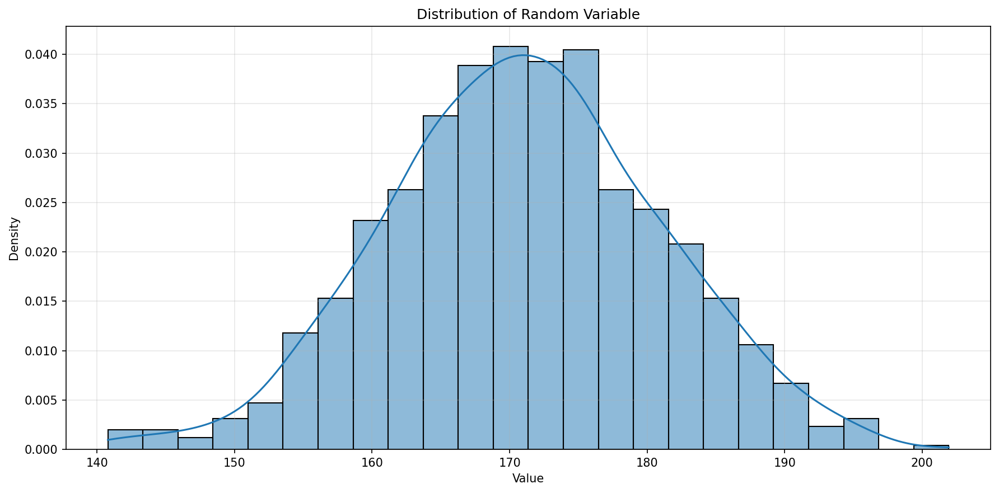
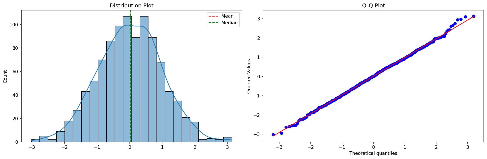
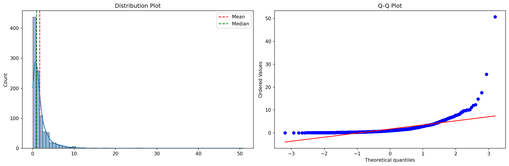
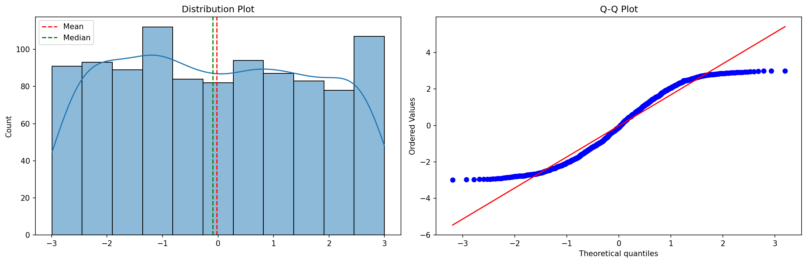
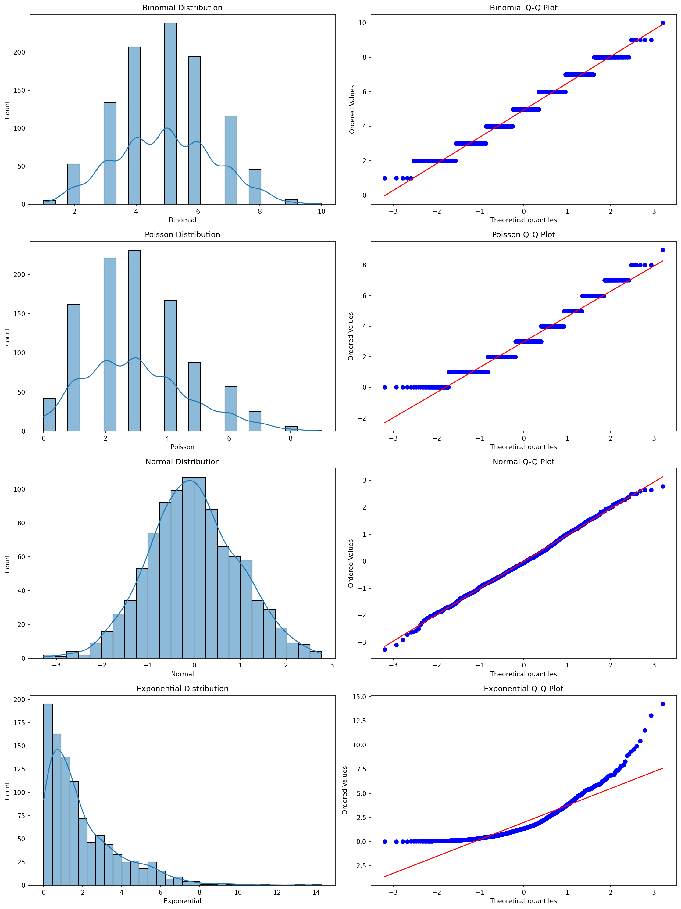
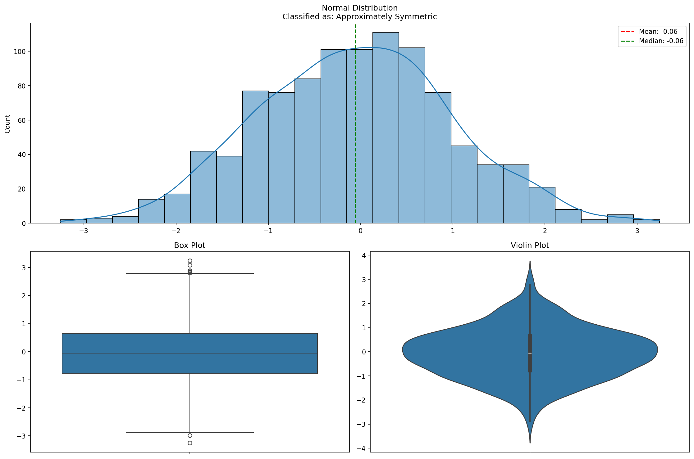
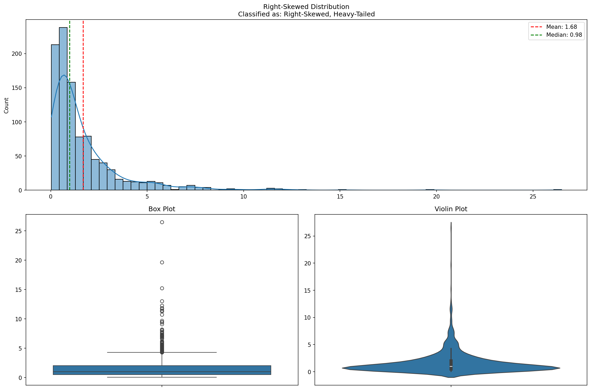
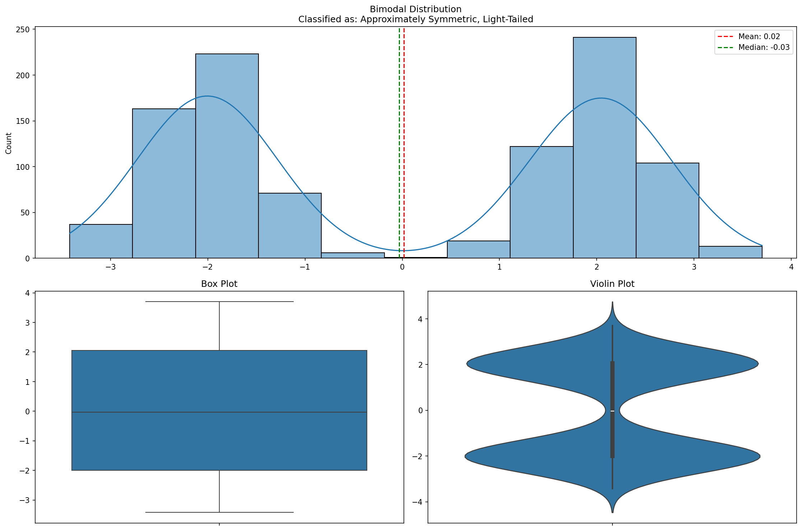

# Probability Distributions with Python

**After this lesson:** you can explain the core ideas in “Probability Distributions with Python” and reproduce the examples here in your own notebook or environment.

### Video

<div class="video-embed">
<iframe width="560" height="315" src="https://www.youtube.com/embed/iYiOVISeS84" frameborder="0" allow="accelerometer; autoplay; clipboard-write; encrypted-media; gyroscope; picture-in-picture" allowfullscreen></iframe>
</div>

*StatQuest with Josh Starmer — The normal distribution, clearly explained*

## Understanding Random Variables Through Code

---

### Implementing Random Variables

Let's explore random variables using Python:

**`RandomVariableExplorer`: discrete vs continuous draws**

- **Purpose:** Tie code to the idea of a random variable: **simulate** draws from a discrete law (`np.random.choice` with probabilities) and from continuous families (`normal`, `uniform`), then **plot** with bar vs histogram/KDE.
- **Walkthrough:** `simulate_discrete` uses `p=`; `simulate_continuous` branches on `distribution`; `plot_distribution` picks `discrete` vs `continuous` from `n_unique`.

```python
import numpy as np
import pandas as pd
import matplotlib.pyplot as plt
import seaborn as sns
from scipy import stats
from typing import List, Dict, Tuple, Optional

class RandomVariableExplorer:
    """Explore and visualize random variables"""
    
    def __init__(self, random_seed: Optional[int] = None):
        """Initialize explorer with optional seed"""
        if random_seed is not None:
            np.random.seed(random_seed)
    
    def simulate_discrete(
        self,
        values: List[int],
        probabilities: List[float],
        n_samples: int = 1000
    ) -> pd.Series:
        """
        Simulate discrete random variable
        
        Args:
            values: Possible values
            probabilities: Probability of each value
            n_samples: Number of samples to generate
            
        Returns:
            Series of sampled values
        """
        samples = np.random.choice(
            values,
            size=n_samples,
            p=probabilities
        )
        return pd.Series(samples, name='Value')
    
    def simulate_continuous(
        self,
        distribution: str,
        params: Dict[str, float],
        n_samples: int = 1000
    ) -> pd.Series:
        """
        Simulate continuous random variable
        
        Args:
            distribution: Name of distribution
            params: Distribution parameters
            n_samples: Number of samples to generate
            
        Returns:
            Series of sampled values
        """
        if distribution == 'normal':
            samples = np.random.normal(
                loc=params.get('mean', 0),
                scale=params.get('std', 1),
                size=n_samples
            )
        elif distribution == 'uniform':
            samples = np.random.uniform(
                low=params.get('low', 0),
                high=params.get('high', 1),
                size=n_samples
            )
        else:
            raise ValueError(f"Unknown distribution: {distribution}")
        
        return pd.Series(samples, name='Value')
    
    def plot_distribution(
        self,
        data: pd.Series,
        kind: str = 'auto'
    ) -> None:
        """Plot distribution of random variable"""
        plt.figure(figsize=(12, 6))
        
        if kind == 'auto':
            # Determine plot type based on unique values
            n_unique = len(data.unique())
            kind = 'discrete' if n_unique <= 10 else 'continuous'
        
        if kind == 'discrete':
            # Bar plot for discrete data
            value_counts = data.value_counts(normalize=True)
            plt.bar(
                value_counts.index,
                value_counts.values,
                alpha=0.8
            )
            plt.xlabel('Value')
            plt.ylabel('Probability')
            
        else:
            # Histogram and KDE for continuous data
            sns.histplot(
                data,
                stat='density',
                kde=True,
                alpha=0.5
            )
            plt.xlabel('Value')
            plt.ylabel('Density')
        
        plt.title('Distribution of Random Variable')
        plt.grid(True, alpha=0.3)
        plt.show()
        
        # Print summary statistics
        print("\nSummary Statistics:")
        print(data.describe().round(3))

# Example usage
explorer = RandomVariableExplorer(random_seed=42)

# Simulate discrete random variable (die roll)
die_values = [1, 2, 3, 4, 5, 6]
die_probs = [1/6] * 6
die_rolls = explorer.simulate_discrete(
    die_values,
    die_probs,
    n_samples=1000
)

print("\nDie Rolls:")
explorer.plot_distribution(die_rolls, kind='discrete')

# Simulate continuous random variable (height)
heights = explorer.simulate_continuous(
    'normal',
    {'mean': 170, 'std': 10},
    n_samples=1000
)

print("\nHeight Distribution:")
explorer.plot_distribution(heights, kind='continuous')
```







```

Die Rolls:

Summary Statistics:
count    1000.000
mean        3.443
std         1.725
min         1.000
25%         2.000
50%         3.000
75%         5.000
max         6.000
Name: Value, dtype: float64

Height Distribution:

Summary Statistics:
count    1000.000
mean      170.989
std         9.889
min       140.786
25%       164.359
50%       170.842
75%       177.396
max       201.931
Name: Value, dtype: float64
```

---

### Expected Value and Variance

Let's implement tools for calculating distribution properties:

**Moments and skew/kurtosis on samples**

- **Purpose:** Connect **E[X]** and **Var(X)** for both tabulated `(values, probabilities)` and raw samples; visualize with histogram + mean/median and a normal Q-Q plot.
- **Walkthrough:** `calculate_expected_value` / `calculate_variance` use `np.mean`/`np.var` when `probabilities` is `None`; `analyze_distribution` builds the summary dict and `stats.probplot` for Q-Q.

```python
class DistributionAnalyzer:
    """Analyze properties of distributions"""
    
    @staticmethod
    def calculate_expected_value(
        values: np.ndarray,
        probabilities: Optional[np.ndarray] = None
    ) -> float:
        """
        Calculate expected value
        
        Args:
            values: Possible values
            probabilities: Probability of each value
            
        Returns:
            Expected value
        """
        if probabilities is None:
            # For empirical data
            return np.mean(values)
        return np.sum(values * probabilities)
    
    @staticmethod
    def calculate_variance(
        values: np.ndarray,
        probabilities: Optional[np.ndarray] = None,
        ddof: int = 0
    ) -> float:
        """
        Calculate variance
        
        Args:
            values: Possible values
            probabilities: Probability of each value
            ddof: Delta degrees of freedom
            
        Returns:
            Variance
        """
        if probabilities is None:
            # For empirical data
            return np.var(values, ddof=ddof)
        
        expected_value = DistributionAnalyzer.calculate_expected_value(
            values, probabilities
        )
        squared_deviations = (values - expected_value) ** 2
        return np.sum(squared_deviations * probabilities)
    
    @staticmethod
    def calculate_skewness(data: np.ndarray) -> float:
        """Calculate skewness"""
        return stats.skew(data)
    
    @staticmethod
    def calculate_kurtosis(data: np.ndarray) -> float:
        """Calculate kurtosis"""
        return stats.kurtosis(data)
    
    def analyze_distribution(
        self,
        data: np.ndarray,
        name: str = "Distribution"
    ) -> None:
        """Print comprehensive distribution analysis"""
        analysis = {
            'Mean': np.mean(data),
            'Median': np.median(data),
            'Std Dev': np.std(data),
            'Variance': np.var(data),
            'Skewness': self.calculate_skewness(data),
            'Kurtosis': self.calculate_kurtosis(data)
        }
        
        print(f"\n{name} Analysis:")
        for metric, value in analysis.items():
            print(f"{metric}: {value:.3f}")
        
        # Create visualization
        fig, (ax1, ax2) = plt.subplots(1, 2, figsize=(15, 5))
        
        # Distribution plot
        sns.histplot(data, kde=True, ax=ax1)
        ax1.axvline(
            analysis['Mean'],
            color='r',
            linestyle='--',
            label='Mean'
        )
        ax1.axvline(
            analysis['Median'],
            color='g',
            linestyle='--',
            label='Median'
        )
        ax1.set_title('Distribution Plot')
        ax1.legend()
        
        # Q-Q plot
        stats.probplot(data, plot=ax2)
        ax2.set_title('Q-Q Plot')
        
        plt.tight_layout()
        plt.show()

# Example usage
analyzer = DistributionAnalyzer()

# Analyze different distributions
print("\nNormal Distribution:")
normal_data = np.random.normal(loc=0, scale=1, size=1000)
analyzer.analyze_distribution(normal_data, "Normal")

print("\nRight-Skewed Distribution:")
right_skewed = np.random.lognormal(mean=0, sigma=1, size=1000)
analyzer.analyze_distribution(right_skewed, "Right-Skewed")

print("\nUniform Distribution:")
uniform_data = np.random.uniform(low=-3, high=3, size=1000)
analyzer.analyze_distribution(uniform_data, "Uniform")
```










```

Normal Distribution:

Normal Analysis:
Mean: 0.014
Median: 0.011
Std Dev: 0.970
Variance: 0.941
Skewness: 0.002
Kurtosis: 0.052

Right-Skewed Distribution:

Right-Skewed Analysis:
Mean: 1.702
Median: 0.969
Std Dev: 2.564
Variance: 6.572
Skewness: 8.941
Kurtosis: 142.635

Uniform Distribution:

Uniform Analysis:
Mean: -0.024
Median: -0.098
Std Dev: 1.736
Variance: 3.014
Skewness: 0.054
Kurtosis: -1.214
```

## Common Probability Distributions

---

### Implementing Distribution Functions

Let's create tools for working with common distributions:

**Sampling binomial, Poisson, normal, exponential**

- **Purpose:** See how NumPy’s `np.random.*` generators map to common families; compare shapes side-by-side with histograms and normal Q-Q panels.
- **Walkthrough:** Each method wraps one generator (`binomial`, `poisson`, `normal`, `exponential`); `plot_distributions` lays out two columns per distribution.

```python
class ProbabilityDistributions:
    """Work with common probability distributions"""
    
    def __init__(self, random_seed: Optional[int] = None):
        if random_seed is not None:
            np.random.seed(random_seed)
    
    def binomial(
        self,
        n: int,
        p: float,
        size: int = 1000
    ) -> pd.Series:
        """
        Generate binomial distribution
        
        Args:
            n: Number of trials
            p: Probability of success
            size: Number of samples
            
        Returns:
            Series of samples
        """
        samples = np.random.binomial(n, p, size)
        return pd.Series(samples, name='Binomial')
    
    def poisson(
        self,
        lambda_: float,
        size: int = 1000
    ) -> pd.Series:
        """
        Generate Poisson distribution
        
        Args:
            lambda_: Average rate
            size: Number of samples
            
        Returns:
            Series of samples
        """
        samples = np.random.poisson(lambda_, size)
        return pd.Series(samples, name='Poisson')
    
    def normal(
        self,
        mean: float,
        std: float,
        size: int = 1000
    ) -> pd.Series:
        """
        Generate normal distribution
        
        Args:
            mean: Mean of distribution
            std: Standard deviation
            size: Number of samples
            
        Returns:
            Series of samples
        """
        samples = np.random.normal(mean, std, size)
        return pd.Series(samples, name='Normal')
    
    def exponential(
        self,
        scale: float,
        size: int = 1000
    ) -> pd.Series:
        """
        Generate exponential distribution
        
        Args:
            scale: Scale parameter (1/rate)
            size: Number of samples
            
        Returns:
            Series of samples
        """
        samples = np.random.exponential(scale, size)
        return pd.Series(samples, name='Exponential')
    
    def plot_distributions(
        self,
        distributions: Dict[str, pd.Series]
    ) -> None:
        """Plot multiple distributions"""
        n_dist = len(distributions)
        fig, axes = plt.subplots(
            n_dist, 2,
            figsize=(15, 5 * n_dist)
        )
        
        for i, (name, data) in enumerate(distributions.items()):
            # Distribution plot
            sns.histplot(
                data,
                kde=True,
                ax=axes[i, 0]
            )
            axes[i, 0].set_title(f'{name} Distribution')
            
            # Q-Q plot
            stats.probplot(
                data,
                dist='norm',
                plot=axes[i, 1]
            )
            axes[i, 1].set_title(f'{name} Q-Q Plot')
        
        plt.tight_layout()
        plt.show()
        
        # Print summary statistics
        print("\nSummary Statistics:")
        for name, data in distributions.items():
            print(f"\n{name}:")
            print(data.describe().round(3))

# Example usage
pd_explorer = ProbabilityDistributions(random_seed=42)

# Generate different distributions
distributions = {
    'Binomial': pd_explorer.binomial(n=10, p=0.5),
    'Poisson': pd_explorer.poisson(lambda_=3),
    'Normal': pd_explorer.normal(mean=0, std=1),
    'Exponential': pd_explorer.exponential(scale=2)
}

# Plot and analyze distributions
pd_explorer.plot_distributions(distributions)
```




```

Summary Statistics:

Binomial:
count    1000.000
mean        4.939
std         1.579
min         1.000
25%         4.000
50%         5.000
75%         6.000
max        10.000
Name: Binomial, dtype: float64

Poisson:
count    1000.000
mean        2.979
std         1.693
min         0.000
25%         2.000
50%         3.000
75%         4.000
max         9.000
Name: Poisson, dtype: float64

Normal:
count    1000.000
mean       -0.014
std         0.980
min        -3.275
25%        -0.671
50%        -0.060
75%         0.618
max         2.769
Name: Normal, dtype: float64

Exponential:
count    1000.000
mean        1.980
std         1.917
min         0.000
25%         0.577
50%         1.362
75%         2.865
max        14.280
Name: Exponential, dtype: float64
```

---

### Distribution Shape Analysis

Let's create tools for analyzing distribution shapes:

**Classify skew/tails and compare plot types**

- **Purpose:** Practice reading **skewness** and **kurtosis** thresholds, and pair histograms with box and violin plots for the same data.
- **Walkthrough:** `classify_shape` uses `stats.skew` / `stats.kurtosis`; `plot_shape_analysis` builds a 2×2 grid with `sns.histplot`, `sns.boxplot`, `sns.violinplot`.

```python
class ShapeAnalyzer:
    """Analyze and classify distribution shapes"""
    
    @staticmethod
    def classify_shape(data: np.ndarray) -> str:
        """
        Classify distribution shape
        
        Args:
            data: Input data
            
        Returns:
            Shape classification
        """
        skewness = stats.skew(data)
        kurtosis = stats.kurtosis(data)
        
        # Classify based on skewness
        if abs(skewness) < 0.5:
            shape = "Approximately Symmetric"
        elif skewness > 0:
            shape = "Right-Skewed"
        else:
            shape = "Left-Skewed"
        
        # Add kurtosis information
        if kurtosis > 1:
            shape += ", Heavy-Tailed"
        elif kurtosis < -1:
            shape += ", Light-Tailed"
        
        return shape
    
    def plot_shape_analysis(
        self,
        data: np.ndarray,
        title: str = "Distribution Shape Analysis"
    ) -> None:
        """
        Create comprehensive shape analysis plot
        
        Args:
            data: Input data
            title: Plot title
        """
        shape = self.classify_shape(data)
        
        fig = plt.figure(figsize=(15, 10))
        gs = fig.add_gridspec(2, 2)
        
        # Histogram with KDE
        ax1 = fig.add_subplot(gs[0, :])
        sns.histplot(data, kde=True, ax=ax1)
        ax1.set_title(f'{title}\nClassified as: {shape}')
        
        # Add reference lines
        mean = np.mean(data)
        median = np.median(data)
        ax1.axvline(mean, color='r', linestyle='--',
                   label=f'Mean: {mean:.2f}')
        ax1.axvline(median, color='g', linestyle='--',
                   label=f'Median: {median:.2f}')
        ax1.legend()
        
        # Box plot
        ax2 = fig.add_subplot(gs[1, 0])
        sns.boxplot(y=data, ax=ax2)
        ax2.set_title('Box Plot')
        
        # Violin plot
        ax3 = fig.add_subplot(gs[1, 1])
        sns.violinplot(y=data, ax=ax3)
        ax3.set_title('Violin Plot')
        
        plt.tight_layout()
        plt.show()
        
        # Print shape statistics
        print("\nShape Statistics:")
        print(f"Skewness: {stats.skew(data):.3f}")
        print(f"Kurtosis: {stats.kurtosis(data):.3f}")

# Example usage
shape_analyzer = ShapeAnalyzer()

# Analyze different shapes
print("\nNormal Distribution:")
normal_data = np.random.normal(0, 1, 1000)
shape_analyzer.plot_shape_analysis(
    normal_data,
    "Normal Distribution"
)

print("\nRight-Skewed Distribution:")
right_skewed = np.random.lognormal(0, 1, 1000)
shape_analyzer.plot_shape_analysis(
    right_skewed,
    "Right-Skewed Distribution"
)

print("\nBimodal Distribution:")
bimodal = np.concatenate([
    np.random.normal(-2, 0.5, 500),
    np.random.normal(2, 0.5, 500)
])
shape_analyzer.plot_shape_analysis(
    bimodal,
    "Bimodal Distribution"
)
```










```

Normal Distribution:

Shape Statistics:
Skewness: 0.054
Kurtosis: -0.093

Right-Skewed Distribution:

Shape Statistics:
Skewness: 4.106
Kurtosis: 28.778

Bimodal Distribution:

Shape Statistics:
Skewness: 0.005
Kurtosis: -1.763
```

## Practice Exercises

Try these distribution analysis exercises:

1. **Stock Returns Analysis**

   - **Purpose:** Stub for **Practice Exercise 1**—implement the four comment bullets (load prices, returns, fit, tails) using your own data source.

   ```python
   # Create functions to:
   # - Load stock price data
   # - Calculate daily returns
   # - Fit distribution to returns
   # - Analyze tail behavior
   ```

2. **Customer Behavior Model**

   - **Purpose:** Stub for **Practice Exercise 2**—model frequency and order value distributions and lifetime-style summaries from transactional data.

   ```python
   # Build analysis tools for:
   # - Purchase frequency distribution
   # - Order value distribution
   # - Customer lifetime modeling
   ```

3. **Quality Control System**

   - **Purpose:** Stub for **Practice Exercise 3**—monitor measurements, compare to baseline distributions, and set control limits.

   ```python
   # Implement system to:
   # - Monitor process measurements
   # - Detect distribution shifts
   # - Calculate control limits
   # - Generate alerts
   ```

Remember:

- Use appropriate distributions
- Validate distribution assumptions
- Consider sample size effects
- Create clear visualizations
- Document your analysis

## Common pitfalls

- **Wrong support** — Binomial counts cannot be negative; Normal models are continuous—check that your data fits the story.
- **Confusing PDF and probability** — For continuous variables, probability comes from areas under the curve, not the height at a point.
- **Small-sample behavior** — Histograms and fitted curves look smoother as **n** grows; don’t overfit a distribution from a tiny sample.

## Next steps

Continue to [Probability distribution families](./probability-distribution-families.md), then [Two-variable statistics](./two-variable-statistics.md).

Happy analyzing!
