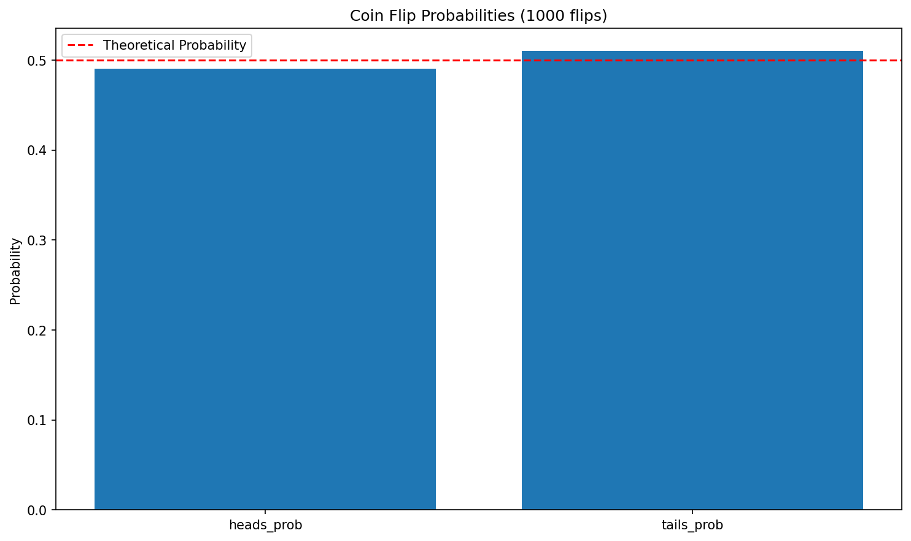
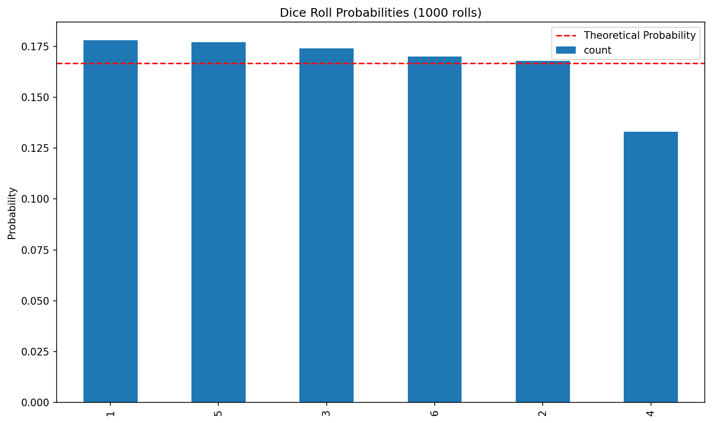
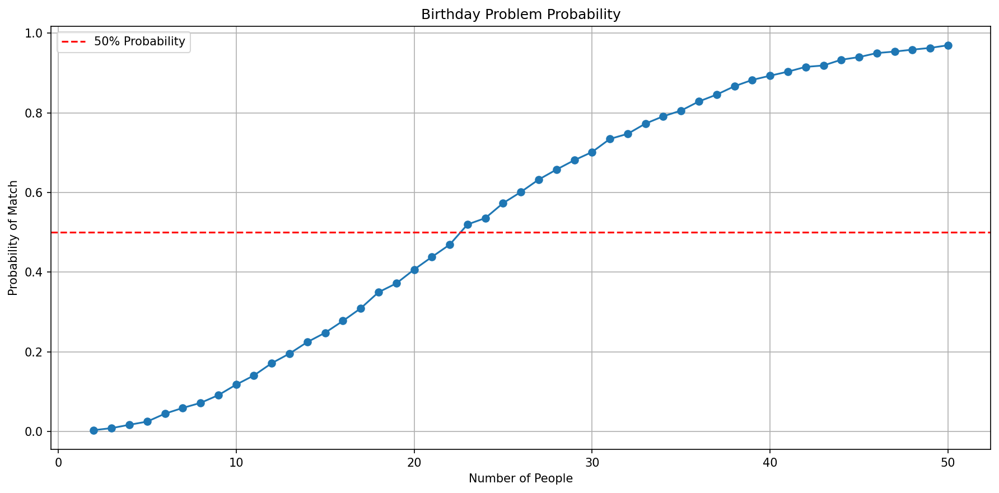
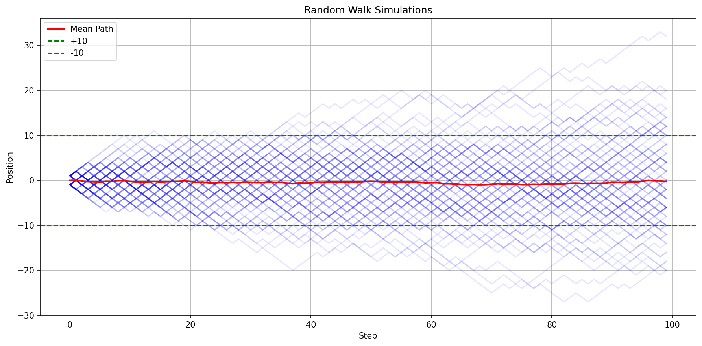
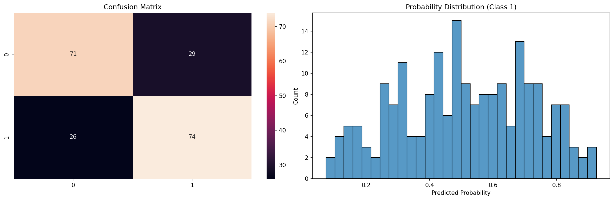

# Probability fundamentals with Python

**After this lesson:** You connect probability ideas (events, simulation, long-run frequency) to short Python examples you can run and plot.

## Overview

**Prerequisites:** Basic Python and comfort reading imports; statistics module [Introduction to Statistics](./README.md) context helps.

**Why this lesson:** Probability is the language of **uncertainty**. Simulation in code turns abstract rules (coins, dice, draws) into histograms you can **see**—the bridge to distributions and inference later.

### Video

<div class="video-embed">
<iframe width="560" height="315" src="https://www.youtube.com/embed/uzkc-qNVoOk" frameborder="0" allow="accelerometer; autoplay; clipboard-write; encrypted-media; gyroscope; picture-in-picture" allowfullscreen></iframe>
</div>

*Khan Academy — Introduction to probability*

## Understanding probability through code

---

### Implementing Basic Probability
Let's explore probability concepts using Python:

<div class="code-explainer" data-code-explainer>
<div class="code-explainer__code">


import numpy as np
import pandas as pd
import matplotlib.pyplot as plt
import seaborn as sns
from typing import Dict, List, Optional, Tuple, Union

class ProbabilityExperiment:
    """Simulate and analyze probability experiments"""

    def __init__(self, random_seed: Optional[int] = None):
        if random_seed is not None:
            np.random.seed(random_seed)

    def flip_coin(self, n_flips: int) -> Dict[str, float]:
        """Simulate coin flips"""
        flips = np.random.choice(['H', 'T'], size=n_flips)
        counts = pd.Series(flips).value_counts()
        probs = counts / n_flips
        return {'heads_prob': probs.get('H', 0), 'tails_prob': probs.get('T', 0)}

    def roll_dice(self, n_rolls: int) -> pd.Series:
        """Simulate dice rolls"""
        rolls = np.random.randint(1, 7, size=n_rolls)
        return pd.Series(rolls).value_counts() / n_rolls

    def plot_results(self, data: Union[Dict[str, float], pd.Series], title: str) -> None:
        """Plot probability results"""
        plt.figure(figsize=(10, 6))
        if isinstance(data, dict):
            plt.bar(data.keys(), data.values())
        else:
            data.plot(kind='bar')
        plt.title(title)
        plt.ylabel('Probability')
        plt.axhline(y=1/len(data), color='r', linestyle='--', label='Theoretical Probability')
        plt.legend()
        plt.show()

# Example usage
experiment = ProbabilityExperiment(random_seed=42)
coin_results = experiment.flip_coin(1000)
print("\nCoin Flip Probabilities:")
for outcome, prob in coin_results.items():
    print(f"{outcome}: {prob:.3f}")
experiment.plot_results(coin_results, "Coin Flip Probabilities (1000 flips)")

dice_results = experiment.roll_dice(1000)
print("\nDice Roll Probabilities:")
print(dice_results)
experiment.plot_results(dice_results, "Dice Roll Probabilities (1000 rolls)")


</div>
<aside class="code-explainer__callouts" aria-label="Code walkthrough">
  <div class="code-callout" data-lines="1-6" data-tint="1">
    <div class="code-callout__meta">
      <span class="code-callout__lines"></span>
      <span class="code-callout__title">Imports</span>
    </div>
    <div class="code-callout__body">
      <p>Imports NumPy for random draws, pandas for counting, Matplotlib and Seaborn for plots, and typing for readable signatures.</p>
    </div>
  </div>
  <div class="code-callout" data-lines="8-24" data-tint="2">
    <div class="code-callout__meta">
      <span class="code-callout__lines"></span>
      <span class="code-callout__title">Coin and Dice</span>
    </div>
    <div class="code-callout__body">
      <p>Seeds the RNG on init; <code>flip_coin</code> uses <code>random.choice</code> with equal weights, <code>roll_dice</code> uses <code>randint</code>—both return empirical probabilities as fractions.</p>
    </div>
  </div>
  <div class="code-callout" data-lines="26-51" data-tint="3">
    <div class="code-callout__meta">
      <span class="code-callout__lines"></span>
      <span class="code-callout__title">Plot and Demo</span>
    </div>
    <div class="code-callout__body">
      <p>Handles both dict and Series inputs in one plot method, adds a theoretical probability reference line, then runs both experiments with 1,000 trials each.</p>
    </div>
  </div>
</aside>
</div>





```

Coin Flip Probabilities:
heads_prob: 0.490
tails_prob: 0.510

Dice Roll Probabilities:
1    0.178
5    0.177
3    0.174
6    0.170
2    0.168
4    0.133
Name: count, dtype: float64
```

---

### Monte Carlo Simulation
Let's use simulation to understand probability:

<div class="code-explainer" data-code-explainer>
<div class="code-explainer__code">


class MonteCarloSimulation:
    """Perform Monte Carlo simulations for probability problems"""

    def __init__(self, n_simulations: int = 10000):
        self.n_simulations = n_simulations

    def birthday_problem(self, n_people: int) -> float:
        """Simulate birthday problem"""
        matches = 0
        for _ in range(self.n_simulations):
            birthdays = np.random.randint(0, 365, n_people)
            if len(birthdays) != len(set(birthdays)):
                matches += 1
        return matches / self.n_simulations

    def monty_hall(self, switch: bool = True) -> float:
        """Simulate Monty Hall problem"""
        wins = 0
        for _ in range(self.n_simulations):
            doors = [1, 2, 3]
            prize_door = np.random.choice(doors)
            chosen_door = np.random.choice(doors)
            remaining_doors = [d for d in doors if d != chosen_door and d != prize_door]
            opened_door = np.random.choice(remaining_doors)
            if switch:
                final_door = [d for d in doors if d != chosen_door and d != opened_door][0]
            else:
                final_door = chosen_door
            if final_door == prize_door:
                wins += 1
        return wins / self.n_simulations

    def plot_birthday_probabilities(self, max_people: int = 50) -> None:
        """Plot birthday problem probabilities"""
        people = range(2, max_people + 1)
        probs = [self.birthday_problem(n) for n in people]
        plt.figure(figsize=(12, 6))
        plt.plot(people, probs, marker='o')
        plt.axhline(y=0.5, color='r', linestyle='--', label='50% Probability')
        plt.xlabel('Number of People')
        plt.ylabel('Probability of Match')
        plt.title('Birthday Problem Probability')
        plt.grid(True)
        plt.legend()
        plt.show()

# Example usage
mc = MonteCarloSimulation(n_simulations=10000)
print("\nBirthday Problem:")
print(f"Probability with 23 people: {mc.birthday_problem(23):.3f}")
mc.plot_birthday_probabilities()

print("\nMonty Hall Problem:")
print(f"Probability when switching: {mc.monty_hall(switch=True):.3f}")
print(f"Probability when staying:   {mc.monty_hall(switch=False):.3f}")


</div>
<aside class="code-explainer__callouts" aria-label="Code walkthrough">
  <div class="code-callout" data-lines="1-14" data-tint="1">
    <div class="code-callout__meta">
      <span class="code-callout__lines"></span>
      <span class="code-callout__title">Birthday Problem</span>
    </div>
    <div class="code-callout__body">
      <p>Generates <code>n_people</code> random birthdays across 365 days and counts runs where any two match—repeating this 10,000 times gives a stable probability estimate.</p>
    </div>
  </div>
  <div class="code-callout" data-lines="16-31" data-tint="2">
    <div class="code-callout__meta">
      <span class="code-callout__lines"></span>
      <span class="code-callout__title">Monty Hall</span>
    </div>
    <div class="code-callout__body">
      <p>Simulates the three-door game: the host eliminates a non-prize door, then the contestant either switches or stays—switching wins ~2/3 of the time.</p>
    </div>
  </div>
  <div class="code-callout" data-lines="33-52" data-tint="3">
    <div class="code-callout__meta">
      <span class="code-callout__lines"></span>
      <span class="code-callout__title">Plot and Demo</span>
    </div>
    <div class="code-callout__body">
      <p>Plots the birthday probability as group size grows from 2 to 50, showing the 50% crossing point near 23 people, then prints both Monty Hall outcomes.</p>
    </div>
  </div>
</aside>
</div>



```

Birthday Problem:
Probability with 23 people: 0.511

Monty Hall Problem:
Probability when switching: 0.670
Probability when staying: 0.334
```

## Probability Rules and Calculations

---

### Implementing Probability Rules
Let's create tools for probability calculations:

<div class="code-explainer" data-code-explainer>
<div class="code-explainer__code">


class ProbabilityCalculator:
    """Calculate probabilities using various rules"""

    @staticmethod
    def complement(p: float) -> float:
        return 1 - p

    @staticmethod
    def union_independent(p1: float, p2: float) -> float:
        """P(A∪B) for independent events"""
        return p1 + p2 - (p1 * p2)

    @staticmethod
    def intersection_independent(p1: float, p2: float) -> float:
        """P(A∩B) for independent events"""
        return p1 * p2

    @staticmethod
    def conditional_probability(p_intersection: float, p_given: float) -> float:
        """P(A|B) = P(A∩B) / P(B)"""
        return p_intersection / p_given

    @staticmethod
    def bayes_theorem(p_a: float, p_b_given_a: float, p_b_given_not_a: float) -> float:
        """P(A|B) via Bayes: P(B|A)·P(A) / P(B)"""
        p_not_a = 1 - p_a
        p_b = (p_b_given_a * p_a) + (p_b_given_not_a * p_not_a)
        return (p_b_given_a * p_a) / p_b

# Medical test example
calc = ProbabilityCalculator()
p_disease_given_positive = calc.bayes_theorem(
    p_a=0.01,           # 1% have disease
    p_b_given_a=0.95,   # 95% true-positive rate
    p_b_given_not_a=0.10  # 10% false-positive rate
)
print("\nMedical Test Example:")
print(f"Probability of disease given positive test: {p_disease_given_positive:.3f}")


</div>
<aside class="code-explainer__callouts" aria-label="Code walkthrough">
  <div class="code-callout" data-lines="1-20" data-tint="1">
    <div class="code-callout__meta">
      <span class="code-callout__lines"></span>
      <span class="code-callout__title">Set Operations</span>
    </div>
    <div class="code-callout__body">
      <p>Implements complement, union, intersection, and conditional probability as one-liners—clean translations of the formulas from the text above.</p>
    </div>
  </div>
  <div class="code-callout" data-lines="22-27" data-tint="2">
    <div class="code-callout__meta">
      <span class="code-callout__lines"></span>
      <span class="code-callout__title">Bayes' Theorem</span>
    </div>
    <div class="code-callout__body">
      <p>Computes P(A|B) by first calculating the total probability of B via the law of total probability, then applying the Bayes formula.</p>
    </div>
  </div>
  <div class="code-callout" data-lines="29-35" data-tint="3">
    <div class="code-callout__meta">
      <span class="code-callout__lines"></span>
      <span class="code-callout__title">Medical Demo</span>
    </div>
    <div class="code-callout__body">
      <p>Shows that a 95%-accurate test on a 1%-prevalence disease still yields only ~8.8% chance of disease given a positive result—a classic base-rate demonstration.</p>
    </div>
  </div>
</aside>
</div>

```

Medical Test Example:
Probability of disease given positive test: 0.088
```

---

### Visualizing Probability Concepts
Create visual representations of probability:

<div class="code-explainer" data-code-explainer>
<div class="code-explainer__code">


class ProbabilityVisualizer:
    """Visualize probability concepts"""

    @staticmethod
    def plot_venn2(set_a: set, set_b: set, labels: Tuple[str, str]) -> None:
        """Plot two-set Venn diagram"""
        from matplotlib_venn import venn2
        plt.figure(figsize=(10, 6))
        venn2([set_a, set_b], labels)
        plt.title("Venn Diagram")
        plt.show()

        union = len(set_a.union(set_b))
        intersection = len(set_a.intersection(set_b))
        print("\nProbabilities:")
        print(f"P(A): {len(set_a)/union:.3f}")
        print(f"P(B): {len(set_b)/union:.3f}")
        print(f"P(A∩B): {intersection/union:.3f}")
        print(f"P(A∪B): {1.0:.3f}")

    @staticmethod
    def plot_probability_tree(
        probabilities: Dict[str, float],
        outcomes: Dict[str, List[str]]
    ) -> None:
        """Plot probability tree diagram"""
        import networkx as nx
        G = nx.DiGraph()
        G.add_node("Start", pos=(0, 0))

        for i, (event, prob) in enumerate(probabilities.items()):
            G.add_node(event, pos=(1, -i))
            G.add_edge("Start", event, probability=f"P={prob:.2f}")
            for j, outcome in enumerate(outcomes[event]):
                node_name = f"{event}_{outcome}"
                G.add_node(node_name, pos=(2, -i-j*0.5))
                G.add_edge(event, node_name, probability=f"P={1/len(outcomes[event]):.2f}")

        plt.figure(figsize=(12, 8))
        pos = nx.get_node_attributes(G, 'pos')
        nx.draw(G, pos, with_labels=True, node_color='lightblue', node_size=2000, arrowsize=20)
        edge_labels = nx.get_edge_attributes(G, 'probability')
        nx.draw_networkx_edge_labels(G, pos, edge_labels=edge_labels)
        plt.title("Probability Tree Diagram")
        plt.axis('off')
        plt.show()

# Example usage
viz = ProbabilityVisualizer()
students_math = {1, 2, 3, 4, 5, 7}
students_science = {2, 4, 6, 7, 8}
viz.plot_venn2(students_math, students_science, ('Math', 'Science'))

weather_probs = {'Sunny': 0.7, 'Rainy': 0.3}
weather_outcomes = {'Sunny': ['Hot', 'Mild'], 'Rainy': ['Mild', 'Cold']}
viz.plot_probability_tree(weather_probs, weather_outcomes)


</div>
<aside class="code-explainer__callouts" aria-label="Code walkthrough">
  <div class="code-callout" data-lines="1-19" data-tint="1">
    <div class="code-callout__meta">
      <span class="code-callout__lines"></span>
      <span class="code-callout__title">Venn Diagram</span>
    </div>
    <div class="code-callout__body">
      <p>Renders a two-set Venn with <code>matplotlib_venn</code>, then computes and prints P(A), P(B), and P(A∩B) using set operations on the element counts.</p>
    </div>
  </div>
  <div class="code-callout" data-lines="21-44" data-tint="2">
    <div class="code-callout__meta">
      <span class="code-callout__lines"></span>
      <span class="code-callout__title">Probability Tree</span>
    </div>
    <div class="code-callout__body">
      <p>Builds a directed graph with NetworkX: Start → events (first level) → outcomes (second level), labelling each edge with its probability.</p>
    </div>
  </div>
  <div class="code-callout" data-lines="46-51" data-tint="3">
    <div class="code-callout__meta">
      <span class="code-callout__lines"></span>
      <span class="code-callout__title">Demo Usage</span>
    </div>
    <div class="code-callout__body">
      <p>Demonstrates both methods: a math/science student Venn diagram and a weather probability tree with Sunny/Rainy split into sub-outcomes.</p>
    </div>
  </div>
</aside>
</div>

## Advanced Probability Concepts

---

### Implementing Advanced Probability
Let's create tools for advanced probability analysis:

<div class="code-explainer" data-code-explainer>
<div class="code-explainer__code">


class AdvancedProbability:
    """Advanced probability calculations and simulations"""

    def __init__(self, random_seed: Optional[int] = None):
        if random_seed is not None:
            np.random.seed(random_seed)

    def simulate_random_walk(self, n_steps: int, n_simulations: int) -> np.ndarray:
        """Simulate random walks: each step ±1"""
        steps = np.random.choice([-1, 1], size=(n_simulations, n_steps))
        return np.cumsum(steps, axis=1)

    def calculate_hitting_probability(self, paths: np.ndarray, threshold: int) -> float:
        """Probability that any step's |position| >= threshold"""
        hit_any = np.any(np.abs(paths) >= threshold, axis=1)
        return np.mean(hit_any)

    def plot_random_walks(self, paths: np.ndarray, threshold: Optional[int] = None) -> None:
        """Plot random walk paths with mean and optional threshold bands"""
        plt.figure(figsize=(12, 6))
        for path in paths:
            plt.plot(path, alpha=0.1, color='blue')
        mean_path = np.mean(paths, axis=0)
        plt.plot(mean_path, color='red', linewidth=2, label='Mean Path')
        if threshold is not None:
            plt.axhline(y=threshold, color='g', linestyle='--', label=f'+{threshold}')
            plt.axhline(y=-threshold, color='g', linestyle='--', label=f'-{threshold}')
        plt.title('Random Walk Simulations')
        plt.xlabel('Step')
        plt.ylabel('Position')
        plt.legend()
        plt.grid(True)
        plt.show()

# Example usage
ap = AdvancedProbability(random_seed=42)
paths = ap.simulate_random_walk(n_steps=100, n_simulations=1000)
hit_prob = ap.calculate_hitting_probability(paths, threshold=10)
print(f"\nProbability of hitting ±10: {hit_prob:.3f}")
ap.plot_random_walks(paths[:100], threshold=10)


</div>
<aside class="code-explainer__callouts" aria-label="Code walkthrough">
  <div class="code-callout" data-lines="1-11" data-tint="1">
    <div class="code-callout__meta">
      <span class="code-callout__lines"></span>
      <span class="code-callout__title">Random Walk Simulation</span>
    </div>
    <div class="code-callout__body">
      <p>Generates a matrix of ±1 steps then uses <code>cumsum</code> along the step axis—one row per simulation path, fully vectorised.</p>
    </div>
  </div>
  <div class="code-callout" data-lines="13-15" data-tint="2">
    <div class="code-callout__meta">
      <span class="code-callout__lines"></span>
      <span class="code-callout__title">Hitting Probability</span>
    </div>
    <div class="code-callout__body">
      <p>Uses <code>np.any</code> row-wise to check if any step in a path reaches the threshold, then averages the boolean array for a Monte Carlo probability estimate.</p>
    </div>
  </div>
  <div class="code-callout" data-lines="17-39" data-tint="3">
    <div class="code-callout__meta">
      <span class="code-callout__lines"></span>
      <span class="code-callout__title">Plot and Demo</span>
    </div>
    <div class="code-callout__body">
      <p>Overlays individual paths at low opacity, a red mean path, and optional threshold lines, then runs 1,000 walks and reports the hitting probability.</p>
    </div>
  </div>
</aside>
</div>



```

Probability of hitting ±10: 0.631
```

---

### Probability in Machine Learning
Example of using probability in ML contexts:

<div class="code-explainer" data-code-explainer>
<div class="code-explainer__code">


from sklearn.naive_bayes import GaussianNB
from sklearn.model_selection import train_test_split
from sklearn.metrics import confusion_matrix
import seaborn as sns

class ProbabilisticClassifier:
    """Demonstrate probability in classification"""

    def __init__(self):
        self.model = GaussianNB()

    def create_sample_data(self, n_samples: int = 1000) -> Tuple[np.ndarray, np.ndarray]:
        """Create sample dataset with probabilistic labels"""
        X = np.random.randn(n_samples, 2)
        probs = 1 / (1 + np.exp(-X.sum(axis=1)))   # sigmoid of feature sum
        y = np.random.binomial(n=1, p=probs)
        return X, y

    def fit_and_evaluate(self, X: np.ndarray, y: np.ndarray) -> dict:
        """Fit model and evaluate results"""
        X_train, X_test, y_train, y_test = train_test_split(
            X, y, test_size=0.2, random_state=42
        )
        self.model.fit(X_train, y_train)
        y_pred = self.model.predict(X_test)
        y_prob = self.model.predict_proba(X_test)
        cm = confusion_matrix(y_test, y_pred)
        return {'predictions': y_pred, 'probabilities': y_prob,
                'confusion_matrix': cm, 'true_labels': y_test}

    def plot_results(self, results: dict) -> None:
        """Plot confusion matrix and predicted probability distribution"""
        fig, (ax1, ax2) = plt.subplots(1, 2, figsize=(15, 5))
        sns.heatmap(results['confusion_matrix'], annot=True, fmt='d', ax=ax1)
        ax1.set_title('Confusion Matrix')
        sns.histplot(results['probabilities'][:, 1], bins=30, ax=ax2)
        ax2.set_title('Probability Distribution (Class 1)')
        ax2.set_xlabel('Predicted Probability')
        plt.tight_layout()
        plt.show()

# Example usage
pc = ProbabilisticClassifier()
X, y = pc.create_sample_data()
results = pc.fit_and_evaluate(X, y)
pc.plot_results(results)


</div>
<aside class="code-explainer__callouts" aria-label="Code walkthrough">
  <div class="code-callout" data-lines="1-16" data-tint="1">
    <div class="code-callout__meta">
      <span class="code-callout__lines"></span>
      <span class="code-callout__title">Probabilistic Labels</span>
    </div>
    <div class="code-callout__body">
      <p>Generates labels using a sigmoid of the feature sum so each sample has a genuine probability of being class 1—not a hard boundary, making the task realistically noisy.</p>
    </div>
  </div>
  <div class="code-callout" data-lines="18-29" data-tint="2">
    <div class="code-callout__meta">
      <span class="code-callout__lines"></span>
      <span class="code-callout__title">Naive Bayes Fit</span>
    </div>
    <div class="code-callout__body">
      <p>Splits 80/20, fits Gaussian Naive Bayes, and returns both hard predictions and class probabilities alongside the confusion matrix.</p>
    </div>
  </div>
  <div class="code-callout" data-lines="31-44" data-tint="3">
    <div class="code-callout__meta">
      <span class="code-callout__lines"></span>
      <span class="code-callout__title">Results Plot</span>
    </div>
    <div class="code-callout__body">
      <p>Shows a heatmap confusion matrix on the left and a histogram of predicted class-1 probabilities on the right—illustrating calibration as well as accuracy.</p>
    </div>
  </div>
</aside>
</div>



## Practice exercises

Try these probability programming exercises:

1. **Card Game Simulator**
   ```python
   # Create a simulator that:
   # - Deals cards and calculates probabilities
   # - Simulates different poker hands
   # - Visualizes results
   ```

2. **Disease Testing Model**
   ```python
   # Implement a system that:
   # - Simulates medical test accuracy
   # - Calculates false positive/negative rates
   # - Uses Bayes' theorem for diagnosis
   ```

3. **Stock Market Probability**
   ```python
   # Build analysis tools for:
   # - Calculating probability of price movements
   # - Simulating trading strategies
   # - Risk assessment
   ```

Remember:

- Use NumPy for efficient calculations
- Implement proper error handling
- Validate probability assumptions
- Create clear visualizations
- Document your code

## Common pitfalls

- **Confusing P(A|B) and P(B|A)** — Write down which event is “given” before you plug into formulas.
- **Assuming independence** — Multiplication rules for probabilities only apply when events are independent (or you use the correct conditional form).
- **Law of large numbers vs one trial** — A fair coin can show many heads in a row; probability describes long-run frequency, not a guarantee on the next flip.

## Next steps

Continue to [Probability distributions](./probability-distributions.md), then [Probability distribution families](./probability-distribution-families.md), then [Two-variable statistics](./two-variable-statistics.md). If you have not yet summarized single variables with means and spreads, work through [One-variable statistics](./one-variable-statistics.md) first so notation feels familiar.
