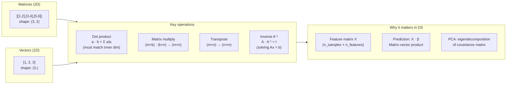

# Linear Algebra: Matrix Magic

**After this lesson:** you can explain the core ideas in “Linear Algebra: Matrix Magic” and reproduce the examples here in your own notebook or environment.

### Video

<div class="video-embed">
<iframe width="560" height="315" src="https://www.youtube.com/embed/fNk_zzaMoSs" frameborder="0" allow="accelerometer; autoplay; clipboard-write; encrypted-media; gyroscope; picture-in-picture" allowfullscreen></iframe>
</div>

*3Blue1Brown — Essence of linear algebra: vectors*

## How this lesson is organized

This page mixes **set-like** ideas (unique values, membership) with **matrix multiplication** and other **linear algebra** tools. That mirrors real workflows: you often **deduplicate** or **filter** arrays before you **combine** or **transform** them with matrices. Read top to bottom; each section’s code is short enough to run in a notebook as you go.



*Most sklearn algorithms reduce to matrix multiplications under the hood. Understanding shapes prevents the most common errors: mismatched dimensions in `np.dot` or `@`.*

## Set operations: finding unique values

---

### Finding Unique Values

Like finding unique cards in a deck! Set operations are crucial for:

- Data cleaning (removing duplicates)
- Feature engineering (unique categories)
- Finding distinct values
- Comparing datasets

Real-world applications:

- Finding unique customer IDs
- Extracting unique product categories
- Identifying unique transaction types
- Finding unique locations in data

```python
import numpy as np

# Array with duplicates
names = np.array(["Bob", "Will", "Joe", "Bob", "Will", "Joe", "Joe"])

# Get unique values and their counts
unique_names, counts = np.unique(names, return_counts=True)
print("Unique names:", unique_names)
print("Counts:", counts)
# Shows how many times each name appears

# Numbers work too!
numbers = np.array([3, 3, 3, 2, 2, 1, 1, 4, 4])
unique_nums, counts = np.unique(numbers, return_counts=True)
print("\nUnique numbers:", unique_nums)
print("Counts:", counts)

# Real-world example - Sales data
sales_data = np.array([
    ['Electronics', 100],
    ['Books', 50],
    ['Electronics', 75],
    ['Clothing', 60],
    ['Books', 45]
])
unique_categories = np.unique(sales_data[:, 0])  # Get unique product categories
print("\nUnique product categories:", unique_categories)
```

---

### Testing Membership

Like checking if someone's on the guest list!

```python
# Guest list scenario
guests = np.array([1, 2, 3, 4, 5])  # Authorized IDs
to_check = np.array([2, 3, 6])      # IDs to verify

# Check membership
is_authorized = np.in1d(to_check, guests)
print("Authorization check:", is_authorized)
print("Authorized IDs:", to_check[is_authorized])
print("Unauthorized IDs:", to_check[~is_authorized])

# Real-world example - Product inventory
inventory = np.array(['SKU001', 'SKU002', 'SKU003', 'SKU004'])
orders = np.array(['SKU002', 'SKU005', 'SKU001'])

# Check which orders can be fulfilled
can_fulfill = np.in1d(orders, inventory)
print("\nOrder fulfillment check:")
print("Can fulfill:", orders[can_fulfill])
print("Out of stock:", orders[~can_fulfill])
```

## Matrix Multiplication: The Dance of Numbers

---

### What is Matrix Multiplication?

Think of it like a special dance between numbers:

```python
# First matrix (2 rows, 3 columns)
x = np.array([
    [1, 2, 3],
    [4, 5, 6]
])

# Second matrix (3 rows, 2 columns)
y = np.array([
    [6, 23],
    [-1, 7],
    [8, 9]
])

# Let them dance!
result = x @ y  # or np.dot(x, y)
print(result)
```

---

### Visual Guide to Matrix Multiplication

```
Matrix 1:      Matrix 2:      Result:
┌─────────┐    ┌───────┐     ┌───────┐
│ 1 2 3   │    │ 6  23 │     │ 28 84 │
│ 4 5 6   │  × │-1   7 │  =  │ 73 210│
└─────────┘    │ 8   9 │     └───────┘
               └───────┘

First element (28) = 1×6 + 2×(-1) + 3×8
```

---

### Three Ways to Multiply

```python
# Method 1: Using @
result1 = x @ y

# Method 2: Using dot
result2 = np.dot(x, y)

# Method 3: Using matmul
result3 = np.matmul(x, y)

# All give the same result!
```

## Linear Algebra Operations: The Toolbox

---

### Common Operations

```python
# Create a 2x2 matrix
a = np.array([[1, 2],
              [3, 4]])

# Find determinant
det = np.linalg.det(a)
print("Determinant:", det)

# Find inverse
inv = np.linalg.inv(a)
print("Inverse:\n", inv)

# Solve linear equations
b = np.array([5, 11])
x = np.linalg.solve(a, b)
print("Solution:", x)
```

---

### Visual Guide to Operations

```
Original Matrix:   Inverse Matrix:
┌─────┐           ┌──────────┐
│ 1 2 │    =>     │ -2   1  │
│ 3 4 │           │ 1.5 -0.5│
└─────┘           └──────────┘

Solving equations:
1x + 2y = 5
3x + 4y = 11
Solution: x = 1, y = 2
```

## Matrix Properties: Getting to Know Your Data

---

### Finding Matrix Properties

```python
matrix = np.array([[1, 2, 3],
                   [4, 5, 6]])

# Shape
print("Shape:", matrix.shape)  # (2, 3)

# Rank
print("Rank:", np.linalg.matrix_rank(matrix))

# Trace (sum of diagonal elements)
square_matrix = np.array([[1, 2],
                         [3, 4]])
print("Trace:", np.trace(square_matrix))
```

```
Shape: (2, 3)
Rank: 2
Trace: 5
```

---

### Eigenvalues and Eigenvectors

```python
# For square matrices only
square = np.array([[4, -2],
                   [1, 1]])

# Get eigenvalues and eigenvectors
eigenvals, eigenvecs = np.linalg.eig(square)
print("Eigenvalues:", eigenvals)
print("Eigenvectors:\n", eigenvecs)
```

```
Eigenvalues: [3. 2.]
Eigenvectors:
 [[0.89442719 0.70710678]
 [0.4472136  0.70710678]]
```

**Pro Tips**:

- Use **@** for matrix multiplication — it is cleaner
- Check matrix shapes before multiplying
- Remember: not all matrices have inverses
- Use **np.linalg** for advanced operations
- Think about what operation makes sense for your data

## Common pitfalls

- **Shape mismatch** — Inner dimensions must align for matrix multiply; use **.shape** when an error mentions **(m,k)** vs **(k,n)**.
- **Singular matrix** — **inv** fails when the matrix is singular; prefer **lstsq** or **pinv** when appropriate.
- **Confusing elementwise * and @** — **\*** multiplies element by element; **@** is matrix multiplication.

## Next steps

Continue to [Data analysis with pandas](../1.5-data-analysis-pandas/README.md), starting with [Series](../1.5-data-analysis-pandas/series.md).
