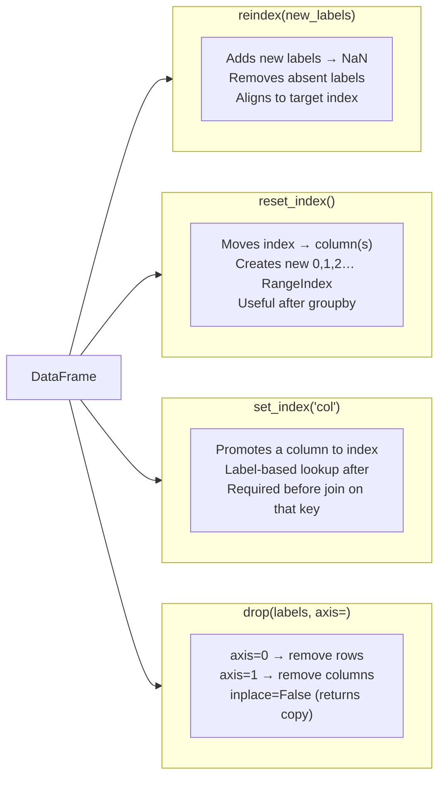

# Reindexing and Dropping Data in Pandas

**After this lesson:** you can explain the core ideas in “Reindexing and Dropping Data in Pandas” and reproduce the examples here in your own notebook or environment.

### Video

<div class="video-embed">
<iframe width="560" height="315" src="https://www.youtube.com/embed/W9XjRYFkkyw" frameborder="0" allow="accelerometer; autoplay; clipboard-write; encrypted-media; gyroscope; picture-in-picture" allowfullscreen></iframe>
</div>

*Corey Schafer — Python pandas tutorial (part 3): indexes (set, reset, reindex)*

## Overview

**Prerequisites:** [DataFrame](./dataframe.md) creation; basic understanding of **row labels** vs positions.

**Why this lesson:** You will often **change** the index (dates, IDs), **drop** bad rows or columns, or **reindex** to match another table’s labels. Doing this deliberately—without scrambling rows—is core data prep.

## Understanding Reindexing

---

### What is Reindexing?

Think of reindexing like reorganizing your data to match a new set of labels. It's a powerful tool for:



*`reindex` is the low-level primitive; `reset_index` and `set_index` are the high-level shortcuts you'll use most often.*

- Rearranging data in a specific order
- Adding new index labels (with placeholder values)
- Removing unwanted index labels
- Aligning multiple datasets
- Restructuring data hierarchies

Real-world applications:

- Aligning financial data from different sources
- Filling in missing dates in time series
- Standardizing country codes/names
- Matching customer records across systems

Let's explore with examples:

---

### Basic Reindexing

Let's start with practical examples:

**Expand Series index and calendar rows**

- **Purpose:** Use `reindex` to introduce new labels (David) or a full month list—missing slots become `NaN` until you fill them.
- **Walkthrough:** `grades.reindex(new_index)` aligns to the new label order; `sales.reindex(all_months)` pads Feb–May.

```python
import pandas as pd
import numpy as np

# Example 1: Student Grades
grades = pd.Series([85, 92, 78], 
                  index=['Alice', 'Bob', 'Charlie'])
print("Original grades:")
print(grades)

# Add a new student and reorder alphabetically
new_index = ['Alice', 'Bob', 'Charlie', 'David']
new_grades = grades.reindex(new_index)
print("\nAfter reindexing (added David):")
print(new_grades)

# Example 2: Sales Data
sales = pd.DataFrame({
    'Revenue': [1000, 1500, 1200],
    'Units': [50, 75, 60]
}, index=['Jan', 'Mar', 'Jun'])
print("\nOriginal sales data:")
print(sales)

# Fill in missing months
all_months = ['Jan', 'Feb', 'Mar', 'Apr', 'May', 'Jun']
complete_sales = sales.reindex(all_months)
print("\nComplete sales data (with missing months):")
print(complete_sales)
```

```
Original grades:
Alice      85
Bob        92
Charlie    78
dtype: int64

After reindexing (added David):
Alice      85.0
Bob        92.0
Charlie    78.0
David       NaN
dtype: float64

Original sales data:
     Revenue  Units
Jan     1000     50
Mar     1500     75
Jun     1200     60

Complete sales data (with missing months):
     Revenue  Units
Jan   1000.0   50.0
Feb      NaN    NaN
Mar   1500.0   75.0
Apr      NaN    NaN
May      NaN    NaN
Jun   1200.0   60.0
```

Notice how 'David' was added with a NaN (Not a Number) value since we didn't have data for them.

---

### Filling Missing Values

When reindexing, you can specify how to handle missing values:

**`ffill` / `bfill` after reindex**

- **Purpose:** Carry last known value forward or backward across newly inserted index labels—common for sparse time series.
- **Walkthrough:** `method='ffill'` / `method='bfill'` (older API style in `reindex`; modern code may use `.ffill()` after reindex).

```python
# Create a Series with missing days
temps = pd.Series([20, 22, 25], 
                 index=['Mon', 'Wed', 'Fri'])
print("Original temperatures:")
print(temps)

# Reindex to include all weekdays
all_days = ['Mon', 'Tue', 'Wed', 'Thu', 'Fri']

# Fill missing values with the previous day's temperature
temps_ffill = temps.reindex(all_days, method='ffill')
print("\nFilled forward:")
print(temps_ffill)

# Fill missing values with the next day's temperature
temps_bfill = temps.reindex(all_days, method='bfill')
print("\nFilled backward:")
print(temps_bfill)
```

## Working with DataFrames

---

### Reindexing DataFrame Rows

You can reindex both rows and columns in a DataFrame:

**Pad sparse weekday rows**

- **Purpose:** Same as Series—extend a DataFrame’s row index to every weekday; new rows are all-NaN until filled.
- **Walkthrough:** Uses `df` with Mon/Wed/Fri then `reindex(all_days)`.

```python
# Create a sample DataFrame
df = pd.DataFrame({
    'temp': [20, 22, 25],
    'humidity': [50, 55, 45]
}, index=['Mon', 'Wed', 'Fri'])

print("Original DataFrame:")
print(df)

# Reindex with all weekdays
all_days = ['Mon', 'Tue', 'Wed', 'Thu', 'Fri']
df_reindexed = df.reindex(all_days)
print("\nAfter reindexing rows:")
print(df_reindexed)
```

```
Original DataFrame:
     temp  humidity
Mon    20        50
Wed    22        55
Fri    25        45

After reindexing rows:
     temp  humidity
Mon  20.0      50.0
Tue   NaN       NaN
Wed  22.0      55.0
Thu   NaN       NaN
Fri  25.0      45.0
```

---

### Reindexing DataFrame Columns

You can also reindex columns to add or rearrange them:

**Add or reorder columns without manual assignment**

- **Purpose:** Insert missing columns as `NaN` or permute column order using the same `reindex` machinery.
- **Walkthrough:** `columns=new_columns` adds `precipitation`; second call swaps `humidity`/`temp`.

```python
# Reindex columns to add 'precipitation'
new_columns = ['temp', 'humidity', 'precipitation']
df_new_cols = df.reindex(columns=new_columns)
print("After adding new column:")
print(df_new_cols)

# Reindex to rearrange columns
df_rearranged = df.reindex(columns=['humidity', 'temp'])
print("\nAfter rearranging columns:")
print(df_rearranged)
```

```
After adding new column:
     temp  humidity  precipitation
Mon    20        50            NaN
Wed    22        55            NaN
Fri    25        45            NaN

After rearranging columns:
     humidity  temp
Mon        50    20
Wed        55    22
Fri        45    25
```

## Dropping Data

---

### Understanding Drop Operations

Dropping is like removing items from your dataset. You can drop:

- Specific rows or columns
- Rows or columns that meet certain conditions
- Missing values

The dropped data is removed from the result but your original data remains unchanged unless you use `inplace=True`.

---

### Dropping Rows

Here's how to drop rows from your data:

**Drop by label and by NaN**

- **Purpose:** Remove a row by integer position label (`drop(1)`) or all rows with any missing value (`dropna()`).
- **Walkthrough:** `drop(1)` uses the **default RangeIndex** positions from `pd.DataFrame(...)`.

```python
# Create a sample DataFrame
df = pd.DataFrame({
    'name': ['Alice', 'Bob', 'Charlie', 'David'],
    'grade': [85, 92, 78, 95],
    'attendance': [100, 95, None, 90]
})
print("Original DataFrame:")
print(df)

# Drop a specific row by index
df_dropped = df.drop(1)  # Drops Bob's row
print("\nAfter dropping row 1:")
print(df_dropped)

# Drop rows with missing values
df_clean = df.dropna()
print("\nAfter dropping rows with missing values:")
print(df_clean)
```

```
Original DataFrame:
      name  grade  attendance
0    Alice     85       100.0
1      Bob     92        95.0
2  Charlie     78         NaN
3    David     95        90.0

After dropping row 1:
      name  grade  attendance
0    Alice     85       100.0
2  Charlie     78         NaN
3    David     95        90.0

After dropping rows with missing values:
    name  grade  attendance
0  Alice     85       100.0
1    Bob     92        95.0
3  David     95        90.0
```

---

### Dropping Columns

You can also drop columns you don't need:

**`axis=1` and column lists**

- **Purpose:** Project down to fewer columns—one or many—without touching rows.
- **Walkthrough:** `axis=1` means “columns”; pass a list to drop several at once.

```python
# Drop a single column
df_no_attendance = df.drop('attendance', axis=1)
print("After dropping attendance column:")
print(df_no_attendance)

# Drop multiple columns
df_names_only = df.drop(['grade', 'attendance'], axis=1)
print("\nAfter dropping multiple columns:")
print(df_names_only)
```

```
After dropping attendance column:
      name  grade
0    Alice     85
1      Bob     92
2  Charlie     78
3    David     95

After dropping multiple columns:
      name
0    Alice
1      Bob
2  Charlie
3    David
```

## Best Practices and Tips

---

### When to Use Reindex

Use reindex when you want to:

1. Align data with a specific order or structure
2. Add new index entries with placeholder values
3. Reorganize columns in a specific order
4. Match the structure of another DataFrame

Example of aligning two DataFrames:

**Match another frame’s index**

- **Purpose:** Before element-wise ops, force `df2` onto `df1`’s row labels so shared keys line up.
- **Walkthrough:** `df2.reindex(df1.index)` introduces row `a` as NaN.

```python
# Two DataFrames with different indexes
df1 = pd.DataFrame({'A': [1, 2, 3]}, index=['a', 'b', 'c'])
df2 = pd.DataFrame({'A': [4, 5, 6]}, index=['b', 'c', 'd'])

# Align df2 to match df1's index
df2_aligned = df2.reindex(df1.index)
print("Aligned DataFrame:")
print(df2_aligned)
```

```
Aligned DataFrame:
     A
a  NaN
b  4.0
c  5.0
```

---

### When to Use Drop

Use drop when you want to:

1. Remove unnecessary columns
2. Clean data by removing rows with missing values
3. Filter out specific rows or columns
4. Create a subset of your data

Example of smart dropping:

**Thresholds, duplicates, conditional row drop**

- **Purpose:** Illustrate `thresh` for partial missing rows, `drop_duplicates`, and dropping by a boolean condition’s index.
- **Walkthrough:** `df` here is the student DataFrame from above—`thresh` keeps rows with at least half the columns non-null.

```python
# Drop rows where more than 50% of values are missing
df_clean = df.dropna(thresh=df.shape[1]//2)

# Drop duplicate rows
df_unique = df.drop_duplicates()

# Drop rows based on a condition
df_filtered = df.drop(df[df['grade'] < 60].index)
```

## Common Pitfalls and Solutions

1. **Forgetting to Assign Results**:

   ```python
   # Wrong: original df unchanged
   df.drop('column_name', axis=1)
   
   # Right: save result or use inplace=True
   df = df.drop('column_name', axis=1)
   # or
   df.drop('column_name', axis=1, inplace=True)
   ```

2. **Wrong Axis**:

   ```python
   # Remember:
   # axis=0 or 'index' for rows
   # axis=1 or 'columns' for columns
   
   # Drop a column
   df.drop('column_name', axis=1)  # or axis='columns'
   
   # Drop a row
   df.drop(0, axis=0)  # or axis='index'
   ```

3. **Chaining Operations**:

   ```python
   # More efficient way to drop multiple items
   df_clean = (df
               .drop('unnecessary_col', axis=1)
               .dropna()
               .drop_duplicates())
   ```

Remember: Always make a copy of your data before dropping or reindexing if you want to preserve the original data structure!

## Next steps

Continue to [Function mapping](./function-mapping.md), then [Sorting and ranking](./sorting-ranking.md) and [Arithmetic and alignment](./arithmetic-alignment.md).
