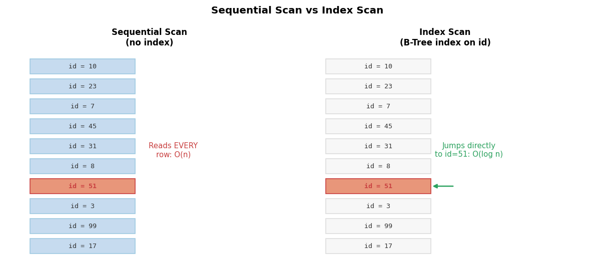

# Advanced SQL Concepts: Beyond the Basics

**After this lesson:** You can use **CTEs** (Common Table Expressions) to structure complex queries, apply **window functions** for rankings and running metrics, and read **EXPLAIN** output to spot expensive scans.

## Helpful video

High-level introduction to SQL and relational databases.

<iframe width="560" height="315" src="https://www.youtube.com/embed/27axs9dO7AE" title="What is SQL?" frameborder="0" allow="accelerometer; autoplay; clipboard-write; encrypted-media; gyroscope; picture-in-picture" allowfullscreen></iframe>

## Overview

**Prerequisites:** Solid comfort with [Joins](joins.md) and [Aggregations](aggregations.md). This lesson goes deeper than day-one analyst SQL—take breaks and run examples in your own database.

> **Time needed:** 90+ minutes; split across sessions if needed.

> **Warning:** Dialects differ (PostgreSQL vs SQL Server vs BigQuery). Treat advanced snippets as patterns and check your engine’s docs for exact syntax.

## Why this matters

Readable SQL survives code review and production debugging. **CTEs** break big questions into named steps; **window functions** answer “rank within group” without self-joins; **EXPLAIN** shows whether the database is scanning whole tables or using indexes. Together, these are the bridge from “it runs” to “it runs efficiently.”

## Introduction to Advanced SQL

SQL mastery goes beyond basic CRUD operations. Advanced SQL concepts enable you to:

- Write complex, performant queries
- Handle large-scale data processing
- Implement sophisticated business logic
- Optimize database operations

## Advanced SQL Functions

### 1. JSON Operations

Applications often store nested payloads (orders with line items, flexible attributes) as **JSON** next to relational columns. Database engines expose functions to build, query, and unnest JSON so you can stay in SQL for many reporting tasks instead of exporting everything to Python first.


-- JSON creation and manipulation
SELECT 
    order_id,
    jsonb_build_object(
        'customer', customer_name,
        'items', (
            SELECT jsonb_agg(
                jsonb_build_object(
                    'product', product_name,
                    'quantity', quantity,
                    'price', price
                )
            )
            FROM order_items oi
            JOIN products p ON oi.product_id = p.product_id
            WHERE oi.order_id = o.order_id
        )
    ) as order_details
FROM orders o
JOIN customers c ON o.customer_id = c.customer_id;

-- JSON querying
SELECT 
    order_id,
    order_details -> 'customer' as customer,
    jsonb_array_length(order_details -> 'items') as item_count,
    jsonb_path_query_array(
        order_details,
        '$.items[*].price'
    ) as prices
FROM order_details_json;


<aside class="code-explainer__callouts" aria-label="Code walkthrough">
  

    

      
      Build a nested JSON object from relational data
    

    

      
<code>jsonb_build_object</code> assembles key-value pairs into a JSONB object. The nested <code>jsonb_agg(jsonb_build_object(…))</code> correlated subquery aggregates all line items for each order into a JSON array under the <code>'items'</code> key—turning a 1:many relationship into a single document per order.

    

  

  

    

      
      Query into stored JSON with path operators
    

    

      
<code>-&gt;</code> extracts a JSON key as JSONB. <code>jsonb_array_length</code> counts elements in a JSON array. <code>jsonb_path_query_array</code> with a JSONPath expression (<code>$.items[*].price</code>) extracts all price values from the nested array into a new array column.

    

  

</aside>

### 2. Full-Text Search


-- Create search vectors
CREATE INDEX idx_products_search ON products USING gin(
    to_tsvector('english', 
        coalesce(name,'') || ' ' || 
        coalesce(description,'') || ' ' || 
        coalesce(category,'')
    )
);

-- Perform search with ranking
SELECT 
    name,
    description,
    ts_rank(
        to_tsvector('english', 
            coalesce(name,'') || ' ' || 
            coalesce(description,'') || ' ' || 
            coalesce(category,'')
        ),
        plainto_tsquery('english', 'search term')
    ) as relevance
FROM products
WHERE to_tsvector('english', 
    coalesce(name,'') || ' ' || 
    coalesce(description,'') || ' ' || 
    coalesce(category,'')
) @@ plainto_tsquery('english', 'search term')
ORDER BY relevance DESC;


<aside class="code-explainer__callouts" aria-label="Code walkthrough">
  

    

      
      GIN index on a combined tsvector for fast full-text search
    

    

      
<code>to_tsvector('english', …)</code> converts text to a lexeme vector (stemmed, stop-words removed). Concatenating name + description + category into one vector means a single GIN index covers searches across all three fields. <code>COALESCE</code> prevents NULL columns from breaking the concatenation.

    

  

  

    

      
      Search with relevance ranking using ts_rank
    

    

      
<code>plainto_tsquery</code> turns a plain search string into a tsquery. The <code>@@</code> operator filters rows whose tsvector matches the query. <code>ts_rank</code> scores each match by how many times terms appear and how prominently—results are ordered by relevance descending.

    

  

</aside>

### 3. Recursive Queries


-- Employee hierarchy
WITH RECURSIVE employee_hierarchy AS (
    -- Base case: top-level employees
    SELECT 
        employee_id,
        name,
        manager_id,
        1 as level,
        ARRAY[name] as path
    FROM employees
    WHERE manager_id IS NULL
    
    UNION ALL
    
    -- Recursive case: employees with managers
    SELECT 
        e.employee_id,
        e.name,
        e.manager_id,
        eh.level + 1,
        eh.path || e.name
    FROM employees e
    JOIN employee_hierarchy eh ON e.manager_id = eh.employee_id
)
SELECT 
    level,
    lpad(' ', (level-1)*2) || name as employee,
    array_to_string(path, ' -> ') as hierarchy_path
FROM employee_hierarchy
ORDER BY path;


<aside class="code-explainer__callouts" aria-label="Code walkthrough">
  

    

      
      Recursive CTE: base case + recursive step
    

    

      
The base case seeds the recursion with top-level employees (<code>manager_id IS NULL</code>) at level 1 with an array path containing just their name. The recursive step joins <code>employees</code> back to the CTE on <code>manager_id = employee_id</code>, incrementing level and appending each employee's name to the path array.

    

  

  

    

      
      Outer query: format the hierarchy as indented text
    

    

      
<code>lpad(' ', (level-1)*2) || name</code> indents each name by two spaces per level. <code>array_to_string(path, ' -&gt; ')</code> renders the ancestry chain from root to current employee. <code>ORDER BY path</code> keeps employees grouped under their manager in tree order.

    

  

</aside>

## Window Functions Deep Dive

### 1. Advanced Framing


SELECT 
    date,
    amount,
    -- Different frame specifications
    SUM(amount) OVER (
        ORDER BY date
        ROWS BETWEEN 
            UNBOUNDED PRECEDING 
            AND CURRENT ROW
    ) as cumulative_sum,
    
    AVG(amount) OVER (
        ORDER BY date
        ROWS BETWEEN 
            3 PRECEDING 
            AND 1 FOLLOWING
    ) as centered_average,
    
    SUM(amount) OVER (
        ORDER BY date
        RANGE BETWEEN 
            INTERVAL '1 month' PRECEDING 
            AND CURRENT ROW
    ) as rolling_monthly_sum
FROM transactions;


<aside class="code-explainer__callouts" aria-label="Code walkthrough">
  

    

      
      ROWS BETWEEN UNBOUNDED PRECEDING AND CURRENT ROW: cumulative sum
    

    

      
<code>ROWS BETWEEN UNBOUNDED PRECEDING AND CURRENT ROW</code> expands the frame from the first row up to and including the current row—a standard running total. Every new row adds to the previous cumulative sum.

    

  

  

    

      
      Centered average and rolling monthly sum with different frame modes
    

    

      
<code>ROWS BETWEEN 3 PRECEDING AND 1 FOLLOWING</code> averages the 3 rows before and 1 row after the current row—a centered moving average. <code>RANGE BETWEEN INTERVAL '1 month' PRECEDING</code> uses value-based framing on date rather than row counts, summing all transactions within the past calendar month.

    

  

</aside>

### 2. Multiple Window Functions


SELECT 
    category,
    product_name,
    price,
    -- Rankings within category
    RANK() OVER w1 as price_rank,
    DENSE_RANK() OVER w1 as dense_rank,
    ROW_NUMBER() OVER w1 as row_num,
    
    -- Statistics within category
    AVG(price) OVER w2 as avg_price,
    price - AVG(price) OVER w2 as price_diff,
    
    -- Percentiles within category
    NTILE(4) OVER w1 as price_quartile,
    PERCENT_RANK() OVER w1 as price_percentile
FROM products
WINDOW 
    w1 as (PARTITION BY category ORDER BY price DESC),
    w2 as (PARTITION BY category);


<aside class="code-explainer__callouts" aria-label="Code walkthrough">
  

    

      
      Ranking functions share a named window w1
    

    

      
<code>RANK()</code>, <code>DENSE_RANK()</code>, and <code>ROW_NUMBER()</code> all reference the named window <code>w1</code> (partitioned by category, ordered by price descending). Using a <code>WINDOW</code> clause defines it once and avoids repeating the full <code>OVER (PARTITION BY … ORDER BY …)</code> for every function.

    

  

  

    

      
      Statistics and percentile functions use a second window w2
    

    

      
<code>w2</code> partitions by category without an ORDER BY—it aggregates over the entire category group rather than a cumulative frame. <code>price - AVG(price) OVER w2</code> shows each product's deviation from its category average. <code>NTILE(4)</code> and <code>PERCENT_RANK()</code> use <code>w1</code> to assign price quartiles and percentile positions within category.

    

  

</aside>

## Advanced Joins and Set Operations

### 1. Lateral Joins


SELECT 
    c.customer_name,
    recent_orders.order_id,
    recent_orders.order_date,
    recent_orders.amount
FROM customers c
CROSS JOIN LATERAL (
    SELECT 
        order_id,
        order_date,
        total_amount as amount
    FROM orders o
    WHERE o.customer_id = c.customer_id
    ORDER BY order_date DESC
    LIMIT 3
) recent_orders;


<aside class="code-explainer__callouts" aria-label="Code walkthrough">
  

    

      
      Outer query selects columns from both the main table and the lateral subquery
    

    

      
Columns from the <code>recent_orders</code> lateral subquery are referenced directly in the outer SELECT, just like columns from a regular joined table. The alias <code>recent_orders</code> is what makes them available.

    

  

  

    

      
      LATERAL subquery: top-3 orders per customer
    

    

      
The subquery references <code>c.customer_id</code> from the outer <code>FROM customers c</code>—that's what makes it a lateral join. It runs once per customer row, returning that customer's 3 most recent orders. This is cleaner and often faster than a window-function approach when a hard per-group row limit is needed.

    

  

</aside>

### 2. Set Operations with Ordering


-- Complex set operations
(
    SELECT 
        'Current' as period,
        category,
        SUM(amount) as total_sales
    FROM sales
    WHERE date >= CURRENT_DATE - INTERVAL '1 month'
    GROUP BY category
)
UNION ALL
(
    SELECT 
        'Previous' as period,
        category,
        SUM(amount) as total_sales
    FROM sales
    WHERE 
        date >= CURRENT_DATE - INTERVAL '2 months' AND
        date < CURRENT_DATE - INTERVAL '1 month'
    GROUP BY category
)
ORDER BY 
    category,
    period DESC;


<aside class="code-explainer__callouts" aria-label="Code walkthrough">
  

    

      
      First branch: current month's sales by category
    

    

      
The first SELECT adds a literal <code>'Current'</code> period label, filters to the last month, and aggregates sales by category. Parentheses are required when combining set operations with individual ORDER BY or LIMIT clauses on each branch.

    

  

  

    

      
      UNION ALL + ORDER BY: stack periods and sort together
    

    

      
<code>UNION ALL</code> stacks both result sets (retaining duplicates, faster than <code>UNION</code>). The trailing <code>ORDER BY category, period DESC</code> sorts the combined result so current and previous figures appear together per category for easy comparison.

    

  

</aside>

## Error Handling and Transactions

### 1. Transaction Management


-- Complex transaction with savepoints
BEGIN;

SAVEPOINT order_start;

-- Create order
INSERT INTO orders (customer_id, order_date, status)
VALUES (123, CURRENT_TIMESTAMP, 'pending')
RETURNING order_id INTO v_order_id;

-- Check inventory and update stock
UPDATE products
SET stock_quantity = stock_quantity - order_quantity
WHERE product_id = v_product_id
AND stock_quantity >= order_quantity;

IF NOT FOUND THEN
    ROLLBACK TO order_start;
    RAISE EXCEPTION 'Insufficient stock for product %', v_product_id;
END IF;

-- Process payment
SAVEPOINT payment;

BEGIN
    -- Payment processing logic
    IF payment_failed THEN
        ROLLBACK TO payment;
        RAISE EXCEPTION 'Payment failed';
    END IF;
EXCEPTION
    WHEN OTHERS THEN
        ROLLBACK TO payment;
        RAISE;
END;

COMMIT;


<aside class="code-explainer__callouts" aria-label="Code walkthrough">
  

    

      
      BEGIN + SAVEPOINT: create a partial rollback point
    

    

      
<code>BEGIN</code> starts the transaction. <code>SAVEPOINT order_start</code> marks a point within the transaction that can be rolled back to without abandoning the entire transaction. The INSERT creates the order and returns its generated ID via <code>RETURNING … INTO</code>.

    

  

  

    

      
      Deduct stock and roll back to savepoint on failure
    

    

      
The UPDATE deducts quantity but only if stock is sufficient (<code>stock_quantity &gt;= order_quantity</code> in the WHERE). <code>IF NOT FOUND</code> detects that no row was updated—meaning insufficient stock—and rolls back to <code>order_start</code> before raising an exception.

    

  

  

    

      
      Nested savepoint for payment; commit everything on success
    

    

      
A second <code>SAVEPOINT payment</code> scopes the payment step. If the payment logic raises an exception, <code>ROLLBACK TO payment</code> undoes only the payment attempt, preserving the order and inventory changes. <code>COMMIT</code> at the end persists the entire transaction atomically.

    

  

</aside>

### 2. Error Handling


CREATE OR REPLACE FUNCTION process_order(
    p_customer_id INT,
    p_items JSONB
) RETURNS INT AS $$
DECLARE
    v_order_id INT;
    v_item JSONB;
    v_total DECIMAL(10,2) := 0;
BEGIN
    -- Input validation
    IF p_items IS NULL OR jsonb_array_length(p_items) = 0 THEN
        RAISE EXCEPTION 'Order must contain at least one item';
    END IF;
    
    -- Start transaction
    BEGIN
        -- Create order
        INSERT INTO orders (customer_id, order_date, status)
        VALUES (p_customer_id, CURRENT_TIMESTAMP, 'pending')
        RETURNING order_id INTO v_order_id;
        
        -- Process items
        FOR v_item IN SELECT * FROM jsonb_array_elements(p_items)
        LOOP
            -- Add order item
            BEGIN
                INSERT INTO order_items (
                    order_id, 
                    product_id,
                    quantity,
                    price
                )
                VALUES (
                    v_order_id,
                    (v_item->>'product_id')::INT,
                    (v_item->>'quantity')::INT,
                    (v_item->>'price')::DECIMAL
                );
            EXCEPTION
                WHEN foreign_key_violation THEN
                    RAISE EXCEPTION 'Invalid product ID: %',
                        (v_item->>'product_id');
                WHEN numeric_value_out_of_range THEN
                    RAISE EXCEPTION 'Invalid quantity or price for product %',
                        (v_item->>'product_id');
            END;
            
            -- Update total
            v_total := v_total + 
                ((v_item->>'quantity')::INT * (v_item->>'price')::DECIMAL);
        END LOOP;
        
        -- Update order total
        UPDATE orders 
        SET total_amount = v_total,
            status = 'confirmed'
        WHERE order_id = v_order_id;
        
        RETURN v_order_id;
    EXCEPTION
        WHEN OTHERS THEN
            RAISE EXCEPTION 'Order processing failed: %', SQLERRM;
    END;
END;
$$ LANGUAGE plpgsql;


<aside class="code-explainer__callouts" aria-label="Code walkthrough">
  

    

      
      Function signature, variables, and input validation
    

    

      
The function accepts a customer ID and a JSONB array of items and returns the new order ID. The DECLARE block initializes loop and total variables. An early guard raises an exception immediately if the items array is NULL or empty—fail fast before any writes.

    

  

  

    

      
      Create the order and iterate over JSON items
    

    

      
The inner BEGIN wraps everything in a subtransaction. The INSERT creates the order row and captures its generated ID via <code>RETURNING … INTO v_order_id</code>. <code>FOR v_item IN SELECT * FROM jsonb_array_elements(p_items)</code> iterates over each JSON object in the array.

    

  

  

    

      
      Insert each line item with per-item exception handling
    

    

      
Each order item is inserted inside its own BEGIN…EXCEPTION block. <code>WHEN foreign_key_violation</code> catches invalid product IDs; <code>WHEN numeric_value_out_of_range</code> catches bad quantity or price. Catching specific exception codes gives actionable error messages rather than a generic failure.

    

  

  

    

      
      Accumulate total, update order, and handle outer exceptions
    

    

      
After each item is inserted the running total is accumulated. After the loop, the order is updated with the final total and status <code>'confirmed'</code>. The outer <code>WHEN OTHERS</code> handler wraps all remaining errors—converting any unexpected exception into a clear <code>'Order processing failed: …'</code> message.

    

  

</aside>

## Additional Real-World Scenarios

### 1. E-commerce Funnel Analysis


WITH user_journey AS (
    SELECT 
        u.user_id,
        u.email,
        COUNT(DISTINCT CASE WHEN e.event_type = 'view' THEN e.product_id END) as products_viewed,
        COUNT(DISTINCT CASE WHEN e.event_type = 'add_to_cart' THEN e.product_id END) as products_carted,
        COUNT(DISTINCT CASE WHEN e.event_type = 'purchase' THEN e.product_id END) as products_purchased,
        COUNT(DISTINCT CASE WHEN e.event_type = 'purchase' THEN e.session_id END) as purchase_sessions,
        COUNT(DISTINCT e.session_id) as total_sessions
    FROM users u
    LEFT JOIN events e ON u.user_id = e.user_id
    GROUP BY u.user_id, u.email
)
SELECT 
    ROUND(AVG(products_viewed)::numeric, 2) as avg_products_viewed,
    ROUND(AVG(products_carted)::numeric, 2) as avg_products_carted,
    ROUND(AVG(products_purchased)::numeric, 2) as avg_products_purchased,
    ROUND(
        100.0 * SUM(CASE WHEN products_carted > 0 THEN 1 END) / 
        NULLIF(SUM(CASE WHEN products_viewed > 0 THEN 1 END), 0),
        2
    ) as view_to_cart_rate,
    ROUND(
        100.0 * SUM(CASE WHEN products_purchased > 0 THEN 1 END) / 
        NULLIF(SUM(CASE WHEN products_carted > 0 THEN 1 END), 0),
        2
    ) as cart_to_purchase_rate
FROM user_journey;


<aside class="code-explainer__callouts" aria-label="Code walkthrough">
  

    

      
      CTE: per-user funnel event counts
    

    

      
LEFT JOIN keeps all users, including those with no events. <code>COUNT(DISTINCT CASE WHEN event_type = '…' THEN product_id END)</code> counts unique products at each funnel stage (view → cart → purchase) per user in a single pass—no self-joins needed.

    

  

  

    

      
      Outer query: funnel conversion rates across all users
    

    

      
Averages each per-user count, then computes view-to-cart and cart-to-purchase rates. <code>NULLIF(…, 0)</code> in the denominator prevents division-by-zero when no users reached a prior stage. The cast to <code>::numeric</code> is needed because <code>ROUND</code> requires a numeric type.

    

  

</aside>

### 2. Fraud Detection System


WITH transaction_metrics AS (
    SELECT 
        t.transaction_id,
        t.user_id,
        t.amount,
        t.created_at,
        t.status,
        -- Time since last transaction
        EXTRACT(EPOCH FROM (
            t.created_at - LAG(t.created_at) OVER (
                PARTITION BY t.user_id 
                ORDER BY t.created_at
            )
        ))/60 as minutes_since_last_txn,
        -- Amount compared to user's average
        amount / NULLIF(AVG(amount) OVER (
            PARTITION BY t.user_id
        ), 0) as amount_vs_avg,
        -- Number of transactions in last hour
        COUNT(*) OVER (
            PARTITION BY t.user_id 
            ORDER BY t.created_at 
            RANGE BETWEEN INTERVAL '1 hour' PRECEDING 
            AND CURRENT ROW
        ) as txns_last_hour,
        -- Different locations in last 24 hours
        COUNT(DISTINCT location_id) OVER (
            PARTITION BY t.user_id 
            ORDER BY t.created_at 
            RANGE BETWEEN INTERVAL '24 hours' PRECEDING 
            AND CURRENT ROW
        ) as locations_24h
    FROM transactions t
)
SELECT 
    transaction_id,
    user_id,
    amount,
    created_at,
    CASE 
        WHEN minutes_since_last_txn < 1 
        AND amount_vs_avg > 3 THEN 'High Risk: Rapid Large Transaction'
        WHEN txns_last_hour > 10 THEN 'High Risk: High Frequency'
        WHEN locations_24h > 3 THEN 'High Risk: Multiple Locations'
        WHEN amount_vs_avg > 5 THEN 'Medium Risk: Unusual Amount'
        WHEN minutes_since_last_txn < 5 THEN 'Medium Risk: Rapid Transactions'
        ELSE 'Low Risk'
    END as risk_assessment
FROM transaction_metrics
WHERE 
    minutes_since_last_txn < 5 
    OR amount_vs_avg > 3 
    OR txns_last_hour > 10 
    OR locations_24h > 3;


<aside class="code-explainer__callouts" aria-label="Code walkthrough">
  

    

      
      CTE: compute time-since-last and amount-vs-average per transaction
    

    

      
<code>LAG(created_at) OVER (PARTITION BY user_id ORDER BY created_at)</code> gets the previous transaction time for the same user. Dividing the epoch difference by 60 converts seconds to minutes. <code>amount / AVG(amount) OVER (PARTITION BY user_id)</code> normalizes each transaction against the user's own historical average—values well above 1 flag unusually large amounts.

    

  

  

    

      
      CTE: transaction frequency and location diversity window functions
    

    

      
<code>COUNT(*) OVER (… RANGE BETWEEN INTERVAL '1 hour' PRECEDING …)</code> counts all of the user's transactions in the last hour using value-based framing on the timestamp. Similarly, <code>COUNT(DISTINCT location_id)</code> counts unique locations in 24 hours—sudden multi-location activity is a classic fraud signal.

    

  

  

    

      
      Outer query: classify each suspicious transaction by risk tier
    

    

      
The CASE expression maps combinations of computed signals to risk labels. The WHERE clause filters to only transactions that triggered at least one signal threshold—excluding low-risk transactions from the result set keeps the output focused on actionable alerts.

    

  

</aside>

### 3. Inventory Optimization


WITH inventory_metrics AS (
    SELECT 
        p.product_id,
        p.name,
        p.category,
        p.stock_quantity,
        p.reorder_point,
        p.lead_time_days,
        -- Sales velocity
        SUM(oi.quantity) FILTER (
            WHERE o.order_date >= CURRENT_DATE - INTERVAL '30 days'
        ) as units_sold_30d,
        -- Stockout incidents
        COUNT(*) FILTER (
            WHERE p.stock_quantity = 0
        ) as stockout_count,
        -- Average daily sales
        COALESCE(
            SUM(oi.quantity) FILTER (
                WHERE o.order_date >= CURRENT_DATE - INTERVAL '90 days'
            )::float / 90,
            0
        ) as avg_daily_sales,
        -- Safety stock calculation
        SQRT(
            POWER(p.lead_time_days * STDDEV(oi.quantity), 2) +
            POWER(AVG(oi.quantity) * STDDEV(p.lead_time_days), 2)
        ) as safety_stock
    FROM products p
    LEFT JOIN order_items oi ON p.product_id = oi.product_id
    LEFT JOIN orders o ON oi.order_id = o.order_id
    GROUP BY 
        p.product_id, p.name, p.category, 
        p.stock_quantity, p.reorder_point, p.lead_time_days
)
SELECT 
    name,
    category,
    stock_quantity,
    units_sold_30d,
    ROUND(avg_daily_sales::numeric, 2) as avg_daily_sales,
    ROUND(safety_stock::numeric, 2) as recommended_safety_stock,
    CASE 
        WHEN stock_quantity = 0 THEN 'Out of Stock'
        WHEN stock_quantity < safety_stock THEN 'Below Safety Stock'
        WHEN stock_quantity < reorder_point THEN 'Reorder Needed'
        ELSE 'Adequate Stock'
    END as stock_status,
    CEIL(
        CASE 
            WHEN avg_daily_sales > 0 
            THEN stock_quantity / avg_daily_sales
            ELSE NULL
        END
    ) as days_of_inventory,
    ROUND(
        GREATEST(
            reorder_point - stock_quantity,
            (avg_daily_sales * lead_time_days) - stock_quantity,
            0
        )::numeric,
        0
    ) as suggested_order_quantity
FROM inventory_metrics
ORDER BY 
    CASE 
        WHEN stock_quantity = 0 THEN 1
        WHEN stock_quantity < safety_stock THEN 2
        WHEN stock_quantity < reorder_point THEN 3
        ELSE 4
    END,
    avg_daily_sales DESC;


<aside class="code-explainer__callouts" aria-label="Code walkthrough">
  

    

      
      CTE: compute sales velocity, stockouts, and safety stock
    

    

      
LEFT JOINs keep all products even with no sales history. <code>SUM(oi.quantity) FILTER (WHERE …)</code> restricts the aggregation to a time window without a subquery. The safety stock formula (<code>SQRT(POWER(…) + POWER(…))</code>) combines lead-time variability and demand variability into a statistical buffer quantity.

    

  

  

    

      
      Outer query: stock status labels and days-of-inventory
    

    

      
The CASE expression classifies each product's stock level against safety stock and reorder point thresholds. <code>CEIL(stock_quantity / avg_daily_sales)</code> estimates how many days remain before stockout; the outer CASE guards against NULL when daily sales are zero.

    

  

  

    

      
      Suggested order quantity and priority sort
    

    

      
<code>GREATEST(reorder_point - stock, lead_time_demand - stock, 0)</code> picks the larger of the two replenishment signals and clamps at zero. The ORDER BY CASE assigns urgency ranks (out-of-stock first, then below safety stock, etc.) so buyers see the most critical items at the top.

    

  

</aside>

## Performance Optimization Tips

### 1. Query Plan Analysis


-- Analyze and explain complex queries
EXPLAIN (ANALYZE, BUFFERS, FORMAT JSON)
SELECT 
    c.customer_name,
    COUNT(*) as order_count,
    SUM(o.total_amount) as total_spent
FROM customers c
JOIN orders o ON c.customer_id = o.customer_id
WHERE 
    o.order_date >= CURRENT_DATE - INTERVAL '1 year'
    AND o.total_amount > 100
GROUP BY c.customer_id, c.customer_name
HAVING COUNT(*) > 5
ORDER BY total_spent DESC;

-- Key metrics to monitor:
-- 1. Planning Time
-- 2. Execution Time
-- 3. Actual vs. Planned Rows
-- 4. Buffer Usage (shared_blks_hit vs. shared_blks_read)


<aside class="code-explainer__callouts" aria-label="Code walkthrough">
  

    

      
      EXPLAIN with ANALYZE, BUFFERS, and FORMAT JSON
    

    

      
<code>EXPLAIN (ANALYZE, BUFFERS, FORMAT JSON)</code> actually executes the query and returns the plan with real row counts, timing, and buffer statistics in JSON format. This is the most informative form: you can compare actual vs. estimated rows to spot bad cardinality estimates that mislead the planner.

    

  

  

    

      
      Key metrics to look for in the output
    

    

      
Focus on planning time vs. execution time (high planning time suggests many possible plans), actual vs. planned row counts (large discrepancies indicate stale statistics), and buffer usage (<code>shared_blks_hit</code> vs. <code>shared_blks_read</code>—cache misses drive I/O).

    

  

</aside>

### 2. Index Design Patterns


-- Composite indexes for range + equality
CREATE INDEX idx_orders_customer_date 
ON orders(customer_id, order_date DESC);

-- Partial indexes for specific queries
CREATE INDEX idx_high_value_orders 
ON orders(order_date)
WHERE total_amount > 1000;

-- Expression indexes for function calls
CREATE INDEX idx_order_date_truncated 
ON orders(DATE_TRUNC('month', order_date));

-- Include columns to avoid table lookups
CREATE INDEX idx_orders_customer_details 
ON orders(customer_id)
INCLUDE (order_date, total_amount, status);


<aside class="code-explainer__callouts" aria-label="Code walkthrough">
  

    

      
      Composite and partial indexes for common query patterns
    

    

      
The composite index <code>(customer_id, order_date DESC)</code> supports queries that filter on customer and sort by date—the leading equality column is most selective. The partial index on <code>total_amount &gt; 1000</code> covers a common high-value-order filter with a much smaller index than a full-table index.

    

  

  

    

      
      Expression and covering indexes
    

    

      
An expression index on <code>DATE_TRUNC('month', order_date)</code> lets the planner use an index scan for <code>WHERE DATE_TRUNC('month', order_date) = …</code> instead of a sequential scan. The INCLUDE index stores extra columns in the leaf pages so queries can be satisfied from the index alone without a heap lookup.

    

  

</aside>

### 3. Materialized Views with Refresh Strategies


-- Create materialized view
CREATE MATERIALIZED VIEW sales_summary AS
SELECT 
    DATE_TRUNC('day', order_date) as sale_date,
    category,
    SUM(total_amount) as revenue,
    COUNT(*) as order_count
FROM orders o
JOIN order_items oi ON o.order_id = oi.order_id
JOIN products p ON oi.product_id = p.product_id
GROUP BY 
    DATE_TRUNC('day', order_date),
    category;

-- Create indexes on materialized view
CREATE INDEX idx_sales_summary_date 
ON sales_summary(sale_date DESC);

CREATE INDEX idx_sales_summary_category 
ON sales_summary(category, sale_date DESC);

-- Refresh strategy
CREATE OR REPLACE FUNCTION refresh_sales_summary()
RETURNS trigger AS $$
BEGIN
    REFRESH MATERIALIZED VIEW CONCURRENTLY sales_summary;
    RETURN NULL;
END;
$$ LANGUAGE plpgsql;

-- Trigger for automatic refresh
CREATE TRIGGER refresh_sales_summary_trigger
AFTER INSERT OR UPDATE OR DELETE ON orders
FOR EACH STATEMENT
EXECUTE FUNCTION refresh_sales_summary();


<aside class="code-explainer__callouts" aria-label="Code walkthrough">
  

    

      
      Materialize a daily sales summary across three joined tables
    

    

      
The view pre-computes daily revenue and order count by category. Storing the result on disk means dashboards read from a single aggregated table instead of re-joining and re-aggregating millions of rows on every request.

    

  

  

    

      
      Index the materialized view for fast date and category queries
    

    

      
The descending date index accelerates recent-first queries; the composite <code>(category, sale_date DESC)</code> index supports filtering by category and sorting by date together without a sort step.

    

  

  

    

      
      Trigger-based auto-refresh on order changes
    

    

      
A statement-level trigger fires after any INSERT, UPDATE, or DELETE on <code>orders</code> and calls <code>REFRESH MATERIALIZED VIEW CONCURRENTLY</code>—which updates the view without locking readers. This keeps the summary current automatically after every order write.

    

  

</aside>

## Common Pitfalls and Solutions

### 1. N+1 Query Problem


-- Bad: Separate query for each order
SELECT 
    o.order_id,
    (
        SELECT c.name 
        FROM customers c 
        WHERE c.id = o.customer_id
    ) as customer_name,
    (
        SELECT COUNT(*) 
        FROM order_items oi 
        WHERE oi.order_id = o.order_id
    ) as item_count
FROM orders o;

-- Good: Use JOINs and window functions
SELECT 
    o.order_id,
    c.name as customer_name,
    COUNT(*) OVER (PARTITION BY o.order_id) as item_count
FROM orders o
JOIN customers c ON o.customer_id = c.id
JOIN order_items oi ON o.order_id = oi.order_id;


<aside class="code-explainer__callouts" aria-label="Code walkthrough">
  

    

      
      Bad: two correlated subqueries run once per order row
    

    

      
One scalar subquery fetches the customer name and another counts order items—both are correlated, meaning they re-execute for every row in <code>orders</code>. With 10,000 orders that's 20,001 queries total instead of one.

    

  

  

    

      
      Good: single query with JOINs and a window function
    

    

      
Replacing both subqueries with JOINs and <code>COUNT(*) OVER (PARTITION BY o.order_id)</code> resolves everything in a single query plan execution. The window function counts items per order without a GROUP BY, so all original columns remain available.

    

  

</aside>

### 2. Inefficient Date Handling


-- Bad: Function on column prevents index use
SELECT * 
FROM orders 
WHERE EXTRACT(YEAR FROM order_date) = 2023;

-- Good: Range condition uses index
SELECT * 
FROM orders 
WHERE order_date >= '2023-01-01' 
AND order_date < '2024-01-01';


<aside class="code-explainer__callouts" aria-label="Code walkthrough">
  

    

      
      Bad: wrapping a column in a function forces a full table scan
    

    

      
<code>EXTRACT(YEAR FROM order_date) = 2023</code> applies a function to every row before comparing—no index on <code>order_date</code> can be used. This is called a non-sargable predicate.

    

  

  

    

      
      Good: range predicate on the raw column uses the index
    

    

      
Rewriting as <code>order_date &gt;= '2023-01-01' AND order_date &lt; '2024-01-01'</code> keeps the column unmodified—the planner can use an index range scan instead of reading every row.

    

  

</aside>

### 3. Subquery Performance


-- Bad: Correlated subquery runs for each row
SELECT 
    product_name,
    (
        SELECT AVG(quantity)
        FROM order_items oi
        WHERE oi.product_id = p.product_id
    ) as avg_quantity
FROM products p;

-- Good: Use window functions or JOIN
SELECT 
    p.product_name,
    AVG(oi.quantity) OVER (
        PARTITION BY p.product_id
    ) as avg_quantity
FROM products p
LEFT JOIN order_items oi ON p.product_id = oi.product_id;


<aside class="code-explainer__callouts" aria-label="Code walkthrough">
  

    

      
      Bad: correlated subquery re-aggregates for every product row
    

    

      
The scalar subquery inside SELECT references <code>p.product_id</code> from the outer query—it's correlated. The planner must run a separate aggregation over <code>order_items</code> for each product row, which doesn't scale with large catalogs.

    

  

  

    

      
      Good: window function over a single join pass
    

    

      
<code>AVG(oi.quantity) OVER (PARTITION BY p.product_id)</code> computes the average in a single pass over the joined rows. LEFT JOIN preserves products with no order items (returning NULL for the average) rather than dropping them.

    

  

</aside>

Remember: "Performance optimization is an iterative process - measure, analyze, improve!"

## Best Practices and Guidelines

### 1. Query Writing

- Write self-documenting queries with clear aliases
- Use CTEs for better readability and maintenance
- Leverage appropriate indexes for performance
- Consider query plan and execution cost

### 2. Database Design

- Implement proper constraints and relationships
- Use appropriate data types
- Design with scalability in mind
- Regular maintenance and optimization

### 3. Development Process

- Version control your database changes
- Implement proper testing procedures
- Monitor query performance
- Regular code reviews and optimization

## Additional Resources

1. **Documentation**
   - [PostgreSQL Documentation](https://www.postgresql.org/docs/)
   - [SQL Performance Tuning](https://use-the-index-luke.com/)
   - [Modern SQL Guide](https://modern-sql.com/)

2. **Tools**
   - [pgAdmin](https://www.pgadmin.org/) for database management
   - [DBeaver](https://dbeaver.io/) for query development
   - [pg_stat_statements](https://www.postgresql.org/docs/current/pgstatstatements.html) for query analysis

Remember: "Complex queries should be like well-written essays - clear, structured, and purposeful!"

## Next steps

- [SQL project](project.md) — consolidate skills in one scenario
- [Exploratory Data Analysis (Module 2.3)](../2.3-eda/README.md) — after you extract data, explore it in Python
- [Module README](README.md) — resources and assignment
