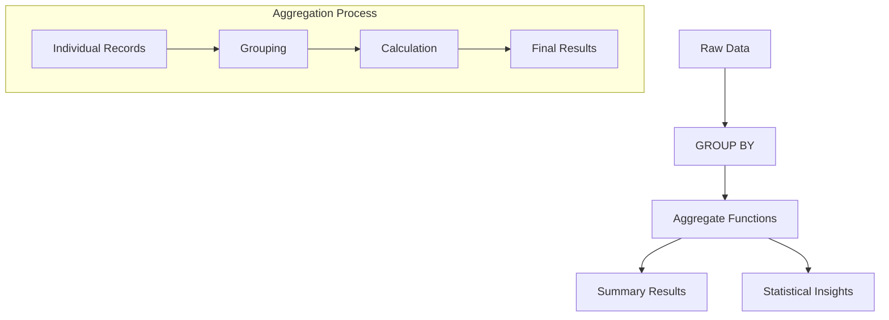

# SQL Aggregations: Transforming Data into Insights

**After this lesson:** You can group rows with **GROUP BY**, apply aggregate functions (**COUNT**, **SUM**, **AVG**, etc.), filter groups with **HAVING**, and use basic window functions for running totals and ranks.

## Helpful video

High-level introduction to SQL and relational databases.

<iframe width="560" height="315" src="https://www.youtube.com/embed/27axs9dO7AE" title="What is SQL?" frameborder="0" allow="accelerometer; autoplay; clipboard-write; encrypted-media; gyroscope; picture-in-picture" allowfullscreen></iframe>

## Overview

**Prerequisites:** [Basic SQL Operations](basic-operations.md) (**SELECT**, **WHERE**, **ORDER BY**). Comfortable with grouping ideas from descriptive stats in [Intro Statistics](../../1-data-fundamentals/1.3-intro-statistics/README.md) is helpful but not required.

> **Time needed:** About 60 minutes, plus time for exercises.

## Understanding Aggregations

Aggregations in SQL transform detailed data into meaningful summaries. Think of it like:

- Raw data = Individual grocery receipts
- Aggregated data = Monthly spending summary

## Aggregate Functions

### Basic Statistical Functions

1. **COUNT**: Row Counter

   

   

   
   
      -- Different COUNT variations
      SELECT 
          COUNT(*) as total_rows,           -- All rows
          COUNT(1) as also_total_rows,      -- Same as COUNT(*)
          COUNT(column) as non_null_values,  -- Excludes NULL
          COUNT(DISTINCT column) as unique_values
      FROM table;
      
      -- Example: Customer order analysis
      SELECT 
          customer_id,
          COUNT(*) as total_orders,
          COUNT(DISTINCT product_id) as unique_products,
          COUNT(DISTINCT DATE_TRUNC('month', order_date)) as active_months
      FROM orders
      GROUP BY customer_id;
   
   

   <aside class="code-explainer__callouts" aria-label="Code walkthrough">
     

       

         
         Different COUNT variations
       

       

         
Lines 1–8: follow this band in the snippet.

       

     

     

       

         
         Example: Customer order analysis
       

       

         
Lines 9–16: follow this band in the snippet.

       

     

   </aside>
   

2. **SUM**: Numerical Addition

   

   

   
   
      -- Sales Analysis
      SELECT 
          category,
          SUM(amount) as total_sales,
          SUM(amount) FILTER (WHERE status = 'completed') as completed_sales,
          SUM(CASE 
              WHEN status = 'completed' THEN amount 
              ELSE 0 
          END) as another_way_completed_sales
      FROM sales
      GROUP BY category;
      
      -- Running totals
      SELECT 
          order_date,
          amount,
          SUM(amount) OVER (
              ORDER BY order_date
              ROWS BETWEEN UNBOUNDED PRECEDING AND CURRENT ROW
          ) as running_total
      FROM sales;
   
   

   <aside class="code-explainer__callouts" aria-label="Code walkthrough">
     

       

         
         Sales Analysis
       

       

         
Lines 1–10: follow this band in the snippet.

       

     

     

       

         
         GROUP BY category;
       

       

         
Lines 11–21: follow this band in the snippet.

       

     

   </aside>
   

3. **AVG**: Mean Calculator

   

   

   
   
      -- Price Analysis with Standard Error
      SELECT 
          category,
          COUNT(*) as product_count,
          AVG(price) as mean_price,
          STDDEV(price) / SQRT(COUNT(*)) as standard_error,
          AVG(price) - (STDDEV(price) / SQRT(COUNT(*)) * 1.96) as ci_lower,
          AVG(price) + (STDDEV(price) / SQRT(COUNT(*)) * 1.96) as ci_upper
      FROM products
      GROUP BY category;
      
      -- Moving averages
      SELECT 
          sale_date,
          amount,
          AVG(amount) OVER (
              ORDER BY sale_date
              ROWS BETWEEN 6 PRECEDING AND CURRENT ROW
          ) as moving_7day_avg
      FROM daily_sales;
   
   

   <aside class="code-explainer__callouts" aria-label="Code walkthrough">
     

       

         
         Price Analysis with Standard Error
       

       

         
Lines 1–10: follow this band in the snippet.

       

     

     

       

         
         Moving averages
       

       

         
Lines 11–20: follow this band in the snippet.

       

     

   </aside>
   

4. **MIN/MAX**: Range Identifiers

   

   

   
   
      -- Price Range Analysis
      SELECT 
          category,
          MIN(price) as min_price,
          MAX(price) as max_price,
          MAX(price) - MIN(price) as price_range,
          ROUND(
              (MAX(price) - MIN(price)) / NULLIF(AVG(price), 0) * 100,
              2
          ) as price_spread_percentage
      FROM products
      GROUP BY category;
      
      -- First/Last values
      SELECT 
          customer_id,
          MIN(order_date) as first_order,
          MAX(order_date) as last_order,
          MAX(order_date) - MIN(order_date) as customer_lifespan
      FROM orders
      GROUP BY customer_id;
   
   

   <aside class="code-explainer__callouts" aria-label="Code walkthrough">
     

       

         
         Price Range Analysis
       

       

         
Lines 1–10: follow this band in the snippet.

       

     

     

       

         
         FROM products
       

       

         
Lines 11–21: follow this band in the snippet.

       

     

   </aside>
   

## Advanced Aggregation Concepts

### Window Functions Deep Dive

Window functions perform calculations across a set of table rows related to the current row.


-- Employee salary analysis by department
SELECT 
    employee_name,
    department,
    salary,
    AVG(salary) OVER (PARTITION BY department) as dept_avg_salary,
    salary - AVG(salary) OVER (PARTITION BY department) as diff_from_avg,
    RANK() OVER (PARTITION BY department ORDER BY salary DESC) as salary_rank,
    DENSE_RANK() OVER (PARTITION BY department ORDER BY salary DESC) as dense_rank,
    ROW_NUMBER() OVER (PARTITION BY department ORDER BY salary DESC) as row_num,
    NTILE(4) OVER (PARTITION BY department ORDER BY salary) as salary_quartile,
    FIRST_VALUE(salary) OVER (
        PARTITION BY department 
        ORDER BY salary DESC
        ROWS BETWEEN UNBOUNDED PRECEDING AND UNBOUNDED FOLLOWING
    ) as highest_salary_in_dept,
    salary / SUM(salary) OVER (PARTITION BY department) * 100 as pct_of_dept_total
FROM employees;

-- Running totals with different frame specifications
SELECT 
    sale_date,
    amount,
    -- Running total (default frame)
    SUM(amount) OVER (ORDER BY sale_date) as running_total,
    -- Previous 7 days total
    SUM(amount) OVER (
        ORDER BY sale_date 
        ROWS BETWEEN 6 PRECEDING AND CURRENT ROW
    ) as rolling_7day_total,
    -- Previous month to next month
    SUM(amount) OVER (
        ORDER BY sale_date 
        RANGE BETWEEN INTERVAL '1' MONTH PRECEDING 
        AND INTERVAL '1' MONTH FOLLOWING
    ) as three_month_window
FROM sales;


<aside class="code-explainer__callouts" aria-label="Code walkthrough">
  

    

      
      Employee salary analysis by department
    

    

      
Lines 1–12: follow this band in the snippet.

    

  

  

    

      
      PARTITION BY department
    

    

      
Lines 13–24: follow this band in the snippet.

    

  

  

    

      
      SUM(amount) OVER (ORDER BY sale_date) as runn…
    

    

      
Lines 25–37: follow this band in the snippet.

    

  

</aside>

### HAVING vs WHERE: Understanding the Difference


-- WHERE filters individual rows before grouping
-- HAVING filters groups after grouping

-- Example: Find departments with high-performing sales teams
SELECT 
    department,
    COUNT(*) as employee_count,
    AVG(sales) as avg_sales,
    SUM(sales) as total_sales
FROM employees
WHERE status = 'active'  -- Filter individual employees first
GROUP BY department
HAVING 
    COUNT(*) >= 5 AND  -- Only departments with 5+ employees
    AVG(sales) > 50000;  -- And above-average sales

-- Common mistake: Using WHERE for aggregate conditions
SELECT 
    product_category,
    COUNT(*) as product_count,
    AVG(price) as avg_price
FROM products
WHERE AVG(price) > 100  -- Wrong! Will cause error
GROUP BY product_category;

-- Correct version
SELECT 
    product_category,
    COUNT(*) as product_count,
    AVG(price) as avg_price
FROM products
GROUP BY product_category
HAVING AVG(price) > 100;  -- Correct! Filters after aggregation


<aside class="code-explainer__callouts" aria-label="Code walkthrough">
  

    

      
      WHERE filters individual rows before grouping
    

    

      
Lines 1–11: follow this band in the snippet.

    

  

  

    

      
      GROUP BY department
    

    

      
Lines 12–22: follow this band in the snippet.

    

  

  

    

      
      WHERE AVG(price) &gt; 100  -- Wrong! Will cause…
    

    

      
Lines 23–33: follow this band in the snippet.

    

  

</aside>

### GROUP BY vs PARTITION BY: Key Differences


-- GROUP BY: Reduces rows, one row per group
SELECT 
    department,
    COUNT(*) as employee_count,
    AVG(salary) as avg_salary
FROM employees
GROUP BY department;

-- PARTITION BY: Maintains rows, adds aggregate values
SELECT 
    department,
    employee_name,
    salary,
    AVG(salary) OVER (PARTITION BY department) as dept_avg_salary,
    salary - AVG(salary) OVER (PARTITION BY department) as salary_diff
FROM employees;

-- Combined usage example
WITH dept_stats AS (
    SELECT 
        department,
        COUNT(*) as employee_count,
        AVG(salary) as avg_salary
    FROM employees
    GROUP BY department
)
SELECT 
    e.department,
    e.employee_name,
    e.salary,
    ds.avg_salary as dept_avg,
    RANK() OVER (PARTITION BY e.department ORDER BY e.salary DESC) as salary_rank
FROM employees e
JOIN dept_stats ds ON e.department = ds.department;


<aside class="code-explainer__callouts" aria-label="Code walkthrough">
  

    

      
      GROUP BY: Reduces rows, one row per group
    

    

      
Lines 1–11: follow this band in the snippet.

    

  

  

    

      
      Employee_name,
    

    

      
Lines 12–22: follow this band in the snippet.

    

  

  

    

      
      AVG(salary) as avg_salary
    

    

      
Lines 23–34: follow this band in the snippet.

    

  

</aside>

## Common Pitfalls and Best Practices

### 1. NULL Handling


-- Bad: Ignoring NULLs
SELECT AVG(salary) FROM employees;  -- Might be misleading

-- Good: Explicit NULL handling
SELECT 
    COUNT(*) as total_employees,
    COUNT(salary) as employees_with_salary,
    COUNT(*) - COUNT(salary) as employees_missing_salary,
    AVG(COALESCE(salary, 0)) as avg_salary_including_zeros,
    AVG(salary) as avg_salary_excluding_nulls
FROM employees;


<aside class="code-explainer__callouts" aria-label="Code walkthrough">
  

    

      
      Bad: Ignoring NULLs
    

    

      
Lines 1–11: follow this band in the snippet.

    

  

</aside>

### 2. Performance Considerations


-- Bad: Unnecessary subquery
SELECT 
    department,
    (SELECT AVG(salary) FROM employees e2 
     WHERE e2.department = e1.department) as avg_salary
FROM employees e1
GROUP BY department;

-- Good: More efficient window function
SELECT DISTINCT
    department,
    AVG(salary) OVER (PARTITION BY department) as avg_salary
FROM employees;


<aside class="code-explainer__callouts" aria-label="Code walkthrough">
  

    

      
      Bad: Unnecessary subquery
    

    

      
Lines 1–13: follow this band in the snippet.

    

  

</aside>

### 3. Precision and Rounding


-- Bad: Inconsistent decimal places
SELECT 
    department,
    AVG(salary) as avg_salary,
    SUM(salary) as total_salary
FROM employees
GROUP BY department;

-- Good: Consistent decimal handling
SELECT 
    department,
    ROUND(AVG(salary)::numeric, 2) as avg_salary,
    ROUND(SUM(salary)::numeric, 2) as total_salary
FROM employees
GROUP BY department;


<aside class="code-explainer__callouts" aria-label="Code walkthrough">
  

    

      
      Bad: Inconsistent decimal places
    

    

      
Lines 1–7: follow this band in the snippet.

    

  

  

    

      
      Good: Consistent decimal handling
    

    

      
Lines 8–15: follow this band in the snippet.

    

  

</aside>

## Practice Exercises

1. **Basic Aggregation**

   

   

   
   
      -- Calculate monthly sales metrics
      -- Include: total sales, average order value, order count
      -- Group by year and month
      -- Sort by year and month descending
   
   

   <aside class="code-explainer__callouts" aria-label="Code walkthrough">
     

       

         
         Calculate monthly sales metrics
       

       

         
Lines 1–4: follow this band in the snippet.

       

     

   </aside>
   

2. **Window Functions**

   

   

   
   
      -- For each order:
      -- Calculate running total sales for the customer
      -- Show customer's previous order amount
      -- Show customer's average order value
      -- Rank orders by amount within customer
   
   

   <aside class="code-explainer__callouts" aria-label="Code walkthrough">
     

       

         
         For each order:
       

       

         
Lines 1–5: follow this band in the snippet.

       

     

   </aside>
   

3. **Complex Grouping**

   

   

   
   
      -- Create a sales summary with:
      -- Daily, weekly, monthly totals
      -- Year-over-year comparison
      -- Moving averages
      -- Percentage of total calculations
   
   

   <aside class="code-explainer__callouts" aria-label="Code walkthrough">
     

       

         
         Create a sales summary with:
       

       

         
Lines 1–5: follow this band in the snippet.

       

     

   </aside>
   

4. **Advanced Analytics**

   

   

   
   
      -- Customer cohort analysis
      -- Product affinity analysis
      -- Customer lifetime value calculation
      -- Churn risk scoring
   
   

   <aside class="code-explainer__callouts" aria-label="Code walkthrough">
     

       

         
         Customer cohort analysis
       

       

         
Lines 1–4: follow this band in the snippet.

       

     

   </aside>
   

## Additional Resources

- [PostgreSQL Aggregation Documentation](https://www.postgresql.org/docs/current/functions-aggregate.html)
- [Window Functions Tutorial](https://mode.com/sql-tutorial/sql-window-functions/)
- [SQL Performance Tuning Guide](https://use-the-index-luke.com/)
- [Advanced SQL Recipes](https://modern-sql.com/)

## Statistical Functions

1. **STDDEV**: Standard Deviation

   

   

   
   
      -- Product price variation analysis
      SELECT 
          category,
          COUNT(*) as product_count,
          ROUND(AVG(price)::numeric, 2) as avg_price,
          ROUND(STDDEV(price)::numeric, 2) as price_std,
          ROUND(
              (STDDEV(price) / NULLIF(AVG(price), 0) * 100)::numeric,
              2
          ) as coefficient_of_variation
      FROM products
      GROUP BY category
      HAVING COUNT(*) >= 5;
   
   

   <aside class="code-explainer__callouts" aria-label="Code walkthrough">
     

       

         
         Product price variation analysis
       

       

         
Lines 1–13: follow this band in the snippet.

       

     

   </aside>
   

2. **PERCENTILE**: Distribution Analysis

   

   

   
   
      -- Price distribution by category
      SELECT 
          category,
          PERCENTILE_CONT(0.25) WITHIN GROUP (ORDER BY price) as p25,
          PERCENTILE_CONT(0.50) WITHIN GROUP (ORDER BY price) as median,
          PERCENTILE_CONT(0.75) WITHIN GROUP (ORDER BY price) as p75,
          PERCENTILE_CONT(0.75) WITHIN GROUP (ORDER BY price) -
          PERCENTILE_CONT(0.25) WITHIN GROUP (ORDER BY price) as iqr
      FROM products
      GROUP BY category;
      
      -- Customer spending percentiles
      SELECT 
          ROUND(
              PERCENTILE_CONT(0.25) WITHIN GROUP (
                  ORDER BY total_spent
              )::numeric,
              2
          ) as p25_spending,
          ROUND(
              PERCENTILE_CONT(0.50) WITHIN GROUP (
                  ORDER BY total_spent
              )::numeric,
              2
          ) as median_spending,
          ROUND(
              PERCENTILE_CONT(0.75) WITHIN GROUP (
                  ORDER BY total_spent
              )::numeric,
              2
          ) as p75_spending
      FROM (
          SELECT 
              customer_id,
              SUM(amount) as total_spent
          FROM orders
          GROUP BY customer_id
      ) customer_totals;
   
   

   <aside class="code-explainer__callouts" aria-label="Code walkthrough">
     

       

         
         Price distribution by category
       

       

         
Lines 1–12: follow this band in the snippet.

       

     

     

       

         
         SELECT
       

       

         
Lines 13–25: follow this band in the snippet.

       

     

     

       

         
         ROUND(
       

       

         
Lines 26–38: follow this band in the snippet.

       

     

   </aside>
   

## Real-World Business Analytics

### 1. Customer Segmentation


WITH customer_metrics AS (
    SELECT 
        c.customer_id,
        COUNT(*) as order_count,
        SUM(o.total_amount) as total_spent,
        AVG(o.total_amount) as avg_order_value,
        MAX(o.order_date) as last_order_date,
        MIN(o.order_date) as first_order_date,
        COUNT(DISTINCT DATE_TRUNC('month', o.order_date)) as active_months,
        SUM(o.total_amount) / 
        NULLIF(COUNT(DISTINCT DATE_TRUNC('month', o.order_date)), 0) as avg_monthly_spend
    FROM customers c
    LEFT JOIN orders o ON c.customer_id = o.customer_id
    GROUP BY c.customer_id
),
customer_segments AS (
    SELECT 
        *,
        NTILE(4) OVER (ORDER BY total_spent DESC) as spend_quartile,
        CASE 
            WHEN last_order_date >= CURRENT_DATE - INTERVAL '30 days' THEN 'Active'
            WHEN last_order_date >= CURRENT_DATE - INTERVAL '90 days' THEN 'At Risk'
            WHEN last_order_date >= CURRENT_DATE - INTERVAL '180 days' THEN 'Churned'
            ELSE 'Lost'
        END as recency_segment
    FROM customer_metrics
)
SELECT 
    recency_segment,
    spend_quartile,
    COUNT(*) as customer_count,
    ROUND(AVG(order_count)::numeric, 1) as avg_orders,
    ROUND(AVG(total_spent)::numeric, 2) as avg_total_spent,
    ROUND(AVG(avg_order_value)::numeric, 2) as avg_order_value,
    ROUND(AVG(active_months)::numeric, 1) as avg_active_months,
    ROUND(AVG(avg_monthly_spend)::numeric, 2) as avg_monthly_spend
FROM customer_segments
GROUP BY recency_segment, spend_quartile
ORDER BY 
    CASE recency_segment
        WHEN 'Active' THEN 1
        WHEN 'At Risk' THEN 2
        WHEN 'Churned' THEN 3
        ELSE 4
    END,
    spend_quartile;


<aside class="code-explainer__callouts" aria-label="Code walkthrough">
  

    

      
      WITH customer_metrics AS (
    

    

      
Lines 1–11: follow this band in the snippet.

    

  

  

    

      
      FROM customers c
    

    

      
Lines 12–23: follow this band in the snippet.

    

  

  

    

      
      ELSE &#x27;Lost&#x27;
    

    

      
Lines 24–34: follow this band in the snippet.

    

  

  

    

      
      ROUND(AVG(active_months)::numeric, 1) as avg_…
    

    

      
Lines 35–46: follow this band in the snippet.

    

  

</aside>

### 2. Product Performance Analysis


WITH product_metrics AS (
    SELECT 
        p.product_id,
        p.product_name,
        p.category,
        COUNT(DISTINCT o.order_id) as order_count,
        SUM(oi.quantity) as units_sold,
        SUM(oi.quantity * oi.price_at_time) as revenue,
        AVG(oi.price_at_time) as avg_selling_price,
        COUNT(DISTINCT o.customer_id) as unique_customers,
        COUNT(DISTINCT DATE_TRUNC('month', o.order_date)) as active_months
    FROM products p
    LEFT JOIN order_items oi ON p.product_id = oi.product_id
    LEFT JOIN orders o ON oi.order_id = o.order_id
    GROUP BY p.product_id, p.product_name, p.category
),
product_rankings AS (
    SELECT 
        *,
        RANK() OVER (PARTITION BY category ORDER BY revenue DESC) as category_rank,
        PERCENT_RANK() OVER (ORDER BY revenue) as overall_percentile,
        revenue / NULLIF(active_months, 0) as monthly_revenue,
        units_sold / NULLIF(active_months, 0) as monthly_units,
        unique_customers / NULLIF(order_count, 0) as customer_order_ratio
    FROM product_metrics
)
SELECT 
    category,
    product_name,
    order_count,
    units_sold,
    ROUND(revenue::numeric, 2) as revenue,
    ROUND(avg_selling_price::numeric, 2) as avg_price,
    unique_customers,
    category_rank,
    CASE 
        WHEN category_rank = 1 THEN 'Category Best Seller'
        WHEN category_rank <= 3 THEN 'Category Top 3'
        WHEN overall_percentile >= 0.75 THEN 'Top 25%'
        ELSE 'Standard Performer'
    END as performance_tier
FROM product_rankings
ORDER BY 
    category,
    revenue DESC;


<aside class="code-explainer__callouts" aria-label="Code walkthrough">
  

    

      
      WITH product_metrics AS (
    

    

      
Lines 1–11: follow this band in the snippet.

    

  

  

    

      
      FROM products p
    

    

      
Lines 12–22: follow this band in the snippet.

    

  

  

    

      
      Units_sold / NULLIF(active_months, 0) as mont…
    

    

      
Lines 23–33: follow this band in the snippet.

    

  

  

    

      
      Unique_customers,
    

    

      
Lines 34–45: follow this band in the snippet.

    

  

</aside>

### 3. Sales Trend Analysis


WITH daily_sales AS (
    SELECT 
        DATE_TRUNC('day', order_date) as sale_date,
        COUNT(*) as num_orders,
        COUNT(DISTINCT customer_id) as unique_customers,
        SUM(total_amount) as revenue,
        AVG(total_amount) as avg_order_value
    FROM orders
    WHERE order_date >= CURRENT_DATE - INTERVAL '90 days'
    GROUP BY DATE_TRUNC('day', order_date)
),
sales_stats AS (
    SELECT 
        sale_date,
        num_orders,
        unique_customers,
        revenue,
        avg_order_value,
        LAG(revenue) OVER (ORDER BY sale_date) as prev_day_revenue,
        AVG(revenue) OVER (
            ORDER BY sale_date
            ROWS BETWEEN 6 PRECEDING AND CURRENT ROW
        ) as moving_7day_avg,
        PERCENTILE_CONT(0.5) WITHIN GROUP (ORDER BY revenue) OVER (
            ORDER BY sale_date
            ROWS BETWEEN 29 PRECEDING AND CURRENT ROW
        ) as moving_30day_median
    FROM daily_sales
)
SELECT 
    sale_date,
    num_orders,
    unique_customers,
    ROUND(revenue::numeric, 2) as revenue,
    ROUND(avg_order_value::numeric, 2) as avg_order_value,
    ROUND(
        ((revenue - prev_day_revenue) / NULLIF(prev_day_revenue, 0) * 100)::numeric,
        2
    ) as daily_growth_pct,
    ROUND(moving_7day_avg::numeric, 2) as moving_7day_avg,
    ROUND(moving_30day_median::numeric, 2) as moving_30day_median,
    CASE 
        WHEN revenue > moving_30day_median * 1.5 THEN 'Exceptional Day'
        WHEN revenue > moving_30day_median * 1.2 THEN 'Strong Day'
        WHEN revenue < moving_30day_median * 0.8 THEN 'Weak Day'
        ELSE 'Normal Day'
    END as day_performance
FROM sales_stats
ORDER BY sale_date DESC;


<aside class="code-explainer__callouts" aria-label="Code walkthrough">
  

    

      
      WITH daily_sales AS (
    

    

      
Lines 1–12: follow this band in the snippet.

    

  

  

    

      
      SELECT
    

    

      
Lines 13–24: follow this band in the snippet.

    

  

  

    

      
      ORDER BY sale_date
    

    

      
Lines 25–36: follow this band in the snippet.

    

  

  

    

      
      ((revenue - prev_day_revenue) / NULLIF(prev_d…
    

    

      
Lines 37–49: follow this band in the snippet.

    

  

</aside>

Remember: "Good aggregations tell a story about your data!"

## Next steps

- [Joins](joins.md) — combine tables before or after aggregating
- [Advanced SQL Concepts](advanced-concepts.md) — deeper window analytics and CTEs
- [SQL project](project.md) — end-to-end practice brief
- [Module README](README.md) — assignments and slides
