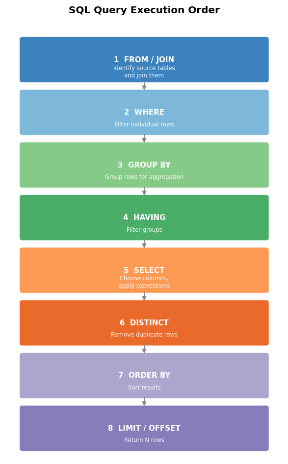

# SQL Aggregations: Transforming Data into Insights

**After this lesson:** You can group rows with **GROUP BY**, apply aggregate functions (**COUNT**, **SUM**, **AVG**, etc.), filter groups with **HAVING**, and use basic window functions for running totals and ranks.

## Helpful video

High-level introduction to SQL and relational databases.

<iframe width="560" height="315" src="https://www.youtube.com/embed/27axs9dO7AE" title="What is SQL?" frameborder="0" allow="accelerometer; autoplay; clipboard-write; encrypted-media; gyroscope; picture-in-picture" allowfullscreen></iframe>

## Overview

**Prerequisites:** [Basic SQL Operations](basic-operations.md) (**SELECT**, **WHERE**, **ORDER BY**). Comfortable with grouping ideas from descriptive stats in [Intro Statistics](../../1-data-fundamentals/1.3-intro-statistics/README.md) is helpful but not required.

> **Time needed:** About 60 minutes, plus time for exercises.

## Why this matters

Reports and dashboards almost never show raw rows—they show **counts**, **sums**, **averages**, and **breakdowns by group**. `GROUP BY` and `HAVING` are how you express “per region,” “per month,” or “top ten” directly in SQL instead of exporting everything to a spreadsheet.

## Understanding Aggregations

Aggregations in SQL transform detailed data into meaningful summaries. Think of it like:

- Raw data = Individual grocery receipts
- Aggregated data = Monthly spending summary



## Aggregate Functions

### Basic Statistical Functions

<ol>
<li>

<strong>COUNT</strong>: Row Counter

   

   

   
   
      -- Different COUNT variations
      SELECT 
          COUNT(*) as total_rows,           -- All rows
          COUNT(1) as also_total_rows,      -- Same as COUNT(*)
          COUNT(column) as non_null_values,  -- Excludes NULL
          COUNT(DISTINCT column) as unique_values
      FROM table;
      
      -- Example: Customer order analysis
      SELECT 
          customer_id,
          COUNT(*) as total_orders,
          COUNT(DISTINCT product_id) as unique_products,
          COUNT(DISTINCT DATE_TRUNC('month', order_date)) as active_months
      FROM orders
      GROUP BY customer_id;
   
   

   <aside class="code-explainer__callouts" aria-label="Code walkthrough">
     

       

         
         COUNT variations
       

       

         
<code>COUNT(*)</code> and <code>COUNT(1)</code> count every row including NULLs. <code>COUNT(column)</code> skips NULLs. <code>COUNT(DISTINCT column)</code> counts unique non-null values — useful for unique buyer counts.

       

     

     

       

         
         Per-customer order analysis
       

       

         
Groups by <code>customer_id</code> to produce one row per buyer. <code>COUNT(DISTINCT product_id)</code> tracks unique items purchased; <code>COUNT(DISTINCT DATE_TRUNC(...))</code> counts distinct calendar months the customer placed orders.

       

     

   </aside>
   

</li>
<li>

<strong>SUM</strong>: Numerical Addition

   

   

   
   
      -- Sales Analysis
      SELECT 
          category,
          SUM(amount) as total_sales,
          SUM(amount) FILTER (WHERE status = 'completed') as completed_sales,
          SUM(CASE 
              WHEN status = 'completed' THEN amount 
              ELSE 0 
          END) as another_way_completed_sales
      FROM sales
      GROUP BY category;
      
      -- Running totals
      SELECT 
          order_date,
          amount,
          SUM(amount) OVER (
              ORDER BY order_date
              ROWS BETWEEN UNBOUNDED PRECEDING AND CURRENT ROW
          ) as running_total
      FROM sales;
   
   

   <aside class="code-explainer__callouts" aria-label="Code walkthrough">
     

       

         
         Grouped sales totals
       

       

         
<code>SUM(amount)</code> totals all sales per category. <code>FILTER (WHERE status = 'completed')</code> is a modern alternative to a <code>CASE</code> expression—it restricts the aggregate to completed rows only while keeping the full row set for the outer group.

       

     

     

       

         
         Running total with window frame
       

       

         
<code>SUM(amount) OVER (ORDER BY order_date ROWS BETWEEN UNBOUNDED PRECEDING AND CURRENT ROW)</code> keeps every row in the result and adds a cumulative total column—unlike <code>GROUP BY</code>, which would collapse rows.

       

     

   </aside>
   

</li>
<li>

<strong>AVG</strong>: Mean Calculator

   

   

   
   
      -- Price Analysis with Standard Error
      SELECT 
          category,
          COUNT(*) as product_count,
          AVG(price) as mean_price,
          STDDEV(price) / SQRT(COUNT(*)) as standard_error,
          AVG(price) - (STDDEV(price) / SQRT(COUNT(*)) * 1.96) as ci_lower,
          AVG(price) + (STDDEV(price) / SQRT(COUNT(*)) * 1.96) as ci_upper
      FROM products
      GROUP BY category;
      
      -- Moving averages
      SELECT 
          sale_date,
          amount,
          AVG(amount) OVER (
              ORDER BY sale_date
              ROWS BETWEEN 6 PRECEDING AND CURRENT ROW
          ) as moving_7day_avg
      FROM daily_sales;
   
   

   <aside class="code-explainer__callouts" aria-label="Code walkthrough">
     

       

         
         Price statistics with confidence interval
       

       

         
<code>STDDEV(price) / SQRT(COUNT(*))</code> is the standard error of the mean. Multiplying by 1.96 and adding/subtracting from <code>AVG</code> gives an approximate 95% confidence interval around the mean price per category.

       

     

     

       

         
         7-day moving average
       

       

         
<code>AVG(amount) OVER (ORDER BY sale_date ROWS BETWEEN 6 PRECEDING AND CURRENT ROW)</code> computes a rolling 7-day average for each row. The frame shrinks at the start of the series where fewer than 7 prior rows exist.

       

     

   </aside>
   

</li>
<li>

<strong>MIN/MAX</strong>: Range Identifiers

   

   

   
   
      -- Price Range Analysis
      SELECT 
          category,
          MIN(price) as min_price,
          MAX(price) as max_price,
          MAX(price) - MIN(price) as price_range,
          ROUND(
              (MAX(price) - MIN(price)) / NULLIF(AVG(price), 0) * 100,
              2
          ) as price_spread_percentage
      FROM products
      GROUP BY category;
      
      -- First/Last values
      SELECT 
          customer_id,
          MIN(order_date) as first_order,
          MAX(order_date) as last_order,
          MAX(order_date) - MIN(order_date) as customer_lifespan
      FROM orders
      GROUP BY customer_id;
   
   

   <aside class="code-explainer__callouts" aria-label="Code walkthrough">
     

       

         
         Price range and spread per category
       

       

         
<code>MAX - MIN</code> is the raw price range. Dividing by <code>AVG</code> (guarded with <code>NULLIF</code> to avoid division by zero) gives the coefficient of variation as a percentage—useful for comparing price dispersion across categories of different scales.

       

     

     

       

         
         Customer lifespan via first and last order
       

       

         
<code>MIN(order_date)</code> and <code>MAX(order_date)</code> return the first and most-recent order per customer. Subtracting them yields the customer lifespan as an interval—a simple retention signal before cohort analysis.

       

     

   </aside>
   

</li>
</ol>

## Advanced Aggregation Concepts

### Window Functions Deep Dive

Window functions perform calculations across a set of table rows related to the current row.


-- Employee salary analysis by department
SELECT 
    employee_name,
    department,
    salary,
    AVG(salary) OVER (PARTITION BY department) as dept_avg_salary,
    salary - AVG(salary) OVER (PARTITION BY department) as diff_from_avg,
    RANK() OVER (PARTITION BY department ORDER BY salary DESC) as salary_rank,
    DENSE_RANK() OVER (PARTITION BY department ORDER BY salary DESC) as dense_rank,
    ROW_NUMBER() OVER (PARTITION BY department ORDER BY salary DESC) as row_num,
    NTILE(4) OVER (PARTITION BY department ORDER BY salary) as salary_quartile,
    FIRST_VALUE(salary) OVER (
        PARTITION BY department 
        ORDER BY salary DESC
        ROWS BETWEEN UNBOUNDED PRECEDING AND UNBOUNDED FOLLOWING
    ) as highest_salary_in_dept,
    salary / SUM(salary) OVER (PARTITION BY department) * 100 as pct_of_dept_total
FROM employees;

-- Running totals with different frame specifications
SELECT 
    sale_date,
    amount,
    -- Running total (default frame)
    SUM(amount) OVER (ORDER BY sale_date) as running_total,
    -- Previous 7 days total
    SUM(amount) OVER (
        ORDER BY sale_date 
        ROWS BETWEEN 6 PRECEDING AND CURRENT ROW
    ) as rolling_7day_total,
    -- Previous month to next month
    SUM(amount) OVER (
        ORDER BY sale_date 
        RANGE BETWEEN INTERVAL '1' MONTH PRECEDING 
        AND INTERVAL '1' MONTH FOLLOWING
    ) as three_month_window
FROM sales;


<aside class="code-explainer__callouts" aria-label="Code walkthrough">
  

    

      
      Salary rankings and stats per department
    

    

      
All window functions here use <code>PARTITION BY department</code> so each calculation resets per department. <code>AVG</code> gives the department mean; subtracting it shows each employee's distance from average. <code>RANK</code>, <code>DENSE_RANK</code>, <code>ROW_NUMBER</code>, and <code>NTILE(4)</code> all rank by descending salary within each partition.

    

  

  

    

      
      Highest salary and department share
    

    

      
<code>FIRST_VALUE</code> with <code>ROWS BETWEEN UNBOUNDED PRECEDING AND UNBOUNDED FOLLOWING</code> reads the entire partition to return the top salary on every row. Dividing individual salary by <code>SUM(salary) OVER (PARTITION BY department)</code> expresses each employee's share of total department payroll.

    

  

  

    

      
      Running and rolling window totals
    

    

      
Three frame specifications on the same column: a cumulative running total (default frame), a 7-row rolling window (<code>ROWS BETWEEN 6 PRECEDING AND CURRENT ROW</code>), and a calendar-based 3-month window using <code>RANGE BETWEEN INTERVAL</code>—showing how frame type controls which rows contribute.

    

  

</aside>

### HAVING vs WHERE: Understanding the Difference


-- WHERE filters individual rows before grouping
-- HAVING filters groups after grouping

-- Example: Find departments with high-performing sales teams
SELECT 
    department,
    COUNT(*) as employee_count,
    AVG(sales) as avg_sales,
    SUM(sales) as total_sales
FROM employees
WHERE status = 'active'  -- Filter individual employees first
GROUP BY department
HAVING 
    COUNT(*) >= 5 AND  -- Only departments with 5+ employees
    AVG(sales) > 50000;  -- And above-average sales

-- Common mistake: Using WHERE for aggregate conditions
SELECT 
    product_category,
    COUNT(*) as product_count,
    AVG(price) as avg_price
FROM products
WHERE AVG(price) > 100  -- Wrong! Will cause error
GROUP BY product_category;

-- Correct version
SELECT 
    product_category,
    COUNT(*) as product_count,
    AVG(price) as avg_price
FROM products
GROUP BY product_category
HAVING AVG(price) > 100;  -- Correct! Filters after aggregation


<aside class="code-explainer__callouts" aria-label="Code walkthrough">
  

    

      
      Correct: WHERE then HAVING
    

    

      
<strong>WHERE status = 'active'</strong> filters individual rows before grouping—only active employees enter the aggregate. <strong>HAVING</strong> then filters the grouped result: departments need 5+ employees and above-average sales to appear.

    

  

  

    

      
      Wrong: aggregate in WHERE clause
    

    

      
<code>WHERE AVG(price) &gt; 100</code> causes an error because aggregates are not allowed in a <strong>WHERE</strong> clause—the engine hasn't grouped yet at that point in execution.

    

  

  

    

      
      Correct fix: move aggregate to HAVING
    

    

      
The corrected version removes the <code>WHERE AVG</code> and replaces it with <code>HAVING AVG(price) &gt; 100</code>—which runs after grouping and can reference aggregate results.

    

  

</aside>

### GROUP BY vs PARTITION BY: Key Differences


-- GROUP BY: Reduces rows, one row per group
SELECT 
    department,
    COUNT(*) as employee_count,
    AVG(salary) as avg_salary
FROM employees
GROUP BY department;

-- PARTITION BY: Maintains rows, adds aggregate values
SELECT 
    department,
    employee_name,
    salary,
    AVG(salary) OVER (PARTITION BY department) as dept_avg_salary,
    salary - AVG(salary) OVER (PARTITION BY department) as salary_diff
FROM employees;

-- Combined usage example
WITH dept_stats AS (
    SELECT 
        department,
        COUNT(*) as employee_count,
        AVG(salary) as avg_salary
    FROM employees
    GROUP BY department
)
SELECT 
    e.department,
    e.employee_name,
    e.salary,
    ds.avg_salary as dept_avg,
    RANK() OVER (PARTITION BY e.department ORDER BY e.salary DESC) as salary_rank
FROM employees e
JOIN dept_stats ds ON e.department = ds.department;


<aside class="code-explainer__callouts" aria-label="Code walkthrough">
  

    

      
      GROUP BY collapses to one row per group
    

    

      
<strong>GROUP BY department</strong> reduces the result to one row per department. Individual employee rows are gone—only the aggregated count and average survive in the output.

    

  

  

    

      
      PARTITION BY keeps all rows
    

    

      
<strong>PARTITION BY department</strong> inside <code>OVER</code> computes the department average without collapsing rows. Every employee row is retained; the window columns add the department average and each employee's salary difference alongside the original data.

    

  

  

    

      
      Combining GROUP BY and PARTITION BY with a CTE
    

    

      
The CTE uses <code>GROUP BY</code> to produce one summary row per department. The outer query joins back to the original <code>employees</code> table and adds a <code>RANK()</code> window to rank each employee within their department—combining both techniques.

    

  

</aside>

## Common Pitfalls and Best Practices

### 1. NULL Handling


-- Bad: Ignoring NULLs
SELECT AVG(salary) FROM employees;  -- Might be misleading

-- Good: Explicit NULL handling
SELECT 
    COUNT(*) as total_employees,
    COUNT(salary) as employees_with_salary,
    COUNT(*) - COUNT(salary) as employees_missing_salary,
    AVG(COALESCE(salary, 0)) as avg_salary_including_zeros,
    AVG(salary) as avg_salary_excluding_nulls
FROM employees;


<aside class="code-explainer__callouts" aria-label="Code walkthrough">
  

    

      
      Misleading AVG when salary has NULLs
    

    

      
<code>AVG(salary)</code> automatically ignores <code>NULL</code> rows, so the result is the average of employees who <em>have</em> a salary on record—not of all employees. If many salaries are missing, the figure can be significantly inflated.

    

  

  

    

      
      Explicit NULL awareness
    

    

      
<code>COUNT(*) - COUNT(salary)</code> surfaces the count of missing salaries. <code>AVG(COALESCE(salary, 0))</code> treats NULLs as zero—useful for payroll totals. Both figures together let you understand the gap and choose the right interpretation.

    

  

</aside>

### 2. Performance Considerations


-- Bad: Unnecessary subquery
SELECT 
    department,
    (SELECT AVG(salary) FROM employees e2 
     WHERE e2.department = e1.department) as avg_salary
FROM employees e1
GROUP BY department;

-- Good: More efficient window function
SELECT DISTINCT
    department,
    AVG(salary) OVER (PARTITION BY department) as avg_salary
FROM employees;


<aside class="code-explainer__callouts" aria-label="Code walkthrough">
  

    

      
      Slow: correlated subquery per group
    

    

      
The correlated subquery inside <code>SELECT</code> reruns <code>AVG(salary)</code> once per department row—<em>N</em> extra scans for <em>N</em> departments. Combined with <code>GROUP BY</code> this is redundant work.

    

  

  

    

      
      Fast: window function in a single pass
    

    

      
<code>AVG(salary) OVER (PARTITION BY department)</code> computes department averages in one pass. <code>SELECT DISTINCT</code> collapses duplicate rows so the result is still one row per department—faster and no subquery.

    

  

</aside>

### 3. Precision and Rounding


-- Bad: Inconsistent decimal places
SELECT 
    department,
    AVG(salary) as avg_salary,
    SUM(salary) as total_salary
FROM employees
GROUP BY department;

-- Good: Consistent decimal handling
SELECT 
    department,
    ROUND(AVG(salary)::numeric, 2) as avg_salary,
    ROUND(SUM(salary)::numeric, 2) as total_salary
FROM employees
GROUP BY department;


<aside class="code-explainer__callouts" aria-label="Code walkthrough">
  

    

      
      Inconsistent output precision
    

    

      
Without explicit rounding, <code>AVG</code> and <code>SUM</code> return floating-point values whose precision varies by engine and column type—output like <code>75.333333...</code> looks unprofessional in reports.

    

  

  

    

      
      Consistent 2-decimal-place output
    

    

      
<code>ROUND(expr::numeric, 2)</code> casts to <code>NUMERIC</code> first (required in PostgreSQL for <code>ROUND</code> to accept a precision argument) then rounds to 2 decimal places—giving clean, consistent output for both average and total salary.

    

  

</aside>

## Practice Exercises

<ol>
<li>

<strong>Basic Aggregation</strong>

   

   

   
   
      -- Calculate monthly sales metrics
      -- Include: total sales, average order value, order count
      -- Group by year and month
      -- Sort by year and month descending
   
   

   <aside class="code-explainer__callouts" aria-label="Code walkthrough">
     

       

         
         Exercise: monthly sales metrics
       

       

         
Write a query that aggregates <code>total sales</code>, <code>average order value</code>, and <code>order count</code> per calendar year-month, sorted newest first. Use <code>DATE_TRUNC</code> or <code>EXTRACT</code> to bucket by month.

       

     

   </aside>
   

</li>
<li>

<strong>Window Functions</strong>

   

   

   
   
      -- For each order:
      -- Calculate running total sales for the customer
      -- Show customer's previous order amount
      -- Show customer's average order value
      -- Rank orders by amount within customer
   
   

   <aside class="code-explainer__callouts" aria-label="Code walkthrough">
     

       

         
         Exercise: per-order window functions
       

       

         
For each order, compute a running total of the customer's spend (<code>SUM OVER</code>), the previous order amount (<code>LAG</code>), average order value (<code>AVG OVER</code>), and a rank by amount within customer (<code>RANK OVER PARTITION BY</code>).

       

     

   </aside>
   

</li>
<li>

<strong>Complex Grouping</strong>

   

   

   
   
      -- Create a sales summary with:
      -- Daily, weekly, monthly totals
      -- Year-over-year comparison
      -- Moving averages
      -- Percentage of total calculations
   
   

   <aside class="code-explainer__callouts" aria-label="Code walkthrough">
     

       

         
         Exercise: multi-granularity sales summary
       

       

         
Build a single query producing daily, weekly, and monthly totals alongside a year-over-year comparison, a rolling average, and each period's percentage of the grand total. Use <code>ROLLUP</code> or multiple <code>GROUP BY</code> levels plus window frames.

       

     

   </aside>
   

</li>
<li>

<strong>Advanced Analytics</strong>

   

   

   
   
      -- Customer cohort analysis
      -- Product affinity analysis
      -- Customer lifetime value calculation
      -- Churn risk scoring
   
   

   <aside class="code-explainer__callouts" aria-label="Code walkthrough">
     

       

         
         Exercise: advanced customer analytics
       

       

         
Write queries for: (1) cohort retention by first-order month, (2) product affinity pairs bought together, (3) customer lifetime value using historical order totals, and (4) a churn risk score based on recency and frequency.

       

     

   </aside>
   

</li>
</ol>

## Additional Resources

- [PostgreSQL Aggregation Documentation](https://www.postgresql.org/docs/current/functions-aggregate.html)
- [Window Functions Tutorial](https://mode.com/sql-tutorial/sql-window-functions/)
- [SQL Performance Tuning Guide](https://use-the-index-luke.com/)
- [Advanced SQL Recipes](https://modern-sql.com/)

## Statistical Functions

<ol>
<li>

<strong>STDDEV</strong>: Standard Deviation

   

   

   
   
      -- Product price variation analysis
      SELECT 
          category,
          COUNT(*) as product_count,
          ROUND(AVG(price)::numeric, 2) as avg_price,
          ROUND(STDDEV(price)::numeric, 2) as price_std,
          ROUND(
              (STDDEV(price) / NULLIF(AVG(price), 0) * 100)::numeric,
              2
          ) as coefficient_of_variation
      FROM products
      GROUP BY category
      HAVING COUNT(*) >= 5;
   
   

   <aside class="code-explainer__callouts" aria-label="Code walkthrough">
     

       

         
         Standard deviation and coefficient of variation
       

       

         
<code>STDDEV(price)</code> measures absolute price spread. Dividing by <code>AVG</code> (guarded with <code>NULLIF</code>) and multiplying by 100 gives the coefficient of variation—a relative measure useful for comparing spread across categories at very different price levels. <strong>HAVING COUNT(*) >= 5</strong> excludes categories with too few products for meaningful statistics.

       

     

   </aside>
   

</li>
<li>

<strong>PERCENTILE</strong>: Distribution Analysis

   

   

   
   
      -- Price distribution by category
      SELECT 
          category,
          PERCENTILE_CONT(0.25) WITHIN GROUP (ORDER BY price) as p25,
          PERCENTILE_CONT(0.50) WITHIN GROUP (ORDER BY price) as median,
          PERCENTILE_CONT(0.75) WITHIN GROUP (ORDER BY price) as p75,
          PERCENTILE_CONT(0.75) WITHIN GROUP (ORDER BY price) -
          PERCENTILE_CONT(0.25) WITHIN GROUP (ORDER BY price) as iqr
      FROM products
      GROUP BY category;
      
      -- Customer spending percentiles
      SELECT 
          ROUND(
              PERCENTILE_CONT(0.25) WITHIN GROUP (
                  ORDER BY total_spent
              )::numeric,
              2
          ) as p25_spending,
          ROUND(
              PERCENTILE_CONT(0.50) WITHIN GROUP (
                  ORDER BY total_spent
              )::numeric,
              2
          ) as median_spending,
          ROUND(
              PERCENTILE_CONT(0.75) WITHIN GROUP (
                  ORDER BY total_spent
              )::numeric,
              2
          ) as p75_spending
      FROM (
          SELECT 
              customer_id,
              SUM(amount) as total_spent
          FROM orders
          GROUP BY customer_id
      ) customer_totals;
   
   

   <aside class="code-explainer__callouts" aria-label="Code walkthrough">
     

       

         
         IQR per category
       

       

         
<code>PERCENTILE_CONT(0.25/0.50/0.75) WITHIN GROUP (ORDER BY price)</code> computes exact percentiles using linear interpolation. Subtracting P25 from P75 gives the interquartile range (IQR)—a robust spread measure that ignores extreme prices at each end.

       

     

     

       

         
         Customer spending percentiles via subquery
       

       

         
The inline subquery aggregates total spend per customer first. The outer <code>SELECT</code> then calls <code>PERCENTILE_CONT</code> on those totals to find P25, median, and P75 spending thresholds across all customers—useful for defining low/mid/high spender tiers.

       

     

   </aside>
   

</li>
</ol>

## Real-World Business Analytics

### 1. Customer Segmentation


WITH customer_metrics AS (
    SELECT 
        c.customer_id,
        COUNT(*) as order_count,
        SUM(o.total_amount) as total_spent,
        AVG(o.total_amount) as avg_order_value,
        MAX(o.order_date) as last_order_date,
        MIN(o.order_date) as first_order_date,
        COUNT(DISTINCT DATE_TRUNC('month', o.order_date)) as active_months,
        SUM(o.total_amount) / 
        NULLIF(COUNT(DISTINCT DATE_TRUNC('month', o.order_date)), 0) as avg_monthly_spend
    FROM customers c
    LEFT JOIN orders o ON c.customer_id = o.customer_id
    GROUP BY c.customer_id
),
customer_segments AS (
    SELECT 
        *,
        NTILE(4) OVER (ORDER BY total_spent DESC) as spend_quartile,
        CASE 
            WHEN last_order_date >= CURRENT_DATE - INTERVAL '30 days' THEN 'Active'
            WHEN last_order_date >= CURRENT_DATE - INTERVAL '90 days' THEN 'At Risk'
            WHEN last_order_date >= CURRENT_DATE - INTERVAL '180 days' THEN 'Churned'
            ELSE 'Lost'
        END as recency_segment
    FROM customer_metrics
)
SELECT 
    recency_segment,
    spend_quartile,
    COUNT(*) as customer_count,
    ROUND(AVG(order_count)::numeric, 1) as avg_orders,
    ROUND(AVG(total_spent)::numeric, 2) as avg_total_spent,
    ROUND(AVG(avg_order_value)::numeric, 2) as avg_order_value,
    ROUND(AVG(active_months)::numeric, 1) as avg_active_months,
    ROUND(AVG(avg_monthly_spend)::numeric, 2) as avg_monthly_spend
FROM customer_segments
GROUP BY recency_segment, spend_quartile
ORDER BY 
    CASE recency_segment
        WHEN 'Active' THEN 1
        WHEN 'At Risk' THEN 2
        WHEN 'Churned' THEN 3
        ELSE 4
    END,
    spend_quartile;


<aside class="code-explainer__callouts" aria-label="Code walkthrough">
  

    

      
      CTE 1: raw customer metrics
    

    

      
<code>customer_metrics</code> joins customers to orders and groups by customer to compute order count, total and average spend, first/last order dates, active months, and average monthly spend. <code>LEFT JOIN</code> keeps customers with no orders.

    

  

  

    

      
      CTE 2: quartile and recency labels
    

    

      
<code>customer_segments</code> adds <code>NTILE(4)</code> spend quartile and a <code>CASE</code> recency label (Active / At Risk / Churned / Lost) based on days since last order.

    

  

  

    

      
      Outer query: segment summary
    

    

      
Groups by <code>recency_segment</code> and <code>spend_quartile</code> to produce one row per combination. Rounded averages for orders, spend, order value, and monthly spend give a clean summary of each segment's behavior. <code>ORDER BY CASE</code> puts segments in business-priority order.

    

  

</aside>

### 2. Product Performance Analysis


WITH product_metrics AS (
    SELECT 
        p.product_id,
        p.product_name,
        p.category,
        COUNT(DISTINCT o.order_id) as order_count,
        SUM(oi.quantity) as units_sold,
        SUM(oi.quantity * oi.price_at_time) as revenue,
        AVG(oi.price_at_time) as avg_selling_price,
        COUNT(DISTINCT o.customer_id) as unique_customers,
        COUNT(DISTINCT DATE_TRUNC('month', o.order_date)) as active_months
    FROM products p
    LEFT JOIN order_items oi ON p.product_id = oi.product_id
    LEFT JOIN orders o ON oi.order_id = o.order_id
    GROUP BY p.product_id, p.product_name, p.category
),
product_rankings AS (
    SELECT 
        *,
        RANK() OVER (PARTITION BY category ORDER BY revenue DESC) as category_rank,
        PERCENT_RANK() OVER (ORDER BY revenue) as overall_percentile,
        revenue / NULLIF(active_months, 0) as monthly_revenue,
        units_sold / NULLIF(active_months, 0) as monthly_units,
        unique_customers / NULLIF(order_count, 0) as customer_order_ratio
    FROM product_metrics
)
SELECT 
    category,
    product_name,
    order_count,
    units_sold,
    ROUND(revenue::numeric, 2) as revenue,
    ROUND(avg_selling_price::numeric, 2) as avg_price,
    unique_customers,
    category_rank,
    CASE 
        WHEN category_rank = 1 THEN 'Category Best Seller'
        WHEN category_rank <= 3 THEN 'Category Top 3'
        WHEN overall_percentile >= 0.75 THEN 'Top 25%'
        ELSE 'Standard Performer'
    END as performance_tier
FROM product_rankings
ORDER BY 
    category,
    revenue DESC;


<aside class="code-explainer__callouts" aria-label="Code walkthrough">
  

    

      
      CTE 1: core product metrics
    

    

      
<code>product_metrics</code> joins products → order items → orders with <code>LEFT JOIN</code> to keep un-ordered products. Aggregates compute order count, units sold, revenue, average price, unique customers, and the number of active months the product saw sales.

    

  

  

    

      
      CTE 2: rankings and velocity metrics
    

    

      
<code>product_rankings</code> adds window-based rankings: <code>RANK() OVER (PARTITION BY category ORDER BY revenue DESC)</code> for category rank and <code>PERCENT_RANK()</code> for overall percentile. Monthly revenue and unit velocity use <code>NULLIF</code> to guard against products with zero active months.

    

  

  

    

      
      Outer query: performance tier labels
    

    

      
The final <code>SELECT</code> shapes the output: rounded numeric columns for reporting, and a <code>CASE</code> expression that maps category rank and overall percentile to a plain-language performance tier (Best Seller → Top 3 → Top 25% → Standard Performer).

    

  

</aside>

### 3. Sales Trend Analysis


WITH daily_sales AS (
    SELECT 
        DATE_TRUNC('day', order_date) as sale_date,
        COUNT(*) as num_orders,
        COUNT(DISTINCT customer_id) as unique_customers,
        SUM(total_amount) as revenue,
        AVG(total_amount) as avg_order_value
    FROM orders
    WHERE order_date >= CURRENT_DATE - INTERVAL '90 days'
    GROUP BY DATE_TRUNC('day', order_date)
),
sales_stats AS (
    SELECT 
        sale_date,
        num_orders,
        unique_customers,
        revenue,
        avg_order_value,
        LAG(revenue) OVER (ORDER BY sale_date) as prev_day_revenue,
        AVG(revenue) OVER (
            ORDER BY sale_date
            ROWS BETWEEN 6 PRECEDING AND CURRENT ROW
        ) as moving_7day_avg,
        PERCENTILE_CONT(0.5) WITHIN GROUP (ORDER BY revenue) OVER (
            ORDER BY sale_date
            ROWS BETWEEN 29 PRECEDING AND CURRENT ROW
        ) as moving_30day_median
    FROM daily_sales
)
SELECT 
    sale_date,
    num_orders,
    unique_customers,
    ROUND(revenue::numeric, 2) as revenue,
    ROUND(avg_order_value::numeric, 2) as avg_order_value,
    ROUND(
        ((revenue - prev_day_revenue) / NULLIF(prev_day_revenue, 0) * 100)::numeric,
        2
    ) as daily_growth_pct,
    ROUND(moving_7day_avg::numeric, 2) as moving_7day_avg,
    ROUND(moving_30day_median::numeric, 2) as moving_30day_median,
    CASE 
        WHEN revenue > moving_30day_median * 1.5 THEN 'Exceptional Day'
        WHEN revenue > moving_30day_median * 1.2 THEN 'Strong Day'
        WHEN revenue < moving_30day_median * 0.8 THEN 'Weak Day'
        ELSE 'Normal Day'
    END as day_performance
FROM sales_stats
ORDER BY sale_date DESC;


<aside class="code-explainer__callouts" aria-label="Code walkthrough">
  

    

      
      CTE 1: daily order and revenue totals
    

    

      
<code>daily_sales</code> buckets rows by day with <code>DATE_TRUNC</code>, restricted to the last 90 days. It counts orders, unique customers, and revenue, plus computes average order value per day.

    

  

  

    

      
      CTE 2: prior-day comparison and rolling averages
    

    

      
<code>sales_stats</code> adds <code>LAG</code> for day-over-day comparison, a 7-day rolling <code>AVG</code>, and a 30-day rolling <code>PERCENTILE_CONT(0.5)</code> median—all as window functions over <code>daily_sales</code>.

    

  

  

    

      
      Outer query: daily performance report
    

    

      
Formats all columns with <code>ROUND</code> for clean output. A <code>CASE</code> expression compares revenue to the 30-day rolling median to classify each day as Exceptional, Strong, Weak, or Normal—giving an at-a-glance performance label.

    

  

</aside>

Remember: "Good aggregations tell a story about your data!"

## Next steps

- [Advanced SQL concepts](advanced-concepts.md) — deeper window analytics and CTEs
- [SQL project](project.md) — end-to-end practice brief
- [Module README](README.md) — assignments and slides
