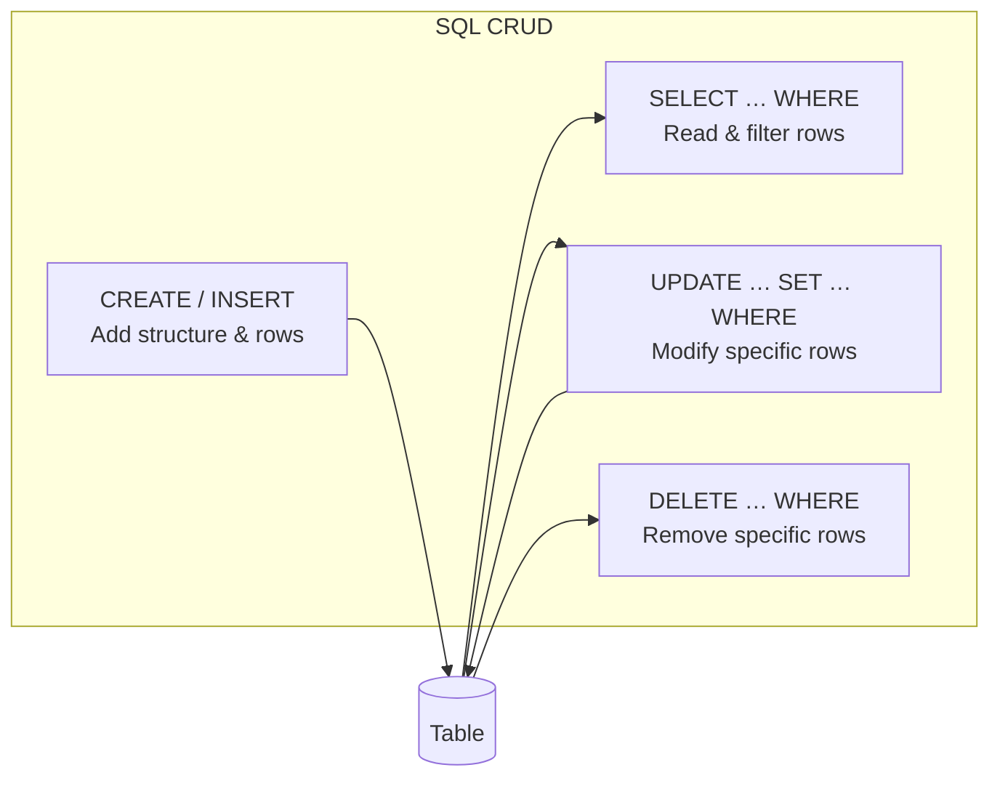

# Mastering Basic SQL Operations: Your Data Query Journey

**After this lesson:** You can **CREATE** tables, **INSERT** rows, **SELECT** and filter data with **WHERE**, **UPDATE** and **DELETE** safely, and read simple query plans.

## Helpful video

High-level introduction to SQL and relational databases.

<iframe width="560" height="315" src="https://www.youtube.com/embed/27axs9dO7AE" title="What is SQL?" frameborder="0" allow="accelerometer; autoplay; clipboard-write; encrypted-media; gyroscope; picture-in-picture" allowfullscreen></iframe>

## Overview

**Prerequisites:** [Introduction to Databases](intro-databases.md) (tables, keys, types). Have a SQL client and a practice database as described in the [module README](README.md).

> **Time needed:** About 60–90 minutes with hands-on practice.

## Why this matters

**CREATE**, **READ**, **UPDATE**, and **DELETE** are the daily loop of working with data: define structure, pull slices for analysis, correct mistakes, and retire bad rows safely. Aggregations, joins, and window functions all assume you are fluent here first.

## Introduction to SQL Basics

SQL (Structured Query Language) is the standard language for managing and manipulating relational databases. Understanding basic SQL operations is crucial for:

- Data retrieval and analysis
- Database management
- Data integrity maintenance
- Application development

## CRUD Operations

The sections below follow the same order most people learn: define a table, put rows in, read them back, then update or delete with a **scoped** `WHERE` so you do not touch the whole table by accident.

> **Warning:** Always include a `WHERE` clause with `UPDATE` and `DELETE`. Without one, the operation applies to **every row** in the table. Test your `WHERE` condition with a `SELECT` first.

### 1. CREATE: Adding Data


-- Create a new table
CREATE TABLE customers (
    customer_id SERIAL PRIMARY KEY,
    first_name VARCHAR(50) NOT NULL,
    last_name VARCHAR(50) NOT NULL,
    email VARCHAR(100) UNIQUE NOT NULL,
    created_at TIMESTAMP DEFAULT CURRENT_TIMESTAMP
);

-- Insert single row
INSERT INTO customers (first_name, last_name, email)
VALUES ('John', 'Doe', 'john.doe@email.com');

-- Insert multiple rows
INSERT INTO customers (first_name, last_name, email)
VALUES 
    ('Jane', 'Smith', 'jane.smith@email.com'),
    ('Bob', 'Johnson', 'bob.johnson@email.com');


<aside class="code-explainer__callouts" aria-label="Code walkthrough">
  

    

      
      CREATE TABLE with constraints
    

    

      
<code>SERIAL PRIMARY KEY</code> auto-increments the ID. <code>NOT NULL</code> rejects missing names. <code>UNIQUE</code> prevents duplicate emails. <code>DEFAULT CURRENT_TIMESTAMP</code> records the signup time automatically without requiring the caller to supply it.

    

  

  

    

      
      INSERT: single and multi-row
    

    

      
The first <code>INSERT</code> adds one row by listing column names then values. The second uses a single statement with multiple value tuples—more efficient than separate inserts because it sends one round-trip to the database.

    

  

</aside>

### 2. READ: Querying Data


-- Select all columns
SELECT * FROM customers;

-- Select specific columns
SELECT first_name, last_name, email 
FROM customers;

-- Basic filtering
SELECT * FROM customers
WHERE last_name = 'Smith';

-- Pattern matching
SELECT * FROM customers
WHERE email LIKE '%@email.com';


<aside class="code-explainer__callouts" aria-label="Code walkthrough">
  

    

      
      SELECT * and specific columns
    

    

      
<code>SELECT *</code> returns every column—convenient for exploration but avoid in production as schema changes can break downstream code. Listing columns explicitly (<code>first_name, last_name, email</code>) makes the contract clear.

    

  

  

    

      
      WHERE filtering and LIKE pattern
    

    

      
<strong>WHERE last_name = 'Smith'</strong> does an exact match. <code>LIKE '%@email.com'</code> uses a wildcard to match any email ending with that domain—useful for finding customers from a specific provider.

    

  

</aside>

### 3. UPDATE: Modifying Data


-- Update single record
UPDATE customers
SET email = 'new.email@email.com'
WHERE customer_id = 1;

-- Update multiple records
UPDATE customers
SET created_at = CURRENT_TIMESTAMP
WHERE created_at IS NULL;

-- Update with conditions
UPDATE customers
SET 
    first_name = INITCAP(first_name),
    last_name = INITCAP(last_name)
WHERE 
    first_name != INITCAP(first_name) OR
    last_name != INITCAP(last_name);


<aside class="code-explainer__callouts" aria-label="Code walkthrough">
  

    

      
      Targeted UPDATE with WHERE
    

    

      
Always scope an <code>UPDATE</code> with a <code>WHERE</code> clause. Without it, every row is changed. The first example corrects one customer's email; the second fills missing <code>created_at</code> values on all rows where it's NULL.

    

  

  

    

      
      Conditional UPDATE with INITCAP
    

    

      
<code>INITCAP</code> title-cases a string. The <code>WHERE</code> clause only touches rows where at least one name is already in the wrong case—avoiding unnecessary writes on rows that are already correct.

    

  

</aside>

### 4. DELETE: Removing Data


-- Delete specific records
DELETE FROM customers
WHERE customer_id = 1;

-- Delete with conditions
DELETE FROM customers
WHERE created_at < CURRENT_DATE - INTERVAL '1 year';

-- Delete all records
TRUNCATE TABLE customers;


<aside class="code-explainer__callouts" aria-label="Code walkthrough">
  

    

      
      DELETE a specific row by primary key
    

    

      
Scoping <code>DELETE</code> by primary key is the safest approach—exactly one row is removed. Without <code>WHERE</code> the entire table would be cleared.

    

  

  

    

      
      Delete rows matching a condition
    

    

      
Deletes all customers whose account was created more than a year ago—a typical data-retention policy. The interval comparison is evaluated at runtime so the cutoff shifts with calendar time.

    

  

  

    

      
      TRUNCATE for bulk removal
    

    

      
<code>TRUNCATE</code> removes all rows faster than <code>DELETE</code> without a <code>WHERE</code> because it skips row-by-row logging. Use it when you need to empty a table entirely, e.g. resetting a staging table before a reload.

    

  

</aside>

## Basic Query Structure

### 1. SELECT Statement Anatomy


SELECT 
    column1,
    column2,
    column3 AS alias,
    CONCAT(column4, ' ', column5) as derived_column
FROM table_name
WHERE condition
GROUP BY column1
HAVING group_condition
ORDER BY column3 DESC
LIMIT 10;


<aside class="code-explainer__callouts" aria-label="Code walkthrough">
  

    

      
      Columns: aliases and derived values
    

    

      
The <code>SELECT</code> list defines output columns. <code>AS alias</code> renames a column in results. <code>CONCAT(...)</code> creates a derived column combining two source columns—no schema change needed.

    

  

  

    

      
      Clauses in execution order
    

    

      
SQL processes clauses in this order: <strong>FROM</strong> → <strong>WHERE</strong> → <strong>GROUP BY</strong> → <strong>HAVING</strong> → <strong>SELECT</strong> → <strong>ORDER BY</strong> → <strong>LIMIT</strong>. The written order differs from the execution order—that matters when diagnosing unexpected results.

    

  

</aside>

### 2. Filtering and Sorting


-- Basic WHERE clauses
SELECT * FROM products
WHERE 
    category = 'Electronics' AND
    price >= 100 AND
    stock_quantity > 0;

-- Multiple conditions
SELECT * FROM orders
WHERE 
    status IN ('pending', 'processing') AND
    order_date BETWEEN 
        CURRENT_DATE - INTERVAL '30 days' 
        AND CURRENT_DATE;

-- Pattern matching
SELECT * FROM customers
WHERE 
    email LIKE '%.com' AND
    first_name ILIKE 'j%';  -- Case-insensitive

-- Sorting results
SELECT 
    product_name,
    price,
    stock_quantity
FROM products
ORDER BY 
    price DESC,
    product_name ASC;


<aside class="code-explainer__callouts" aria-label="Code walkthrough">
  

    

      
      WHERE with AND, IN, and BETWEEN
    

    

      
Multiple <code>AND</code> conditions narrow results to rows meeting all criteria. <code>IN ('pending', 'processing')</code> is cleaner than chained <code>OR</code>. <code>BETWEEN … AND …</code> is inclusive on both ends—combine it with <code>CURRENT_DATE</code> for rolling windows.

    

  

  

    

      
      LIKE, ILIKE, and ORDER BY
    

    

      
<code>LIKE '%.com'</code> matches case-sensitively; <code>ILIKE 'j%'</code> is case-insensitive (PostgreSQL extension). The final <code>ORDER BY price DESC, product_name ASC</code> sorts by two columns—price descending, then alphabetically within the same price.

    

  

</aside>

## Data Types and Constraints

### 1. Common Data Types


CREATE TABLE products (
    -- Numeric types
    product_id SERIAL PRIMARY KEY,
    price DECIMAL(10,2),
    weight INTEGER,
    
    -- String types
    name VARCHAR(100),
    description TEXT,
    
    -- Date/Time types
    created_at TIMESTAMP,
    sale_date DATE,
    
    -- Boolean type
    is_active BOOLEAN,
    
    -- Enumerated type
    status product_status
);


<aside class="code-explainer__callouts" aria-label="Code walkthrough">
  

    

      
      Numeric and text columns
    

    

      
<code>SERIAL</code> auto-increments integers for surrogate keys. <code>DECIMAL(10,2)</code> stores exact money values. <code>VARCHAR(n)</code> caps string length; <code>TEXT</code> is unlimited—use it for user-written content.

    

  

  

    

      
      Date/time, boolean, and enum columns
    

    

      
<code>TIMESTAMP</code> stores full date+time; <code>DATE</code> stores date only. <code>BOOLEAN</code> holds true/false flags. Custom enum types like <code>product_status</code> constrain a column to a known set of string values—better than free-text strings for state columns.

    

  

</aside>

### 2. Constraints


CREATE TABLE orders (
    -- Primary Key
    order_id SERIAL PRIMARY KEY,
    
    -- Foreign Key
    customer_id INTEGER REFERENCES customers(customer_id),
    
    -- Not Null
    order_date TIMESTAMP NOT NULL,
    
    -- Unique
    tracking_number VARCHAR(50) UNIQUE,
    
    -- Check constraint
    total_amount DECIMAL(10,2) CHECK (total_amount >= 0),
    
    -- Default value
    status VARCHAR(20) DEFAULT 'pending'
);


<aside class="code-explainer__callouts" aria-label="Code walkthrough">
  

    

      
      Primary key and foreign key constraints
    

    

      
<code>PRIMARY KEY</code> uniquely identifies each order. <code>REFERENCES customers(customer_id)</code> is a foreign key—the database rejects inserts where the customer_id doesn't exist in the customers table, keeping referential integrity.

    

  

  

    

      
      NOT NULL, UNIQUE, CHECK, and DEFAULT
    

    

      
<code>NOT NULL</code> prevents missing order dates. <code>UNIQUE</code> ensures no two orders share a tracking number. <code>CHECK (total_amount &gt;= 0)</code> rejects negative totals at insert time. <code>DEFAULT 'pending'</code> sets the initial status without requiring the caller to supply it.

    

  

</aside>

## Table Relationships

### 1. One-to-Many Relationship


CREATE TABLE categories (
    category_id SERIAL PRIMARY KEY,
    name VARCHAR(50) NOT NULL
);

CREATE TABLE products (
    product_id SERIAL PRIMARY KEY,
    category_id INTEGER REFERENCES categories(category_id),
    name VARCHAR(100) NOT NULL
);


<aside class="code-explainer__callouts" aria-label="Code walkthrough">
  

    

      
      Parent table: categories
    

    

      
The <code>categories</code> table is the "one" side. Its <code>category_id</code> primary key will be referenced by the products table.

    

  

  

    

      
      Child table: products with foreign key
    

    

      
<code>REFERENCES categories(category_id)</code> creates a one-to-many link: one category can have many products, but each product belongs to at most one category. The database enforces this—inserting a product with an unknown category_id fails.

    

  

</aside>

### 2. Many-to-Many Relationship


CREATE TABLE products (
    product_id SERIAL PRIMARY KEY,
    name VARCHAR(100) NOT NULL
);

CREATE TABLE orders (
    order_id SERIAL PRIMARY KEY,
    order_date TIMESTAMP NOT NULL
);

CREATE TABLE order_items (
    order_id INTEGER REFERENCES orders(order_id),
    product_id INTEGER REFERENCES products(product_id),
    quantity INTEGER NOT NULL,
    price_at_time DECIMAL(10,2) NOT NULL,
    PRIMARY KEY (order_id, product_id)
);


<aside class="code-explainer__callouts" aria-label="Code walkthrough">
  

    

      
      Independent parent tables
    

    

      
<code>products</code> and <code>orders</code> each have their own primary keys. Neither references the other directly—the relationship is expressed through the junction table below.

    

  

  

    

      
      Junction table with composite primary key
    

    

      
<code>order_items</code> is the "many-to-many" bridge: one order can contain many products and one product can appear in many orders. <code>PRIMARY KEY (order_id, product_id)</code> prevents duplicate line-item pairs. It also stores line-level attributes (<code>quantity</code>, <code>price_at_time</code>) that belong to the association, not to either parent.

    

  

</aside>

## Basic Joins

### 1. INNER JOIN


-- Get all orders with customer information
SELECT 
    o.order_id,
    o.order_date,
    c.first_name,
    c.last_name,
    o.total_amount
FROM orders o
INNER JOIN customers c ON o.customer_id = c.customer_id;


<aside class="code-explainer__callouts" aria-label="Code walkthrough">
  

    

      
      INNER JOIN: only matched rows
    

    

      
<code>INNER JOIN customers c ON o.customer_id = c.customer_id</code> returns only orders that have a matching customer—orders with a missing or invalid customer_id are dropped. Use an alias (<code>o</code>, <code>c</code>) to keep column references short and unambiguous.

    

  

</aside>

### 2. LEFT JOIN


-- Get all customers and their orders (if any)
SELECT 
    c.customer_id,
    c.first_name,
    c.last_name,
    COUNT(o.order_id) as order_count,
    COALESCE(SUM(o.total_amount), 0) as total_spent
FROM customers c
LEFT JOIN orders o ON c.customer_id = o.customer_id
GROUP BY c.customer_id, c.first_name, c.last_name;


<aside class="code-explainer__callouts" aria-label="Code walkthrough">
  

    

      
      LEFT JOIN: all customers including those with no orders
    

    

      
<code>LEFT JOIN orders</code> keeps every customer row even if there are no matching orders. <code>COALESCE(SUM(...), 0)</code> replaces the NULL total that results from a non-matching left-join row with zero—so customers who never ordered show <code>0</code> rather than <code>NULL</code>.

    

  

</aside>

### 3. Multiple Joins


-- Get order details with product and customer information
SELECT 
    o.order_id,
    c.first_name || ' ' || c.last_name as customer_name,
    p.name as product_name,
    oi.quantity,
    oi.price_at_time,
    oi.quantity * oi.price_at_time as line_total
FROM orders o
JOIN customers c ON o.customer_id = c.customer_id
JOIN order_items oi ON o.order_id = oi.order_id
JOIN products p ON oi.product_id = p.product_id
ORDER BY o.order_id, p.name;


<aside class="code-explainer__callouts" aria-label="Code walkthrough">
  

    

      
      Three-table chain join for line-item detail
    

    

      
Chaining four tables (<code>orders → customers</code>, <code>orders → order_items</code>, <code>order_items → products</code>) flattens the schema into one row per line item. <code>oi.quantity * oi.price_at_time</code> computes the line total. <code>ORDER BY o.order_id, p.name</code> groups line items by order then sorts products alphabetically within each order.

    

  

</aside>

## Additional Real-World Business Scenarios

### 1. E-commerce Order Analytics


-- Comprehensive order analysis with multiple metrics
WITH order_metrics AS (
    SELECT 
        DATE_TRUNC('day', order_date) as order_day,
        COUNT(*) as total_orders,
        COUNT(DISTINCT customer_id) as unique_customers,
        SUM(total_amount) as revenue,
        AVG(total_amount) as avg_order_value,
        COUNT(DISTINCT CASE 
            WHEN customer_id NOT IN (
                SELECT customer_id 
                FROM orders o2 
                WHERE o2.order_date < o.order_date
            ) THEN customer_id 
        END) as new_customers
    FROM orders o
    WHERE order_date >= CURRENT_DATE - INTERVAL '30 days'
    GROUP BY DATE_TRUNC('day', order_date)
)
SELECT 
    order_day,
    total_orders,
    unique_customers,
    ROUND(revenue::numeric, 2) as revenue,
    ROUND(avg_order_value::numeric, 2) as aov,
    new_customers,
    ROUND(
        (new_customers::float / NULLIF(unique_customers, 0) * 100)::numeric,
        2
    ) as new_customer_percentage,
    ROUND(
        (revenue::float / NULLIF(unique_customers, 0))::numeric,
        2
    ) as revenue_per_customer
FROM order_metrics
ORDER BY order_day DESC;


<aside class="code-explainer__callouts" aria-label="Code walkthrough">
  

    

      
      CTE: daily order metrics with new-customer detection
    

    

      
<code>order_metrics</code> groups by day over the last 30 days. The <code>COUNT(DISTINCT CASE WHEN customer_id NOT IN (...))</code> subquery identifies first-time buyers by checking whether a customer placed any order before today—an anti-join pattern inline.

    

  

  

    

      
      Outer query: derived KPIs
    

    

      
Computes revenue per customer, new-customer percentage, and average order value from the CTE columns. All numeric results use <code>ROUND(::numeric, 2)</code> for consistent decimal output. Sorted newest day first.

    

  

</aside>

### 2. Customer Segmentation


WITH customer_metrics AS (
    SELECT 
        c.customer_id,
        c.email,
        COUNT(o.order_id) as order_count,
        SUM(o.total_amount) as total_spent,
        MAX(o.order_date) as last_order_date,
        MIN(o.order_date) as first_order_date,
        COUNT(DISTINCT DATE_TRUNC('month', o.order_date)) as active_months,
        AVG(o.total_amount) as avg_order_value
    FROM customers c
    LEFT JOIN orders o ON c.customer_id = o.customer_id
    GROUP BY c.customer_id, c.email
)
SELECT 
    email,
    order_count,
    ROUND(total_spent::numeric, 2) as total_spent,
    last_order_date,
    first_order_date,
    active_months,
    ROUND(avg_order_value::numeric, 2) as avg_order_value,
    CASE 
        WHEN order_count = 0 THEN 'Never Ordered'
        WHEN last_order_date >= CURRENT_DATE - INTERVAL '30 days' THEN 'Active'
        WHEN last_order_date >= CURRENT_DATE - INTERVAL '90 days' THEN 'At Risk'
        ELSE 'Churned'
    END as customer_status,
    CASE 
        WHEN total_spent >= 1000 AND order_count >= 10 THEN 'VIP'
        WHEN total_spent >= 500 OR order_count >= 5 THEN 'Regular'
        WHEN order_count > 0 THEN 'New'
        ELSE 'Inactive'
    END as customer_segment
FROM customer_metrics
ORDER BY total_spent DESC NULLS LAST;


<aside class="code-explainer__callouts" aria-label="Code walkthrough">
  

    

      
      CTE: aggregate metrics per customer
    

    

      
<code>customer_metrics</code> joins customers → orders with <code>LEFT JOIN</code> to retain customers with no orders. Aggregates per customer: order count, total and average spend, first/last order dates, and active-month count.

    

  

  

    

      
      Recency and value segment labels
    

    

      
The first <code>CASE</code> computes a recency label (Never Ordered / Active / At Risk / Churned) based on days since last order. The second computes a value segment (VIP / Regular / New / Inactive) from spend and order frequency thresholds.

    

  

</aside>

### 3. Product Performance


WITH product_metrics AS (
    SELECT 
        p.product_id,
        p.name,
        p.category,
        p.price,
        COUNT(DISTINCT o.order_id) as order_count,
        SUM(oi.quantity) as units_sold,
        SUM(oi.quantity * oi.price_at_time) as revenue,
        COUNT(DISTINCT o.customer_id) as customer_count,
        AVG(r.rating) as avg_rating,
        COUNT(r.review_id) as review_count
    FROM products p
    LEFT JOIN order_items oi ON p.product_id = oi.product_id
    LEFT JOIN orders o ON oi.order_id = o.order_id
    LEFT JOIN reviews r ON p.product_id = r.product_id
    GROUP BY p.product_id, p.name, p.category, p.price
)
SELECT 
    name,
    category,
    price,
    order_count,
    units_sold,
    ROUND(revenue::numeric, 2) as revenue,
    customer_count,
    ROUND(avg_rating::numeric, 2) as avg_rating,
    review_count,
    ROUND(
        (revenue / NULLIF(units_sold, 0))::numeric,
        2
    ) as avg_selling_price,
    ROUND(
        (units_sold::float / NULLIF(customer_count, 0))::numeric,
        2
    ) as units_per_customer
FROM product_metrics
ORDER BY revenue DESC NULLS LAST;


<aside class="code-explainer__callouts" aria-label="Code walkthrough">
  

    

      
      CTE: product sales and review aggregates
    

    

      
<code>product_metrics</code> chains four <code>LEFT JOIN</code>s (order items → orders → reviews) to keep products with no sales or reviews. Aggregates cover order count, units sold, revenue, average rating, and review count per product.

    

  

  

    

      
      Outer query: derived pricing and unit metrics
    

    

      
Computes average selling price (<code>revenue / units_sold</code>) and units per customer from the CTE. <code>NULLIF</code> guards both divisions. Sorted by revenue descending so the top-earning products appear first.

    

  

</aside>

## Performance Optimization Examples

### 1. Index Usage


-- Create strategic indexes
CREATE INDEX idx_orders_customer_date 
ON orders(customer_id, order_date DESC);

CREATE INDEX idx_products_category_price 
ON products(category_id, price)
INCLUDE (name, stock_quantity);

-- Use indexes effectively
EXPLAIN ANALYZE
SELECT 
    c.name,
    COUNT(*) as order_count,
    SUM(o.total_amount) as total_spent
FROM customers c
JOIN orders o ON c.customer_id = o.customer_id
WHERE 
    o.order_date >= CURRENT_DATE - INTERVAL '30 days'
    AND o.total_amount > 100
GROUP BY c.customer_id, c.name;


<aside class="code-explainer__callouts" aria-label="Code walkthrough">
  

    

      
      Create indexes for join and filter columns
    

    

      
The composite index on <code>(customer_id, order_date DESC)</code> speeds up queries that filter by customer and sort by date. The covering index with <code>INCLUDE</code> avoids a table heap lookup when the query only needs those columns.

    

  

  

    

      
      EXPLAIN ANALYZE to verify index use
    

    

      
<code>EXPLAIN ANALYZE</code> runs the query and prints the actual execution plan. Check whether the index created above shows up as an index scan (fast) instead of a sequential scan (slow), and compare planned vs. actual row counts.

    

  

</aside>

### 2. Query Optimization


-- Bad: Inefficient subquery
SELECT *
FROM orders
WHERE customer_id IN (
    SELECT customer_id
    FROM customers
    WHERE status = 'active'
);

-- Good: Use JOIN
SELECT o.*
FROM orders o
JOIN customers c ON o.customer_id = c.customer_id
WHERE c.status = 'active';

-- Better: Use EXISTS
SELECT o.*
FROM orders o
WHERE EXISTS (
    SELECT 1
    FROM customers c
    WHERE c.customer_id = o.customer_id
    AND c.status = 'active'
);


<aside class="code-explainer__callouts" aria-label="Code walkthrough">
  

    

      
      Slow: IN with a subquery
    

    

      
<code>WHERE customer_id IN (SELECT ...)</code> can force the engine to materialise the subquery and then probe it for each order row—inefficient on large tables without an index on the subquery column.

    

  

  

    

      
      Better: JOIN replaces the subquery
    

    

      
A <code>JOIN</code> lets the planner choose an optimal hash or merge join, often far faster than the <code>IN</code> subquery. <code>EXISTS</code> (shown last) is a further alternative—it short-circuits as soon as one matching row is found.

    

  

</aside>

### 3. Batch Processing


-- Process large datasets in batches
DO $$
DECLARE
    batch_size INT := 1000;
    total_processed INT := 0;
    batch_count INT := 0;
BEGIN
    LOOP
        WITH batch AS (
            SELECT order_id
            FROM orders
            WHERE processed = false
            ORDER BY order_date
            LIMIT batch_size
            FOR UPDATE SKIP LOCKED
        )
        UPDATE orders o
        SET processed = true
        FROM batch b
        WHERE o.order_id = b.order_id;
        
        GET DIAGNOSTICS batch_count = ROW_COUNT;
        
        EXIT WHEN batch_count = 0;
        
        total_processed := total_processed + batch_count;
        RAISE NOTICE 'Processed % orders', total_processed;
        
        COMMIT;
    END LOOP;
END $$;


<aside class="code-explainer__callouts" aria-label="Code walkthrough">
  

    

      
      PL/pgSQL block setup
    

    

      
The anonymous <code>DO $$</code> block declares variables for batch size and counters. The outer <code>LOOP</code> iterates until no unprocessed rows remain.

    

  

  

    

      
      CTE + UPDATE with FOR UPDATE SKIP LOCKED
    

    

      
The CTE selects the next batch of unprocessed rows. <code>FOR UPDATE SKIP LOCKED</code> locks only the selected rows and skips any already locked by another session—safe for concurrent workers. The <code>UPDATE</code> marks the batch as processed.

    

  

  

    

      
      Progress tracking and loop exit
    

    

      
<code>GET DIAGNOSTICS batch_count = ROW_COUNT</code> captures how many rows the last statement affected. <code>EXIT WHEN batch_count = 0</code> stops the loop when no rows remain. <code>COMMIT</code> after each batch keeps transactions small and releases locks early.

    

  

</aside>

## Common Pitfalls and Solutions

### 1. N+1 Query Problem


-- Bad: Separate query for each order
SELECT o.order_id, 
       (SELECT c.name FROM customers c WHERE c.id = o.customer_id) as customer_name
FROM orders o;

-- Good: Single JOIN query
SELECT o.order_id, c.name as customer_name
FROM orders o
JOIN customers c ON o.customer_id = c.customer_id;


<aside class="code-explainer__callouts" aria-label="Code walkthrough">
  

    

      
      N+1 problem: correlated subquery per row
    

    

      
The scalar subquery inside <code>SELECT</code> runs once for every row in <code>orders</code>. With 10,000 orders that's 10,001 round-trips to the database—slow and unscalable.

    

  

  

    

      
      Fix: single JOIN fetches all rows at once
    

    

      
Replacing the subquery with a <code>JOIN</code> reduces the query to a single pass. The planner can choose an efficient hash or merge join strategy instead of looping.

    

  

</aside>

### 2. Cartesian Products


-- Bad: Implicit cross join
SELECT * FROM orders, customers 
WHERE orders.customer_id = customers.customer_id;

-- Good: Explicit JOIN syntax
SELECT * FROM orders o
JOIN customers c ON o.customer_id = c.customer_id;


<aside class="code-explainer__callouts" aria-label="Code walkthrough">
  

    

      
      Bad: implicit comma join hides the condition
    

    

      
The comma between table names produces a full Cartesian product first; the <code>WHERE</code> clause filters it after. Omitting or mistyping the condition silently returns every combination of rows.

    

  

  

    

      
      Good: explicit JOIN keeps intent visible
    

    

      
The explicit <code>JOIN … ON</code> syntax makes the join condition part of the join itself—not a filter afterthought. Missing or wrong <code>ON</code> clauses are a syntax or logical error, not a silent blowup.

    

  

</aside>

### 3. NULL Handling


-- Bad: NULL comparison
SELECT * FROM products WHERE price = NULL;

-- Good: IS NULL operator
SELECT * FROM products WHERE price IS NULL;

-- Better: COALESCE for default values
SELECT 
    product_id,
    name,
    COALESCE(price, 0) as price,
    COALESCE(description, 'No description available') as description
FROM products;


<aside class="code-explainer__callouts" aria-label="Code walkthrough">
  

    

      
      Bad: = NULL always returns NULL (no rows)
    

    

      
In SQL, <code>NULL = NULL</code> evaluates to <code>NULL</code>, not <code>TRUE</code>. A <code>WHERE price = NULL</code> predicate silently returns zero rows—no error, no warning.

    

  

  

    

      
      Good: IS NULL checks for absence of a value
    

    

      
<code>IS NULL</code> is the correct predicate for checking missing values. It returns rows where the column has no value at all.

    

  

  

    

      
      Better: COALESCE substitutes a default
    

    

      
<code>COALESCE(price, 0)</code> returns the first non-NULL argument. This is useful in SELECT lists to present NULLs as a meaningful default (0 for prices, a placeholder string for descriptions) without altering the stored data.

    

  

</aside>

## Best Practices Checklist

1. **Query Structure**
   - Use meaningful table aliases
   - Format queries for readability
   - Comment complex logic
   - Use CTEs for better organization

2. **Performance**
   - Create appropriate indexes
   - Filter early in the query
   - Avoid SELECT *
   - Use EXPLAIN ANALYZE

3. **Data Quality**
   - Handle NULL values appropriately
   - Validate input data
   - Use constraints
   - Implement error handling

4. **Maintenance**
   - Document queries
   - Use version control
   - Monitor performance
   - Regular optimization

Remember: "Clean, efficient queries lead to better performance and maintainability!"

## Next steps

- [Joins](joins.md) — combine rows from multiple tables (next in the lesson sequence)
- [Aggregations](aggregations.md) — **GROUP BY**, aggregate functions, **HAVING**
- [Advanced SQL concepts](advanced-concepts.md) — window functions, CTEs, and optimization
