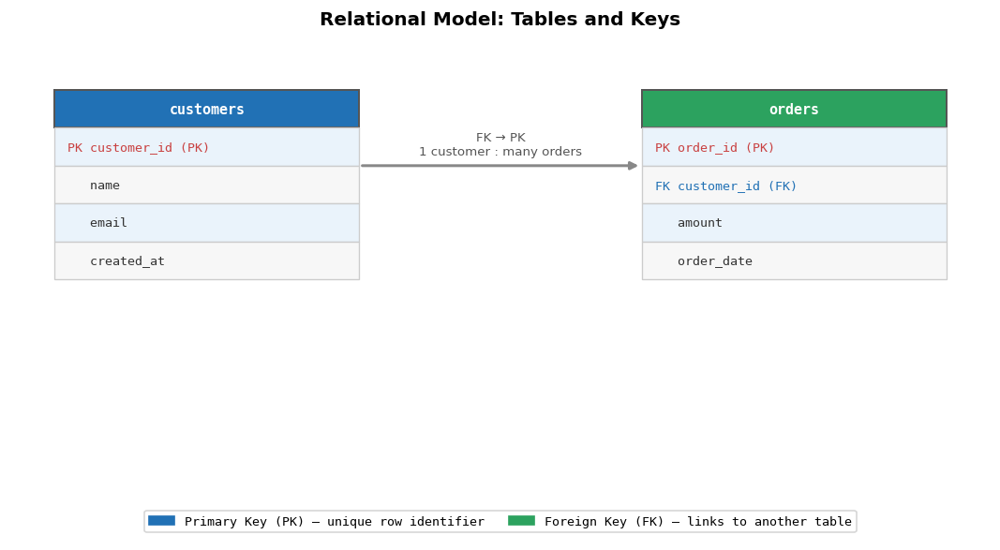
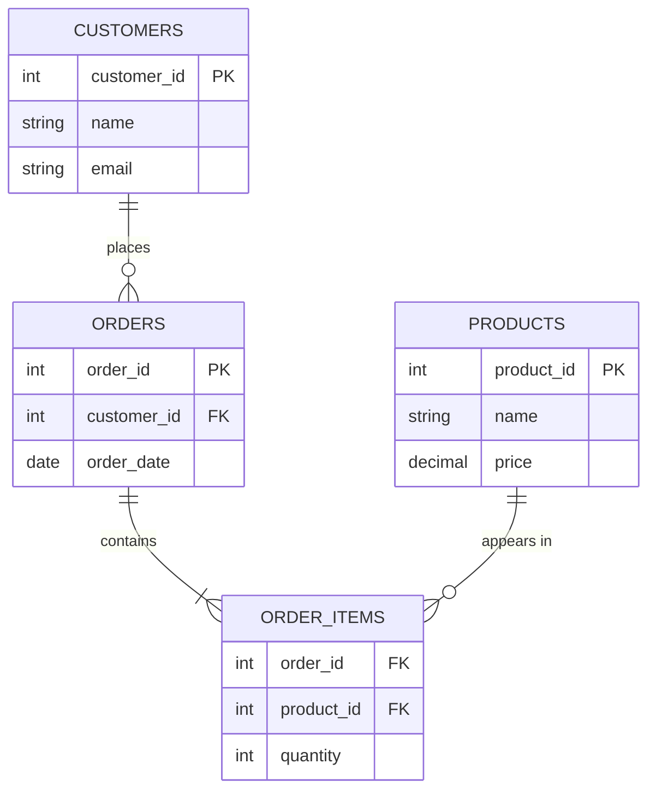

# Introduction to Databases: From Data to Knowledge

**After this lesson:** You can describe how relational databases organize data in tables, how keys link tables, and why **normalization** (splitting data to reduce redundancy) supports reliable queries.

## Helpful video

High-level introduction to SQL and relational databases.

<iframe width="560" height="315" src="https://www.youtube.com/embed/27axs9dO7AE" title="What is SQL?" frameborder="0" allow="accelerometer; autoplay; clipboard-write; encrypted-media; gyroscope; picture-in-picture" allowfullscreen></iframe>

## Overview

**Prerequisites:** [Data Querying with SQL (module README)](README.md) lists tools and sample data. Thinking in rows and columns—like a spreadsheet—matches what you practiced in [Pandas Series and DataFrame](../../1-data-fundamentals/1.5-data-analysis-pandas/dataframe.md).

> **Time needed:** About 45–60 minutes for a first read; longer if you run every SQL snippet.

> **Note:** **SQL** (Structured Query Language) is the standard language for querying relational databases; you will use it starting in [Basic SQL Operations](basic-operations.md).

## Why this matters

Tables and keys are not academic details—they are how organizations keep orders, customers, and inventory consistent at scale. When you later write `JOIN` and `WHERE` clauses, you are relying on this structure. A clear mental model of rows, relationships, and normalization makes the rest of the SQL submodule easier to read and debug.

## Understanding Databases

A **database** is software that stores and retrieves structured data reliably: many users, controlled updates, and rules that keep records consistent. You already think in **tables** if you have used spreadsheets or pandas; relational databases make relationships between those tables explicit with **keys** and **constraints**.

The bullets below are not separate topics to memorize in isolation—they describe what “good” database design tries to protect: organized storage, trustworthy values, and safe access at scale.

1. **Data Organization**
   - Structured vs Unstructured Data
   - Records and Fields
   - Tables and Relationships

2. **Data Integrity**
   - Accuracy
   - Consistency
   - Reliability
   - Completeness

3. **Data Access**
   - Concurrent Access
   - Security
   - Performance
   - Scalability

## Types of Databases

Not every system stores data like a spreadsheet with explicit foreign keys. This course focuses on **relational** databases, but you will hear the other families in architecture discussions—so a short map is useful.

### 1. Relational Databases (RDBMS)

- Uses structured tables with rows and columns
- Enforces relationships between tables
- Examples: PostgreSQL, MySQL, Oracle


-- Example of relational structure
CREATE TABLE customers (
    customer_id SERIAL PRIMARY KEY,
    name VARCHAR(100),
    email VARCHAR(100)
);

CREATE TABLE orders (
    order_id SERIAL PRIMARY KEY,
    customer_id INTEGER REFERENCES customers(customer_id),
    order_date TIMESTAMP
);


<aside class="code-explainer__callouts" aria-label="Code walkthrough">
  

    

      
      Example of relational structure
    

    

      
Two tables: <code>customers</code> owns identities; <code>orders</code> references <code>customer_id</code> so each order belongs to one customer—classic parent/child FK pattern.

    

  

</aside>

The two `CREATE TABLE` statements illustrate the usual pattern: `customers` holds stable identity, and `orders` points to it with `REFERENCES customers(customer_id)`—that is a **foreign key** in practice.

### 2. NoSQL Databases

NoSQL systems often relax strict table-and-key rules to gain flexibility, scale, or speed for documents, key-value pairs, wide columns, or graphs. You still need a clear data model; it is expressed differently than in SQL.

- Document Stores (MongoDB)
- Key-Value Stores (Redis)
- Column-Family Stores (Cassandra)
- Graph Databases (Neo4j)

### 3. Specialized Databases

These engines optimize for one workload—time-ordered metrics, full-text search, embeddings, or geography. Teams often combine them with a relational database: PostgreSQL for core transactions, plus Elasticsearch or a time-series DB for specialized queries.

- Time-Series Databases (InfluxDB)
- Search Engines (Elasticsearch)
- Vector Databases (Pinecone)
- Spatial Databases (PostGIS)

## Database Design Principles

### 1. Entity-Relationship Model

ER modeling is a sketch before you write DDL: **entities** (things you store), **relationships** (how they connect), and **cardinality** (one-to-many, many-to-many). The SQL below shows a classic many-to-many bridge table (`product_categories`) between `products` and `categories`.

*Read `||--o{` as "one customer places zero or more orders". The bridge table `ORDER_ITEMS` resolves the many-to-many between `ORDERS` and `PRODUCTS`.*


-- Example of implementing entities and relationships
CREATE TABLE products (
    product_id SERIAL PRIMARY KEY,
    name VARCHAR(100),
    price DECIMAL(10,2)
);

CREATE TABLE categories (
    category_id SERIAL PRIMARY KEY,
    name VARCHAR(50)
);

CREATE TABLE product_categories (
    product_id INTEGER REFERENCES products(product_id),
    category_id INTEGER REFERENCES categories(category_id),
    PRIMARY KEY (product_id, category_id)
);


<aside class="code-explainer__callouts" aria-label="Code walkthrough">
  

    

      
      Example of implementing entities and relation…
    

    

      
<code>products</code> and <code>categories</code> are linked by a junction table <code>product_categories</code> with a composite primary key—standard many-to-many modeling.

    

  

  

    

      
      Category_id SERIAL PRIMARY KEY,
    

    

      
Junction row: both columns are foreign keys; together they form the primary key so the same pair cannot be inserted twice.

    

  

</aside>

Here the composite primary key on the junction table enforces “each product–category pair appears at most once,” which is exactly what you want for a many-to-many link.

### 2. Data Modeling

Teams usually move from whiteboard to database in three layers:

- Conceptual Model
- Logical Model
- Physical Model

In practice: **conceptual** is business nouns and verbs on a whiteboard; **logical** is tables and keys without worrying about disk; **physical** is indexes, partitions, and types tuned to your engine.

### 3. Normalization Forms

**Normalization** reduces redundant storage and update anomalies by splitting tables until each fact lives in one logical place. The examples below are minimal illustrations—real schemas add history, soft deletes, and performance trade-offs.

1. **First Normal Form (1NF)**
   - Atomic values
   - No repeating groups


-- Bad: Non-1NF
CREATE TABLE orders_bad (
    order_id INTEGER,
    products TEXT -- "prod1,prod2,prod3"
);

-- Good: 1NF
CREATE TABLE orders_good (
    order_id INTEGER,
    product_id INTEGER
);


<aside class="code-explainer__callouts" aria-label="Code walkthrough">
  

    

      
      Bad: Non-1NF
    

    

      
Contrasts a packed text list of products with one row per product line—atomic values enable joins and counts.

    

  

</aside>

> **Takeaway:** Storing several product IDs in one comma-separated column breaks 1NF: you cannot index or join cleanly, and updates are error-prone. One row per `(order_id, product_id)` is the relational fix.

2. **Second Normal Form (2NF)**
   - Must be in 1NF
   - No partial dependencies


-- Bad: Non-2NF
CREATE TABLE order_items_bad (
    order_id INTEGER,
    product_id INTEGER,
    product_name VARCHAR(100), -- Depends only on product_id
    quantity INTEGER,
    PRIMARY KEY (order_id, product_id)
);

-- Good: 2NF
CREATE TABLE products (
    product_id INTEGER PRIMARY KEY,
    product_name VARCHAR(100)
);

CREATE TABLE order_items (
    order_id INTEGER,
    product_id INTEGER REFERENCES products(product_id),
    quantity INTEGER,
    PRIMARY KEY (order_id, product_id)
);


<aside class="code-explainer__callouts" aria-label="Code walkthrough">
  

    

      
      Bad: Non-2NF
    

    

      
Anti-pattern: <code>product_name</code> depends only on <code>product_id</code>, not the full composite key. The fix splits <code>products</code> out.

    

  

  

    

      
      CREATE TABLE products (
    

    

      
Clean <code>order_items</code> holds only keys and quantity; product names live solely in <code>products</code>.

    

  

</aside>

> **Takeaway:** Here `product_name` depends only on `product_id`, not on the full `(order_id, product_id)` key—so it belongs in a `products` table. That split is the usual 2NF fix for line-item tables.

3. **Third Normal Form (3NF)**
   - Must be in 2NF
   - No transitive dependencies


-- Bad: Non-3NF
CREATE TABLE employees_bad (
    employee_id INTEGER PRIMARY KEY,
    department_id INTEGER,
    department_name VARCHAR(50), -- Depends on department_id
    salary INTEGER
);

-- Good: 3NF
CREATE TABLE departments (
    department_id INTEGER PRIMARY KEY,
    department_name VARCHAR(50)
);

CREATE TABLE employees (
    employee_id INTEGER PRIMARY KEY,
    department_id INTEGER REFERENCES departments(department_id),
    salary INTEGER
);


<aside class="code-explainer__callouts" aria-label="Code walkthrough">
  

    

      
      Bad: Non-3NF
    

    

      
Redundant <code>department_name</code> on every employee row duplicates data tied to <code>department_id</code>.

    

  

  

    

      
      CREATE TABLE departments (
    

    

      
Department attributes live in one place; employees reference <code>department_id</code> only—removes transitive dependency.

    

  

</aside>

> **Takeaway:** `department_name` is determined by `department_id`, not by `employee_id` directly—so repeating it on every employee row risks inconsistency when a department renames. Moving department attributes to `departments` restores 3NF.

## Database Management Systems (DBMS)

A **DBMS** is the software that sits between your SQL (or API) and the disk: it stores pages, enforces permissions, runs transactions, and plans queries.

### 1. Core Functions

At minimum you should expect: durable **storage**, query **retrieval**, controlled **updates**, **admin** tooling (users, backups), and **security** (authz, auditing). The list is short; production systems add replication, HA, and observability on top.

- Data Storage
- Data Retrieval
- Data Update
- Administration
- Security

### 2. Important Features

The snippets below are **illustrative**—exact privilege syntax and backup commands depend on your engine (PostgreSQL, SQL Server, etc.). The point is to see what a DBMS provides beyond raw `SELECT`/`INSERT`.


-- Transaction Management
BEGIN;
    -- Operations
COMMIT;

-- Access Control
GRANT SELECT, INSERT ON table_name TO user_name;

-- Backup and Recovery
CREATE EXTENSION pg_dump;


<aside class="code-explainer__callouts" aria-label="Code walkthrough">
  

    

      
      Transaction Management
    

    

      
Sketch of ACID-related features: explicit <code>BEGIN</code>/<code>COMMIT</code>, <code>GRANT</code> for privileges—syntax varies by engine; backup lines are illustrative.

    

  

</aside>

### 3. Performance Features


-- Indexing
CREATE INDEX idx_name ON table_name(column_name);

-- Query Planning
EXPLAIN ANALYZE SELECT * FROM table_name;

-- Caching
SET work_mem = '64MB';


<aside class="code-explainer__callouts" aria-label="Code walkthrough">
  

    

      
      Indexing
    

    

      
Creates a btree index for lookups, mentions <code>EXPLAIN ANALYZE</code> for plans, and <code>work_mem</code> for sort/hash workspace—tune per workload.

    

  

</aside>

## Basic Database Operations

These are the lifecycle operations you use when bootstrapping a project or adjusting a schema: create databases and schemas, define tables and views, then load or change rows.

### 1. Database Creation


-- Create database
CREATE DATABASE my_database;

-- Create schema
CREATE SCHEMA my_schema;

-- Set search path
SET search_path TO my_schema, public;


<aside class="code-explainer__callouts" aria-label="Code walkthrough">
  

    

      
      Create database
    

    

      
<code>CREATE DATABASE</code>, optional <code>SCHEMA</code>, and <code>search_path</code> so unqualified names resolve predictably.

    

  

</aside>

### 2. Table Management


-- Create table with constraints
CREATE TABLE users (
    user_id SERIAL PRIMARY KEY,
    username VARCHAR(50) UNIQUE NOT NULL,
    email VARCHAR(100) UNIQUE NOT NULL,
    created_at TIMESTAMP DEFAULT CURRENT_TIMESTAMP,
    CONSTRAINT valid_email CHECK (email ~* '^[A-Za-z0-9._%+-]+@[A-Za-z0-9.-]+\.[A-Za-z]{2,}$')
);

-- Alter table
ALTER TABLE users 
ADD COLUMN last_login TIMESTAMP,
ADD CONSTRAINT user_status CHECK (last_login IS NULL OR last_login <= CURRENT_TIMESTAMP);

-- Create view
CREATE VIEW active_users AS
SELECT * FROM users
WHERE last_login >= CURRENT_TIMESTAMP - INTERVAL '30 days';


<aside class="code-explainer__callouts" aria-label="Code walkthrough">
  

    

      
      Create table with constraints
    

    

      
<code>UNIQUE</code>, <code>NOT NULL</code>, regex <code>CHECK</code> on email, and defaults—constraints enforce rules at insert time.

    

  

  

    

      
      Alter table
    

    

      
<code>ALTER TABLE</code> adds columns and constraints; <code>CREATE VIEW</code> exposes a filtered “active users” subset.

    

  

</aside>

### 3. Data Management


-- Insert data
INSERT INTO users (username, email)
VALUES ('john_doe', 'john@example.com');

-- Update data
UPDATE users 
SET last_login = CURRENT_TIMESTAMP
WHERE username = 'john_doe';

-- Delete data
DELETE FROM users
WHERE last_login < CURRENT_TIMESTAMP - INTERVAL '1 year';


<aside class="code-explainer__callouts" aria-label="Code walkthrough">
  

    

      
      Insert data
    

    

      
Standard <code>INSERT</code>—specify the target columns, then provide matching values. Omitting the column list inserts into every column in declaration order.

    

  

  

    

      
      Update data
    

    

      
Conditional <code>UPDATE</code>—<code>SET</code> assigns the new value; always pair with a <code>WHERE</code> clause to avoid updating every row in the table.

    

  

  

    

      
      Delete data
    

    

      
Scoped <code>DELETE</code>—the <code>WHERE</code> clause limits deletion to inactive users only. Without it the entire table is wiped.

    

  

</aside>

## Additional Real-World Examples

### 1. E-commerce Analytics Platform


-- Track user behavior and product performance
CREATE TABLE user_events (
    event_id BIGSERIAL PRIMARY KEY,
    user_id INT REFERENCES users(user_id),
    event_type VARCHAR(50),  -- view, add_to_cart, purchase
    product_id INT REFERENCES products(product_id),
    session_id UUID,
    event_timestamp TIMESTAMP DEFAULT CURRENT_TIMESTAMP,
    device_info JSONB,
    location POINT
);

-- Create materialized view for real-time analytics
CREATE MATERIALIZED VIEW product_engagement AS
SELECT 
    p.product_id,
    p.name,
    COUNT(DISTINCT CASE WHEN ue.event_type = 'view' THEN ue.user_id END) as unique_views,
    COUNT(DISTINCT CASE WHEN ue.event_type = 'add_to_cart' THEN ue.user_id END) as cart_adds,
    COUNT(DISTINCT CASE WHEN ue.event_type = 'purchase' THEN ue.user_id END) as purchasers,
    ROUND(
        COUNT(DISTINCT CASE WHEN ue.event_type = 'purchase' THEN ue.user_id END)::numeric /
        NULLIF(COUNT(DISTINCT CASE WHEN ue.event_type = 'view' THEN ue.user_id END), 0) * 100,
        2
    ) as conversion_rate
FROM products p
LEFT JOIN user_events ue ON p.product_id = ue.product_id
GROUP BY p.product_id, p.name;


<aside class="code-explainer__callouts" aria-label="Code walkthrough">
  

    

      
      Track user behavior and product performance
    

    

      
Defines an <code>user_events</code> fact table (JSONB for flexible payloads) and a materialized view aggregating funnel metrics per product.

    

  

  

    

      
      SELECT
    

    

      
Outer query joins events to products and computes conversion-style rates—typical engagement dashboard SQL.

    

  

</aside>

### 2. Healthcare Management System


-- Patient records with privacy considerations
CREATE TABLE patients (
    patient_id SERIAL PRIMARY KEY,
    mrn VARCHAR(50) UNIQUE,  -- Medical Record Number
    first_name VARCHAR(50) ENCRYPTED,
    last_name VARCHAR(50) ENCRYPTED,
    date_of_birth DATE ENCRYPTED,
    contact_info JSONB ENCRYPTED,
    created_at TIMESTAMP DEFAULT CURRENT_TIMESTAMP,
    updated_at TIMESTAMP DEFAULT CURRENT_TIMESTAMP
);

-- Medical history with versioning
CREATE TABLE medical_records (
    record_id SERIAL PRIMARY KEY,
    patient_id INT REFERENCES patients(patient_id),
    record_type VARCHAR(50),
    record_data JSONB ENCRYPTED,
    version INT,
    valid_from TIMESTAMP,
    valid_to TIMESTAMP,
    created_by INT REFERENCES staff(staff_id),
    created_at TIMESTAMP DEFAULT CURRENT_TIMESTAMP
);

-- Implement row-level security
ALTER TABLE patients ENABLE ROW LEVEL SECURITY;
CREATE POLICY patient_access_policy ON patients
    USING (created_by = CURRENT_USER OR 
           CURRENT_USER IN (SELECT user_id FROM staff WHERE role = 'doctor'));


<aside class="code-explainer__callouts" aria-label="Code walkthrough">
  

    

      
      Patient records with privacy considerations
    

    

      
Illustrative DDL with <code>ENCRYPTED</code> markers—real systems use column encryption or vaults; shows versioning fields on medical records.

    

  

  

    

      
      Patient_id INT REFERENCES patients(patient_id),
    

    

      
Row-level security policy example: only certain roles see rows—Postgres-style; wire-up depends on your auth model.

    

  

</aside>

## Performance Optimization Examples

### 1. Indexing Strategies


-- B-tree index for exact matches and ranges
CREATE INDEX idx_orders_date ON orders(order_date);

-- Hash index for equality comparisons
CREATE INDEX idx_users_email ON users USING HASH (email);

-- GiST index for geometric data
CREATE INDEX idx_locations ON stores USING GIST (location);

-- GIN index for full-text search
CREATE INDEX idx_products_search ON products USING GIN (to_tsvector('english', description));


<aside class="code-explainer__callouts" aria-label="Code walkthrough">
  

    

      
      B-tree index for exact matches and ranges
    

    

      
Contrasts btree, hash, GiST, and GIN—pick the access pattern (equality vs text search vs geometry).

    

  

</aside>

### 2. Partitioning Examples


-- Range partitioning for time-series data
CREATE TABLE metrics (
    metric_id BIGSERIAL,
    timestamp TIMESTAMP,
    value DECIMAL(10,2),
    metadata JSONB
) PARTITION BY RANGE (timestamp);

-- Create monthly partitions
CREATE TABLE metrics_2023_01 PARTITION OF metrics
    FOR VALUES FROM ('2023-01-01') TO ('2023-02-01');
CREATE TABLE metrics_2023_02 PARTITION OF metrics
    FOR VALUES FROM ('2023-02-01') TO ('2023-03-01');

-- List partitioning for categorical data
CREATE TABLE sales (
    sale_id BIGSERIAL,
    region VARCHAR(50),
    amount DECIMAL(10,2)
) PARTITION BY LIST (region);

-- Create regional partitions
CREATE TABLE sales_north PARTITION OF sales
    FOR VALUES IN ('NORTH');
CREATE TABLE sales_south PARTITION OF sales
    FOR VALUES IN ('SOUTH');


<aside class="code-explainer__callouts" aria-label="Code walkthrough">
  

    

      
      Range partitioning for time-series data
    

    

      
Parent <code>metrics</code> table partitioned by timestamp; child tables hold monthly ranges—prune partitions when dropping old data.

    

  

  

    

      
      List partitioning for categorical data
    

    

      
<code>LIST</code> partitioning splits <code>sales</code> by region into separate physical tables behind one logical name.

    

  

</aside>

### 3. Query Optimization


-- Use CTEs for better readability and performance
WITH monthly_sales AS (
    SELECT 
        DATE_TRUNC('month', sale_date) as month,
        SUM(amount) as revenue
    FROM sales
    WHERE sale_date >= CURRENT_DATE - INTERVAL '12 months'
    GROUP BY DATE_TRUNC('month', sale_date)
),
sales_growth AS (
    SELECT 
        month,
        revenue,
        LAG(revenue) OVER (ORDER BY month) as prev_month_revenue
    FROM monthly_sales
)
SELECT 
    month,
    revenue,
    ROUND(
        ((revenue - prev_month_revenue) / prev_month_revenue * 100)::numeric,
        2
    ) as growth_rate
FROM sales_growth;


<aside class="code-explainer__callouts" aria-label="Code walkthrough">
  

    

      
      Use CTEs for better readability and performance
    

    

      
Monthly revenue CTE, then <code>LAG</code> for prior month—month-over-month growth pattern.

    

  

  

    

      
      Revenue,
    

    

      
Computes percent growth from <code>LAG</code>; guard divide-by-zero on the first month.

    

  

</aside>

## Common Pitfalls and Solutions

### 1. Connection Management


-- Bad: Not closing connections
db_conn = connect_to_db()
do_something(db_conn)
# Connection left open

-- Good: Use connection pooling
WITH connection_pool AS (
    SELECT * FROM dblink('connection_string')
    AS t(id INT, name TEXT)
)
SELECT * FROM connection_pool;


<aside class="code-explainer__callouts" aria-label="Code walkthrough">
  

    

      
      Bad: Not closing connections
    

    

      
Contrasts leaking connections with pooling—pseudo-SQL; real clients use poolers or context managers in app code.

    

  

</aside>

### 2. Transaction Management


-- Bad: No error handling
UPDATE accounts SET balance = balance - 100 WHERE id = 1;
UPDATE accounts SET balance = balance + 100 WHERE id = 2;

-- Good: Proper transaction handling
BEGIN;
    SAVEPOINT my_savepoint;
    
    UPDATE accounts 
    SET balance = balance - 100 
    WHERE id = 1;
    
    IF NOT FOUND THEN
        ROLLBACK TO my_savepoint;
        RAISE EXCEPTION 'Account not found';
    END IF;
    
    UPDATE accounts 
    SET balance = balance + 100 
    WHERE id = 2;
    
    IF NOT FOUND THEN
        ROLLBACK TO my_savepoint;
        RAISE EXCEPTION 'Account not found';
    END IF;
    
    COMMIT;
EXCEPTION WHEN OTHERS THEN
    ROLLBACK;
    RAISE;


<aside class="code-explainer__callouts" aria-label="Code walkthrough">
  

    

      
      Bad: No error handling
    

    

      
Two bare <code>UPDATE</code>s vs a transactional block with savepoints—illustrates atomic transfers and rollback on failure.

    

  

  

    

      
      END IF;
    

    

      
Continuation of PL/pgSQL-style error handling (dialect-specific); nested checks before <code>COMMIT</code>.

    

  

</aside>

## Interactive Examples with Sample Data

### 1. Customer Analysis


-- Create sample customer data
INSERT INTO customers (first_name, last_name, email, join_date)
SELECT 
    'Customer' || i as first_name,
    'Last' || i as last_name,
    'customer' || i || '@example.com' as email,
    CURRENT_DATE - (random() * 365)::integer as join_date
FROM generate_series(1, 1000) i;

-- Analyze customer cohorts
WITH cohorts AS (
    SELECT 
        DATE_TRUNC('month', join_date) as cohort_month,
        COUNT(*) as cohort_size
    FROM customers
    GROUP BY DATE_TRUNC('month', join_date)
)
SELECT 
    cohort_month,
    cohort_size,
    SUM(cohort_size) OVER (ORDER BY cohort_month) as cumulative_customers
FROM cohorts
ORDER BY cohort_month;


<aside class="code-explainer__callouts" aria-label="Code walkthrough">
  

    

      
      Create sample customer data
    

    

      
<code>generate_series</code> builds synthetic customers; cohort CTE groups by signup month and running sum for cumulative count.

    

  

  

    

      
      SELECT
    

    

      
Cohort query outer <code>SELECT</code>: orders cohort rows by month and applies a windowed cumulative sum.

    

  

</aside>

### 2. Product Performance


-- Generate sample sales data
INSERT INTO sales (product_id, sale_date, quantity, amount)
SELECT 
    (random() * 100)::integer as product_id,
    CURRENT_DATE - (random() * 90)::integer as sale_date,
    (random() * 10 + 1)::integer as quantity,
    (random() * 1000)::numeric(10,2) as amount
FROM generate_series(1, 10000);

-- Analyze product performance
WITH product_metrics AS (
    SELECT 
        product_id,
        COUNT(*) as sale_count,
        SUM(quantity) as units_sold,
        SUM(amount) as revenue,
        AVG(amount) as avg_sale_value
    FROM sales
    GROUP BY product_id
)
SELECT 
    product_id,
    sale_count,
    units_sold,
    ROUND(revenue::numeric, 2) as revenue,
    ROUND(avg_sale_value::numeric, 2) as avg_sale_value,
    NTILE(4) OVER (ORDER BY revenue DESC) as revenue_quartile
FROM product_metrics
ORDER BY revenue DESC;


<aside class="code-explainer__callouts" aria-label="Code walkthrough">
  

    

      
      Generate sample sales data
    

    

      
Randomized bulk insert for stress testing; windowed <code>NTILE</code> buckets products by revenue quartile.

    

  

  

    

      
      SUM(quantity) as units_sold,
    

    

      
Aggregates random sales per product: counts, units, revenue, average ticket, and quartile rank—typical product leaderboard query.

    

  

</aside>

Remember: "A well-designed database is the foundation of any successful application!"

## Next steps

- [Basic SQL Operations](basic-operations.md) — **SELECT**, filters, and sorting
- [Aggregations](aggregations.md) — **GROUP BY** and summary statistics
- [Joins](joins.md) — combine tables with **JOIN**
- [Module 2.1 README](README.md) — full path and assignment
