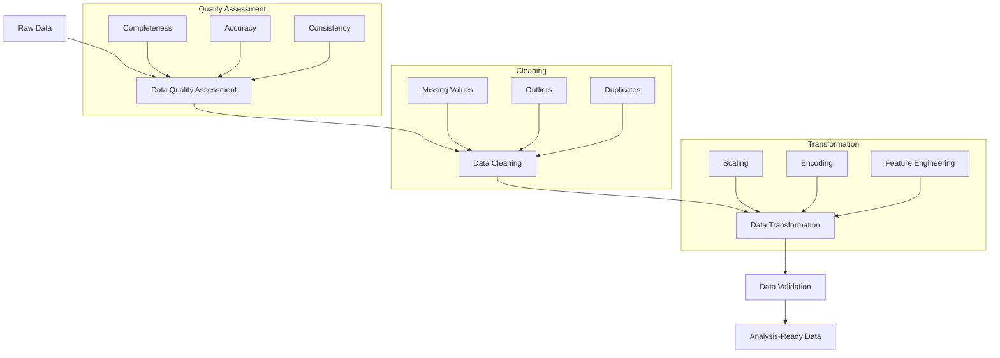

# Data Wrangling: From Raw Data to Reliable Insights

**After this submodule:** You can assess quality, handle **missing values** and **outliers**, and **transform** columns so downstream analysis (EDA or modeling) is trustworthy.

## Helpful video

Pandas DataFrames in a quick walkthrough—useful for cleaning and wrangling.

<iframe width="560" height="315" src="https://www.youtube.com/embed/m1_33jhhiLE" title="Learn PANDAS in 5 minutes" frameborder="0" allow="accelerometer; autoplay; clipboard-write; encrypted-media; gyroscope; picture-in-picture" allowfullscreen></iframe>

## Overview

**Prerequisites:** [Pandas](../../1-data-fundamentals/1.5-data-analysis-pandas/README.md) and [NumPy](../../1-data-fundamentals/1.4-data-foundation-linear-algebra/README.md) basics. [SQL (Module 2.1)](../2.1-sql/README.md) is useful when your raw data comes from databases.

> **Time needed:** Several hours across lessons and the tutorial notebook.

Data wrangling, also known as data munging or data preprocessing, is the art and science of transforming raw data into a clean, reliable format suitable for analysis. Think of it as preparing ingredients before cooking - just as a chef needs clean, properly cut ingredients, a data scientist needs clean, properly formatted data.

## The Data Wrangling Journey

Let's explore the essential steps in transforming messy data into analysis-ready datasets:



## Learning Objectives

After completing this module, you will be able to:

1. **Assess Data Quality**
   - Identify data quality dimensions (accuracy, completeness, consistency, timeliness)
   - Measure data completeness using statistical methods
   - Evaluate data consistency across different sources
   - Detect anomalies using statistical and machine learning approaches
   - Example: Analyzing customer data to identify incorrect email formats or impossible age values

2. **Clean Data Effectively**
   - Handle missing values using advanced imputation techniques
   - Treat outliers using statistical methods (z-score, IQR)
   - Remove or merge duplicates while preserving data integrity
   - Fix inconsistencies in formats and representations
   - Example: Cleaning sales data by handling missing prices, removing duplicate orders, and standardizing product names

3. **Transform Data**
   - Scale numerical features using various methods (min-max, standard scaling)
   - Encode categorical variables (one-hot, label encoding)
   - Engineer new features to capture domain knowledge
   - Standardize formats (dates, currencies, units)
   - Example: Preparing customer transaction data by normalizing monetary values and creating time-based features

4. **Validate Results**
   - Implement automated quality checks
   - Verify transformations using statistical tests
   - Ensure data integrity through cross-validation
   - Document changes for reproducibility
   - Example: Validating cleaned customer data by checking for impossible combinations and verifying statistical properties

## Real-World Example: E-commerce Data Analysis

Let's walk through a comprehensive example of wrangling e-commerce data. This example demonstrates common challenges and solutions you'll encounter in real-world data science projects:

<div class="code-explainer" data-code-explainer>
<div class="code-explainer__code">


import pandas as pd
import numpy as np
from sklearn.preprocessing import StandardScaler

# Load messy e-commerce data
df = pd.read_csv('../_data/sales_data.csv')

# 1. Data Quality Assessment
print("Data Quality Report")
print("-" * 50)
print(f"Total Records: {len(df)}")
print(f"Missing Values:\n{df.isnull().sum()}")
print(f"\nDuplicate Records: {df.duplicated().sum()}")

# 2. Handle Missing Values
# Numeric columns: fill with median
numeric_cols = df.select_dtypes(include=[np.number]).columns
df[numeric_cols] = df[numeric_cols].fillna(df[numeric_cols].median())

# Categorical columns: fill with mode
cat_cols = df.select_dtypes(include=['object']).columns
df[cat_cols] = df[cat_cols].fillna(df[cat_cols].mode().iloc[0])

# 3. Handle Outliers
def remove_outliers(df, column, n_std=3):
    mean = df[column].mean()
    std = df[column].std()
    df = df[np.abs(df[column] - mean) <= (n_std * std)]
    return df

# Remove outliers from price
df = remove_outliers(df, 'price')

# 4. Feature Engineering
# Create new features
df['total_value'] = df['price'] * df['quantity']
df['order_month'] = pd.to_datetime(df['order_date']).dt.month

# 5. Data Validation
def validate_data(df):
    assert df.isnull().sum().sum() == 0, "Found missing values"
    assert df['price'].min() >= 0, "Found negative prices"
    assert df['quantity'].min() >= 0, "Found negative quantities"
    print("Data validation passed!")

validate_data(df)

```
Data Quality Report
--------------------------------------------------
Total Records: 120
Missing Values:
date          0
order_date    0
sales         0
revenue       0
price         1
quantity      1
category      0
email         1
dtype: int64

Duplicate Records: 0
Data validation passed!
```

</div>
<aside class="code-explainer__callouts" aria-label="Code walkthrough">
  <div class="code-callout" data-lines="1-11" data-tint="1">
    <div class="code-callout__meta">
      <span class="code-callout__lines"></span>
      <span class="code-callout__title">Import pandas as pd</span>
    </div>
    <div class="code-callout__body">
      <p>Lines 1–11: follow this band in the snippet.</p>
    </div>
  </div>
  <div class="code-callout" data-lines="12-23" data-tint="2">
    <div class="code-callout__meta">
      <span class="code-callout__lines"></span>
      <span class="code-callout__title">Print(f&quot;Missing Values:\n{df.isnull().sum()}&quot;)</span>
    </div>
    <div class="code-callout__body">
      <p>Lines 12–23: follow this band in the snippet.</p>
    </div>
  </div>
  <div class="code-callout" data-lines="24-34" data-tint="3">
    <div class="code-callout__meta">
      <span class="code-callout__lines"></span>
      <span class="code-callout__title">3. Handle Outliers</span>
    </div>
    <div class="code-callout__body">
      <p>Lines 24–34: follow this band in the snippet.</p>
    </div>
  </div>
  <div class="code-callout" data-lines="35-46" data-tint="4">
    <div class="code-callout__meta">
      <span class="code-callout__lines"></span>
      <span class="code-callout__title">Create new features</span>
    </div>
    <div class="code-callout__body">
      <p>Lines 35–46: follow this band in the snippet.</p>
    </div>
  </div>
</aside>
</div>

## Common Data Quality Issues and Solutions

Here's a comprehensive guide to handling common data quality challenges:

| Issue | Detection Method | Solution Strategy | Real-World Example |
|-------|-----------------|-------------------|-------------------|
| Missing Values | `df.isnull().sum()` | Imputation, deletion | Customer age missing: Use median age for segment |
| Outliers | Z-score, IQR | Capping, removal | Order amount $999,999: Cap at 3 std deviations |
| Duplicates | `df.duplicated()` | Remove or merge | Same order ID with different timestamps: Keep latest |
| Inconsistent Formats | Pattern matching | Standardization | Phone numbers: Convert all to +1-XXX-XXX-XXXX |
| Invalid Values | Domain validation | Correction or removal | Negative prices: Investigate and correct |
| Typos | String similarity | Fuzzy matching | Product names: "iPhone" vs "i-phone" |
| Date Format Issues | Pattern validation | Parsing & standardization | Convert all dates to ISO format |
| Case Sensitivity | String operations | Case normalization | Email: Convert all to lowercase |

## Data Transformation Techniques

### 1. Scaling Methods

<div class="code-explainer" data-code-explainer>
<div class="code-explainer__code">


import pandas as pd

df = pd.read_csv('../_data/sales_data.csv')
# Standardization (Z-score normalization)
from sklearn.preprocessing import StandardScaler
scaler = StandardScaler()
df['scaled_price'] = scaler.fit_transform(df[['price']])

# Min-Max Scaling
from sklearn.preprocessing import MinMaxScaler
scaler = MinMaxScaler()
df['normalized_price'] = scaler.fit_transform(df[['price']])

print(df[['price', 'scaled_price', 'normalized_price']].head())

```
        price  scaled_price  normalized_price
0  445.942283      1.371460          0.908062
1  447.256087      1.380197          0.910811
2  261.834888      0.147135          0.522892
3  161.384881     -0.520863          0.312740
4         NaN           NaN               NaN
```

</div>
<aside class="code-explainer__callouts" aria-label="Code walkthrough">
  <div class="code-callout" data-lines="1-9" data-tint="1">
    <div class="code-callout__meta">
      <span class="code-callout__lines"></span>
      <span class="code-callout__title">Standardization (Z-score normalization)</span>
    </div>
    <div class="code-callout__body">
      <p>Lines 1–9: follow this band in the snippet.</p>
    </div>
  </div>
</aside>
</div>

### 2. Encoding Categorical Variables

<div class="code-explainer" data-code-explainer>
<div class="code-explainer__code">


import pandas as pd

df = pd.read_csv('../_data/sales_data.csv')
# One-Hot Encoding
df_encoded = pd.get_dummies(df, columns=['category'])

# Label Encoding
from sklearn.preprocessing import LabelEncoder
le = LabelEncoder()
df['encoded_category'] = le.fit_transform(df['category'])

print(df[['category', 'encoded_category']].head())
print('encoded shape:', df_encoded.shape)

```
      category  encoded_category
0  Electronics                 1
1         Home                 2
2         Home                 2
3  Electronics                 1
4         Home                 2
encoded shape: (120, 10)
```

</div>
<aside class="code-explainer__callouts" aria-label="Code walkthrough">
  <div class="code-callout" data-lines="1-7" data-tint="1">
    <div class="code-callout__meta">
      <span class="code-callout__lines"></span>
      <span class="code-callout__title">One-Hot Encoding</span>
    </div>
    <div class="code-callout__body">
      <p>Lines 1–7: follow this band in the snippet.</p>
    </div>
  </div>
</aside>
</div>

## Best Practices for Data Wrangling

1. **Document Everything**

   <div class="code-explainer" data-code-explainer>
   <div class="code-explainer__code">
   
   
      # Data cleaning log
      cleaning_log = {
          'original_rows': len(df),
          'missing_values_handled': True,
          'outliers_removed': 15,
          'features_added': ['total_value', 'order_month']
      }
   
   </div>
   <aside class="code-explainer__callouts" aria-label="Code walkthrough">
     <div class="code-callout" data-lines="1-7" data-tint="1">
       <div class="code-callout__meta">
         <span class="code-callout__lines"></span>
         <span class="code-callout__title">Data cleaning log</span>
       </div>
       <div class="code-callout__body">
         <p>Lines 1–7: follow this band in the snippet.</p>
       </div>
     </div>
   </aside>
   </div>

2. **Create Reusable Functions**

   <div class="code-explainer" data-code-explainer>
   <div class="code-explainer__code">
   
   
      def clean_dataset(df):
          """
          Clean dataset using standard procedures
          
          Parameters:
          df (pandas.DataFrame): Input dataframe
          
          Returns:
          pandas.DataFrame: Cleaned dataframe
          """
          df = handle_missing_values(df)
          df = remove_outliers(df)
          df = create_features(df)
          validate_data(df)
          return df
   
   </div>
   <aside class="code-explainer__callouts" aria-label="Code walkthrough">
     <div class="code-callout" data-lines="1-7" data-tint="1">
       <div class="code-callout__meta">
         <span class="code-callout__lines"></span>
         <span class="code-callout__title">Def clean_dataset(df):</span>
       </div>
       <div class="code-callout__body">
         <p>Lines 1–7: follow this band in the snippet.</p>
       </div>
     </div>
     <div class="code-callout" data-lines="8-15" data-tint="2">
       <div class="code-callout__meta">
         <span class="code-callout__lines"></span>
         <span class="code-callout__title">Returns:</span>
       </div>
       <div class="code-callout__body">
         <p>Lines 8–15: follow this band in the snippet.</p>
       </div>
     </div>
   </aside>
   </div>

3. **Validate Transformations**

   <div class="code-explainer" data-code-explainer>
   <div class="code-explainer__code">
   
   
      def validate_transformation(original_df, transformed_df):
          """Validate data transformation results"""
          assert len(transformed_df) > 0, "Empty dataframe"
          assert transformed_df.isnull().sum().sum() == 0, "Missing values found"
          print("Transformation validated successfully!")
   
   </div>
   <aside class="code-explainer__callouts" aria-label="Code walkthrough">
     <div class="code-callout" data-lines="1-5" data-tint="1">
       <div class="code-callout__meta">
         <span class="code-callout__lines"></span>
         <span class="code-callout__title">Def validate_transformation(original_df, tran…</span>
       </div>
       <div class="code-callout__body">
         <p>Lines 1–5: follow this band in the snippet.</p>
       </div>
     </div>
   </aside>
   </div>

## Performance Considerations

1. **Memory Efficiency**

   <div class="code-explainer" data-code-explainer>
   <div class="code-explainer__code">
   
   
      # Optimize datatypes
      def optimize_dtypes(df):
          for col in df.columns:
              if df[col].dtype == 'float64':
                  df[col] = pd.to_numeric(df[col], downcast='float')
              elif df[col].dtype == 'int64':
                  df[col] = pd.to_numeric(df[col], downcast='integer')
          return df
   
   </div>
   <aside class="code-explainer__callouts" aria-label="Code walkthrough">
     <div class="code-callout" data-lines="1-8" data-tint="1">
       <div class="code-callout__meta">
         <span class="code-callout__lines"></span>
         <span class="code-callout__title">Optimize datatypes</span>
       </div>
       <div class="code-callout__body">
         <p>Lines 1–8: follow this band in the snippet.</p>
       </div>
     </div>
   </aside>
   </div>

2. **Processing Speed**

   <div class="code-explainer" data-code-explainer>
   <div class="code-explainer__code">
   
   
      # Use vectorized operations
      # Good:
      df['total'] = df['price'] * df['quantity']
      
      # Avoid:
      # for i in range(len(df)):
      #     df.loc[i, 'total'] = df.loc[i, 'price'] * df.loc[i, 'quantity']
   
   </div>
   <aside class="code-explainer__callouts" aria-label="Code walkthrough">
     <div class="code-callout" data-lines="1-7" data-tint="1">
       <div class="code-callout__meta">
         <span class="code-callout__lines"></span>
         <span class="code-callout__title">Use vectorized operations</span>
       </div>
       <div class="code-callout__body">
         <p>Lines 1–7: follow this band in the snippet.</p>
       </div>
     </div>
   </aside>
   </div>

## Prerequisites

- Python 3.x
- Key libraries:

  <div class="code-explainer" data-code-explainer>
  <div class="code-explainer__code">
  
  
    pip install pandas numpy scikit-learn matplotlib seaborn
  
  </div>
  <aside class="code-explainer__callouts" aria-label="Code walkthrough">
    <div class="code-callout" data-lines="1-1" data-tint="1">
      <div class="code-callout__meta">
        <span class="code-callout__lines"></span>
        <span class="code-callout__title">Pip install pandas numpy scikit-learn matplot…</span>
      </div>
      <div class="code-callout__body">
        <p>Lines 1–1: follow this band in the snippet.</p>
      </div>
    </div>
  </aside>
  </div>

## Tools and Resources

1. **Python Libraries**
   - pandas: Data manipulation
   - numpy: Numerical operations
   - scikit-learn: Data preprocessing
   - matplotlib/seaborn: Visualization

2. **Development Environment**
   - Jupyter Notebook
   - VS Code with Python extension
   - Git for version control

3. **Additional Resources**
   - [Pandas Documentation](https://pandas.pydata.org/docs/)
   - [Data Cleaning Guide](https://scikit-learn.org/stable/modules/preprocessing.html)
   - [Feature Engineering Book](https://www.oreilly.com/library/view/feature-engineering-for/9781491953235/)

## Assignment

Ready to practice your data wrangling skills? Head over to the [Data Wrangling Assignment](../_assignments/2.2-assignment.md) to apply what you've learned!

Let's transform messy data into analysis-ready datasets!
