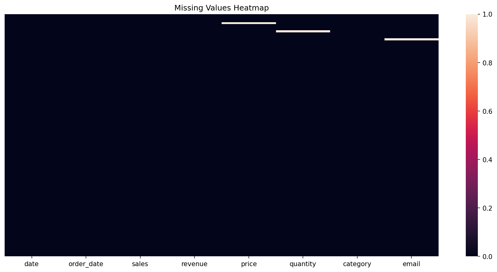

# Data Quality Assessment: Building Trust in Your Data

**After this lesson:** You can evaluate data along dimensions like **accuracy**, **completeness**, **consistency**, and **timeliness**, and document issues before modeling or reporting.

## Helpful video

Pandas DataFrames in a quick walkthrough—useful for cleaning and wrangling.

<iframe width="560" height="315" src="https://www.youtube.com/embed/m1_33jhhiLE" title="Learn PANDAS in 5 minutes" frameborder="0" allow="accelerometer; autoplay; clipboard-write; encrypted-media; gyroscope; picture-in-picture" allowfullscreen></iframe>

## Overview

**Prerequisites:** [Pandas](../../1-data-fundamentals/1.5-data-analysis-pandas/README.md) (**describe**, **info**, **value_counts**). [SQL (Module 2.1)](../2.1-sql/README.md) helps if your source data lives in a database.

> **Time needed:** About 45–60 minutes for concepts; more if you build the full dashboard examples.

## Why this matters

You cannot fix what you do not measure. **Accuracy**, **completeness**, and **consistency** sound like buzzwords until a duplicate customer ID doubles revenue or a silent NULL column trains the wrong model. This lesson gives you a shared checklist to *document* problems before you impute, plot, or report.

Data quality is the foundation of reliable analytics and machine learning. Poor data quality can lead to incorrect insights, biased models, and costly business decisions. This guide walks through dimensions and metrics you can apply on real tables.

## Understanding Data Quality Dimensions

Data quality is multifaceted and can be evaluated across several key dimensions. Each dimension represents a critical aspect of data reliability:

1. **Accuracy**: The degree to which data correctly represents the real-world entity or event
   - Example: Customer age should be a reasonable number (0-120)
   - Impact: Inaccurate data leads to wrong insights

2. **Completeness**: The extent to which required data is available
   - Example: All mandatory fields in a form should be filled
   - Impact: Missing data can bias analysis

3. **Consistency**: The degree to which data maintains integrity across the dataset
   - Example: Date formats should be uniform throughout
   - Impact: Inconsistent data causes processing errors

4. **Timeliness**: Whether the data represents the reality from the required point in time
   - Example: Stock prices should be real-time for trading
   - Impact: Outdated data leads to wrong decisions

5. **Validity**: The extent to which data follows business rules and constraints
   - Example: Email addresses should have correct format
   - Impact: Invalid data causes system failures

6. **Uniqueness**: The degree to which data is free from duplicates
   - Example: Each customer should have one unique ID
   - Impact: Duplicates skew analytics results



## Data Quality Metrics and Formulas

Let's explore key metrics for measuring data quality with practical examples:

### 1. Completeness Score

<div class="code-explainer" data-code-explainer>
<div class="code-explainer__code">


import pandas as pd
import numpy as np

df = pd.read_csv('../_data/sales_data.csv')

def calculate_completeness(df):
    """
    Calculate completeness score for each column
    
    Parameters:
    df (pandas.DataFrame): Input dataframe
    
    Returns:
    dict: Completeness scores by column
    """
    total_rows = len(df)
    scores = {}
    
    for column in df.columns:
        non_missing = df[column].count()
        completeness = (non_missing / total_rows) * 100
        scores[column] = round(completeness, 2)
    
    return scores

# Example usage
completeness_scores = calculate_completeness(df)
print("\nCompleteness Scores (%):")
for col, score in completeness_scores.items():
    print(f"{col}: {score}%")

```

Completeness Scores (%):
date: 100.0%
order_date: 100.0%
sales: 100.0%
revenue: 100.0%
price: 99.17%
quantity: 99.17%
category: 100.0%
email: 99.17%
```

</div>
<aside class="code-explainer__callouts" aria-label="Code walkthrough">
  <div class="code-callout" data-lines="1-4" data-tint="1">
    <div class="code-callout__meta">
      <span class="code-callout__lines"></span>
      <span class="code-callout__title">Imports and data loading</span>
    </div>
    <div class="code-callout__body">
      <p>Imports pandas and NumPy, then reads the sales CSV into a DataFrame.</p>
    </div>
  </div>
  <div class="code-callout" data-lines="6-24" data-tint="2">
    <div class="code-callout__meta">
      <span class="code-callout__lines"></span>
      <span class="code-callout__title">calculate_completeness function</span>
    </div>
    <div class="code-callout__body">
      <p>For each column, divides non-null count by total rows and multiplies by 100. Returns a dict mapping column name to completeness percentage.</p>
    </div>
  </div>
  <div class="code-callout" data-lines="26-30" data-tint="3">
    <div class="code-callout__meta">
      <span class="code-callout__lines"></span>
      <span class="code-callout__title">Example usage</span>
    </div>
    <div class="code-callout__body">
      <p>Calls the function and prints each column's completeness score so you can immediately see which columns have missing data.</p>
    </div>
  </div>
</aside>
</div>

### 2. Accuracy Score

<div class="code-explainer" data-code-explainer>
<div class="code-explainer__code">


def check_accuracy(df, rules):
    """
    Check accuracy against business rules
    
    Parameters:
    df (pandas.DataFrame): Input dataframe
    rules (dict): Dictionary of validation rules
    
    Returns:
    dict: Accuracy scores by column
    """
    accuracy_scores = {}
    
    for column, rule in rules.items():
        valid_values = df[column].apply(rule)
        accuracy = (valid_values.sum() / len(df)) * 100
        accuracy_scores[column] = round(accuracy, 2)
    
    return accuracy_scores

# Example usage
rules = {
    'age': lambda x: 0 <= x <= 120,
    'email': lambda x: isinstance(x, str) and '@' in x,
    'price': lambda x: x > 0
}
accuracy_scores = check_accuracy(df, rules)

</div>
<aside class="code-explainer__callouts" aria-label="Code walkthrough">
  <div class="code-callout" data-lines="1-11" data-tint="1">
    <div class="code-callout__meta">
      <span class="code-callout__lines"></span>
      <span class="code-callout__title">Function definition and docstring</span>
    </div>
    <div class="code-callout__body">
      <p>Defines <code>check_accuracy</code>, documenting that <code>rules</code> is a dict mapping column names to validator functions and that it returns accuracy scores per column.</p>
    </div>
  </div>
  <div class="code-callout" data-lines="12-27" data-tint="2">
    <div class="code-callout__meta">
      <span class="code-callout__lines"></span>
      <span class="code-callout__title">Apply rules and example usage</span>
    </div>
    <div class="code-callout__body">
      <p>Applies each validator with <code>df[column].apply(rule)</code> and computes the percentage of rows that pass, then demonstrates with age range, email format, and positive-price checks.</p>
    </div>
  </div>
</aside>
</div>

### 3. Consistency Score

<div class="code-explainer" data-code-explainer>
<div class="code-explainer__code">


def check_consistency(df, consistency_rules):
    """
    Check data consistency across columns
    
    Parameters:
    df (pandas.DataFrame): Input dataframe
    consistency_rules (list): List of consistency check functions
    
    Returns:
    dict: Consistency check results
    """
    results = {}
    
    for rule in consistency_rules:
        rule_name = rule.__name__
        consistent_rows = df.apply(rule, axis=1)
        consistency_score = (consistent_rows.sum() / len(df)) * 100
        results[rule_name] = round(consistency_score, 2)
    
    return results

# Example usage
def check_date_consistency(row):
    return row['order_date'] <= row['delivery_date']

def check_price_consistency(row):
    return row['unit_price'] * row['quantity'] == row['total_price']

consistency_rules = [check_date_consistency, check_price_consistency]
consistency_scores = check_consistency(df, consistency_rules)

</div>
<aside class="code-explainer__callouts" aria-label="Code walkthrough">
  <div class="code-callout" data-lines="1-20" data-tint="1">
    <div class="code-callout__meta">
      <span class="code-callout__lines"></span>
      <span class="code-callout__title">Function definition and implementation</span>
    </div>
    <div class="code-callout__body">
      <p>Applies each rule function row-wise with <code>df.apply(rule, axis=1)</code>, computes the percentage of rows that satisfy it, and stores the result keyed by the rule's function name.</p>
    </div>
  </div>
  <div class="code-callout" data-lines="22-30" data-tint="2">
    <div class="code-callout__meta">
      <span class="code-callout__lines"></span>
      <span class="code-callout__title">Example consistency rules</span>
    </div>
    <div class="code-callout__body">
      <p>Defines two row-level validators: order date must precede delivery date, and unit price × quantity must equal total price—common cross-column integrity checks.</p>
    </div>
  </div>
</aside>
</div>

<div class="code-explainer" data-code-explainer>
<div class="code-explainer__code">


def calculate_completeness(df):
    """Calculate completeness score for each column"""
    total_rows = len(df)
    completeness_scores = {}
    
    for column in df.columns:
        non_missing = df[column].count()
        completeness = (non_missing / total_rows) * 100
        completeness_scores[column] = round(completeness, 2)
    
    return completeness_scores

# Example usage
completeness_scores = calculate_completeness(df)
print("Completeness Scores (%):")
for col, score in completeness_scores.items():
    print(f"{col}: {score}%")

```
Completeness Scores (%):
date: 100.0%
order_date: 100.0%
sales: 100.0%
revenue: 100.0%
price: 99.17%
quantity: 99.17%
category: 100.0%
email: 99.17%
```

</div>
<aside class="code-explainer__callouts" aria-label="Code walkthrough">
  <div class="code-callout" data-lines="1-11" data-tint="1">
    <div class="code-callout__meta">
      <span class="code-callout__lines"></span>
      <span class="code-callout__title">Completeness function (condensed)</span>
    </div>
    <div class="code-callout__body">
      <p>A concise version of the completeness calculation: iterates over columns, computes the non-null fraction, rounds to 2 decimal places, and returns the scores dict.</p>
    </div>
  </div>
  <div class="code-callout" data-lines="13-17" data-tint="2">
    <div class="code-callout__meta">
      <span class="code-callout__lines"></span>
      <span class="code-callout__title">Example usage</span>
    </div>
    <div class="code-callout__body">
      <p>Calls the function and prints each column's score—use this as a quick quality check at the start of any analysis.</p>
    </div>
  </div>
</aside>
</div>

### 2. Accuracy Score

$Accuracy = \frac{Correct\space Values}{Total\space Values} \times 100$

<div class="code-explainer" data-code-explainer>
<div class="code-explainer__code">


def check_accuracy(df, rules):
    """Check accuracy against business rules"""
    accuracy_scores = {}
    
    for column, rule in rules.items():
        valid_values = df[column].apply(rule)
        accuracy = (valid_values.sum() / len(df)) * 100
        accuracy_scores[column] = round(accuracy, 2)
    
    return accuracy_scores

# Example usage
rules = {
    'age': lambda x: 0 <= x <= 120,
    'email': lambda x: isinstance(x, str) and '@' in x
}
accuracy_scores = check_accuracy(df, rules)

</div>
<aside class="code-explainer__callouts" aria-label="Code walkthrough">
  <div class="code-callout" data-lines="1-10" data-tint="1">
    <div class="code-callout__meta">
      <span class="code-callout__lines"></span>
      <span class="code-callout__title">Accuracy check function (condensed)</span>
    </div>
    <div class="code-callout__body">
      <p>A compact version without the docstring: applies each rule function and computes the percentage of rows that pass, returning scores keyed by column name.</p>
    </div>
  </div>
  <div class="code-callout" data-lines="12-17" data-tint="2">
    <div class="code-callout__meta">
      <span class="code-callout__lines"></span>
      <span class="code-callout__title">Example usage</span>
    </div>
    <div class="code-callout__body">
      <p>Demonstrates with two lambda rules: valid age range (0–120) and email format containing '@'—both are simple domain constraints any dataset should satisfy.</p>
    </div>
  </div>
</aside>
</div>

## Real-World Example: E-commerce Data Quality

### Loading and Initial Assessment

<div class="code-explainer" data-code-explainer>
<div class="code-explainer__code">


import pandas as pd
import numpy as np
import seaborn as sns
import matplotlib.pyplot as plt

# Load sample e-commerce data
df = pd.read_csv('../_data/sales_data.csv')

# Quick overview
print("Dataset Overview")
print("=" * 50)
print(f"Total Records: {len(df):,}")
print(f"Total Features: {len(df.columns):,}")
print("\nMemory Usage:", df.memory_usage().sum() / 1024**2, "MB")

# Data types summary
print("\nData Types:")
print(df.dtypes.value_counts())

```
Dataset Overview
==================================================
Total Records: 120
Total Features: 8

Memory Usage: 0.007450103759765625 MB

Data Types:
str        4
float64    4
Name: count, dtype: int64
```

</div>
<aside class="code-explainer__callouts" aria-label="Code walkthrough">
  <div class="code-callout" data-lines="1-7" data-tint="1">
    <div class="code-callout__meta">
      <span class="code-callout__lines"></span>
      <span class="code-callout__title">Imports and data loading</span>
    </div>
    <div class="code-callout__body">
      <p>Imports four libraries and reads the sales CSV—seaborn and matplotlib are available here for later quality visualisations.</p>
    </div>
  </div>
  <div class="code-callout" data-lines="9-18" data-tint="2">
    <div class="code-callout__meta">
      <span class="code-callout__lines"></span>
      <span class="code-callout__title">Quick dataset overview</span>
    </div>
    <div class="code-callout__body">
      <p>Prints record count, feature count, memory footprint, and a dtype summary—four numbers that tell you scale, cost, and what types of quality checks are relevant.</p>
    </div>
  </div>
</aside>
</div>

### Comprehensive Quality Assessment

<div class="code-explainer" data-code-explainer>
<div class="code-explainer__code">


class DataQualityAssessment:
    def __init__(self, df):
        self.df = df
        self.quality_scores = {}
    
    def check_completeness(self):
        """Check for missing values"""
        completeness = 1 - (self.df.isnull().sum() / len(self.df))
        self.quality_scores['completeness'] = completeness
        
        # Visualize missing values
        plt.figure(figsize=(12, 6))
        sns.heatmap(self.df.isnull(), yticklabels=False, cbar=True)
        plt.title('Missing Values Heatmap')
        plt.show()
    
    def check_uniqueness(self):
        """Check for duplicates"""
        duplicates = self.df.duplicated().sum()
        self.quality_scores['uniqueness'] = 1 - (duplicates / len(self.df))
        
        if duplicates > 0:
            print(f"Found {duplicates} duplicate records")
            
    def check_validity(self, rules):
        """Check data validity against rules"""
        validity_scores = {}
        
        for column, rule in rules.items():
            if column in self.df.columns:
                valid = self.df[column].apply(rule)
                validity_scores[column] = valid.mean()
        
        self.quality_scores['validity'] = validity_scores
    
    def generate_report(self):
        """Generate comprehensive quality report"""
        report = {
            'record_count': len(self.df),
            'feature_count': len(self.df.columns),
            'memory_usage_mb': self.df.memory_usage().sum() / 1024**2,
            'quality_scores': self.quality_scores
        }
        
        return report

# Example usage
quality_assessment = DataQualityAssessment(df)

# Define validation rules
validation_rules = {
    'price': lambda x: x > 0,
    'quantity': lambda x: x >= 0,
    'email': lambda x: isinstance(x, str) and '@' in x,
    'order_date': lambda x: pd.to_datetime(x, errors='coerce') is not None
}

# Run assessment
quality_assessment.check_completeness()
quality_assessment.check_uniqueness()
quality_assessment.check_validity(validation_rules)

# Get report
report = quality_assessment.generate_report()




</div>
<aside class="code-explainer__callouts" aria-label="Code walkthrough">
  <div class="code-callout" data-lines="1-4" data-tint="1">
    <div class="code-callout__meta">
      <span class="code-callout__lines"></span>
      <span class="code-callout__title">Class definition and __init__</span>
    </div>
    <div class="code-callout__body">
      <p>Stores the DataFrame and initialises an empty <code>quality_scores</code> dict that will accumulate scores from each check method.</p>
    </div>
  </div>
  <div class="code-callout" data-lines="6-23" data-tint="2">
    <div class="code-callout__meta">
      <span class="code-callout__lines"></span>
      <span class="code-callout__title">check_completeness and check_uniqueness</span>
    </div>
    <div class="code-callout__body">
      <p><code>check_completeness</code> computes the non-null fraction per column and renders a heatmap; <code>check_uniqueness</code> counts duplicates and stores the uniqueness ratio.</p>
    </div>
  </div>
  <div class="code-callout" data-lines="25-34" data-tint="3">
    <div class="code-callout__meta">
      <span class="code-callout__lines"></span>
      <span class="code-callout__title">check_validity</span>
    </div>
    <div class="code-callout__body">
      <p>Applies each rule function to its column and stores the fraction of rows that pass—one score per column present in the rules dict.</p>
    </div>
  </div>
  <div class="code-callout" data-lines="36-45" data-tint="4">
    <div class="code-callout__meta">
      <span class="code-callout__lines"></span>
      <span class="code-callout__title">generate_report</span>
    </div>
    <div class="code-callout__body">
      <p>Assembles record count, feature count, memory usage, and accumulated quality scores into a single report dictionary.</p>
    </div>
  </div>
  <div class="code-callout" data-lines="47-64" data-tint="1">
    <div class="code-callout__meta">
      <span class="code-callout__lines"></span>
      <span class="code-callout__title">Example usage</span>
    </div>
    <div class="code-callout__body">
      <p>Instantiates the assessor, defines validation rules for four columns, runs all three checks in sequence, and generates the final quality report.</p>
    </div>
  </div>
</aside>
</div>

## Advanced Quality Metrics

### 1. Statistical Quality Control

<div class="code-explainer" data-code-explainer>
<div class="code-explainer__code">


def statistical_quality_check(df, column, n_std=3):
    """Perform statistical quality control"""
    mean = df[column].mean()
    std = df[column].std()
    
    lower_bound = mean - (n_std * std)
    upper_bound = mean + (n_std * std)
    
    outliers = df[
        (df[column] < lower_bound) | 
        (df[column] > upper_bound)
    ]
    
    return {
        'mean': mean,
        'std': std,
        'bounds': (lower_bound, upper_bound),
        'outliers_count': len(outliers),
        'outliers_percentage': (len(outliers) / len(df)) * 100
    }

</div>
<aside class="code-explainer__callouts" aria-label="Code walkthrough">
  <div class="code-callout" data-lines="1-7" data-tint="1">
    <div class="code-callout__meta">
      <span class="code-callout__lines"></span>
      <span class="code-callout__title">Compute bounds</span>
    </div>
    <div class="code-callout__body">
      <p>Computes the column mean and std, then sets lower and upper control limits at ±<em>n</em>·σ from the mean (default 3σ).</p>
    </div>
  </div>
  <div class="code-callout" data-lines="9-20" data-tint="2">
    <div class="code-callout__meta">
      <span class="code-callout__lines"></span>
      <span class="code-callout__title">Filter outliers and return report</span>
    </div>
    <div class="code-callout__body">
      <p>Filters rows outside the bounds, then returns a dict with mean, std, the bounds, and both the count and percentage of values outside them.</p>
    </div>
  </div>
</aside>
</div>

### 2. Pattern Analysis

<div class="code-explainer" data-code-explainer>
<div class="code-explainer__code">


def analyze_patterns(df, column):
    """Analyze patterns in data"""
    patterns = {
        'unique_values': df[column].nunique(),
        'value_distribution': df[column].value_counts(normalize=True),
        'common_patterns': df[column].str.extract(r'(\w+)')[0].value_counts()
        if df[column].dtype == 'object' else None
    }
    
    return patterns

</div>
<aside class="code-explainer__callouts" aria-label="Code walkthrough">
  <div class="code-callout" data-lines="1-10" data-tint="1">
    <div class="code-callout__meta">
      <span class="code-callout__lines"></span>
      <span class="code-callout__title">Pattern analysis</span>
    </div>
    <div class="code-callout__body">
      <p>Returns unique value count, normalised value frequencies, and (for string columns) the most common word patterns extracted via regex—useful for spotting typos or inconsistent formats.</p>
    </div>
  </div>
</aside>
</div>

## Performance Optimization Tips

1. **Memory Efficiency**

<div class="code-explainer" data-code-explainer>
<div class="code-explainer__code">


def optimize_datatypes(df):
    """Optimize dataframe memory usage"""
    for col in df.columns:
        if df[col].dtype == 'float64':
            df[col] = pd.to_numeric(df[col], downcast='float')
        elif df[col].dtype == 'int64':
            df[col] = pd.to_numeric(df[col], downcast='integer')
    return df

</div>
<aside class="code-explainer__callouts" aria-label="Code walkthrough">
  <div class="code-callout" data-lines="1-8" data-tint="1">
    <div class="code-callout__meta">
      <span class="code-callout__lines"></span>
      <span class="code-callout__title">Def optimize_datatypes(df):</span>
    </div>
    <div class="code-callout__body">
      <p><strong>Def optimize_datatypes(df):</strong> — lines 1-8. Walk this block top to bottom: imports, inputs, then the transformation or plot that uses them.</p>
    </div>
  </div>
</aside>
</div>

2. **Parallel Processing**

<div class="code-explainer" data-code-explainer>
<div class="code-explainer__code">


from multiprocessing import Pool

def parallel_quality_check(df_split):
    """Run quality checks in parallel"""
    quality_assessment = DataQualityAssessment(df_split)
    quality_assessment.check_completeness()
    quality_assessment.check_uniqueness()
    return quality_assessment.quality_scores

# Split dataframe and process in parallel
def parallel_assessment(df, n_processes=4):
    splits = np.array_split(df, n_processes)
    with Pool(n_processes) as pool:
        results = pool.map(parallel_quality_check, splits)
    return results

</div>
<aside class="code-explainer__callouts" aria-label="Code walkthrough">
  <div class="code-callout" data-lines="1-7" data-tint="1">
    <div class="code-callout__meta">
      <span class="code-callout__lines"></span>
      <span class="code-callout__title">From multiprocessing import Pool</span>
    </div>
    <div class="code-callout__body">
      <p><strong>From multiprocessing import Pool</strong> — lines 1-7. Walk this block top to bottom: imports, inputs, then the transformation or plot that uses them.</p>
    </div>
  </div>
  <div class="code-callout" data-lines="8-15" data-tint="2">
    <div class="code-callout__meta">
      <span class="code-callout__lines"></span>
      <span class="code-callout__title">Return quality_assessment.quality_scores</span>
    </div>
    <div class="code-callout__body">
      <p><strong>Return quality_assessment.quality_scores</strong> — lines 8-15 in the highlighted code. Identify what this band does: DDL (table/column definitions), row changes (<code>INSERT</code>/<code>UPDATE</code>/<code>DELETE</code>), or a <code>SELECT</code> pipeline—then read joins and predicates in snippet order.</p>
    </div>
  </div>
</aside>
</div>

## Common Pitfalls and Solutions

1. **Missing Value Interpretation**

<div class="code-explainer" data-code-explainer>
<div class="code-explainer__code">


# Bad: Dropping all missing values
df.dropna()

# Good: Understanding and handling missing values appropriately
def handle_missing_values(df):
    strategies = {
        'numeric': df.select_dtypes(include=[np.number]).columns,
        'categorical': df.select_dtypes(include=['object']).columns
    }
    
    # Handle numeric columns
    df[strategies['numeric']] = df[strategies['numeric']].fillna(
        df[strategies['numeric']].median()
    )
    
    # Handle categorical columns
    df[strategies['categorical']] = df[strategies['categorical']].fillna(
        df[strategies['categorical']].mode().iloc[0]
    )
    
    return df

</div>
<aside class="code-explainer__callouts" aria-label="Code walkthrough">
  <div class="code-callout" data-lines="1-10" data-tint="1">
    <div class="code-callout__meta">
      <span class="code-callout__lines"></span>
      <span class="code-callout__title">Bad: Dropping all missing values</span>
    </div>
    <div class="code-callout__body">
      <p><strong>Bad: Dropping all missing values</strong> — lines 1-10 in the snippet. Contrast this with the alternative below; the goal is to avoid accidental cartesian products, non-sargable predicates, or silent data loss.</p>
    </div>
  </div>
  <div class="code-callout" data-lines="11-21" data-tint="2">
    <div class="code-callout__meta">
      <span class="code-callout__lines"></span>
      <span class="code-callout__title">Handle numeric columns</span>
    </div>
    <div class="code-callout__body">
      <p><strong>Handle numeric columns</strong> — lines 11-21 in the highlighted code. Identify what this band does: DDL (table/column definitions), row changes (<code>INSERT</code>/<code>UPDATE</code>/<code>DELETE</code>), or a <code>SELECT</code> pipeline—then read joins and predicates in snippet order.</p>
    </div>
  </div>
</aside>
</div>

2. **Data Type Mismatches**

<div class="code-explainer" data-code-explainer>
<div class="code-explainer__code">


def standardize_datatypes(df):
    """Standardize data types across columns"""
    type_mapping = {
        'date_columns': ['order_date', 'shipping_date'],
        'numeric_columns': ['price', 'quantity'],
        'categorical_columns': ['category', 'status']
    }
    
    # Convert date columns
    for col in type_mapping['date_columns']:
        df[col] = pd.to_datetime(df[col], errors='coerce')
    
    # Convert numeric columns
    for col in type_mapping['numeric_columns']:
        df[col] = pd.to_numeric(df[col], errors='coerce')
    
    # Convert categorical columns
    for col in type_mapping['categorical_columns']:
        df[col] = df[col].astype('category')
    
    return df

</div>
<aside class="code-explainer__callouts" aria-label="Code walkthrough">
  <div class="code-callout" data-lines="1-10" data-tint="1">
    <div class="code-callout__meta">
      <span class="code-callout__lines"></span>
      <span class="code-callout__title">Def standardize_datatypes(df):</span>
    </div>
    <div class="code-callout__body">
      <p><strong>Def standardize_datatypes(df):</strong> — lines 1-10. Walk this block top to bottom: imports, inputs, then the transformation or plot that uses them.</p>
    </div>
  </div>
  <div class="code-callout" data-lines="11-21" data-tint="2">
    <div class="code-callout__meta">
      <span class="code-callout__lines"></span>
      <span class="code-callout__title">Df[col] = pd.to_datetime(df[col], errors=&#x27;coe…</span>
    </div>
    <div class="code-callout__body">
      <p><strong>Df[col] = pd.to_datetime(df[col], errors=&#x27;coe…</strong> — lines 11-21 in the highlighted code. Identify what this band does: DDL (table/column definitions), row changes (<code>INSERT</code>/<code>UPDATE</code>/<code>DELETE</code>), or a <code>SELECT</code> pipeline—then read joins and predicates in snippet order.</p>
    </div>
  </div>
</aside>
</div>

## Interactive Quality Dashboard

<div class="code-explainer" data-code-explainer>
<div class="code-explainer__code">


import plotly.express as px
import plotly.graph_objects as go

def create_quality_dashboard(df):
    """Create interactive quality dashboard"""
    # Completeness chart
    completeness = (1 - df.isnull().sum() / len(df)) * 100
    fig1 = px.bar(
        x=completeness.index,
        y=completeness.values,
        title='Data Completeness by Column'
    )
    
    # Value distribution
    numeric_cols = df.select_dtypes(include=[np.number]).columns
    fig2 = go.Figure()
    for col in numeric_cols:
        fig2.add_trace(go.Box(y=df[col], name=col))
    fig2.update_layout(title='Value Distributions')
    
    # Show plots
    fig1.show()
    fig2.show()

</div>
<aside class="code-explainer__callouts" aria-label="Code walkthrough">
  <div class="code-callout" data-lines="1-11" data-tint="1">
    <div class="code-callout__meta">
      <span class="code-callout__lines"></span>
      <span class="code-callout__title">Import plotly.express as px</span>
    </div>
    <div class="code-callout__body">
      <p><strong>Import plotly.express as px</strong> — lines 1-11. Walk this block top to bottom: imports, inputs, then the transformation or plot that uses them.</p>
    </div>
  </div>
  <div class="code-callout" data-lines="12-23" data-tint="2">
    <div class="code-callout__meta">
      <span class="code-callout__lines"></span>
      <span class="code-callout__title">)</span>
    </div>
    <div class="code-callout__body">
      <p><strong>)</strong> — lines 12-23 in the highlighted code. Identify what this band does: DDL (table/column definitions), row changes (<code>INSERT</code>/<code>UPDATE</code>/<code>DELETE</code>), or a <code>SELECT</code> pipeline—then read joins and predicates in snippet order.</p>
    </div>
  </div>
</aside>
</div>

## Practice Exercise: E-commerce Data Quality Assessment

1. Load the sample dataset
2. Perform initial quality assessment
3. Handle data quality issues
4. Create quality metrics
5. Generate quality report
6. Visualize results

<div class="code-explainer" data-code-explainer>
<div class="code-explainer__code">


# Sample solution structure
def assess_ecommerce_data(file_path):
    # Load data
    df = pd.read_csv(file_path)
    
    # Initialize quality assessment
    qa = DataQualityAssessment(df)
    
    # Define validation rules
    rules = {
        'price': lambda x: x > 0,
        'quantity': lambda x: x >= 0,
        'customer_id': lambda x: x > 0,
        'order_date': lambda x: pd.to_datetime(x, errors='coerce') is not None
    }
    
    # Run assessment
    qa.check_completeness()
    qa.check_uniqueness()
    qa.check_validity(rules)
    
    # Generate report
    report = qa.generate_report()
    
    # Create visualizations
    create_quality_dashboard(df)
    
    return report

# Run assessment
report = assess_ecommerce_data('../_data/sales_data.csv')



</div>
<aside class="code-explainer__callouts" aria-label="Code walkthrough">
  <div class="code-callout" data-lines="1-10" data-tint="1">
    <div class="code-callout__meta">
      <span class="code-callout__lines"></span>
      <span class="code-callout__title">Sample solution structure</span>
    </div>
    <div class="code-callout__body">
      <p><strong>Sample solution structure</strong> — lines 1-10 in the highlighted code. Identify what this band does: DDL (table/column definitions), row changes (<code>INSERT</code>/<code>UPDATE</code>/<code>DELETE</code>), or a <code>SELECT</code> pipeline—then read joins and predicates in snippet order.</p>
    </div>
  </div>
  <div class="code-callout" data-lines="11-20" data-tint="2">
    <div class="code-callout__meta">
      <span class="code-callout__lines"></span>
      <span class="code-callout__title">&#x27;price&#x27;: lambda x: x &gt; 0,</span>
    </div>
    <div class="code-callout__body">
      <p><strong>&#x27;price&#x27;: lambda x: x &gt; 0,</strong> — lines 11-20 in the highlighted code. Identify what this band does: DDL (table/column definitions), row changes (<code>INSERT</code>/<code>UPDATE</code>/<code>DELETE</code>), or a <code>SELECT</code> pipeline—then read joins and predicates in snippet order.</p>
    </div>
  </div>
  <div class="code-callout" data-lines="21-31" data-tint="3">
    <div class="code-callout__meta">
      <span class="code-callout__lines"></span>
      <span class="code-callout__title">Generate report</span>
    </div>
    <div class="code-callout__body">
      <p><strong>Generate report</strong> — lines 21-31 in the highlighted code. Identify what this band does: DDL (table/column definitions), row changes (<code>INSERT</code>/<code>UPDATE</code>/<code>DELETE</code>), or a <code>SELECT</code> pipeline—then read joins and predicates in snippet order.</p>
    </div>
  </div>
</aside>
</div>

Remember: "Data quality is not a destination, but a continuous journey of improvement!"

## Next steps

- [Missing values](missing-values.md) — patterns and imputation
- [Outliers](outliers.md) — detection and treatment
- [Transformations](transformations.md) — encode and scale for analysis
- [Module README](README.md)
