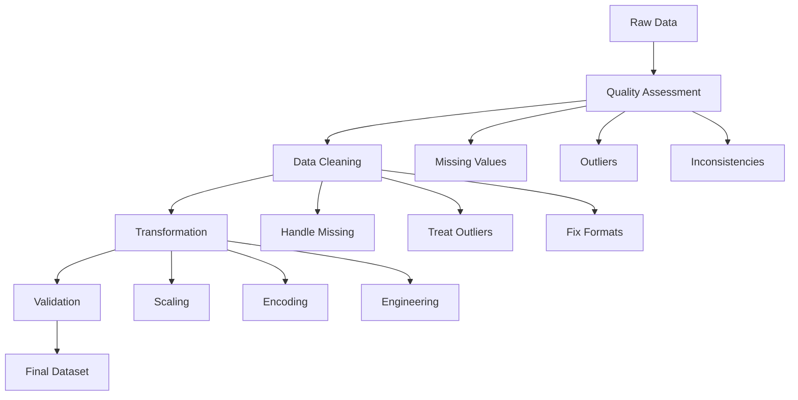

# E-commerce Data Wrangling Project: From Raw Data to Actionable Insights

**After this lesson:** You deliver a cleaned, documented dataset (or notebook) that shows how you assessed quality, handled **missing values** and **outliers**, and validated results—aligned with the [wrangling lessons](README.md).

## Helpful video

Pandas DataFrames in a quick walkthrough—useful for cleaning and wrangling.

<iframe width="560" height="315" src="https://www.youtube.com/embed/m1_33jhhiLE" title="Learn PANDAS in 5 minutes" frameborder="0" allow="accelerometer; autoplay; clipboard-write; encrypted-media; gyroscope; picture-in-picture" allowfullscreen></iframe>

## Overview

**Prerequisites:** Complete [data quality](data-quality.md), [missing values](missing-values.md), and [transformations](transformations.md) (or equivalent experience). Same Python stack as the [module README](README.md).

> **Time needed:** Often 6–12 hours including documentation.

## Why this matters

This project is the wrangling capstone: you show **judgment** (what to impute, cap, or flag) and **traceability** (what changed between raw exports and analysis-ready tables), not only that you can call pandas functions.

## Business Context

As a data scientist at "GlobalMart", you face a critical challenge: the company's raw data needs significant cleaning and preparation before it can be used for advanced analytics. This project will guide you through the complete data wrangling process, from initial assessment to final validation.

### Business Objectives

1. **Customer Segmentation**: Identify distinct customer groups for targeted marketing
2. **Pricing Optimization**: Analyze price elasticity and optimize pricing strategies
3. **Recommendation System**: Build a robust product recommendation engine
4. **Churn Prediction**: Develop early warning system for customer churn

## Project Workflow



## Dataset Description

### Data Schema

<div class="code-explainer" data-code-explainer>
<div class="code-explainer__code">


-- Customer Information
CREATE TABLE customers (
    customer_id INT PRIMARY KEY,
    registration_date DATE,
    country VARCHAR(50),
    age INT,
    gender VARCHAR(10),
    email VARCHAR(100),
    last_login_date TIMESTAMP
);

-- Transaction Records
CREATE TABLE transactions (
    transaction_id INT PRIMARY KEY,
    customer_id INT REFERENCES customers(customer_id),
    product_id INT REFERENCES products(product_id),
    timestamp TIMESTAMP,
    amount DECIMAL(10,2),
    payment_method VARCHAR(50),
    device_type VARCHAR(50)
);

-- Product Catalog
CREATE TABLE products (
    product_id INT PRIMARY KEY,
    category VARCHAR(50),
    price DECIMAL(10,2),
    brand VARCHAR(50),
    description TEXT,
    stock_level INT,
    supplier_id INT
);

</div>
<aside class="code-explainer__callouts" aria-label="Code walkthrough">
  <div class="code-callout" data-lines="1-10" data-tint="1">
    <div class="code-callout__meta">
      <span class="code-callout__lines"></span>
      <span class="code-callout__title">Customer Information</span>
    </div>
    <div class="code-callout__body">
      <p><strong>Customer Information</strong> — lines 1-10 in the highlighted code. Identify what this band does: DDL (table/column definitions), row changes (<code>INSERT</code>/<code>UPDATE</code>/<code>DELETE</code>), or a <code>SELECT</code> pipeline—then read joins and predicates in snippet order.</p>
    </div>
  </div>
  <div class="code-callout" data-lines="11-21" data-tint="2">
    <div class="code-callout__meta">
      <span class="code-callout__lines"></span>
      <span class="code-callout__title">Transaction Records</span>
    </div>
    <div class="code-callout__body">
      <p><strong>Transaction Records</strong> — lines 11-21 in the highlighted code. Identify what this band does: DDL (table/column definitions), row changes (<code>INSERT</code>/<code>UPDATE</code>/<code>DELETE</code>), or a <code>SELECT</code> pipeline—then read joins and predicates in snippet order.</p>
    </div>
  </div>
  <div class="code-callout" data-lines="22-32" data-tint="3">
    <div class="code-callout__meta">
      <span class="code-callout__lines"></span>
      <span class="code-callout__title">Product Catalog</span>
    </div>
    <div class="code-callout__body">
      <p><strong>Product Catalog</strong> — lines 22-32 in the highlighted code. Identify what this band does: DDL (table/column definitions), row changes (<code>INSERT</code>/<code>UPDATE</code>/<code>DELETE</code>), or a <code>SELECT</code> pipeline—then read joins and predicates in snippet order.</p>
    </div>
  </div>
</aside>
</div>

## Implementation Guide

### 1. Data Quality Assessment (20%)

<div class="code-explainer" data-code-explainer>
<div class="code-explainer__code">


def assess_data_quality(df):
    """Comprehensive data quality assessment"""
    
    quality_report = {
        'completeness': {},
        'validity': {},
        'consistency': {},
        'uniqueness': {}
    }
    
    # Completeness check
    quality_report['completeness'] = {
        'missing_values': df.isnull().sum(),
        'missing_percentage': (df.isnull().sum() / len(df)) * 100
    }
    
    # Validity check
    numeric_cols = df.select_dtypes(include=[np.number]).columns
    quality_report['validity']['numeric_ranges'] = {
        col: {'min': df[col].min(), 'max': df[col].max()}
        for col in numeric_cols
    }
    
    # Consistency check
    if 'registration_date' in df.columns and 'last_login_date' in df.columns:
        quality_report['consistency']['date_order'] = (
            df['last_login_date'] >= df['registration_date']
        ).mean()
    
    # Uniqueness check
    quality_report['uniqueness'] = {
        col: df[col].nunique() / len(df)
        for col in df.columns
    }
    
    return quality_report



</div>
<aside class="code-explainer__callouts" aria-label="Code walkthrough">
  <div class="code-callout" data-lines="1-12" data-tint="1">
    <div class="code-callout__meta">
      <span class="code-callout__lines"></span>
      <span class="code-callout__title">Def assess_data_quality(df):</span>
    </div>
    <div class="code-callout__body">
      <p><strong>Def assess_data_quality(df):</strong> — lines 1-12. Walk this block top to bottom: imports, inputs, then the transformation or plot that uses them.</p>
    </div>
  </div>
  <div class="code-callout" data-lines="13-24" data-tint="2">
    <div class="code-callout__meta">
      <span class="code-callout__lines"></span>
      <span class="code-callout__title">&#x27;missing_values&#x27;: df.isnull().sum(),</span>
    </div>
    <div class="code-callout__body">
      <p><strong>&#x27;missing_values&#x27;: df.isnull().sum(),</strong> — lines 13-24. Aggregation collapses rows after <code>FROM</code>/<code>WHERE</code>; <code>GROUP BY</code> defines one output row per group, and <code>HAVING</code> filters those groups.</p>
    </div>
  </div>
  <div class="code-callout" data-lines="25-36" data-tint="3">
    <div class="code-callout__meta">
      <span class="code-callout__lines"></span>
      <span class="code-callout__title">If &#x27;registration_date&#x27; in df.columns and &#x27;las…</span>
    </div>
    <div class="code-callout__body">
      <p><strong>If &#x27;registration_date&#x27; in df.columns and &#x27;las…</strong> — lines 25-36 in the highlighted code. Identify what this band does: DDL (table/column definitions), row changes (<code>INSERT</code>/<code>UPDATE</code>/<code>DELETE</code>), or a <code>SELECT</code> pipeline—then read joins and predicates in snippet order.</p>
    </div>
  </div>
</aside>
</div>

### 2. Data Cleaning Implementation (30%)

<div class="code-explainer" data-code-explainer>
<div class="code-explainer__code">


class DataCleaner:
    """Data cleaning pipeline for e-commerce data"""
    
    def __init__(self, config=None):
        self.config = config or {
            'age_range': (13, 100),
            'price_range': (0, 10000),
            'outlier_threshold': 3
        }
    
    def clean_customer_data(self, customers_df):
        """Clean customer dataset"""
        df = customers_df.copy()
        
        # Handle missing values
        df['age'] = df['age'].fillna(df['age'].median())
        df['country'] = df['country'].fillna(df['country'].mode()[0])
        
        # Fix data types
        df['registration_date'] = pd.to_datetime(df['registration_date'])
        
        # Validate age range
        df.loc[~df['age'].between(*self.config['age_range']), 'age'] = np.nan
        
        # Standardize country codes
        df['country'] = df['country'].str.upper()
        
        return df
    
    def clean_transaction_data(self, transactions_df):
        """Clean transaction dataset"""
        df = transactions_df.copy()
        
        # Remove duplicate transactions
        df = df.drop_duplicates(subset=['customer_id', 'timestamp', 'amount'])
        
        # Handle outliers in amount
        z_scores = np.abs(stats.zscore(df['amount']))
        df.loc[z_scores > self.config['outlier_threshold'], 'amount'] = np.nan
        
        # Standardize payment methods
        df['payment_method'] = df['payment_method'].str.lower()
        
        return df



</div>
<aside class="code-explainer__callouts" aria-label="Code walkthrough">
  <div class="code-callout" data-lines="1-14" data-tint="1">
    <div class="code-callout__meta">
      <span class="code-callout__lines"></span>
      <span class="code-callout__title">Class DataCleaner:</span>
    </div>
    <div class="code-callout__body">
      <p><strong>Class DataCleaner:</strong> — lines 1-14 in the highlighted code. Identify what this band does: DDL (table/column definitions), row changes (<code>INSERT</code>/<code>UPDATE</code>/<code>DELETE</code>), or a <code>SELECT</code> pipeline—then read joins and predicates in snippet order.</p>
    </div>
  </div>
  <div class="code-callout" data-lines="15-29" data-tint="2">
    <div class="code-callout__meta">
      <span class="code-callout__lines"></span>
      <span class="code-callout__title">Handle missing values</span>
    </div>
    <div class="code-callout__body">
      <p><strong>Handle missing values</strong> — lines 15-29 in the highlighted code. Identify what this band does: DDL (table/column definitions), row changes (<code>INSERT</code>/<code>UPDATE</code>/<code>DELETE</code>), or a <code>SELECT</code> pipeline—then read joins and predicates in snippet order.</p>
    </div>
  </div>
  <div class="code-callout" data-lines="30-44" data-tint="3">
    <div class="code-callout__meta">
      <span class="code-callout__lines"></span>
      <span class="code-callout__title">Def clean_transaction_data(self, transactions…</span>
    </div>
    <div class="code-callout__body">
      <p><strong>Def clean_transaction_data(self, transactions…</strong> — lines 30-44. Walk this block top to bottom: imports, inputs, then the transformation or plot that uses them.</p>
    </div>
  </div>
</aside>
</div>

### 3. Feature Engineering (30%)

<div class="code-explainer" data-code-explainer>
<div class="code-explainer__code">


class FeatureEngineer:
    """Feature engineering for e-commerce data"""
    
    def create_customer_features(self, customers_df, transactions_df):
        """Create customer-level features"""
        
        # Customer lifetime value
        clv = transactions_df.groupby('customer_id')['amount'].sum()
        
        # Purchase frequency
        purchase_freq = transactions_df.groupby('customer_id').size()
        
        # Average order value
        avg_order = transactions_df.groupby('customer_id')['amount'].mean()
        
        # Days since last purchase
        last_purchase = transactions_df.groupby('customer_id')['timestamp'].max()
        days_since = (pd.Timestamp.now() - last_purchase).dt.days
        
        # Combine features
        features = pd.DataFrame({
            'customer_lifetime_value': clv,
            'purchase_frequency': purchase_freq,
            'average_order_value': avg_order,
            'days_since_last_purchase': days_since
        })
        
        return features
    
    def create_product_features(self, products_df, transactions_df):
        """Create product-level features"""
        
        # Sales velocity
        sales_velocity = transactions_df.groupby('product_id').size()
        
        # Price elasticity
        def calculate_elasticity(group):
            price_pct_change = group['price'].pct_change()
            demand_pct_change = group['quantity'].pct_change()
            return (demand_pct_change / price_pct_change).mean()
        
        elasticity = transactions_df.groupby('product_id').apply(calculate_elasticity)
        
        # Combine features
        features = pd.DataFrame({
            'sales_velocity': sales_velocity,
            'price_elasticity': elasticity
        })
        
        return features

</div>
<aside class="code-explainer__callouts" aria-label="Code walkthrough">
  <div class="code-callout" data-lines="1-12" data-tint="1">
    <div class="code-callout__meta">
      <span class="code-callout__lines"></span>
      <span class="code-callout__title">Class FeatureEngineer:</span>
    </div>
    <div class="code-callout__body">
      <p><strong>Class FeatureEngineer:</strong> — lines 1-12 in the highlighted code. Identify what this band does: DDL (table/column definitions), row changes (<code>INSERT</code>/<code>UPDATE</code>/<code>DELETE</code>), or a <code>SELECT</code> pipeline—then read joins and predicates in snippet order.</p>
    </div>
  </div>
  <div class="code-callout" data-lines="13-25" data-tint="2">
    <div class="code-callout__meta">
      <span class="code-callout__lines"></span>
      <span class="code-callout__title">Average order value</span>
    </div>
    <div class="code-callout__body">
      <p><strong>Average order value</strong> — lines 13-25 in the highlighted code. Identify what this band does: DDL (table/column definitions), row changes (<code>INSERT</code>/<code>UPDATE</code>/<code>DELETE</code>), or a <code>SELECT</code> pipeline—then read joins and predicates in snippet order.</p>
    </div>
  </div>
  <div class="code-callout" data-lines="26-37" data-tint="3">
    <div class="code-callout__meta">
      <span class="code-callout__lines"></span>
      <span class="code-callout__title">})</span>
    </div>
    <div class="code-callout__body">
      <p><strong>})</strong> — lines 26-37 in the highlighted code. Identify what this band does: DDL (table/column definitions), row changes (<code>INSERT</code>/<code>UPDATE</code>/<code>DELETE</code>), or a <code>SELECT</code> pipeline—then read joins and predicates in snippet order.</p>
    </div>
  </div>
  <div class="code-callout" data-lines="38-50" data-tint="4">
    <div class="code-callout__meta">
      <span class="code-callout__lines"></span>
      <span class="code-callout__title">Price_pct_change = group[&#x27;price&#x27;].pct_change()</span>
    </div>
    <div class="code-callout__body">
      <p><strong>Price_pct_change = group[&#x27;price&#x27;].pct_change()</strong> — lines 38-50. Aggregation collapses rows after <code>FROM</code>/<code>WHERE</code>; <code>GROUP BY</code> defines one output row per group, and <code>HAVING</code> filters those groups.</p>
    </div>
  </div>
</aside>
</div>

### 4. Data Validation (20%)

<div class="code-explainer" data-code-explainer>
<div class="code-explainer__code">


def validate_final_dataset(df, validation_rules):
    """Validate the final dataset"""
    
    validation_results = {
        'completeness': {},
        'consistency': {},
        'statistical_validity': {}
    }
    
    # Check completeness
    missing_values = df.isnull().sum()
    validation_results['completeness'] = {
        'missing_values': missing_values,
        'missing_percentage': (missing_values / len(df)) * 100
    }
    
    # Check consistency
    for rule_name, rule_func in validation_rules['consistency'].items():
        validation_results['consistency'][rule_name] = rule_func(df)
    
    # Statistical validation
    numeric_cols = df.select_dtypes(include=[np.number]).columns
    validation_results['statistical_validity'] = {
        col: {
            'mean': df[col].mean(),
            'std': df[col].std(),
            'skew': df[col].skew(),
            'kurtosis': df[col].kurtosis()
        }
        for col in numeric_cols
    }
    
    return validation_results

</div>
<aside class="code-explainer__callouts" aria-label="Code walkthrough">
  <div class="code-callout" data-lines="1-11" data-tint="1">
    <div class="code-callout__meta">
      <span class="code-callout__lines"></span>
      <span class="code-callout__title">Def validate_final_dataset(df, validation_rul…</span>
    </div>
    <div class="code-callout__body">
      <p><strong>Def validate_final_dataset(df, validation_rul…</strong> — lines 1-11. Walk this block top to bottom: imports, inputs, then the transformation or plot that uses them.</p>
    </div>
  </div>
  <div class="code-callout" data-lines="12-22" data-tint="2">
    <div class="code-callout__meta">
      <span class="code-callout__lines"></span>
      <span class="code-callout__title">Validation_results[&#x27;completeness&#x27;] = {</span>
    </div>
    <div class="code-callout__body">
      <p><strong>Validation_results[&#x27;completeness&#x27;] = {</strong> — lines 12-22 in the highlighted code. Identify what this band does: DDL (table/column definitions), row changes (<code>INSERT</code>/<code>UPDATE</code>/<code>DELETE</code>), or a <code>SELECT</code> pipeline—then read joins and predicates in snippet order.</p>
    </div>
  </div>
  <div class="code-callout" data-lines="23-33" data-tint="3">
    <div class="code-callout__meta">
      <span class="code-callout__lines"></span>
      <span class="code-callout__title">Validation_results[&#x27;statistical_validity&#x27;] = {</span>
    </div>
    <div class="code-callout__body">
      <p><strong>Validation_results[&#x27;statistical_validity&#x27;] = {</strong> — lines 23-33 in the highlighted code. Identify what this band does: DDL (table/column definitions), row changes (<code>INSERT</code>/<code>UPDATE</code>/<code>DELETE</code>), or a <code>SELECT</code> pipeline—then read joins and predicates in snippet order.</p>
    </div>
  </div>
</aside>
</div>

## Project Deliverables

### 1. Code Repository Structure

```
project/
├── data/
│   ├── raw/
│   │   ├── customers.csv
│   │   ├── transactions.csv
│   │   └── products.csv
│   └── processed/
│       └── final_dataset.csv
├── notebooks/
│   ├── 1_exploration.ipynb
│   ├── 2_cleaning.ipynb
│   └── 3_transformation.ipynb
├── src/
│   ├── data_quality.py
│   ├── cleaning.py
│   └── transformation.py
└── docs/
    ├── data_dictionary.md
    └── quality_report.md
```

### 2. Quality Report Template

```markdown
# Data Quality Report

## Executive Summary
- Key findings
- Critical issues
- Recommendations

## Detailed Analysis
1. Missing Data
   - Patterns identified
   - Treatment strategies
   - Impact assessment

2. Outliers
   - Detection methods
   - Treatment decisions
   - Business implications

3. Transformations
   - Techniques applied
   - Validation results
   - Performance metrics
```

## Best Practices

1. **Version Control**
   - Use Git for code versioning
   - Document all data transformations
   - Track data quality metrics

2. **Performance Optimization**
   - Use efficient data structures
   - Implement parallel processing
   - Optimize memory usage

3. **Documentation**
   - Maintain clear documentation
   - Create data dictionaries
   - Document assumptions and decisions

## Evaluation Criteria

1. **Code Quality (30%)**
   - Clean, well-organized code
   - Proper error handling
   - Efficient implementations

2. **Documentation (20%)**
   - Clear explanations
   - Comprehensive data dictionary
   - Well-documented decisions

3. **Results (50%)**
   - Data quality improvements
   - Feature engineering effectiveness
   - Validation metrics

Remember: "The quality of your data wrangling directly impacts the reliability of your analytics!"
