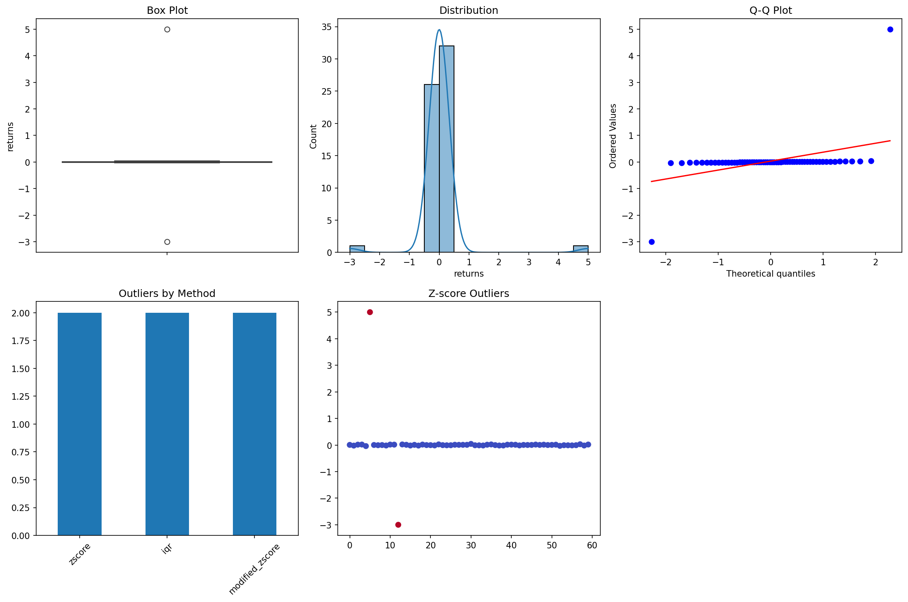
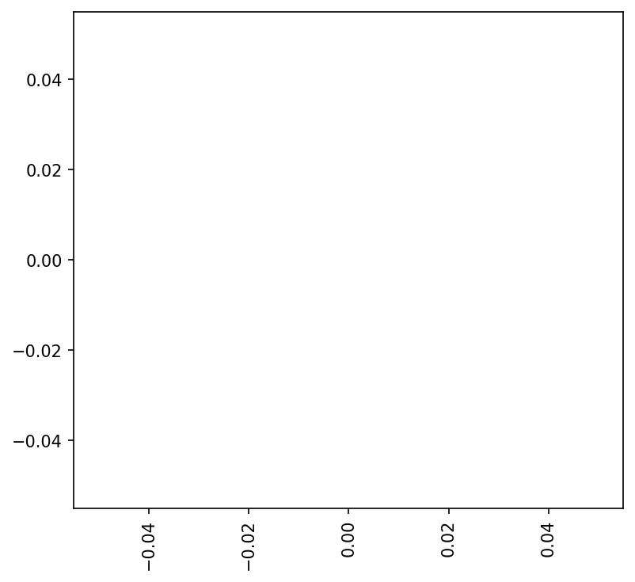
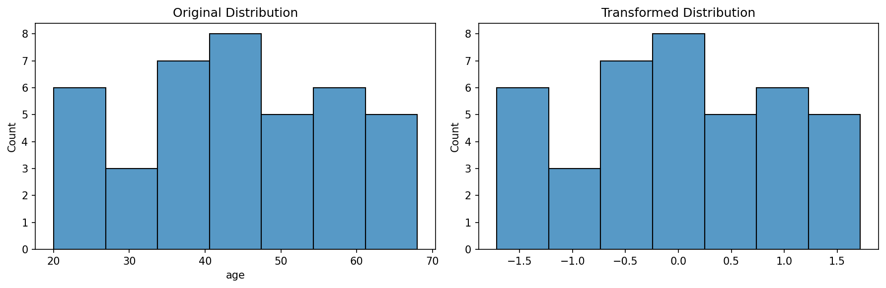
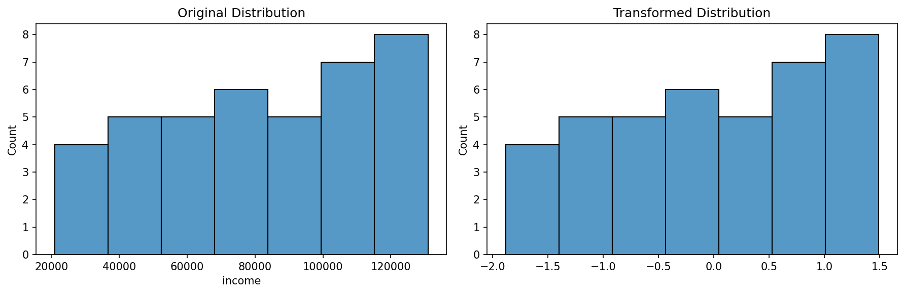
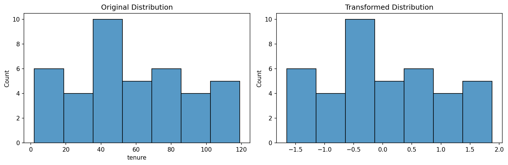

# Data Transformations: Shaping Data for Analysis

**After this lesson:** You can scale numeric features (**standard**, **min-max**), encode categoricals (**one-hot**, **label**), and apply common fixes (log, datetime features) with a clear reason for each choice.

## Helpful video

Pandas DataFrames in a quick walkthrough—useful for cleaning and wrangling.

<iframe width="560" height="315" src="https://www.youtube.com/embed/m1_33jhhiLE" title="Learn PANDAS in 5 minutes" frameborder="0" allow="accelerometer; autoplay; clipboard-write; encrypted-media; gyroscope; picture-in-picture" allowfullscreen></iframe>

## Overview

**Prerequisites:** [Missing values](missing-values.md) and [Outliers](outliers.md) (or equivalent cleaning). Familiarity with **scikit-learn**’s preprocessing module is useful; we cite it in examples.

> **Time needed:** About 60 minutes.

## Why this matters

Models and charts respond to **scale** and **representation**: distance-based algorithms care about units; trees often care less; linear models care about approximate linearity. Transformations align your features with those expectations—on purpose, not by habit.

Data transformation is a crucial step in the data preparation process: converting data from one format or structure into another. The sections below map common transforms to those goals.

## Understanding Data Transformations: A Strategic Framework

Data transformations serve multiple purposes:

1. **Normalization**
   - Purpose: Scale features to a common range
   - Use cases: Machine learning algorithms, distance-based methods
   - Examples: Min-max scaling, standardization

2. **Distribution Adjustment**
   - Purpose: Make data more normally distributed
   - Use cases: Statistical analysis, linear modeling
   - Examples: Log transformation, Box-Cox transformation

3. **Feature Engineering**
   - Purpose: Create new meaningful features
   - Use cases: Improve model performance, capture domain knowledge
   - Examples: Polynomial features, interaction terms

4. **Type Conversion**
   - Purpose: Convert data types for analysis
   - Use cases: Memory optimization, algorithm requirements
   - Examples: Categorical encoding, datetime parsing



## Mathematical Foundations

### 1. Scaling Transformations

- **Standard Scaling (Z-score)**

  <div class="code-explainer" data-code-explainer>
  <div class="code-explainer__code">
  
  
    z = (x - μ) / σ
    # Where:
    # x is the original value
    # μ is the mean
    # σ is the standard deviation
  
  </div>
  <aside class="code-explainer__callouts" aria-label="Code walkthrough">
    <div class="code-callout" data-lines="1-5" data-tint="1">
      <div class="code-callout__meta">
        <span class="code-callout__lines"></span>
        <span class="code-callout__title">Z-score formula</span>
      </div>
      <div class="code-callout__body">
        <p>Subtracts the column mean (μ) and divides by its standard deviation (σ), producing a value whose sign shows direction and magnitude shows how many standard deviations away.</p>
      </div>
    </div>
  </aside>
  </div>

- **Min-Max Scaling**

  <div class="code-explainer" data-code-explainer>
  <div class="code-explainer__code">
  
  
    x_scaled = (x - x_min) / (x_max - x_min)
    # Scales data to [0, 1] range
  
  </div>
  <aside class="code-explainer__callouts" aria-label="Code walkthrough">
    <div class="code-callout" data-lines="1-2" data-tint="1">
      <div class="code-callout__meta">
        <span class="code-callout__lines"></span>
        <span class="code-callout__title">Min-Max formula</span>
      </div>
      <div class="code-callout__body">
        <p>Shifts each value by the column minimum, then divides by the total range, compressing all values into [0, 1].</p>
      </div>
    </div>
  </aside>
  </div>

- **Robust Scaling**

  <div class="code-explainer" data-code-explainer>
  <div class="code-explainer__code">
  
  
    x_robust = (x - Q2) / (Q3 - Q1)
    # Where:
    # Q1 is 25th percentile
    # Q2 is median
    # Q3 is 75th percentile
  
  </div>
  <aside class="code-explainer__callouts" aria-label="Code walkthrough">
    <div class="code-callout" data-lines="1-5" data-tint="1">
      <div class="code-callout__meta">
        <span class="code-callout__lines"></span>
        <span class="code-callout__title">Robust scaling formula</span>
      </div>
      <div class="code-callout__body">
        <p>Centers on the median (Q2) and scales by the interquartile range (Q3 − Q1), making it insensitive to extreme outliers unlike standard or min-max scaling.</p>
      </div>
    </div>
  </aside>
  </div>

### 2. Distribution Transformations

- **Log Transform**

  <div class="code-explainer" data-code-explainer>
  <div class="code-explainer__code">
  
  
    x_log = log(x + c)  # c is a constant to handle zeros
  
  </div>
  <aside class="code-explainer__callouts" aria-label="Code walkthrough">
    <div class="code-callout" data-lines="1-1" data-tint="1">
      <div class="code-callout__meta">
        <span class="code-callout__lines"></span>
        <span class="code-callout__title">Log transform formula</span>
      </div>
      <div class="code-callout__body">
        <p>Adds a small constant <em>c</em> before taking the log to handle zero values; compresses right-skewed distributions toward a more normal shape.</p>
      </div>
    </div>
  </aside>
  </div>

- **Box-Cox Transform**

  <div class="code-explainer" data-code-explainer>
  <div class="code-explainer__code">
  
  
    x_boxcox = {
        (x^λ - 1) / λ  if λ ≠ 0
        log(x)         if λ = 0
    }
  
  </div>
  <aside class="code-explainer__callouts" aria-label="Code walkthrough">
    <div class="code-callout" data-lines="1-4" data-tint="1">
      <div class="code-callout__meta">
        <span class="code-callout__lines"></span>
        <span class="code-callout__title">Box-Cox transform formula</span>
      </div>
      <div class="code-callout__body">
        <p>A power transform parameterised by λ: when λ = 0 it reduces to a log; otherwise it applies a power law. Requires strictly positive data.</p>
      </div>
    </div>
  </aside>
  </div>

- **Yeo-Johnson Transform**

  <div class="code-explainer" data-code-explainer>
  <div class="code-explainer__code">
  
  
    # Handles negative values unlike Box-Cox
    x_yeojohnson = {
        ((x + 1)^λ - 1) / λ     if λ ≠ 0, x ≥ 0
        log(x + 1)              if λ = 0, x ≥ 0
        -((-x + 1)^(2-λ) - 1) / (2-λ)   if λ ≠ 2, x < 0
        -log(-x + 1)            if λ = 2, x < 0
    }
  
  </div>
  <aside class="code-explainer__callouts" aria-label="Code walkthrough">
    <div class="code-callout" data-lines="1-7" data-tint="1">
      <div class="code-callout__meta">
        <span class="code-callout__lines"></span>
        <span class="code-callout__title">Yeo-Johnson transform formula</span>
      </div>
      <div class="code-callout__body">
        <p>Extends Box-Cox to handle zero and negative values with separate piecewise cases for x ≥ 0 and x &lt; 0, making it applicable to any numeric column.</p>
      </div>
    </div>
  </aside>
  </div>

## Advanced Transformation Techniques

### 1. Feature Scaling Pipeline

<div class="code-explainer" data-code-explainer>
<div class="code-explainer__code">


from sklearn.compose import ColumnTransformer
from sklearn.pipeline import Pipeline
from sklearn.preprocessing import StandardScaler, OneHotEncoder

def create_transformation_pipeline(numeric_features, categorical_features):
    """
    Create a comprehensive transformation pipeline
    
    Parameters:
    numeric_features (list): List of numeric column names
    categorical_features (list): List of categorical column names
    
    Returns:
    sklearn.Pipeline: Transformation pipeline
    """
    numeric_transformer = Pipeline(steps=[
        ('scaler', StandardScaler())
    ])
    
    categorical_transformer = Pipeline(steps=[
        ('onehot', OneHotEncoder(drop='first', sparse_output=False))
    ])
    
    preprocessor = ColumnTransformer(
        transformers=[
            ('num', numeric_transformer, numeric_features),
            ('cat', categorical_transformer, categorical_features)
        ])
    
    return Pipeline(steps=[('preprocessor', preprocessor)])






</div>
<aside class="code-explainer__callouts" aria-label="Code walkthrough">
  <div class="code-callout" data-lines="1-15" data-tint="1">
    <div class="code-callout__meta">
      <span class="code-callout__lines"></span>
      <span class="code-callout__title">Imports and function signature</span>
    </div>
    <div class="code-callout__body">
      <p>Imports three sklearn components and defines the function, documenting that it accepts lists of numeric and categorical column names and returns a fitted Pipeline.</p>
    </div>
  </div>
  <div class="code-callout" data-lines="16-30" data-tint="2">
    <div class="code-callout__meta">
      <span class="code-callout__lines"></span>
      <span class="code-callout__title">Build and combine sub-pipelines</span>
    </div>
    <div class="code-callout__body">
      <p>Creates a StandardScaler pipeline for numeric features and a OneHotEncoder pipeline for categoricals, joins them in a ColumnTransformer, and wraps the result in a final Pipeline.</p>
    </div>
  </div>
</aside>
</div>

### 2. Advanced Distribution Transformer

<div class="code-explainer" data-code-explainer>
<div class="code-explainer__code">


class DistributionTransformer:
    """Transform data to follow specific distributions"""
    
    def __init__(self, method='box-cox', target_distribution='normal'):
        self.method = method
        self.target_distribution = target_distribution
        self.transformer = None
        self.lambda_ = None
    
    def fit_transform(self, data):
        """
        Fit and transform the data
        
        Parameters:
        data (array-like): Input data
        
        Returns:
        array: Transformed data
        """
        if self.method == 'box-cox':
            transformed_data, self.lambda_ = stats.boxcox(data)
        elif self.method == 'yeo-johnson':
            pt = PowerTransformer(method='yeo-johnson')
            transformed_data = pt.fit_transform(data.reshape(-1, 1))
            self.transformer = pt
        elif self.method == 'quantile':
            qt = QuantileTransformer(
                output_distribution=self.target_distribution,
                n_quantiles=1000
            )
            transformed_data = qt.fit_transform(data.reshape(-1, 1))
            self.transformer = qt
        
        return transformed_data
    
    def inverse_transform(self, transformed_data):
        """
        Inverse transform the data back to original scale
        
        Parameters:
        transformed_data (array-like): Transformed data
        
        Returns:
        array: Original scale data
        """
        if self.method == 'box-cox':
            return special.inv_boxcox(transformed_data, self.lambda_)
        elif self.method in ['yeo-johnson', 'quantile']:
            return self.transformer.inverse_transform(transformed_data)

</div>
<aside class="code-explainer__callouts" aria-label="Code walkthrough">
  <div class="code-callout" data-lines="1-8" data-tint="1">
    <div class="code-callout__meta">
      <span class="code-callout__lines"></span>
      <span class="code-callout__title">Class definition and __init__</span>
    </div>
    <div class="code-callout__body">
      <p>Stores the transform <code>method</code> (box-cox, yeo-johnson, or quantile) and <code>target_distribution</code>, initializing placeholders for the fitted transformer and lambda parameter.</p>
    </div>
  </div>
  <div class="code-callout" data-lines="10-19" data-tint="2">
    <div class="code-callout__meta">
      <span class="code-callout__lines"></span>
      <span class="code-callout__title">fit_transform: signature and docstring</span>
    </div>
    <div class="code-callout__body">
      <p>Defines the method and documents that it accepts array-like data and returns a transformed array.</p>
    </div>
  </div>
  <div class="code-callout" data-lines="20-34" data-tint="3">
    <div class="code-callout__meta">
      <span class="code-callout__lines"></span>
      <span class="code-callout__title">Three transform branches</span>
    </div>
    <div class="code-callout__body">
      <p>Dispatches to Box-Cox (stores λ), Yeo-Johnson via <code>PowerTransformer</code>, or quantile normalisation via <code>QuantileTransformer</code>—storing the fitted object for later inverse-transform.</p>
    </div>
  </div>
  <div class="code-callout" data-lines="36-49" data-tint="4">
    <div class="code-callout__meta">
      <span class="code-callout__lines"></span>
      <span class="code-callout__title">inverse_transform</span>
    </div>
    <div class="code-callout__body">
      <p>Reverses the transform: uses scipy's <code>inv_boxcox</code> with the stored λ for Box-Cox, or delegates to the stored sklearn transformer's <code>inverse_transform</code> for the other methods.</p>
    </div>
  </div>
</aside>
</div>

### 3. Time Feature Engineering

<div class="code-explainer" data-code-explainer>
<div class="code-explainer__code">


def engineer_time_features(df, datetime_column):
    """
    Create comprehensive time-based features
    
    Parameters:
    df (pandas.DataFrame): Input dataframe
    datetime_column (str): Name of datetime column
    
    Returns:
    pandas.DataFrame: DataFrame with engineered features
    """
    dt = pd.to_datetime(df[datetime_column])
    
    # Basic components
    time_features = pd.DataFrame({
        'year': dt.dt.year,
        'month': dt.dt.month,
        'day': dt.dt.day,
        'hour': dt.dt.hour,
        'dayofweek': dt.dt.dayofweek,
        'quarter': dt.dt.quarter
    })
    
    # Cyclical features
    time_features['month_sin'] = np.sin(2 * np.pi * dt.dt.month / 12)
    time_features['month_cos'] = np.cos(2 * np.pi * dt.dt.month / 12)
    time_features['hour_sin'] = np.sin(2 * np.pi * dt.dt.hour / 24)
    time_features['hour_cos'] = np.cos(2 * np.pi * dt.dt.hour / 24)
    
    # Business logic features
    time_features['is_weekend'] = dt.dt.dayofweek >= 5
    time_features['is_business_hour'] = (dt.dt.hour >= 9) & (dt.dt.hour < 17)
    time_features['is_morning'] = dt.dt.hour < 12
    
    return time_features

</div>
<aside class="code-explainer__callouts" aria-label="Code walkthrough">
  <div class="code-callout" data-lines="1-11" data-tint="1">
    <div class="code-callout__meta">
      <span class="code-callout__lines"></span>
      <span class="code-callout__title">Function signature and docstring</span>
    </div>
    <div class="code-callout__body">
      <p>Defines the function and documents its inputs (DataFrame + column name) and output (DataFrame of engineered time features).</p>
    </div>
  </div>
  <div class="code-callout" data-lines="12-22" data-tint="2">
    <div class="code-callout__meta">
      <span class="code-callout__lines"></span>
      <span class="code-callout__title">Basic datetime components</span>
    </div>
    <div class="code-callout__body">
      <p>Parses the column to datetime, then extracts year, month, day, hour, day-of-week, and quarter into a new DataFrame.</p>
    </div>
  </div>
  <div class="code-callout" data-lines="24-35" data-tint="3">
    <div class="code-callout__meta">
      <span class="code-callout__lines"></span>
      <span class="code-callout__title">Cyclical and business-logic features</span>
    </div>
    <div class="code-callout__body">
      <p>Adds sin/cos encodings for month and hour (so the model sees January and December as adjacent), plus boolean flags for weekend, business hour, and morning.</p>
    </div>
  </div>
</aside>
</div>

## Real-World Applications

### 1. E-commerce Data Transformation

<div class="code-explainer" data-code-explainer>
<div class="code-explainer__code">


def transform_ecommerce_data(df):
    """Transform e-commerce dataset for analysis"""
    
    # 1. Handle monetary values
    price_transformer = DistributionTransformer(method='box-cox')
    df['price_transformed'] = price_transformer.fit_transform(df['price'])
    
    # 2. Create time features
    time_features = engineer_time_features(df, 'order_date')
    
    # 3. Encode categories
    cat_encoder = OneHotEncoder(drop='first', sparse_output=False)
    encoded_categories = cat_encoder.fit_transform(
        df[['category', 'payment_method']]
    )
    
    # 4. Create interaction features
    df['price_per_unit'] = df['total_amount'] / df['quantity']
    df['items_per_order'] = df.groupby('order_id')['quantity'].transform('sum')
    
    return pd.concat([
        df,
        pd.DataFrame(encoded_categories, columns=cat_encoder.get_feature_names_out()),
        time_features
    ], axis=1)

</div>
<aside class="code-explainer__callouts" aria-label="Code walkthrough">
  <div class="code-callout" data-lines="1-9" data-tint="1">
    <div class="code-callout__meta">
      <span class="code-callout__lines"></span>
      <span class="code-callout__title">Monetary values and time features</span>
    </div>
    <div class="code-callout__body">
      <p>Applies a Box-Cox transform to <code>price</code> to reduce skew, then calls <code>engineer_time_features</code> to extract datetime components from <code>order_date</code>.</p>
    </div>
  </div>
  <div class="code-callout" data-lines="11-25" data-tint="2">
    <div class="code-callout__meta">
      <span class="code-callout__lines"></span>
      <span class="code-callout__title">Encode categories, add interaction features, and combine</span>
    </div>
    <div class="code-callout__body">
      <p>One-hot encodes category and payment method, creates price-per-unit and items-per-order interaction columns, then concatenates everything into a single DataFrame.</p>
    </div>
  </div>
</aside>
</div>

### 2. Financial Data Transformation

<div class="code-explainer" data-code-explainer>
<div class="code-explainer__code">


def transform_financial_data(df):
    """Transform financial time series data"""
    
    # 1. Calculate returns
    df['returns'] = df['price'].pct_change()
    
    # 2. Log transform for volatility
    df['log_returns'] = np.log1p(df['returns'])
    
    # 3. Rolling statistics
    windows = [5, 21, 63]  # 1 week, 1 month, 3 months
    for window in windows:
        df[f'rolling_mean_{window}'] = df['price'].rolling(window).mean()
        df[f'rolling_std_{window}'] = df['price'].rolling(window).std()
        df[f'rolling_zscore_{window}'] = (
            (df['price'] - df[f'rolling_mean_{window}']) / 
            df[f'rolling_std_{window}']
        )
    
    # 4. Technical indicators
    df['RSI'] = calculate_rsi(df['price'])
    df['MACD'] = calculate_macd(df['price'])
    
    return df

</div>
<aside class="code-explainer__callouts" aria-label="Code walkthrough">
  <div class="code-callout" data-lines="1-8" data-tint="1">
    <div class="code-callout__meta">
      <span class="code-callout__lines"></span>
      <span class="code-callout__title">Returns and log returns</span>
    </div>
    <div class="code-callout__body">
      <p>Computes percentage price changes (<code>returns</code>) and their log equivalent (<code>log_returns</code>), which is more normally distributed and additive across periods.</p>
    </div>
  </div>
  <div class="code-callout" data-lines="10-24" data-tint="2">
    <div class="code-callout__meta">
      <span class="code-callout__lines"></span>
      <span class="code-callout__title">Rolling statistics and technical indicators</span>
    </div>
    <div class="code-callout__body">
      <p>Generates rolling mean, std, and z-score for three window lengths (1 week, 1 month, 3 months), then appends RSI and MACD technical indicators before returning the enriched DataFrame.</p>
    </div>
  </div>
</aside>
</div>

## Best Practices and Common Pitfalls

### 1. Transformation Selection Guidelines

- Consider the data distribution
- Understand algorithm requirements
- Preserve important relationships
- Handle special cases (zeros, negatives)

### 2. Validation Framework

<div class="code-explainer" data-code-explainer>
<div class="code-explainer__code">


def validate_transformation(original, transformed):
    """
    Validate transformation results
    
    Parameters:
    original (array-like): Original data
    transformed (array-like): Transformed data
    
    Returns:
    dict: Validation metrics
    """
    validation = {
        'distribution_metrics': {
            'original_skew': stats.skew(original),
            'transformed_skew': stats.skew(transformed),
            'original_kurtosis': stats.kurtosis(original),
            'transformed_kurtosis': stats.kurtosis(transformed)
        },
        'normality_tests': {
            'original': stats.normaltest(original),
            'transformed': stats.normaltest(transformed)
        },
        'range_metrics': {
            'original_range': (np.min(original), np.max(original)),
            'transformed_range': (np.min(transformed), np.max(transformed))
        }
    }
    
    # Visualize comparison
    fig, (ax1, ax2) = plt.subplots(1, 2, figsize=(12, 4))
    
    sns.histplot(original, ax=ax1)
    ax1.set_title('Original Distribution')
    
    sns.histplot(transformed, ax=ax2)
    ax2.set_title('Transformed Distribution')
    
    plt.tight_layout()
    plt.show()
    
    return validation

</div>
<aside class="code-explainer__callouts" aria-label="Code walkthrough">
  <div class="code-callout" data-lines="1-11" data-tint="1">
    <div class="code-callout__meta">
      <span class="code-callout__lines"></span>
      <span class="code-callout__title">Function signature and docstring</span>
    </div>
    <div class="code-callout__body">
      <p>Defines the function, documents that it takes original and transformed arrays, and returns a metrics dictionary.</p>
    </div>
  </div>
  <div class="code-callout" data-lines="12-27" data-tint="2">
    <div class="code-callout__meta">
      <span class="code-callout__lines"></span>
      <span class="code-callout__title">Compute validation metrics</span>
    </div>
    <div class="code-callout__body">
      <p>Records skew and kurtosis before and after, runs normality tests on both, and captures min/max range to check for unexpected clipping or expansion.</p>
    </div>
  </div>
  <div class="code-callout" data-lines="29-41" data-tint="3">
    <div class="code-callout__meta">
      <span class="code-callout__lines"></span>
      <span class="code-callout__title">Side-by-side histogram comparison</span>
    </div>
    <div class="code-callout__body">
      <p>Plots the original and transformed distributions in two panels so you can visually confirm the transform had the intended effect before returning the metrics dict.</p>
    </div>
  </div>
</aside>
</div>

### 3. Performance Considerations

<div class="code-explainer" data-code-explainer>
<div class="code-explainer__code">


def optimize_transformation_pipeline(df, pipeline):
    """
    Optimize transformation pipeline performance
    
    Parameters:
    df (pandas.DataFrame): Input dataframe
    pipeline (sklearn.Pipeline): Transformation pipeline
    
    Returns:
    sklearn.Pipeline: Optimized pipeline
    """
    # Memory optimization
    df_optimized = df.copy()
    for col in df_optimized.columns:
        if df_optimized[col].dtype == 'float64':
            df_optimized[col] = pd.to_numeric(df_optimized[col], downcast='float')
        elif df_optimized[col].dtype == 'int64':
            df_optimized[col] = pd.to_numeric(df_optimized[col], downcast='integer')
    
    # Pipeline optimization
    pipeline.set_params(memory='cachedir')
    
    return pipeline.fit(df_optimized)

</div>
<aside class="code-explainer__callouts" aria-label="Code walkthrough">
  <div class="code-callout" data-lines="1-11" data-tint="1">
    <div class="code-callout__meta">
      <span class="code-callout__lines"></span>
      <span class="code-callout__title">Function signature and docstring</span>
    </div>
    <div class="code-callout__body">
      <p>Defines the function and documents that it accepts a DataFrame and an unfitted sklearn Pipeline, returning an optimised fitted Pipeline.</p>
    </div>
  </div>
  <div class="code-callout" data-lines="12-23" data-tint="2">
    <div class="code-callout__meta">
      <span class="code-callout__lines"></span>
      <span class="code-callout__title">Memory optimisation and pipeline caching</span>
    </div>
    <div class="code-callout__body">
      <p>Downcasts float64 and int64 columns to smaller types to cut memory usage, then enables sklearn Pipeline caching via <code>set_params(memory=...)</code> before fitting.</p>
    </div>
  </div>
</aside>
</div>

## Practice Exercise: Customer Data Transformation

Transform a customer dataset for churn prediction:

<div class="code-explainer" data-code-explainer>
<div class="code-explainer__code">


# Load data
df = pd.read_csv('../_data/customer_data.csv')

# 1. Analyze distributions
for col in df.select_dtypes(include=[np.number]):
    print(f"\nAnalyzing {col}:")
    print(stats.describe(df[col]))

# 2. Create transformation pipeline
numeric_features = ['age', 'income', 'tenure']
categorical_features = ['occupation', 'subscription_type']

pipeline = create_transformation_pipeline(
    numeric_features,
    categorical_features
)

# 3. Transform data
transformed_df = pipeline.fit_transform(df)

# 4. Validate results
for i, col in enumerate(numeric_features):
    validation = validate_transformation(
        df[col],
        transformed_df[:, i]
    )
    print(f"\nValidation results for {col}:")
    print(validation)








```

Analyzing customer_id:
DescribeResult(nobs=np.int64(40), minmax=(np.int64(1), np.int64(40)), mean=np.float64(20.5), variance=np.float64(136.66666666666666), skewness=np.float64(0.0), kurtosis=np.float64(-1.201500938086304))

Analyzing age:
DescribeResult(nobs=np.int64(40), minmax=(np.int64(20), np.int64(68)), mean=np.float64(43.975), variance=np.float64(200.28141025641025), skewness=np.float64(-0.012562191403870635), kurtosis=np.float64(-1.0821420745312342))

Analyzing income:
DescribeResult(nobs=np.int64(40), minmax=(np.float64(20957.09506763072), np.float64(130942.3995248616)), mean=np.float64(82334.25940723266), variance=np.float64(1090563668.5542665), skewness=np.float64(-0.2318415185752648), kurtosis=np.float64(-1.1567951739204037))

Analyzing tenure:
DescribeResult(nobs=np.int64(40), minmax=(np.int64(2), np.int64(119)), mean=np.float64(56.8), variance=np.float64(1124.5230769230768), skewness=np.float64(0.24466179126919488), kurtosis=np.float64(-0.9849466326562171))

Analyzing spending:
DescribeResult(nobs=np.int64(40), minmax=(np.float64(211.73896804551777), np.float64(4848.964249003847)), mean=np.float64(2495.191596246369), variance=np.float64(1996206.2350566147), skewness=np.float64(0.0032941507320504446), kurtosis=np.float64(-1.1741950054579988))

Validation results for age:
{'distribution_metrics': {'original_skew': np.float64(-0.012562191403870635), 'transformed_skew': np.float64(-0.012562191403870571), 'original_kurtosis': np.float64(-1.0821420745312342), 'transformed_kurtosis': np.float64(-1.0821420745312345)}, 'normality_tests': {'original': NormaltestResult(statistic=np.float64(5.303572081068238), pvalue=np.float64(0.07052513974965449)), 'transformed': NormaltestResult(statistic=np.float64(5.303572081068246), pvalue=np.float64(0.07052513974965421))}, 'range_metrics': {'original_range': (np.int64(20), np.int64(68)), 'transformed_range': (np.float64(-1.715678810762139), np.float64(1.7192568687616427))}}

Validation results for income:
{'distribution_metrics': {'original_skew': np.float64(-0.2318415185752648), 'transformed_skew': np.float64(-0.231841518575264), 'original_kurtosis': np.float64(-1.1567951739204037), 'transformed_kurtosis': np.float64(-1.1567951739204052)}, 'normality_tests': {'original': NormaltestResult(statistic=np.float64(7.540657486692158), pvalue=np.float64(0.023044486320313473)), 'transformed': NormaltestResult(statistic=np.float64(7.540657486692189), pvalue=np.float64(0.023044486320313112))}, 'range_metrics': {'original_range': (np.float64(20957.09506763072), np.float64(130942.3995248616)), 'transformed_range': (np.float64(-1.8822573400166058), np.float64(1.4906688750677477))}}

Validation results for tenure:
{'distribution_metrics': {'original_skew': np.float64(0.24466179126919488), 'transformed_skew': np.float64(0.24466179126919477), 'original_kurtosis': np.float64(-0.9849466326562171), 'transformed_kurtosis': np.float64(-0.9849466326562166)}, 'normality_tests': {'original': NormaltestResult(statistic=np.float64(4.092861552058872), pvalue=np.float64(0.129195208268122)), 'transformed': NormaltestResult(statistic=np.float64(4.092861552058864), pvalue=np.float64(0.1291952082681225))}, 'range_metrics': {'original_range': (np.int64(2), np.int64(119)), 'transformed_range': (np.float64(-1.6549850099914483), np.float64(1.8784683872530672))}}
```

</div>
<aside class="code-explainer__callouts" aria-label="Code walkthrough">
  <div class="code-callout" data-lines="1-7" data-tint="1">
    <div class="code-callout__meta">
      <span class="code-callout__lines"></span>
      <span class="code-callout__title">Load data and inspect distributions</span>
    </div>
    <div class="code-callout__body">
      <p>Reads the customer CSV and prints scipy's describe output for every numeric column so you can assess skew and kurtosis before choosing transforms.</p>
    </div>
  </div>
  <div class="code-callout" data-lines="9-28" data-tint="2">
    <div class="code-callout__meta">
      <span class="code-callout__lines"></span>
      <span class="code-callout__title">Build pipeline, transform, and validate</span>
    </div>
    <div class="code-callout__body">
      <p>Creates the feature lists, builds a transformation pipeline, fits and transforms the data, then validates each numeric feature by comparing original and scaled distributions.</p>
    </div>
  </div>
</aside>
</div>

Remember: "Choose transformations that enhance the signal in your data while preserving meaningful relationships!"

## Next steps

- [Wrangling project](project.md) — consolidate cleaning and transforms in one brief
- [Exploratory Data Analysis (Module 2.3)](../2.3-eda/README.md) — explore distributions after transforming
- [Data engineering (Module 2.4)](../2.4-data-engineering/README.md) — where transforms often run in pipelines
- [Module README](README.md)
