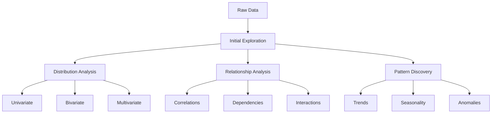
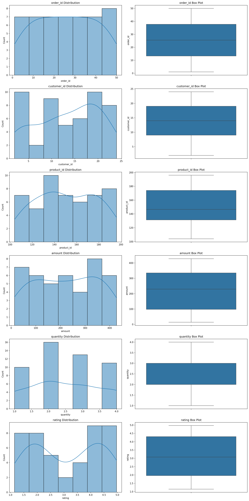
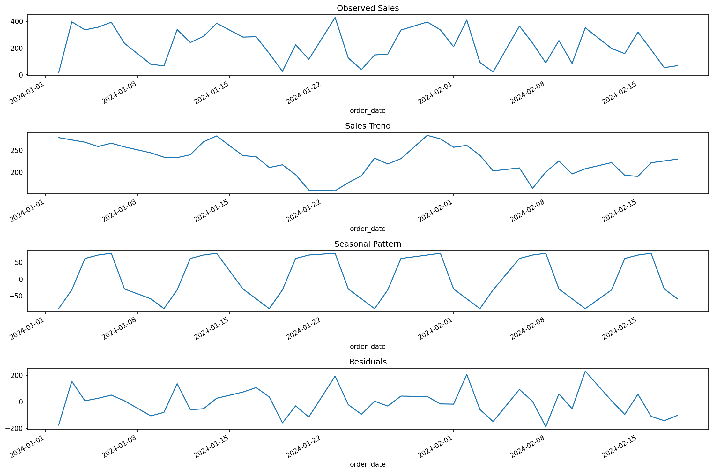

# Exploratory Data Analysis: From Data to Insights

**After this submodule:** Profile a dataset, plot distributions and relationships, and document findings before modeling—using a repeatable **EDA workflow** (see the mermaid diagram below).

## Overview

**Prerequisites:** [Data wrangling (Module 2.2)](../2.2-data-wrangling/README.md) and [Pandas](../../1-data-fundamentals/1.5-data-analysis-pandas/README.md). [Visualization basics](../../3-data-visualization/3.1-intro-data-viz/README.md) complement this unit.

> **Time needed:** Several hours across readings, the tutorial notebook, and practice.


## Lesson path (site order)

1. [Distributions](distributions.md)  
2. [Relationships](relationships.md)  
3. [Time series](time-series.md)  
4. [EDA project](project.md)  

## Why this matters

EDA is where you catch **skewed distributions**, **leaky features**, **wrong units**, and **silent missingness** before they become a pretty chart or a bad model. A short, repeatable EDA pass saves hours of debugging later and gives stakeholders confidence in your numbers.

Exploratory Data Analysis (EDA) is the crucial first step in any data analysis project. It is like being a detective: you investigate your data to uncover patterns, spot anomalies, test hypotheses, and check assumptions. Through EDA, you turn raw tables into questions you can answer with statistics or visualization.

### Video Tutorial: Exploratory Data Analysis

<div class="video-embed">
<iframe width="560" height="315" src="https://www.youtube.com/embed/xi0vhXFPegw" frameborder="0" allow="accelerometer; autoplay; clipboard-write; encrypted-media; gyroscope; picture-in-picture" allowfullscreen></iframe>
</div>

*Exploratory Data Analysis (EDA) Using Python - Edureka*

## The EDA Journey: A Systematic Approach

The journey of EDA is both an art and a science. Like a skilled explorer, you need to:

1. Start with broad questions about your data
2. Use visualizations and statistics to find answers
3. Let those answers lead to more specific questions
4. Iterate until you have a deep understanding of your dataset



## Comprehensive EDA Framework

### 1. Initial Data Exploration

<div class="code-explainer" data-code-explainer>
<div class="code-explainer__code">


import pandas as pd
import numpy as np
import matplotlib.pyplot as plt
import seaborn as sns
import plotly.express as px
from scipy import stats

class DataExplorer:
    """A comprehensive framework for exploratory data analysis.
    
    This class provides methods to systematically explore and understand your dataset
    through summary statistics, visualizations, and pattern detection.
    
    Key Features:
    - Automated data type detection
    - Comprehensive summary statistics
    - Missing data analysis
    - Correlation analysis
    - Distribution visualization
    - Relationship exploration
    """
    
    def __init__(self, df):
        self.df = df
        self.numeric_cols = df.select_dtypes(include=[np.number]).columns
        self.categorical_cols = df.select_dtypes(include=['object']).columns
        
    def generate_summary(self):
        """Generate a comprehensive data summary including statistics and data quality metrics.
        
        This method provides a complete overview of your dataset by analyzing:
        - Basic information (shape, data types, memory usage)
        - Numeric column statistics (mean, std, quartiles, etc.)
        - Categorical column summaries (unique values, frequencies)
        - Missing data patterns
        - Correlation structure
        
        Returns:
            dict: A dictionary containing various summary metrics and analyses
        """
        summary = {
            'basic_info': {
                'shape': self.df.shape,
                'dtypes': self.df.dtypes,
                'memory_usage': self.df.memory_usage().sum() / 1024**2
            },
            'numeric_summary': self.df[self.numeric_cols].describe(),
            'categorical_summary': self.df[self.categorical_cols].describe(),
            'missing_data': self.analyze_missing_data(),
            'correlations': self.analyze_correlations()
        }
        return summary
    
    def analyze_missing_data(self):
        """Analyze missing values"""
        missing = pd.DataFrame({
            'count': self.df.isnull().sum(),
            'percentage': (self.df.isnull().sum() / len(self.df)) * 100
        })
        return missing[missing['count'] > 0]
    
    def analyze_correlations(self):
        """Analyze correlations between numeric variables"""
        return self.df[self.numeric_cols].corr()
    
    def plot_distributions(self):
        """Plot distributions for all numeric variables"""
        n_cols = len(self.numeric_cols)
        fig, axes = plt.subplots(n_cols, 2, figsize=(15, 5*n_cols))
        
        for i, col in enumerate(self.numeric_cols):
            # Histogram
            sns.histplot(self.df[col], kde=True, ax=axes[i,0])
            axes[i,0].set_title(f'{col} Distribution')
            
            # Box plot
            sns.boxplot(y=self.df[col], ax=axes[i,1])
            axes[i,1].set_title(f'{col} Box Plot')
        
        plt.tight_layout()
        plt.show()
    
    def plot_relationships(self):
        """Plot relationships between variables"""
        # Correlation heatmap
        plt.figure(figsize=(10, 8))
        sns.heatmap(self.analyze_correlations(), annot=True, cmap='coolwarm')
        plt.title('Correlation Matrix')
        plt.show()
        
        # Scatter matrix
        if len(self.numeric_cols) > 1:
            pd.plotting.scatter_matrix(
                self.df[self.numeric_cols],
                figsize=(15, 15),
                diagonal='kde'
            )
            plt.show()
    
    def analyze_categorical(self):
        """Analyze categorical variables"""
        for col in self.categorical_cols:
            plt.figure(figsize=(10, 5))
            
            # Value counts
            counts = self.df[col].value_counts()
            sns.barplot(x=counts.index, y=counts.values)
            plt.title(f'{col} Value Counts')
            plt.xticks(rotation=45)
            plt.show()
            
            # Cross-tabulations with numeric variables
            for num_col in self.numeric_cols:
                plt.figure(figsize=(10, 5))
                sns.boxplot(x=col, y=num_col, data=self.df)
                plt.title(f'{num_col} by {col}')
                plt.xticks(rotation=45)
                plt.show()

</div>
<aside class="code-explainer__callouts" aria-label="Code walkthrough">
  <div class="code-callout" data-lines="1-6" data-tint="1">
    <div class="code-callout__meta">
      <span class="code-callout__lines"></span>
      <span class="code-callout__title">Imports</span>
    </div>
    <div class="code-callout__body">
      <p>Six standard imports: pandas and numpy for data, matplotlib and seaborn for static plots, plotly for interactive charts, and scipy for statistical tests.</p>
    </div>
  </div>
  <div class="code-callout" data-lines="8-27" data-tint="2">
    <div class="code-callout__meta">
      <span class="code-callout__lines"></span>
      <span class="code-callout__title">DataExplorer class definition</span>
    </div>
    <div class="code-callout__body">
      <p>The class docstring lists its six key features. <code>__init__</code> receives a DataFrame and immediately splits columns into <code>numeric_cols</code> and <code>categorical_cols</code> for later use.</p>
    </div>
  </div>
  <div class="code-callout" data-lines="28-53" data-tint="3">
    <div class="code-callout__meta">
      <span class="code-callout__lines"></span>
      <span class="code-callout__title">generate_summary</span>
    </div>
    <div class="code-callout__body">
      <p>Builds a dict with <code>basic_info</code> (shape, dtypes, memory), numeric and categorical <code>describe()</code> outputs, missing-data counts, and the correlation matrix—all in one call.</p>
    </div>
  </div>
  <div class="code-callout" data-lines="54-65" data-tint="4">
    <div class="code-callout__meta">
      <span class="code-callout__lines"></span>
      <span class="code-callout__title">analyze_missing_data and analyze_correlations</span>
    </div>
    <div class="code-callout__body">
      <p><code>analyze_missing_data</code> returns only columns that have at least one null. <code>analyze_correlations</code> calls <code>.corr()</code> on numeric columns and returns the full matrix.</p>
    </div>
  </div>
  <div class="code-callout" data-lines="66-82" data-tint="1">
    <div class="code-callout__meta">
      <span class="code-callout__lines"></span>
      <span class="code-callout__title">plot_distributions</span>
    </div>
    <div class="code-callout__body">
      <p>Loops over every numeric column, placing a histogram+KDE in the left subplot and a box plot in the right. <code>tight_layout</code> prevents label overlap before <code>plt.show()</code>.</p>
    </div>
  </div>
  <div class="code-callout" data-lines="83-118" data-tint="2">
    <div class="code-callout__meta">
      <span class="code-callout__lines"></span>
      <span class="code-callout__title">plot_relationships and analyze_categorical</span>
    </div>
    <div class="code-callout__body">
      <p><code>plot_relationships</code> draws a heatmap and an optional scatter matrix. <code>analyze_categorical</code> plots value counts for each categorical column and cross-tabulates against every numeric column via box plots.</p>
    </div>
  </div>
</aside>
</div>

### 2. Advanced Analysis Techniques

<div class="code-explainer" data-code-explainer>
<div class="code-explainer__code">


class AdvancedAnalyzer:
    """Advanced techniques for in-depth exploratory data analysis.
    
    This class implements sophisticated methods for:
    - Outlier detection using multiple methods
    - Distribution analysis with statistical tests
    - Time pattern analysis with decomposition
    - Advanced visualization techniques
    
    Perfect for when you need to dig deeper into your data's characteristics
    and uncover subtle patterns or anomalies.
    """
    
    def __init__(self, df):
        self.df = df
        
    def detect_outliers(self, column, method='zscore'):
        """Detect outliers using multiple methods"""
        if method == 'zscore':
            z_scores = np.abs(stats.zscore(self.df[column]))
            return z_scores > 3
        elif method == 'iqr':
            Q1 = self.df[column].quantile(0.25)
            Q3 = self.df[column].quantile(0.75)
            IQR = Q3 - Q1
            return (self.df[column] < (Q1 - 1.5 * IQR)) | (self.df[column] > (Q3 + 1.5 * IQR))
    
    def analyze_distributions(self, column):
        """Analyze distribution characteristics"""
        dist_stats = {
            'normality': {
                'shapiro': stats.shapiro(self.df[column]),
                'normaltest': stats.normaltest(self.df[column])
            },
            'moments': {
                'mean': np.mean(self.df[column]),
                'std': np.std(self.df[column]),
                'skew': stats.skew(self.df[column]),
                'kurtosis': stats.kurtosis(self.df[column])
            }
        }
        return dist_stats
    
    def analyze_time_patterns(self, date_column, value_column):
        """Analyze time-based patterns"""
        self.df[date_column] = pd.to_datetime(self.df[date_column])
        
        # Resample to different frequencies
        patterns = {
            'daily': self.df.resample('D', on=date_column)[value_column].mean(),
            'weekly': self.df.resample('W', on=date_column)[value_column].mean(),
            'monthly': self.df.resample('ME', on=date_column)[value_column].mean()
        }
        
        # Decompose time series
        from statsmodels.tsa.seasonal import seasonal_decompose
        decomposition = seasonal_decompose(
            patterns['daily'].dropna(),
            period=7,
            extrapolate_trend='freq'
        )
        
        return patterns, decomposition

</div>
<aside class="code-explainer__callouts" aria-label="Code walkthrough">
  <div class="code-callout" data-lines="1-16" data-tint="1">
    <div class="code-callout__meta">
      <span class="code-callout__lines"></span>
      <span class="code-callout__title">AdvancedAnalyzer class and constructor</span>
    </div>
    <div class="code-callout__body">
      <p>The class docstring names four capability areas. <code>__init__</code> simply stores the DataFrame; column splitting happens in each method as needed.</p>
    </div>
  </div>
  <div class="code-callout" data-lines="17-27" data-tint="2">
    <div class="code-callout__meta">
      <span class="code-callout__lines"></span>
      <span class="code-callout__title">detect_outliers</span>
    </div>
    <div class="code-callout__body">
      <p>Supports two strategies: <strong>z-score</strong> (flags rows more than 3 standard deviations from the mean) and <strong>IQR</strong> (flags rows outside 1.5×IQR below Q1 or above Q3).</p>
    </div>
  </div>
  <div class="code-callout" data-lines="28-43" data-tint="3">
    <div class="code-callout__meta">
      <span class="code-callout__lines"></span>
      <span class="code-callout__title">analyze_distributions</span>
    </div>
    <div class="code-callout__body">
      <p>Runs Shapiro–Wilk and D'Agostino normality tests, then computes the four distribution moments: mean, std, skewness, and excess kurtosis.</p>
    </div>
  </div>
  <div class="code-callout" data-lines="44-63" data-tint="4">
    <div class="code-callout__meta">
      <span class="code-callout__lines"></span>
      <span class="code-callout__title">analyze_time_patterns</span>
    </div>
    <div class="code-callout__body">
      <p>Resamples to daily, weekly, and monthly averages, then calls <code>seasonal_decompose</code> on the daily series (period=7, extrapolated trend) to separate trend, seasonality, and residuals.</p>
    </div>
  </div>
</aside>
</div>

## Real-World Case Study: E-commerce Analytics

<div class="code-explainer" data-code-explainer>
<div class="code-explainer__code">


# Load sample e-commerce data
df = pd.read_csv('../_data/ecommerce_data.csv')

# Initialize explorers
explorer = DataExplorer(df)
analyzer = AdvancedAnalyzer(df)

# 1. Basic Exploration
summary = explorer.generate_summary()
print("Data Summary:")
print(summary['basic_info'])

# 2. Distribution Analysis
explorer.plot_distributions()

# 3. Sales Analysis
sales_patterns, decomp = analyzer.analyze_time_patterns('order_date', 'amount')

# Visualize sales trends
plt.figure(figsize=(15, 10))

plt.subplot(411)
decomp.observed.plot()
plt.title('Observed Sales')

plt.subplot(412)
decomp.trend.plot()
plt.title('Sales Trend')

plt.subplot(413)
decomp.seasonal.plot()
plt.title('Seasonal Pattern')

plt.subplot(414)
decomp.resid.plot()
plt.title('Residuals')

plt.tight_layout()
plt.show()

# 4. Customer Segmentation
customer_segments = pd.DataFrame({
    'total_spent': df.groupby('customer_id')['amount'].sum(),
    'order_count': df.groupby('customer_id')['order_id'].count(),
    'avg_order_value': df.groupby('customer_id')['amount'].mean()
})

# Visualize customer segments
fig = px.scatter_3d(
    customer_segments.reset_index(),
    x='total_spent',
    y='order_count',
    z='avg_order_value',
    color='total_spent',
    title='Customer Segmentation'
)
fig.show()






```
Data Summary:
{'shape': (50, 8), 'dtypes': order_id         int64
customer_id      int64
product_id       int64
order_date         str
amount         float64
quantity       float64
category           str
rating         float64
dtype: object, 'memory_usage': np.float64(0.003177642822265625)}
```

</div>
<aside class="code-explainer__callouts" aria-label="Code walkthrough">
  <div class="code-callout" data-lines="1-7" data-tint="1">
    <div class="code-callout__meta">
      <span class="code-callout__lines"></span>
      <span class="code-callout__title">Setup</span>
    </div>
    <div class="code-callout__body">
      <p>Loads the CSV and initialises both explorer objects—<code>DataExplorer</code> for summaries and plots, <code>AdvancedAnalyzer</code> for outlier and time-pattern work.</p>
    </div>
  </div>
  <div class="code-callout" data-lines="8-15" data-tint="2">
    <div class="code-callout__meta">
      <span class="code-callout__lines"></span>
      <span class="code-callout__title">Basic exploration</span>
    </div>
    <div class="code-callout__body">
      <p>Calls <code>generate_summary()</code> and prints <code>basic_info</code>, then calls <code>plot_distributions()</code> to get a first visual read on the data.</p>
    </div>
  </div>
  <div class="code-callout" data-lines="16-40" data-tint="3">
    <div class="code-callout__meta">
      <span class="code-callout__lines"></span>
      <span class="code-callout__title">Sales decomposition plot</span>
    </div>
    <div class="code-callout__body">
      <p>Calls <code>analyze_time_patterns</code> on the order-date column, then creates a 4-subplot figure showing observed, trend, seasonal, and residual components using <code>plt.subplot(41x)</code> layout.</p>
    </div>
  </div>
  <div class="code-callout" data-lines="41-57" data-tint="4">
    <div class="code-callout__meta">
      <span class="code-callout__lines"></span>
      <span class="code-callout__title">Customer segmentation</span>
    </div>
    <div class="code-callout__body">
      <p>Aggregates per customer into total spend, order count, and average order value, then visualises in a 3-D interactive scatter coloured by <code>total_spent</code>.</p>
    </div>
  </div>
</aside>
</div>

## Performance Optimization Tips

When working with large datasets, performance optimization becomes crucial. Here are some battle-tested strategies to make your EDA more efficient:

### 1. Memory Management: Working Smart with Big Data

<div class="code-explainer" data-code-explainer>
<div class="code-explainer__code">


def optimize_dataframe(df):
    """Optimize DataFrame memory usage"""
    
    # Numeric optimization
    numerics = ['int16', 'int32', 'int64', 'float64']
    for col in df.select_dtypes(include=numerics).columns:
        col_min = df[col].min()
        col_max = df[col].max()
        
        # Integer optimization
        if str(df[col].dtype).startswith('int'):
            if col_min > np.iinfo(np.int8).min and col_max < np.iinfo(np.int8).max:
                df[col] = df[col].astype(np.int8)
            elif col_min > np.iinfo(np.int16).min and col_max < np.iinfo(np.int16).max:
                df[col] = df[col].astype(np.int16)
            elif col_min > np.iinfo(np.int32).min and col_max < np.iinfo(np.int32).max:
                df[col] = df[col].astype(np.int32)
        
        # Float optimization
        else:
            df[col] = pd.to_numeric(df[col], downcast='float')
    
    # Categorical optimization
    for col in df.select_dtypes(include=['object']).columns:
        if df[col].nunique() / len(df) < 0.5:  # If less than 50% unique values
            df[col] = df[col].astype('category')
    
    return df



</div>
<aside class="code-explainer__callouts" aria-label="Code walkthrough">
  <div class="code-callout" data-lines="1-18" data-tint="1">
    <div class="code-callout__meta">
      <span class="code-callout__lines"></span>
      <span class="code-callout__title">Integer downcast</span>
    </div>
    <div class="code-callout__body">
      <p>For each numeric column the function checks min/max against int8, int16, and int32 bounds, picking the smallest integer type that fits.</p>
    </div>
  </div>
  <div class="code-callout" data-lines="19-28" data-tint="2">
    <div class="code-callout__meta">
      <span class="code-callout__lines"></span>
      <span class="code-callout__title">Float downcast and categorical conversion</span>
    </div>
    <div class="code-callout__body">
      <p>Float columns are passed to <code>pd.to_numeric(downcast='float')</code>. Object columns with fewer than 50% unique values are converted to the memory-efficient <code>category</code> dtype.</p>
    </div>
  </div>
</aside>
</div>

### 2. Chunked Processing

<div class="code-explainer" data-code-explainer>
<div class="code-explainer__code">


def analyze_large_dataset(file_path, chunk_size=10000):
    """Process large datasets in chunks"""
    chunks = []
    
    # Process file in chunks
    for chunk in pd.read_csv(file_path, chunksize=chunk_size):
        # Optimize memory usage
        chunk = optimize_dataframe(chunk)
        
        # Process chunk
        chunk_stats = process_chunk(chunk)
        chunks.append(chunk_stats)
    
    # Combine results
    return pd.concat(chunks)

</div>
<aside class="code-explainer__callouts" aria-label="Code walkthrough">
  <div class="code-callout" data-lines="1-4" data-tint="1">
    <div class="code-callout__meta">
      <span class="code-callout__lines"></span>
      <span class="code-callout__title">Function signature and setup</span>
    </div>
    <div class="code-callout__body">
      <p>Opens an empty list to collect per-chunk results; the <code>chunksize</code> parameter controls how many rows are held in memory at once.</p>
    </div>
  </div>
  <div class="code-callout" data-lines="5-15" data-tint="2">
    <div class="code-callout__meta">
      <span class="code-callout__lines"></span>
      <span class="code-callout__title">Chunk loop and combine</span>
    </div>
    <div class="code-callout__body">
      <p>Each chunk is memory-optimised with <code>optimize_dataframe</code>, processed via <code>process_chunk</code>, and appended to the list. <code>pd.concat</code> merges all results at the end.</p>
    </div>
  </div>
</aside>
</div>

## Common Pitfalls and Solutions

Even experienced data scientists can fall into these common traps. Here's how to avoid them:

1. **Skewed Distributions: The Silent Analysis Killer**

   <div class="code-explainer" data-code-explainer>
   <div class="code-explainer__code">
   
   
# no-output
import pandas as pd
from scipy import stats

df = pd.read_csv('../_data/ecommerce_data.csv')
# Bad: Assuming normal distribution
mean = df['amount'].mean()
std = df['amount'].std()

# Good: Use robust statistics
median = df['amount'].median()
mad = stats.median_abs_deviation(df['amount'])
   
   </div>
   <aside class="code-explainer__callouts" aria-label="Code walkthrough">
     <div class="code-callout" data-lines="1-8" data-tint="1">
       <div class="code-callout__meta">
         <span class="code-callout__lines"></span>
         <span class="code-callout__title">Fragile approach: mean and std</span>
       </div>
       <div class="code-callout__body">
         <p>Using mean and std assumes a normal distribution. For right-skewed data (e.g. revenue) these statistics misrepresent the typical value.</p>
       </div>
     </div>
     <div class="code-callout" data-lines="9-12" data-tint="2">
       <div class="code-callout__meta">
         <span class="code-callout__lines"></span>
         <span class="code-callout__title">Robust approach: median and MAD</span>
       </div>
       <div class="code-callout__body">
         <p>Median and median absolute deviation (MAD) are resistant to outliers and make no normality assumption—prefer them for skewed distributions.</p>
       </div>
     </div>
   </aside>
   </div>

2. **Correlation vs Causation: Don't Jump to Conclusions**

   <div class="code-explainer" data-code-explainer>
   <div class="code-explainer__code">
   
   
      # Correlation analysis
      correlation = df['price'].corr(df['sales'])
      
      # Additional analysis needed
      # - Time series analysis
      # - A/B testing
      # - Control for confounding variables
   
   </div>
   <aside class="code-explainer__callouts" aria-label="Code walkthrough">
     <div class="code-callout" data-lines="1-2" data-tint="1">
       <div class="code-callout__meta">
         <span class="code-callout__lines"></span>
         <span class="code-callout__title">Pearson correlation</span>
       </div>
       <div class="code-callout__body">
         <p>A single correlation number tells you direction and strength, but not causation—confounding variables or reversed causality can produce the same value.</p>
       </div>
     </div>
     <div class="code-callout" data-lines="3-7" data-tint="2">
       <div class="code-callout__meta">
         <span class="code-callout__lines"></span>
         <span class="code-callout__title">Follow-up analyses needed</span>
       </div>
       <div class="code-callout__body">
         <p>The comment block lists three next steps—time-series analysis, A/B testing, and controlling for confounders—that must follow before any causal claim.</p>
       </div>
     </div>
   </aside>
   </div>

3. **Missing Data Impact: The Hidden Influence**

   <div class="code-explainer" data-code-explainer>
   <div class="code-explainer__code">
   
   
      # Bad: Drop all missing values
      df_clean = df.dropna()
      
      # Good: Analyze missing patterns
      missing_patterns = pd.DataFrame({
          'missing_count': df.isnull().sum(),
          'missing_pct': (df.isnull().sum() / len(df)) * 100,
          'missing_corr': df.isnull().corr()
      })
   
   </div>
   <aside class="code-explainer__callouts" aria-label="Code walkthrough">
     <div class="code-callout" data-lines="1-2" data-tint="1">
       <div class="code-callout__meta">
         <span class="code-callout__lines"></span>
         <span class="code-callout__title">Fragile approach: dropna</span>
       </div>
       <div class="code-callout__body">
         <p>Blindly dropping all rows with nulls can silently discard non-random missingness, biasing the remaining dataset.</p>
       </div>
     </div>
     <div class="code-callout" data-lines="3-9" data-tint="2">
       <div class="code-callout__meta">
         <span class="code-callout__lines"></span>
         <span class="code-callout__title">Better approach: profile missing patterns</span>
       </div>
       <div class="code-callout__body">
         <p>Building a DataFrame of missing count, percentage, and cross-column correlation reveals whether nulls are random (MAR) or systematic (MNAR) before deciding how to handle them.</p>
       </div>
     </div>
   </aside>
   </div>

## Interactive Visualization Tips: Making Your Data Come Alive

Static visualizations are good, but interactive ones can tell a more compelling story. Here's how to create engaging visualizations that help stakeholders explore and understand the data themselves:

<div class="code-explainer" data-code-explainer>
<div class="code-explainer__code">


def create_interactive_dashboard(df):
    """Create interactive visualizations with Plotly"""
    
    # Sales trends
    fig1 = px.line(
        df.resample('D', on='date')['amount'].sum(),
        title='Daily Sales Trend'
    )
    
    # Customer segments
    fig2 = px.scatter(
        df,
        x='recency',
        y='frequency',
        size='monetary',
        color='segment',
        title='RFM Analysis'
    )
    
    # Product analysis
    fig3 = px.treemap(
        df.groupby('category')['amount'].sum().reset_index(),
        path=['category'],
        values='amount',
        title='Sales by Category'
    )
    
    return [fig1, fig2, fig3]

</div>
<aside class="code-explainer__callouts" aria-label="Code walkthrough">
  <div class="code-callout" data-lines="1-18" data-tint="1">
    <div class="code-callout__meta">
      <span class="code-callout__lines"></span>
      <span class="code-callout__title">Sales trend and RFM scatter</span>
    </div>
    <div class="code-callout__body">
      <p><code>fig1</code> shows a daily sales line resampled from the raw data. <code>fig2</code> is an RFM scatter where bubble size encodes monetary value and colour encodes customer segment.</p>
    </div>
  </div>
  <div class="code-callout" data-lines="19-28" data-tint="2">
    <div class="code-callout__meta">
      <span class="code-callout__lines"></span>
      <span class="code-callout__title">Category treemap and return</span>
    </div>
    <div class="code-callout__body">
      <p><code>fig3</code> uses a treemap to show revenue share by product category—each tile area is proportional to total sales amount. The function returns all three figures for embedding in a notebook or app.</p>
    </div>
  </div>
</aside>
</div>

## Assignment

Ready to practice your EDA skills? Head over to the [Module 2 assignment (student version)](../_assignments/module-assignment-student.md) to apply what you have learned.

Remember: "EDA is not just about looking at data, it's about understanding the story it tells!"

Pro Tips:

- Always start with simple visualizations before moving to complex ones
- Let your business questions guide your exploration
- Document your findings and assumptions along the way
- Be prepared to iterate as you discover new patterns
- Share your insights in a way that non-technical stakeholders can understand

## Next steps (lesson path)

- [Understanding Distributions](distributions.md)
- [Analyzing Relationships](relationships.md)
- [Time Series Analysis](time-series.md)
- [EDA project](project.md)
