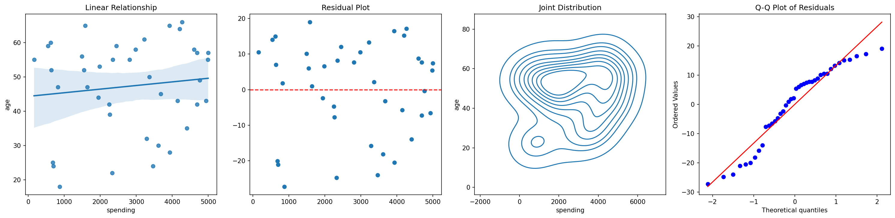
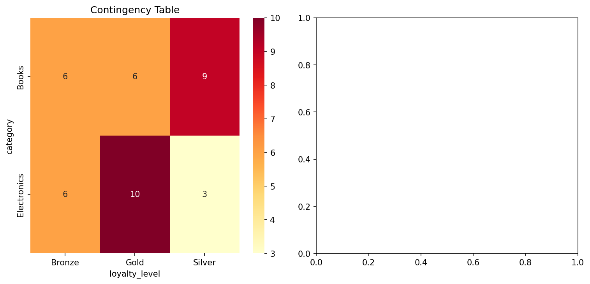
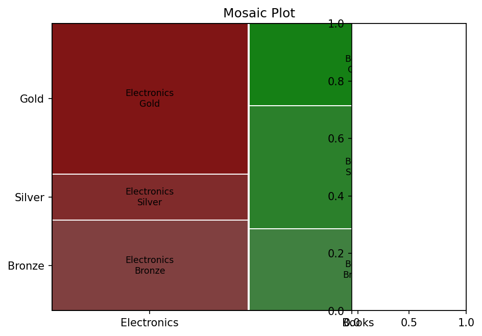
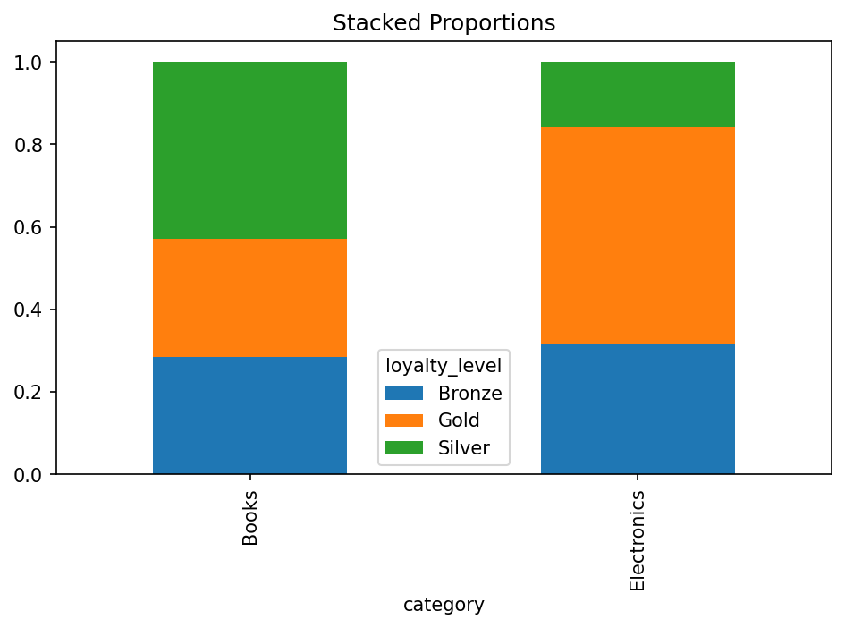
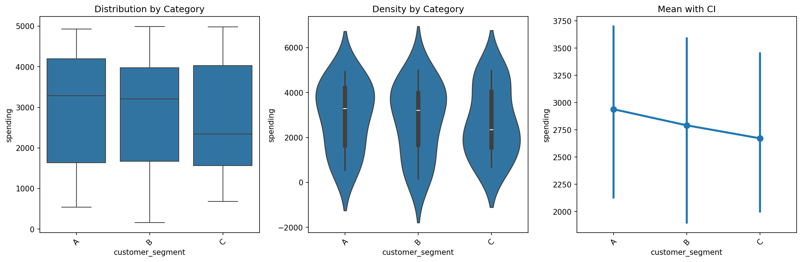

# Understanding Data Relationships: A Comprehensive Guide

**After this lesson:** You can choose sensible analyses for numeric–numeric, categorical–categorical, and mixed pairs, interpret correlation and effect size with caution, and avoid claiming causation from association alone.

## Helpful video

Summarizing distributions with percentiles—common in exploratory analysis.

<iframe width="560" height="315" src="https://www.youtube.com/embed/IFKQLDmRK0Y" title="Quantiles and Percentiles, Clearly Explained" frameborder="0" allow="accelerometer; autoplay; clipboard-write; encrypted-media; gyroscope; picture-in-picture" allowfullscreen></iframe>

## Overview

**Prerequisites:** [Distributions](distributions.md) and [two-variable statistics](../../1-data-fundamentals/1.3-intro-statistics/two-variable-statistics.md). [Pandas](../../1-data-fundamentals/1.5-data-analysis-pandas/README.md) for plotting.

> **Time needed:** About 60–90 minutes.

## Why this matters

Association is easy to compute and easy to over-interpret: **correlation is not causation**, and lurking variables can create misleading patterns. This lesson helps you **pair** the right summaries and plots with each combination of variable types and to **qualify** what the evidence supports.

Understanding relationships between variables is crucial for:

- Making better predictions
- Identifying key drivers
- Discovering hidden patterns
- Making informed business decisions

## Why Study Relationships?


Relationship analysis helps you:

1. Identify cause-and-effect patterns
2. Predict future outcomes
3. Optimize business processes
4. Make data-driven decisions
5. Validate business hypotheses

## Relationship Analysis Workflow: A Systematic Approach

Follow this workflow to uncover meaningful relationships in your data:



## Mathematical Foundations

### 1. Correlation Measures: Understanding Association Strength

Choose the right correlation measure for your data:

- **Pearson Correlation**: $r = \frac{\sum_{i=1}^n (x_i - \bar{x})(y_i - \bar{y})}{\sqrt{\sum_{i=1}^n (x_i - \bar{x})^2}\sqrt{\sum_{i=1}^n (y_i - \bar{y})^2}}$
  - Best for linear relationships
  - Requires continuous variables
  - Sensitive to outliers
  - Range: [-1, 1]

- **Spearman Rank Correlation**: $\rho = 1 - \frac{6\sum d_i^2}{n(n^2-1)}$ where $d_i$ is rank difference
  - Works with non-linear monotonic relationships
  - Less sensitive to outliers
  - Can handle ordinal data
  - Range: [-1, 1]

- **Kendall's Tau**: $\tau = \frac{2(P - Q)}{n(n-1)}$ where P and Q are concordant and discordant pairs
  - More robust than Spearman
  - Better for small sample sizes
  - Handles tied ranks well
  - Range: [-1, 1]

### 2. Categorical Associations: Analyzing Non-Numeric Relationships

Methods for understanding relationships between categorical variables:

- **Chi-square Test**: $\chi^2 = \sum \frac{(O - E)^2}{E}$
  - Tests independence between variables
  - Non-directional measure
  - Sensitive to sample size
  - Requires sufficient cell counts

- **Cramer's V**: $V = \sqrt{\frac{\chi^2}{n \min(r-1, c-1)}}$
  - Normalized measure of association
  - Range: [0, 1]
  - Comparable across tables
  - Adjusts for table size

- **Mutual Information**: $I(X;Y) = \sum_{y \in Y} \sum_{x \in X} p(x,y) \log(\frac{p(x,y)}{p(x)p(y)})$
  - Measures general dependence
  - Not limited to linear relationships
  - Information theory based
  - Always non-negative

## Comprehensive Relationship Analysis Framework: A Practical Guide

This framework helps you systematically analyze relationships in your data:

<div class="code-explainer" data-code-explainer>
<div class="code-explainer__code">


import pandas as pd
import numpy as np
import matplotlib.pyplot as plt
import seaborn as sns
from scipy import stats
import plotly.express as px
import plotly.graph_objects as go
from sklearn.preprocessing import LabelEncoder
from sklearn.metrics import mutual_info_score

class RelationshipAnalyzer:
    """A comprehensive framework for analyzing relationships between variables.
    
    This class provides methods to:
    - Detect and quantify relationships
    - Visualize patterns and associations
    - Test statistical significance
    - Handle different variable types
    - Generate insights and recommendations
    """
    
    def __init__(self, data):
        self.data = data
        self.numeric_cols = data.select_dtypes(include=[np.number]).columns
        self.categorical_cols = data.select_dtypes(include=['object']).columns
        
    def analyze_numeric_relationship(self, x, y):
        """Analyze relationship between numeric variables"""
        # Basic correlation measures
        correlations = {
            'pearson': stats.pearsonr(self.data[x], self.data[y]),
            'spearman': stats.spearmanr(self.data[x], self.data[y]),
            'kendall': stats.kendalltau(self.data[x], self.data[y])
        }
        
        # Create visualization suite
        fig = plt.figure(figsize=(20, 5))
        
        # Scatter plot with regression line
        plt.subplot(141)
        sns.regplot(data=self.data, x=x, y=y)
        plt.title('Linear Relationship')
        
        # Residual plot
        model = np.polyfit(self.data[x], self.data[y], 1)
        residuals = self.data[y] - np.polyval(model, self.data[x])
        plt.subplot(142)
        plt.scatter(self.data[x], residuals)
        plt.axhline(y=0, color='r', linestyle='--')
        plt.title('Residual Plot')
        
        # Joint distribution
        plt.subplot(143)
        sns.kdeplot(data=self.data, x=x, y=y)
        plt.title('Joint Distribution')
        
        # QQ plot of residuals
        plt.subplot(144)
        stats.probplot(residuals, dist="norm", plot=plt)
        plt.title('Q-Q Plot of Residuals')
        
        plt.tight_layout()
        plt.show()
        
        return correlations
    
    def analyze_categorical_relationship(self, x, y):
        """Analyze relationship between categorical variables"""
        # Create contingency table
        contingency = pd.crosstab(self.data[x], self.data[y])
        
        # Chi-square test
        chi2, p_value, dof, expected = stats.chi2_contingency(contingency)
        
        # Cramer's V
        n = contingency.sum().sum()
        min_dim = min(contingency.shape) - 1
        cramer_v = np.sqrt(chi2 / (n * min_dim))
        
        # Mutual information
        le = LabelEncoder()
        mi_score = mutual_info_score(
            le.fit_transform(self.data[x]),
            le.fit_transform(self.data[y])
        )
        
        # Visualizations
        fig = plt.figure(figsize=(15, 5))
        
        # Heatmap
        plt.subplot(131)
        sns.heatmap(contingency, annot=True, fmt='d', cmap='YlOrRd')
        plt.title('Contingency Table')
        
        # Mosaic plot
        plt.subplot(132)
        from statsmodels.graphics.mosaicplot import mosaic
        mosaic(self.data, [x, y])
        plt.title('Mosaic Plot')
        
        # Stacked bar
        plt.subplot(133)
        proportions = contingency.div(contingency.sum(axis=1), axis=0)
        proportions.plot(kind='bar', stacked=True)
        plt.title('Stacked Proportions')
        
        plt.tight_layout()
        plt.show()
        
        return {
            'chi_square': {'statistic': chi2, 'p_value': p_value},
            'cramers_v': cramer_v,
            'mutual_information': mi_score
        }
    
    def analyze_mixed_relationship(self, numeric_col, categorical_col):
        """Analyze relationship between numeric and categorical variables"""
        # ANOVA
        categories = self.data[categorical_col].unique()
        category_groups = [
            self.data[self.data[categorical_col] == cat][numeric_col]
            for cat in categories
        ]
        f_stat, p_value = stats.f_oneway(*category_groups)
        
        # Effect size (Eta-squared)
        df_total = len(self.data) - 1
        df_between = len(categories) - 1
        ss_between = sum(len(group) * (group.mean() - self.data[numeric_col].mean())**2 
                        for group in category_groups)
        ss_total = sum((self.data[numeric_col] - self.data[numeric_col].mean())**2)
        eta_squared = ss_between / ss_total
        
        # Visualizations
        fig = plt.figure(figsize=(15, 5))
        
        # Box plot
        plt.subplot(131)
        sns.boxplot(data=self.data, x=categorical_col, y=numeric_col)
        plt.xticks(rotation=45)
        plt.title('Distribution by Category')
        
        # Violin plot
        plt.subplot(132)
        sns.violinplot(data=self.data, x=categorical_col, y=numeric_col)
        plt.xticks(rotation=45)
        plt.title('Density by Category')
        
        # Point plot with CI
        plt.subplot(133)
        sns.pointplot(data=self.data, x=categorical_col, y=numeric_col)
        plt.xticks(rotation=45)
        plt.title('Mean with CI')
        
        plt.tight_layout()
        plt.show()
        
        return {
            'anova': {'f_statistic': f_stat, 'p_value': p_value},
            'eta_squared': eta_squared
        }

</div>
<aside class="code-explainer__callouts" aria-label="Code walkthrough">
  <div class="code-callout" data-lines="1-26" data-tint="1">
    <div class="code-callout__meta">
      <span class="code-callout__lines"></span>
      <span class="code-callout__title">Imports and RelationshipAnalyzer class</span>
    </div>
    <div class="code-callout__body">
      <p>Nine imports; the constructor splits columns into <code>numeric_cols</code> and <code>categorical_cols</code> upfront so each method knows which pairs to operate on.</p>
    </div>
  </div>
  <div class="code-callout" data-lines="27-65" data-tint="2">
    <div class="code-callout__meta">
      <span class="code-callout__lines"></span>
      <span class="code-callout__title">analyze_numeric_relationship</span>
    </div>
    <div class="code-callout__body">
      <p>Computes Pearson, Spearman, and Kendall correlations, then creates four subplots: regression scatter, residual plot, joint KDE, and Q-Q plot of residuals to check linearity and normality of errors.</p>
    </div>
  </div>
  <div class="code-callout" data-lines="66-114" data-tint="3">
    <div class="code-callout__meta">
      <span class="code-callout__lines"></span>
      <span class="code-callout__title">analyze_categorical_relationship</span>
    </div>
    <div class="code-callout__body">
      <p>Builds a contingency table, runs chi-square test, computes Cramér's V effect size and mutual information score, then visualises with heatmap, mosaic plot, and stacked proportions bar chart.</p>
    </div>
  </div>
  <div class="code-callout" data-lines="115-132" data-tint="4">
    <div class="code-callout__meta">
      <span class="code-callout__lines"></span>
      <span class="code-callout__title">analyze_mixed_relationship — ANOVA and effect size</span>
    </div>
    <div class="code-callout__body">
      <p>Groups the numeric column by category, runs one-way ANOVA for the F-statistic and p-value, then computes eta-squared (SS_between / SS_total) as the effect size measure.</p>
    </div>
  </div>
  <div class="code-callout" data-lines="133-161" data-tint="1">
    <div class="code-callout__meta">
      <span class="code-callout__lines"></span>
      <span class="code-callout__title">Mixed-relationship visualisations</span>
    </div>
    <div class="code-callout__body">
      <p>Three side-by-side plots per group: box plot for spread, violin plot for density shape, and point plot with confidence intervals for mean comparison across categories.</p>
    </div>
  </div>
</aside>
</div>


## Real-World Case Study: Customer Analysis

Let's analyze customer behavior to understand key relationships:

1. **Purchase Patterns**
   - Relationship between purchase amount and frequency
   - Impact of customer age on product preferences
   - Seasonal trends in buying behavior

2. **Customer Segments**
   - Demographic correlations
   - Behavioral clusters
   - Loyalty patterns

3. **Marketing Effectiveness**
   - Campaign response rates
   - Channel preferences
   - Conversion drivers

<div class="code-explainer" data-code-explainer>
<div class="code-explainer__code">


# Load sample customer data
df = pd.read_csv('../_data/customer_data.csv')
analyzer = RelationshipAnalyzer(df)

# 1. Analyze spending vs age relationship
spending_age = analyzer.analyze_numeric_relationship('spending', 'age')
print("\nSpending vs Age Analysis:")
print(f"Correlation: {spending_age['pearson'][0]:.3f} (p={spending_age['pearson'][1]:.3f})")

# 2. Analyze category vs loyalty relationship
category_loyalty = analyzer.analyze_categorical_relationship('category', 'loyalty_level')
print("\nCategory vs Loyalty Analysis:")
print(f"Cramer's V: {category_loyalty['cramers_v']:.3f}")

# 3. Analyze spending by segment
segment_spending = analyzer.analyze_mixed_relationship('spending', 'customer_segment')
print("\nSpending by Segment Analysis:")
print(f"Effect Size (): {segment_spending['eta_squared']:.3f}")












```

Spending vs Age Analysis:
Correlation: 0.119 (p=0.465)

Category vs Loyalty Analysis:
Cramer's V: 0.313

Spending by Segment Analysis:
Effect Size (): 0.006
```

</div>
<aside class="code-explainer__callouts" aria-label="Code walkthrough">
  <div class="code-callout" data-lines="1-6" data-tint="1">
    <div class="code-callout__meta">
      <span class="code-callout__lines"></span>
      <span class="code-callout__title">Load data and analyse numeric–numeric pair</span>
    </div>
    <div class="code-callout__body">
      <p>Loads the CSV, creates the analyser, then runs <code>analyze_numeric_relationship</code> on spending vs age, printing the Pearson correlation and its p-value.</p>
    </div>
  </div>
  <div class="code-callout" data-lines="7-12" data-tint="2">
    <div class="code-callout__meta">
      <span class="code-callout__lines"></span>
      <span class="code-callout__title">Categorical–categorical pair</span>
    </div>
    <div class="code-callout__body">
      <p>Analyses category vs loyalty using chi-square and Cramér's V, printing the effect size to judge practical significance beyond the p-value.</p>
    </div>
  </div>
  <div class="code-callout" data-lines="13-18" data-tint="3">
    <div class="code-callout__meta">
      <span class="code-callout__lines"></span>
      <span class="code-callout__title">Mixed pair: numeric by category</span>
    </div>
    <div class="code-callout__body">
      <p>Uses ANOVA to test whether spending differs significantly across customer segments, printing eta-squared to quantify what fraction of spending variance is explained by segment.</p>
    </div>
  </div>
</aside>
</div>

## Performance Optimization Tips: Handling Large-Scale Relationship Analysis

Optimize your analysis for large datasets:

1. **Efficient Computation**
   - Use vectorized operations
   - Implement chunked processing
   - Leverage parallel computing
   - Optimize memory usage

2. **Smart Sampling**
   - Stratified sampling
   - Random sampling
   - Progressive sampling
   - Reservoir sampling

3. **Visualization Strategies**
   - Bin data for plotting
   - Use density plots
   - Implement interactive views
   - Focus on relevant subsets

### 1. Efficient Correlation Computation

<div class="code-explainer" data-code-explainer>
<div class="code-explainer__code">


def compute_correlations_efficiently(df, method='pearson'):
    """Compute correlations efficiently for large datasets"""
    # Use numpy for faster computation
    if method == 'pearson':
        corr_matrix = np.corrcoef(df.values.T)
    else:
        # Use pandas for other methods
        corr_matrix = df.corr(method=method)
    
    return pd.DataFrame(
        corr_matrix,
        index=df.columns,
        columns=df.columns
    )

</div>
<aside class="code-explainer__callouts" aria-label="Code walkthrough">
  <div class="code-callout" data-lines="1-5" data-tint="1">
    <div class="code-callout__meta">
      <span class="code-callout__lines"></span>
      <span class="code-callout__title">Fast Pearson via NumPy</span>
    </div>
    <div class="code-callout__body">
      <p>For Pearson, <code>np.corrcoef</code> on the transposed values array is faster than the pandas method for wide DataFrames.</p>
    </div>
  </div>
  <div class="code-callout" data-lines="6-14" data-tint="2">
    <div class="code-callout__meta">
      <span class="code-callout__lines"></span>
      <span class="code-callout__title">Other methods and return</span>
    </div>
    <div class="code-callout__body">
      <p>For Spearman or Kendall, delegates to <code>df.corr(method=method)</code>. The result is always wrapped back into a labeled DataFrame with column names on both axes.</p>
    </div>
  </div>
</aside>
</div>

### 2. Memory-Efficient Categorical Analysis

<div class="code-explainer" data-code-explainer>
<div class="code-explainer__code">


def analyze_categories_efficiently(df, cat1, cat2, max_categories=50):
    """Memory-efficient categorical analysis"""
    # Check cardinality
    n_cat1 = df[cat1].nunique()
    n_cat2 = df[cat2].nunique()
    
    if n_cat1 > max_categories or n_cat2 > max_categories:
        # Use sampling for high cardinality
        sample_size = min(len(df), 10000)
        df_sample = df.sample(n=sample_size, random_state=42)
        contingency = pd.crosstab(df_sample[cat1], df_sample[cat2])
    else:
        contingency = pd.crosstab(df[cat1], df[cat2])
    
    return contingency

</div>
<aside class="code-explainer__callouts" aria-label="Code walkthrough">
  <div class="code-callout" data-lines="1-6" data-tint="1">
    <div class="code-callout__meta">
      <span class="code-callout__lines"></span>
      <span class="code-callout__title">Cardinality check</span>
    </div>
    <div class="code-callout__body">
      <p>Counts unique values in both columns. If either exceeds <code>max_categories</code>, a contingency table on the full dataset would be excessively sparse and slow.</p>
    </div>
  </div>
  <div class="code-callout" data-lines="7-15" data-tint="2">
    <div class="code-callout__meta">
      <span class="code-callout__lines"></span>
      <span class="code-callout__title">Sampling and crosstab</span>
    </div>
    <div class="code-callout__body">
      <p>High-cardinality columns are sampled to at most 10 000 rows (reproducibly with seed 42) before building the contingency table. Low-cardinality columns use the full dataset.</p>
    </div>
  </div>
</aside>
</div>

## Common Pitfalls and Solutions: Learning from Experience

Avoid these common mistakes in relationship analysis:

1. **Correlation vs. Causation**
   - Always investigate confounding variables
   - Use controlled experiments when possible
   - Consider temporal relationships
   - Document assumptions and limitations

2. **Ignoring Data Quality**
   - Check for missing values
   - Validate data types
   - Handle outliers appropriately
   - Verify data consistency

3. **Oversimplifying Complex Relationships**
   - Look beyond linear relationships
   - Consider interaction effects
   - Use appropriate statistical tests
   - Validate findings across subsets

1. **Correlation  Causation**

   <div class="code-explainer" data-code-explainer>
   <div class="code-explainer__code">
   
   
      def check_confounding(df, x, y, potential_confounders):
          """Check for confounding variables"""
          # Original correlation
          original_corr = df[x].corr(df[y])
          
          # Partial correlations
          partial_corrs = {}
          for conf in potential_confounders:
              # Calculate partial correlation
              partial_corr = partial_correlation(df[x], df[y], df[conf])
              partial_corrs[conf] = partial_corr
          
          return {
              'original': original_corr,
              'partial': partial_corrs
          }
   
   </div>
   <aside class="code-explainer__callouts" aria-label="Code walkthrough">
     <div class="code-callout" data-lines="1-6" data-tint="1">
       <div class="code-callout__meta">
         <span class="code-callout__lines"></span>
         <span class="code-callout__title">Original correlation</span>
       </div>
       <div class="code-callout__body">
         <p>Records the raw Pearson correlation between x and y before controlling for anything—this is the number that looks causal but may not be.</p>
       </div>
     </div>
     <div class="code-callout" data-lines="7-16" data-tint="2">
       <div class="code-callout__meta">
         <span class="code-callout__lines"></span>
         <span class="code-callout__title">Partial correlations per confounder</span>
       </div>
       <div class="code-callout__body">
         <p>Loops over candidate confounders, computing the partial correlation between x and y after removing the linear effect of each confounder. Large drops reveal spurious associations.</p>
       </div>
     </div>
   </aside>
   </div>

2. **Non-linear Relationships**

   <div class="code-explainer" data-code-explainer>
   <div class="code-explainer__code">
   
   
      def check_nonlinearity(df, x, y):
          """Check for non-linear relationships"""
          # Linear correlation
          linear_corr = df[x].corr(df[y])
          
          # Spearman correlation
          monotonic_corr = df[x].corr(df[y], method='spearman')
          
          # Difference indicates non-linearity
          nonlinearity = abs(linear_corr - monotonic_corr)
          
          return {
              'linear_corr': linear_corr,
              'monotonic_corr': monotonic_corr,
              'nonlinearity': nonlinearity
          }
   
   </div>
   <aside class="code-explainer__callouts" aria-label="Code walkthrough">
     <div class="code-callout" data-lines="1-7" data-tint="1">
       <div class="code-callout__meta">
         <span class="code-callout__lines"></span>
         <span class="code-callout__title">Linear and monotonic correlations</span>
       </div>
       <div class="code-callout__body">
         <p>Computes Pearson (linear) and Spearman (monotonic) correlations. Spearman can capture any monotonic relationship, not just linear ones.</p>
       </div>
     </div>
     <div class="code-callout" data-lines="8-16" data-tint="2">
       <div class="code-callout__meta">
         <span class="code-callout__lines"></span>
         <span class="code-callout__title">Non-linearity score</span>
       </div>
       <div class="code-callout__body">
         <p>The absolute difference between the two correlations is the non-linearity estimate: large values suggest a monotonic-but-curved relationship that Pearson would understate.</p>
       </div>
     </div>
   </aside>
   </div>

3. **Sample Size Considerations**

   <div class="code-explainer" data-code-explainer>
   <div class="code-explainer__code">
   
   
      def adjust_for_sample_size(statistic, n, type='correlation'):
          """Adjust statistics for sample size"""
          if type == 'correlation':
              # Fisher transformation
              z = np.arctanh(statistic)
              se = 1 / np.sqrt(n - 3)
              ci = (np.tanh(z - 1.96*se), np.tanh(z + 1.96*se))
              return {'adjusted': z, 'ci': ci}
          elif type == 'chi_square':
              # Yates correction for small samples
              if n < 30:
                  return statistic - ((n > 1) / 2)
              return statistic
   
   </div>
   <aside class="code-explainer__callouts" aria-label="Code walkthrough">
     <div class="code-callout" data-lines="1-8" data-tint="1">
       <div class="code-callout__meta">
         <span class="code-callout__lines"></span>
         <span class="code-callout__title">Fisher z-transform for correlation CI</span>
       </div>
       <div class="code-callout__body">
         <p>Applies Fisher's r-to-z transformation, computes standard error (1/√(n-3)), and back-transforms a ±1.96 SE interval into the original correlation scale.</p>
       </div>
     </div>
     <div class="code-callout" data-lines="9-13" data-tint="2">
       <div class="code-callout__meta">
         <span class="code-callout__lines"></span>
         <span class="code-callout__title">Yates correction for small chi-square samples</span>
       </div>
       <div class="code-callout__body">
         <p>For chi-square statistics with n &lt; 30, applies a 0.5 continuity correction to reduce inflated test values from small expected cell counts.</p>
       </div>
     </div>
   </aside>
   </div>

Remember: "Correlation is not causation, but it's a good place to start looking!"

## Next steps

- [Time series analysis](time-series.md) — temporal relationships
- [EDA project](project.md)
- [Data engineering (Module 2.4)](../2.4-data-engineering/README.md) — pipelines after exploration
- [Module README](README.md)
