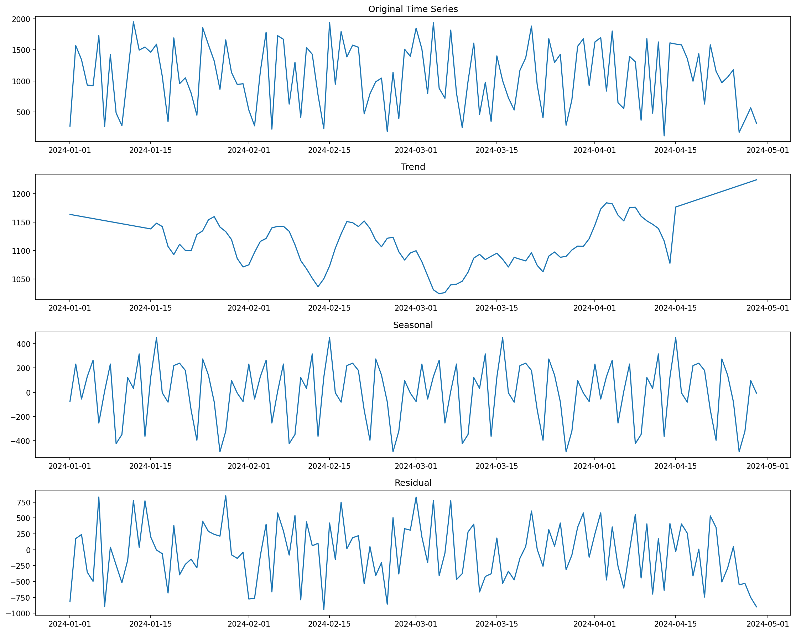
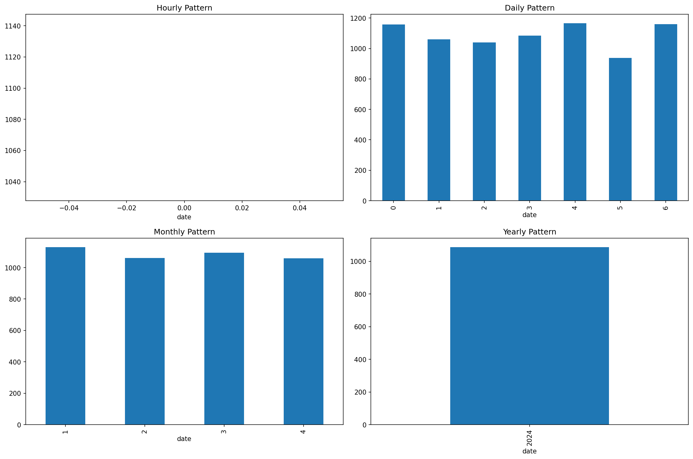
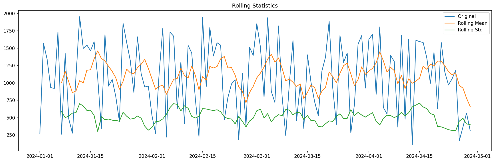
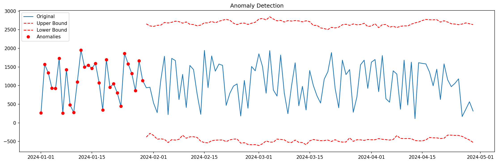

# Data Integration

**After this lesson:** You can compare **batch** and **near–real-time** integration patterns, list common failure modes (schema drift, duplicates, partial loads), and see how monitoring fits the pipeline.

## Helpful video

DAGs, tasks, and scheduling—conceptual background for ETL-style pipelines.

<iframe width="560" height="315" src="https://www.youtube.com/embed/eeSLDdz-aLg" title="Apache Airflow Tutorial for Beginners" frameborder="0" allow="accelerometer; autoplay; clipboard-write; encrypted-media; gyroscope; picture-in-picture" allowfullscreen></iframe>

## Overview

**Prerequisites:** [ETL fundamentals](etl-fundamentals.md) and [data storage](data-storage.md). REST and file-based patterns make more sense after [SQL](../2.1-sql/README.md).

> **Time needed:** About 60 minutes.

## Why this matters

Most pipeline incidents are integration problems: **schema drift**, **duplicate keys**, **partial loads**, or **clock skew** between systems. Understanding batch vs near-real-time patterns—and where they break—helps you design **idempotent** loads, **monitoring**, and **replay** strategies, not only happy-path extracts.

## Introduction to Data Integration

### Integration Patterns Diagram



### Real-time vs Batch Processing Comparison

```
+------------------+------------------------+------------------------+
| Characteristic   | Real-time Processing   | Batch Processing      |
+------------------+------------------------+------------------------+
| Latency         | Seconds or less        | Minutes to hours      |
| Data Volume     | Small chunks           | Large volumes         |
| Resource Usage  | Continuous             | Periodic spikes       |
| Complexity      | Higher                 | Lower                 |
| Cost            | Higher                 | Lower                 |
| Use Cases       | Fraud detection        | Daily reports         |
|                 | Real-time alerts       | Data warehousing      |
|                 | Live dashboards        | Complex analytics     |
+------------------+------------------------+------------------------+
```

### Data Quality Monitoring (Tableau Dashboard)

```
[Tableau Dashboard Layout]
+------------------------+------------------------+
|    Quality Metrics     |    Integration Status  |
+------------------------+------------------------+
| - Completeness         | - Success Rate        |
| - Accuracy            | - Error Rate          |
| - Consistency         | - Processing Time     |
| - Timeliness         | - Resource Usage      |
+------------------------+------------------------+
|        Data Quality Trends                     |
+-----------------------------------------------+
| - Quality Score Over Time                      |
| - Error Types Distribution                     |
| - Data Volume Trends                          |
| - Processing Time Trends                       |
+-----------------------------------------------+
|        Integration Performance                 |
+-----------------------------------------------+
| - Throughput                                  |
| - Latency                                     |
| - Resource Utilization                        |
| - Cost Metrics                                |
+-----------------------------------------------+
```

### Core Functions

- **Data Consolidation**:
  - Merging data from multiple sources
  - Resolving format differences
  - Handling schema variations
  - Maintaining data relationships

### Key Challenges

- **Data Quality**:
  - Inconsistent formats
  - Missing values
  - Duplicate records
  - Conflicting information

### Business Impact

- **Decision Making**:
  - 360-degree view of business
  - Real-time insights
  - Historical analysis
  - Predictive modeling

### Technical Considerations

- **Performance**:
  - Processing efficiency
  - Resource utilization
  - Scalability requirements
  - Response time targets

### Implementation Approaches

- **Batch Processing**:
  - Scheduled data loads
  - Bulk transformations
  - Historical data processing
  - Resource optimization

- **Real-time Processing**:
  - Stream processing
  - Event-driven integration
  - Immediate updates
  - Low-latency requirements

### Quality Assurance

- **Data Validation**:
  - Schema validation
  - Business rule checking
  - Referential integrity
  - Format standardization

### Monitoring and Maintenance

- **System Health**:
  - Performance metrics
  - Error tracking
  - Resource monitoring
  - SLA compliance

## Data Source Integration

### 1. API Integration

<div class="code-explainer" data-code-explainer>
<div class="code-explainer__code">


import requests
import pandas as pd
from typing import Dict, Any
from datetime import datetime

class APIIntegrator:
    """
    Handle API data integration
    """
    def __init__(self, base_url: str, auth_token: str = None):
        self.base_url = base_url.rstrip('/')
        self.session = requests.Session()
        if auth_token:
            self.session.headers.update({
                'Authorization': f'Bearer {auth_token}'
            })
    
    def fetch_data(self, endpoint: str, params: Dict[str, Any] = None) -> pd.DataFrame:
        """Fetch data from API endpoint"""
        try:
            url = f"{self.base_url}/{endpoint.lstrip('/')}"
            response = self.session.get(url, params=params)
            response.raise_for_status()
            
            # Convert response to DataFrame
            data = response.json()
            if isinstance(data, list):
                return pd.DataFrame(data)
            elif isinstance(data, dict):
                if 'data' in data:  # Common API pattern
                    return pd.DataFrame(data['data'])
                else:
                    return pd.DataFrame([data])
            
            raise ValueError("Unexpected API response format")
            
        except requests.exceptions.RequestException as e:
            raise Exception(f"API request failed: {str(e)}")










</div>
<aside class="code-explainer__callouts" aria-label="Code walkthrough">
  <div class="code-callout" data-lines="1-12" data-tint="1">
    <div class="code-callout__meta">
      <span class="code-callout__lines"></span>
      <span class="code-callout__title">Imports and APIIntegrator constructor</span>
    </div>
    <div class="code-callout__body">
      <p>Four imports. The constructor stores the base URL (stripped of trailing slash) and creates a persistent <code>requests.Session</code>, optionally attaching a Bearer token header for authenticated endpoints.</p>
    </div>
  </div>
  <div class="code-callout" data-lines="13-24" data-tint="2">
    <div class="code-callout__meta">
      <span class="code-callout__lines"></span>
      <span class="code-callout__title">fetch_data — HTTP request and error handling</span>
    </div>
    <div class="code-callout__body">
      <p>Builds the full URL, issues a GET request with optional query params, and calls <code>raise_for_status()</code> to convert 4xx/5xx responses into exceptions immediately.</p>
    </div>
  </div>
  <div class="code-callout" data-lines="25-38" data-tint="3">
    <div class="code-callout__meta">
      <span class="code-callout__lines"></span>
      <span class="code-callout__title">Response normalisation</span>
    </div>
    <div class="code-callout__body">
      <p>Handles three common API shapes: a JSON list (→ DataFrame directly), a dict with a <code>'data'</code> key (→ DataFrame from that list), or a single-object dict (→ one-row DataFrame).</p>
    </div>
  </div>
</aside>
</div>

### 2. File Integration

File integration is a fundamental aspect of data engineering, dealing with various file formats and storage systems. Here's what you need to consider:

#### Supported Formats

- **Structured**:
  - CSV (Comma Separated Values)
  - Excel (XLSX/XLS)
  - JSON (JavaScript Object Notation)
  - Parquet (Columnar Storage)

#### Performance Considerations

- **File Size**:
  - Chunked reading
  - Memory management
  - Parallel processing
  - Compression handling

#### Data Quality

- **Format Validation**:
  - Schema checking
  - Data type verification
  - Encoding handling
  - Header validation

#### Best Practices

- **Error Handling**:
  - File not found
  - Permission issues
  - Corrupt files
  - Format mismatches

Here's a robust implementation:

<div class="code-explainer" data-code-explainer>
<div class="code-explainer__code">


class FileIntegrator:
    """
    Handle file data integration
    """
    def __init__(self, base_path: str):
        self.base_path = base_path
    
    def read_file(self, file_path: str) -> pd.DataFrame:
        """Read data from various file formats"""
        file_path = f"{self.base_path}/{file_path}"
        
        if file_path.endswith('.csv'):
            return pd.read_csv(file_path)
        elif file_path.endswith('.xlsx'):
            return pd.read_excel(file_path)
        elif file_path.endswith('.json'):
            return pd.read_json(file_path)
        elif file_path.endswith('.parquet'):
            return pd.read_parquet(file_path)
        else:
            raise ValueError(f"Unsupported file format: {file_path}")
    
    def write_file(self, df: pd.DataFrame, file_path: str):
        """Write data to file"""
        file_path = f"{self.base_path}/{file_path}"
        
        if file_path.endswith('.csv'):
            df.to_csv(file_path, index=False)
        elif file_path.endswith('.xlsx'):
            df.to_excel(file_path, index=False)
        elif file_path.endswith('.json'):
            df.to_json(file_path, orient='records')
        elif file_path.endswith('.parquet'):
            df.to_parquet(file_path, index=False)
        else:
            raise ValueError(f"Unsupported file format: {file_path}")

</div>
<aside class="code-explainer__callouts" aria-label="Code walkthrough">
  <div class="code-callout" data-lines="1-6" data-tint="1">
    <div class="code-callout__meta">
      <span class="code-callout__lines"></span>
      <span class="code-callout__title">Class definition and constructor</span>
    </div>
    <div class="code-callout__body">
      <p>Stores a <code>base_path</code> prefix that is prepended to every file name, so callers pass relative paths and the class handles the full resolution.</p>
    </div>
  </div>
  <div class="code-callout" data-lines="7-22" data-tint="2">
    <div class="code-callout__meta">
      <span class="code-callout__lines"></span>
      <span class="code-callout__title">read_file — format dispatch</span>
    </div>
    <div class="code-callout__body">
      <p>Inspects the file extension and dispatches to the correct pandas reader: <code>read_csv</code>, <code>read_excel</code>, <code>read_json</code>, or <code>read_parquet</code>. Raises on unknown formats.</p>
    </div>
  </div>
  <div class="code-callout" data-lines="23-36" data-tint="3">
    <div class="code-callout__meta">
      <span class="code-callout__lines"></span>
      <span class="code-callout__title">write_file — format dispatch</span>
    </div>
    <div class="code-callout__body">
      <p>Mirror of <code>read_file</code>: dispatches to <code>to_csv</code>, <code>to_excel</code>, <code>to_json(orient='records')</code>, or <code>to_parquet</code> based on extension, all with <code>index=False</code>.</p>
    </div>
  </div>
</aside>
</div>

### 3. Database Integration

<div class="code-explainer" data-code-explainer>
<div class="code-explainer__code">


from sqlalchemy import create_engine, text
from typing import List

class DatabaseIntegrator:
    """
    Handle database data integration
    """
    def __init__(self, connection_string: str):
        self.engine = create_engine(connection_string)
    
    def read_query(self, query: str) -> pd.DataFrame:
        """Read data using SQL query"""
        return pd.read_sql(query, self.engine)
    
    def write_table(self, df: pd.DataFrame, table_name: str, if_exists: str = 'append'):
        """Write DataFrame to database table"""
        df.to_sql(table_name, self.engine, if_exists=if_exists, index=False)
    
    def execute_query(self, query: str):
        """Execute SQL query"""
        with self.engine.connect() as conn:
            conn.execute(text(query))

</div>
<aside class="code-explainer__callouts" aria-label="Code walkthrough">
  <div class="code-callout" data-lines="1-7" data-tint="1">
    <div class="code-callout__meta">
      <span class="code-callout__lines"></span>
      <span class="code-callout__title">Imports and constructor</span>
    </div>
    <div class="code-callout__body">
      <p>Creates a SQLAlchemy engine from a connection string—the engine manages connection pooling and dialect translation for different databases.</p>
    </div>
  </div>
  <div class="code-callout" data-lines="8-22" data-tint="2">
    <div class="code-callout__meta">
      <span class="code-callout__lines"></span>
      <span class="code-callout__title">read_query, write_table, and execute_query</span>
    </div>
    <div class="code-callout__body">
      <p>Three thin wrappers: <code>pd.read_sql</code> for SELECT queries, <code>df.to_sql</code> with an <code>append</code> strategy for writes, and a raw execution path for DDL or DML statements.</p>
    </div>
  </div>
</aside>
</div>

## Data Transformation

Data transformation is a critical phase in data integration that involves converting data from source formats to target formats while ensuring data quality and consistency.

### Key Transformation Types

- **Structure Transformations**:
  - Schema mapping
  - Data type conversions
  - Denormalization/Normalization
  - Aggregations

- **Content Transformations**:
  - Data cleansing
  - Value standardization
  - Unit conversions
  - Encoding changes

- **Semantic Transformations**:
  - Business rule application
  - Derived calculations
  - Lookup operations
  - Data enrichment

### 1. Schema Mapping

Schema mapping is the process of creating relationships between source and target data models. Key considerations include:

#### Mapping Types

- **One-to-One**:
  - Direct field mappings
  - Name standardization
  - Type alignment
  - Format consistency

- **One-to-Many**:
  - Data splitting
  - Array expansion
  - Nested structure handling
  - Relationship preservation

- **Many-to-One**:
  - Data aggregation
  - Field combination
  - Value concatenation
  - Logic application

#### Best Practices

- **Documentation**:
  - Mapping documentation
  - Transformation rules
  - Business logic
  - Data lineage

Here's a comprehensive implementation:

<div class="code-explainer" data-code-explainer>
<div class="code-explainer__code">


from typing import Dict, List

class SchemaMapper:
    """
    Handle schema mapping between different data sources
    """
    def __init__(self, mapping: Dict[str, str]):
        self.mapping = mapping
    
    def apply_mapping(self, df: pd.DataFrame) -> pd.DataFrame:
        """Apply column mapping to DataFrame"""
        # Rename columns according to mapping
        df = df.rename(columns=self.mapping)
        
        # Only keep mapped columns
        return df[list(self.mapping.values())]
    
    def reverse_mapping(self, df: pd.DataFrame) -> pd.DataFrame:
        """Apply reverse mapping to DataFrame"""
        reverse_map = {v: k for k, v in self.mapping.items()}
        return df.rename(columns=reverse_map)

</div>
<aside class="code-explainer__callouts" aria-label="Code walkthrough">
  <div class="code-callout" data-lines="1-9" data-tint="1">
    <div class="code-callout__meta">
      <span class="code-callout__lines"></span>
      <span class="code-callout__title">SchemaMapper constructor</span>
    </div>
    <div class="code-callout__body">
      <p>Accepts a <code>mapping</code> dict of source-name → target-name pairs and stores it for reuse in both the forward and reverse directions.</p>
    </div>
  </div>
  <div class="code-callout" data-lines="10-21" data-tint="2">
    <div class="code-callout__meta">
      <span class="code-callout__lines"></span>
      <span class="code-callout__title">apply_mapping and reverse_mapping</span>
    </div>
    <div class="code-callout__body">
      <p><code>apply_mapping</code> renames columns and drops any that are not in the mapping. <code>reverse_mapping</code> inverts the dict to rename target columns back to source names.</p>
    </div>
  </div>
</aside>
</div>

### 2. Data Type Conversion

<div class="code-explainer" data-code-explainer>
<div class="code-explainer__code">


class DataTypeConverter:
    """
    Handle data type conversions
    """
    @staticmethod
    def convert_types(df: pd.DataFrame, type_mapping: Dict[str, str]) -> pd.DataFrame:
        """Convert column data types"""
        df = df.copy()
        
        for column, dtype in type_mapping.items():
            if column in df.columns:
                try:
                    if dtype == 'datetime':
                        df[column] = pd.to_datetime(df[column])
                    else:
                        df[column] = df[column].astype(dtype)
                except Exception as e:
                    raise ValueError(f"Failed to convert {column} to {dtype}: {str(e)}")
        
        return df

</div>
<aside class="code-explainer__callouts" aria-label="Code walkthrough">
  <div class="code-callout" data-lines="1-8" data-tint="1">
    <div class="code-callout__meta">
      <span class="code-callout__lines"></span>
      <span class="code-callout__title">Class definition and convert_types signature</span>
    </div>
    <div class="code-callout__body">
      <p>A static method that takes a DataFrame and a dict of column→dtype pairs. It copies the DataFrame first to avoid mutating the caller's data.</p>
    </div>
  </div>
  <div class="code-callout" data-lines="9-20" data-tint="2">
    <div class="code-callout__meta">
      <span class="code-callout__lines"></span>
      <span class="code-callout__title">Per-column type conversion with error handling</span>
    </div>
    <div class="code-callout__body">
      <p>For <code>'datetime'</code> uses <code>pd.to_datetime</code>; otherwise calls <code>astype</code>. Any conversion failure raises a descriptive <code>ValueError</code> naming the column and target dtype.</p>
    </div>
  </div>
</aside>
</div>

### 3. Data Validation

<div class="code-explainer" data-code-explainer>
<div class="code-explainer__code">


from typing import Callable, Dict

class DataValidator:
    """
    Handle data validation during integration
    """
    def __init__(self):
        self.validation_rules: Dict[str, List[Callable]] = {}
    
    def add_rule(self, column: str, rule: Callable):
        """Add validation rule for column"""
        if column not in self.validation_rules:
            self.validation_rules[column] = []
        self.validation_rules[column].append(rule)
    
    def validate(self, df: pd.DataFrame) -> bool:
        """Validate DataFrame against rules"""
        validation_results = []
        
        for column, rules in self.validation_rules.items():
            if column not in df.columns:
                raise ValueError(f"Column not found: {column}")
            
            for rule in rules:
                validation_results.append(df[column].apply(rule))
        
        # Check if all validations passed
        return all(result.all() for result in validation_results)

</div>
<aside class="code-explainer__callouts" aria-label="Code walkthrough">
  <div class="code-callout" data-lines="1-14" data-tint="1">
    <div class="code-callout__meta">
      <span class="code-callout__lines"></span>
      <span class="code-callout__title">Import, class definition, and add_rule</span>
    </div>
    <div class="code-callout__body">
      <p>Imports <code>Callable</code> and <code>Dict</code> from typing, defines <code>DataValidator</code> with a <code>validation_rules</code> dict keyed by column name, and <code>add_rule</code> which registers a callable rule for a given column.</p>
    </div>
  </div>
  <div class="code-callout" data-lines="15-28" data-tint="2">
    <div class="code-callout__meta">
      <span class="code-callout__lines"></span>
      <span class="code-callout__title">validate method</span>
    </div>
    <div class="code-callout__body">
      <p><code>validate</code> iterates over every registered column and applies each rule via <code>df[column].apply(rule)</code>. It raises if a column is missing, then returns <code>True</code> only when every result series is all-True.</p>
    </div>
  </div>
</aside>
</div>

## Data Integration Pipeline

<div class="code-explainer" data-code-explainer>
<div class="code-explainer__code">


class DataIntegrationPipeline:
    """
    Orchestrate data integration process
    """
    def __init__(self):
        self.steps = []
    
    def add_step(self, name: str, func: Callable, **kwargs):
        """Add processing step to pipeline"""
        self.steps.append({
            'name': name,
            'func': func,
            'kwargs': kwargs
        })
    
    def run(self, data: pd.DataFrame) -> pd.DataFrame:
        """Run integration pipeline"""
        result = data.copy()
        
        for step in self.steps:
            try:
                result = step['func'](result, **step['kwargs'])
                print(f"Step '{step['name']}' completed successfully")
            except Exception as e:
                raise Exception(f"Step '{step['name']}' failed: {str(e)}")
        
        return result

</div>
<aside class="code-explainer__callouts" aria-label="Code walkthrough">
  <div class="code-callout" data-lines="1-14" data-tint="1">
    <div class="code-callout__meta">
      <span class="code-callout__lines"></span>
      <span class="code-callout__title">Class definition, constructor, and add_step</span>
    </div>
    <div class="code-callout__body">
      <p>Defines <code>DataIntegrationPipeline</code> with a <code>steps</code> list. <code>add_step</code> appends a dict containing a step name, the callable function, and any extra keyword arguments—building up the pipeline declaratively before execution.</p>
    </div>
  </div>
  <div class="code-callout" data-lines="16-27" data-tint="2">
    <div class="code-callout__meta">
      <span class="code-callout__lines"></span>
      <span class="code-callout__title">run method with error handling</span>
    </div>
    <div class="code-callout__body">
      <p><code>run</code> iterates the steps list, calling each function on the running result DataFrame. On success it prints a confirmation; on failure it re-raises with the step name in the message so you know exactly where the pipeline broke.</p>
    </div>
  </div>
</aside>
</div>

## Integration Patterns

### 1. Extract and Load

<div class="code-explainer" data-code-explainer>
<div class="code-explainer__code">


def extract_and_load(source_integrator, target_integrator, 
                    source_params: Dict, target_params: Dict):
    """
    Simple extract and load pattern
    """
    # Extract data
    data = source_integrator.fetch_data(**source_params)
    
    # Load data
    target_integrator.write_data(data, **target_params)
    
    return data

</div>
<aside class="code-explainer__callouts" aria-label="Code walkthrough">
  <div class="code-callout" data-lines="1-7" data-tint="1">
    <div class="code-callout__meta">
      <span class="code-callout__lines"></span>
      <span class="code-callout__title">Signature and extract step</span>
    </div>
    <div class="code-callout__body">
      <p>Takes source and target integrators plus their parameter dicts. The extract step calls <code>source_integrator.fetch_data</code> with the unpacked <code>source_params</code> to pull the raw data.</p>
    </div>
  </div>
  <div class="code-callout" data-lines="9-12" data-tint="2">
    <div class="code-callout__meta">
      <span class="code-callout__lines"></span>
      <span class="code-callout__title">Load step and return</span>
    </div>
    <div class="code-callout__body">
      <p>Writes the extracted data to the target system via <code>target_integrator.write_data</code> and returns it—allowing the caller to inspect or chain the result.</p>
    </div>
  </div>
</aside>
</div>

### 2. Transform and Load

<div class="code-explainer" data-code-explainer>
<div class="code-explainer__code">


def transform_and_load(data: pd.DataFrame, transformations: List[Callable],
                      target_integrator, target_params: Dict):
    """
    Transform and load pattern
    """
    # Apply transformations
    for transform in transformations:
        data = transform(data)
    
    # Load data
    target_integrator.write_data(data, **target_params)
    
    return data

</div>
<aside class="code-explainer__callouts" aria-label="Code walkthrough">
  <div class="code-callout" data-lines="1-8" data-tint="1">
    <div class="code-callout__meta">
      <span class="code-callout__lines"></span>
      <span class="code-callout__title">Signature and transformation loop</span>
    </div>
    <div class="code-callout__body">
      <p>Accepts a DataFrame, a list of transformation callables, and the target integrator. The loop applies each transform in order—<code>data = transform(data)</code>—so transformations chain without needing a pipeline object.</p>
    </div>
  </div>
  <div class="code-callout" data-lines="9-13" data-tint="2">
    <div class="code-callout__meta">
      <span class="code-callout__lines"></span>
      <span class="code-callout__title">Load step and return</span>
    </div>
    <div class="code-callout__body">
      <p>Writes the fully-transformed DataFrame to the target using <code>target_params</code>, then returns it so callers can log row counts or run post-load checks.</p>
    </div>
  </div>
</aside>
</div>

### 3. Incremental Load

<div class="code-explainer" data-code-explainer>
<div class="code-explainer__code">


def incremental_load(source_integrator, target_integrator,
                    key_column: str, last_value: Any,
                    source_params: Dict, target_params: Dict):
    """
    Incremental load pattern
    """
    # Modify source params to include incremental filter
    source_params['filter'] = {key_column: {'gt': last_value}}
    
    # Extract incremental data
    data = source_integrator.fetch_data(**source_params)
    
    if not data.empty:
        # Load incremental data
        target_integrator.write_data(data, **target_params)
        
        # Update last value
        last_value = data[key_column].max()
    
    return data, last_value

</div>
<aside class="code-explainer__callouts" aria-label="Code walkthrough">
  <div class="code-callout" data-lines="1-11" data-tint="1">
    <div class="code-callout__meta">
      <span class="code-callout__lines"></span>
      <span class="code-callout__title">Signature, filter injection, and extract</span>
    </div>
    <div class="code-callout__body">
      <p>Accepts a <code>key_column</code> and <code>last_value</code> cursor. Before fetching, it injects a <code>gt</code> (greater-than) filter into <code>source_params</code> so only new rows are pulled—then calls <code>fetch_data</code> with the modified params.</p>
    </div>
  </div>
  <div class="code-callout" data-lines="12-20" data-tint="2">
    <div class="code-callout__meta">
      <span class="code-callout__lines"></span>
      <span class="code-callout__title">Conditional load and cursor update</span>
    </div>
    <div class="code-callout__body">
      <p>Only writes and advances the cursor when new rows exist (<code>not data.empty</code>). <code>last_value</code> is updated to <code>data[key_column].max()</code> so the next run resumes exactly where this one left off.</p>
    </div>
  </div>
</aside>
</div>

## Best Practices

1. **Data Quality**
   - Validate data before integration
   - Handle errors gracefully
   - Log validation failures
   - Monitor data quality

2. **Performance**
   - Use batch processing
   - Implement incremental loads
   - Optimize transformations
   - Monitor resource usage

3. **Error Handling**
   - Implement retries
   - Log errors
   - Provide error context
   - Handle partial failures

4. **Documentation**
   - Document data sources
   - Map data lineage
   - Track transformations
   - Maintain metadata

## Practice Exercise

Build a data integration pipeline that:

1. Extracts data from multiple sources
2. Applies transformations
3. Validates data quality
4. Loads data to target system
5. Handles errors appropriately

## Solution Template

<div class="code-explainer" data-code-explainer>
<div class="code-explainer__code">


# Configuration
config = {
    'source_api': {
        'base_url': 'https://api.example.com',
        'auth_token': 'your_token'
    },
    'target_db': {
        'connection_string': 'postgresql://localhost/db'
    },
    'schema_mapping': {
        'id': 'customer_id',
        'name': 'customer_name',
        'value': 'purchase_amount'
    },
    'type_mapping': {
        'customer_id': 'int64',
        'purchase_amount': 'float64',
        'purchase_date': 'datetime'
    }
}

# Initialize components
api_integrator = APIIntegrator(
    config['source_api']['base_url'],
    config['source_api']['auth_token']
)

db_integrator = DatabaseIntegrator(
    config['target_db']['connection_string']
)

schema_mapper = SchemaMapper(config['schema_mapping'])
type_converter = DataTypeConverter()
validator = DataValidator()

# Setup validation rules
validator.add_rule('customer_id', lambda x: x > 0)
validator.add_rule('purchase_amount', lambda x: x >= 0)

# Create pipeline
pipeline = DataIntegrationPipeline()

pipeline.add_step(
    'extract',
    api_integrator.fetch_data,
    endpoint='sales'
)

pipeline.add_step(
    'map_schema',
    schema_mapper.apply_mapping
)

pipeline.add_step(
    'convert_types',
    type_converter.convert_types,
    type_mapping=config['type_mapping']
)

pipeline.add_step(
    'validate',
    validator.validate
)

pipeline.add_step(
    'load',
    db_integrator.write_table,
    table_name='sales'
)

# Run pipeline
try:
    result = pipeline.run(initial_data)
    print("Integration completed successfully")
except Exception as e:
    print(f"Integration failed: {str(e)}")

</div>
<aside class="code-explainer__callouts" aria-label="Code walkthrough">
  <div class="code-callout" data-lines="1-20" data-tint="1">
    <div class="code-callout__meta">
      <span class="code-callout__lines"></span>
      <span class="code-callout__title">Configuration dict</span>
    </div>
    <div class="code-callout__body">
      <p>The <code>config</code> dict centralises all integration settings: the source API URL and auth token, the target database connection string, the field-level schema mapping (e.g., <code>'id' → 'customer_id'</code>), and per-column dtype targets for type conversion.</p>
    </div>
  </div>
  <div class="code-callout" data-lines="22-38" data-tint="2">
    <div class="code-callout__meta">
      <span class="code-callout__lines"></span>
      <span class="code-callout__title">Initialise components and validation rules</span>
    </div>
    <div class="code-callout__body">
      <p>Instantiates each integration component from the config, then registers two lambda validation rules: customer IDs must be positive and purchase amounts must be non-negative.</p>
    </div>
  </div>
  <div class="code-callout" data-lines="40-47" data-tint="3">
    <div class="code-callout__meta">
      <span class="code-callout__lines"></span>
      <span class="code-callout__title">Create pipeline and add extract step</span>
    </div>
    <div class="code-callout__body">
      <p>Creates a <code>DataIntegrationPipeline</code> and registers the first step: call <code>api_integrator.fetch_data</code> with <code>endpoint='sales'</code> to pull the raw sales records.</p>
    </div>
  </div>
  <div class="code-callout" data-lines="49-63" data-tint="4">
    <div class="code-callout__meta">
      <span class="code-callout__lines"></span>
      <span class="code-callout__title">Schema mapping, type conversion, and validation steps</span>
    </div>
    <div class="code-callout__body">
      <p>Three pipeline steps run in sequence: rename columns to match the warehouse schema, cast each column to the configured dtype, then validate all rows against the registered rules before loading.</p>
    </div>
  </div>
  <div class="code-callout" data-lines="65-69" data-tint="1">
    <div class="code-callout__meta">
      <span class="code-callout__lines"></span>
      <span class="code-callout__title">Load step</span>
    </div>
    <div class="code-callout__body">
      <p>The final pipeline step writes the validated, transformed data to the <code>sales</code> table via <code>db_integrator.write_table</code>.</p>
    </div>
  </div>
  <div class="code-callout" data-lines="71-76" data-tint="2">
    <div class="code-callout__meta">
      <span class="code-callout__lines"></span>
      <span class="code-callout__title">Run pipeline with error handling</span>
    </div>
    <div class="code-callout__body">
      <p>Executes the full pipeline inside a try/except. Success prints a confirmation; any step failure surfaces the step name in the error message so you know exactly where the integration broke.</p>
    </div>
  </div>
</aside>
</div>

## Gotchas

- **`response.raise_for_status()` does not catch pagination silently stopping** — many APIs return HTTP 200 with an empty `data` list once you exceed the last page; if your `fetch_data` method stops when it gets an empty response it may silently return an incomplete dataset with no error raised.
- **Schema mapping renames columns but does not validate that all target fields exist** — if the source API adds or removes a field, `df.rename(columns=mapping)` silently skips unknown keys; downstream column references will raise `KeyError` at load time, not at the rename step where the mismatch occurred.
- **Batch loads with no watermark produce full re-loads on every run** — without recording a high-water mark (e.g., `max(updated_at)` from the last successful run), re-running the pipeline fetches and reloads the entire source table each time, duplicating records or blowing past API rate limits.
- **Type conversion with `astype` raises on `NaN` in integer columns** — `df[col].astype('int64')` throws if the column contains nulls introduced during cleaning; use `pd.Int64Dtype()` (nullable integer) or fill nulls before casting to avoid a hard failure in the type-conversion step.
- **`requests.Session` headers are shared across all requests in the session** — if the auth token expires mid-run and you refresh it on the session object, earlier in-flight requests may still carry the old token; implement token refresh at the request level or rebuild the session after expiry.
- **Validation rules registered as lambdas capture references, not values** — if you build validation rules in a loop (e.g., `for col in cols: rules[col] = lambda x: x > threshold`), all lambdas share the same `threshold` reference and may silently validate against the last loop value; use default argument capture (`lambda x, t=threshold: x > t`) to bind correctly.

Remember: Effective data integration requires careful planning and robust error handling!

## Next steps

- [ETL fundamentals](etl-fundamentals.md) — orchestration, loads, and quality checks (next in the lesson sequence)
- [Data engineering project](project.md)
- [Exploratory Data Analysis (Module 2.3)](../2.3-eda/README.md) — profile integrated outputs
- [Module README](README.md)
