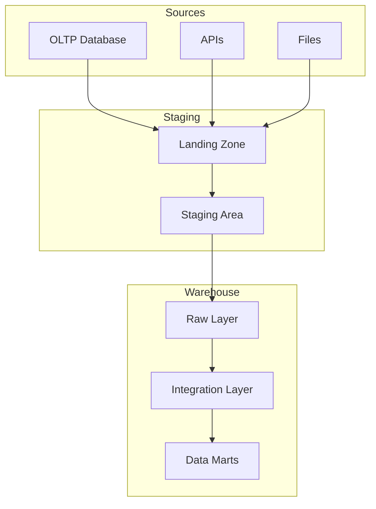
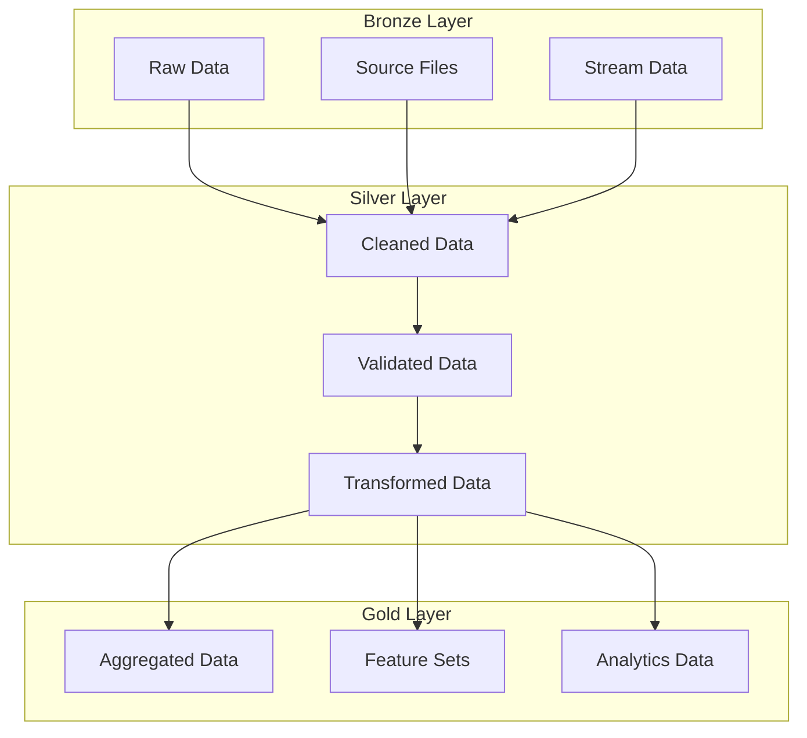

# Data Storage Solutions

**After this lesson:** You can contrast **OLTP** databases, **data warehouses**, and **data lakes** for typical analytics workloads, and name one sensible use case for each.

## Helpful video

DAGs, tasks, and scheduling—conceptual background for ETL-style pipelines.

<iframe width="560" height="315" src="https://www.youtube.com/embed/eeSLDdz-aLg" title="Apache Airflow Tutorial for Beginners" frameborder="0" allow="accelerometer; autoplay; clipboard-write; encrypted-media; gyroscope; picture-in-picture" allowfullscreen></iframe>

## Overview

**Prerequisites:** [ETL fundamentals](etl-fundamentals.md) and [Intro to databases](../2.1-sql/intro-databases.md). Optional: skim [Snowflake](../../0-prep/snowflake.md) if your org uses it.

> **Time needed:** About 45–60 minutes.

> **Note:** **OLTP** (online transaction processing) systems optimize row-level transactions; warehouses optimize analytical queries across large history.

## Introduction to Data Storage

Data storage is a fundamental aspect of data engineering that requires careful consideration of various factors to ensure efficient, reliable, and scalable data management.

### Storage Types Comparison Chart

```
+------------------+------------------------+------------------------+------------------------+
| Characteristic   | Data Warehouse         | Data Lake             | Database              |
+------------------+------------------------+------------------------+------------------------+
| Data Structure   | Structured             | Any Structure         | Structured/Semi       |
| Schema           | Schema-on-Write        | Schema-on-Read        | Fixed Schema          |
| Data Quality     | Refined                | Raw                   | Validated             |
| Query Speed      | Fast                   | Varies                | Fast                  |
| Storage Cost     | Higher                 | Lower                 | Medium                |
| Processing       | Batch                  | Batch/Real-time       | Real-time             |
| Use Cases        | BI/Reporting           | Data Science/ML       | OLTP                  |
| Scalability      | Vertical               | Horizontal            | Both                  |
| Tools            | Snowflake, Redshift    | S3, Azure Blob        | PostgreSQL, MongoDB   |
+------------------+------------------------+-----------------------+------------------------+
```

### Data Warehouse Architecture



### Data Lake Organization



### Storage Performance Comparison (Tableau Dashboard)

```
[Tableau Dashboard Layout]
+------------------------+------------------------+
|    Query Performance   |    Storage Metrics     |
+------------------------+------------------------+
| - Response Time        | - Storage Usage        |
| - Throughput          | - Growth Rate          |
| - Concurrency         | - Cost per GB          |
| - Cache Hit Rate      | - Compression Ratio    |
+------------------------+------------------------+
|        Access Patterns by Storage Type         |
+-----------------------------------------------+
| - Read/Write Ratios                           |
| - Query Types                                 |
| - Data Volume                                 |
| - User Concurrency                            |
+-----------------------------------------------+
|        Performance Trends Over Time           |
+-----------------------------------------------+
| - Query Response Time                         |
| - Storage Growth                              |
| - Cost Trends                                 |
| - Resource Usage                              |
+-----------------------------------------------+
```

### Key Considerations

#### 1. Data Characteristics

- **Volume**:
  - Current data size
  - Growth projections
  - Storage capacity planning
  - Cost considerations

- **Velocity**:
  - Data ingestion rate
  - Processing requirements
  - Real-time vs batch
  - Access patterns

- **Variety**:
  - Structured data
  - Semi-structured data
  - Unstructured data
  - Binary objects

#### 2. Performance Requirements

- **Access Patterns**:
  - Read/write ratios
  - Query complexity
  - Concurrency needs
  - Latency requirements

- **Scalability**:
  - Horizontal scaling
  - Vertical scaling
  - Partitioning strategy
  - Load distribution

#### 3. Data Governance

- **Security**:
  - Access control
  - Encryption
  - Audit logging
  - Compliance requirements

- **Data Quality**:
  - Validation rules
  - Consistency checks
  - Data integrity
  - Error handling

#### 4. Operational Aspects

- **Maintenance**:
  - Backup strategies
  - Recovery procedures
  - Monitoring setup
  - Performance tuning

- **Cost Management**:
  - Storage costs
  - Operation costs
  - Scaling costs
  - Maintenance costs

### Storage Selection Criteria

#### 1. Business Requirements

- **Use Cases**:
  - Transaction processing
  - Analytics
  - Archival
  - Caching

- **SLA Requirements**:
  - Availability
  - Durability
  - Performance
  - Recovery time

#### 2. Technical Requirements

- **Data Model**:
  - Schema flexibility
  - Relationship handling
  - Indexing needs
  - Query capabilities

- **Integration**:
  - API support
  - Tool compatibility
  - Protocol support
  - Ecosystem integration

## Types of Data Storage

### 1. Relational Databases (RDBMS)

<div class="code-explainer" data-code-explainer>
<div class="code-explainer__code">


from sqlalchemy import create_engine, Column, Integer, String, Float, DateTime
from sqlalchemy.ext.declarative import declarative_base
from sqlalchemy.orm import sessionmaker

# Define base class for SQLAlchemy models
Base = declarative_base()

# Example table definition
class SalesRecord(Base):
    """
    Example of a SQLAlchemy model for sales data
    """
    __tablename__ = 'sales'
    
    id = Column(Integer, primary_key=True)
    product_id = Column(Integer)
    customer_id = Column(Integer)
    sale_date = Column(DateTime)
    amount = Column(Float)
    
    def __repr__(self):
        return f"<Sale(id={self.id}, amount={self.amount})>"

# Database connection and session management
def setup_database(connection_string):
    """
    Setup database connection and create tables
    """
    # Create engine
    engine = create_engine(connection_string)
    
    # Create tables
    Base.metadata.create_all(engine)
    
    # Create session factory
    Session = sessionmaker(bind=engine)
    
    return Session()

</div>
<aside class="code-explainer__callouts" aria-label="Code walkthrough">
  <div class="code-callout" data-lines="1-12" data-tint="1">
    <div class="code-callout__meta">
      <span class="code-callout__lines"></span>
      <span class="code-callout__title">From sqlalchemy import create_engine, Column,…</span>
    </div>
    <div class="code-callout__body">
      <p>Lines 1–12: follow this band in the snippet.</p>
    </div>
  </div>
  <div class="code-callout" data-lines="13-25" data-tint="2">
    <div class="code-callout__meta">
      <span class="code-callout__lines"></span>
      <span class="code-callout__title">__tablename__ = &#x27;sales&#x27;</span>
    </div>
    <div class="code-callout__body">
      <p>Lines 13–25: follow this band in the snippet.</p>
    </div>
  </div>
  <div class="code-callout" data-lines="26-38" data-tint="3">
    <div class="code-callout__meta">
      <span class="code-callout__lines"></span>
      <span class="code-callout__title">&quot;&quot;&quot;</span>
    </div>
    <div class="code-callout__body">
      <p>Lines 26–38: follow this band in the snippet.</p>
    </div>
  </div>
</aside>
</div>

### 2. NoSQL Databases

NoSQL databases provide flexible schema design and horizontal scalability for handling diverse data types and high-volume workloads.

#### Types of NoSQL Databases

- **Document Stores**:
  - Schema flexibility
  - Nested structures
  - JSON/BSON format
  - Query capabilities
  - Example: MongoDB, CouchDB

- **Key-Value Stores**:
  - Simple data model
  - High performance
  - Scalable architecture
  - Cache-friendly
  - Example: Redis, DynamoDB

- **Column-Family Stores**:
  - Wide-column storage
  - High write throughput
  - Efficient compression
  - Horizontal scaling
  - Example: Cassandra, HBase

- **Graph Databases**:
  - Relationship-focused
  - Network analysis
  - Path traversal
  - Pattern matching
  - Example: Neo4j, JanusGraph

#### Use Cases

- **Document Stores**:
  - Content management
  - User profiles
  - Game states
  - Product catalogs

- **Key-Value Stores**:
  - Session management
  - Shopping carts
  - User preferences
  - Real-time bidding

- **Column-Family**:
  - Time-series data
  - Event logging
  - Sensor data
  - Large-scale analytics

- **Graph Databases**:
  - Social networks
  - Recommendation engines
  - Fraud detection
  - Knowledge graphs

Here's a comprehensive MongoDB implementation:

<div class="code-explainer" data-code-explainer>
<div class="code-explainer__code">


from pymongo import MongoClient
from datetime import datetime

class MongoDBHandler:
    """
    Handler for MongoDB operations
    """
    def __init__(self, connection_string):
        self.client = MongoClient(connection_string)
    
    def insert_document(self, database, collection, document):
        """Insert a single document"""
        db = self.client[database]
        coll = db[collection]
        return coll.insert_one(document)
    
    def find_documents(self, database, collection, query):
        """Find documents matching query"""
        db = self.client[database]
        coll = db[collection]
        return list(coll.find(query))
    
    def update_document(self, database, collection, query, update):
        """Update documents matching query"""
        db = self.client[database]
        coll = db[collection]
        return coll.update_many(query, {'$set': update})

# Example usage
mongo = MongoDBHandler('mongodb://localhost:27017')
document = {
    'product_id': 123,
    'customer_id': 456,
    'sale_date': datetime.now(),
    'amount': 99.99
}
mongo.insert_document('sales_db', 'transactions', document)

</div>
<aside class="code-explainer__callouts" aria-label="Code walkthrough">
  <div class="code-callout" data-lines="1-12" data-tint="1">
    <div class="code-callout__meta">
      <span class="code-callout__lines"></span>
      <span class="code-callout__title">From pymongo import MongoClient</span>
    </div>
    <div class="code-callout__body">
      <p>Lines 1–12: follow this band in the snippet.</p>
    </div>
  </div>
  <div class="code-callout" data-lines="13-24" data-tint="2">
    <div class="code-callout__meta">
      <span class="code-callout__lines"></span>
      <span class="code-callout__title">Db = self.client[database]</span>
    </div>
    <div class="code-callout__body">
      <p>Lines 13–24: follow this band in the snippet.</p>
    </div>
  </div>
  <div class="code-callout" data-lines="25-37" data-tint="3">
    <div class="code-callout__meta">
      <span class="code-callout__lines"></span>
      <span class="code-callout__title">Db = self.client[database]</span>
    </div>
    <div class="code-callout__body">
      <p>Lines 25–37: follow this band in the snippet.</p>
    </div>
  </div>
</aside>
</div>

### 3. Data Lakes

<div class="code-explainer" data-code-explainer>
<div class="code-explainer__code">


import boto3
import pandas as pd
from io import StringIO

class DataLakeHandler:
    """
    Handler for S3-based data lake operations
    """
    def __init__(self, bucket_name):
        self.s3 = boto3.client('s3')
        self.bucket = bucket_name
    
    def upload_dataframe(self, df, key, partition=None):
        """
        Upload DataFrame to data lake with optional partitioning
        """
        # Add partition information to key if provided
        if partition:
            key = f"{partition['name']}={partition['value']}/{key}"
        
        # Convert DataFrame to CSV
        csv_buffer = StringIO()
        df.to_csv(csv_buffer, index=False)
        
        # Upload to S3
        self.s3.put_object(
            Bucket=self.bucket,
            Key=key,
            Body=csv_buffer.getvalue()
        )
    
    def read_dataframe(self, key):
        """
        Read DataFrame from data lake
        """
        # Get object from S3
        obj = self.s3.get_object(Bucket=self.bucket, Key=key)
        
        # Read CSV data
        return pd.read_csv(obj['Body'])
    
    def list_files(self, prefix=''):
        """
        List files in data lake
        """
        response = self.s3.list_objects_v2(
            Bucket=self.bucket,
            Prefix=prefix
        )
        return [obj['Key'] for obj in response.get('Contents', [])]

</div>
<aside class="code-explainer__callouts" aria-label="Code walkthrough">
  <div class="code-callout" data-lines="1-12" data-tint="1">
    <div class="code-callout__meta">
      <span class="code-callout__lines"></span>
      <span class="code-callout__title">Import boto3</span>
    </div>
    <div class="code-callout__body">
      <p>Lines 1–12: follow this band in the snippet.</p>
    </div>
  </div>
  <div class="code-callout" data-lines="13-25" data-tint="2">
    <div class="code-callout__meta">
      <span class="code-callout__lines"></span>
      <span class="code-callout__title">Def upload_dataframe(self, df, key, partition…</span>
    </div>
    <div class="code-callout__body">
      <p>Lines 13–25: follow this band in the snippet.</p>
    </div>
  </div>
  <div class="code-callout" data-lines="26-37" data-tint="3">
    <div class="code-callout__meta">
      <span class="code-callout__lines"></span>
      <span class="code-callout__title">Self.s3.put_object(</span>
    </div>
    <div class="code-callout__body">
      <p>Lines 26–37: follow this band in the snippet.</p>
    </div>
  </div>
  <div class="code-callout" data-lines="38-50" data-tint="4">
    <div class="code-callout__meta">
      <span class="code-callout__lines"></span>
      <span class="code-callout__title">Read CSV data</span>
    </div>
    <div class="code-callout__body">
      <p>Lines 38–50: follow this band in the snippet.</p>
    </div>
  </div>
</aside>
</div>

### 4. Data Warehouses

Data warehouses are specialized databases optimized for analytics and reporting, providing a centralized repository for integrated data from multiple sources.

#### Architecture Components

- **Staging Area**:
  - Raw data landing
  - Initial validation
  - Format conversion
  - Load preparation

- **Core Warehouse**:
  - Dimensional models
  - Fact tables
  - Slowly changing dimensions
  - Historical tracking

- **Data Marts**:
  - Subject-specific views
  - Aggregated data
  - Department-specific
  - Optimized access

#### Design Patterns

- **Star Schema**:
  - Fact tables
  - Dimension tables
  - Denormalization
  - Query optimization

- **Snowflake Schema**:
  - Normalized dimensions
  - Reduced redundancy
  - Complex relationships
  - Storage efficiency

#### Performance Features

- **Columnar Storage**:
  - Compression
  - Query optimization
  - Parallel processing
  - Analytical workloads

- **Materialized Views**:
  - Pre-computed results
  - Faster queries
  - Refresh strategies
  - Resource optimization

Here's a comprehensive implementation:

<div class="code-explainer" data-code-explainer>
<div class="code-explainer__code">


from snowflake.connector import connect
import pandas as pd

class DataWarehouseHandler:
    """
    Handler for data warehouse operations
    """
    def __init__(self, connection_params):
        self.conn = connect(**connection_params)
    
    def execute_query(self, query):
        """Execute SQL query"""
        cursor = self.conn.cursor()
        cursor.execute(query)
        return cursor.fetchall()
    
    def load_data(self, df, table_name, schema='public'):
        """Load DataFrame to warehouse table"""
        # Create temporary stage
        stage_name = f"temp_stage_{table_name}"
        self.execute_query(f"CREATE TEMPORARY STAGE {stage_name}")
        
        # Write data to stage
        cursor = self.conn.cursor()
        cursor.write_pandas(df, table_name, schema=schema)
        
        # Copy from stage to table
        self.execute_query(f"""
            COPY INTO {schema}.{table_name}
            FROM @{stage_name}
            FILE_FORMAT = (TYPE = CSV)
        """)

</div>
<aside class="code-explainer__callouts" aria-label="Code walkthrough">
  <div class="code-callout" data-lines="1-10" data-tint="1">
    <div class="code-callout__meta">
      <span class="code-callout__lines"></span>
      <span class="code-callout__title">From snowflake.connector import connect</span>
    </div>
    <div class="code-callout__body">
      <p>Lines 1–10: follow this band in the snippet.</p>
    </div>
  </div>
  <div class="code-callout" data-lines="11-21" data-tint="2">
    <div class="code-callout__meta">
      <span class="code-callout__lines"></span>
      <span class="code-callout__title">Def execute_query(self, query):</span>
    </div>
    <div class="code-callout__body">
      <p>Lines 11–21: follow this band in the snippet.</p>
    </div>
  </div>
  <div class="code-callout" data-lines="22-32" data-tint="3">
    <div class="code-callout__meta">
      <span class="code-callout__lines"></span>
      <span class="code-callout__title">Write data to stage</span>
    </div>
    <div class="code-callout__body">
      <p>Lines 22–32: follow this band in the snippet.</p>
    </div>
  </div>
</aside>
</div>

## Data Storage Patterns

### 1. Data Partitioning

<div class="code-explainer" data-code-explainer>
<div class="code-explainer__code">


def partition_data(df, partition_columns):
    """
    Partition DataFrame by specified columns
    """
    partitions = []
    
    # Group data by partition columns
    grouped = df.groupby(partition_columns)
    
    # Create partitions
    for name, group in grouped:
        if isinstance(name, tuple):
            partition_path = '/'.join([
                f"{col}={val}"
                for col, val in zip(partition_columns, name)
            ])
        else:
            partition_path = f"{partition_columns[0]}={name}"
        
        partitions.append({
            'path': partition_path,
            'data': group
        })
    
    return partitions

</div>
<aside class="code-explainer__callouts" aria-label="Code walkthrough">
  <div class="code-callout" data-lines="1-12" data-tint="1">
    <div class="code-callout__meta">
      <span class="code-callout__lines"></span>
      <span class="code-callout__title">Def partition_data(df, partition_columns):</span>
    </div>
    <div class="code-callout__body">
      <p>Lines 1–12: follow this band in the snippet.</p>
    </div>
  </div>
  <div class="code-callout" data-lines="13-25" data-tint="2">
    <div class="code-callout__meta">
      <span class="code-callout__lines"></span>
      <span class="code-callout__title">Partition_path = &#x27;/&#x27;.join([</span>
    </div>
    <div class="code-callout__body">
      <p>Lines 13–25: follow this band in the snippet.</p>
    </div>
  </div>
</aside>
</div>

### 2. Data Compression

<div class="code-explainer" data-code-explainer>
<div class="code-explainer__code">


import gzip
import json

def compress_data(data, compression='gzip'):
    """
    Compress data using various methods
    """
    if compression == 'gzip':
        # Convert data to JSON string
        json_str = json.dumps(data)
        
        # Compress using gzip
        return gzip.compress(json_str.encode('utf-8'))
    
    raise ValueError(f"Unsupported compression: {compression}")

def decompress_data(compressed_data, compression='gzip'):
    """
    Decompress data
    """
    if compression == 'gzip':
        # Decompress gzip data
        json_str = gzip.decompress(compressed_data).decode('utf-8')
        
        # Parse JSON
        return json.loads(json_str)
    
    raise ValueError(f"Unsupported compression: {compression}")

</div>
<aside class="code-explainer__callouts" aria-label="Code walkthrough">
  <div class="code-callout" data-lines="1-14" data-tint="1">
    <div class="code-callout__meta">
      <span class="code-callout__lines"></span>
      <span class="code-callout__title">Import gzip</span>
    </div>
    <div class="code-callout__body">
      <p>Lines 1–14: follow this band in the snippet.</p>
    </div>
  </div>
  <div class="code-callout" data-lines="15-28" data-tint="2">
    <div class="code-callout__meta">
      <span class="code-callout__lines"></span>
      <span class="code-callout__title">Raise ValueError(f&quot;Unsupported compression: {…</span>
    </div>
    <div class="code-callout__body">
      <p>Lines 15–28: follow this band in the snippet.</p>
    </div>
  </div>
</aside>
</div>

### 3. Data Versioning

<div class="code-explainer" data-code-explainer>
<div class="code-explainer__code">


from datetime import datetime
import hashlib

class DataVersioning:
    """
    Simple data versioning system
    """
    def __init__(self, storage_path):
        self.storage_path = storage_path
    
    def save_version(self, data, metadata=None):
        """Save new version of data"""
        # Generate version ID
        version_id = self._generate_version_id(data)
        
        # Create version metadata
        version_info = {
            'version_id': version_id,
            'timestamp': datetime.now().isoformat(),
            'metadata': metadata or {},
            'checksum': self._calculate_checksum(data)
        }
        
        # Save data and metadata
        self._save_data(version_id, data)
        self._save_metadata(version_id, version_info)
        
        return version_info
    
    def _generate_version_id(self, data):
        """Generate unique version ID"""
        timestamp = datetime.now().strftime('%Y%m%d_%H%M%S')
        checksum = self._calculate_checksum(data)[:8]
        return f"v_{timestamp}_{checksum}"
    
    def _calculate_checksum(self, data):
        """Calculate data checksum"""
        if isinstance(data, pd.DataFrame):
            data_str = data.to_json()
        else:
            data_str = str(data)
        return hashlib.md5(data_str.encode()).hexdigest()

</div>
<aside class="code-explainer__callouts" aria-label="Code walkthrough">
  <div class="code-callout" data-lines="1-14" data-tint="1">
    <div class="code-callout__meta">
      <span class="code-callout__lines"></span>
      <span class="code-callout__title">From datetime import datetime</span>
    </div>
    <div class="code-callout__body">
      <p>Lines 1–14: follow this band in the snippet.</p>
    </div>
  </div>
  <div class="code-callout" data-lines="15-28" data-tint="2">
    <div class="code-callout__meta">
      <span class="code-callout__lines"></span>
      <span class="code-callout__title">Create version metadata</span>
    </div>
    <div class="code-callout__body">
      <p>Lines 15–28: follow this band in the snippet.</p>
    </div>
  </div>
  <div class="code-callout" data-lines="29-42" data-tint="3">
    <div class="code-callout__meta">
      <span class="code-callout__lines"></span>
      <span class="code-callout__title">Def _generate_version_id(self, data):</span>
    </div>
    <div class="code-callout__body">
      <p>Lines 29–42: follow this band in the snippet.</p>
    </div>
  </div>
</aside>
</div>

## Best Practices

1. **Choose the Right Storage**
   - Consider data structure
   - Evaluate access patterns
   - Account for scalability
   - Consider cost implications

2. **Optimize Performance**
   - Use appropriate indexing
   - Implement partitioning
   - Apply compression
   - Monitor usage patterns

3. **Ensure Data Quality**
   - Validate data
   - Maintain consistency
   - Handle duplicates
   - Monitor integrity

4. **Security Considerations**
   - Implement access control
   - Encrypt sensitive data
   - Monitor access
   - Regular backups

## Practice Exercise

Implement a data storage system that:

1. Supports multiple storage backends
2. Handles data partitioning
3. Implements versioning
4. Includes data validation
5. Provides monitoring capabilities

## Solution Template

<div class="code-explainer" data-code-explainer>
<div class="code-explainer__code">


class DataStorage:
    """
    Multi-backend data storage system
    """
    def __init__(self, config):
        self.config = config
        self.backends = self._initialize_backends()
        self.versioning = DataVersioning(config['version_path'])
    
    def _initialize_backends(self):
        """Initialize storage backends"""
        backends = {}
        
        # Setup relational database
        if 'rdbms' in self.config:
            backends['rdbms'] = setup_database(
                self.config['rdbms']['connection_string']
            )
        
        # Setup MongoDB
        if 'mongodb' in self.config:
            backends['mongodb'] = MongoDBHandler(
                self.config['mongodb']['connection_string']
            )
        
        # Setup data lake
        if 'data_lake' in self.config:
            backends['data_lake'] = DataLakeHandler(
                self.config['data_lake']['bucket']
            )
        
        return backends
    
    def store_data(self, data, backend, **kwargs):
        """Store data in specified backend"""
        if backend not in self.backends:
            raise ValueError(f"Unknown backend: {backend}")
        
        # Version the data
        version_info = self.versioning.save_version(
            data,
            metadata={'backend': backend, **kwargs}
        )
        
        # Store in backend
        if backend == 'rdbms':
            self._store_in_rdbms(data, **kwargs)
        elif backend == 'mongodb':
            self._store_in_mongodb(data, **kwargs)
        elif backend == 'data_lake':
            self._store_in_data_lake(data, **kwargs)
        
        return version_info
    
    def _store_in_rdbms(self, data, **kwargs):
        """Store data in RDBMS"""
        session = self.backends['rdbms']
        if isinstance(data, pd.DataFrame):
            # Convert DataFrame to ORM objects
            records = [
                SalesRecord(**row.to_dict())
                for _, row in data.iterrows()
            ]
            session.add_all(records)
            session.commit()
    
    def _store_in_mongodb(self, data, **kwargs):
        """Store data in MongoDB"""
        mongo = self.backends['mongodb']
        if isinstance(data, pd.DataFrame):
            documents = data.to_dict('records')
            mongo.insert_document(
                kwargs['database'],
                kwargs['collection'],
                documents
            )
    
    def _store_in_data_lake(self, data, **kwargs):
        """Store data in data lake"""
        lake = self.backends['data_lake']
        if isinstance(data, pd.DataFrame):
            lake.upload_dataframe(
                data,
                kwargs['key'],
                partition=kwargs.get('partition')
            )

# Example usage
config = {
    'rdbms': {
        'connection_string': 'postgresql://localhost/db'
    },
    'mongodb': {
        'connection_string': 'mongodb://localhost:27017'
    },
    'data_lake': {
        'bucket': 'my-data-lake'
    },
    'version_path': '/path/to/versions'
}

storage = DataStorage(config)

# Store data in different backends
df = pd.DataFrame({
    'product_id': [1, 2, 3],
    'amount': [100, 200, 300]
})

# Store in RDBMS
storage.store_data(df, 'rdbms')

# Store in MongoDB
storage.store_data(
    df,
    'mongodb',
    database='sales',
    collection='transactions'
)

# Store in data lake
storage.store_data(
    df,
    'data_lake',
    key='sales/transactions.csv',
    partition={'name': 'date', 'value': '2023-01-01'}
)

</div>
<aside class="code-explainer__callouts" aria-label="Code walkthrough">
  <div class="code-callout" data-lines="1-21" data-tint="1">
    <div class="code-callout__meta">
      <span class="code-callout__lines"></span>
      <span class="code-callout__title">Class DataStorage:</span>
    </div>
    <div class="code-callout__body">
      <p>Lines 1–21: follow this band in the snippet.</p>
    </div>
  </div>
  <div class="code-callout" data-lines="22-42" data-tint="2">
    <div class="code-callout__meta">
      <span class="code-callout__lines"></span>
      <span class="code-callout__title">Backends[&#x27;mongodb&#x27;] = MongoDBHandler(</span>
    </div>
    <div class="code-callout__body">
      <p>Lines 22–42: follow this band in the snippet.</p>
    </div>
  </div>
  <div class="code-callout" data-lines="43-63" data-tint="3">
    <div class="code-callout__meta">
      <span class="code-callout__lines"></span>
      <span class="code-callout__title">)</span>
    </div>
    <div class="code-callout__body">
      <p>Lines 43–63: follow this band in the snippet.</p>
    </div>
  </div>
  <div class="code-callout" data-lines="64-84" data-tint="4">
    <div class="code-callout__meta">
      <span class="code-callout__lines"></span>
      <span class="code-callout__title">Session.add_all(records)</span>
    </div>
    <div class="code-callout__body">
      <p>Lines 64–84: follow this band in the snippet.</p>
    </div>
  </div>
  <div class="code-callout" data-lines="85-105" data-tint="1">
    <div class="code-callout__meta">
      <span class="code-callout__lines"></span>
      <span class="code-callout__title">Partition=kwargs.get(&#x27;partition&#x27;)</span>
    </div>
    <div class="code-callout__body">
      <p>Lines 85–105: follow this band in the snippet.</p>
    </div>
  </div>
  <div class="code-callout" data-lines="106-127" data-tint="2">
    <div class="code-callout__meta">
      <span class="code-callout__lines"></span>
      <span class="code-callout__title">&#x27;product_id&#x27;: [1, 2, 3],</span>
    </div>
    <div class="code-callout__body">
      <p>Lines 106–127: follow this band in the snippet.</p>
    </div>
  </div>
</aside>
</div>

Remember: Choose your data storage solution based on your specific requirements and use cases!

## Next steps

- [Data integration](data-integration.md) — moving data between systems
- [ETL fundamentals](etl-fundamentals.md) — revisit load patterns
- [Module README](README.md)
