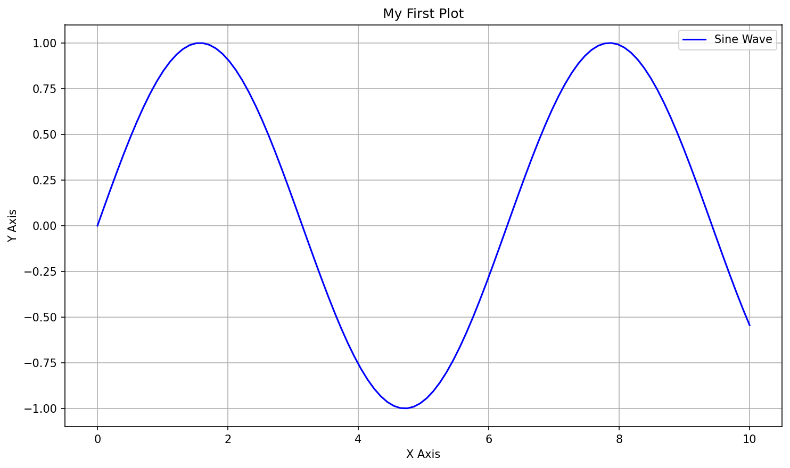

# Introduction to Data Visualization

**After this submodule:** you can use the lessons linked below and complete the exercises that match **Introduction to Data Visualization** in your course schedule.

> **Note:** This submodule starts with **why** charts work (perception, color, hierarchy), then moves to **Matplotlib** in code. Read [Visualization principles](visualization-principles.md) before [Matplotlib basics](matplotlib-basics.md) if you are new to design terms.

It now also includes a short lesson on [preparing data for visualization](data-prep-for-visualization.md) and a practical guide to [annotations and highlighting](annotations-and-highlighting.md), because a clean chart depends as much on framing and emphasis as on syntax.

## Helpful video

Context for how visualization fits into analytics and communication.

<iframe width="560" height="315" src="https://www.youtube.com/embed/RBSUwFGa6Fk" title="What is Data Science?" frameborder="0" allow="accelerometer; autoplay; clipboard-write; encrypted-media; gyroscope; picture-in-picture" allowfullscreen></iframe>

## What is Data Visualization?

Data visualization is like translating a complex story into a picture book. Just as a picture is worth a thousand words, a well-crafted visualization can communicate complex data patterns and insights in an instant. Think of it as the bridge between raw numbers and human understanding.

### Why This Matters

- **Quick Understanding**: Our brains process visual information 60,000 times faster than text
- **Better Memory**: We remember 80% of what we see, compared to 20% of what we read
- **Pattern Recognition**: Visual patterns are easier to spot than numerical patterns
- **Decision Making**: Clear visualizations lead to better, faster decisions

## Real-World Applications

### Healthcare

- **Patient Monitoring**: Tracking vital signs over time
- **Disease Outbreaks**: Mapping spread patterns
- **Treatment Effectiveness**: Comparing before/after results

### Finance

- **Market Trends**: Stock price movements
- **Budget Analysis**: Expense breakdowns
- **Investment Performance**: Portfolio comparisons

### Retail

- **Sales Patterns**: Daily/weekly/monthly trends
- **Customer Behavior**: Shopping patterns
- **Inventory Management**: Stock levels and turnover

## Core Principles

### 1. Chart Selection Guide

Think of chart selection like choosing the right tool for a job:

- **Bar Charts**: Like comparing heights of different buildings
- **Line Charts**: Like tracking a journey on a map
- **Scatter Plots**: Like plotting stars in the night sky
- **Pie Charts**: Like slicing a pizza into portions

### 2. Visual Hierarchy

Imagine a newspaper:

- **Headlines**: Big, bold, and attention-grabbing
- **Subheadings**: Supporting information
- **Body Text**: Detailed context

### 3. Color Strategy

Think of colors like a language:

- **Sequential**: Like a thermometer (light to dark)
- **Diverging**: Like a weather map (hot to cold)
- **Qualitative**: Like different types of fruit (distinct colors)

## Getting Started with Matplotlib

### Your First Plot

**Purpose:** Draw a simple sine curve with pyplot: one figure, labeled axes, legend, and grid.

**Walkthrough:** `linspace` builds x; `plot` with `'b-'` sets color and linestyle; `show()` displays in scripts.


# Import the necessary libraries
import matplotlib.pyplot as plt
import numpy as np

# Create some sample data
x = np.linspace(0, 10, 100)
y = np.sin(x)

# Create your first plot
plt.figure(figsize=(10, 6))
plt.plot(x, y, 'b-', label='Sine Wave')
plt.title('My First Plot')
plt.xlabel('X Axis')
plt.ylabel('Y Axis')
plt.legend()
plt.grid(True)
plt.show()


<aside class="code-explainer__callouts" aria-label="Code walkthrough">
  

    

      
      Imports
    

    

      
<code>matplotlib.pyplot</code> provides the plotting API; <code>numpy</code> generates the sample data points.

    

  

  

    

      
      Sample Data
    

    

      
<code>np.linspace(0, 10, 100)</code> creates 100 evenly spaced x values; <code>np.sin(x)</code> computes the y values for a sine curve.

    

  

  

    

      
      Plot Anatomy
    

    

      
<code>figure</code> sets canvas size; <code>plot</code> draws the line; <code>title</code>, <code>xlabel</code>, <code>ylabel</code>, <code>legend</code>, and <code>grid</code> add context before <code>show()</code> renders.

    

  

</aside>

### Before and After

See how a basic plot can be enhanced with proper styling and annotations:

## Learning Path

### Week 1: Foundations

- Understanding basic principles
- Preparing data at the right level for charts
- Learning chart selection
- Mastering color theory
- Grasping design fundamentals

### Week 2: Matplotlib Basics

- Creating your first plots
- Customizing plot elements
- Handling different data types
- Saving and sharing visualizations

### Week 3: Advanced Features

- Creating multiple plots
- Adding annotations and highlights
- Custom styling
- Troubleshooting layout and rendering issues

## Best Practices

### 1. Design Principles

- **Clarity**: Keep it simple and focused
- **Consistency**: Use the same style throughout
- **Context**: Provide necessary background information
- **Color**: Use colors meaningfully and accessibly

### 2. Common Mistakes to Avoid

- Overcrowding with too much information
- Using inappropriate chart types
- Poor color choices
- Missing labels or context

### 3. Accessibility Guidelines

- Use colorblind-friendly palettes
- Provide alternative text descriptions
- Ensure sufficient contrast
- Use clear, readable fonts

## Additional Resources

### Books

- "Storytelling with Data" by Cole Nussbaumer Knaflic
- "The Visual Display of Quantitative Information" by Edward Tufte
- "Data Visualization: A Practical Introduction" by Kieran Healy

### Online Courses

- DataCamp's "Introduction to Data Visualization with Python"
- Coursera's "Data Visualization and Communication"
- Udemy's "Data Visualization with Python"

### Tools

- Matplotlib: The foundation of Python visualization
- Seaborn: Statistical data visualization
- Plotly: Interactive visualizations
- Tableau: Business intelligence and analytics

## Next steps

1. Work through [Visualization principles](visualization-principles.md), then [Preparing data for visualization](data-prep-for-visualization.md), then [Matplotlib basics](matplotlib-basics.md).
2. Use [Annotations and highlighting](annotations-and-highlighting.md) to turn a correct chart into a communicative one, and use [Troubleshooting guide](troubleshooting-guide.md) when plots misbehave.
3. Continue to [3.2 Advanced data visualization](../3.2-adv-data-viz/README.md) for Seaborn, Plotly, time-series work, and a case-study workflow.
4. Use the [module assignment](../_assignments/module-assignment.md) when assigned.

Remember: The best visualizations tell a story. Focus on clarity and purpose, and let your data speak for itself.
