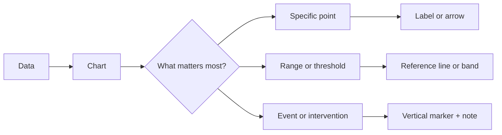
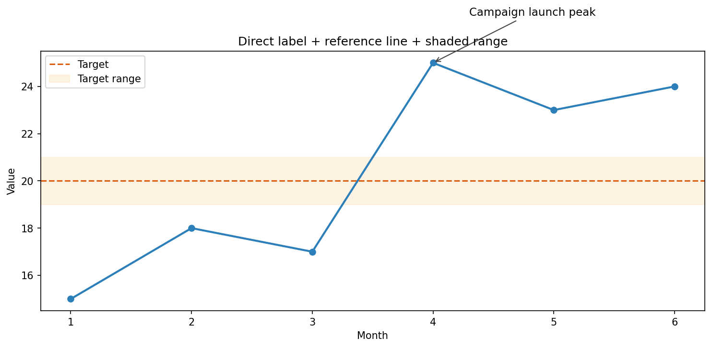
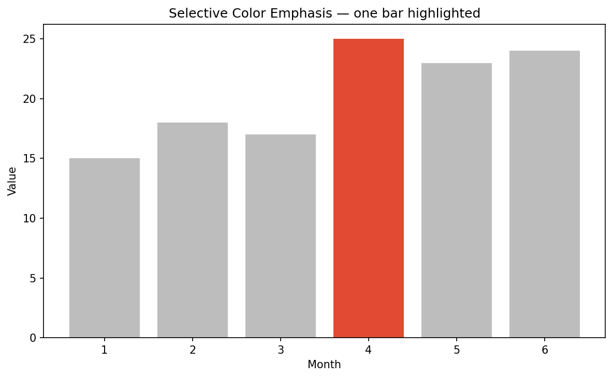
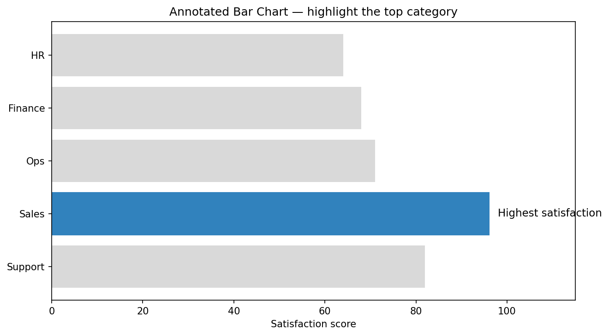
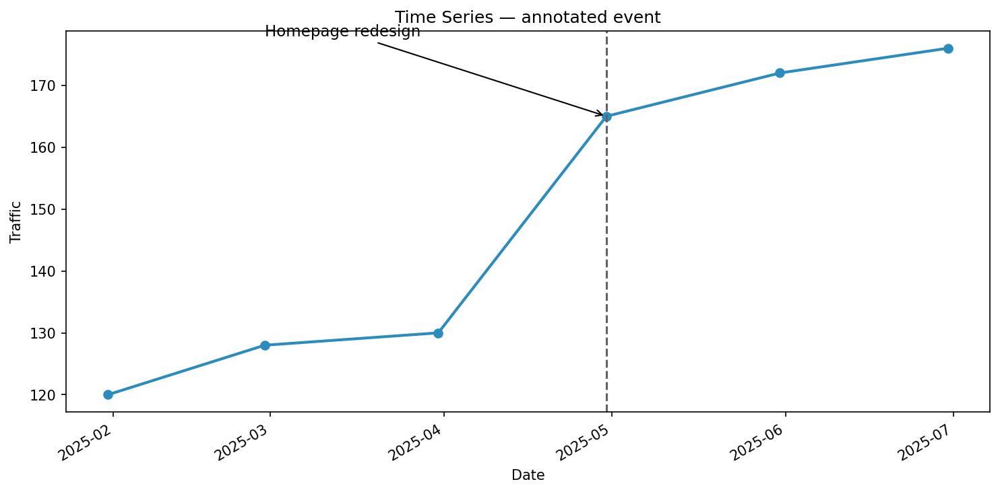

# Annotations and Highlighting

**After this lesson:** you can use labels, reference lines, shaded ranges, and selective emphasis to guide a viewer toward the main message in a chart.

> **Note:** This lesson assumes you can already build a chart. Use it after [Matplotlib basics](matplotlib-basics.md) to move from "correct chart" to "communicates the point quickly."

## Helpful video

Context for how visualization fits into analytics and communication.

<iframe width="560" height="315" src="https://www.youtube.com/embed/RBSUwFGa6Fk" title="What is Data Science?" frameborder="0" allow="accelerometer; autoplay; clipboard-write; encrypted-media; gyroscope; picture-in-picture" allowfullscreen></iframe>

## Why annotation matters

Most readers do not inspect every mark carefully. They scan. Annotation reduces the amount of scanning required.

Good highlighting does three things:

- **Points to the key takeaway**
- **Adds just enough context**
- **Reduces the need for narration outside the chart**

Think of annotation as a bridge between the chart and the sentence you want the chart to prove.

## What to emphasize

Annotate only when something deserves extra attention:

- the maximum or minimum
- a sudden change
- a benchmark or target
- a before/after event
- an outlier or exception

If everything is highlighted, nothing is highlighted.



## Core annotation tools

### 1. Direct labels

Use direct labels when the viewer should not have to bounce between the chart and a legend.

**Purpose:** Label the most important data point directly on the chart.

**Walkthrough:** `annotate` places text and an optional arrow relative to a target point.

```python
import matplotlib.pyplot as plt
import numpy as np

x = np.arange(1, 7)
y = np.array([15, 18, 17, 25, 23, 24])

fig, ax = plt.subplots(figsize=(10, 5))
ax.plot(x, y, color="#2c7fb8", linewidth=2)

peak_idx = y.argmax()
ax.annotate(
    "Campaign launch peak",
    xy=(x[peak_idx], y[peak_idx]),
    xytext=(x[peak_idx] + 0.3, y[peak_idx] + 2),
    arrowprops={"arrowstyle": "->", "color": "#444"},
    fontsize=11
)
```

### 2. Reference lines

Reference lines help viewers compare data against a target, average, or threshold.

```python
target = 20
ax.axhline(
    y=target,
    color="#d95f0e",
    linestyle="--",
    linewidth=1.5,
    label="Target"
)
```



Useful reference lines include:

- average
- target or quota
- previous period
- regulatory limit
- zero baseline when sign matters

### 3. Shaded ranges

Use shaded bands when a single threshold is not enough and a range has meaning.

```python
ax.axhspan(
    19, 21,
    color="#fee8c8",
    alpha=0.5,
    label="Target range"
)
```

Shaded ranges work well for:

- acceptable KPI bands
- confidence ranges
- holiday periods
- recession windows

### 4. Selective color emphasis

Make one series or point prominent and push the rest into the background.

```python
colors = ["#bdbdbd"] * len(y)
colors[peak_idx] = "#e34a33"

fig, ax = plt.subplots(figsize=(10, 5))
ax.bar(x, y, color=colors)
```



This is often stronger than using many bright colors.

## A before-and-after pattern

### Weak emphasis

- all bars have equal weight
- legend explains what could have been labeled directly
- no note explains why a point matters

### Strong emphasis

- one bar is highlighted
- a short label explains why
- a reference line gives context
- unnecessary visual noise is removed

## Practical examples

### Annotating a bar chart

**Purpose:** Highlight the top category in a ranking chart.

**Walkthrough:** Combine sorted bars, one accent color, and a direct label.

```python
categories = ["Support", "Sales", "Ops", "Finance", "HR"]
values = [82, 96, 71, 68, 64]

fig, ax = plt.subplots(figsize=(10, 5))
bars = ax.barh(categories, values, color="#d9d9d9")
bars[1].set_color("#3182bd")

ax.annotate(
    "Highest satisfaction",
    xy=(values[1], categories[1]),
    xytext=(values[1] + 2, 1),
    va="center",
    fontsize=11
)
```



### Annotating a time series

**Purpose:** Mark an event date and explain the change after it.

**Walkthrough:** `axvline` marks the event; `annotate` connects the text to the affected period.

```python
dates = pd.date_range("2025-01-01", periods=6, freq="M")
traffic = [120, 128, 130, 165, 172, 176]

fig, ax = plt.subplots(figsize=(10, 5))
ax.plot(dates, traffic, marker="o", linewidth=2, color="#2b8cbe")

event_date = dates[3]
ax.axvline(event_date, color="#636363", linestyle="--")
ax.annotate(
    "Homepage redesign",
    xy=(event_date, traffic[3]),
    xytext=(dates[1], 178),
    arrowprops={"arrowstyle": "->"},
    fontsize=11
)
```



## Writing annotation text

Keep annotation text short and interpretive:

- Better: `"Orders increased after free shipping launch"`
- Worse: `"Value = 176 on June"`

The chart already shows the raw value. The annotation should explain why it matters.

## Common mistakes

- Labeling too many points.
- Using paragraphs instead of short notes.
- Highlighting with color only, without shape or label reinforcement.
- Adding reference lines with no explanation.
- Placing annotations where they cover marks or axes.

## Accessibility notes

- Do not rely on color alone to indicate emphasis.
- Use readable text sizes and sufficient contrast.
- Prefer direct labels when legends create extra scanning.
- Keep arrows and markers simple and high contrast.

## Practice prompts

1. Add a target line and a short note to a KPI chart.
2. Highlight the largest bar in a ranking chart without changing every bar color.
3. Mark an intervention date on a line chart and explain the post-event pattern.
4. Rewrite three annotations so they explain meaning, not just values.

## Next steps

1. Use [Troubleshooting guide](troubleshooting-guide.md) when annotations overlap or layout breaks.
2. Use [Seaborn guide](../3.2-adv-data-viz/seaborn-guide.md) and [Plotly guide](../3.2-adv-data-viz/plotly-guide.md) to apply the same highlighting ideas in richer charts.
3. Use [Real-world case study](../3.2-adv-data-viz/real-world-case-study.md) to see annotation choices in a complete analysis workflow.
