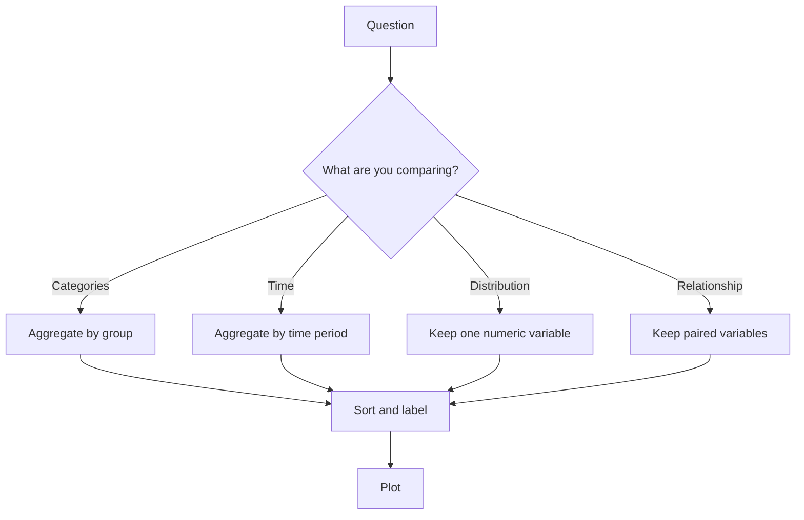

# Preparing Data for Visualization

**After this lesson:** you can reshape, sort, aggregate, and clean data so your charts answer the intended question instead of just plotting raw tables.

> **Note:** This lesson sits between [Visualization principles](visualization-principles.md) and [Matplotlib basics](matplotlib-basics.md). Good charts start with good framing, and good framing usually starts with preparing the data first.

## Helpful video

Context for how visualization fits into analytics and communication.

<iframe width="560" height="315" src="https://www.youtube.com/embed/RBSUwFGa6Fk" title="What is Data Science?" frameborder="0" allow="accelerometer; autoplay; clipboard-write; encrypted-media; gyroscope; picture-in-picture" allowfullscreen></iframe>

## Why data prep matters

A chart can be technically correct and still be misleading. Many visualization problems come from plotting the wrong level of detail, leaving categories unsorted, mixing missing values into summaries, or skipping the aggregation step that matches the business question.

Think of data prep as deciding what story the chart is allowed to tell:

- **Granularity:** Are you plotting rows, daily totals, or monthly averages?
- **Ordering:** Does the viewer see a meaningful sequence or a random one?
- **Completeness:** Are missing values handled consistently?
- **Comparability:** Are categories and units aligned before plotting?

## Start with the question

Before writing plotting code, state the question in one sentence.

- "Which product category generated the most revenue last quarter?"
- "How does order value vary by payment method?"
- "Did weekly traffic change after the campaign launch?"

That sentence determines the data shape you need.



## Core preparation patterns

### 1. Inspect the dataset first

**Purpose:** Check column names, data types, missing values, and duplicate rows before plotting.

**Walkthrough:** Use `info`, `isna`, and `duplicated` to catch problems that would later produce broken axes, empty categories, or misleading counts.

```python
import pandas as pd

def inspect_for_viz(df):
    summary = {
        "shape": df.shape,
        "columns": df.columns.tolist(),
        "missing_values": df.isna().sum(),
        "duplicate_rows": int(df.duplicated().sum()),
        "dtypes": df.dtypes.astype(str)
    }
    return summary
```

### 2. Filter to the relevant slice

**Purpose:** Remove rows outside the question's scope before summarizing.

**Walkthrough:** Filtering first avoids mixing time periods, regions, or statuses that should not be compared.

```python
sales_2025 = sales.loc[
    (sales["order_date"] >= "2025-01-01")
    & (sales["order_date"] < "2026-01-01")
    & (sales["status"] == "completed")
].copy()
```

### 3. Aggregate to the right level

**Purpose:** Turn transaction-level rows into chart-ready summaries.

**Walkthrough:** `groupby(...).agg(...)` creates one row per visual mark when the question is about category totals or averages.

```python
category_summary = (
    sales_2025
    .groupby("category", as_index=False)
    .agg(
        revenue=("revenue", "sum"),
        orders=("order_id", "nunique"),
        avg_order_value=("revenue", "mean")
    )
)
```

### 4. Sort for readability

**Purpose:** Make rankings and comparisons obvious.

**Walkthrough:** Most bar charts are easier to read when sorted by the metric being compared rather than alphabetically.

```python
top_categories = (
    category_summary
    .sort_values("revenue", ascending=False)
    .head(10)
)
```

### 5. Reshape when needed

**Purpose:** Convert wide tables into long form for libraries like Seaborn and Plotly Express.

**Walkthrough:** `melt` is especially useful when several metric columns should become one "metric" column and one "value" column.

```python
monthly_wide = pd.DataFrame({
    "month": ["Jan", "Feb", "Mar"],
    "sales": [120, 150, 170],
    "returns": [5, 7, 6]
})

monthly_long = monthly_wide.melt(
    id_vars="month",
    value_vars=["sales", "returns"],
    var_name="metric",
    value_name="value"
)
```

## Handling common issues

### Missing values

- Drop rows when missingness is rare and clearly accidental.
- Impute only when the business meaning supports it.
- Leave gaps in time series when showing missingness is informative.

```python
plot_df = orders.dropna(subset=["order_value", "segment"]).copy()
```

### Long category tails

Too many categories create unreadable charts. Group small groups into `"Other"` or show only the top `n`.

```python
top_names = (
    sales_2025["product_name"]
    .value_counts()
    .head(8)
    .index
)

sales_2025["product_group"] = sales_2025["product_name"].where(
    sales_2025["product_name"].isin(top_names),
    "Other"
)
```

### Dates stored as strings

Convert them before grouping or plotting.

```python
traffic["date"] = pd.to_datetime(traffic["date"])
traffic["month"] = traffic["date"].dt.to_period("M").astype(str)
```

## Chart-ready examples

### Comparison chart prep

**Purpose:** Prepare a sorted category table for a horizontal bar chart.

**Walkthrough:** Filter, aggregate, sort, and keep only the columns needed for plotting.

```python
bar_ready = (
    sales.loc[sales["region"] == "Central"]
    .groupby("category", as_index=False)
    .agg(revenue=("revenue", "sum"))
    .sort_values("revenue", ascending=True)
)
```

### Distribution chart prep

**Purpose:** Prepare one clean numeric series for a histogram or box plot.

**Walkthrough:** Remove impossible values and preserve only the variable the distribution chart needs.

```python
distribution_ready = (
    orders.loc[orders["order_value"].between(0, 1000), ["order_value"]]
    .dropna()
)
```

### Relationship chart prep

**Purpose:** Keep only paired numeric observations for a scatter plot.

**Walkthrough:** Scatter plots require matching `x` and `y` values; dropping nulls on both columns prevents broken points.

```python
scatter_ready = (
    marketing[["ad_spend", "revenue", "channel"]]
    .dropna(subset=["ad_spend", "revenue"])
)
```

## A reusable preparation checklist

Use this before every chart:

1. What exact question is the chart answering?
2. What should one mark represent: a row, a group, or a time period?
3. Which rows should be excluded?
4. Which columns need to be transformed or reshaped?
5. Is the result sorted in the order the viewer expects?
6. Are missing values, duplicates, and units handled clearly?

## Common mistakes

- Plotting raw transactional rows when the question needs grouped totals.
- Leaving categories unsorted so rankings are hard to scan.
- Mixing incomplete and complete periods in the same time chart.
- Using wide-form data with a library example that expects long-form data.
- Treating missing values as zero without checking what they mean.

## Practice prompts

1. Prepare a category summary from a sales table and sort it for a bar chart.
2. Convert a daily dataset into monthly totals for a line chart.
3. Reshape a wide KPI table into long form for a Seaborn grouped plot.
4. Clean a numeric column with missing and impossible values before drawing a histogram.

## Next steps

1. Use [Matplotlib basics](matplotlib-basics.md) to turn prepared tables into clean static charts.
2. Use [Annotations and highlighting](annotations-and-highlighting.md) to direct attention to the most important points in those charts.
3. Use [3.2 Advanced data visualization](../3.2-adv-data-viz/README.md) once your data prep workflow feels natural.
