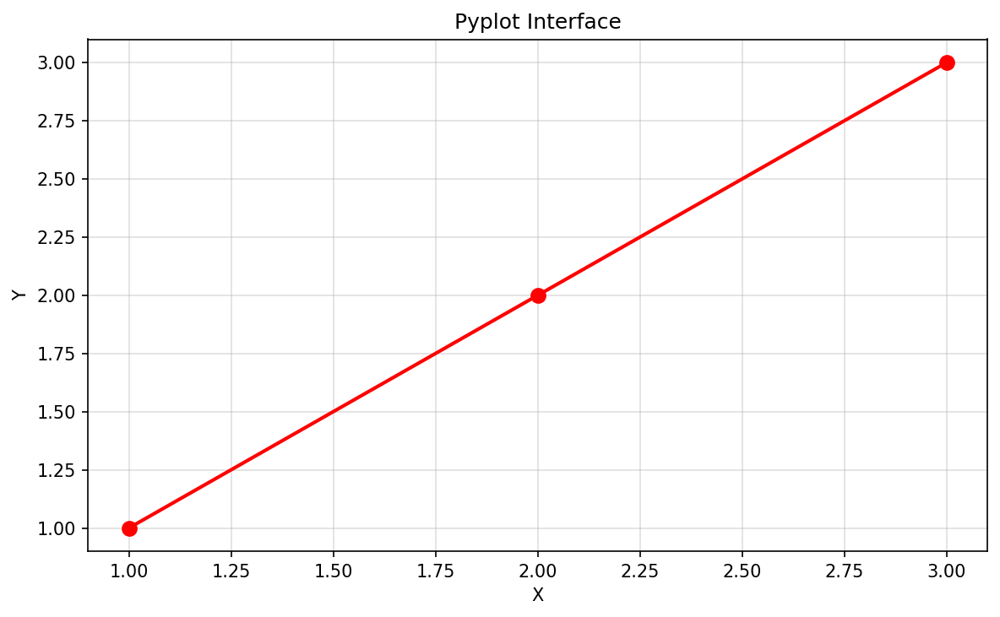
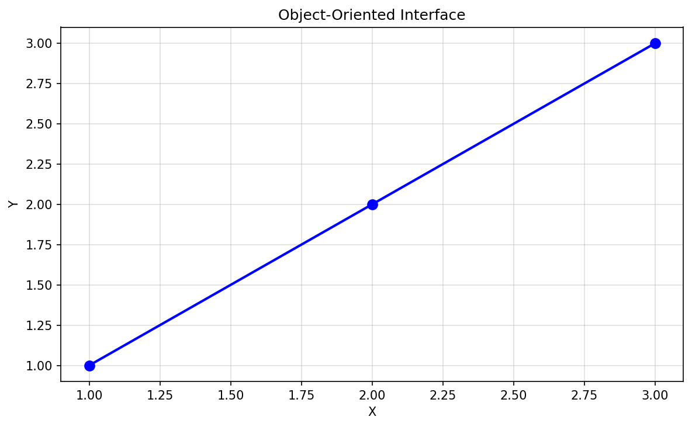
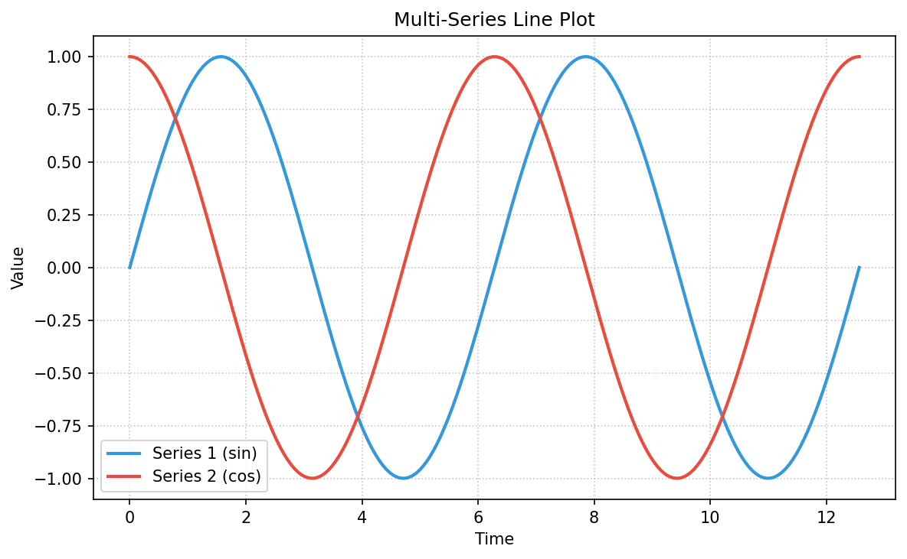
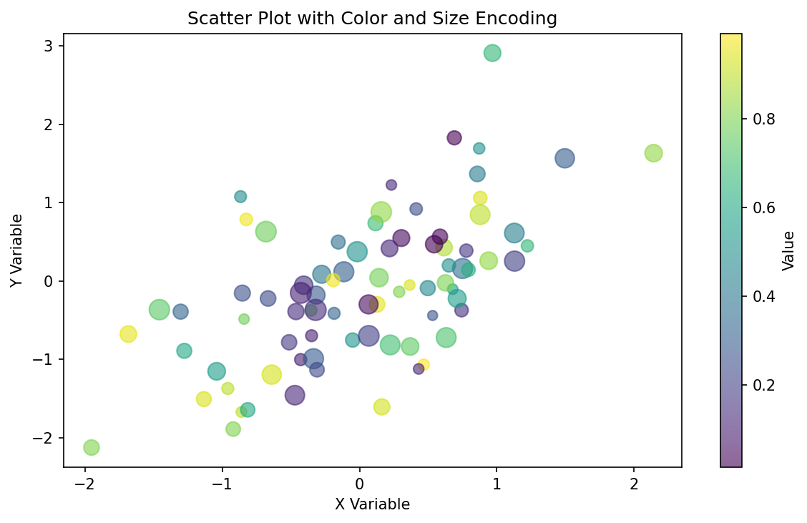
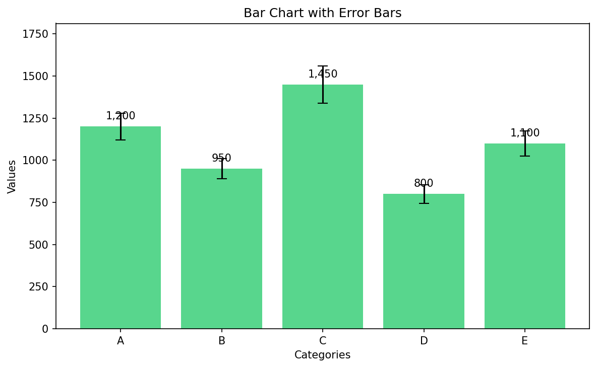

# Getting Started with Matplotlib

**After this lesson:** you can explain the core ideas in “Getting Started with Matplotlib” and reproduce the examples here in your own notebook or environment.

> **Note:** This lesson is **code-first**. You will type Python to control figures, axes, and styles. Skim [Visualization principles](visualization-principles.md) first if you are unsure *why* certain choices make charts easier to read.

## Helpful video

Creating and customizing your first matplotlib plots — figures, labels, titles, legends, and styling.

<iframe width="560" height="315" src="https://www.youtube.com/embed/UO98lJQ3QGI" title="Matplotlib Tutorial Part 1 — Corey Schafer" frameborder="0" allow="accelerometer; autoplay; clipboard-write; encrypted-media; gyroscope; picture-in-picture" allowfullscreen></iframe>

## What is Matplotlib?

Matplotlib is like a digital artist's canvas for data. It's Python's most popular plotting library, allowing you to create beautiful, publication-quality visualizations. Think of it as your paintbrush for turning numbers into pictures.

### Why This Matters

- **Industry Standard**: Most widely used Python plotting library
- **Flexibility**: Can create almost any type of visualization
- **Integration**: Works seamlessly with other data science libraries
- **Customization**: Highly customizable for professional results

## Your First Steps

### Setting Up Your Environment

**Purpose:** Import Matplotlib and NumPy, enable inline figures in Jupyter, and apply a consistent default style.

**Walkthrough:** `%matplotlib inline` is IPython/Jupyter magic; `plt.style.use` applies a named style sheet to subsequent figures.

```python
# Essential imports - think of these as your art supplies
import matplotlib.pyplot as plt
import numpy as np

# For Jupyter notebooks - this ensures plots appear in your notebook
%matplotlib inline

# Set a professional style - like choosing a good canvas
plt.style.use('seaborn-v0_8-whitegrid')
```



*Key rule: `plt.subplots()` returns a Figure and one or more Axes objects. Do all your drawing on the Axes — the Figure just holds them.*

### Understanding the Basics

Think of a Matplotlib plot like a painting:

- **Figure**: The entire canvas
- **Axes**: The area where you draw
- **Title**: The name of your artwork
- **Labels**: Descriptions of what you're showing
- **Legend**: A guide to your colors and symbols

## Creating Your First Plot

### Simple Line Plot

**Purpose:** Build one sine curve with the object-oriented API: figure/axes, styled line, labels, grid, and legend.

**Walkthrough:** `subplots` returns `(fig, ax)`; plotting goes on `ax`; `label` + `legend()` explains the curve.

<div class="code-explainer" data-code-explainer>
<div class="code-explainer__code">


def create_simple_plot():
    # Create sample data - like preparing your paint
    x = np.linspace(0, 10, 100)  # 100 points from 0 to 10
    y = np.sin(x)                # Sine wave
    
    # Create figure and axes - set up your canvas
    fig, ax = plt.subplots(figsize=(10, 6))
    
    # Plot data - start painting
    ax.plot(x, y, 
           color='#2ecc71',    # Emerald green
           linewidth=2,        # Thicker line
           linestyle='-',      # Solid line
           label='sin(x)')     # Legend label
    
    # Add finishing touches
    ax.set_title('My First Plot', 
                fontsize=14, 
                pad=15)
    ax.set_xlabel('X Axis')
    ax.set_ylabel('Y Axis')
    ax.grid(True, linestyle='--', alpha=0.7)
    ax.legend()

    return fig, ax


</div>
<aside class="code-explainer__callouts" aria-label="Code walkthrough">
  <div class="code-callout" data-lines="6-7" data-tint="1">
    <div class="code-callout__meta">
      <span class="code-callout__lines"></span>
      <span class="code-callout__title">Figure and axes</span>
    </div>
    <div class="code-callout__body">
      <p><code>plt.subplots()</code> returns two objects: the <strong>figure</strong> (the whole window) and the <strong>axes</strong> (the drawing area). Always keep a reference to <code>ax</code> — the object-oriented API lets you control multiple subplots precisely.</p>
    </div>
  </div>
  <div class="code-callout" data-lines="9-14" data-tint="2">
    <div class="code-callout__meta">
      <span class="code-callout__lines"></span>
      <span class="code-callout__title">Plot with styling</span>
    </div>
    <div class="code-callout__body">
      <p><code>ax.plot()</code> draws a line through the (x, y) pairs. Keyword arguments control appearance: <code>color</code> accepts hex or names, <code>linewidth</code> scales thickness, <code>label</code> is what appears in the legend.</p>
    </div>
  </div>
  <div class="code-callout" data-lines="16-23" data-tint="3">
    <div class="code-callout__meta">
      <span class="code-callout__lines"></span>
      <span class="code-callout__title">Labels and grid</span>
    </div>
    <div class="code-callout__body">
      <p><code>set_title</code>, <code>set_xlabel</code>, <code>set_ylabel</code> annotate the chart. <code>grid(alpha=0.7)</code> draws faint reference lines. <code>legend()</code> reads the <code>label</code> strings you set in each <code>plot()</code> call.</p>
    </div>
  </div>
</aside>
</div>

### Understanding the Code

Let's break down what each part does:

1. **Data Creation**: `np.linspace(0, 10, 100)` creates 100 evenly spaced points
2. **Figure Setup**: `plt.subplots()` creates a new figure and axes
3. **Plotting**: `ax.plot()` draws the line
4. **Customization**: `ax.set_title()`, `ax.set_xlabel()`, etc. add labels
5. **Grid and Legend**: `ax.grid()` and `ax.legend()` add helpful guides

## The Two Ways to Plot

### 1. MATLAB-style (pyplot)

Think of this as quick sketching:

**Purpose:** See the stateful `pyplot` workflow: one global figure, `plot`, then `show()`.

**Walkthrough:** `'ro-'` is format shorthand (color, marker, linestyle); quick for scripts, less explicit than the OO API.

```python
def pyplot_example():
    plt.figure(figsize=(10, 6))
    plt.plot([1, 2, 3], [1, 2, 3], 'ro-')
    plt.title('Pyplot Interface')
    plt.xlabel('X')
    plt.ylabel('Y')
    plt.grid(True)
    plt.show()
```



### 2. Object-Oriented

Think of this as detailed painting:

**Purpose:** Same geometry as the pyplot example but all drawing goes through an `Axes` object—preferred for multi-panel figures.

**Walkthrough:** `subplots` creates `ax`; methods are `set_title`/`set_xlabel` instead of `plt.title`.

```python
def object_oriented_example():
    fig, ax = plt.subplots(figsize=(10, 6))
    ax.plot([1, 2, 3], [1, 2, 3], 'bo-')
    ax.set_title('Object-Oriented Interface')
    ax.set_xlabel('X')
    ax.set_ylabel('Y')
    ax.grid(True)
    return fig, ax
```



## Essential Plot Types

### 1. Line Plots

Perfect for showing trends over time:

**Purpose:** Overlay two series on shared axes with distinct colors and a legend.

**Walkthrough:** Two `ax.plot` calls; `grid` uses dotted lines; `legend` picks up `label=` strings.

```python
def create_line_plot(x, y1, y2):
    """Create a professional line plot with multiple series"""
    fig, ax = plt.subplots(figsize=(10, 6))

    # Plot multiple lines
    ax.plot(x, y1,
           color='#3498db',  # Blue
           label='Series 1',
           linewidth=2)
    ax.plot(x, y2,
           color='#e74c3c',  # Red
           label='Series 2',
           linewidth=2)

    # Customize
    ax.set_title('Multi-Series Line Plot')
    ax.set_xlabel('Time')
    ax.set_ylabel('Value')
    ax.grid(True, linestyle=':', alpha=0.7)
    ax.legend()

    return fig, ax
```



### 2. Scatter Plots

Great for showing relationships between variables:

**Purpose:** Encode two continuous variables as position, plus optional color and size channels, with a colorbar legend.

**Walkthrough:** `scatter` returns a `PathCollection`; pass it to `colorbar`; `cmap` controls the gradient.

```python
def create_scatter_plot(x, y, colors, sizes):
    """Create an informative scatter plot"""
    fig, ax = plt.subplots(figsize=(10, 6))
    
    scatter = ax.scatter(x, y,
                        c=colors,           # Color mapping
                        s=sizes,            # Size mapping
                        alpha=0.6,          # Transparency
                        cmap='viridis')     # Color scheme
    
    # Add colorbar
    plt.colorbar(scatter, label='Value')
    
    # Customize
    ax.set_title('Scatter Plot with Color and Size Encoding')
    ax.set_xlabel('X Variable')
    ax.set_ylabel('Y Variable')
    
    return fig, ax
```



### 3. Bar Charts

Ideal for comparing categories:

**Purpose:** Draw vertical bars with optional error bars and numeric labels on top of each bar.

**Walkthrough:** `bar` accepts `yerr`/`capsize`; the loop uses `bar.get_x()` and `get_width()` to center text.

```python
def create_bar_chart(categories, values, errors=None):
    """Create a professional bar chart"""
    fig, ax = plt.subplots(figsize=(10, 6))
    
    # Create bars
    bars = ax.bar(categories, 
                  values,
                  yerr=errors,          # Error bars
                  capsize=5,            # Error bar caps
                  color='#2ecc71',      # Bar color
                  alpha=0.8)            # Transparency
    
    # Add value labels on top of bars
    for bar in bars:
        height = bar.get_height()
        ax.text(bar.get_x() + bar.get_width()/2.,
                height,
                f'{height:,.0f}',
                ha='center', va='bottom')
    
    # Customize
    ax.set_title('Bar Chart with Error Bars')
    ax.set_xlabel('Categories')
    ax.set_ylabel('Values')

    return fig, ax
```



## Styling and Customization

### Color Palettes

Think of colors as your paint palette:

**Purpose:** Keep named hex lists ready for categorical series, pastels, or grayscale layouts.

**Walkthrough:** This dict is data only—index into it when assigning `color=` to plots.

```python
# Professional color schemes
color_schemes = {
    'main_colors': ['#2ecc71', '#3498db', '#e74c3c', '#f1c40f', '#9b59b6'],
    'pastel_colors': ['#a8e6cf', '#dcedc1', '#ffd3b6', '#ffaaa5', '#ff8b94'],
    'grayscale': ['#212121', '#424242', '#616161', '#757575', '#9e9e9e']
}
```

### Text Styling

Make your text clear and readable:

**Purpose:** Centralize title/label sizing and tick fontsize so every subplot in a dashboard matches.

**Walkthrough:** Reads existing title/label strings with `get_*` before re-applying with new sizes; `tick_params` adjusts tick numbers.

```python
def style_text(ax, title_size=14, label_size=12):
    """Apply professional text styling"""
    ax.set_title(ax.get_title(), 
                fontsize=title_size,
                pad=15,
                fontweight='bold')
    
    ax.set_xlabel(ax.get_xlabel(),
                 fontsize=label_size,
                 labelpad=10)
    
    ax.set_ylabel(ax.get_ylabel(),
                 fontsize=label_size,
                 labelpad=10)
    
    ax.tick_params(labelsize=10)
```

## Creating Multiple Plots

### Dashboard Layout

Think of this as creating a gallery of related plots:

**Purpose:** Reserve a 2×2 grid where one subplot spans the full bottom row for a wide chart.

**Walkthrough:** `add_gridspec` defines geometry; `add_subplot(gs[row,col])` places axes; bottom spans columns with `gs[1, :]`.

```python
def create_dashboard():
    """Create a dashboard with multiple plots"""
    # Create figure with grid
    fig = plt.figure(figsize=(15, 10))
    gs = fig.add_gridspec(2, 2, hspace=0.3, wspace=0.3)
    
    # Add subplots
    ax1 = fig.add_subplot(gs[0, 0])  # Line plot
    ax2 = fig.add_subplot(gs[0, 1])  # Scatter plot
    ax3 = fig.add_subplot(gs[1, :])  # Bar plot spanning bottom
    
    # Style each subplot
    for ax in [ax1, ax2, ax3]:
        ax.grid(True, linestyle=':', alpha=0.7)
        style_text(ax)
    
    return fig, (ax1, ax2, ax3)
```

## Saving Your Work

### High-Quality Exports

Save your visualizations for different purposes:

**Purpose:** Export the same figure to raster (PNG) and vector (PDF) with tight bounding boxes.

**Walkthrough:** `savefig` on the `Figure` object; `bbox_inches='tight'` crops padding; `transparent=True` for slides.

```python
def save_plot(fig, filename, dpi=300):
    """Save plot in multiple formats with best practices"""
    # Save as PNG for web
    fig.savefig(f'{filename}.png',
                dpi=dpi,
                bbox_inches='tight',
                transparent=True)
    
    # Save as PDF for publications
    fig.savefig(f'{filename}.pdf',
                bbox_inches='tight',
                transparent=True)
```

## Best Practices

### 1. Planning Your Plot

- Start with a clear purpose
- Choose the right chart type
- Plan your color scheme
- Consider your audience

### 2. Code Organization

- Use functions for reusable plots
- Keep your code clean and documented
- Use consistent naming conventions
- Comment complex operations

### 3. Common Mistakes to Avoid

- Overcrowding with too much data
- Using inappropriate chart types
- Poor color choices
- Missing labels or context

## Next steps

1. Continue to [3.2 Advanced data visualization](../3.2-adv-data-viz/README.md) (Seaborn and Plotly).
2. Reinforce chart choice with [Choosing the right visualization](../choosing-the-right-visualization.md) and [Common mistakes](../common-mistakes.md).

Remember: The best visualizations are clear, informative, and tell a story. Start simple, focus on your message, and let your data guide your design decisions.
