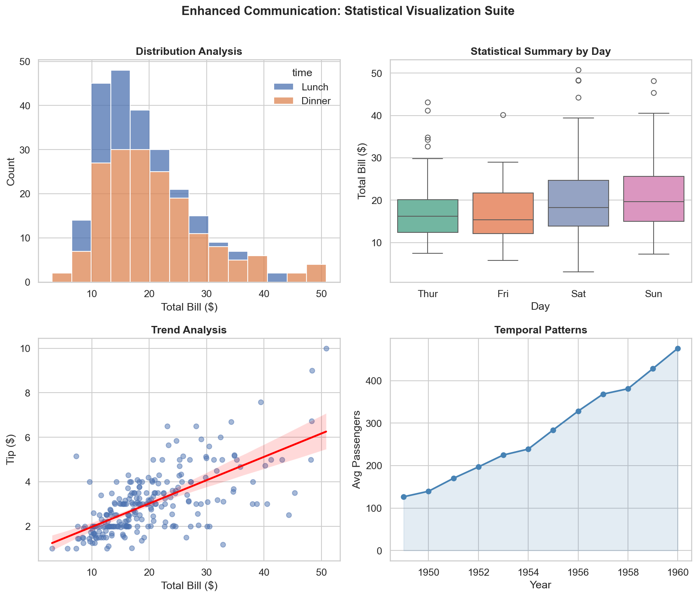

# Advanced Data Visualization

**After this submodule:** you can use the lessons linked below and complete the exercises that match **Advanced Data Visualization** in your course schedule.

## Overview

This submodule is **code-first**: you will write Python with **Seaborn** (statistical plots on top of Matplotlib) and **Plotly** (interactive charts and small dashboards). Think of it as moving from simple static plots to richer, exploratory, and interactive visuals, then applying them to time-based analysis and a realistic business case.

> **Time needed:** Plan several hours to work through both guides and run the examples in a notebook.

**Submodule map**

**Purpose:** Show how this folder splits statistical (Seaborn) work, interactive (Plotly) work, and applied practice.

**Walkthrough:** Diagram only—not code.

```yaml
Module Structure:
┌─────────────────────────┐
│ Statistical Analysis   │ → Seaborn Mastery
├─────────────────────────┤
│ Interactive Plots     │ → Plotly Excellence
├─────────────────────────┤
│ Time Series           │ → Trends, seasonality, events
├─────────────────────────┤
│ Real-world Projects   │ → Applied Learning
└─────────────────────────┘
```

## Prerequisites

- [3.1 Intro to data visualization](../3.1-intro-data-viz/README.md): Matplotlib comfort and chart-choice basics.
- [3.1 Preparing data for visualization](../3.1-intro-data-viz/data-prep-for-visualization.md): chart-ready summaries and reshaping.
- Python environment with **matplotlib**, **pandas**, and (after install) **seaborn** and **plotly**.

## Why advanced visualization?

### Data Communication Impact

**Purpose:** Contrast a single static line on `x`/`y` with a Plotly Express scatter that adds size, color, animation, hover fields, and a trendline.

**Walkthrough:** Assumes `plt` and `data` exist; `trendline='ols'` requires `statsmodels` in the environment for Plotly 5+.

<div class="code-explainer" data-code-explainer>
<div class="code-explainer__code">


# Example: Basic vs Advanced Visualization
import seaborn as sns
import plotly.express as px

# Basic Plot
plt.figure(figsize=(8, 4))
plt.plot(data['x'], data['y'])

# Advanced Plot
fig = px.scatter(data,
                 x='x', y='y',
                 size='value',
                 color='category',
                 animation_frame='time',
                 hover_data=['details'],
                 trendline='ols')


</div>
<aside class="code-explainer__callouts" aria-label="Code walkthrough">
  <div class="code-callout" data-lines="1-3" data-tint="1">
    <div class="code-callout__meta">
      <span class="code-callout__lines"></span>
      <span class="code-callout__title">Imports</span>
    </div>
    <div class="code-callout__body">
      <p>Importing both <code>seaborn</code> and <code>plotly.express</code> sets up the two main advanced visualization libraries.</p>
    </div>
  </div>
  <div class="code-callout" data-lines="5-7" data-tint="2">
    <div class="code-callout__meta">
      <span class="code-callout__lines"></span>
      <span class="code-callout__title">Basic Matplotlib Plot</span>
    </div>
    <div class="code-callout__body">
      <p>Two lines with no color, animation, or interactivity—the baseline for comparison.</p>
    </div>
  </div>
  <div class="code-callout" data-lines="9-16" data-tint="3">
    <div class="code-callout__meta">
      <span class="code-callout__lines"></span>
      <span class="code-callout__title">Advanced Plotly Scatter</span>
    </div>
    <div class="code-callout__body">
      <p><code>size</code>, <code>color</code>, <code>animation_frame</code>, and <code>hover_data</code> encode four dimensions in one interactive chart; <code>trendline='ols'</code> adds a regression line.</p>
    </div>
  </div>
</aside>
</div>

### Key Benefits

#### 1. Complex Story Simplification

**Purpose:** List visualization strategies you gain moving beyond single static charts—facets, interaction, layering.

**Walkthrough:** Reference checklist when scoping a dashboard or report.

```yaml
Techniques:
  Multi-dimensional:
    - Bubble plots
    - 3D visualizations
    - Faceted plots
    
  Interactive:
    - Zoom/Pan
    - Tooltips
    - Filters
    
  Layered:
    - Multiple plots
    - Overlays
    - Annotations
```

#### 2. Modern Data Solutions

**Purpose:** Sketch a Plotly figure with a live-updatable trace and an animation-style menu hook—pattern for streaming dashboards.

**Walkthrough:** `update_data` would be wired to your data source; `method: animate` expects frames if you use Plotly’s animation API fully.

<div class="code-explainer" data-code-explainer>
<div class="code-explainer__code">


# Example: Real-time Dashboard
def create_realtime_dashboard(data_stream):
    """Create auto-updating dashboard"""
    fig = go.Figure()

    # Add real-time trace
    fig.add_trace(
        go.Scatter(
            x=[], y=[],
            mode='lines+markers',
            name='Live Data'
        )
    )

    # Add update functionality
    def update_data(frame):
        fig.data[0].x = frame['time']
        fig.data[0].y = frame['value']

    # Configure updates
    fig.update_layout(
        updatemenus=[{
            "type": "buttons",
            "showactive": False,
            "buttons": [{
                "label": "Play",
                "method": "animate"
            }]
        }]
    )

    return fig


</div>
<aside class="code-explainer__callouts" aria-label="Code walkthrough">
  <div class="code-callout" data-lines="1-2" data-tint="1">
    <div class="code-callout__meta">
      <span class="code-callout__lines"></span>
      <span class="code-callout__title">Figure Initialization</span>
    </div>
    <div class="code-callout__body">
      <p>A blank <code>go.Figure()</code> serves as the canvas; traces and layout are added incrementally.</p>
    </div>
  </div>
  <div class="code-callout" data-lines="4-13" data-tint="2">
    <div class="code-callout__meta">
      <span class="code-callout__lines"></span>
      <span class="code-callout__title">Live Trace</span>
    </div>
    <div class="code-callout__body">
      <p>An empty <code>go.Scatter</code> with <code>x=[], y=[]</code> is a placeholder; <code>update_data</code> populates it when new frames arrive.</p>
    </div>
  </div>
  <div class="code-callout" data-lines="15-18" data-tint="3">
    <div class="code-callout__meta">
      <span class="code-callout__lines"></span>
      <span class="code-callout__title">Update Callback</span>
    </div>
    <div class="code-callout__body">
      <p>Replaces the trace's <code>x</code> and <code>y</code> arrays in place; wire this to your data source or Dash callback for streaming.</p>
    </div>
  </div>
  <div class="code-callout" data-lines="20-30" data-tint="4">
    <div class="code-callout__meta">
      <span class="code-callout__lines"></span>
      <span class="code-callout__title">Play Button</span>
    </div>
    <div class="code-callout__body">
      <p><code>updatemenus</code> adds an animation-style Play button; <code>method: "animate"</code> triggers Plotly's built-in frame stepping.</p>
    </div>
  </div>
</aside>
</div>




#### 3. Enhanced Communication

**Purpose:** One 2×2 Seaborn panel: stacked histogram, box plot by category, regression overlay, and multi-series line plot.

**Walkthrough:** Expects columns `value`, `category`, `x`, `y`, `time` in `data`; tighten column names to match your frame.

<div class="code-explainer" data-code-explainer>
<div class="code-explainer__code">


# Example: Statistical Visualization
def create_statistical_plot(data):
    """Create comprehensive statistical visualization"""
    # Create figure with subplots
    fig, ((ax1, ax2), (ax3, ax4)) = plt.subplots(2, 2, figsize=(15, 12))

    # 1. Distribution
    sns.histplot(data=data, x='value', hue='category',
                multiple="stack", ax=ax1)
    ax1.set_title('Distribution Analysis')

    # 2. Box Plot
    sns.boxplot(data=data, x='category', y='value',
               ax=ax2)
    ax2.set_title('Statistical Summary')

    # 3. Regression
    sns.regplot(data=data, x='x', y='y',
               scatter_kws={'alpha':0.5},
               line_kws={'color': 'red'},
               ax=ax3)
    ax3.set_title('Trend Analysis')

    # 4. Time Series
    sns.lineplot(data=data, x='time', y='value',
                hue='category', style='category',
                ax=ax4)
    ax4.set_title('Temporal Patterns')

    plt.tight_layout()
    return fig


</div>
<aside class="code-explainer__callouts" aria-label="Code walkthrough">
  <div class="code-callout" data-lines="1-5" data-tint="1">
    <div class="code-callout__meta">
      <span class="code-callout__lines"></span>
      <span class="code-callout__title">2×2 Grid Setup</span>
    </div>
    <div class="code-callout__body">
      <p><code>plt.subplots(2, 2)</code> unpacks four axes into named variables so each panel can be targeted independently.</p>
    </div>
  </div>
  <div class="code-callout" data-lines="7-10" data-tint="2">
    <div class="code-callout__meta">
      <span class="code-callout__lines"></span>
      <span class="code-callout__title">Stacked Histogram</span>
    </div>
    <div class="code-callout__body">
      <p><code>multiple="stack"</code> stacks category bars rather than overlapping them, keeping the total height meaningful.</p>
    </div>
  </div>
  <div class="code-callout" data-lines="12-20" data-tint="3">
    <div class="code-callout__meta">
      <span class="code-callout__lines"></span>
      <span class="code-callout__title">Box Plot and Regression</span>
    </div>
    <div class="code-callout__body">
      <p>The box plot summarizes per-category spread; <code>regplot</code> overlays a scatter plus OLS trend line in a single call.</p>
    </div>
  </div>
  <div class="code-callout" data-lines="22-30" data-tint="4">
    <div class="code-callout__meta">
      <span class="code-callout__lines"></span>
      <span class="code-callout__title">Time Series Panel</span>
    </div>
    <div class="code-callout__body">
      <p><code>hue</code> and <code>style</code> together differentiate categories by both color and line dash, aiding color-blind readers.</p>
    </div>
  </div>
</aside>
</div>

## Module content

### 1. Statistical Visualization with Seaborn

**Purpose:** Outline which Seaborn families appear in [seaborn-guide.md](seaborn-guide.md).

**Walkthrough:** Use as a checklist while reading the guide.

```yaml
Topics:
  Distribution Analysis:
    - Histograms and KDE
    - Box and Violin plots
    - ECDF plots
    
  Relationship Analysis:
    - Scatter plots
    - Regression plots
    - Pair plots
    
  Categorical Analysis:
    - Bar plots
    - Count plots
    - Strip plots
    
  Matrix Analysis:
    - Heat maps
    - Cluster maps
    - Joint plots
```

### 2. Interactive Visualization with Plotly

**Purpose:** Outline Plotly capabilities covered in [plotly-guide.md](plotly-guide.md).

**Walkthrough:** Pair each bullet with the matching section when studying.

```yaml
Features:
  Basic Interactivity:
    - Zoom/Pan
    - Hover tooltips
    - Click events
    
  Advanced Features:
    - Animations
    - Custom controls
    - Real-time updates
    
  Dashboard Creation:
    - Multiple plots
    - Linked views
    - Dynamic filtering
```

## Learning path

### Week 1: Foundation

**Purpose:** One-time environment setup aligning Seaborn theme, Matplotlib `rcParams`, and Plotly’s default template.

**Walkthrough:** Run once per notebook kernel; import `sns`, `plt`, then `plotly.io`.

<div class="code-explainer" data-code-explainer>
<div class="code-explainer__code">


# Example: Basic Setup
def setup_visualization_env():
    """Configure professional visualization defaults"""
    # Seaborn settings
    sns.set_theme(
        style="whitegrid",
        palette="deep",
        font="sans-serif",
        font_scale=1.1
    )

    # Matplotlib settings
    plt.rcParams.update({
        'figure.figsize': (10, 6),
        'figure.dpi': 100,
        'axes.labelsize': 12,
        'axes.titlesize': 14
    })

    # Plotly settings
    import plotly.io as pio
    pio.templates.default = "plotly_white"


</div>
<aside class="code-explainer__callouts" aria-label="Code walkthrough">
  <div class="code-callout" data-lines="1-10" data-tint="1">
    <div class="code-callout__meta">
      <span class="code-callout__lines"></span>
      <span class="code-callout__title">Seaborn Theme</span>
    </div>
    <div class="code-callout__body">
      <p><code>sns.set_theme</code> applies a global style, palette, and font scale that affects all subsequent Seaborn and Matplotlib figures.</p>
    </div>
  </div>
  <div class="code-callout" data-lines="12-18" data-tint="2">
    <div class="code-callout__meta">
      <span class="code-callout__lines"></span>
      <span class="code-callout__title">rcParams Update</span>
    </div>
    <div class="code-callout__body">
      <p><code>plt.rcParams.update</code> overrides default figure size, DPI, and font sizes—run once per notebook kernel.</p>
    </div>
  </div>
  <div class="code-callout" data-lines="20-22" data-tint="3">
    <div class="code-callout__meta">
      <span class="code-callout__lines"></span>
      <span class="code-callout__title">Plotly Template</span>
    </div>
    <div class="code-callout__body">
      <p>Setting <code>pio.templates.default</code> to <code>"plotly_white"</code> gives all Plotly figures a clean white background by default.</p>
    </div>
  </div>
</aside>
</div>

### Week 2: Advanced Techniques

**Purpose:** Combine `JointGrid` marginals with a regression line on the joint axes only.

**Walkthrough:** `plot_joint`/`plot_marginals` populate the grid; second `regplot` with `scatter=False` draws the line without duplicating points.

<div class="code-explainer" data-code-explainer>
<div class="code-explainer__code">


# Example: Complex Visualization
def create_advanced_visualization(data):
    """Create advanced multi-layer visualization"""
    # Base layer
    g = sns.JointGrid(data=data, x="x", y="y", hue="category")

    # Add layers
    g.plot_joint(sns.scatterplot)
    g.plot_marginals(sns.histplot)
    g.add_legend()

    # Enhance with statistical overlay
    sns.regplot(data=data, x="x", y="y",
               scatter=False, ax=g.ax_joint,
               color="red", line_kws={"linestyle": "--"})


</div>
<aside class="code-explainer__callouts" aria-label="Code walkthrough">
  <div class="code-callout" data-lines="1-5" data-tint="1">
    <div class="code-callout__meta">
      <span class="code-callout__lines"></span>
      <span class="code-callout__title">JointGrid Setup</span>
    </div>
    <div class="code-callout__body">
      <p><code>JointGrid</code> creates a central joint plot area with marginal axes for per-variable distributions.</p>
    </div>
  </div>
  <div class="code-callout" data-lines="7-10" data-tint="2">
    <div class="code-callout__meta">
      <span class="code-callout__lines"></span>
      <span class="code-callout__title">Joint and Marginals</span>
    </div>
    <div class="code-callout__body">
      <p><code>plot_joint</code> fills the central scatter; <code>plot_marginals</code> fills the side histograms—both color by <code>hue</code>.</p>
    </div>
  </div>
  <div class="code-callout" data-lines="12-15" data-tint="3">
    <div class="code-callout__meta">
      <span class="code-callout__lines"></span>
      <span class="code-callout__title">Regression Overlay</span>
    </div>
    <div class="code-callout__body">
      <p><code>scatter=False</code> draws only the OLS line onto <code>g.ax_joint</code> without duplicating the scatter points.</p>
    </div>
  </div>
</aside>
</div>

### Week 3: Real-World Applications

**Purpose:** `make_subplots` with mixed trace types (3D scatter, heatmap, bar) and selection/hover modes for linked exploration.

**Walkthrough:** `specs` declares subplot types; traces are added by `row`/`col`; extend with real data columns.

<div class="code-explainer" data-code-explainer>
<div class="code-explainer__code">


# Example: Interactive Dashboard
def create_dashboard(data):
    """Create comprehensive dashboard"""
    fig = make_subplots(
        rows=2, cols=2,
        specs=[[{"type": "scatter3d"}, {"type": "scatter"}],
               [{"type": "heatmap"}, {"type": "bar"}]]
    )

    # Add plots
    fig.add_trace(
        go.Scatter3d(
            x=data['x'], y=data['y'], z=data['z'],
            mode='markers',
            marker=dict(size=4)
        ),
        row=1, col=1
    )

    # Add interactivity
    fig.update_layout(
        clickmode='event+select',
        hovermode='closest'
    )


</div>
<aside class="code-explainer__callouts" aria-label="Code walkthrough">
  <div class="code-callout" data-lines="1-8" data-tint="1">
    <div class="code-callout__meta">
      <span class="code-callout__lines"></span>
      <span class="code-callout__title">Mixed Subplot Types</span>
    </div>
    <div class="code-callout__body">
      <p><code>specs</code> declares each cell's chart type—<code>scatter3d</code>, <code>heatmap</code>, and <code>bar</code> can coexist in one figure.</p>
    </div>
  </div>
  <div class="code-callout" data-lines="10-18" data-tint="2">
    <div class="code-callout__meta">
      <span class="code-callout__lines"></span>
      <span class="code-callout__title">3D Scatter Trace</span>
    </div>
    <div class="code-callout__body">
      <p><code>add_trace(..., row=1, col=1)</code> places the 3D scatter into the top-left cell; repeat for other cells with different trace types.</p>
    </div>
  </div>
  <div class="code-callout" data-lines="20-23" data-tint="3">
    <div class="code-callout__meta">
      <span class="code-callout__lines"></span>
      <span class="code-callout__title">Interaction Modes</span>
    </div>
    <div class="code-callout__body">
      <p><code>clickmode='event+select'</code> enables lasso/box selection for cross-filtering; <code>hovermode='closest'</code> pins tooltips to the nearest point.</p>
    </div>
  </div>
</aside>
</div>

## Best practices

### 1. Performance Optimization

**Purpose:** Cap total rows by stratified sampling per category so large class imbalance does not disappear.

**Walkthrough:** `groupby('category').apply` samples up to a per-group budget; fix the lambda if `data.category` should be `data['category']` in your version of pandas.

```python
def optimize_visualization(data, max_points=10000):
    """Optimize visualization for large datasets"""
    if len(data) > max_points:
        # Stratified sampling
        sampled = data.groupby('category').apply(
            lambda x: x.sample(min(len(x), max_points//len(data.category.unique())))
        ).reset_index(drop=True)
        return sampled
    return data
```

### 2. Design Excellence

**Purpose:** High-level design checklist spanning color, layout, and interaction—applies to Python and BI tools.

**Walkthrough:** Use as a pre-flight list before publishing.

```yaml
Principles:
  Color Usage:
    - Purposeful encoding
    - Accessibility
    - Consistency
    
  Layout:
    - Clear hierarchy
    - White space
    - Alignment
    
  Interactivity:
    - Intuitive controls
    - Responsive feedback
    - Performance
```

## Recommended sequence

1. Start with [Seaborn guide](seaborn-guide.md) for statistical views and cleaner defaults.
2. Move to [Plotly guide](plotly-guide.md) for interactivity, hover detail, and browser-ready output.
3. Use [Time series visualization](time-series-visualization.md) for trends, rolling averages, and event markers.
4. Finish with [Real-world case study](real-world-case-study.md) to connect chart choice, data prep, and recommendation writing.

## Assignment

When you are ready, use the [module assignment](../_assignments/module-assignment.md) (covers the full Module 3 scope).

## Resources

### Documentation
- [Seaborn Documentation](https://seaborn.pydata.org/)
- [Plotly Python](https://plotly.com/python/)
- [Matplotlib](https://matplotlib.org/)

### Tutorials
- [Seaborn Gallery](https://seaborn.pydata.org/examples/index.html)
- [Plotly Examples](https://plotly.com/python/plotly-express/)
- [Interactive Visualization](https://plotly.com/python/interactive-html-export/)

### Books
- "Python Data Visualization" by Mario Döbler
- "Interactive Data Visualization" by Scott Murray
- "Fundamentals of Data Visualization" by Claus Wilke

Remember: Advanced visualization is about finding the perfect balance between complexity and clarity. Always start with your data story, then choose the visualization techniques that best tell that story.
