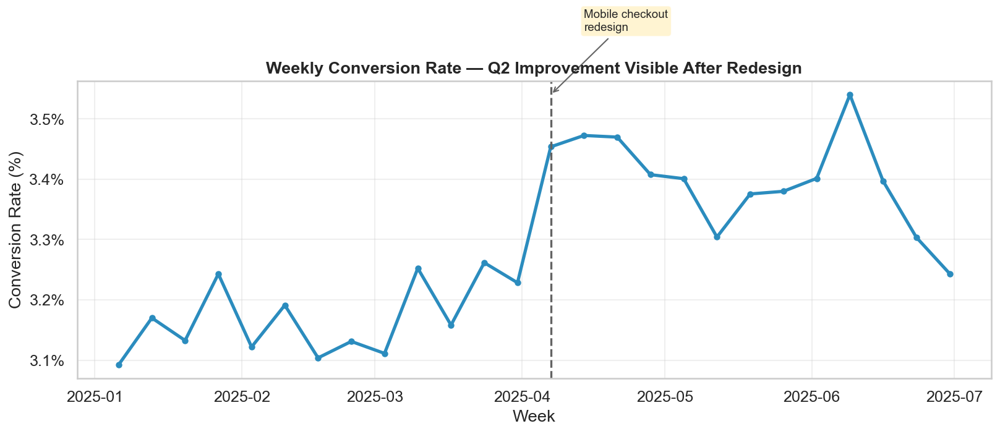
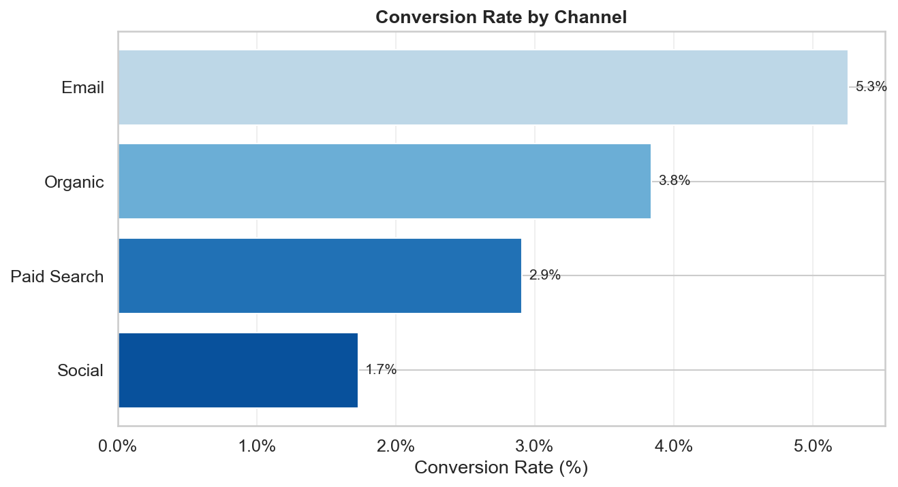
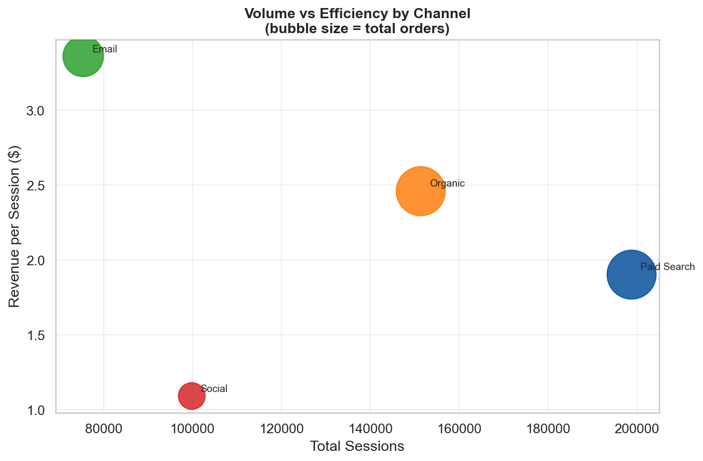
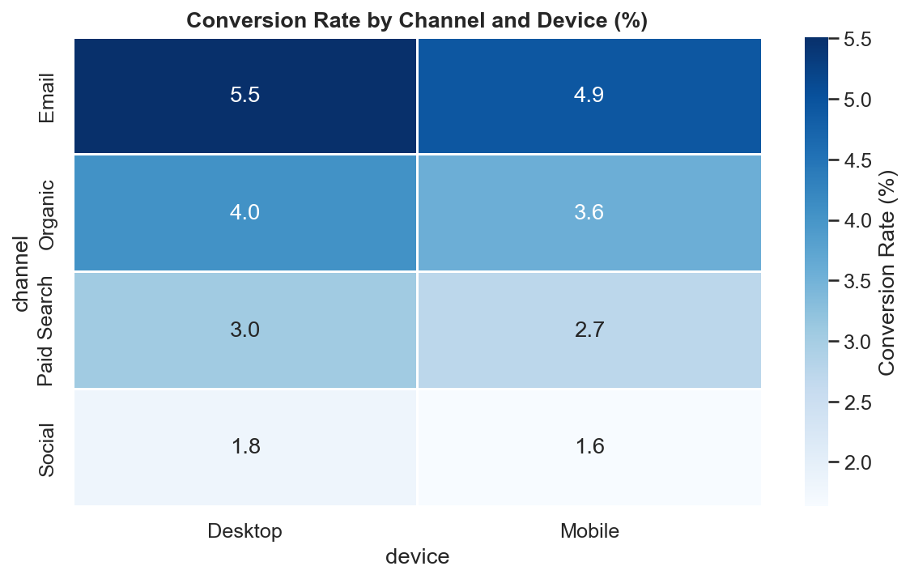
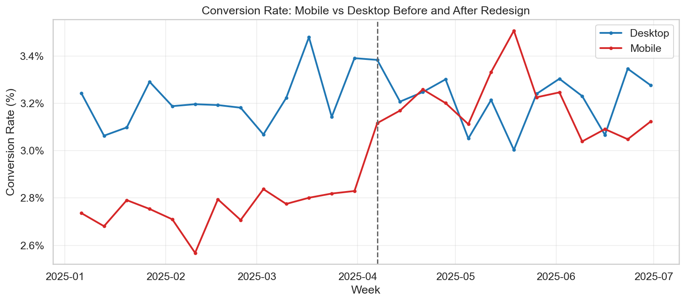
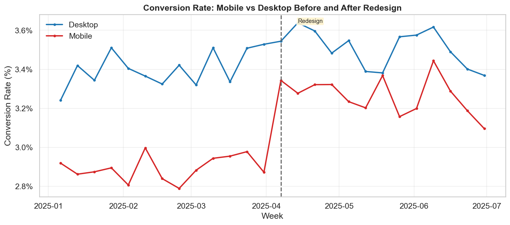

# Real-World Visualization Case Study

**After this lesson:** you can move from a vague business question to a cleaned dataset, a set of exploratory charts, and a polished final visualization with a clear recommendation.

> **Note:** This lesson is workflow-first. It connects [data prep](../3.1-intro-data-viz/data-prep-for-visualization.md), [Seaborn guide](seaborn-guide.md), and [Plotly guide](plotly-guide.md) into one realistic analysis sequence.

## Scenario

You work for an e-commerce company. The growth team asks:

> "Why did conversion improve in Q2, and which channels should we invest in next?"

You have weekly marketing data with sessions, orders, and revenue broken down by channel and device.

Your job is not just to make charts. Your job is to **answer the question with evidence**.

## Step 1: Define the decision

Break the request into smaller chartable questions before touching any data:

1. Did conversion really improve over time?
2. Which channels contributed most?
3. Was the lift broad-based or concentrated in one device or channel?
4. Is the recommendation about volume, efficiency, or both?

This prevents random chart production and keeps you focused on the answer rather than the aesthetics.

## Step 2: Prepare the data

Aggregate to the right level — week and channel — then compute derived metrics.


import pandas as pd
import numpy as np
import matplotlib.pyplot as plt
import seaborn as sns

sns.set_theme(style="whitegrid", palette="deep", font_scale=1.1)

# --- Synthetic dataset (replace with pd.read_csv if you have real data) ---
np.random.seed(42)

channels = ["Paid Search", "Email", "Organic", "Social"]
devices  = ["Mobile", "Desktop"]
dates    = pd.date_range("2025-01-06", periods=26, freq="W-MON")

base_sessions = {"Paid Search": 2000, "Email": 800, "Organic": 1500, "Social": 1200}
base_conv     = {"Paid Search": 0.028, "Email": 0.058, "Organic": 0.035, "Social": 0.020}
device_sess   = {"Mobile": 1.2, "Desktop": 0.8}
device_conv   = {"Mobile": 0.85, "Desktop": 1.0}
redesign_date = pd.Timestamp("2025-04-07")

rows = []
for date in dates:
    for channel in channels:
        for device in devices:
            q2_lift  = 1.18 if (date >= redesign_date and device == "Mobile") else 1.0
            sessions = max(int(np.random.normal(
                base_sessions[channel] * device_sess[device], 150)), 50)
            conv     = (base_conv[channel] * device_conv[device]
                        * q2_lift * np.random.uniform(0.90, 1.10))
            orders   = max(int(sessions * conv), 0)
            revenue  = round(orders * np.random.uniform(48, 72), 2)
            rows.append({"date": date, "channel": channel,
                         "device": device, "sessions": sessions,
                         "orders": orders, "revenue": revenue})

df = pd.DataFrame(rows)
# -------------------------------------------------------------------------

# Aggregate by week and channel
weekly_channel = (
    df.assign(week=df["date"].dt.to_period("W").dt.start_time)
      .groupby(["week", "channel"], as_index=False)
      .agg(
          sessions=("sessions", "sum"),
          orders=("orders",   "sum"),
          revenue=("revenue",  "sum")
      )
)

# Derive the metrics the business actually cares about
weekly_channel["conversion_rate"]     = (
    weekly_channel["orders"] / weekly_channel["sessions"]
)
weekly_channel["revenue_per_session"] = (
    weekly_channel["revenue"] / weekly_channel["sessions"]
)


<aside class="code-explainer__callouts" aria-label="Code walkthrough">
  

    

      
      Imports and theme
    

    

      
Set the Seaborn theme once at the top so every chart in the session inherits the same look without repeating styling code.

    

  

  

    

      
      Parse dates immediately
    

    

      
Always convert the date column right after loading. If you skip this, groupby and resample will treat dates as strings and produce incorrect results.

    

  

  

    

      
      Weekly aggregation
    

    

      
<code>dt.to_period("W").dt.start_time</code> snaps each date to its Monday, so every row in the same week gets the same label. Then groupby sums sessions, orders, and revenue per channel per week.

    

  

  

    

      
      Derived metrics
    

    

      
Conversion rate and revenue per session are computed <em>after</em> aggregation, not before. Computing them at row level and then averaging would give the wrong answer when session counts differ between rows.

    

  

</aside>

## Step 3: Exploratory charts

Use a small set of charts with distinct purposes — one per question from Step 1.

### Chart 1: Overall conversion trend

Question: Did conversion actually improve, or does it just feel that way?


overall_weekly = (
    df.assign(week=df["date"].dt.to_period("W").dt.start_time)
      .groupby("week", as_index=False)
      .agg(sessions=("sessions","sum"), orders=("orders","sum"))
)
overall_weekly["conversion_rate"] = (
    overall_weekly["orders"] / overall_weekly["sessions"]
)

fig, ax = plt.subplots(figsize=(11, 5))
ax.plot(overall_weekly["week"],
        overall_weekly["conversion_rate"] * 100,
        color="#2b8cbe", linewidth=2.5, marker="o", markersize=4)

# Mark the redesign event
redesign_date = pd.Timestamp("2025-04-07")
ax.axvline(redesign_date, color="#636363", linestyle="--", linewidth=1.5)
ax.annotate(
    "Mobile checkout\nredesign",
    xy=(redesign_date, overall_weekly["conversion_rate"].max() * 100),
    xytext=(redesign_date + pd.Timedelta(weeks=1),
            overall_weekly["conversion_rate"].max() * 100 * 1.03),
    fontsize=9,
    arrowprops=dict(arrowstyle="->", color="#636363"),
    bbox=dict(boxstyle="round,pad=0.3", facecolor="#fff3cd", alpha=0.9)
)

ax.set_title("Weekly Conversion Rate — Q2 Improvement Visible After Redesign")
ax.set_xlabel("Week")
ax.set_ylabel("Conversion Rate (%)")
ax.yaxis.set_major_formatter(
    plt.FuncFormatter(lambda y, _: f"{y:.1f}%")
)
ax.grid(True, alpha=0.3)


<aside class="code-explainer__callouts" aria-label="Code walkthrough">
  

    

      
      Roll up to overall weekly
    

    

      
Sum across all channels and devices first, then compute the rate. This gives the business-level conversion rate, not a per-channel average.

    

  

  

    

      
      Line chart
    

    

      
Multiply by 100 to show percentages. <code>marker="o"</code> makes individual weeks visible — useful when there are only 20–30 data points.

    

  

  

    

      
      Event annotation
    

    

      
<code>axvline</code> draws the vertical marker; <code>annotate</code> adds the label with an arrow. The <code>bbox</code> puts a light yellow background behind the text so it reads clearly over the chart.

    

  

  

    

      
      Percentage formatter
    

    

      
<code>FuncFormatter</code> appends the % sign to every y-axis tick automatically, so you never have to hardcode axis labels.

    

  

</aside>

The dashed line shows when the mobile checkout redesign shipped. Conversion climbed noticeably in the weeks that followed — that is the signal the growth team was asking about.

### Chart 2: Channel comparison

Question: Which channels are strongest on volume and efficiency?


channel_summary = (
    df.groupby("channel", as_index=False)
      .agg(
          sessions=("sessions","sum"),
          orders=("orders","sum"),
          revenue=("revenue","sum")
      )
)
channel_summary["conversion_rate"]     = (
    channel_summary["orders"] / channel_summary["sessions"]
)
channel_summary["revenue_per_session"] = (
    channel_summary["revenue"] / channel_summary["sessions"]
)

# Sorted horizontal bar — easier to read channel names
channel_sorted = channel_summary.sort_values(
    "conversion_rate", ascending=True
)

fig, ax = plt.subplots(figsize=(9, 5))
bars = ax.barh(
    channel_sorted["channel"],
    channel_sorted["conversion_rate"] * 100,
    color=["#bdd7e7","#6baed6","#2171b5","#08519c"]
)

# Label each bar with its value
for bar, val in zip(bars, channel_sorted["conversion_rate"]):
    ax.text(val * 100 + 0.05, bar.get_y() + bar.get_height() / 2,
            f"{val * 100:.1f}%", va="center", fontsize=10)

ax.set_title("Conversion Rate by Channel")
ax.set_xlabel("Conversion Rate (%)")
ax.grid(True, alpha=0.3, axis="x")


<aside class="code-explainer__callouts" aria-label="Code walkthrough">
  

    

      
      Aggregate across all weeks
    

    

      
Collapse the full period into one row per channel. This gives a stable summary rate — weekly variance would make the comparison hard to read.

    

  

  

    

      
      Sort before plotting
    

    

      
Always sort a bar chart so the reader's eye moves naturally from shortest to longest (or highest to lowest). An unsorted bar chart forces the reader to do the ranking mentally.

    

  

  

    

      
      Direct bar labels
    

    

      
Placing the value next to each bar removes the need for the reader to look back at the axis. Use this whenever the exact number matters more than just the relative ranking.

    

  

</aside>

Email converts at the highest rate despite lower session volume. Paid Search brings the most traffic but at lower efficiency. That tension shapes the recommendation.

### Chart 3: Volume vs efficiency

A bar chart can only show one metric at a time. A scatter plot shows both — volume on one axis, efficiency on the other.


colors_ch = {
    "Paid Search": "#08519c",
    "Email":       "#2ca02c",
    "Organic":     "#ff7f0e",
    "Social":      "#d62728"
}

fig, ax = plt.subplots(figsize=(9, 6))

for _, row in channel_summary.iterrows():
    ax.scatter(
        row["sessions"],
        row["revenue_per_session"],
        s=row["orders"] / 3,       # bubble size = total orders
        color=colors_ch[row["channel"]],
        alpha=0.85, zorder=3
    )
    ax.annotate(
        row["channel"],
        xy=(row["sessions"], row["revenue_per_session"]),
        xytext=(8, 4), textcoords="offset points",
        fontsize=9
    )

ax.set_title("Volume vs Efficiency by Channel\n(bubble size = total orders)")
ax.set_xlabel("Total Sessions")
ax.set_ylabel("Revenue per Session ($)")
ax.grid(True, alpha=0.3)


<aside class="code-explainer__callouts" aria-label="Code walkthrough">
  

    

      
      Colour dictionary
    

    

      
Assign colours explicitly to channels so they stay consistent across every chart in the analysis. If Email is green here, it should be green everywhere.

    

  

  

    

      
      Bubble size as a third dimension
    

    

      
<code>s=row["orders"] / 3</code> encodes total orders as bubble size, giving you three variables on one chart: sessions (x), revenue per session (y), and orders (size). Divide by a constant to keep bubbles visually proportionate.

    

  

  

    

      
      Direct labels
    

    

      
<code>xytext=(8, 4), textcoords="offset points"</code> nudges the label a few pixels from the centre of the bubble so it does not overlap the marker.

    

  

</aside>

Ideal channels sit in the top-right: high sessions and high revenue per session. Channels in the top-left are efficient but need more traffic investment. Bottom-right means high volume with low return per visit.

### Chart 4: Device and channel heatmap

Question: Was the improvement concentrated in one device-channel combination?


device_channel = (
    df.groupby(["channel","device"], as_index=False)
      .agg(sessions=("sessions","sum"), orders=("orders","sum"))
)
device_channel["conversion_rate"] = (
    device_channel["orders"] / device_channel["sessions"]
)

# Pivot to a matrix: rows = channel, columns = device
pivot = (
    device_channel
    .pivot(index="channel", columns="device", values="conversion_rate")
    * 100
)

fig, ax = plt.subplots(figsize=(8, 5))
sns.heatmap(
    pivot, annot=True, fmt=".1f", cmap="Blues",
    linewidths=0.5,
    cbar_kws={"label": "Conversion Rate (%)"},
    ax=ax
)
ax.set_title("Conversion Rate by Channel and Device (%)")


<aside class="code-explainer__callouts" aria-label="Code walkthrough">
  

    

      
      Two-level groupby
    

    

      
Grouping by both channel and device gives one conversion rate per combination, which is exactly what the heatmap needs.

    

  

  

    

      
      Pivot to matrix form
    

    

      
<code>pivot</code> reshapes from long to wide: each device becomes a column, each channel a row. Seaborn's heatmap expects exactly this shape.

    

  

  

    

      
      Heatmap options
    

    

      
<code>annot=True</code> prints the value inside each cell. <code>fmt=".1f"</code> limits decimals. <code>cmap="Blues"</code> makes darker cells mean higher conversion — intuitive without a legend explanation.

    

  

</aside>

Darker cells = higher conversion. Read across a row to compare devices within a channel. Read down a column to compare channels on the same device.

## Step 4: Identify the actual takeaway

After the four exploratory charts above, the pattern is clear:

- Conversion improved after week 14 (the Q2 redesign)
- Email has the highest conversion rate but limited volume
- Paid Search drives the most sessions but at lower efficiency
- Mobile improved more than Desktop after the redesign

That gives you the skeleton of the recommendation before you touch a final chart.

## Step 5: Build the final visuals

A good final deliverable uses **fewer** charts than the exploration phase. Pick the two or three that make the case most directly.

### Final chart 1: Mobile vs Desktop before and after


device_weekly = (
    df.assign(week=df["date"].dt.to_period("W").dt.start_time)
      .groupby(["week","device"], as_index=False)
      .agg(sessions=("sessions","sum"), orders=("orders","sum"))
)
device_weekly["conversion_rate"] = (
    device_weekly["orders"] / device_weekly["sessions"]
)

fig, ax = plt.subplots(figsize=(11, 5))
colors_dev = {"Mobile": "#d62728", "Desktop": "#1f77b4"}

for device, grp in device_weekly.groupby("device"):
    ax.plot(
        grp["week"], grp["conversion_rate"] * 100,
        color=colors_dev[device], linewidth=2,
        label=device, marker="o", markersize=3
    )

ax.axvline(redesign_date, color="#636363", linestyle="--", linewidth=1.5)
ax.annotate("Redesign", xy=(redesign_date, 5.5),
    xytext=(redesign_date + pd.Timedelta(weeks=1), 5.5),
    fontsize=9,
    bbox=dict(boxstyle="round,pad=0.2", facecolor="#fff3cd", alpha=0.9))

ax.set_title(
    "Conversion Rate: Mobile vs Desktop Before and After Redesign"
)
ax.set_xlabel("Week")
ax.set_ylabel("Conversion Rate (%)")
ax.yaxis.set_major_formatter(
    plt.FuncFormatter(lambda y, _: f"{y:.1f}%")
)
ax.legend()
ax.grid(True, alpha=0.3)


<figure>

<figcaption>Figure 5: Conversion Rate: Mobile vs Desktop Before and After Redesign</figcaption>
</figure>

<aside class="code-explainer__callouts" aria-label="Code walkthrough">
  

    

      
      Device-level weekly rollup
    

    

      
Same pattern as the overall trend — but grouped by device instead of dropping that dimension. This isolates whether the improvement was device-specific.

    

  

  

    

      
      Loop over devices
    

    

      
Plotting inside a loop with a colour dictionary keeps Mobile consistently red and Desktop consistently blue across every chart in the deck.

    

  

  

    

      
      Annotate the event
    

    

      
Placing the annotation at a fixed y-coordinate (<code>5.5</code>) keeps it from overlapping either line. Adjust based on the actual value range of your data.

    

  

</aside>

Mobile conversion rose sharply after the redesign. Desktop improved only slightly. This is the strongest piece of evidence that the redesign — not external factors — drove the Q2 lift.

### Final chart 2: Interactive Plotly view for stakeholders

When your audience needs to explore exact values by channel, hand them an interactive chart rather than a static one.


import plotly.express as px

fig = px.line(
    weekly_channel,
    x="week",
    y="conversion_rate",
    color="channel",
    title="Weekly Conversion Rate by Channel",
    labels={
        "week": "Week",
        "conversion_rate": "Conversion Rate",
        "channel": "Channel"
    }
)

# Unified hover shows all channels at once
fig.update_layout(hovermode="x unified")

# Format y-axis as percentage
fig.update_yaxes(tickformat=".1%")

fig.show()


<aside class="code-explainer__callouts" aria-label="Code walkthrough">
  

    

      
      px.line with colour grouping
    

    

      
<code>color="channel"</code> automatically creates one line per channel and builds the legend. The <code>labels</code> dict replaces column names with readable strings in the tooltip and axis.

    

  

  

    

      
      Unified hover
    

    

      
<code>hovermode="x unified"</code> shows all channel values in one tooltip when the cursor is at a given week — much easier to compare than hovering each line individually.

    

  

  

    

      
      Percentage format
    

    

      
<code>tickformat=".1%"</code> tells Plotly to multiply by 100 and append %. If your values are already in percent (e.g. 3.2 not 0.032), use <code>".1f"</code> and append the symbol manually in the label.

    

  

</aside>

<iframe src="assets/cs_plotly_channels.html" width="100%" height="500px" frameborder="0" style="border:none;border-radius:4px;"></iframe>

## How to write the recommendation

Connect each chart to a specific action:

- **"Increase Paid Search budget carefully"** — it drives the most volume, but monitor efficiency (Chart 3 shows it sits below Email on revenue per session).
- **"Protect Email"** — it remains the highest-converting channel even at lower volume (Chart 2).
- **"Continue mobile optimisation"** — the conversion gap between Mobile and Desktop narrowed sharply after the redesign (Chart 5). There is still room to close it further.

That is more useful than "conversion went up."

## Common failure modes

- Starting with a chart type instead of a business question.
- Using more exploratory charts in the final deck than supporting ones.
- Mixing volume and rate metrics without explaining the difference (lots of sessions ≠ high conversion).
- Showing channel performance without normalising for traffic scale.
- Presenting a correlation (redesign → conversion lift) as proof of causation.

## A reusable template

For any real visualization task:

1. Define the decision.
2. Prepare the data at the right level.
3. Explore with several chart types.
4. Choose the 2–3 charts that best support the conclusion.
5. Annotate the final charts.
6. Write the recommendation in plain language.

## Practice prompts

1. Rework this case study with a different dataset — customer support tickets by team and category.
2. Create a final chart set for sales performance by region using the same five-step workflow.
3. Replace the static device comparison with an interactive Plotly version and explain when each format is better.
4. Write a one-paragraph recommendation based on three charts only.

## Gotchas

- **Computing conversion rate before aggregation gives the wrong answer** — if you average per-row rates instead of dividing total orders by total sessions after grouping, high-volume rows get the same weight as low-volume ones. The lesson demonstrates this correctly with derived metrics calculated after `groupby`, but skipping that step is the most common bug in marketing analytics.
- **`dt.to_period("W").dt.start_time` snaps dates to Monday regardless of your actual week definition** — if your business defines weeks starting Sunday or Saturday, the weekly grouping will straddle boundaries and mix data from two calendar weeks. Verify the snap day matches your business calendar before publishing weekly charts.
- **Using the same `redesign_date` variable across multiple code cells requires running them in order** — if a learner runs Step 5's chart cells before Step 2, `redesign_date` is undefined and the annotation call raises a `NameError`. Notebooks don't enforce execution order; always re-run from top when sharing.
- **Bubble size encoded with `s=value / constant` encodes area proportional to orders, but audiences perceive radius** — humans underestimate differences in area and overestimate differences in radius. If the business needs precise comparisons from the bubble chart, add direct labels; don't rely on bubble size alone to convey magnitude.
- **`hovermode="x unified"` in the Plotly channel view flattens all channels to the same tooltip even when they have different values on the same week** — for channels with very similar rates, the unified tooltip shows them stacked in the order traces were added, which may not match the legend order. Confirm the tooltip order matches what you describe in the recommendation.
- **Annotating an event with `axvline` does not prove causation** — the chart visually implies the redesign caused the Q2 lift, but external factors (seasonality, a concurrent campaign) could also explain it. Always note the limitation in the recommendation text, as the "Common failure modes" section of this lesson already flags.

## Next steps

1. [3.4 Data storytelling](../3.4-data-storytelling/README.md) — turn case-study evidence into a polished narrative.
2. [Module assignment](../_assignments/module-assignment.md) — a fuller end-to-end practice task.
3. [Annotations and highlighting](../3.1-intro-data-viz/annotations-and-highlighting.md) — if your final charts still need too much verbal explanation.
