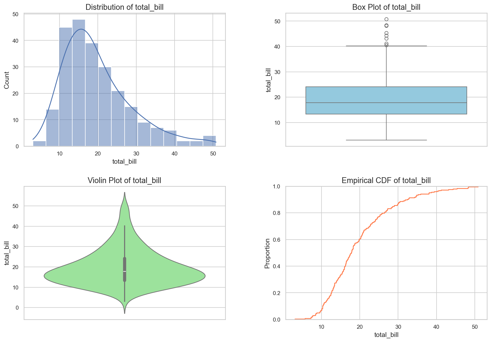
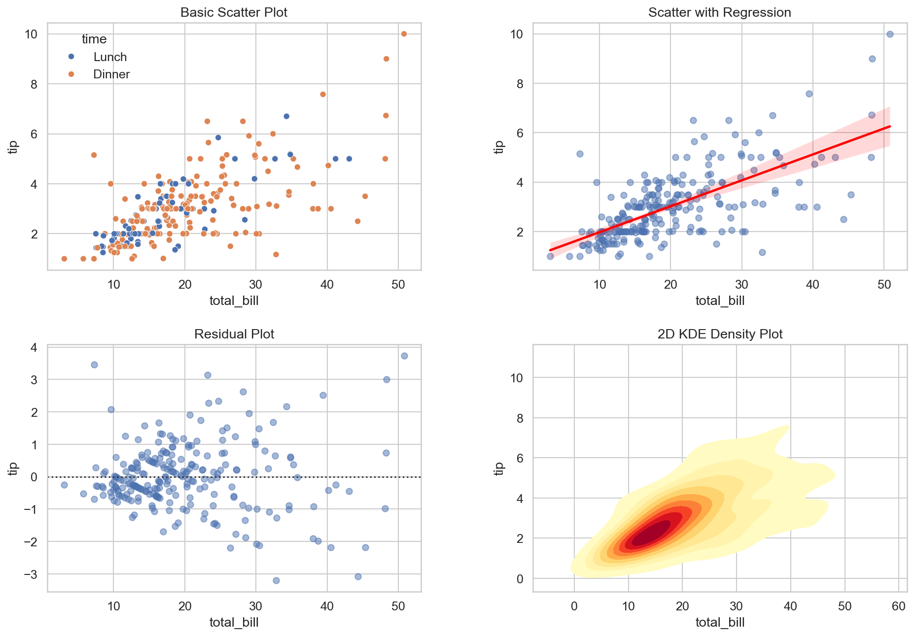
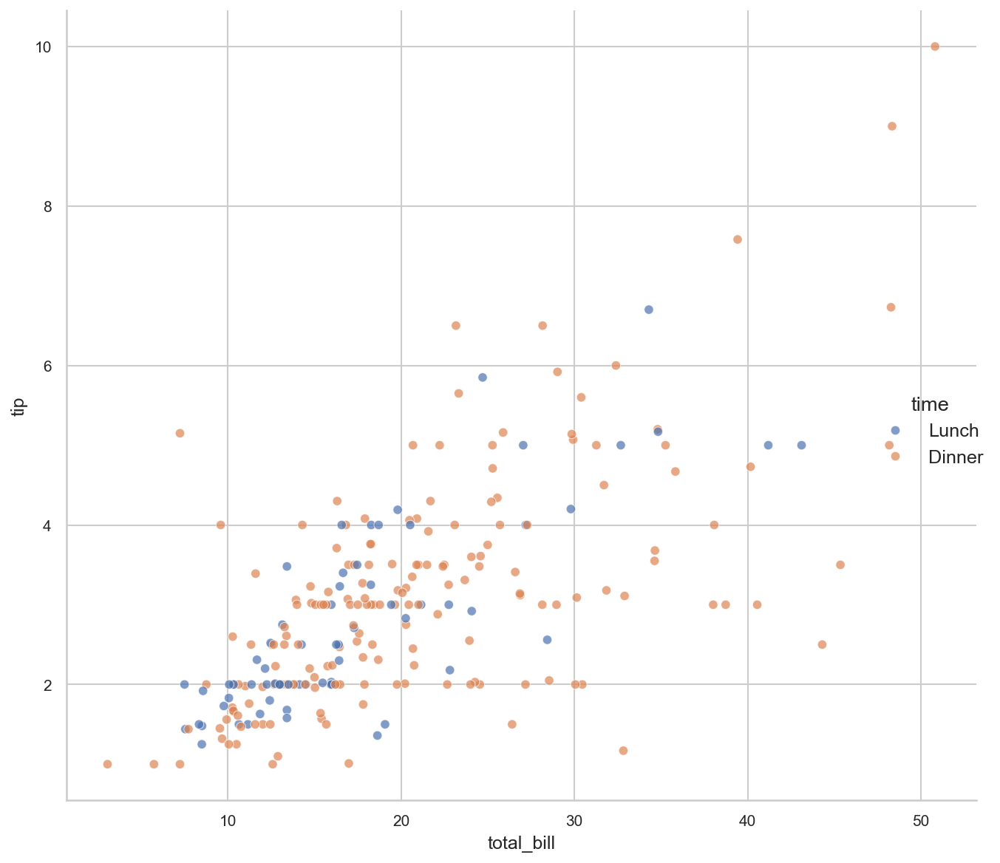
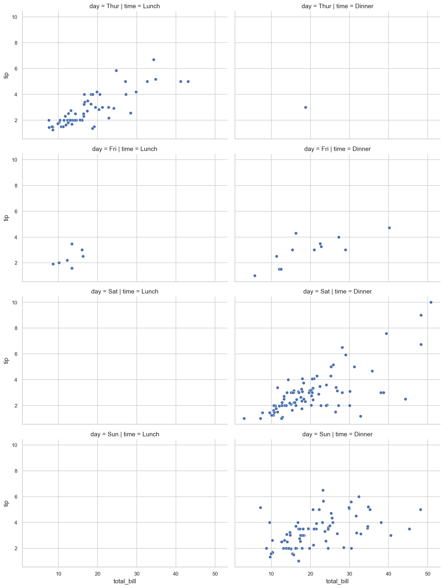
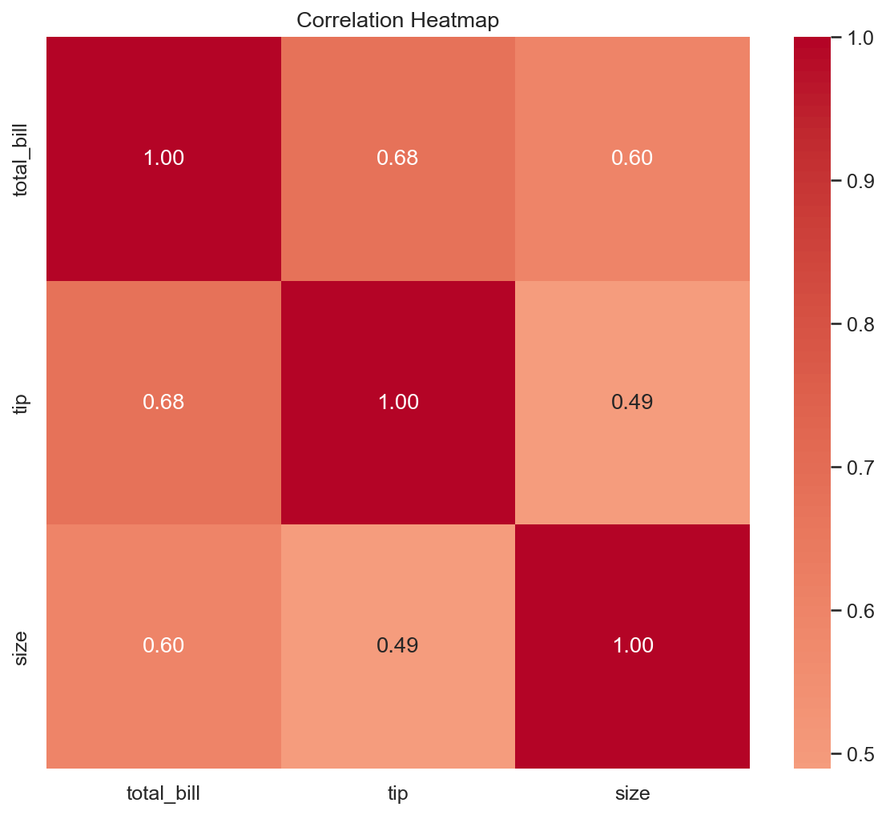
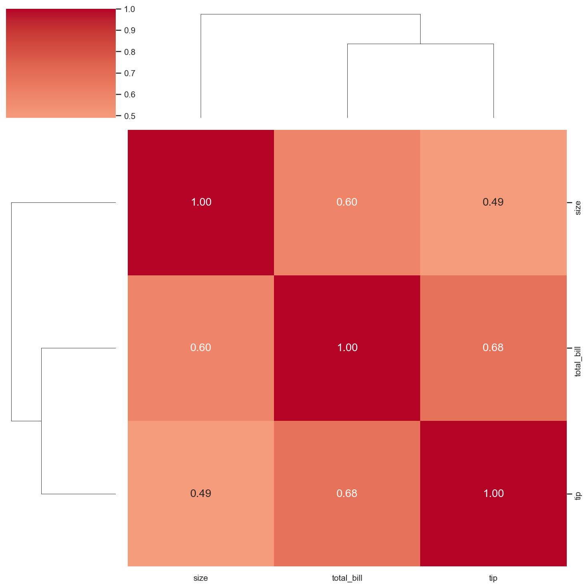

# Mastering Statistical Visualization with Seaborn

**After this lesson:** you can explain the core ideas in "Mastering Statistical Visualization with Seaborn" and reproduce the examples here in your own notebook or environment.

> **Note:** This lesson is **code-first**. You should understand [Matplotlib basics](../3.1-intro-data-viz/matplotlib-basics.md) and [visualization principles](../3.1-intro-data-viz/visualization-principles.md) first so you can interpret what Seaborn is doing.

## Introduction

Seaborn is your statistical visualization powerhouse — think of it as Matplotlib with a PhD in Statistics. It makes complex statistical visualizations both beautiful and informative with minimal code.

### Video Tutorial: Seaborn Data Visualization

<div class="video-embed">
<iframe width="560" height="315" src="https://www.youtube.com/embed/6GUZXDef2U0" frameborder="0" allow="accelerometer; autoplay; clipboard-write; encrypted-media; gyroscope; picture-in-picture" allowfullscreen></iframe>
</div>

*Seaborn Tutorial - Data Visualization in Python*

```yaml
Key Advantages:
┌─────────────────────────┐
│ Beautiful Defaults     │ → Professional look out-of-the-box
├─────────────────────────┤
│ Statistical Power      │ → Built-in statistical computations
├─────────────────────────┤
│ Pandas Integration     │ → Seamless data handling
└─────────────────────────┘
```



## Which chart for which question?

Pick the right chart before writing any code. The wrong chart can hide the very thing you are trying to show.

| Chart type | Use it when… | Skip it when… |
|---|---|---|
| **histplot + KDE** | Showing the shape of one numeric variable | Comparing > 3 groups — bars overlap badly |
| **boxplot** | Comparing median and spread across 2–10 groups | You need to see the distribution shape (use violin) |
| **violinplot** | You want full distribution shape per group | Sample size < 30 per group — KDE becomes unreliable |
| **ecdfplot** | Reading off exact percentiles directly | Presenting to audiences unfamiliar with cumulative charts |
| **scatterplot / regplot** | Exploring a linear relationship between two variables | > 5,000 points — use hexbin or sample down first |
| **heatmap** | Correlation matrix or a pivot of two categoricals | More than ~15 variables — cells become unreadable |
| **clustermap** | Heatmap + revealing which variables cluster together | You need a fixed variable order (clustering reorders rows) |
| **pairplot** | Quick multivariate overview of ≤ 6 variables | More than 8 variables — too slow and unreadable |
| **FacetGrid / relplot col=** | Same chart repeated per category | More than ~8 panels — scrolling becomes the story |

## Getting Started

### Professional Setup

> **Level:** Beginner — run this cell before any Seaborn code.

Import Seaborn and Matplotlib and set global theme, palette, font scale, and `rcParams` for figure size and label sizes.

```python
import seaborn as sns
import matplotlib.pyplot as plt
import pandas as pd
import numpy as np

# Set professional defaults
def setup_plotting_defaults():
    """Configure professional plotting defaults"""
    sns.set_theme(
        style="whitegrid",          # Clean, professional grid
        palette="deep",             # Professional color palette
        font="sans-serif",          # Modern font
        font_scale=1.1             # Slightly larger text
    )
    
    # Figure aesthetics
    plt.rcParams.update({
        'figure.figsize': (10, 6),
        'figure.dpi': 100,
        'axes.labelsize': 12,
        'axes.titlesize': 14,
        'xtick.labelsize': 10,
        'ytick.labelsize': 10
    })

setup_plotting_defaults()
```

### Data Loading & Inspection

Load a built-in Seaborn dataset and return both the frame and a small dict of diagnostics. `sns.load_dataset` ships sample CSVs — no download needed.

```python
def load_and_inspect_data(dataset_name="tips"):
    """Load and provide quick data overview"""
    # Load dataset
    data = sns.load_dataset(dataset_name)
    
    # Quick inspection
    summary = {
        "Shape": data.shape,
        "Columns": data.columns.tolist(),
        "Data Types": data.dtypes,
        "Missing Values": data.isnull().sum(),
        "Numeric Summary": data.describe()
    }
    
    return data, summary

# Example usage
tips, tips_summary = load_and_inspect_data("tips")
```

## Distribution Analysis

> **Level:** Beginner — start here. Understanding your variable's distribution is the first step in any analysis.

### 1. Single Variable Distributions

Four views of one numeric column — histogram+KDE, box, violin, and ECDF — on one canvas. Each view reveals different things.

<div class="code-explainer" data-code-explainer>
<div class="code-explainer__code">


def plot_distribution_suite(data, variable):
    """Create comprehensive distribution analysis"""
    # Create figure
    fig = plt.figure(figsize=(15, 10))
    gs = fig.add_gridspec(2, 2, hspace=0.3, wspace=0.3)
    
    # Histogram with KDE
    ax1 = fig.add_subplot(gs[0, 0])
    sns.histplot(
        data=data,
        x=variable,
        kde=True,
        ax=ax1,
        palette="deep"
    )
    ax1.set_title(f'Distribution of {variable}')
    
    # Box plot
    ax2 = fig.add_subplot(gs[0, 1])
    sns.boxplot(
        data=data,
        y=variable,
        ax=ax2,
        color='skyblue'
    )
    ax2.set_title(f'Box Plot of {variable}')
    
    # Violin plot
    ax3 = fig.add_subplot(gs[1, 0])
    sns.violinplot(
        data=data,
        y=variable,
        ax=ax3,
        color='lightgreen'
    )
    ax3.set_title(f'Violin Plot of {variable}')
    
    # ECDF
    ax4 = fig.add_subplot(gs[1, 1])
    sns.ecdfplot(
        data=data,
        x=variable,
        ax=ax4,
        color='coral'
    )
    ax4.set_title(f'Empirical CDF of {variable}')
    
    plt.tight_layout()
    return fig

# Example usage
dist_fig = plot_distribution_suite(tips, "total_bill")


</div>
<aside class="code-explainer__callouts" aria-label="Code walkthrough">
  <div class="code-callout" data-lines="1-8" data-tint="1">
    <div class="code-callout__meta">
      <span class="code-callout__lines"></span>
      <span class="code-callout__title">Figure setup with GridSpec</span>
    </div>
    <div class="code-callout__body">
      <p><code>plt.figure</code> creates the canvas; <code>add_gridspec(2, 2)</code> reserves a 2×2 grid of axes. <code>hspace</code>/<code>wspace</code> control the gaps between panels — a cleaner approach than <code>plt.subplot</code> for multi-panel dashboards. <code>add_subplot(gs[0, 0])</code> places the first axes in the top-left cell.</p>
    </div>
  </div>
  <div class="code-callout" data-lines="9-16" data-tint="2">
    <div class="code-callout__meta">
      <span class="code-callout__lines"></span>
      <span class="code-callout__title">histplot with KDE overlay</span>
    </div>
    <div class="code-callout__body">
      <p><code>sns.histplot(kde=True)</code> draws the histogram <em>and</em> a smoothed kernel density curve in one call. The KDE shows the continuous shape of the distribution, not just binned counts.</p>
    </div>
  </div>
  <div class="code-callout" data-lines="18-26" data-tint="3">
    <div class="code-callout__meta">
      <span class="code-callout__lines"></span>
      <span class="code-callout__title">boxplot: 5-number summary</span>
    </div>
    <div class="code-callout__body">
      <p><code>add_subplot(gs[0, 1])</code> places the second axes in the top-right cell. A box plot compresses a distribution into median, IQR box, and whiskers (±1.5×IQR). Points beyond the whiskers are outliers. Useful for quick comparisons across many groups.</p>
    </div>
  </div>
  <div class="code-callout" data-lines="28-46" data-tint="4">
    <div class="code-callout__meta">
      <span class="code-callout__lines"></span>
      <span class="code-callout__title">violinplot + ecdfplot</span>
    </div>
    <div class="code-callout__body">
      <p>A <strong>violin</strong> mirrors the KDE shape on both sides — you see the full distribution density, not just quartiles. <strong>ECDF</strong> (empirical CDF) shows what fraction of values fall below each x — great for reading off percentiles directly.</p>
    </div>
  </div>
  <div class="code-callout" data-lines="47-52" data-tint="1">
    <div class="code-callout__meta">
      <span class="code-callout__lines"></span>
      <span class="code-callout__title">Layout and usage</span>
    </div>
    <div class="code-callout__body">
      <p><code>plt.tight_layout()</code> adjusts subplot spacing automatically to prevent overlapping labels. The function returns the figure for saving or further modification. The example call at the bottom shows typical usage with the built-in <code>tips</code> dataset.</p>
    </div>
  </div>
</aside>
</div>




### 2. Categorical Distributions

Show how a numeric outcome varies across a category using box, violin, strip, and swarm plots.

> Note: swarm can be slow on large datasets (> 1,000 points per group). Use strip with `jitter` instead.

```python
def plot_categorical_analysis(data, cat_var, num_var):
    """Create comprehensive categorical analysis"""
    # Create figure
    fig = plt.figure(figsize=(15, 10))
    gs = fig.add_gridspec(2, 2, hspace=0.3, wspace=0.3)
    
    # Box plot
    ax1 = fig.add_subplot(gs[0, 0])
    sns.boxplot(
        data=data,
        x=cat_var,
        y=num_var,
        ax=ax1
    )
    ax1.set_title(f'{num_var} by {cat_var} (Box Plot)')
    
    # Violin plot
    ax2 = fig.add_subplot(gs[0, 1])
    sns.violinplot(
        data=data,
        x=cat_var,
        y=num_var,
        ax=ax2
    )
    ax2.set_title(f'{num_var} by {cat_var} (Violin Plot)')
    
    # Strip plot
    ax3 = fig.add_subplot(gs[1, 0])
    sns.stripplot(
        data=data,
        x=cat_var,
        y=num_var,
        ax=ax3,
        alpha=0.5,
        jitter=0.2
    )
    ax3.set_title(f'{num_var} by {cat_var} (Strip Plot)')
    
    # Swarm plot
    ax4 = fig.add_subplot(gs[1, 1])
    sns.swarmplot(
        data=data,
        x=cat_var,
        y=num_var,
        ax=ax4
    )
    ax4.set_title(f'{num_var} by {cat_var} (Swarm Plot)')
    
    plt.tight_layout()
    return fig

# Example usage
cat_fig = plot_categorical_analysis(tips, "day", "total_bill")
```


> **Try it**
>
> Using the built-in `penguins` dataset (`sns.load_dataset("penguins")`):
>
> 1. Plot a histogram with KDE for `flipper_length_mm`. Does the distribution look unimodal or bimodal?
> 2. Use a box plot to compare `body_mass_g` across the three species. Which species is heaviest? Which has the most spread?
> 3. Switch the box plot to a violin. What extra information does the violin reveal that the box plot hides?

## Relationship Analysis

> **Level:** Intermediate — adds regression and multivariate views. Useful once you know the basic distribution of each variable.

### 1. Scatter Plot Suite

Explore a bivariate relationship with scatter, regression line, residuals, and hexbin density.

`regplot` fits OLS. `residplot` shows errors around the line — if residuals fan out, OLS assumptions are violated. `hexbin` handles overplotting for large datasets.

```python
def create_scatter_analysis(data, x_var, y_var, hue_var=None):
    """Create comprehensive scatter plot analysis"""
    # Create figure
    fig = plt.figure(figsize=(15, 10))
    gs = fig.add_gridspec(2, 2, hspace=0.3, wspace=0.3)
    
    # Basic scatter
    ax1 = fig.add_subplot(gs[0, 0])
    sns.scatterplot(
        data=data,
        x=x_var,
        y=y_var,
        hue=hue_var,
        ax=ax1
    )
    ax1.set_title('Basic Scatter Plot')
    
    # With regression line
    ax2 = fig.add_subplot(gs[0, 1])
    sns.regplot(
        data=data,
        x=x_var,
        y=y_var,
        ax=ax2,
        scatter_kws={'alpha':0.5},
        line_kws={'color': 'red'}
    )
    ax2.set_title('Scatter with Regression')
    
    # Residual plot
    ax3 = fig.add_subplot(gs[1, 0])
    sns.residplot(
        data=data,
        x=x_var,
        y=y_var,
        ax=ax3,
        scatter_kws={'alpha':0.5}
    )
    ax3.set_title('Residual Plot')
    
    # 2D KDE density plot
    ax4 = fig.add_subplot(gs[1, 1])
    sns.kdeplot(
        data=data,
        x=x_var,
        y=y_var,
        ax=ax4,
        fill=True,
        cmap='YlOrRd',
        levels=10
    )
    ax4.set_title('2D KDE Density Plot')
    
    plt.tight_layout()
    return fig

# Example usage
scatter_fig = create_scatter_analysis(tips, "total_bill", "tip", "time")
```


### 2. Complex Relationships

`PairGrid` and `FacetGrid` for multivariate views.

`PairGrid.map` applies a plotting function row-wise. `FacetGrid.map_dataframe` passes column names to `scatterplot` and creates a panel per category level.

```python
def analyze_complex_relationships(data, x_var, y_var, cat_vars):
    """Analyze relationships with categorical variables"""
    # Create pair grid
    g = sns.PairGrid(
        data,
        x_vars=[x_var],
        y_vars=[y_var],
        hue=cat_vars[0],
        height=8
    )
    
    # Add different plots
    g.map(sns.scatterplot, alpha=0.7)
    g.add_legend()
    
    # Create facet grid
    g2 = sns.FacetGrid(
        data,
        col=cat_vars[0],
        row=cat_vars[1] if len(cat_vars) > 1 else None,
        height=4,
        aspect=1.5
    )
    
    # Add plot layers
    g2.map_dataframe(sns.scatterplot, x_var, y_var)
    g2.add_legend()
    
    return g, g2

# Example usage
pair_g, facet_g = analyze_complex_relationships(
    tips, "total_bill", "tip", ["time", "day"]
)
```










> **Try it**
>
> Still using `penguins`:
>
> 1. Create a scatter of `bill_length_mm` vs `bill_depth_mm` with `species` as the hue. Do the clusters separate cleanly by species?
> 2. Add `regplot` to the same axes (use `scatter=False` to avoid duplicate dots). Does the overall trend line slope the same way within each species?
> 3. Create a `FacetGrid` with one panel per island (`col="island"`). Does the species mix look different across islands?

## Matrix Visualizations

> **Level:** Intermediate — heatmaps and clustermaps for correlation analysis. Most useful after you have a well-structured numeric dataset.

### 1. Correlation Analysis

Numeric correlation matrix as a labeled heatmap, and as a clustered heatmap to reveal variable groups.

`select_dtypes` keeps only numeric columns. `heatmap` preserves your column order. `clustermap` reorders rows and columns by similarity — useful for spotting groups of related variables.

```python
def create_correlation_analysis(data, method='pearson'):
    """Create comprehensive correlation analysis"""
    # Compute correlations
    corr = data.select_dtypes(include=[np.number]).corr(method=method)
    
    # Create figure
    fig, ax1 = plt.subplots(1, 1, figsize=(8, 7))
    
    # Heatmap
    sns.heatmap(
        corr,
        annot=True,
        cmap='coolwarm',
        center=0,
        ax=ax1,
        fmt='.2f'
    )
    ax1.set_title('Correlation Heatmap')
    
    # Clustermap (creates its own figure)
    sns.clustermap(
        corr,
        annot=True,
        cmap='coolwarm',
        center=0,
        fmt='.2f',
        figsize=(10, 10)
    )
    
    return fig

# Example usage
corr_fig = create_correlation_analysis(tips)
```








### Additional Visualization Examples

**Bar Plot with Error Bars:**


**Count Plot:**


**Joint Plot:**


**Time Series Heatmap:**


**Line Plot:**


> **Try it**
>
> Using `penguins` (drop non-numeric columns first: `penguins.select_dtypes(include='number')`):
>
> 1. Create a correlation heatmap. Which two variables are most strongly correlated?
> 2. Create a `clustermap` of the same data. Does it group variables differently from the raw correlation matrix order?
> 3. Run `sns.pairplot(penguins, hue="species")`. Pick the two variables that best separate the three species and explain your choice.

## Best Practices

### 1. Style Management

Switch Seaborn themes for slides (`presentation`), papers (`paper`), or notebooks (`notebook`) from one function.

```python
def set_plot_style(style_type='presentation'):
    """Set plot style based on context"""
    styles = {
        'presentation': {
            'style': 'whitegrid',
            'palette': 'deep',
            'font_scale': 1.2,
            'figure.figsize': (12, 8)
        },
        'paper': {
            'style': 'ticks',
            'palette': 'colorblind',
            'font_scale': 0.8,
            'figure.figsize': (8, 6)
        },
        'notebook': {
            'style': 'darkgrid',
            'palette': 'muted',
            'font_scale': 1.0,
            'figure.figsize': (10, 6)
        }
    }
    
    style = styles.get(style_type, styles['notebook'])
    sns.set_theme(**style)
    return style

# Example usage
style = set_plot_style('presentation')
```

### 2. Export Settings

Write the same figure to PDF, PNG, and SVG with tight bounding boxes for documents and web.

```python
def save_publication_quality(fig, filename, dpi=300):
    """Save figure in publication quality"""
    # Save in multiple formats
    formats = {
        'pdf': {'bbox_inches': 'tight'},
        'png': {'dpi': dpi, 'bbox_inches': 'tight'},
        'svg': {'bbox_inches': 'tight'}
    }
    
    for fmt, settings in formats.items():
        fig.savefig(f'{filename}.{fmt}', **settings)

# Example usage
save_publication_quality(scatter_fig, 'scatter_analysis')
```

Remember:

- Start with data exploration
- Choose appropriate visualizations
- Keep it simple but informative
- Consider your audience
- Use consistent styling
- Save high-quality outputs

## Next steps

- Continue with [Interactive visualization with Plotly](plotly-guide.md).
- Review the [3.2 Advanced data visualization](README.md) overview and the [module assignment](../_assignments/module-assignment.md) when assigned.
