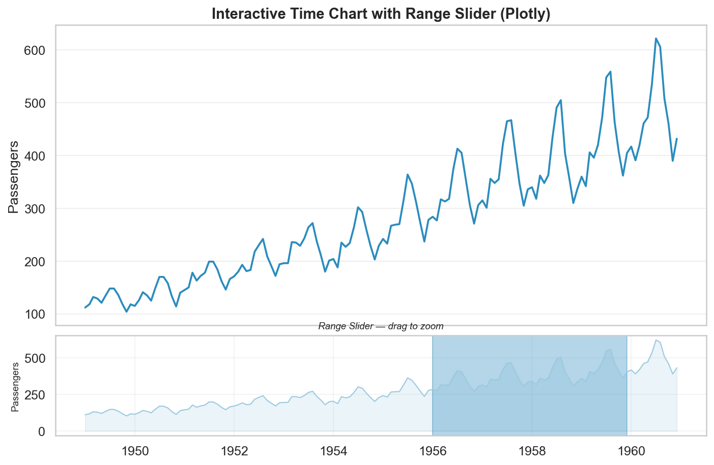

# Time Series Visualization

**After this lesson:** you can prepare and plot time-based data clearly, choose suitable time intervals, and annotate trends, seasonality, and events without misleading the viewer.

> **Note:** Build on [Matplotlib basics](../3.1-intro-data-viz/matplotlib-basics.md) first, then apply the richer styling and interactivity from the [Seaborn guide](seaborn-guide.md) and [Plotly guide](plotly-guide.md).

## What makes time data different?

Most charts treat data points as independent — swap two bars in a bar chart and the story barely changes. Time series data is different: the **order matters**.

Think about tracking monthly sales. If you accidentally sort by value instead of date, you'd see a perfectly smooth curve — and completely miss the seasonal dip in January. Or imagine comparing this month's revenue to last month's when this month isn't over yet. The chart would make things look worse than they are.

These are the specific traps time data sets for you:

- **Order matters** — points have a direction; swapping two values changes the story
- **Gaps matter** — a missing week is not the same as a zero week
- **Aggregation level matters** — daily data looks noisy; monthly data hides spikes
- **Partial periods mislead** — comparing an incomplete month to full months makes recent data look worse

This lesson shows you how to avoid each of these, and how to build charts that communicate time-based trends clearly.

## Setup

The examples below use the `flights` dataset — monthly airline passengers from 1949 to 1960. It is built into Seaborn so there is nothing to download.

```python
import pandas as pd
import seaborn as sns
import matplotlib.pyplot as plt

sns.set_theme(style="whitegrid", palette="deep", font_scale=1.1)

# Load and prepare the dataset
flights = sns.load_dataset("flights")

# Turn year + month into a proper datetime column
month_num = {"Jan":1,"Feb":2,"Mar":3,"Apr":4,"May":5,"Jun":6,
             "Jul":7,"Aug":8,"Sep":9,"Oct":10,"Nov":11,"Dec":12}
flights["month_num"] = flights["month"].astype(str).map(month_num)
flights["date"] = pd.to_datetime(
    dict(year=flights["year"], month=flights["month_num"], day=1)
)
flights = flights.sort_values("date").reset_index(drop=True)

# Annual totals for trend examples
annual = flights.groupby("year")["passengers"].sum().reset_index()
annual["date"] = pd.to_datetime(annual["year"].astype(str))
```

Always parse dates with `pd.to_datetime` and sort immediately. Everything else — resampling, rolling averages, grouping — depends on the data being in chronological order.

## Choose the right time grain

Match the aggregation level to the question being asked.

| Question | Grain to use |
|---|---|
| Is the server behaving right now? | Hourly or minute |
| Is this week better than last? | Daily |
| What is the trend this quarter? | Weekly |
| How did we do this year? | Monthly or quarterly |

```python
# Resample daily data to weekly sums
# (illustrative — flights data is already monthly)
weekly = (
    flights
    .set_index("date")
    .resample("W")
    .agg(passengers=("passengers", "sum"))
    .reset_index()
)
```

Two rules before publishing:

1. Do not compare a partial current period to complete prior periods — either exclude it or label it clearly.
2. Explain missing periods instead of silently skipping them.

## Basic time series patterns

### 1. Trend line

The simplest useful time chart: one line, clear axes, no clutter.

```python
fig, ax = plt.subplots(figsize=(11, 5))
ax.plot(annual["date"], annual["passengers"],
        color="#2b8cbe", linewidth=2.5, marker="o", markersize=5)
ax.set_title("Annual Airline Passengers (1949–1960)")
ax.set_xlabel("Year")
ax.set_ylabel("Total Passengers")
ax.grid(True, alpha=0.3)
```


The upward slope is immediately obvious. A plain line is usually the right starting point — add complexity only when the data demands it.

### 2. Rolling average

Raw data often has short-term noise that hides the longer trend. A rolling average smooths this out.

```python
annual["rolling_3y"] = annual["passengers"].rolling(window=3, min_periods=1).mean()

fig, ax = plt.subplots(figsize=(11, 5))
ax.plot(annual["date"], annual["passengers"],
        color="#9ecae1", linewidth=1.5, label="Annual passengers")
ax.plot(annual["date"], annual["rolling_3y"],
        color="#08519c", linewidth=2.5, label="3-year rolling average")
ax.set_title("Smoothing with a Rolling Average")
ax.set_xlabel("Year")
ax.set_ylabel("Total Passengers")
ax.legend()
ax.grid(True, alpha=0.3)
```


Keep the original series visible (lighter colour, thinner line) so the reader can see both the noise and the trend. If you only show the smoothed line, you hide information.

### 3. Multiple series

Compare groups on the same time axis — but only when the number of lines is manageable (roughly five or fewer). Beyond that, use small multiples instead.

```python
fig, ax = plt.subplots(figsize=(11, 5))
palette = sns.color_palette("tab10", n_colors=12)

for i, (month_num, month_df) in enumerate(flights.groupby("month_num")):
    label = month_df["month"].iloc[0]
    ax.plot(month_df["year"], month_df["passengers"],
            color=palette[i], linewidth=1.5, label=label,
            marker="o", markersize=3)

ax.set_title("Passengers by Month Across Years")
ax.set_xlabel("Year")
ax.set_ylabel("Passengers")
ax.legend(loc="upper left", fontsize=7, ncol=2)
ax.grid(True, alpha=0.3)
```


With 12 months on one chart the legend is already crowded. This is the point where small multiples become the better choice.

## Small multiples for clarity

When you have too many series for one chart, split them into separate panels with a shared axis. The viewer can scan across panels and still make comparisons.

```python
season_map = {1:"Winter",2:"Winter",3:"Spring",4:"Spring",5:"Spring",
              6:"Summer",7:"Summer",8:"Summer",9:"Autumn",10:"Autumn",11:"Autumn",12:"Winter"}
flights["season"] = flights["month_num"].map(season_map)
season_data = flights.groupby(["year","season"])["passengers"].sum().reset_index()

sns.relplot(
    data=season_data,
    kind="line",
    x="year",
    y="passengers",
    col="season",
    col_wrap=2,
    height=3.5,
    facet_kws={"sharey": False}
)
```


Each season gets its own panel. The growth trend is visible in every panel, and summer's higher absolute numbers do not visually dominate the others because `sharey=False` lets each panel scale independently.

## Annotating events

A vertical line at an event date often tells more of the story than the data alone.

```python
fig, ax = plt.subplots(figsize=(11, 5))
ax.plot(annual["date"], annual["passengers"],
        color="#2b8cbe", linewidth=2.5, marker="o", markersize=5)

event_date = pd.Timestamp("1955-01-01")
ax.axvline(event_date, color="#636363", linestyle="--", linewidth=1.8)
ax.annotate(
    "Jet age begins\n(1955)",
    xy=(event_date, annual.loc[annual["year"]==1955, "passengers"].values[0]),
    xytext=(pd.Timestamp("1956-06-01"), 8500),
    fontsize=10,
    arrowprops=dict(arrowstyle="->", color="#636363"),
    bbox=dict(boxstyle="round,pad=0.3", facecolor="#fff3cd", alpha=0.9)
)
ax.set_title("Annotating a Key Event on a Time Chart")
ax.set_xlabel("Year")
ax.set_ylabel("Total Passengers")
ax.grid(True, alpha=0.3)
```


The annotation explains *why* growth accelerated — without it the reader has to guess. Always prefer annotation directly on the chart over a caption below it.

## Plotly for interactive exploration

Plotly is useful when your audience needs to zoom in, hover for exact values, or explore a date range themselves.

```python
import plotly.express as px

fig = px.line(
    annual,
    x="date",
    y="passengers",
    title="Annual Airline Passengers"
)
fig.update_xaxes(rangeslider_visible=True)
fig.show()
```



The range slider at the bottom lets the viewer drag to focus on any window. Use this for dashboards and stakeholder reports where the audience will explore the data, not just read a static chart.

## Common mistakes

- Comparing an incomplete current period to complete prior periods — the current period will always look worse.
- Connecting points across missing dates without noting the gap.
- Putting more than ~5 series on one chart — use small multiples instead.
- Adding a second y-axis when normalising or using separate panels would be clearer.
- Over-smoothing and hiding important volatility.

## A practical checklist

Before publishing a time chart:

1. Are the dates parsed and sorted?
2. Is the aggregation level appropriate for the question?
3. Are incomplete periods excluded or clearly labelled?
4. Would a rolling average help — and if so, is the raw series still visible?
5. Are key events marked directly on the chart?

## Practice prompts

1. Turn the monthly `flights` data into quarterly totals and compare readability with the monthly version.
2. Add a 6-month rolling average to the monthly series and keep the raw line visible.
3. Replace the 12-line month chart above with a `sns.relplot` small-multiples version.
4. Pick a year and annotate it with a made-up event label. What does the annotation make the viewer assume?

## Next steps

1. [Plotly guide](plotly-guide.md) — richer interactive controls for time exploration.
2. [Real-world case study](real-world-case-study.md) — combine time trends with category and distribution views.
3. [3.4 Data storytelling](../3.4-data-storytelling/README.md) — turn a time-based analysis into a stakeholder narrative.
