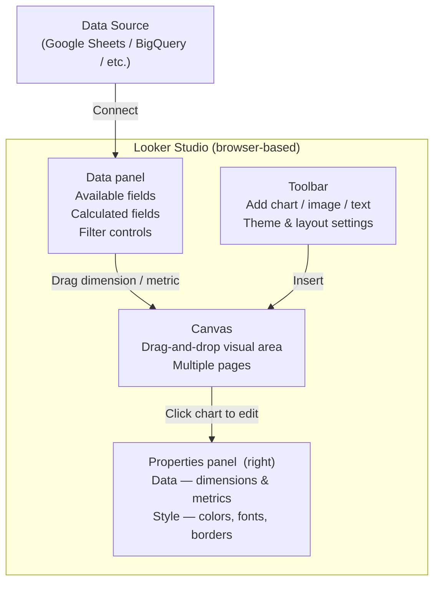

# Learning Looker Studio Through a Real Example: SuperStore Analysis

**After this lesson:** you can explain the core ideas in “Learning Looker Studio Through a Real Example: SuperStore Analysis” and reproduce the examples here in your own notebook or environment.

> **Note:** This tutorial is **UI-first** (Looker Studio in the browser). You need a Google account and permission to connect a Google Sheet or similar source.

## Helpful video

Short Tableau Public install; pair with the written guides in this folder.

<iframe width="560" height="315" src="https://www.youtube.com/embed/lTNWfhmurUg" title="Tableau Public Tutorial Download and Setup" frameborder="0" allow="accelerometer; autoplay; clipboard-write; encrypted-media; gyroscope; picture-in-picture" allowfullscreen></iframe>

## Getting Started

### 1. Opening Looker Studio and Connecting to Data

1. Go to [Looker Studio](https://lookerstudio.google.com/)
2. Click "Create" and select "Report"
3. Choose your data source:
   - For this example, we'll use Google Sheets
   - Upload the Superstore dataset to Google Sheets
   - Select the sheet as your data source
4. Click "Add" to connect the data

> **Figure (add screenshot or diagram):** Looker Studio home page (lookerstudio.google.com) — the "Create" button highlighted, a list of recent reports, and a data source connector gallery showing Google Sheets, BigQuery, and Google Analytics options.


### 2. Understanding the Looker Studio Workspace



> **Figure (add screenshot or diagram):** Looker Studio workspace — annotated with Canvas, Toolbar, Properties panel (right), and Data panel showing connected fields.

The Looker Studio interface consists of several key areas:

1. **Canvas**
   - Main area for creating visualizations
   - Multiple pages for different analyses
   - Responsive layout options

2. **Toolbar**
   - Add components
   - Format options
   - Theme settings
   - View controls

3. **Properties Panel**
   - Data configuration
   - Style options
   - Interaction settings
   - Advanced options

4. **Data Panel**
   - Available fields
   - Calculated fields
   - Data source settings
   - Filter controls

> **Figure (add screenshot or diagram):** Looker Studio report editor — the toolbar at the top with "Add a chart" and "Add a control" buttons, the canvas in the center with an empty page, and the Properties panel on the right showing the Data and Style tabs for a selected chart.


## Project Overview

In this comprehensive case study, we'll analyze retail data to drive business decisions. By the end of this tutorial, you will create:

- A dynamic sales performance dashboard
- A geographical distribution analysis
- A product profitability analysis
- Interactive filters and controls

> **Figure (add screenshot or diagram):** The completed Looker Studio SuperStore dashboard — a Sales by Category bar chart (top-left), a US geo map colored by Sales (top-right), a Profit by Sub-Category table (bottom-left), and date range and region filter controls along the top.


## Dataset Introduction

We'll utilize the "Sample - Superstore" dataset adapted for Looker Studio. This dataset is ideal for learning because:

- It contains clean, pre-formatted data
- It includes realistic business scenarios
- It's easy to import into Google Sheets
- It covers multiple analysis dimensions

> **Figure (add screenshot or diagram):** The Superstore dataset in Google Sheets — column headers visible (Order ID, Order Date, Ship Mode, Category, Sales, Profit, etc.) with the first 10 rows of data, and the Looker Studio "Add a data source" dialog open and pointing to this sheet.


### Data Structure Overview

The dataset consists of four primary tables:

```yaml
Data Structure:
1. Orders Table:
   Primary Fields:
   - Order ID (Primary Key)
   - Order Date (Date/Time)
   - Ship Date (Date/Time)
   - Ship Mode (String)
   - Customer ID (Foreign Key)
   - Product ID (Foreign Key)
   - Quantity (Integer)
   - Sales (Decimal)
   - Profit (Decimal)
   
   Additional Metadata:
   - Row Count: ~9,000
   - Date Range: 4 years
   - NULL handling: No nulls
   
2. Products Table:
   Primary Fields:
   - Product ID (Primary Key)
   - Category (String)
   - Sub-Category (String)
   - Product Name (String)
   
   Classification:
   - Categories: 3
   - Sub-Categories: 17
   - Products: ~1,500

3. Customers Table:
   Primary Fields:
   - Customer ID (Primary Key)
   - Customer Name (String)
   - Segment (String)
   - Region (String)
   
   Segmentation:
   - Customer Types: 3
   - Regions: 4
   - States: 48

4. Returns Table (Optional):
   Primary Fields:
   - Order ID (Foreign Key)
   - Return Status (Boolean)
   
   Statistics:
   - Return Rate: ~10%
   - Tracking Period: Full dataset
```

> **Figure (add screenshot or diagram):** Looker Studio's data source configuration screen — the list of fields from the connected Google Sheet, each field showing its name, data type icon (text/number/date), and an "Aggregation" dropdown; the "Add a field" button visible for creating calculated fields.


## Step-by-Step Visualization Guide

### 1. Creating Your First Chart: Sales by Category

1. Click "Add a chart" in the toolbar
2. Select "Bar chart" from the chart types
3. In the Properties panel:
   - Set "Category" as the Dimension
   - Set "Sales" as the Metric
4. To enhance:
   - Add data labels
   - Customize colors
   - Add a title
   - Configure tooltips

> **Figure (add screenshot or diagram):** Looker Studio canvas with a bar chart selected — the Properties panel on the right showing "Category" in the Dimension field and "Sales" in the Metric field; a three-bar chart (Furniture, Office Supplies, Technology) rendered on the canvas.


### 2. Time Series Analysis

#### Line Chart with Multiple Metrics

1. Add a new page (click "+" at bottom)
2. Select "Time series" chart
3. Basic Setup:
   - Set "Order Date" as Dimension
   - Add "Sales" as Metric
   - Click "Add metric" and add "Profit"
4. Customization:
   - Format lines and markers
   - Add reference lines
   - Configure date range
   - Add trend lines

> **Figure (add screenshot or diagram):** Looker Studio time series chart — Order Date on the x-axis, two metrics (Sales in blue, Profit in orange) as lines, the Properties panel showing "Order Date" as Dimension and both metrics in the Metric list, with "Compare to previous period" option enabled.


### 3. Geographic Analysis

#### Creating a Map Visualization

1. Add a new page
2. Select "Geo map" from chart types
3. Basic Setup:
   - Set "State" as Location dimension
   - Set "Sales" as Color metric
   - Set "Profit" as Size metric
4. Customization:
   - Adjust color scale
   - Add region labels
   - Configure tooltips
   - Set zoom level

> **Figure (add screenshot or diagram):** Looker Studio geo map of the US — state borders visible, each state shaded by Sales using a blue gradient, a tooltip open on California showing state name, Sales total, and Profit total; the Properties panel showing "State" as Location and "Sales" as Color metric.


### 4. Building a Dashboard

1. Arrange your visualizations on the canvas
2. Add a title using the Text tool
3. Adding Interactivity:
   - Add filter controls
   - Set up date range controls
   - Configure cross-filtering
   - Add navigation between pages

> **Figure (add screenshot or diagram):** Looker Studio dashboard canvas in edit mode — a bar chart and geo map side by side on page 1, a date range control at the top, and a dropdown filter control for Region; the toolbar showing "Add a control" highlighted.


## Advanced Features

### 1. Calculated Fields

1. Basic Calculations:

<div class="code-explainer" data-code-explainer>
<div class="code-explainer__code">


-- Profit Ratio
Profit Ratio = Profit / Sales

-- Sales Growth
Sales Growth =
(SELECT SUM(Sales)
 WHERE Order Date >= DATE_SUB(CURRENT_DATE(), INTERVAL 1 MONTH))
/
(SELECT SUM(Sales)
 WHERE Order Date >= DATE_SUB(CURRENT_DATE(), INTERVAL 2 MONTH))
- 1

-- Customer Segment
Customer Segment =
CASE
  WHEN SUM(Sales) > 10000 THEN "High Value"
  WHEN SUM(Sales) > 5000 THEN "Medium Value"
  ELSE "Low Value"
END


</div>
<aside class="code-explainer__callouts" aria-label="Code walkthrough">
  <div class="code-callout" data-lines="1-2" data-tint="1">
    <div class="code-callout__meta">
      <span class="code-callout__lines"></span>
      <span class="code-callout__title">Profit Ratio</span>
    </div>
    <div class="code-callout__body">
      <p>A simple division field; Looker Studio evaluates this per-row before aggregation.</p>
    </div>
  </div>
  <div class="code-callout" data-lines="4-11" data-tint="2">
    <div class="code-callout__meta">
      <span class="code-callout__lines"></span>
      <span class="code-callout__title">Sales Growth</span>
    </div>
    <div class="code-callout__body">
      <p>Divides this month's total by last month's using subqueries with <code>DATE_SUB</code>, then subtracts 1 to get a percentage change.</p>
    </div>
  </div>
  <div class="code-callout" data-lines="13-19" data-tint="3">
    <div class="code-callout__meta">
      <span class="code-callout__lines"></span>
      <span class="code-callout__title">Customer Segmentation</span>
    </div>
    <div class="code-callout__body">
      <p>A <code>CASE</code> expression buckets customers into High, Medium, or Low value tiers based on their aggregated sales.</p>
    </div>
  </div>
</aside>
</div>

2. Advanced Functions:

<div class="code-explainer" data-code-explainer>
<div class="code-explainer__code">


-- Moving Average (3-month)
Moving Average =
AVG(Sales) OVER (
  ORDER BY Order Date
  ROWS BETWEEN 2 PRECEDING AND CURRENT ROW
)

-- Running Total
Running Total =
SUM(Sales) OVER (
  ORDER BY Order Date
  ROWS UNBOUNDED PRECEDING
)

-- Percent of Total
Percent of Total =
SUM(Sales) /
(SELECT SUM(Sales) FROM Orders)


</div>
<aside class="code-explainer__callouts" aria-label="Code walkthrough">
  <div class="code-callout" data-lines="1-6" data-tint="1">
    <div class="code-callout__meta">
      <span class="code-callout__lines"></span>
      <span class="code-callout__title">Moving Average</span>
    </div>
    <div class="code-callout__body">
      <p><code>ROWS BETWEEN 2 PRECEDING AND CURRENT ROW</code> creates a 3-period window that slides forward with each date, smoothing volatility.</p>
    </div>
  </div>
  <div class="code-callout" data-lines="8-13" data-tint="2">
    <div class="code-callout__meta">
      <span class="code-callout__lines"></span>
      <span class="code-callout__title">Running Total</span>
    </div>
    <div class="code-callout__body">
      <p><code>ROWS UNBOUNDED PRECEDING</code> starts from the first row of the partition, accumulating sales into a running sum.</p>
    </div>
  </div>
  <div class="code-callout" data-lines="15-18" data-tint="3">
    <div class="code-callout__meta">
      <span class="code-callout__lines"></span>
      <span class="code-callout__title">Percent of Total</span>
    </div>
    <div class="code-callout__body">
      <p>Divides each row's sales by the grand total from a subquery, giving each row its share of overall revenue.</p>
    </div>
  </div>
</aside>
</div>

> **Figure (add screenshot or diagram):** Looker Studio's calculated field editor — a formula bar showing the Profit Ratio expression `Profit / Sales`, the field named "Profit Ratio", and a green "Valid" indicator confirming the syntax; the field type set to "Metric" with "Percent" format selected.


### 2. Parameters and Controls

1. Interactive Controls:
   - Dropdown lists
   - Date range selectors
   - Sliders
   - Checkboxes
   - Radio buttons

2. Parameter Configuration:

<div class="code-explainer" data-code-explainer>
<div class="code-explainer__code">


-- Dynamic Threshold Parameter
Threshold Parameter =
CASE
  WHEN @threshold = "High" THEN 10000
  WHEN @threshold = "Medium" THEN 5000
  ELSE 1000
END

-- Dynamic Date Range
Date Range Filter =
CASE
  WHEN @date_range = "Last 30 Days"
    THEN Order Date >= DATE_SUB(CURRENT_DATE(), INTERVAL 30 DAY)
  WHEN @date_range = "Last 90 Days"
    THEN Order Date >= DATE_SUB(CURRENT_DATE(), INTERVAL 90 DAY)
  ELSE TRUE
END


</div>
<aside class="code-explainer__callouts" aria-label="Code walkthrough">
  <div class="code-callout" data-lines="1-7" data-tint="1">
    <div class="code-callout__meta">
      <span class="code-callout__lines"></span>
      <span class="code-callout__title">Threshold Parameter</span>
    </div>
    <div class="code-callout__body">
      <p><code>@threshold</code> references a Looker Studio parameter control; the <code>CASE</code> maps the viewer's selection to a numeric value.</p>
    </div>
  </div>
  <div class="code-callout" data-lines="9-17" data-tint="2">
    <div class="code-callout__meta">
      <span class="code-callout__lines"></span>
      <span class="code-callout__title">Dynamic Date Filter</span>
    </div>
    <div class="code-callout__body">
      <p><code>@date_range</code> lets viewers pick a window; <code>DATE_SUB</code> computes the cutoff date dynamically, returning a boolean filter condition.</p>
    </div>
  </div>
</aside>
</div>

> **Figure (add screenshot or diagram):** Looker Studio dashboard showing three filter controls at the top — a date range picker, a dropdown list control for Region, and a slider for a numeric threshold parameter — all positioned above the charts and applying cross-filtering to all visuals on the page.


## Data Blending and Integration

### 1. Advanced Data Blending

1. Multi-Source Blending:
   - Combine Google Sheets with BigQuery
   - Blend with Google Analytics data
   - Integrate with CRM data
   - Connect to external databases

2. Blend Configuration:

```sql
-- Example of a complex blend
SELECT 
  o.OrderID,
  o.Sales,
  p.Category,
  c.Segment,
  r.ReturnStatus
FROM Orders o
LEFT JOIN Products p ON o.ProductID = p.ProductID
LEFT JOIN Customers c ON o.CustomerID = c.CustomerID
LEFT JOIN Returns r ON o.OrderID = r.OrderID
```

> **Figure (add screenshot or diagram):** Looker Studio's "Manage blends" dialog — two data source boxes (Orders from Google Sheets on the left, Returns from BigQuery on the right) connected by a join line; the join type set to LEFT OUTER and the common key field "Order ID" highlighted on both sides.


### 2. Data Source Management

1. Connection Types:
   - Google Sheets
   - BigQuery
   - Google Analytics
   - MySQL
   - PostgreSQL
   - CSV files
   - Custom connectors

2. Data Refresh Options:
   - Manual refresh
   - Scheduled refresh
   - Real-time updates
   - Incremental refresh

> **Figure (add screenshot or diagram):** Looker Studio's data source management panel — a list of connected sources (Google Sheets, BigQuery, Google Analytics) each with their last-refresh timestamp, a "Refresh fields" button, and an option to set "Data freshness" (real-time, 12h, 1d, custom).


## Advanced Visualizations

### 1. Modern Chart Types

1. Scorecards:
   - Smart scorecards with AI insights
   - KPI comparisons
   - Trend indicators
   - Conditional formatting

2. Advanced Charts:
   - Waterfall charts
   - Bullet graphs
   - Radar charts
   - Heat maps
   - Tree maps
   - Sankey diagrams

> **Figure (add screenshot or diagram):** Looker Studio chart type gallery showing the advanced options — a scorecard with a sparkline, a waterfall chart, a treemap, and a Sankey diagram; each with a tooltip showing its name when hovered.


### 2. Interactive Features

1. Drill-Down Capabilities:
   - Hierarchical navigation
   - Cross-filtering
   - Detail-on-demand
   - Interactive tooltips

2. Dynamic Formatting:
   - Conditional colors
   - Dynamic labels
   - Responsive layouts
   - Mobile optimization

> **Figure (add screenshot or diagram):** Looker Studio dashboard in view mode — a bar chart with one category bar clicked, all other charts on the page automatically cross-filtered to show only that category's data; a tooltip visible showing Profit and Sales for the selected bar.


## Collaboration and Sharing

### 1. Team Collaboration

1. Real-Time Editing:
   - Multiple editors
   - Version history
   - Comments and annotations
   - Change tracking

2. Access Control:
   - User roles
   - Permission levels
   - Group access
   - Audit logs

> **Figure (add screenshot or diagram):** Looker Studio's share dialog — a text field for entering collaborator email addresses, a role dropdown (Viewer / Editor), and a "Send invitation" button; the "Anyone with the link can view" toggle also visible for public sharing.


### 2. Advanced Sharing Options

1. Distribution Methods:
   - Shareable links
   - Email subscriptions
   - PDF exports
   - Embedded dashboards
   - Mobile access

2. Scheduling and Automation:
   - Scheduled reports
   - Automated alerts
   - Data-driven triggers
   - Custom notifications

> **Figure (add screenshot or diagram):** Looker Studio's advanced sharing screen — tabs for "Share as link", "Schedule email delivery" (with frequency options and recipient list), "Embed report" (showing an iframe code snippet), and "Download as PDF" option.


## Performance Optimization

### 1. Data Optimization

1. Query Optimization:
   - Use appropriate data types
   - Implement caching
   - Optimize calculations
   - Limit data volume

2. Performance Monitoring:
   - Query execution times
   - Resource usage
   - Cache hit rates
   - Refresh performance

> **Figure (add screenshot or diagram):** Looker Studio's report performance panel — a table listing each chart on the current page with its query execution time in milliseconds, a "Data freshness" timestamp, and a "Cache hit" indicator showing which charts used cached results versus live queries.


### 2. Dashboard Optimization

1. Best Practices:
   - Limit visualizations per page
   - Use efficient chart types
   - Optimize filters
   - Implement pagination

2. Mobile Optimization:
   - Responsive layouts
   - Touch-friendly controls
   - Mobile-specific views
   - Offline capabilities

> **Figure (add screenshot or diagram):** Looker Studio in "Mobile preview" mode — the same dashboard canvas shrunk to phone width, charts automatically reflowing into a single column; the mobile layout toggle highlighted in the toolbar.


## AI and Automation

### 1. Smart Features

1. AI-Powered Insights:
   - Automated recommendations
   - Anomaly detection
   - Trend analysis
   - Predictive metrics

2. Automation Tools:
   - Smart alerts
   - Automated reports
   - Data-driven actions
   - Scheduled tasks

> **Figure (add screenshot or diagram):** Looker Studio's AI insights panel — an "Insights" button clicked on a time series chart; an auto-generated callout annotation visible on the chart pointing to an anomaly spike with the text "Unusual increase in Sales detected: +43% above trend on Dec 15."


## Next Steps

1. Explore Looker Studio templates
2. Learn advanced SQL for calculated fields
3. Practice with different data sources
4. Join the Looker Studio community
5. Explore Looker Studio extensions
6. Learn about data governance
7. Master AI-powered features
8. Implement advanced automation

Remember: Practice makes perfect! Try recreating these visualizations and experiment with different options to build your Looker Studio skills.
