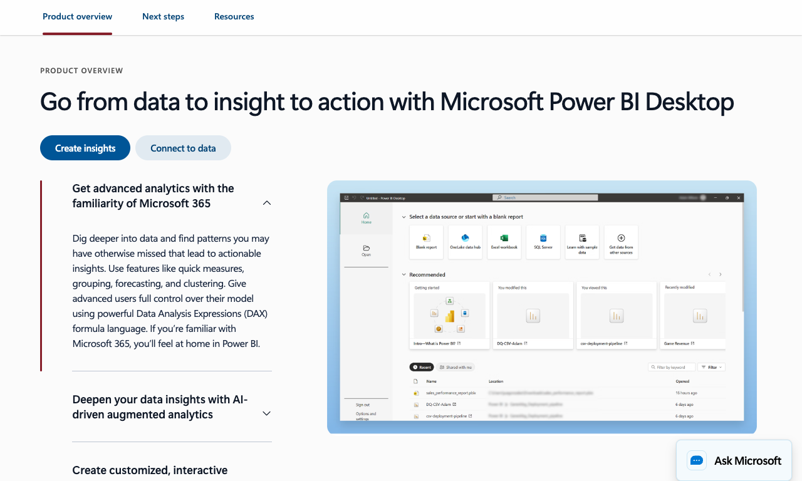
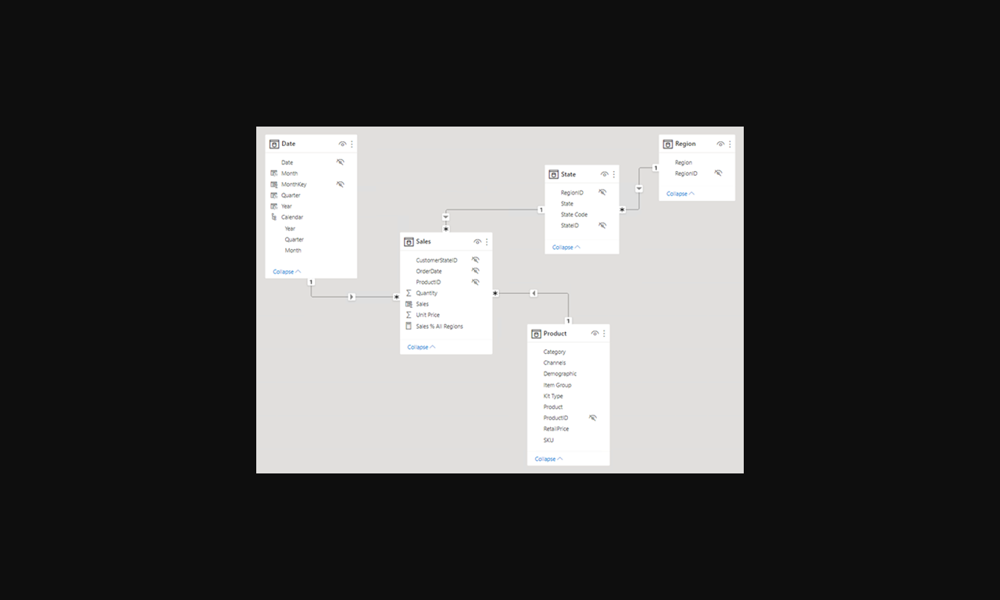
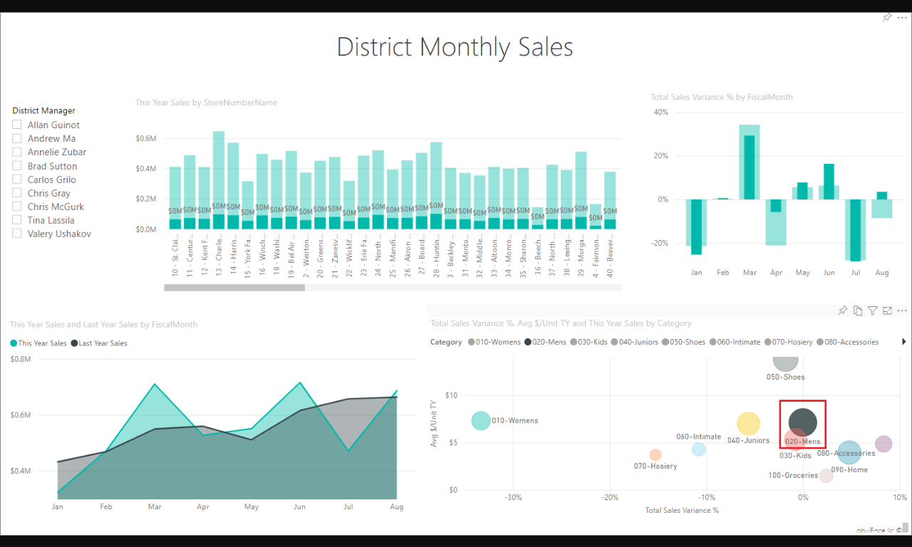
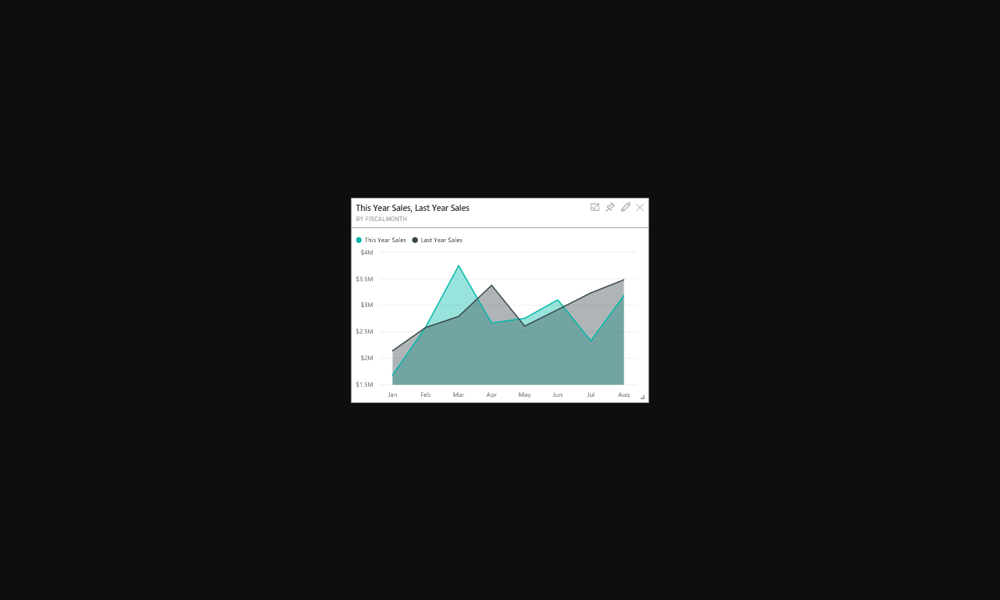
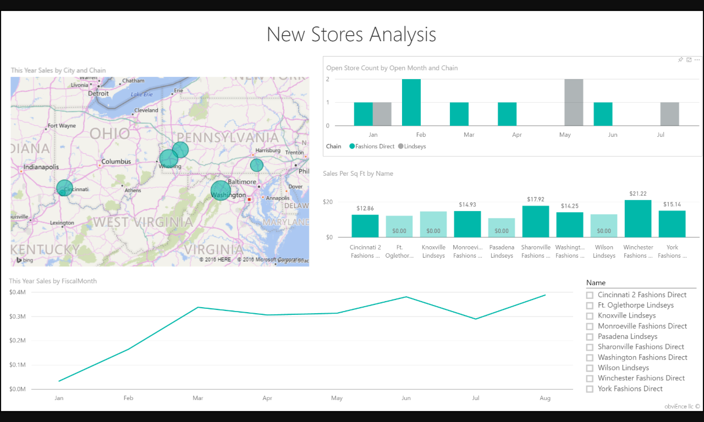
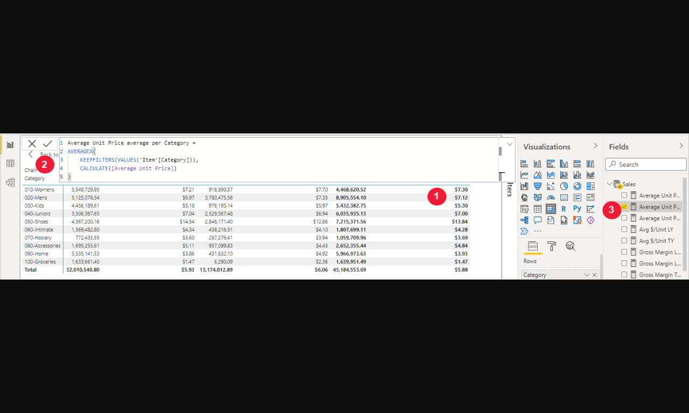
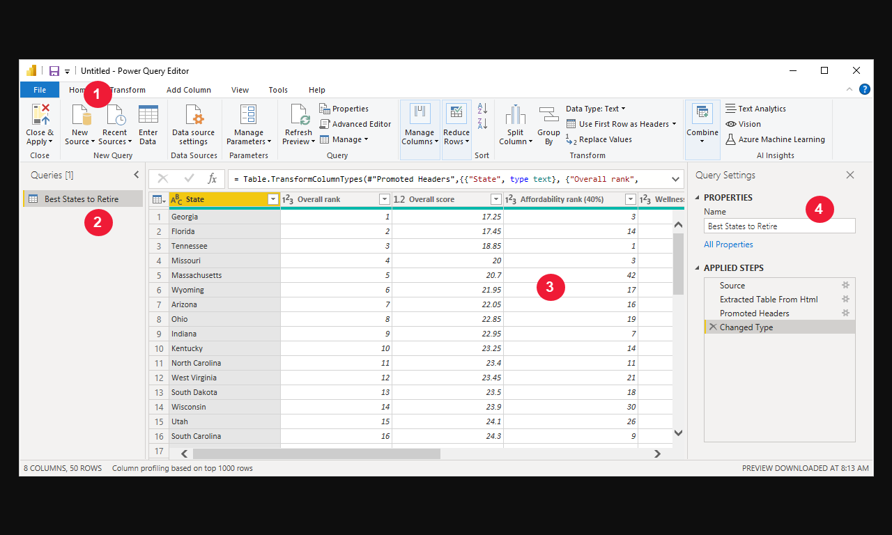
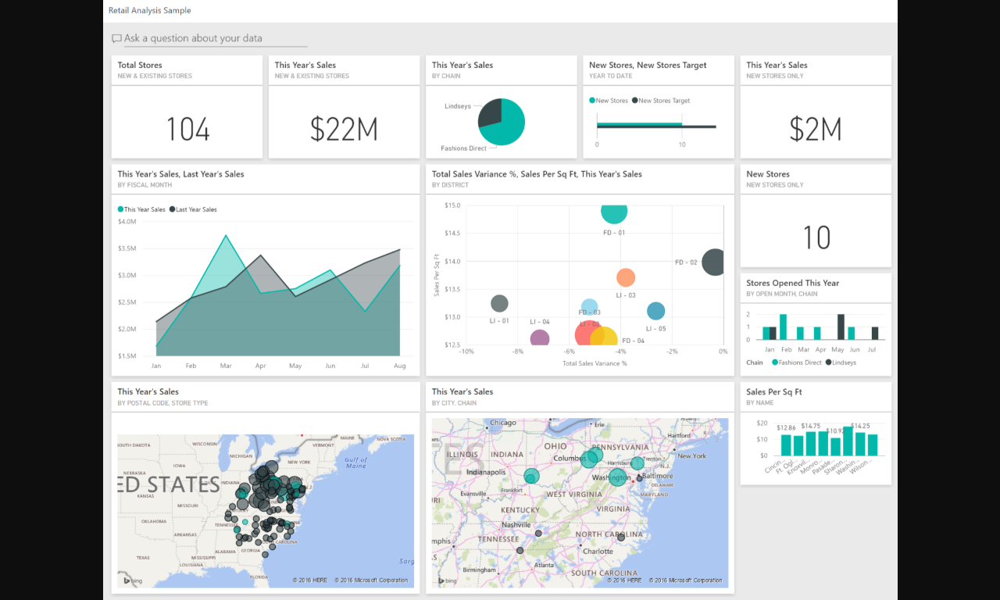

# Learning Power BI Through a Real Example: SuperStore Analysis

You have a spreadsheet of retail sales. Your manager wants to know which regions are underperforming and why — by tomorrow. Power BI can turn that spreadsheet into an interactive, automatically-updating dashboard in under an hour. That's what you'll build here.

**After this lesson:** you can explain the core ideas in "Learning Power BI Through a Real Example: SuperStore Analysis" and reproduce the examples here in your own notebook or environment.

> **Note:** This tutorial is **UI-first**.
> - **Windows:** Use Power BI Desktop (free download from the Microsoft Store or powerbi.microsoft.com).
> - **macOS:** Power BI Desktop is not available natively. Use [Power BI Service](https://app.powerbi.com) in your browser, or run Power BI Desktop in a Windows VM. Most steps in this guide translate directly to the Service; note differences where they appear.

> **Desktop vs Service:** Power BI Desktop (Windows only) is the full tool. Power BI Service (web, any browser) is 90% the same but with limited Power Query editing. This guide works in both — build in Desktop if you have it, use Service on Mac.

## Helpful video

Search YouTube for **"Power BI Desktop tutorial for beginners"** and watch any recent Microsoft or community walkthrough. The Microsoft Power BI channel publishes feature-specific videos that pair well with this guide.

## Key Terms

Before diving in, here are the core concepts you'll encounter throughout this guide:

| Term | What it means | Example |
|------|---------------|---------|
| Measure | A calculated number | Total Sales = SUM of all sales |
| Dimension | A category to group by | Region, Product Category |
| Slicer | An interactive filter | Click "West" to see only West data |
| Relationship | A link between two tables | Orders linked to Products via Product ID |
| DAX | Power BI's formula language | `Total Sales = SUM(Orders[Sales])` |
| Power Query | Data cleaning tool | Remove duplicates, fix date formats |

## Getting Started

### 1. Opening Power BI and Connecting to Data

1. Launch Power BI Desktop (**macOS:** open [Power BI Service](https://app.powerbi.com) in your browser instead)
2. On the start page, click **Get Data** (Service: click **+ New** → **Report**, then **Add data to start building a report**)
3. Select "Excel" from the data sources
4. Navigate to the Superstore sample file and select it:
   - **Windows:** `Documents\Power BI Desktop\Samples\Sample - Superstore.xlsx`
   - **macOS (Service):** Upload the file via **Get Data > Excel Workbook** from wherever you saved it
5. Click "Load" to import the dataset


### 2. Understanding the Power BI Workspace





The Power BI interface consists of several key areas:

1. **Report View**
   - Main canvas for creating visualizations
   - Multiple pages for different analyses
   - Formatting options in the right pane

2. **Data View**
   - Shows the imported data tables
   - Allows data cleaning and transformation
   - Displays data types and values

3. **Model View**
   - Shows table relationships
   - Allows relationship management
   - Displays data model structure

4. **Panels**
   - **Visualizations**: Chart types and formatting options
   - **Fields**: Available data fields
   - **Filters**: Filtering options
   - **Format**: Visual formatting controls


## Project Overview

In this comprehensive case study, we'll analyze retail data to drive business decisions. By the end of this tutorial, you will create:

- A dynamic sales performance dashboard
- A geographical distribution analysis
- A product profitability analysis
- Interactive filters and drill-downs


## Dataset Introduction

We'll utilize the "Sample - Superstore" dataset included with Power BI. This dataset is ideal for learning because:

- It contains clean, pre-formatted data
- It includes realistic business scenarios
- It's readily available in Power BI
- It covers multiple analysis dimensions


### Data Structure Overview

The dataset consists of four primary tables:

```yaml
Data Structure:
1. Orders Table:
   Primary Fields:
   - Order ID (Primary Key)
   - Order Date (Date/Time)
   - Ship Date (Date/Time)
   - Ship Mode (String)
   - Customer ID (Foreign Key)
   - Product ID (Foreign Key)
   - Quantity (Integer)
   - Sales (Decimal)
   - Profit (Decimal)
   
   Additional Metadata:
   - Row Count: ~9,000
   - Date Range: 4 years
   - NULL handling: No nulls
   
2. Products Table:
   Primary Fields:
   - Product ID (Primary Key)
   - Category (String)
   - Sub-Category (String)
   - Product Name (String)
   
   Classification:
   - Categories: 3
   - Sub-Categories: 17
   - Products: ~1,500

3. Customers Table:
   Primary Fields:
   - Customer ID (Primary Key)
   - Customer Name (String)
   - Segment (String)
   - Region (String)
   
   Segmentation:
   - Customer Types: 3
   - Regions: 4
   - States: 48

4. Returns Table (Optional):
   Primary Fields:
   - Order ID (Foreign Key)
   - Return Status (Boolean)
   
   Statistics:
   - Return Rate: ~10%
   - Tracking Period: Full dataset
```




## Step-by-Step Visualization Guide

### 1. Creating Your First Chart: Sales by Category

1. In the Report view, click on a blank area of the canvas
2. In the Visualizations pane, select "Clustered Column Chart"
3. In the Fields pane:
   - Drag "Category" to the Axis field well
   - Drag "Sales" to the Values field well
4. To enhance:
   - Click on the chart to access formatting options
   - Add data labels from the Format pane
   - Customize colors and title




### 2. Time Series Analysis

#### Line Chart with Multiple Measures

1. Create a new page (click the "+" icon at bottom)
2. Select "Line Chart" from Visualizations
3. Basic Setup:
   - Drag "Order Date" to Axis
   - Drag "Sales" to Values
   - Click "Add to existing values" and add "Profit"
4. Customization:
   - Format lines in the Format pane
   - Add markers for data points
   - Configure dual axis in the Format pane
   - Add reference lines from Analytics pane




### 3. Geographic Analysis

#### Creating a Map Visualization

1. Create a new page
2. Select "Map" from Visualizations
3. Basic Setup:
   - Drag "State" to Location
   - Drag "Sales" to Size
   - Drag "Profit" to Color
4. Customization:
   - Adjust color gradient in Format pane
   - Add data labels
   - Configure tooltips
   - Add reference lines




### 4. Building a Dashboard

1. Arrange your visualizations on the canvas
2. Add a title using the Text Box tool
3. Adding Interactivity:
   - Set up cross-filtering in the Format pane
   - Add slicers from the Visualizations pane
   - Configure drill-through options
   - Set up bookmarks for different views


## Advanced Features

### 1. DAX Measures

1. Creating a Basic Measure:
   - Click "New Measure" in the Modeling tab
   - Enter formula: `Profit Ratio = DIVIDE(SUM([Profit]), SUM([Sales]))`
   - Click the checkmark to save




### 2. Parameters

1. Creating a Parameter:
   - Go to Modeling tab
   - Click "New Parameter"
   - Configure settings (data type, range, etc.)
   - Click OK
2. Using the Parameter:
   - Add parameter control to report
   - Use in measures or filters


## Tips and Best Practices

1. **Data Organization**
   - Use consistent naming conventions
   - Create a clear folder structure in Fields pane
   - Document measures and calculations

2. **Performance**
   - Use DirectQuery for large datasets
   - Optimize DAX calculations
   - Limit the number of visuals per page

3. **User Experience**
   - Add clear instructions using text boxes
   - Include tooltips
   - Test on different screen sizes
   - Use bookmarks for guided analysis

## Saving and Publishing

1. Save your report:
   - File > Save As
   - Choose location and name
   - Select file type (.pbix)

2. Publishing options:
   - Publish to Power BI Service
   - Export as PDF/image
   - Share via Power BI Service
   - Create Power BI Apps


## Power Query Transformations

### 1. Data Cleaning and Preparation

1. Access Power Query Editor:
   - Click "Transform Data" in the Home tab
   - Or right-click a table and select "Edit Query"

2. Common Transformations:
   - Remove duplicates
   - Split columns
   - Change data types
   - Create calculated columns
   - Merge queries
   - Pivot/unpivot data




### 2. Advanced Data Modeling

1. Creating Hierarchies:
   - Right-click fields in the Fields pane
   - Select "Create Hierarchy"
   - Add related fields (e.g., Category > Sub-Category > Product)

2. Setting Up Relationships:
   - Go to Model view
   - Drag fields between tables to create relationships
   - Configure relationship properties (cardinality, cross-filter direction)


## Advanced Visualizations

### 1. Custom Visuals

1. Adding Custom Visuals:
   - Click "..." in Visualizations pane
   - Select "Get More Visuals"
   - Browse and install from AppSource

2. Popular Custom Visuals:
   - Chiclet Slicer
   - Drill Down Combo PRO
   - Smart Filter PRO
   - Zebra BI Tables


### 2. Advanced Chart Types

1. Decomposition Tree:
   - Select "Decomposition Tree" from Visualizations
   - Add measure to Analyze
   - Add dimensions to Explain by
   - Configure drill-down options

2. Key Influencers:
   - Select "Key Influencers" visual
   - Add target measure
   - Add potential influencers
   - Configure analysis settings


## Advanced DAX Patterns

### 1. Time Intelligence Functions

<div class="code-explainer" data-code-explainer>
<div class="code-explainer__code">


// Year-to-Date Sales
YTD Sales =
CALCULATE(
    SUM([Sales]),
    DATESYTD('Date'[Date])
)

// Previous Year Comparison
PY Sales =
CALCULATE(
    SUM([Sales]),
    SAMEPERIODLASTYEAR('Date'[Date])
)

// Moving Average
MA Sales =
AVERAGEX(
    DATESINPERIOD(
        'Date'[Date],
        LASTDATE('Date'[Date]),
        -3,
        MONTH
    ),
    [Sales]
)


</div>
<aside class="code-explainer__callouts" aria-label="Code walkthrough">
  <div class="code-callout" data-lines="1-6" data-tint="1">
    <div class="code-callout__meta">
      <span class="code-callout__lines"></span>
      <span class="code-callout__title">Year-to-Date</span>
    </div>
    <div class="code-callout__body">
      <p><code>DATESYTD</code> returns all dates from Jan 1 to the current date in the filter context, giving a cumulative YTD total.</p>
    </div>
  </div>
  <div class="code-callout" data-lines="8-13" data-tint="2">
    <div class="code-callout__meta">
      <span class="code-callout__lines"></span>
      <span class="code-callout__title">Prior Year Compare</span>
    </div>
    <div class="code-callout__body">
      <p><code>SAMEPERIODLASTYEAR</code> shifts the date filter back exactly one year, enabling clean YoY variance calculations.</p>
    </div>
  </div>
  <div class="code-callout" data-lines="15-24" data-tint="3">
    <div class="code-callout__meta">
      <span class="code-callout__lines"></span>
      <span class="code-callout__title">3-Month Moving Average</span>
    </div>
    <div class="code-callout__body">
      <p><code>DATESINPERIOD</code> with <code>-3 MONTH</code> creates a rolling window; <code>AVERAGEX</code> iterates over that period and averages sales.</p>
    </div>
  </div>
</aside>
</div>

### 2. Advanced Filter Context

<div class="code-explainer" data-code-explainer>
<div class="code-explainer__code">


// Top N Products by Category
Top N Products =
VAR N = 5
RETURN
CALCULATE(
    SUM([Sales]),
    TOPN(
        N,
        VALUES(Products[Product Name]),
        [Sales],
        DESC
    )
)

// Dynamic Segmentation
Customer Segment =
SWITCH(
    TRUE(),
    [Sales] > 10000, "High Value",
    [Sales] > 5000, "Medium Value",
    "Low Value"
)


</div>
<aside class="code-explainer__callouts" aria-label="Code walkthrough">
  <div class="code-callout" data-lines="1-13" data-tint="1">
    <div class="code-callout__meta">
      <span class="code-callout__lines"></span>
      <span class="code-callout__title">Top N Filter</span>
    </div>
    <div class="code-callout__body">
      <p><code>VAR N</code> stores the threshold; <code>TOPN</code> ranks product names by sales descending and <code>CALCULATE</code> applies that set as a filter.</p>
    </div>
  </div>
  <div class="code-callout" data-lines="15-21" data-tint="2">
    <div class="code-callout__meta">
      <span class="code-callout__lines"></span>
      <span class="code-callout__title">Dynamic Segmentation</span>
    </div>
    <div class="code-callout__body">
      <p><code>SWITCH(TRUE(), ...)</code> evaluates conditions in order—the first matching expression wins, replacing a chain of nested IFs.</p>
    </div>
  </div>
</aside>
</div>

## Power BI Service Features

### 1. Workspace Management

1. Creating Workspaces:
   - Access Power BI Service
   - Create new workspace
   - Configure access and roles
   - Set up data gateway

2. Content Management:
   - Schedule data refresh
   - Configure data alerts
   - Set up data lineage
   - Manage permissions


### 2. Collaboration Features

1. Sharing and Collaboration:
   - Publish to web
   - Share dashboards
   - Create apps
   - Set up row-level security

2. Mobile Experience:
   - Configure mobile layout
   - Set up push notifications
   - Optimize for mobile viewing
   - Enable offline access


## Performance Optimization

### 1. Query Optimization

1. Best Practices:
   - Use DirectQuery for large datasets
   - Implement incremental refresh
   - Optimize DAX calculations
   - Use query folding

2. Monitoring:
   - Use Performance Analyzer
   - Check query execution times
   - Monitor refresh performance
   - Analyze storage usage


### 2. Data Refresh Strategies

1. Scheduled Refresh:
   - Configure refresh schedule
   - Set up gateway
   - Monitor refresh history
   - Handle refresh failures

2. Incremental Refresh:
   - Define range parameters
   - Set up refresh policy
   - Configure archive settings
   - Monitor refresh performance




## Gotchas

- **DAX measures are evaluated in filter context, not row context** — `DIVIDE(SUM([Profit]), SUM([Sales]))` gives the correct profit margin for the current slicer selection, but writing `[Profit] / [Sales]` without aggregation evaluates at row level and then averages the ratios, producing a different and usually wrong number. Always aggregate explicitly in measures.
- **Relationships in the Model view default to bidirectional filtering, which can cause double-counting** — when you set cross-filter direction to "Both" between two tables, filters propagate in both directions and can inflate totals unexpectedly. Use single-direction filtering unless you have a specific reason for bidirectional, and test totals against known values.
- **`DATESYTD` requires a Date table with contiguous dates** — if your Date table has gaps (e.g., weekends missing for a business-day-only table), `DATESYTD` and other time intelligence functions will produce incorrect results. Power BI's time intelligence functions assume a complete, unbroken date sequence.
- **DirectQuery mode disables most DAX time intelligence functions** — `SAMEPERIODLASTYEAR`, `DATESYTD`, and `DATESINPERIOD` are not supported in DirectQuery against most sources. If you need time intelligence, you must import the data or use a calculated table. This limitation is not surfaced as an error at design time in all versions.
- **Publishing to Power BI Service requires a gateway for on-premise data sources** — workbooks that connect to local files or on-premise databases will show stale data in the Service after publishing unless an on-premise data gateway is configured and running. Reports connected only to cloud sources (SharePoint, Azure, etc.) do not need a gateway.
- **Incremental refresh policy requires `RangeStart` and `RangeEnd` parameters spelled exactly** — the parameter names are case-sensitive and must match `RangeStart` and `RangeEnd` precisely. Any variation (e.g., `range_start`, `Start`) causes the incremental refresh to silently fall back to a full refresh on every scheduled run.

## Next Steps

1. Practice with the Superstore dataset using the charts in this guide
2. Explore Power Query for more complex data transformations
3. Try the Key Influencers and Decomposition Tree visuals on your own data
4. Publish a report to Power BI Service and share it with a classmate
5. Join the [Power BI Community](https://community.powerbi.com) for examples and Q&A
