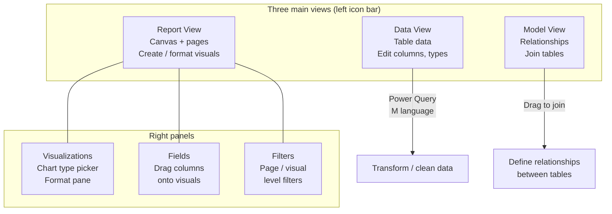

# Learning Power BI Through a Real Example: SuperStore Analysis

**After this lesson:** you can explain the core ideas in “Learning Power BI Through a Real Example: SuperStore Analysis” and reproduce the examples here in your own notebook or environment.

> **Note:** This tutorial is **UI-first** (Power BI Desktop on Windows or Mac, per Microsoft support). Sample file paths assume default sample installs.

## Helpful video

Short Tableau Public install; pair with the written guides in this folder.

<iframe width="560" height="315" src="https://www.youtube.com/embed/lTNWfhmurUg" title="Tableau Public Tutorial Download and Setup" frameborder="0" allow="accelerometer; autoplay; clipboard-write; encrypted-media; gyroscope; picture-in-picture" allowfullscreen></iframe>

## Getting Started

### 1. Opening Power BI and Connecting to Data

1. Launch Power BI Desktop
2. On the start page, click "Get Data"
3. Select "Excel" from the data sources
4. Navigate to your Power BI samples folder:
   - Path: `Documents/Power BI Desktop/Samples/`
   - Select "Sample - Superstore.xlsx"
5. Click "Load" to import the dataset

> **Figure (add screenshot or diagram):** Power BI Desktop start page — the "Get Data" button prominently displayed in the Home tab ribbon, a list of recent files on the left, and a "New report" option; the data connector gallery visible after clicking Get Data showing Excel, CSV, SQL Server, and more.


### 2. Understanding the Power BI Workspace



> **Figure (add screenshot or diagram):** Power BI Desktop workspace — annotated with Report View canvas, left icon bar (Report / Data / Model), Visualizations panel, Fields panel, and Filters panel.

The Power BI interface consists of several key areas:

1. **Report View**
   - Main canvas for creating visualizations
   - Multiple pages for different analyses
   - Formatting options in the right pane

2. **Data View**
   - Shows the imported data tables
   - Allows data cleaning and transformation
   - Displays data types and values

3. **Model View**
   - Shows table relationships
   - Allows relationship management
   - Displays data model structure

4. **Panels**
   - **Visualizations**: Chart types and formatting options
   - **Fields**: Available data fields
   - **Filters**: Filtering options
   - **Format**: Visual formatting controls

> **Figure (add screenshot or diagram):** Power BI Desktop in Report View — the left icon bar with Report/Data/Model view icons, the canvas in the center with an empty page, the Visualizations panel on the right (chart type picker + Format tab), and the Fields panel showing the loaded table columns.


## Project Overview

In this comprehensive case study, we'll analyze retail data to drive business decisions. By the end of this tutorial, you will create:

- A dynamic sales performance dashboard
- A geographical distribution analysis
- A product profitability analysis
- Interactive filters and drill-downs

> **Figure (add screenshot or diagram):** The completed Power BI SuperStore dashboard — a Sales by Category clustered column chart (top-left), a US map visualization with bubble sizes by Sales (top-right), a Sales and Profit dual-axis line chart (bottom-left), and a Region slicer on the right side for interactive filtering.


## Dataset Introduction

We'll utilize the "Sample - Superstore" dataset included with Power BI. This dataset is ideal for learning because:

- It contains clean, pre-formatted data
- It includes realistic business scenarios
- It's readily available in Power BI
- It covers multiple analysis dimensions

> **Figure (add screenshot or diagram):** Power BI Desktop Data View showing the Orders table — column headers (Order ID, Order Date, Ship Mode, Category, Sales, Profit) visible in a scrollable grid, with the table name highlighted in the Fields pane on the right.


### Data Structure Overview

The dataset consists of four primary tables:

```yaml
Data Structure:
1. Orders Table:
   Primary Fields:
   - Order ID (Primary Key)
   - Order Date (Date/Time)
   - Ship Date (Date/Time)
   - Ship Mode (String)
   - Customer ID (Foreign Key)
   - Product ID (Foreign Key)
   - Quantity (Integer)
   - Sales (Decimal)
   - Profit (Decimal)
   
   Additional Metadata:
   - Row Count: ~9,000
   - Date Range: 4 years
   - NULL handling: No nulls
   
2. Products Table:
   Primary Fields:
   - Product ID (Primary Key)
   - Category (String)
   - Sub-Category (String)
   - Product Name (String)
   
   Classification:
   - Categories: 3
   - Sub-Categories: 17
   - Products: ~1,500

3. Customers Table:
   Primary Fields:
   - Customer ID (Primary Key)
   - Customer Name (String)
   - Segment (String)
   - Region (String)
   
   Segmentation:
   - Customer Types: 3
   - Regions: 4
   - States: 48

4. Returns Table (Optional):
   Primary Fields:
   - Order ID (Foreign Key)
   - Return Status (Boolean)
   
   Statistics:
   - Return Rate: ~10%
   - Tracking Period: Full dataset
```

> **Figure (add screenshot or diagram):** Power BI Desktop Model View — four table boxes (Orders, Products, Customers, Returns) connected by relationship lines; the Orders-Products join line showing a one-to-many (1:*) cardinality marker and the relationship filter direction arrow.


## Step-by-Step Visualization Guide

### 1. Creating Your First Chart: Sales by Category

1. In the Report view, click on a blank area of the canvas
2. In the Visualizations pane, select "Clustered Column Chart"
3. In the Fields pane:
   - Drag "Category" to the Axis field well
   - Drag "Sales" to the Values field well
4. To enhance:
   - Click on the chart to access formatting options
   - Add data labels from the Format pane
   - Customize colors and title

> **Figure (add screenshot or diagram):** Power BI Report View with a Clustered Column Chart selected — the Visualizations pane showing the chart type, the Axis field well containing "Category", and the Values field well containing "Sales"; a three-bar chart on the canvas with data labels enabled.


### 2. Time Series Analysis

#### Line Chart with Multiple Measures

1. Create a new page (click the "+" icon at bottom)
2. Select "Line Chart" from Visualizations
3. Basic Setup:
   - Drag "Order Date" to Axis
   - Drag "Sales" to Values
   - Click "Add to existing values" and add "Profit"
4. Customization:
   - Format lines in the Format pane
   - Add markers for data points
   - Configure dual axis in the Format pane
   - Add reference lines from Analytics pane

> **Figure (add screenshot or diagram):** Power BI dual-axis line chart — Order Date (month granularity) on the x-axis, Sales line (left y-axis, blue) and Profit line (right y-axis, orange) visible; the Format pane open showing the "Secondary y-axis" toggle enabled and "Synchronize axes" option.


### 3. Geographic Analysis

#### Creating a Map Visualization

1. Create a new page
2. Select "Map" from Visualizations
3. Basic Setup:
   - Drag "State" to Location
   - Drag "Sales" to Size
   - Drag "Profit" to Color
4. Customization:
   - Adjust color gradient in Format pane
   - Add data labels
   - Configure tooltips
   - Add reference lines

> **Figure (add screenshot or diagram):** Power BI Map visualization — the US map with bubble markers over each state, bubble size proportional to Sales, bubble color shaded by Profit (red = loss, blue = profit); a tooltip open on California showing State, Sales, and Profit values.


### 4. Building a Dashboard

1. Arrange your visualizations on the canvas
2. Add a title using the Text Box tool
3. Adding Interactivity:
   - Set up cross-filtering in the Format pane
   - Add slicers from the Visualizations pane
   - Configure drill-through options
   - Set up bookmarks for different views

> **Figure (add screenshot or diagram):** Power BI Report View with multiple visuals arranged on the canvas — a column chart top-left, a map top-right, a line chart bottom-left — and a Region slicer on the right; the Format ribbon visible with alignment snap-to-grid options highlighted.


## Advanced Features

### 1. DAX Measures

1. Creating a Basic Measure:
   - Click "New Measure" in the Modeling tab
   - Enter formula: `Profit Ratio = DIVIDE(SUM([Profit]), SUM([Sales]))`
   - Click the checkmark to save

> **Figure (add screenshot or diagram):** Power BI's New Measure formula bar — the DAX expression `Profit Ratio = DIVIDE(SUM([Profit]), SUM([Sales]))` entered, a green checkmark confirming valid syntax, and the new measure appearing in the Fields pane under the Orders table with a calculator icon.


### 2. Parameters

1. Creating a Parameter:
   - Go to Modeling tab
   - Click "New Parameter"
   - Configure settings (data type, range, etc.)
   - Click OK
2. Using the Parameter:
   - Add parameter control to report
   - Use in measures or filters

> **Figure (add screenshot or diagram):** Power BI's "Manage Parameters" dialog — a new parameter named "TopN" configured as an integer type with a range of 1–20 and a default value of 5; the parameter then referenced in a DAX measure formula visible below.


## Tips and Best Practices

1. **Data Organization**
   - Use consistent naming conventions
   - Create a clear folder structure in Fields pane
   - Document measures and calculations

2. **Performance**
   - Use DirectQuery for large datasets
   - Optimize DAX calculations
   - Limit the number of visuals per page

3. **User Experience**
   - Add clear instructions using text boxes
   - Include tooltips
   - Test on different screen sizes
   - Use bookmarks for guided analysis

## Saving and Publishing

1. Save your report:
   - File > Save As
   - Choose location and name
   - Select file type (.pbix)

2. Publishing options:
   - Publish to Power BI Service
   - Export as PDF/image
   - Share via Power BI Service
   - Create Power BI Apps

> **Figure (add screenshot or diagram):** Power BI Desktop with "Publish" clicked — a workspace selection dialog listing available Power BI Service workspaces (My Workspace, Team Analytics, Sales Dashboard); a success confirmation "Published to Power BI" with an "Open in Power BI" link.


## Next Steps

1. Explore more advanced visualizations
2. Learn about Power Query transformations
3. Practice with different datasets
4. Join the Power BI community
5. Explore Power BI Service features

Remember: Practice makes perfect! Try recreating these visualizations and experiment with different options to build your Power BI skills.

## Power Query Transformations

### 1. Data Cleaning and Preparation

1. Access Power Query Editor:
   - Click "Transform Data" in the Home tab
   - Or right-click a table and select "Edit Query"

2. Common Transformations:
   - Remove duplicates
   - Split columns
   - Change data types
   - Create calculated columns
   - Merge queries
   - Pivot/unpivot data

> **Figure (add screenshot or diagram):** Power BI's Power Query Editor — the Orders table open, with the "Applied Steps" panel on the right listing transformation steps (Source, Navigation, Changed Type, Removed Duplicates); the Home tab showing Remove Rows, Split Column, and Merge Queries buttons.


### 2. Advanced Data Modeling

1. Creating Hierarchies:
   - Right-click fields in the Fields pane
   - Select "Create Hierarchy"
   - Add related fields (e.g., Category > Sub-Category > Product)

2. Setting Up Relationships:
   - Go to Model view
   - Drag fields between tables to create relationships
   - Configure relationship properties (cardinality, cross-filter direction)

> **Figure (add screenshot or diagram):** Power BI Model View showing a hierarchy setup — the "Category" field expanded to reveal "Sub-Category" and "Product Name" as child levels; an "Edit Relationship" dialog open between Orders and Products showing cardinality and cross-filter direction settings.


## Advanced Visualizations

### 1. Custom Visuals

1. Adding Custom Visuals:
   - Click "..." in Visualizations pane
   - Select "Get More Visuals"
   - Browse and install from AppSource

2. Popular Custom Visuals:
   - Chiclet Slicer
   - Drill Down Combo PRO
   - Smart Filter PRO
   - Zebra BI Tables

> **Figure (add screenshot or diagram):** Power BI's AppSource visual gallery — a search result for "Chiclet Slicer" showing the visual thumbnail, rating (4.5 stars), install count, and an "Add" button; the custom visual then appearing in the Visualizations pane alongside built-in charts.


### 2. Advanced Chart Types

1. Decomposition Tree:
   - Select "Decomposition Tree" from Visualizations
   - Add measure to Analyze
   - Add dimensions to Explain by
   - Configure drill-down options

2. Key Influencers:
   - Select "Key Influencers" visual
   - Add target measure
   - Add potential influencers
   - Configure analysis settings

> **Figure (add screenshot or diagram):** Power BI Decomposition Tree visual — the root node showing total Sales, expanded to Category level (3 branches), then Sub-Category, with the AI "+" button suggesting the next best split; the Key Influencers visual beside it showing which factors most increase Profit.


## Advanced DAX Patterns

### 1. Time Intelligence Functions

<div class="code-explainer" data-code-explainer>
<div class="code-explainer__code">


// Year-to-Date Sales
YTD Sales =
CALCULATE(
    SUM([Sales]),
    DATESYTD('Date'[Date])
)

// Previous Year Comparison
PY Sales =
CALCULATE(
    SUM([Sales]),
    SAMEPERIODLASTYEAR('Date'[Date])
)

// Moving Average
MA Sales =
AVERAGEX(
    DATESINPERIOD(
        'Date'[Date],
        LASTDATE('Date'[Date]),
        -3,
        MONTH
    ),
    [Sales]
)


</div>
<aside class="code-explainer__callouts" aria-label="Code walkthrough">
  <div class="code-callout" data-lines="1-6" data-tint="1">
    <div class="code-callout__meta">
      <span class="code-callout__lines"></span>
      <span class="code-callout__title">Year-to-Date</span>
    </div>
    <div class="code-callout__body">
      <p><code>DATESYTD</code> returns all dates from Jan 1 to the current date in the filter context, giving a cumulative YTD total.</p>
    </div>
  </div>
  <div class="code-callout" data-lines="8-13" data-tint="2">
    <div class="code-callout__meta">
      <span class="code-callout__lines"></span>
      <span class="code-callout__title">Prior Year Compare</span>
    </div>
    <div class="code-callout__body">
      <p><code>SAMEPERIODLASTYEAR</code> shifts the date filter back exactly one year, enabling clean YoY variance calculations.</p>
    </div>
  </div>
  <div class="code-callout" data-lines="15-24" data-tint="3">
    <div class="code-callout__meta">
      <span class="code-callout__lines"></span>
      <span class="code-callout__title">3-Month Moving Average</span>
    </div>
    <div class="code-callout__body">
      <p><code>DATESINPERIOD</code> with <code>-3 MONTH</code> creates a rolling window; <code>AVERAGEX</code> iterates over that period and averages sales.</p>
    </div>
  </div>
</aside>
</div>

### 2. Advanced Filter Context

<div class="code-explainer" data-code-explainer>
<div class="code-explainer__code">


// Top N Products by Category
Top N Products =
VAR N = 5
RETURN
CALCULATE(
    SUM([Sales]),
    TOPN(
        N,
        VALUES(Products[Product Name]),
        [Sales],
        DESC
    )
)

// Dynamic Segmentation
Customer Segment =
SWITCH(
    TRUE(),
    [Sales] > 10000, "High Value",
    [Sales] > 5000, "Medium Value",
    "Low Value"
)


</div>
<aside class="code-explainer__callouts" aria-label="Code walkthrough">
  <div class="code-callout" data-lines="1-13" data-tint="1">
    <div class="code-callout__meta">
      <span class="code-callout__lines"></span>
      <span class="code-callout__title">Top N Filter</span>
    </div>
    <div class="code-callout__body">
      <p><code>VAR N</code> stores the threshold; <code>TOPN</code> ranks product names by sales descending and <code>CALCULATE</code> applies that set as a filter.</p>
    </div>
  </div>
  <div class="code-callout" data-lines="15-21" data-tint="2">
    <div class="code-callout__meta">
      <span class="code-callout__lines"></span>
      <span class="code-callout__title">Dynamic Segmentation</span>
    </div>
    <div class="code-callout__body">
      <p><code>SWITCH(TRUE(), ...)</code> evaluates conditions in order—the first matching expression wins, replacing a chain of nested IFs.</p>
    </div>
  </div>
</aside>
</div>

## Power BI Service Features

### 1. Workspace Management

1. Creating Workspaces:
   - Access Power BI Service
   - Create new workspace
   - Configure access and roles
   - Set up data gateway

2. Content Management:
   - Schedule data refresh
   - Configure data alerts
   - Set up data lineage
   - Manage permissions

> **Figure (add screenshot or diagram):** Power BI Service workspace management page — a list of workspace members with their roles (Admin, Member, Contributor, Viewer), a "Schedule refresh" panel showing a dataset with its next refresh time, and a "Data gateway" status indicator.


### 2. Collaboration Features

1. Sharing and Collaboration:
   - Publish to web
   - Share dashboards
   - Create apps
   - Set up row-level security

2. Mobile Experience:
   - Configure mobile layout
   - Set up push notifications
   - Optimize for mobile viewing
   - Enable offline access

> **Figure (add screenshot or diagram):** Power BI Service sharing dialog — email addresses entered in the "Grant access" field, permission level dropdown (Can view / Can edit), and a "Send notification email" checkbox; below, the "Publish to web" option showing an embed code snippet for public sharing.


## Performance Optimization

### 1. Query Optimization

1. Best Practices:
   - Use DirectQuery for large datasets
   - Implement incremental refresh
   - Optimize DAX calculations
   - Use query folding

2. Monitoring:
   - Use Performance Analyzer
   - Check query execution times
   - Monitor refresh performance
   - Analyze storage usage

> **Figure (add screenshot or diagram):** Power BI Performance Analyzer pane — a list of visuals on the current page each with "DAX query", "Visual display", and "Other" timing rows showing milliseconds; the slowest visual highlighted in red, and a "Copy query" button for exporting the DAX to DAX Studio for deeper analysis.


### 2. Data Refresh Strategies

1. Scheduled Refresh:
   - Configure refresh schedule
   - Set up gateway
   - Monitor refresh history
   - Handle refresh failures

2. Incremental Refresh:
   - Define range parameters
   - Set up refresh policy
   - Configure archive settings
   - Monitor refresh performance

> **Figure (add screenshot or diagram):** Power BI Service dataset settings page — the "Scheduled refresh" section showing a toggle (On), frequency set to "Daily", time slots configured at 6 AM and 6 PM, and a "Refresh history" table below listing the last 5 refresh attempts with success/failure status and duration.


## Security and Governance

### 1. Row-Level Security

1. Implementing RLS:
   - Create security roles
   - Define DAX filters
   - Test security rules
   - Deploy to service

2. Dynamic Security:
   - User-based filters
   - Organization-based filters
   - Time-based filters
   - Custom security rules

> **Figure (add screenshot or diagram):** Power BI Desktop's "Manage roles" dialog for row-level security — a "Salesperson" role defined with the DAX filter `[Region] = USERNAME()` on the Orders table; a "View as roles" preview button showing the report filtered to one region.


### 2. Data Governance

1. Compliance Features:
   - Sensitivity labels
   - Data classification
   - Audit logs
   - Compliance reports

2. Monitoring:
   - Usage metrics
   - Performance monitoring
   - Security monitoring
   - Compliance reporting

> **Figure (add screenshot or diagram):** Power BI Admin Portal — the "Usage metrics" page showing a bar chart of report views per day for the past 30 days, a top-10 most-viewed reports table, and an "Audit logs" link pointing to Microsoft 365 compliance center for deeper event-level tracking.

