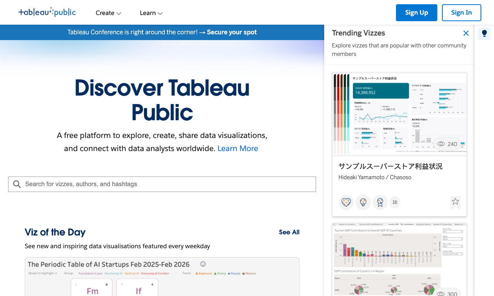
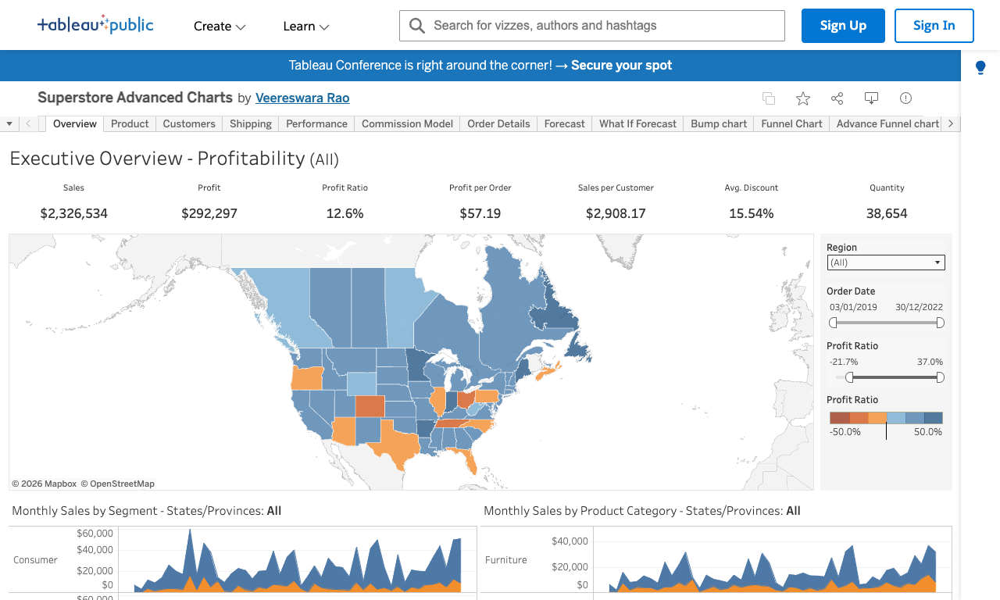
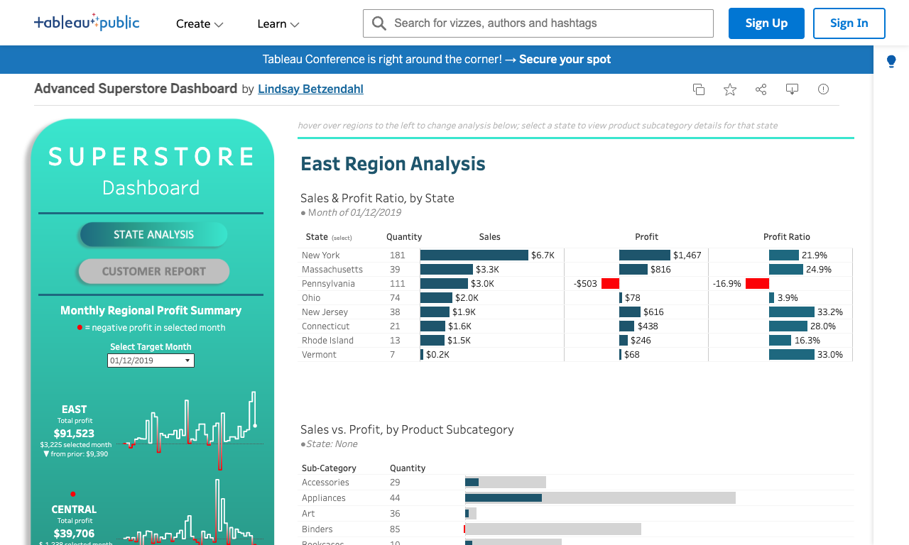
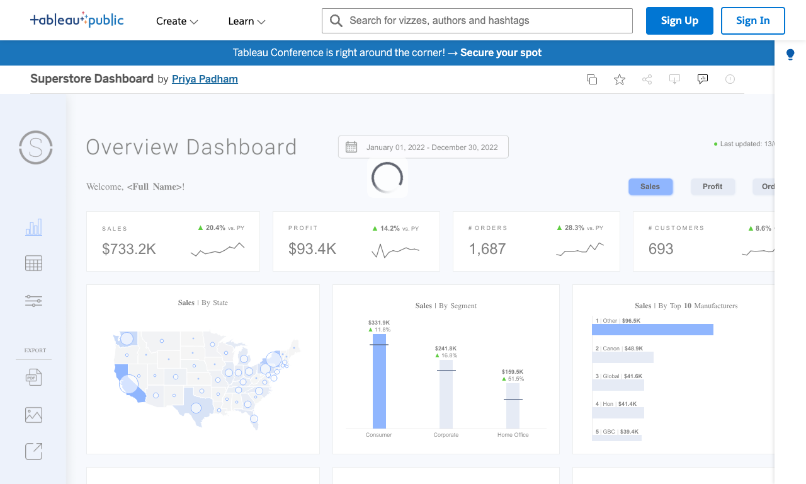
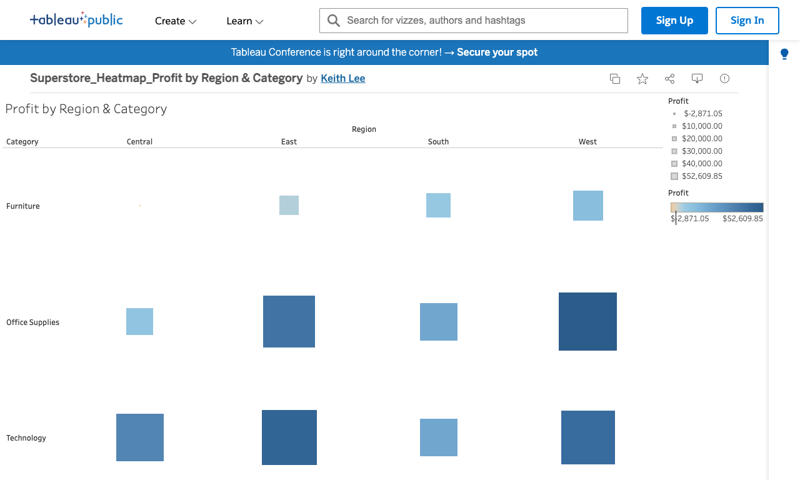
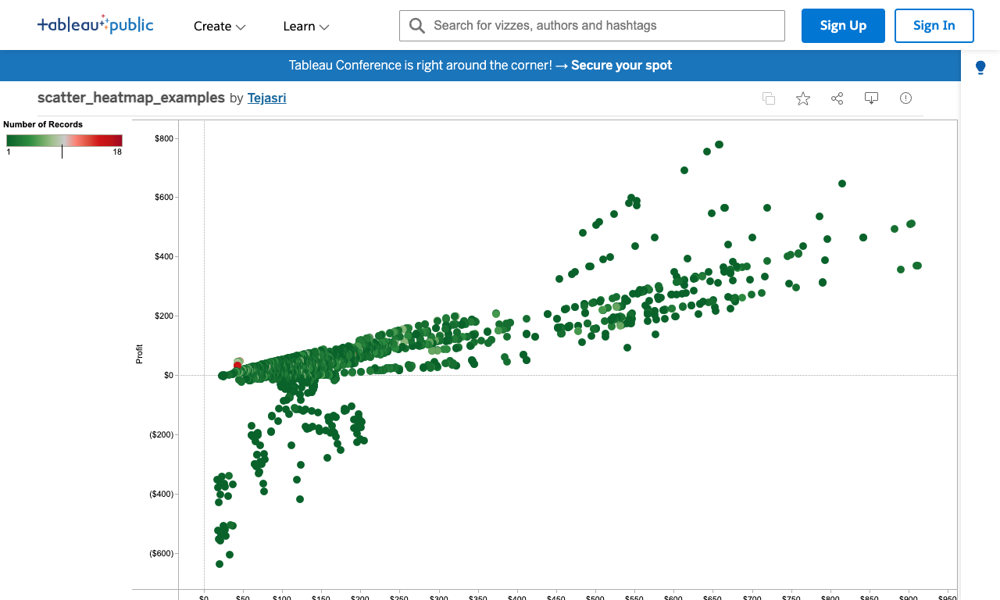
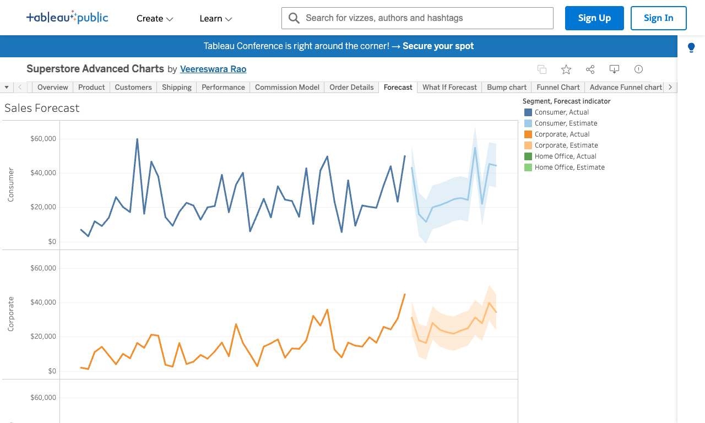

# Tableau Basics: Sample Superstore Guide

**After this lesson:** you can explain the core ideas in "Tableau Basics: Sample Superstore Guide" and reproduce the examples here in your own notebook or environment.

> **Note:** This submodule is **UI-first**. You will follow clicks and shelves in Tableau Desktop rather than writing Python for the main workflow.

## Helpful video

Short Tableau Public install; pair with the written guides in this folder.

<iframe width="560" height="315" src="https://www.youtube.com/embed/lTNWfhmurUg" title="Tableau Public Tutorial Download and Setup" frameborder="0" allow="accelerometer; autoplay; clipboard-write; encrypted-media; gyroscope; picture-in-picture" allowfullscreen></iframe>

## Introduction to Tableau with Sample Superstore

Tableau is a powerful data visualization tool that enables interactive analytics and visualizations. The Sample Superstore dataset is a built-in dataset that simulates a retail business, making it ideal for learning Tableau's features and capabilities. This guide covers:

- Tableau's intuitive visualization interface
- Real-time data analysis without coding
- Interactive dashboard creation
- Advanced visualization techniques

### Prerequisites

1. **Required Components:**
   - Tableau Desktop 2021.1 or newer
   - Basic understanding of data analysis
   - Familiarity with business metrics

2. **System Requirements:**
   - Windows 10/11 or macOS 12+
   - 8GB RAM minimum (16GB recommended)
   - 2GB free disk space
   - Modern multi-core processor

### Getting Started: Step-by-Step Guide

#### 1. Connecting to Sample Superstore

1. Launch Tableau Desktop.



- In the Connect pane on the left, under **Saved Data Sources**, click **Sample - Superstore**.

2. Preview the data source.


- Review the data structure. Dimensions (blue) and measures (green) appear in the pane.
- Scan the first 1,000 rows to confirm fields look reasonable.

3. Open a new worksheet.


- Click **New Worksheet** and familiarize yourself with shelves, marks, and the Data pane.

#### 2. Creating Your First Visualization

Example: **Sales by Category** bar chart.

1. Build the chart.



- Drag **Category** to **Rows**.
- Drag **Sales** to **Columns**. Tableau should show a horizontal bar chart.

2. Customize and refine.


- Use **Show Me** if needed.
- Sort bars by sales (descending), add color by category, and add data labels.

3. Format the view.


- Adjust axis labels, colors, title, and number formats.

> **Ask AI (Claude or ChatGPT)**
>
> "I've built a bar chart in Tableau showing Sales by Category. What else can I add to make it more informative — e.g. reference lines, labels, or secondary measures? Walk me through each enhancement step by step."

#### 3. Adding Filters and Interactivity

1. Add filters.


- Drag **Region** to **Filters**, choose regions, and apply.

2. Create parameters (optional).



- Right-click in the Data pane, choose **Create Parameter**, configure it, and add the control to the view.

3. Use dashboard actions.


- On a dashboard, add multiple sheets and configure filter or highlight actions.

#### 4. Building a Complete Dashboard

1. Layout.


- Create a **New Dashboard**, add worksheets, and arrange tiles.

2. Interactivity.


- Add filters, actions, parameter controls, and navigation as needed.

3. Final polish.


- Add legends, align colors, adjust spacing, and tune tooltips.

### Common Visualization Examples

#### 1. Sales Analysis Dashboard

1. Sales trend.


- **Order Date** (Month) on **Columns**, **Sales** on **Rows**. Add a trend line and format dates.

2. Geographic map.



- **State** on the map, **Sales** on **Color**, labels and tooltips as needed.

3. Category breakdown.


- **Category** on **Rows**, **Sales** on **Columns**, sort and add percentage labels if useful.

#### 2. Profit Analysis Dashboard

1. Profit by sub-category.



- **Sub-Category** on **Columns**, **Category** on **Rows**, **Profit** on **Color**.

2. Discount impact.



- **Discount** on one axis, **Profit Ratio** on the other; add a trend line or bins.

3. Regional performance.


- **Region** on the map, **Profit** on **Color**, reference lines and tooltips as needed.

### Advanced Features

#### 1. Calculated Fields

1. Profit ratio.


- Formula: `SUM([Profit])/SUM([Sales])`
- Right-click in the Data pane, **Create Calculated Field**, enter the formula, and name the field.

2. Year-over-year growth.



- Example: `(SUM([Sales]) - LOOKUP(SUM([Sales]), -1))/ABS(LOOKUP(SUM([Sales]), -1))`
- Set up as a table calculation and format as a percentage.

> **Ask AI (Claude or ChatGPT)**
>
> "I'm getting an error in this Tableau calculated field: `[paste your formula here]`. The error message says: [paste the error]. My fields are: [list relevant field names and types]. What's wrong and how do I fix it?"

> **Ask AI (Claude or ChatGPT)**
>
> "Write a Tableau calculated field that flags orders where the profit margin is below 10%. My data has [Sales] and [Profit] fields. I want to use it to color-code marks on a scatter plot."

#### 2. Level of Detail Expressions

1. Fixed LOD.


- Example: `{FIXED [Category] : SUM([Sales])}`
- Create a calculated field, enter the LOD expression, apply to the view.

2. Include LOD.


- Example: `{INCLUDE [Region] : AVG([Profit])}`
- Add to the view and format as needed.

> **Ask AI (Claude or ChatGPT)**
>
> "Explain the difference between FIXED, INCLUDE, and EXCLUDE LOD expressions in Tableau with a simple analogy. Then tell me which one I should use if I want to [describe your goal, e.g. 'compare each customer's total spend to the overall average spend, regardless of what filters are applied']."

### Best Practices for High-Performance Visualizations

#### 1. Data Source Optimization

```yaml
Optimization Steps:
1. Data Preparation:
   - Clean and prepare data before analysis
   - Use appropriate data types
   - Remove unnecessary fields
   - Create data extracts for better performance

2. Query Optimization:
   - Use appropriate filters
   - Implement efficient calculations
   - Optimize data extracts
   - Monitor query performance

3. Resource Management:
   - Monitor memory usage
   - Optimize view complexity
   - Configure refresh intervals
   - Manage dashboard size
```

#### 2. Dashboard Design Optimization

```yaml
Design Best Practices:
1. Layout Optimization:
   - Use efficient dashboard layouts
   - Implement appropriate sizing
   - Optimize view placement
   - Balance information density

2. Performance Considerations:
   - Limit number of views
   - Use appropriate chart types
   - Implement efficient filters
   - Monitor dashboard performance

3. User Experience:
   - Create intuitive navigation
   - Implement clear labeling
   - Use consistent formatting
   - Provide helpful tooltips
```

#### 3. Visualization Best Practices

```yaml
Visualization Guidelines:
1. Chart Selection:
   - Choose appropriate chart types
   - Consider data relationships
   - Optimize for readability
   - Use consistent styling

2. Color Usage:
   - Implement meaningful color schemes
   - Use color for emphasis
   - Consider color blindness
   - Maintain consistency

3. Interactivity:
   - Add appropriate filters
   - Implement dashboard actions
   - Create parameter controls
   - Enable drill-down capabilities
```

## Gotchas

- **Dragging a date field to Columns defaults to YEAR, not the full date** — Tableau automatically aggregates `Order Date` to the year level. To see monthly or daily trends, right-click the pill on the Columns shelf and select the exact date part you need (e.g., Month/Year continuous). Many learners spend time wondering why their line chart shows only a few points.
- **Dimensions and Measures are assigned at connection time, not always correctly** — Tableau classifies numeric fields as Measures and string fields as Dimensions by default. Fields like `Postal Code` or `Order ID` are numeric but should be Dimensions. Drag them to the Dimensions section of the Data pane before building any view that groups by them.
- **LOD expressions are filtered by context filters, not regular filters** — a `FIXED` LOD calculates before dimension filters are applied. If you add a Region filter and expect the LOD to respect it, it won't unless you promote that filter to a context filter (right-click the filter pill → Add to Context). This is one of the most common sources of wrong totals in Tableau.
- **`SUM([Profit])/SUM([Sales])` in a calculated field is not the same as `[Profit]/[Sales]`** — the first computes the ratio of aggregated totals, which is the correct profit margin. The second computes a row-level ratio and then aggregates it, giving a different (usually wrong) result. Always aggregate numerator and denominator independently when computing rates.
- **Published workbooks to Tableau Public expose all data in the extract** — when you publish to Tableau Public, all rows in the underlying extract are downloadable by anyone who views the workbook. Never publish workbooks connected to sensitive or proprietary data sources to Tableau Public.

## Next steps

- Continue with [Tableau case study](tableau-case-study.md) or [advanced analytics](advanced-analytics.md).
- See the submodule overview in [README](README.md) and the [module assignment](../_assignments/module-assignment.md) when you are ready for a graded exercise.

### Additional Resources

**Tableau Resources:**

- [Tableau Documentation](https://help.tableau.com/current/guides/get-started-tutorial/en-us/get-started-tutorial-home.htm)
- [Tableau Public Gallery](https://public.tableau.com/app/discover)
- [Tableau Community](https://community.tableau.com/s/)

**Support Channels:**

- Tableau Technical Support
- Community Forums
- Knowledge Base
- Training Resources

### Implementation Checklist

1. **Initial Setup:**
   - Install Tableau Desktop
   - Connect to Sample Superstore
   - Create initial worksheets
   - Test basic visualizations

2. **Performance Optimization:**
   - Configure data extracts
   - Optimize calculations
   - Implement efficient filters
   - Monitor performance

3. **Maintenance:**
   - Regular performance testing
   - Update visualizations
   - Monitor usage patterns
   - Document changes

4. **Security:**
   - Implement user permissions
   - Configure data access
   - Monitor usage
   - Maintain audit logs
