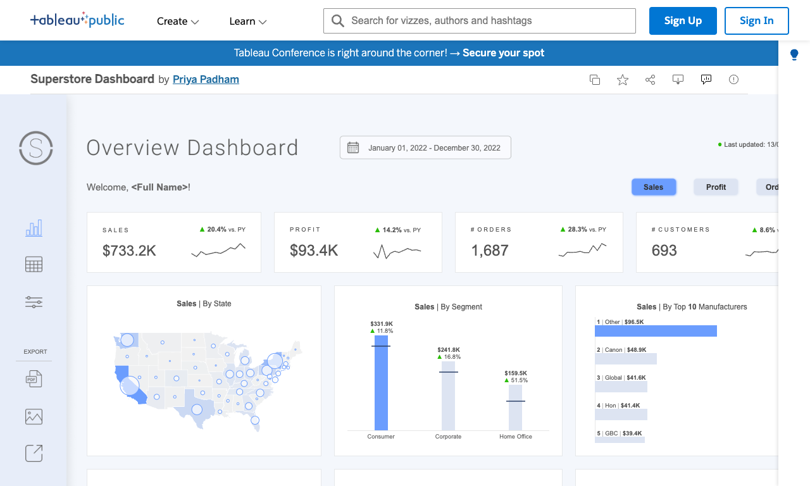
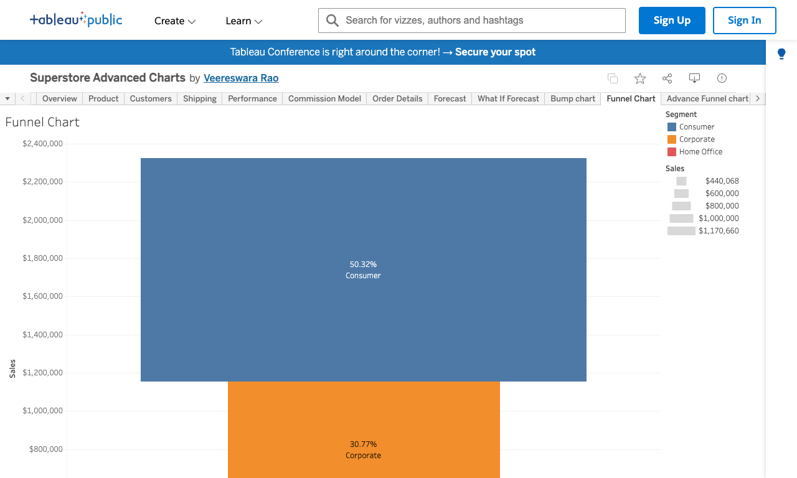

# Learning Tableau Through a Real Example: SuperStore Analysis

**After this lesson:** you can explain the core ideas in "Learning Tableau Through a Real Example: SuperStore Analysis" and reproduce the examples here in your own notebook or environment.

You're a retail analyst. Sales are growing but profit is flat — why? In this case study, you'll build a Tableau dashboard that reveals exactly which products and regions are dragging down margins. The same techniques work on any business dataset.

> **Note:** This tutorial is **UI-first** (Tableau Desktop). Install Tableau or use your course lab; paths to sample data may differ slightly by version and OS.

## Helpful video

Short Tableau Public install; pair with the written guides in this folder.

<iframe width="560" height="315" src="https://www.youtube.com/embed/lTNWfhmurUg" title="Tableau Public Tutorial Download and Setup" frameborder="0" allow="accelerometer; autoplay; clipboard-write; encrypted-media; gyroscope; picture-in-picture" allowfullscreen></iframe>

## Getting Started

### 1. Opening Tableau and Connecting to Data

1. Launch Tableau Desktop
2. On the start page, under "Connect", select **Sample - Superstore**
   - If it isn't listed under Saved Data Sources, click **Microsoft Excel** and browse to the file manually:
     - **macOS:** `~/Documents/My Tableau Repository/Datasources/en_US/`
     - **Windows:** `Documents\My Tableau Repository\Datasources\en_US-US\`
3. Click **Connect** to load the dataset


### 2. Understanding the Tableau Workspace

The Tableau interface consists of several key areas:

1. **Data Source Tab**
   - Shows connected tables (Orders, People, Returns)
   - Focus on the Orders table for most analyses

2. **Worksheet Area**
   - **Data Pane**: Left side panel
     - Dimensions (blue): Categorical fields (e.g., Category, State)
     - Measures (green): Numerical fields (e.g., Sales, Profit)
   - **Shelves**: Areas for building visualizations
     - Columns shelf
     - Rows shelf
     - Filters shelf
     - Marks card (for colors, labels, etc.)
   - **Canvas**: Main area where charts appear
   - **Show Me**: Panel for chart suggestions


> **Ask AI (Claude or ChatGPT)**
>
> "In Tableau, I have a field called [field name] that shows up as a Measure (green) but I want to use it as a Dimension (blue) — for example, a numeric order ID I want to group by. How do I change it, and when should I do this?"


## Project Overview

In this comprehensive case study, we'll analyze retail data to drive business decisions. By the end of this tutorial, you will create:

- A dynamic sales performance dashboard
- A geographical distribution analysis
- A product profitability analysis
- Interactive filters and drill-downs


## Dataset Introduction

We'll utilize the "Sample - Superstore" dataset included with Tableau. This dataset is ideal for learning because:

- It contains clean, pre-formatted data
- It includes realistic business scenarios
- It's readily available in Tableau
- It covers multiple analysis dimensions


### Data Structure Overview

The dataset consists of four primary tables:

```yaml
Data Structure:
1. Orders Table:
   Primary Fields:
   - Order ID (Primary Key)
   - Order Date (Date/Time)
   - Ship Date (Date/Time)
   - Ship Mode (String)
   - Customer ID (Foreign Key)
   - Product ID (Foreign Key)
   - Quantity (Integer)
   - Sales (Decimal)
   - Profit (Decimal)
   
   Additional Metadata:
   - Row Count: ~9,000
   - Date Range: 4 years
   - NULL handling: No nulls
   
2. Products Table:
   Primary Fields:
   - Product ID (Primary Key)
   - Category (String)
   - Sub-Category (String)
   - Product Name (String)
   
   Classification:
   - Categories: 3
   - Sub-Categories: 17
   - Products: ~1,500

3. Customers Table:
   Primary Fields:
   - Customer ID (Primary Key)
   - Customer Name (String)
   - Segment (String)
   - Region (String)
   
   Segmentation:
   - Customer Types: 3
   - Regions: 4
   - States: 48

4. Returns Table (Optional):
   Primary Fields:
   - Order ID (Foreign Key)
   - Return Status (Boolean)
   
   Statistics:
   - Return Rate: ~10%
   - Tracking Period: Full dataset
```

## Step-by-Step Visualization Guide

### 1. Creating Your First Chart: Sales by Category

1. Click the "Sheet 1" tab at the bottom
2. In the Data Pane:
   - Drag "Category" to the Rows shelf
   - Drag "Sales" to the Columns shelf
3. Tableau will automatically create a bar chart
4. To enhance:
   - Click on the chart type in the "Show Me" panel to try different visualizations
   - Edit the sheet title (double-click the title above the chart)
   - Add labels by dragging "Sales" to the Label mark


Now we know WHICH categories perform best. Let's look at WHEN — do we see seasonal patterns?

### 2. Time Series Analysis

#### Line Chart with Multiple Measures

1. Create a new worksheet (click the "+" icon)
2. Basic Setup:
   - Drag "Order Date" to Columns
   - Right-click and select "Month/Year"
   - Drag "Sales" to Rows
   - Drag "Profit" to Rows (dual axis)
3. Customization:
   - Format lines (thickness, style)
   - Add markers for data points
   - Configure dual axis synchronization
   - Add reference lines for averages


> **Ask AI (Claude or ChatGPT)**
>
> "I'm looking at a Tableau time series showing monthly Sales and Profit on a dual axis for the Sample Superstore dataset. Sales is trending up but Profit is flat. What are three possible explanations, and what additional charts should I build to investigate each one?"


### 3. Geographic Analysis

#### Creating a Map Visualization

1. Create a new worksheet
2. Basic Setup:
   - Drag "State" to the canvas
   - Tableau will automatically create a map
   - Drag "Sales" to Color
3. Customization:
   - Adjust color gradient
   - Add state labels
   - Configure tooltips
   - Add reference lines


### 4. Building a Dashboard



*Three common dashboard layouts. Choose based on which question is most important to your audience.*

1. Click the "New Dashboard" icon
2. Layout Design:
   - Drag your worksheets onto the dashboard canvas
   - Arrange and resize as needed
   - Add a title using the Text object
3. Adding Interactivity:
   - Click on a chart and select "Use as Filter"
   - Add filter controls
   - Configure actions
   - Set up parameters


## Advanced Features

### 1. Calculated Fields

Use calculated fields when you need a metric that doesn't exist in the raw data — for example, profit margin as a percentage, or a flag for orders with unusually high discounts.

1. Creating a Basic Calculation:
   - Right-click in the Data pane
   - Select "Create Calculated Field"
   - Name your calculation (e.g., "Profit Ratio")
   - Enter formula: `SUM([Profit])/SUM([Sales])`
   - Click OK


> **Ask AI (Claude or ChatGPT)**
>
> "Write three useful Tableau calculated fields for retail sales analysis using the Sample Superstore fields: Order Date, Sales, Profit, Discount, Quantity, Category, Sub-Category, State, Customer ID. Include: (1) a profit margin %, (2) a flag for high-discount orders above 30%, and (3) days between order date and ship date."


### 2. Parameters

1. Creating a Parameter:
   - Right-click in the Data pane
   - Select "Create Parameter"
   - Configure settings (data type, range, etc.)
   - Click OK
2. Using the Parameter:
   - Add parameter control to dashboard
   - Use in calculations or filters


## Tips and Best Practices

1. **Data Organization**
   - Keep related visualizations together
   - Use consistent color schemes
   - Maintain clear labeling

2. **Performance**
   - Use extracts for large datasets
   - Limit the number of marks
   - Optimize calculations

3. **User Experience**
   - Add clear instructions
   - Include tooltips
   - Test on different screen sizes

## Before You Publish

**Before you publish, check:**

- [ ] Chart is blank → verify you have both a Dimension on Rows/Columns and a Measure on the view
- [ ] Dual-axis chart looks misaligned → right-click the secondary axis → Synchronize Axis
- [ ] Calculated field shows error → check every bracket is matched and aggregations (SUM, AVG) are consistent
- [ ] Dashboard filter isn't working → make sure "Apply to Worksheets" is set correctly

## Saving and Sharing

1. Save your workbook:
   - File > Save As
   - Choose location and name
   - Select file type (.twb or .twbx)

2. Sharing options:
   - Publish to Tableau Public
   - Export as PDF/image
   - Share on Tableau Server




## Tableau Prep Builder

### 1. Data Preparation

1. Launching Tableau Prep:
   - Open Tableau Prep Builder
   - Click "Connect to Data"
   - Select your data source

2. Common Transformations:
   - Clean and shape data
   - Join multiple data sources
   - Aggregate data
   - Create calculated fields
   - Handle null values
   - Pivot/unpivot data


### 2. Flow Management

1. Creating a Flow:
   - Add input step
   - Add cleaning steps
   - Add output step
   - Configure refresh settings

2. Advanced Features:
   - Schedule flows
   - Monitor flow performance
   - Handle errors
   - Create reusable flows


## Advanced Calculations

> **Advanced (skip on first read):** The sections below cover Table Calculations, LOD Expressions, Advanced Visualizations, and Performance Optimization. These are powerful features but not required to build your first working dashboard. Come back to them once you're comfortable with the basics.

### 1. Table Calculations

Use table calculations when you need values that depend on what's already in the view — for example, a running total of sales over time, or each category's share of the overall total.

```sql
// Running Total
RUNNING_SUM(SUM([Sales]))

// Percent of Total
SUM([Sales]) / TOTAL(SUM([Sales]))

// Moving Average
WINDOW_AVG(SUM([Sales]), -2, 0)

// Rank
RANK(SUM([Sales]), 'desc')
```

### 2. Level of Detail (LOD) Expressions

Use LOD expressions when a filter or aggregation is collapsing detail you need to keep — for example, computing each customer's first order date regardless of how the view is filtered by region or product.

```sql
// Fixed LOD
{FIXED [Category] : SUM([Sales])}

// Include LOD
{INCLUDE [Region] : AVG([Profit])}

// Exclude LOD
{EXCLUDE [Sub-Category] : SUM([Quantity])}
```

## Advanced Visualizations

### 1. Custom Visualizations

1. Creating Custom Shapes:
   - Design shapes in external tools
   - Import to Tableau
   - Map to data
   - Configure display options

2. Advanced Chart Types:
   - Waterfall charts
   - Box and whisker plots
   - Gantt charts
   - Bullet graphs
   - Radar charts




### 2. Advanced Mapping

1. Custom Geocoding:
   - Import custom geocodes
   - Create custom territories
   - Configure map layers
   - Add custom backgrounds

2. Spatial Analysis:
   - Create buffers
   - Calculate distances
   - Perform spatial joins
   - Create density maps


## Performance Optimization

### 1. Extract Optimization

1. Creating Extracts:
   - Configure refresh schedule
   - Set up incremental refresh
   - Optimize for performance
   - Monitor extract size

2. Best Practices:
   - Filter data early
   - Aggregate when possible
   - Use appropriate data types
   - Monitor performance


### 2. Dashboard Optimization

1. Performance Tips:
   - Limit number of views
   - Use appropriate chart types
   - Optimize calculations
   - Configure caching

2. Monitoring:
   - Use Performance Recorder
   - Check query performance
   - Monitor resource usage
   - Analyze bottlenecks


> **Ask AI (Claude or ChatGPT)**
>
> "My Tableau dashboard is loading slowly. It has 8 sheets, uses a live connection to a database with 2 million rows, and has 3 LOD expressions. What steps should I take to speed it up, in priority order?"


## Next Steps

1. Explore [Tableau Public](https://public.tableau.com) and study dashboards others have built
2. Join the [Tableau Community](https://community.tableau.com) forums
3. Practice with your own dataset — connect it to Tableau and replicate the charts from this guide
4. Explore Tableau extensions for additional chart types
5. Work toward the [Tableau Desktop Specialist](https://www.tableau.com/learn/certification/desktop-specialist) certification

## Gotchas

- **"Use as Filter" on a dashboard sheet filters all other sheets by default, including ones you didn't intend** — when you enable a chart as a filter, it acts on every compatible sheet on the dashboard unless you configure a targeted filter action. Go to Dashboard → Actions to restrict the source and target sheets explicitly.
- **Dual-axis charts require synchronised axes or the chart visually lies** — if Sales is in the thousands and Profit is in the hundreds, an unsynchronised dual axis makes the two lines appear to track each other closely when they may not. Right-click the secondary axis and choose "Synchronize Axis" or use separate panels to avoid misleading comparisons.
- **Table calculations like `RUNNING_SUM` depend on the sort order of the view, not the data** — if a viewer reorders the table by clicking a column header, the running total recomputes along the new sort order, producing a completely different result. Always label running total charts with the sort assumption or lock the view.
- **Tableau Prep flows do not automatically re-run when source data changes** — a Prep flow is a manual or scheduled operation, not a live query. If you clean your data in Prep and then update the source file, the downstream Tableau workbook still shows the old cleaned data until you re-run the flow and refresh the extract.
- **Saving as `.twb` (not `.twbx`) leaves data behind** — a `.twb` file is just XML; it references the data source path but does not embed the data. When you share a `.twb` with a colleague who doesn't have access to the same data path, the workbook opens empty. Use `.twbx` to bundle the extract for portability.

Remember: Practice makes perfect! Try recreating these visualizations and experiment with different options to build your Tableau skills.
