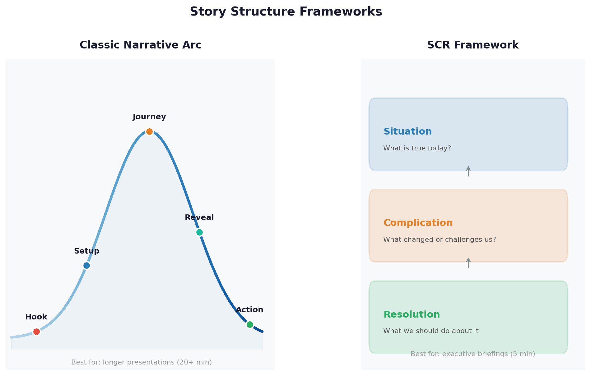
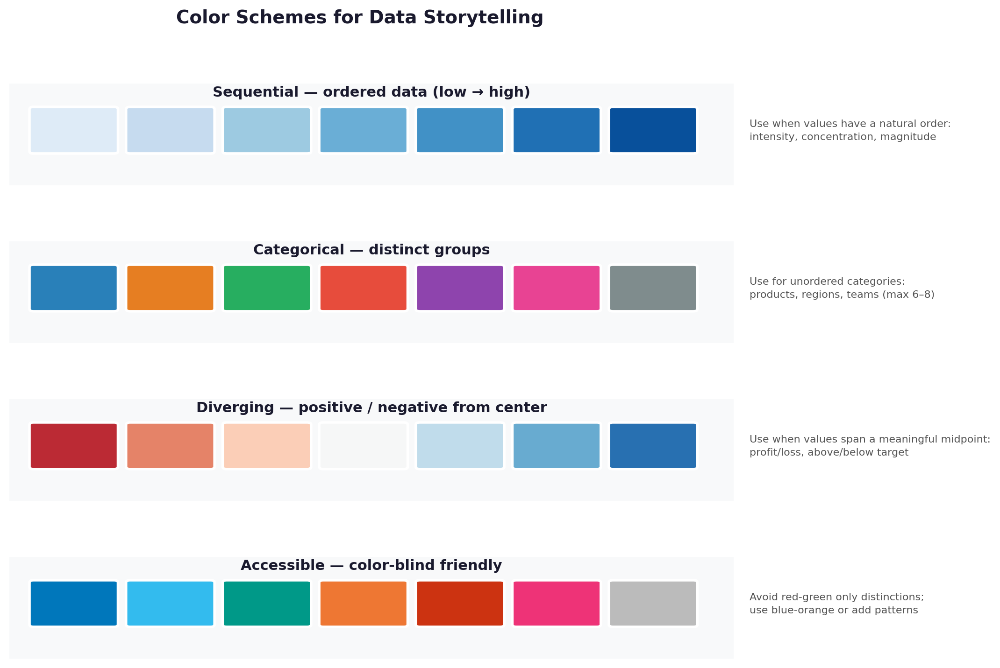

# Data Storytelling

Every analyst has had this experience: you spend days running the perfect analysis, your numbers are correct, your logic is airtight — and then you present it, and nobody acts on it. The problem is almost never the data. It's the story around it. This submodule teaches you how to close that gap: how to turn analysis into narrative, numbers into decisions, and charts into change.

**After this submodule:** you can use the lessons linked below and complete the exercises that match **Mastering Data Storytelling: A Beginner's Guide** in your course schedule.

> **Note:** This submodule blends **principles** (how to structure a message) with **examples** you can build in any tool (Python charts or BI dashboards). It is not only code-first.

## Key Terms

Before diving in, here are the core concepts this submodule builds on:

| Term | Plain-English Definition |
|------|--------------------------|
| **Data Story** | A structured presentation that uses data as evidence for a human narrative — with a beginning, middle, and end |
| **Narrative Arc** | The shape of a story: Setup → Conflict → Resolution |
| **Visual Hierarchy** | Deliberately sizing, coloring, and positioning elements so the audience's eye lands on the most important thing first |
| **Call to Action** | The specific decision or behavior you want the audience to take after seeing your story |
| **Context** | The comparison or benchmark that gives a number meaning — "Sales are $1M" means nothing; "Sales are $1M, up 40% from last year" tells a story |

## Helpful video

Ben Wellington shows how finding the story inside a dataset — and telling it clearly — can change real-world policy.

<iframe width="560" height="315" src="https://www.youtube.com/embed/6xsvGYIxJok" title="Ben Wellington: Making data mean more through storytelling | TEDxBroadway" frameborder="0" allow="accelerometer; autoplay; clipboard-write; encrypted-media; gyroscope; picture-in-picture" allowfullscreen></iframe>

## Introduction: What is Data Storytelling?

Think of data storytelling like being a tour guide for your data. Just as a good tour guide helps visitors understand and appreciate a new place, data storytelling helps your audience understand and appreciate your data insights. It's the art of transforming raw numbers into compelling narratives that drive action.

### Why This Matters

- **Better Understanding**: Studies suggest people remember stories up to 22 times more than facts alone (exact figures vary by study, but the direction is consistent)
- **Clearer Communication**: Complex data becomes accessible to everyone
- **Stronger Impact**: Stories create emotional connections that drive action
- **Better Decisions**: Well-told data stories lead to more informed choices

**Illustrative impact comparison**

```yaml
Impact Metrics:
┌─────────────────────────┐
│ Traditional Reports   │ → 40% Understanding
├─────────────────────────┤
│ Data Visualization   │ → 65% Understanding
├─────────────────────────┤
│ Data Storytelling    │ → 85% Understanding
└─────────────────────────┘
```

> **Note:** These numbers are pedagogical illustrations, not cited research — but the direction is real and widely observed by practitioners.

## The Building Blocks of Data Storytelling

### 1. Story Architecture: Your Data's Blueprint

Think of this like building a house:

- **Foundation** (Setup): The context and background
- **Walls** (Conflict): The challenges and insights
- **Roof** (Resolution): The solutions and next steps


A three-act story arc maps directly to a data presentation: the Setup gives context, the Conflict presents the problem or insight, and the Resolution delivers the recommendation. When you know which act you're in, you can cut anything that doesn't serve it.

#### Why This Matters

Understanding story architecture helps you:

- Structure your data presentation logically
- Keep your audience engaged
- Make your message memorable
- Drive action effectively

### 2. Visual Grammar: Your Data's Language

Think of this like a traffic light system:

- **Red** (Primary Elements): Stop and look at these key points
- **Yellow** (Supporting Elements): Important context to consider
- **Green** (Background Elements): Additional information for reference


Visual hierarchy is what makes an audience's eye go to the right place first. The image above shows how size, color, and position signal importance — without it, every element competes equally for attention and nothing stands out.

#### Why This Matters

Good visual grammar helps you:

- Guide your audience's attention
- Emphasize important information
- Create a clear visual hierarchy
- Make complex data easier to understand

---

> **Try it yourself — Story Architecture:**
> Pick any piece of work you've done (a homework assignment, a work report, a project). Write three sentences for it — one for Setup ("Here's the situation…"), one for Conflict ("Here's the problem/insight…"), and one for Resolution ("Here's what I recommend…"). If you can't write all three, your story is incomplete.

---

## Storytelling Frameworks

Two frameworks cover most data presentations. The companion lesson on [Narrative Techniques](narrative-techniques.md) covers these in depth with worked examples and the SCR (Situation-Complication-Resolution) variant; here is the core idea.

### The Hero's Journey (Classic Arc)

| Act | What it does | Example |
|-----|-------------|---------|
| **Setup** | Establish context | "Our sales team is struggling to meet targets" |
| **Conflict** | Present the tension | "We discovered a 30% drop in customer retention" |
| **Resolution** | Deliver the recommendation | "A new customer success program increased retention by 45%" |

### Problem-Solution Framework

| Step | What it does | Example |
|------|-------------|---------|
| **Problem** | Name the issue | "We're losing 20% of customers monthly" |
| **Analysis** | Explain the cause | "Survey data shows poor support experience" |
| **Solution** | Propose a fix | "Implement 24/7 chat support — projected to reduce churn by 15%" |



Both frameworks share the same underlying logic — context, tension, resolution — just expressed differently. The Hero's Journey works well for longer narratives; the Problem-Solution framework is faster and better suited to executive briefings.

---

> **Try it yourself — Frameworks:**
> Take the same three-sentence story you wrote above. Now rewrite it using the Problem-Solution format: one sentence for Problem, one for Analysis, one for Solution. Which version feels more urgent? Which is clearer? The answer tells you something about your audience.

---

## Visual Elements

Choosing the right chart and color scheme is half the battle. The companion lesson on [Visual Storytelling](visual-storytelling.md) covers chart types, color palettes, layout patterns, and common design mistakes in full detail. Here are the essentials.

### Chart Selection

| Goal | Chart type |
|------|-----------|
| Compare categories | Bar chart (horizontal if labels are long) |
| Show trends over time | Line chart |
| Show distribution | Histogram or box plot |
| Show parts of a whole | Pie chart (5 or fewer slices) or stacked bar |
| Show correlation | Scatter plot |


### Color Strategy

- Use **consistent** colors for similar data types across all charts
- Use **semantic** color: red = negative, green = positive, gray = context
- Always test for **color-blind accessibility** (avoid red-green only distinctions)



---

> **Try it yourself — Chart and Color:**
> Open a chart you've made recently. Ask yourself: (1) Does every color on this chart mean something, or are some colors random? (2) If I removed the color, would the chart still be readable? If color is doing real work, you're using it well. If removing it doesn't change anything, the color is decoration — not communication.

---

## Common Mistakes to Avoid

| Mistake | Instead |
|---------|---------|
| **Data overload** — showing every data point | Focus on the 3-5 most important insights |
| **Missing context** — jumping straight to conclusions | Build understanding gradually with benchmarks and comparisons |
| **Weak structure** — rambling through data | Follow a clear narrative arc (Setup → Conflict → Resolution) |
| **Leading with method** — "I ran a regression and found a coefficient of 0.73…" | Lead with insight: "Every extra hour of response time costs us 8% conversion" |
| **No call to action** — ending with "the data shows…" | End with "We recommend [specific action] by [specific date]" |

---

> **Try it yourself — Spot the Mistakes:**
> Find a data report (could be news, a company press release, or one of your own). Using the five mistake categories above, identify at least two problems and write one sentence each explaining how you would fix them.

---

## Practice Exercise: Build Your First Data Story

### Step 1: Gather Your Elements

**Purpose:** Checklist of ingredients—data facts, narrative arc, and visuals—before drafting slides or a dashboard story.

**Walkthrough:** Not executable; use as a worksheet outline.

```yaml
Story Elements:
  Data:
    - Key metrics
    - Supporting facts
    - Relevant context
  
  Narrative:
    - Main message
    - Key points
    - Flow structure
  
  Visuals:
    - Core charts
    - Supporting graphics
    - Highlights
```

### Step 2: Structure Your Story

1. Write your hook
2. Establish context
3. Present the challenge
4. Show your journey
5. Share insights

### Step 3: Create Your Visuals

1. Choose appropriate charts
2. Apply consistent styling
3. Add clear labels
4. Test for clarity

## Additional Resources

### Books

- "Storytelling with Data" by Cole Nussbaumer Knaflic
- "Data Visualization: A Practical Introduction" by Kieran Healy

### Online Courses

- Coursera: "Data Visualization and Communication with Tableau"
- Udemy: "Data Storytelling and Visualization"

### Tools

- Tableau Public (Free)
- Power BI (Free)
- Python (matplotlib, seaborn)

## Prerequisites

- [3.1 Intro to data visualization](../3.1-intro-data-viz/README.md) and at least one of: Matplotlib/Seaborn practice or a BI tool from [3.3](../3.3-bi-with-tableau/README.md).

## Next steps

1. Read [Narrative techniques](narrative-techniques.md) and [Visual storytelling](visual-storytelling.md).
2. Work through [Case studies](case-studies.md) with a critical eye on clarity and audience.
3. Try the [module assignment](../_assignments/module-assignment.md) when your instructor assigns it.

Remember: The best data stories make complex information simple and actionable. Start small, practice often, and iterate from feedback.
