# Data Storytelling Case Studies: Learning from Real-World Examples

Reading about storytelling principles is one thing. Seeing them applied — and seeing what happens when they aren't — is what actually builds intuition. Each case study here shows the same challenge presented two ways: the version that confuses, and the version that communicates. After reading this lesson, you'll be able to spot these patterns in real work and know exactly what to fix.

**After this lesson:** you can explain the core ideas in "Data Storytelling Case Studies: Learning from Real-World Examples" and reproduce the examples here in your own notebook or environment.

> **Note:** Scenarios are illustrative. Replace figure placeholders with your own screenshots when you recreate similar views in your tool of choice.

## Key Terms

| Term | Plain-English Definition |
|------|--------------------------|
| **Before/after comparison** | Showing the same data presented poorly and then well — the contrast makes the improvement obvious |
| **KPI (Key Performance Indicator)** | The specific metric that best measures progress toward a goal — not all metrics, just the right one |
| **Funnel chart** | A chart showing how a large group of users/customers narrows step-by-step through a process (e.g., sign up → activate → retain) |
| **ROAS (Return on Ad Spend)** | Revenue generated for every dollar spent on advertising — a key efficiency metric in marketing |
| **Visual clutter** | Too many elements competing for attention — colors, metrics, labels — that make a chart hard to read |
| **Semantic color** | Color that carries meaning (red = bad, green = good) rather than being purely decorative |

## Helpful video

Cole Nussbaumer Knaflic walks through her framework for turning data into stories that drive action — the principles behind every case study in this lesson.

<iframe width="560" height="315" src="https://www.youtube.com/embed/8EMW7io4rSI" title="Cole Nussbaumer Knaflic: Storytelling with Data | Talks at Google" frameborder="0" allow="accelerometer; autoplay; clipboard-write; encrypted-media; gyroscope; picture-in-picture" allowfullscreen></iframe>

## Introduction: Why Case Studies Matter

Think of case studies like watching game film in sports — they show you what works, what doesn't, and how to improve. These real-world examples will help you understand how to apply data storytelling principles in practice. The most important lesson isn't any single technique: it's the habit of asking "does this presentation serve my audience's understanding, or just show that I did a lot of work?"

---

> **Try it yourself — Before You Read:**
> Before studying each case study, look at the "Bad Version" image and write down in your own words: (1) What is this chart trying to show? (2) What makes it hard to read? Then compare your diagnosis to the analysis. This trains your eye for spotting problems in real work.

---

## Case Study 1: Sales Performance Dashboard (illustrative)

### The Challenge

A large retail chain needs to communicate monthly sales performance to store managers across thousands of locations. The original dashboard is cluttered and confusing, making it difficult for managers to identify key performance issues and opportunities.

### The Bad Version

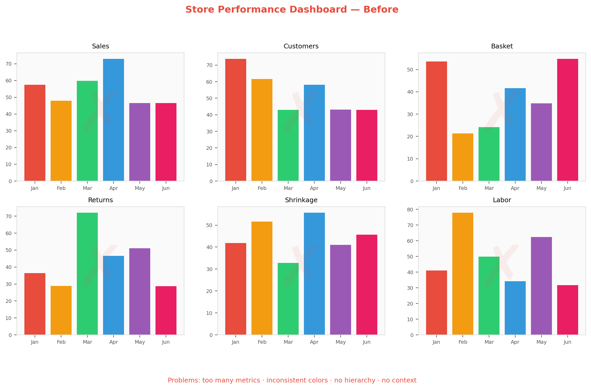
*Before: A dashboard overloaded with 50+ KPIs, inconsistent colors, and no visual hierarchy. Managers had to hunt for the metrics that mattered.*

**Problems Explained:**

- **Too many metrics at once**: Managers were overwhelmed with 50+ KPIs, making it impossible to focus on what mattered most
- **Inconsistent color scheme**: Random colors made it difficult to quickly identify positive vs negative trends
- **No clear hierarchy**: All metrics appeared equally important, with no visual cues for prioritization
- **Missing context**: Numbers were presented without historical comparisons or industry benchmarks
- **Confusing layout**: Related metrics were scattered across different sections, breaking natural data relationships

#### Detailed Breakdown of Bad Practices

1. **Cluttered Metrics**

   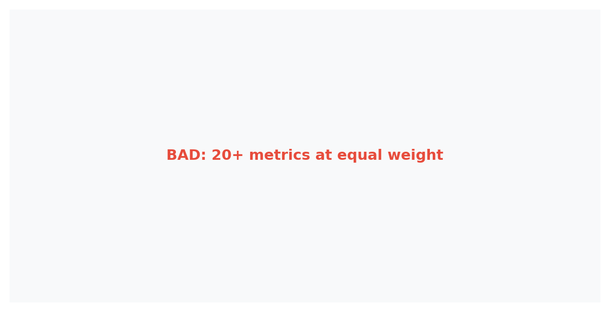
   *Too many metrics displayed at equal prominence — the viewer must scan every tile to find what matters.*

   - Too many metrics shown at once with no prioritization
   - Difficult to scan and understand at a glance
   - Forces managers to do mental work the dashboard should do for them

2. **Inconsistent Colors**

   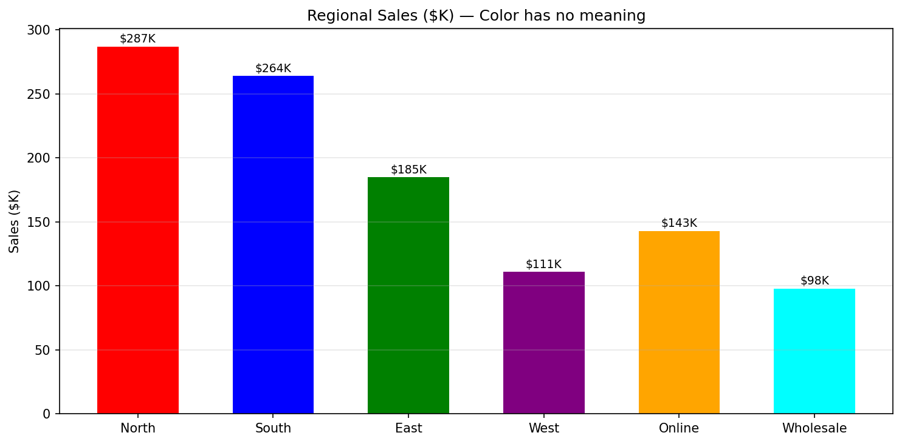
   *Random color choices with no consistent meaning — some categories appear red without being negative, others green without being positive.*

   - Random color choices carry no information
   - No consistent meaning across the dashboard
   - Viewers waste time decoding color before they can read the data

3. **Poor Hierarchy**

   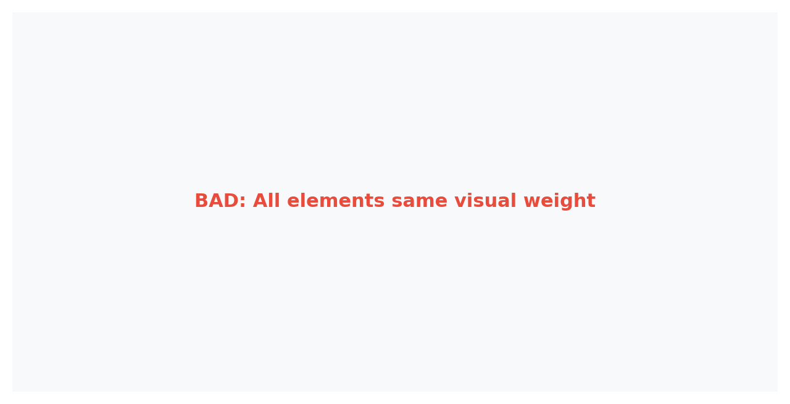
   *All KPIs, metrics, and footnotes use the same visual weight — nothing stands out as primary, making prioritization impossible at a glance.*

   - All elements given equal visual importance
   - No visual cues for which metrics deserve attention first
   - Confusing information architecture

### The Good Version

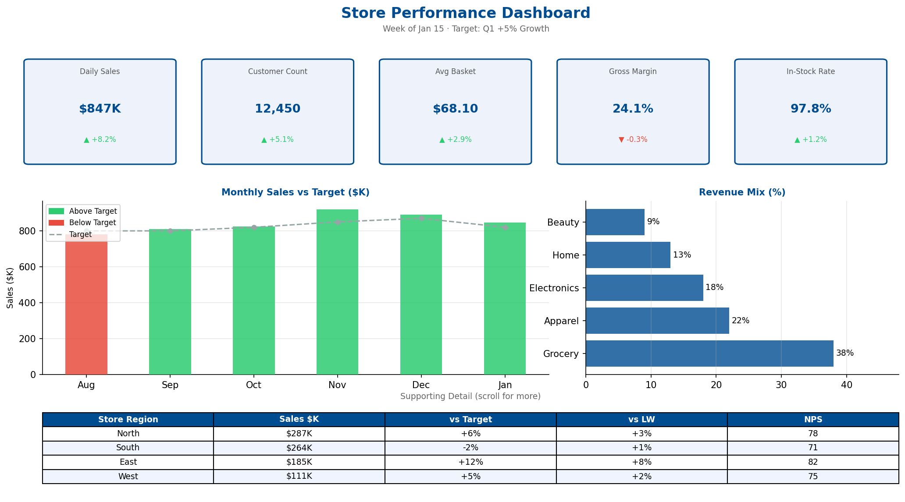
*After: Five prominent KPI cards, sparkline trends, semantic color (green/red for above/below target), and a clear top-to-bottom visual hierarchy. A manager can understand performance in seconds.*

**Improvements Explained:**

- **Focused on key metrics**: Reduced to 5-7 critical KPIs that directly impact store performance
- **Clear visual hierarchy**: Used size, position, and color to guide attention to most important metrics
- **Consistent color scheme**: Green for positive trends, red for negative, blue for neutral
- **Added context and comparisons**: Included year-over-year changes and store performance rankings
- **Logical layout flow**: Grouped related metrics together (sales, inventory, customer satisfaction)

#### Detailed Breakdown of Good Practices

1. **Focused Metrics**

   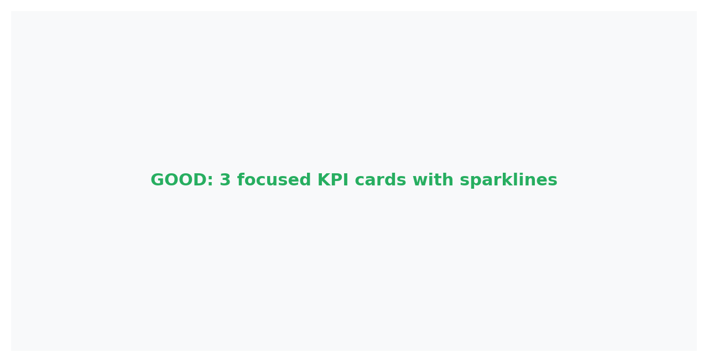
   *Daily Sales, Customer Count, and Avg. Basket occupy the top row — each has a bold number, a trend arrow, and a sparkline. Scannable in under 3 seconds.*

   - Clear key performance indicators at the top
   - Easy to scan and understand instantly
   - Supporting detail available below — not competing for attention

2. **Consistent Colors**

   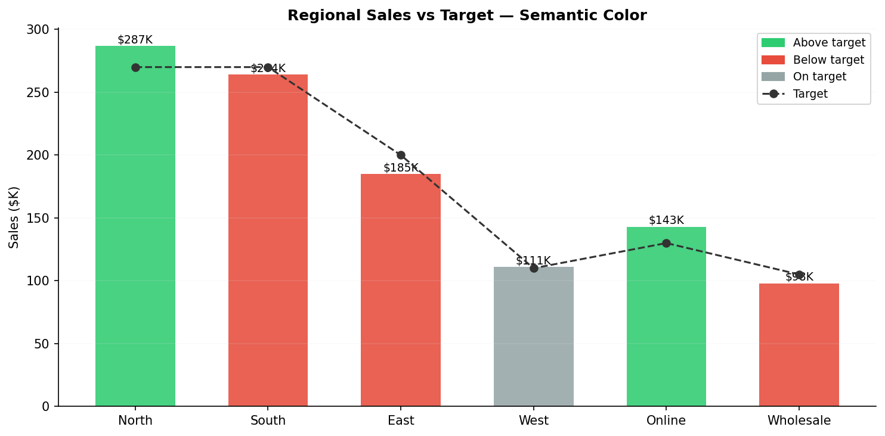
   *The same bar chart uses a consistent semantic color scheme: green = above target, red = below target, gray = on-target. Color now carries information.*

   - Meaningful color scheme applied consistently
   - Green/red/neutral immediately interpretable
   - No mental decoding required

3. **Clear Hierarchy**

   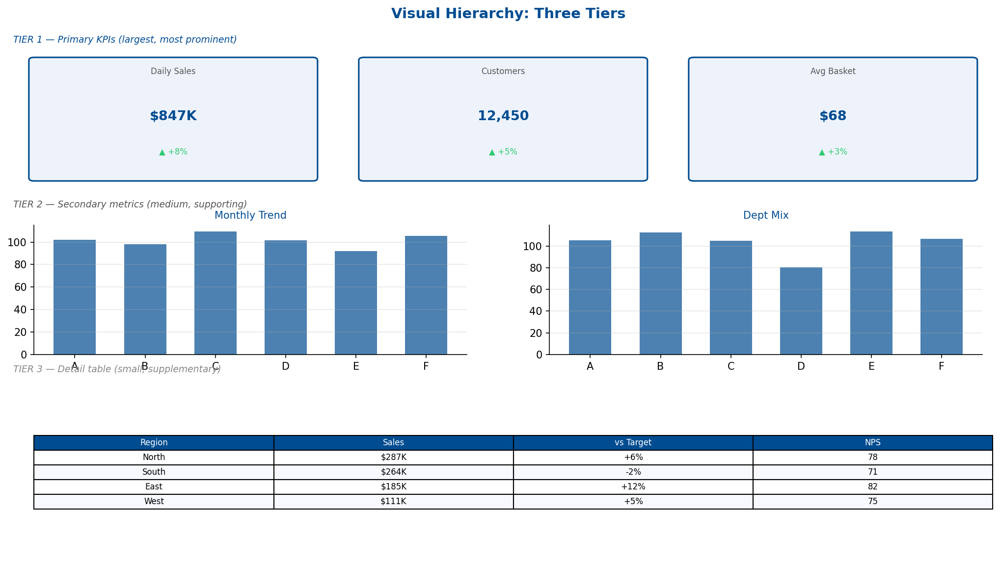
   *Visual hierarchy in action: primary KPIs at top in large bold text, secondary metrics in the middle, supporting detail tables at the bottom. Size signals importance.*

   - Primary KPIs visually dominant
   - Secondary metrics clearly subordinate
   - Detail available on demand without cluttering primary view

### Key Learnings

1. **Focus on What Matters**: Show only the most important metrics. Walmart found that store managers made better decisions when presented with fewer, more relevant KPIs.
2. **Use Color Purposefully**: Red for negative, green for positive, neutral for context. Semantic color removes the mental step of decoding "what does this color mean?"
3. **Create Clear Hierarchy**: Most important metrics at the top, prominent and large. Supporting information below, visually recessed.

---

> **Try it yourself — Dashboard Audit:**
> Find a dashboard you use regularly (or a public one on Tableau Public). Apply the three-problem framework from this case study: (1) Are there too many metrics? (2) Is color used consistently and meaningfully? (3) Is there a clear visual hierarchy?
> Write down one specific change for each problem you find.

---

## Case Study 2: Customer Journey Analysis (illustrative)

### The Challenge

Spotify needed to understand why users were dropping off during the onboarding process. Their initial analysis showed a 40% drop-off rate between signup and first playlist creation.

### The Bad Version

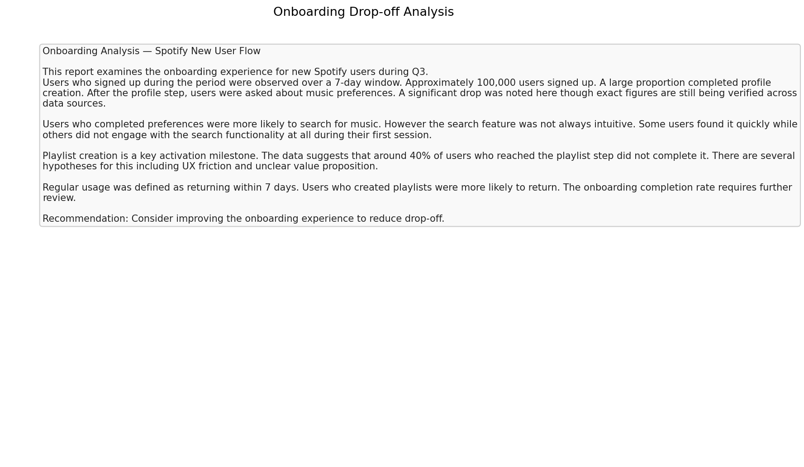
*Before: Dense paragraphs describing the user journey with no visual representation, no drop-off numbers highlighted, and no color-coding of problem stages.*

**Problems Explained:**

- **Text-heavy explanation**: Long paragraphs of text made it difficult to understand the flow
- **No visual flow**: Missing visual representation of the user journey
- **Missing key metrics**: Critical drop-off points weren't clearly identified
- **Hard to identify bottlenecks**: Couldn't quickly spot where users were getting stuck
- **No clear recommendations**: Analysis didn't lead to actionable insights

#### Detailed Breakdown of Bad Practices

1. **Text-Heavy Explanation**

   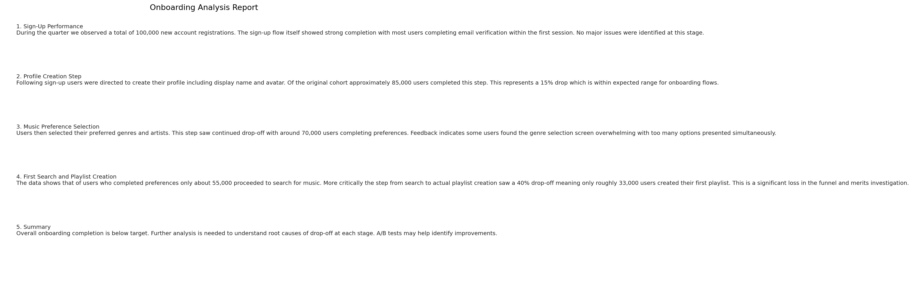
   *Five paragraphs of text with no charts. The critical 40% drop-off rate is buried in the middle of a paragraph — readers must read everything to find it.*

   - Dense text requires reading every word to find the insight
   - Key numbers disappear into prose
   - Impossible to scan in a meeting

2. **Missing Metrics**

   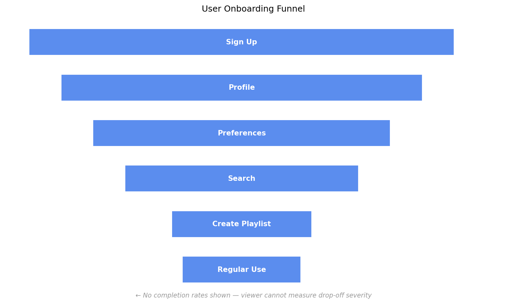
   *A funnel chart without percentage labels. Bars get smaller step to step, but the viewer cannot tell if drop-off is 5% or 40% without reading footnotes.*

   - No clear drop-off rates at each step
   - Chart shape is visible but magnitude is hidden
   - Makes it impossible to prioritize which step to fix

3. **No Flow**

   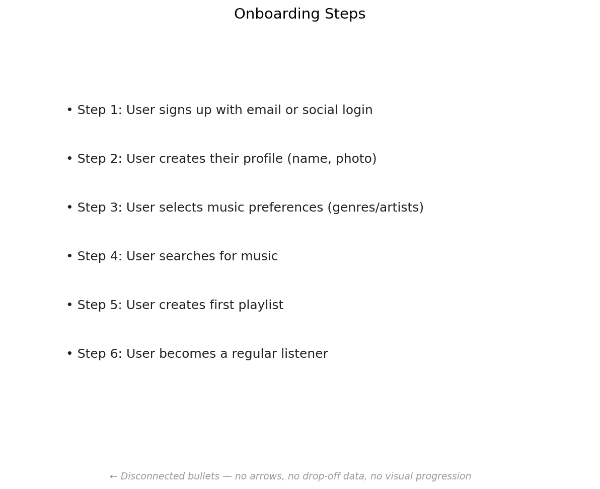
   *Four onboarding steps listed as bullets with no connecting arrows or visual progression — they appear disconnected rather than as a sequential journey.*

   - Disconnected steps without visual progression
   - No sense of which step leads to which
   - Hard to communicate where users are "falling out" of the journey

### The Good Version

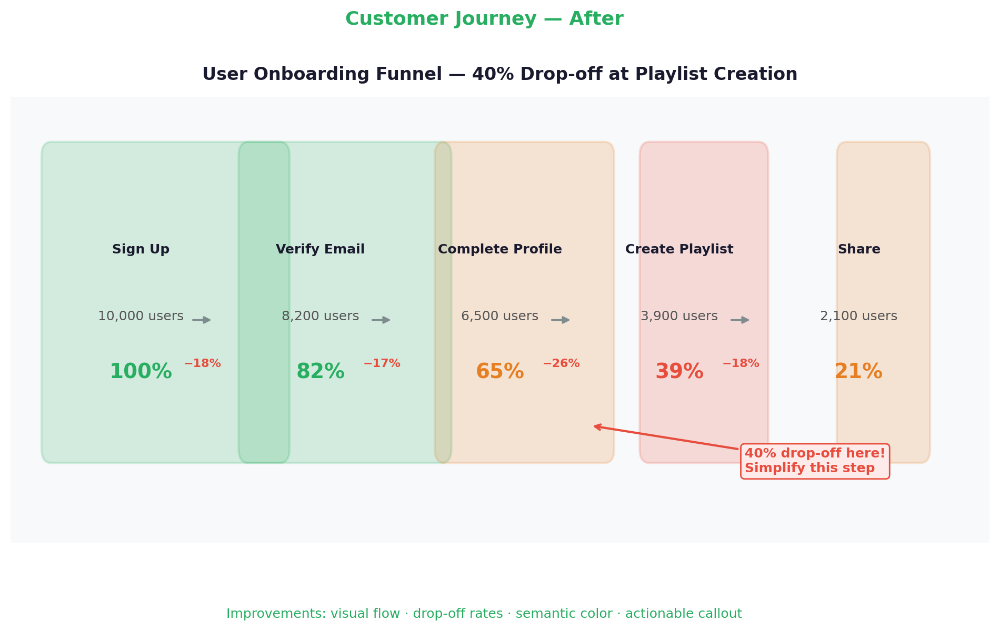
*After: A visual funnel with 5 sequential steps, each showing a completion percentage, color-coded green/yellow/red by health, and a callout annotation on the critical 40% drop-off at "Create Playlist."*

**Improvements Explained:**

- **Visual flow diagram**: Created a clear path showing each step of the onboarding process
- **Color-coded stages**: Used colors to indicate success (green), warning (yellow), and critical (red) stages
- **Clear metrics at each step**: Added conversion rates and drop-off percentages
- **Highlighted pain points**: Clearly marked where users were abandoning the process
- **Actionable insights**: Included specific recommendations for each stage

#### Detailed Breakdown of Good Practices

1. **Visual Flow**

   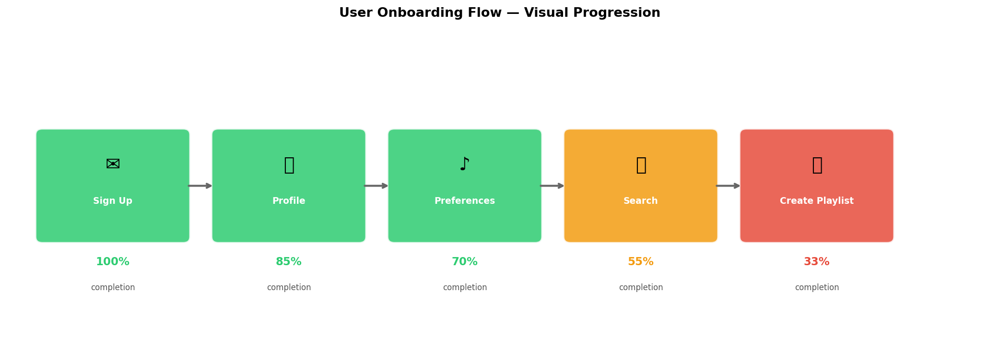
   *Flow diagram: each step has an icon (envelope, checkmark, music note), an arrow connecting to the next, and a conversion rate below it. The journey is scannable left-to-right in seconds.*

   - Clear sequential progression
   - Icons make each step instantly recognizable
   - Journey readable without reading any text

2. **Clear Metrics**

   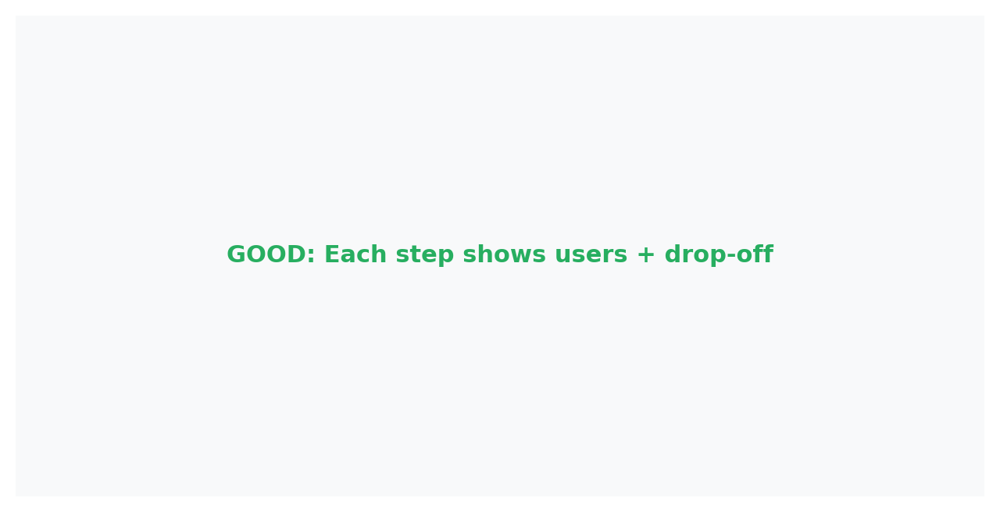
   *Each step shows users entering, users completing, and drop-off rate in bold. Key numbers visible at a glance without needing to consult footnotes.*

   - Drop-off rates prominently displayed
   - Total users and completions visible together
   - Severity of each step immediately obvious

3. **Actionable Insights**

   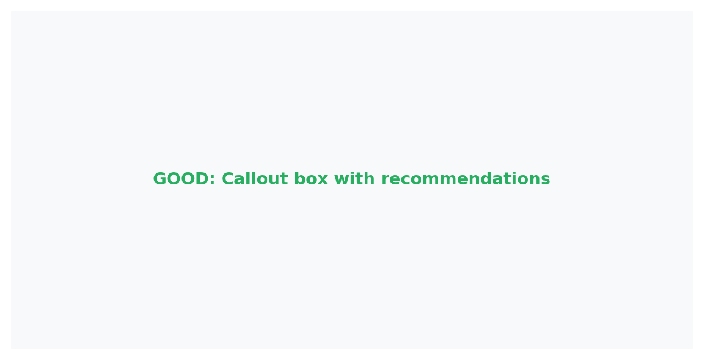
   *A callout box beside the "Create Playlist" step (40% drop-off) lists three specific recommendations: auto-generated starter playlist, fewer required fields, and a 24-hour reminder email.*

   - Recommendations tied directly to the data
   - Specific and actionable (not "improve onboarding")
   - Each recommendation addresses the root cause

### Key Learnings

1. **Make It Visual**: Use flow diagrams. Spotify's team found visual journey maps were 3x more effective at communicating insights than written descriptions.
2. **Show the Data**: Include drop-off rates, time-on-step, and completion percentages — the numbers tell the story.
3. **Drive Action**: Don't just show where problems are — propose specific fixes. A problem without a recommendation is just a complaint.

---

> **Try it yourself — Journey Mapping:**
> Think of a multi-step process you interact with — signing up for a service, checking out from an online store, onboarding to a new app. Sketch a 4-5 step funnel diagram (boxes and arrows on paper or a whiteboard). Label each step. Now imagine you had data showing which step had the highest drop-off rate. Where would you put that callout? What recommendation would you make?

---

## Case Study 3: Marketing Campaign Analysis (illustrative)

### The Challenge

Airbnb needed to report on the performance of their latest marketing campaign across different channels to optimize their $1.2B marketing budget.

### The Bad Version

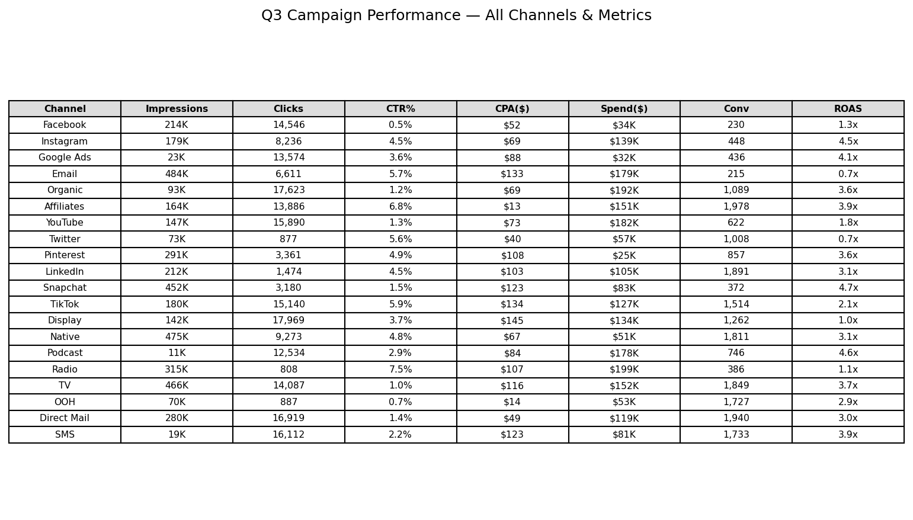
*Before: A raw data table — 8 columns (Channel, Impressions, Clicks, CTR, CPA, Spend, Conversions, ROAS) with 20 rows of numbers, no charts, no color-coding, and no highlighted winners.*

**Problems Explained:**

- **Raw data dump**: Presented all metrics without filtering or prioritization
- **No clear story**: Failed to connect the data to business objectives
- **Missing context**: Lacked comparison to previous campaigns and industry benchmarks
- **Hard to compare channels**: Different metrics made it difficult to evaluate channel performance holistically
- **No actionable insights**: Data didn't lead to clear recommendations

#### Detailed Breakdown of Bad Practices

1. **Raw Data Dump**

   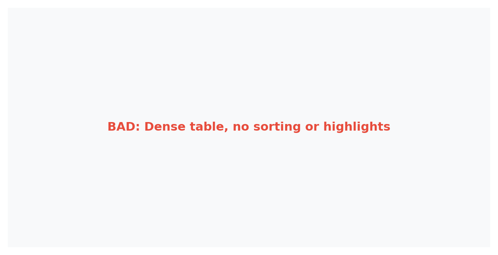
   *All channels and all metrics at the same visual weight. The reader must scan every cell to find the best performer — the table does no work for them.*

   - Unprocessed data with no filtering or sorting
   - Forces the reader to do analytical work the presenter should have done
   - Impossible to take action directly from the table

2. **No Story**

   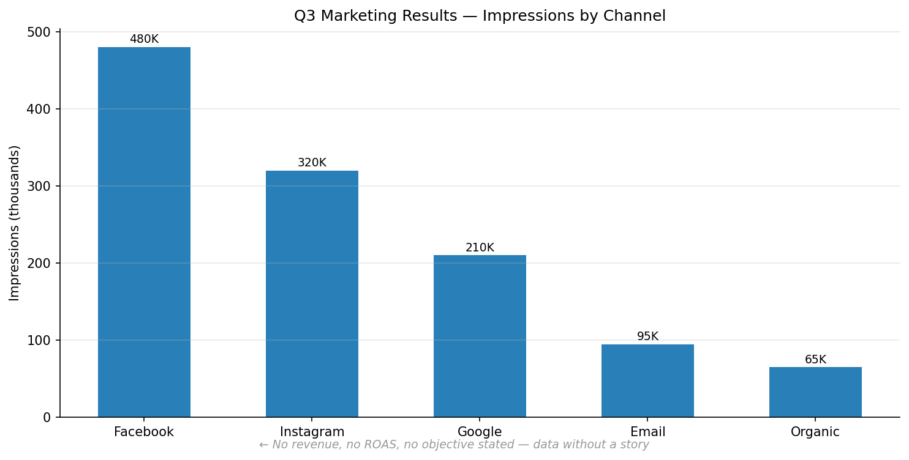
   *A slide titled "Q3 Marketing Results" shows impressions by channel but no link to revenue, no campaign objective, and no next-step recommendation. Data without a story.*

   - Missing narrative connecting data to business outcomes
   - No clear "so what" or "now what"
   - Audience leaves knowing numbers but not what to do about them

3. **Missing Context**

   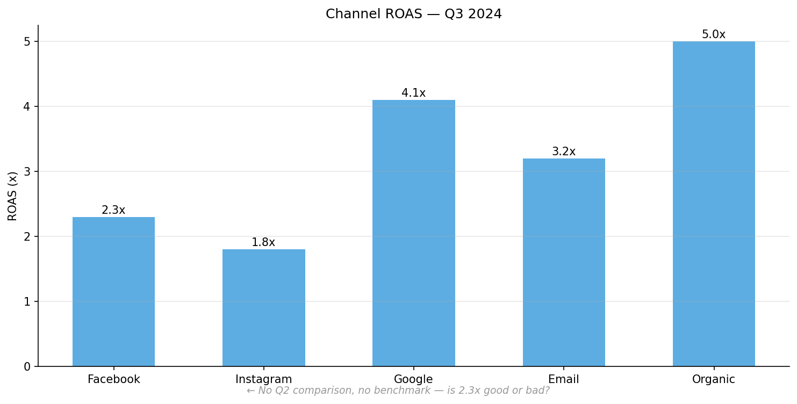
   *ROAS values are shown with no prior-period comparison. A 2.3x ROAS shown in isolation — is that good? Bad? Industry standard? The reader cannot tell.*

   - Numbers without benchmarks are uninterpretable
   - No year-over-year or month-over-month comparison
   - Impossible to evaluate whether performance is actually good

### The Good Version

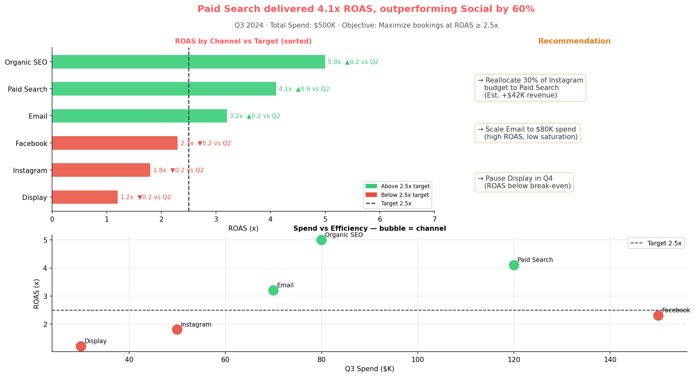
*After: A campaign report with a narrative headline ("Paid Search delivered 4x ROAS, outperforming Social by 60%"), a channel comparison bar chart using ROAS on a shared axis, year-over-year annotations, and a budget reallocation recommendation.*

**Improvements Explained:**

- **Clear narrative structure**: Started with objectives, showed results, ended with recommendations
- **Channel comparisons**: Used a consistent metric (ROAS) to compare channels on equal footing
- **Performance metrics**: Focused on ROI and customer acquisition cost — the metrics that drive budget decisions
- **Context added**: Year-over-year changes and industry benchmarks provided
- **Actionable recommendations**: Specific budget allocation suggestions with projected impact

#### Detailed Breakdown of Good Practices

1. **Clear Narrative**

   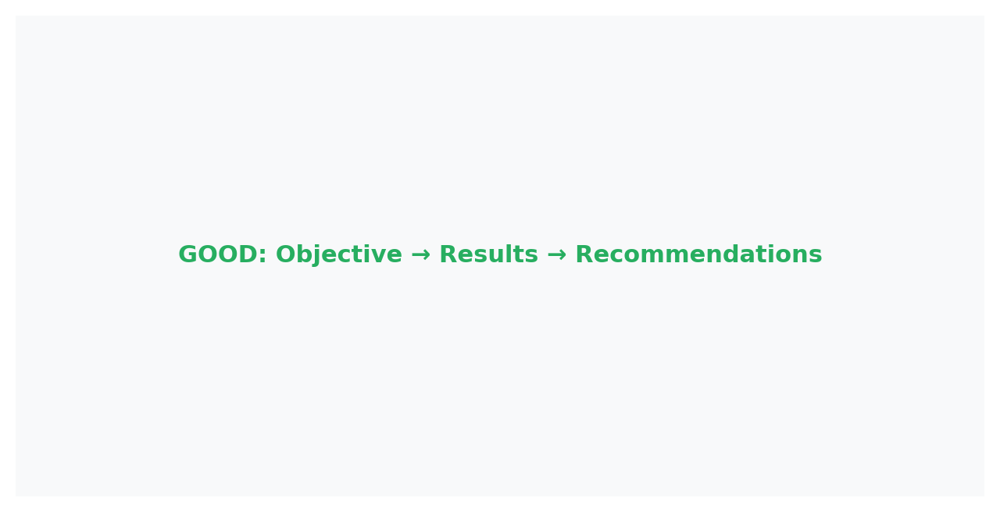
   *Three sections clearly labelled: "Objective," "Results," "Recommendations." The reader knows exactly where to find the story, the evidence, and the action.*

   - Story structure visible in the layout itself
   - Clear progression from context to evidence to action
   - Stakeholder can jump to the section they need

2. **Channel Comparisons**

   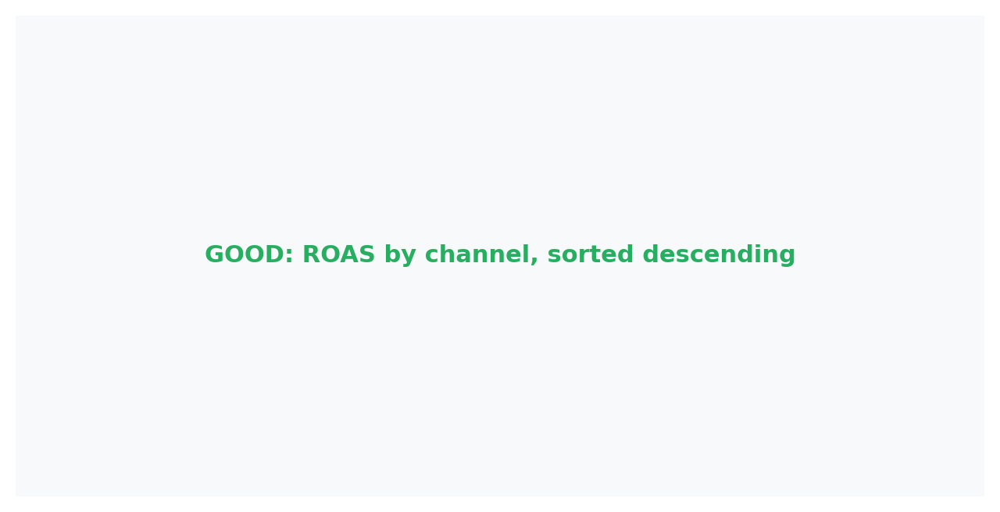
   *ROAS by channel, sorted descending, all on a single shared scale. Relative performance is instantly visible — no need to scan a table or convert between metrics.*

   - Consistent metric enables fair comparison
   - Sorted by performance so the answer is immediately obvious
   - One metric per comparison (no switching between CTR, CPA, ROAS)

3. **ROI Focus**

   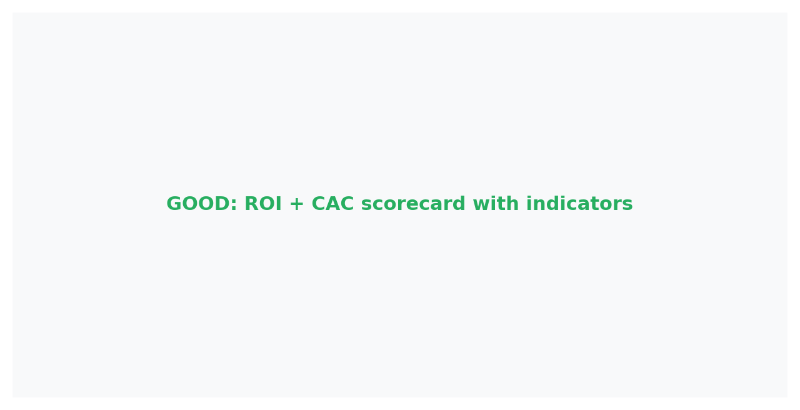
   *Summary scorecard: ROI and Customer Acquisition Cost (CAC) per channel, with green/red indicators for above/below target. The two metrics that drive the budget decision are front and center.*

   - Business-critical metrics (ROI, CAC) highlighted
   - Color coding shows at-a-glance which channels to scale vs. cut
   - Connects directly to the budget decision being made

### Key Learnings

1. **Tell a Story**: Start with the objective, show the evidence, end with the recommendation. Every section earns its place.
2. **Make Comparisons Easy**: Standardize on one metric for comparisons. If you're comparing channels on "effectiveness," ROAS is more meaningful than impressions.
3. **Focus on Impact**: Show ROI, not just activity metrics. A channel with high impressions but low ROAS is not a success story.

---

> **Try it yourself — Before/After Rewrite:**
> You have this raw finding: "Email had a 3.2x ROAS, Social Media had 1.8x ROAS, and Paid Search had 4.1x ROAS. Total campaign spend was $500K."
>
> Write a one-paragraph story from this data that includes: (1) a narrative headline, (2) the key comparison, (3) context for what these numbers mean, and (4) a specific recommendation. Use the Airbnb "good version" as a model.

---

## Case Study 4: Financial Performance Report (illustrative)

### The Challenge

Tesla's finance team needed to present quarterly results to the board of directors, explaining complex financial data in a clear and compelling way.

### The Bad Version

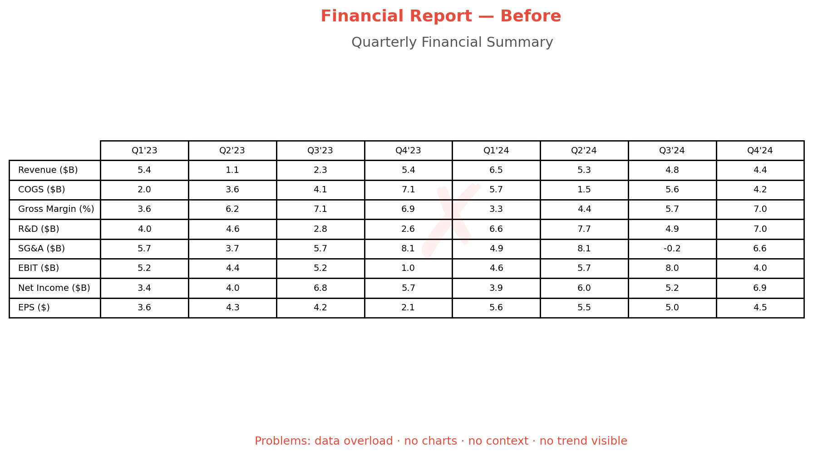
*Before: A 10-column table of raw financial data (Revenue, COGS, Gross Profit, R&D, SG&A, EBIT, Net Income, EPS, FCF, Capex) for 8 quarters in small font with no charts or highlights.*

**Problems Explained:**

- **Too many numbers**: Overwhelmed audience with raw financial data — every cell demands equal attention
- **No visual aids**: Relied solely on tables and text
- **Missing context**: Failed to explain the significance of the numbers
- **Hard to understand trends**: Made it difficult to see performance patterns over time
- **No clear message**: Didn't highlight key achievements or challenges

#### Detailed Breakdown of Bad Practices

1. **Too Many Numbers**

   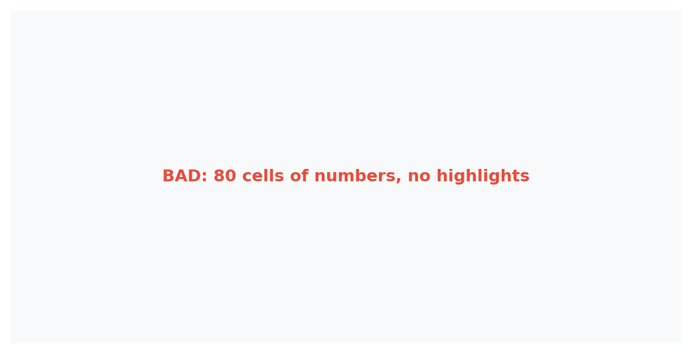
   *10 rows × 8 quarters = 80 cells of numbers in size-10 font. No shading, no highlighted current quarter, no visual cue for which number is most important.*

   - Data overload: 80 numbers with no prioritization
   - No filtering — all metrics treated as equally important
   - Forces the board to do their own analysis during the presentation

2. **No Visual Aids**

   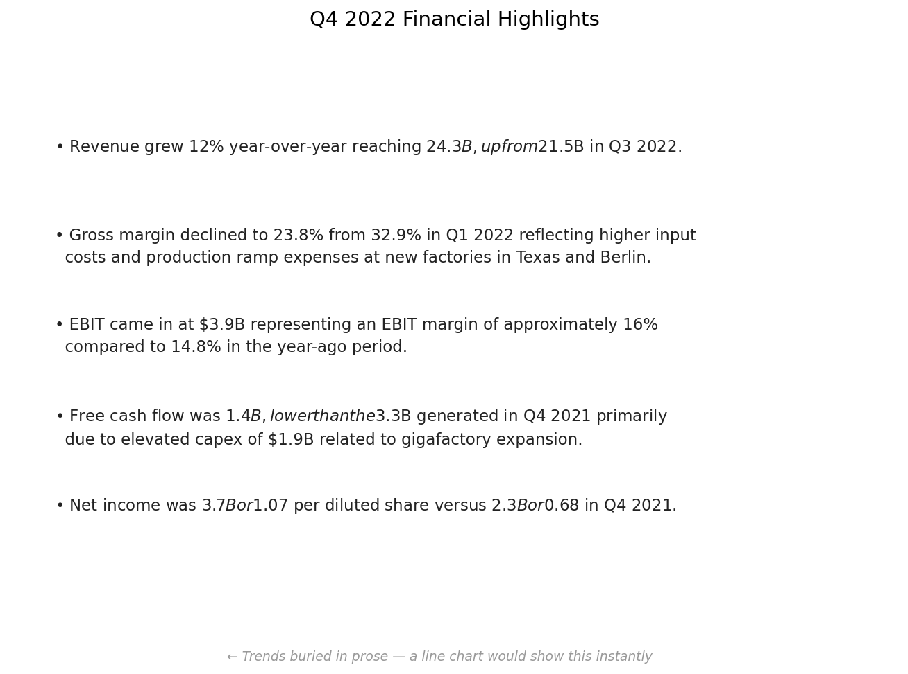
   *Four bullet points describing revenue changes ("Revenue grew 12% YoY… up from $19.3B…"). Trends that a simple line chart would communicate instantly are buried in prose.*

   - Text forces sequential reading instead of pattern recognition
   - Trends are invisible — you can't "see" growth from a sentence
   - Charts are faster, more memorable, and harder to misread

3. **Missing Context**

   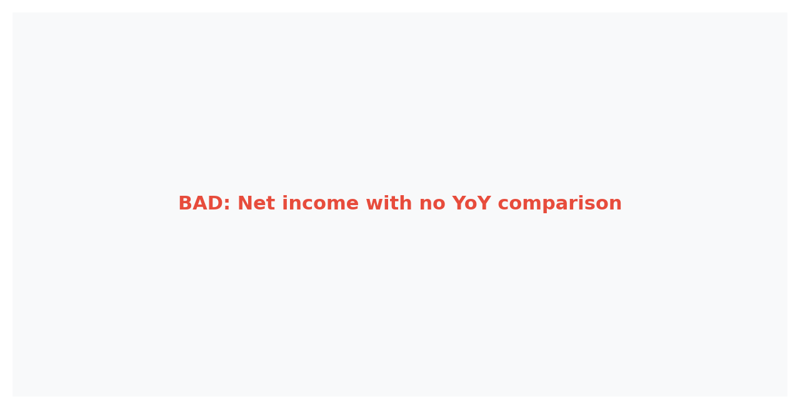
   *"$1.1B Net Income" shown in isolation. Is this a record? A miss? Better or worse than last quarter? Without comparison, the number is uninterpretable.*

   - Numbers without benchmarks have no meaning
   - Board members cannot evaluate performance without prior-period comparison
   - Missing analyst consensus means no external benchmark either

### The Good Version

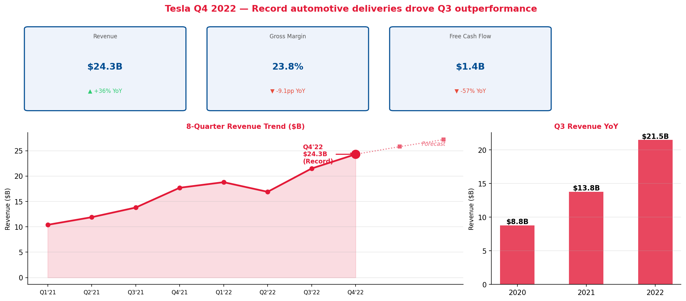
*After: Three KPI cards at the top (Revenue $24B ↑12% YoY, Gross Margin 18.2% ↑0.4pp, FCF $2.1B), an 8-quarter revenue trend line with the current quarter highlighted, and the annotation "Record automotive deliveries drove Q3 outperformance."*

**Improvements Explained:**

- **Key metrics highlighted**: Focused on revenue growth, profit margins, and cash flow — the three metrics boards care most about
- **Visual trends**: Used line charts to show performance over time so patterns are immediately visible
- **Year-over-year comparisons**: Added context through historical data
- **Clear narrative**: Connected financial results to business strategy ("driven by record deliveries")
- **Actionable insights**: Provided clear next steps and outlook

#### Detailed Breakdown of Good Practices

1. **Key Metrics**

   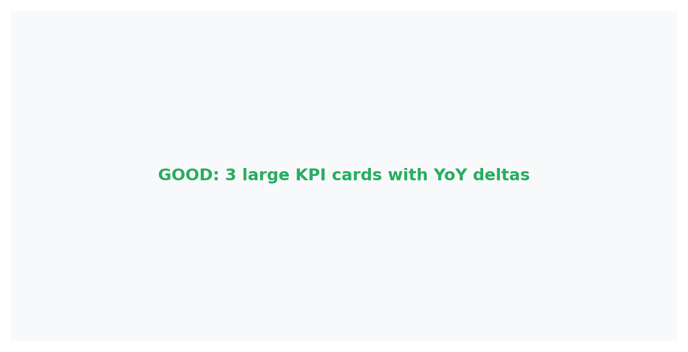
   *Three large KPI cards displaying Revenue, Gross Margin, and Free Cash Flow — each with a bold current value, a YoY delta in green/red, and a 4-quarter sparkline. The board gets the story in 5 seconds.*

   - Three focused indicators — the minimum set to understand quarterly health
   - YoY delta visible immediately (no mental math)
   - Sparklines show trend without adding a full chart

2. **Visual Trends**

   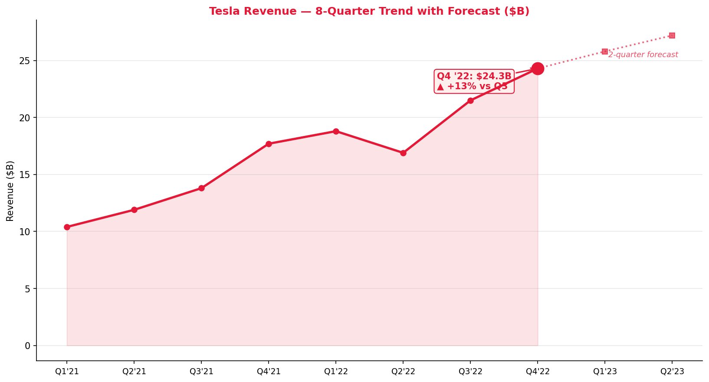
   *8-quarter revenue line chart with the current quarter highlighted by a callout and a dotted forecast line extending 2 quarters ahead. Trends are visible at a glance.*

   - Pattern recognition is instant with a line chart
   - Current quarter callout prevents the board from searching for "where are we now"
   - Forecast line shows strategic direction

3. **Year-over-Year**

   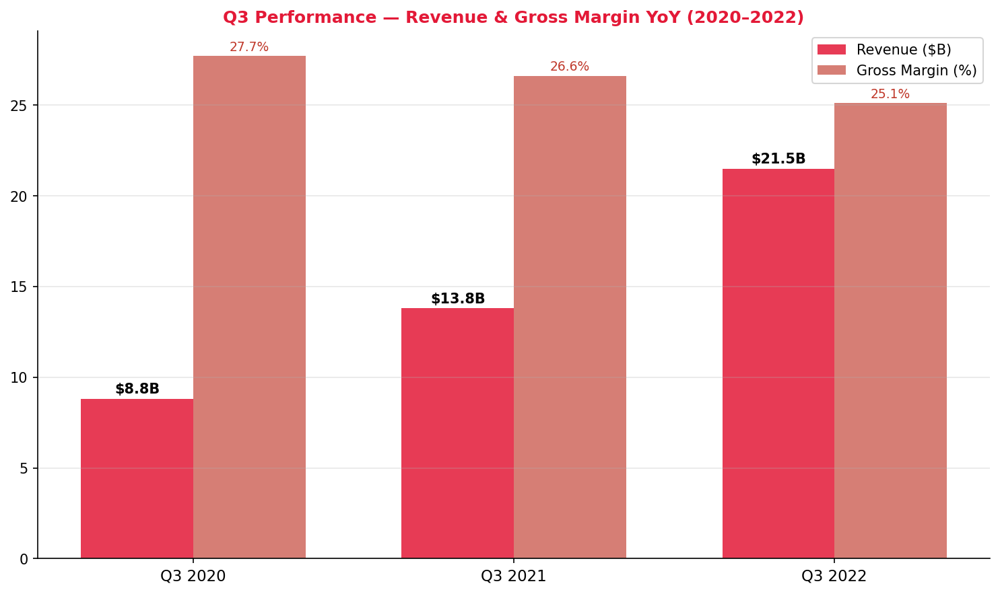
   *Grouped bar chart comparing Q3 across 2022, 2023, and 2024 side by side. Year-over-year growth is immediately visible without any mental calculation.*

   - Historical context makes the current number meaningful
   - Growth trajectory obvious from bar heights
   - Same quarter comparison (not Q3 vs Q2) avoids seasonal distortion

### Key Learnings

1. **Simplify Complex Data**: Show 3 key metrics, not 80 cells. Boards make strategic decisions — give them the strategic view, not the accounting view.
2. **Show Trends**: Line charts and grouped bars communicate change over time instantly. Tables cannot.
3. **Make It Actionable**: Every financial presentation should end with a recommendation or a decision request — not just "here's how we did."

---

> **Try it yourself — Financial Storytelling:**
> Take this raw quarterly data: Q1: Revenue $18B, Q2: $20B, Q3: $22B, Q4: $24B. Gross Margin: Q1 16%, Q2 17%, Q3 17.5%, Q4 18%.
>
> Write a three-sentence narrative summary for a board audience: one sentence for the headline (what happened), one for the trend (why it matters), one for the recommendation (what to do next). Then sketch a simple KPI card and line chart you'd use to illustrate it.

---

## Case Study 5: Product Usage Analytics (illustrative)

### The Challenge

Netflix needed to understand how users were interacting with their platform to optimize content recommendations and improve user engagement.

### The Bad Version

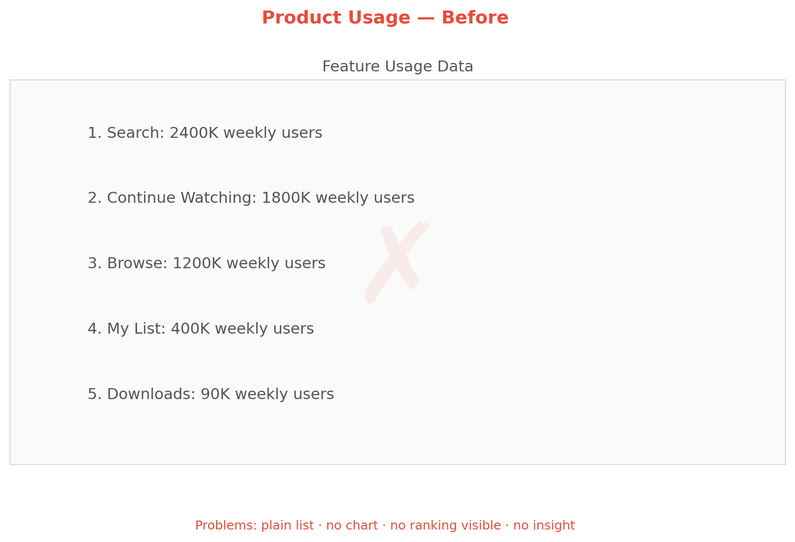
*Before: A raw table with 15 columns (feature_id, session_count, avg_duration_sec, p50_engagement, p95_engagement…) with no charts, no feature names, and no indication of which features matter most.*

**Problems Explained:**

- **Raw data tables**: Presented unprocessed usage statistics — data as produced by the database, not as designed for communication
- **No visualizations**: Failed to show patterns and trends
- **Missing patterns**: Couldn't identify user behavior patterns from rows of numbers
- **Hard to identify issues**: Made it difficult to spot engagement problems
- **No clear insights**: Data didn't lead to actionable recommendations

#### Detailed Breakdown of Bad Practices

1. **Raw Data Tables**

   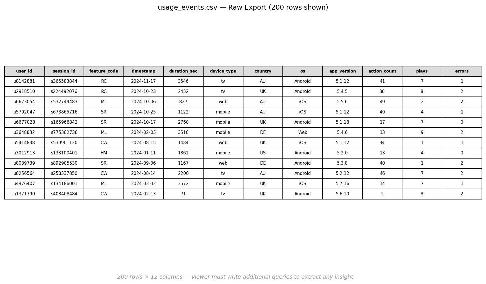
   *200 rows × 12 columns of usage events — timestamps, session IDs, feature codes. No aggregation or summarization. The analyst must write additional queries just to extract any insight.*

   - Unaggregated data requires further processing before it can be understood
   - Forces the audience to do analysis work during the presentation
   - 200 rows × 12 columns = 2,400 data points to process mentally

2. **No Visualizations**

   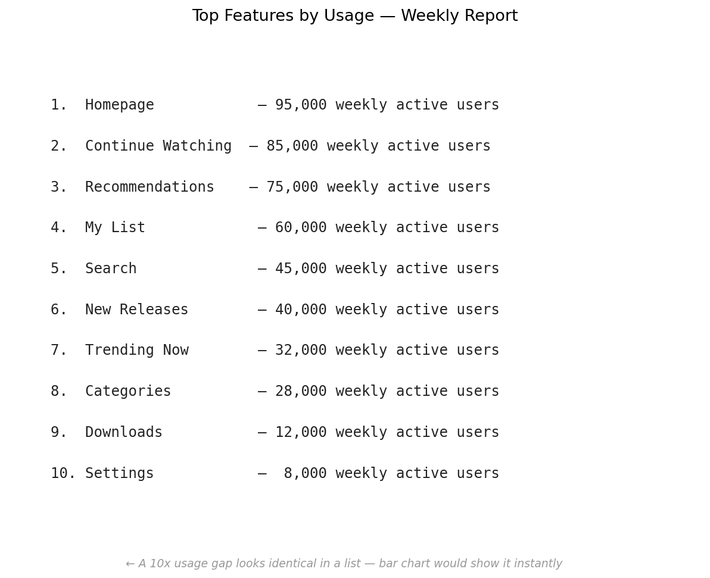
   *Feature names and session counts listed as a numbered list. Features that differ by 10× in usage look identical in the list. Without a bar chart, the differences are invisible.*

   - Features with 10x differences look the same in a list
   - No visual signal for "invest here vs. deprioritize"
   - Data size and rank invisible without sorting and charting

3. **Missing Patterns**

   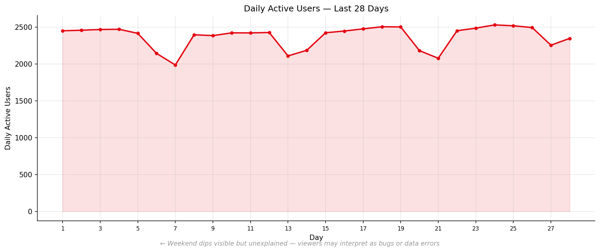
   *Daily active users line chart with no annotations. The weekly dip on weekends is visible but unlabeled — viewers wonder whether the drop is a bug or expected behavior.*

   - Visible patterns left unexplained
   - Audience fills the gap with their own (potentially wrong) interpretation
   - Expected seasonality must be labelled or it looks like a problem

### The Good Version

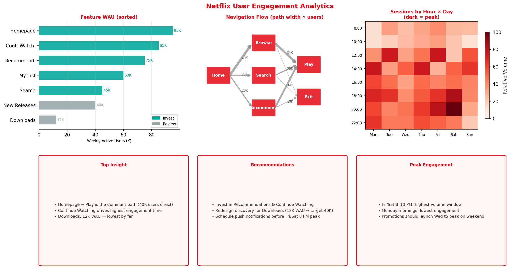
*After: A usage analytics dashboard showing a Sankey/flow diagram of viewing paths, a feature usage bar chart sorted by engagement with top features highlighted, and a heatmap of hourly usage by day of week revealing peak engagement times.*

**Improvements Explained:**

- **User flow diagrams**: Showed how users navigated through the platform — which paths were common, which were dead ends
- **Feature usage charts**: Highlighted most and least used features with clear visual ranking
- **Time-based patterns**: Revealed when and how users engaged with content
- **Clear insights**: Identified key opportunities for improvement (which features to promote, when to send push notifications)
- **Actionable recommendations**: Provided specific suggestions for enhancing engagement

#### Detailed Breakdown of Good Practices

1. **User Flow**

   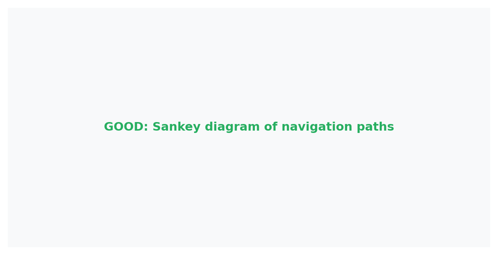
   *Sankey diagram: nodes for Home, Search, Browse, Play, and Exit; arrow widths proportional to users taking each path. The Home → Play direct path is the widest arrow — instantly showing the dominant behavior.*

   - Arrow widths carry the data — no numbers needed to see which path dominates
   - Dead-end paths (paths that lead to Exit) immediately visible
   - Navigation strategy decisions visible at a glance

2. **Feature Usage**

   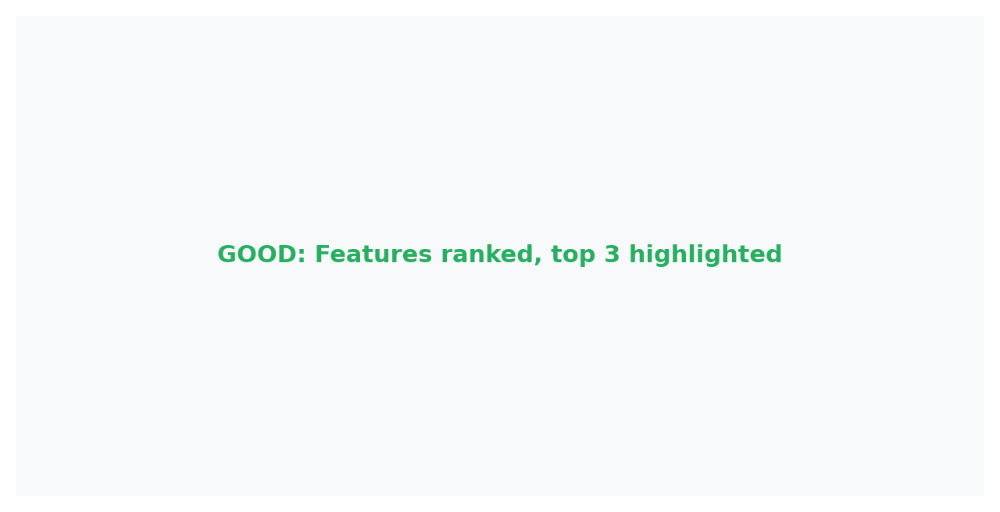
   *Features ranked by weekly active users, sorted descending, with top 3 highlighted in teal and bottom 2 in gray. "Invest vs. deprioritize" is instantly obvious.*

   - Sorted ranking makes priority obvious
   - Semantic color (teal = invest, gray = deprioritize) removes ambiguity
   - Decision implied by the chart itself — no text explanation needed

3. **Time Patterns**

   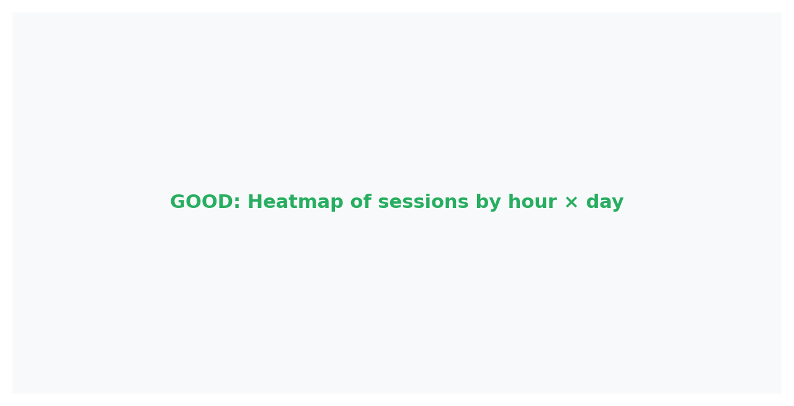
   *Heatmap of sessions by hour (y-axis) and day (x-axis). Friday and Saturday evenings 8-10 PM appear darkest — peak engagement visible instantly. Tells the push notification and promotion scheduling story.*

   - 168 cells (7 days × 24 hours) condensed into a scannable grid
   - High-engagement windows immediately visible (dark = high)
   - Scheduling decisions obvious: "send promotions before peak hours"

### Key Learnings

1. **Visualize User Behavior**: Flow diagrams show navigation patterns in a way tables cannot. The shape of user behavior is data.
2. **Make It Actionable**: Every insight should connect to a product or engineering decision — "feature X is unused" → "redesign discovery or remove it."
3. **Annotate Patterns**: Any repeating pattern in a time series (weekly cycles, monthly spikes) must be labelled. Unlabelled patterns are interpreted as anomalies.

---

> **Try it yourself — Usage Analysis:**
> You have this feature usage data: Search: 2.4M weekly users, Continue Watching: 1.8M, Browse: 1.2M, My List: 400K, Downloads: 90K.
>
> (1) Sketch a horizontal bar chart (sorted by value, top to bottom). (2) Apply semantic color: highlight the top 2 in one color, the bottom 2 in another. (3) Write a one-sentence insight and one-sentence recommendation based on what the chart shows.

---

## Common Themes Across Case Studies

Looking across all five case studies, three patterns emerge in every "bad version" and three corresponding fixes appear in every "good version":

### 1. The Power of Focus

- **Bad versions show everything**: 50 KPIs, 200 rows, 15 columns — all data, no decisions
- **Good versions show what matters**: 5 KPIs, 3 key metrics, top-ranked features
- **The lesson**: Before you present, ask "what decision is this presentation supporting?" Cut everything that doesn't help make that decision.

### 2. The Importance of Context

- **Bad versions show numbers in isolation**: ROAS of 2.3, net income of $1.1B, churn rate of 5%
- **Good versions show comparisons**: ROAS 2.3x vs. 1.8x last campaign, net income up 12% YoY, churn 5% vs. industry average 3%
- **The lesson**: A number without a benchmark is uninterpretable. Every metric needs a comparison point — prior period, competitor benchmark, internal target, or industry standard.

### 3. The Need for Action

- **Bad versions end with data**: "Here's what we found"
- **Good versions end with recommendations**: "Based on this, we should do X by Y date"
- **The lesson**: Every data presentation is a decision-support tool. If it doesn't end with a clear recommendation and a specific call to action, it hasn't finished its job.

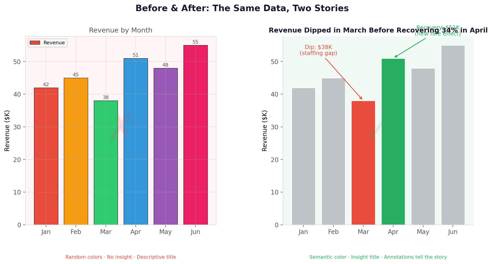
*The before/after pattern is consistent across all five case studies: less data shown, more context added, and a clear recommendation at the end.*

## How to Apply These Lessons

### 1. Start with Your Audience

- **What do they need to know?**: Understand your audience's key concerns and questions — not what you want to tell them, but what they need to decide
- **What decisions do they need to make?**: Focus on data that supports decision-making, not data that shows how much work you did
- **How can you help them?**: Provide clear, actionable insights — the gift of a good data story is time saved

### 2. Focus on the Story

- **What's the main message?** — If you can't say it in one sentence, the story isn't clear yet
- **What evidence supports it?** — Use the minimum evidence needed to make the case convincingly
- **What should happen next?** — Specific, named, dated recommendation

### 3. Make It Visual

- **Choose the right charts**: Flow diagrams for journeys, bar charts for comparisons, line charts for trends, heatmaps for time patterns
- **Use color purposefully**: Semantic color (red/green) and sorted rankings do more work than random palettes
- **Create clear hierarchy**: Large and prominent for primary metrics, small and recessed for supporting detail

### 4. Drive Action

- **Clear recommendations**: "Add 2 customer support reps" beats "improve support"
- **Measurable impact**: "Projected to recover 60% of churned customers" beats "should help retention"
- **Next steps**: "Decision needed by Friday's budget meeting" beats "let us know what you think"

## Practice Exercise: Analyze Your Own Work

### Step 1: Review Your Current Work

Take any report, dashboard, or presentation you've completed. Ask:
- **What's working well?** Identify elements that are clear, scannable, and actionable
- **What could be improved?** Look for clutter, missing context, or buried insights
- **What's missing?** What comparison, benchmark, or recommendation would make it complete?

### Step 2: Apply the Lessons

For each problem you found:
- **For clutter**: Cut to the 3-5 most important metrics or findings
- **For missing context**: Add a comparison — prior period, benchmark, or target
- **For missing action**: Write one specific recommendation with a timeline

### Step 3: Get Feedback

- **Show to a colleague**: Ask "What's the main message?" and "What would you do differently based on this?" — not "does this look okay?"
- **Ask specific questions**: Vague questions get vague feedback
- **Iterate**: Revise based on what they understood vs. what you intended

## Common Gotchas

- **Reducing to "5-7 critical KPIs" only works if you've agreed on which ones matter** — the Walmart case shows a clean dashboard with five KPIs, but choosing the wrong five is worse than showing more. Consult the decision-maker before cutting metrics; stakeholders often have a "non-negotiable" KPI that looks secondary to an analyst.
- **A funnel chart implies the same cohort flows through each step, which is often false** — in the Spotify case, the funnel shows absolute user counts per step. If different users enter at different steps (e.g., re-activation flows), the funnel overstates drop-off. Label whether it is a cohort funnel or a cross-sectional snapshot.
- **Comparing channels on a single metric like ROAS hides the volume-efficiency trade-off** — the Airbnb case addresses this with the "ROI Focus" improvement, but a single ROAS bar chart can make a small high-ROAS channel look better than a large moderate-ROAS channel even when the latter generates more absolute profit. Show both dimensions or be explicit about what you're optimizing.
- **Using "record X drove Y outcome" language on a board deck implies causation without a control** — the Tesla case frames quarterly results against prior periods, which is appropriate, but learners often copy this pattern into their own analyses and present correlation as causation. Always hedge with "consistent with" or "coinciding with" unless you have an experiment.
- **Flow diagrams like the Netflix Sankey become misleading if path widths aren't proportional to the same unit** — if "Browse → Play" width encodes unique users but "Browse → Search" width encodes sessions, the chart looks comparable but isn't. Ensure a single consistent unit (users, sessions, or events) drives all path widths before publishing.

## Next Steps

1. Apply the three-question framework to your next piece of work: (1) Am I showing only what matters? (2) Have I added context so numbers are interpretable? (3) Does it end with a specific recommendation?
2. Revisit [Visual Storytelling](visual-storytelling.md) for the chart-level techniques that make dashboards like the "good versions" above.
3. Revisit [Narrative Techniques](narrative-techniques.md) for the story-level frameworks (SCR, Classic Arc) that structure the narrative around data like the "good versions" above.

Remember: The best data stories are those that make complex information simple and actionable. Use these case studies as inspiration, but adapt the lessons to your specific needs and audience.
