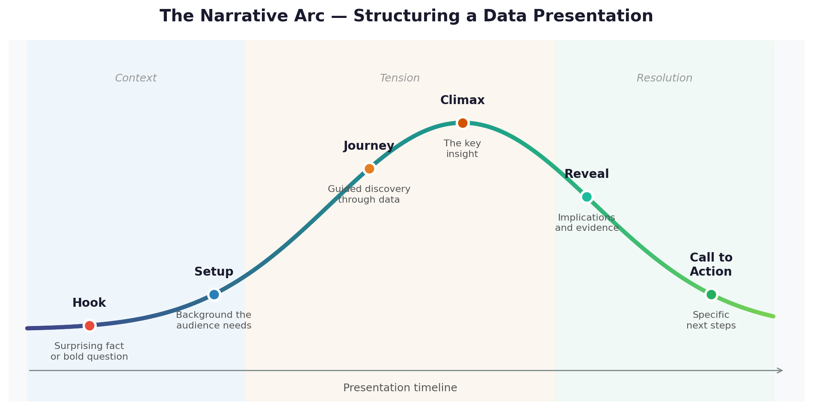
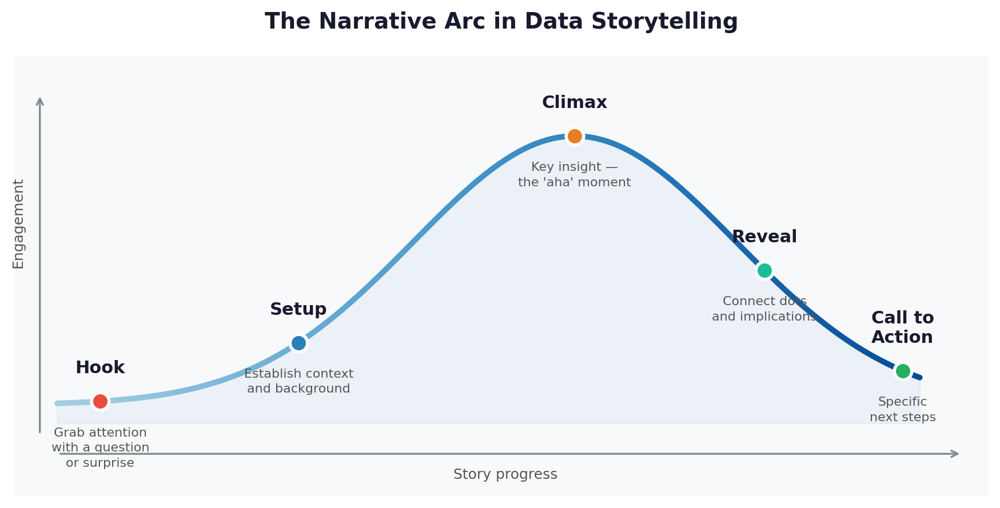
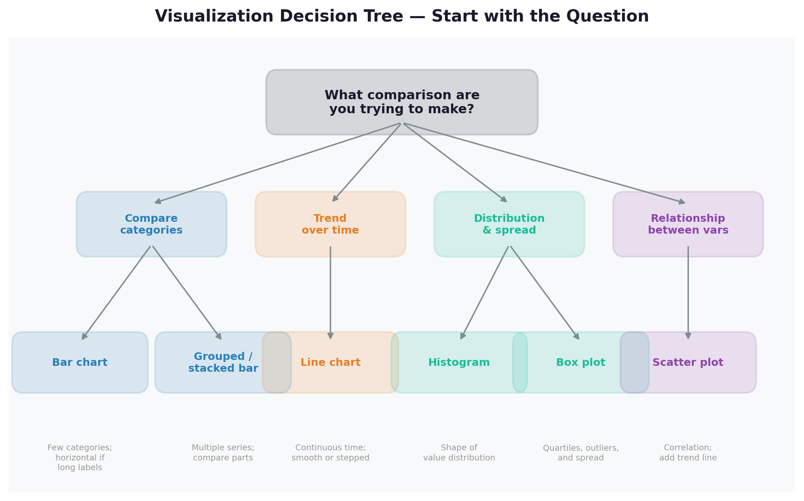
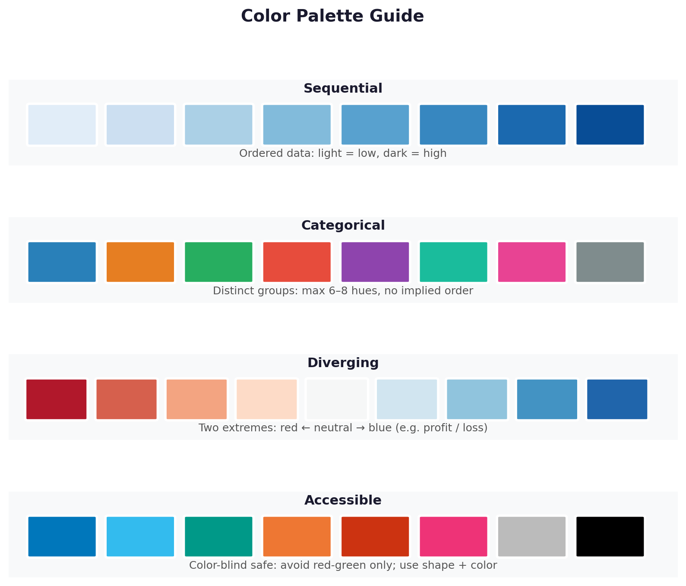
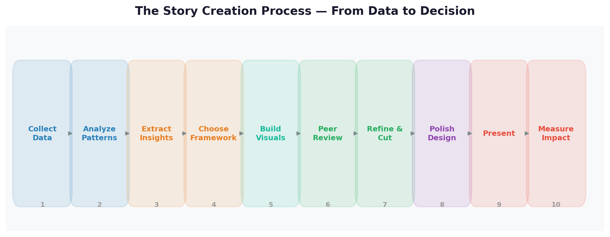
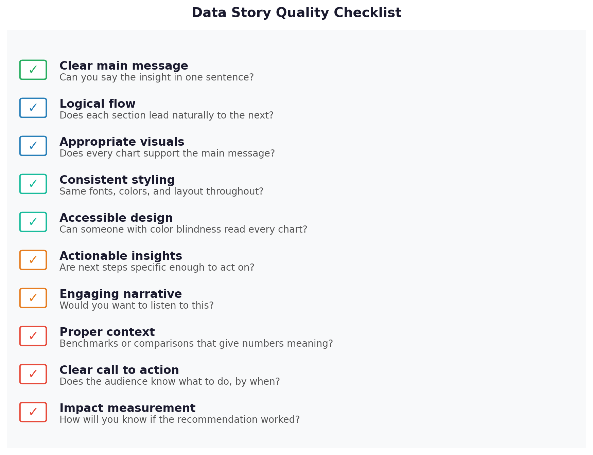

# Data Storytelling Narrative Techniques: A Beginner's Guide

Here's a situation most analysts face: you have the right answer, the right chart, and the right recommendation — but the meeting ends without a decision. Your data was correct but your story didn't land. Narrative technique is the skill that fixes this. It's not about spin or persuasion — it's about structuring information so your audience can actually absorb it, remember it, and act on it. This lesson gives you the tools to do that.

**After this lesson:** you can explain the core ideas in "Data Storytelling Narrative Techniques: A Beginner's Guide" and reproduce the examples here in your own notebook or environment.

> **Note:** This is a **concept-first** companion to [Visual storytelling](visual-storytelling.md). Worked examples may reference charts you build in Python or BI tools.

## Key Terms

| Term | Plain-English Definition |
|------|--------------------------|
| **Narrative arc** | The overall shape of a story: it has a beginning (setup), middle (tension or conflict), and end (resolution) |
| **Hook** | The opening move — a question, surprise, or high-stakes statement that makes the audience want to keep listening |
| **Setup** | Background context the audience needs before they can understand the problem |
| **SCR Framework** | Situation → Complication → Resolution — a fast, business-friendly story structure |
| **Call to action** | The specific thing you want your audience to do next — the more specific, the better |
| **Stakeholder** | Anyone who has a stake in the outcome — your audience, decision-makers, or people affected by your findings |

## Helpful video

Framing insights for others—related context for storytelling.

<iframe width="560" height="315" src="https://www.youtube.com/embed/RBSUwFGa6Fk" title="What is Data Science?" frameborder="0" allow="accelerometer; autoplay; clipboard-write; encrypted-media; gyroscope; picture-in-picture" allowfullscreen></iframe>

## Table of Contents

1. [Introduction: The Power of Narrative in Data](#introduction-the-power-of-narrative-in-data)
2. [Story Structure Frameworks](#story-structure-frameworks)
3. [Core Narrative Elements](#core-narrative-elements)
4. [Data Visualization Best Practices](#data-visualization-best-practices)
5. [Story Creation Process](#story-creation-process)
6. [Quality Assurance](#quality-assurance)
7. [Real-World Examples](#real-world-examples)
8. [Tips for Success](#tips-for-success)
9. [Additional Resources](#additional-resources)

## Introduction: The Power of Narrative in Data

Picture this: You're standing in front of a room full of executives, armed with the most comprehensive data analysis your team has ever produced. The numbers are solid, the insights are groundbreaking, and the recommendations are clear. But as you start presenting, you notice eyes glazing over, phones coming out, and attention drifting away. Sound familiar?

This is where the magic of narrative comes in. Think of your data as a treasure map — the numbers are the landmarks, but the story is what guides your audience to the buried treasure. Without a compelling narrative, even the most valuable insights can remain hidden in plain sight.

### Why Narrative Matters

Think of data like ingredients and narrative like a recipe:

- **Raw Data** = Raw ingredients (flour, sugar, eggs)
  - Numbers and statistics alone are hard to digest
  - No inherent meaning or context
  - Difficult to remember or act upon

- **Narrative** = Recipe (instructions on how to combine ingredients)
  - Provides structure and flow
  - Creates meaningful connections
  - Makes information digestible

- **Story** = Finished dish (delicious and easy to consume)
  - Engaging and memorable
  - Clear purpose and meaning
  - Drives action and change

---

> **Try it yourself — Narrative vs Data Dump:**
> Take this data and write two versions of a one-sentence summary:
> "Customer satisfaction: Q1=72%, Q2=68%, Q3=61%, Q4=58%. Support tickets up 40% over same period."
>
> Version 1 (data dump): Just report the numbers.
> Version 2 (narrative): Tell a story — what's happening, why it matters, and what should happen next.
>
> Compare them. Version 2 should make someone want to act. If it doesn't, it still needs more narrative structure.

---

## Story Structure Frameworks

The image above shows two powerful approaches to structuring a data story. Notice how both follow the same underlying logic — establish reality, introduce tension, resolve it — but at different speeds.

The classic narrative arc maps directly to data presentations: the curve rises as you build toward the key insight, peaks at the "aha moment," and resolves with the recommendation and call to action.

### Classic Narrative Arc

1. **Hook**: The attention-grabbing opening
   - Creates curiosity or tension ("What if we could predict customer churn before it happens?")
   - Poses a compelling question (the kind that makes the audience lean forward)
   - Presents a surprising fact ("Our biggest growth driver isn't marketing — it's word of mouth")
   - Sets up the stakes (so everyone knows why they should care)

2. **Setup**: The context and background
   - Establishes the current situation (the status quo, before anything changed)
   - Provides necessary history (just enough backstory to make the problem understandable)
   - Introduces key players/factors (the people, metrics, or forces that matter)
   - Defines the problem space (the boundary of what you're analyzing)

3. **Journey**: The data exploration
   - Guides through key discoveries (one insight at a time, building toward the conclusion)
   - Builds understanding gradually (no jumping to conclusions)
   - Reveals patterns and insights (the hidden connections that change the picture)
   - Creates "aha" moments (those satisfying clicks when everything falls into place)

4. **Reveal**: The key insights
   - Presents main findings (the answer to the question you raised in the Hook)
   - Explains implications (why this matters beyond the data itself)
   - Connects dots (how all the evidence fits together)
   - Delivers the "punch line" (the one thing you want the audience to remember)

5. **Call to Action**: The next steps
   - Proposes specific solutions (not "we should improve X" but "we should hire 2 people for X by March")
   - Outlines implementation steps (a realistic roadmap)
   - Defines success metrics (how will we know it worked?)
   - Motivates change (why now, not later)

### SCR Framework

A simpler alternative for business presentations — especially when you have limited time:

- **Situation**: "Our customer retention rate is 72%, down from 85% a year ago."
- **Complication**: "Exit surveys show the drop is driven by slow support response times, not product quality."
- **Resolution**: "Adding two support staff and a chatbot for tier-1 tickets is projected to recover 60% of churned customers."

The SCR framework works because it's three sentences with a clear structure. Any stakeholder can follow it. Use the Classic Arc when you have 20+ minutes; use SCR for a 5-minute briefing or a one-page summary.

---

> **Try it yourself — SCR Practice:**
> Write an SCR summary for one of these scenarios:
> 1. Your team's analysis shows that mobile users are converting at half the rate of desktop users
> 2. Marketing spend doubled in Q3 but revenue only grew 10%
>
> Format: Situation (1 sentence) → Complication (1 sentence) → Resolution (1 sentence with a specific recommendation).

---

## Core Narrative Elements

### 1. The Hook: Grabbing Attention

The visual hierarchy principle applies to your opening just as it does to your charts — the most important thing (your hook) must be impossible to miss. The image above shows how primary, secondary, and background information are layered: your hook is always primary.

#### Three Types of Hooks

1. **The Question Hook** — creates curiosity
   - "What if we could predict customer churn before it happens?"
   - "How are the top 10% of our sales team outperforming everyone else by 300%?"
   - "Why do 80% of our customers never use our most expensive feature?"

2. **The Surprise Hook** — challenges assumptions
   - "Our biggest competitor isn't who you think — it's actually our own website."
   - "The solution to our retention problem was hiding in our lunch break data."
   - "We're spending 60% of our budget on features only 5% of users want."

3. **The Stakes Hook** — creates urgency
   - "Every minute we wait costs us another 100 customers."
   - "There's a $2M opportunity hiding in our support tickets."
   - "We have 3 months to fix this before it becomes irreversible."

The right hook depends on your audience. Executives respond to stakes (money, time, risk). Product teams respond to surprises (unexpected user behavior). Technical teams often respond to questions that reveal complexity they hadn't considered.

### 2. The Setup: Building Context

Think of this like setting up a mystery novel — provide enough context without giving away the ending.

A good Setup answers: "What does my audience need to know before they can understand the problem?" It does not answer: "What do I know about this topic?" Those are different questions. Cut everything that answers only the second.

---

> **Try it yourself — Hook Writing:**
> Write one hook of each type (Question, Surprise, Stakes) for this scenario:
> "Your analysis shows that customers who contact support within their first 30 days are 3x more likely to churn than customers who don't."
>
> After writing all three, decide: which hook would work best if presenting to (a) a customer success team, and (b) a CFO deciding on next quarter's budget?

---

## Data Visualization Best Practices

### Choosing the Right Visualization

Use the decision tree above to select the most appropriate visualization for your data:

- **Comparisons between categories** → Bar charts (horizontal if labels are long)
- **Trends over time** → Line charts
- **Distributions and spread** → Histograms or box plots
- **Correlation between two variables** → Scatter plots
- **Outlier analysis** → Box plots (outliers are explicitly plotted)
- **Part-to-whole relationships** → Pie chart (≤5 categories) or stacked bar

Every chart decision starts with one question: "What comparison am I trying to make?" If you can't answer that, you're not ready to choose a chart type.

### Color Usage Guidelines

The color palette guide above shows four categories of color use:

- **Sequential**: For ordered data (e.g., low to high values) — use a single hue that gets darker
- **Categorical**: For distinct groups that need clear differentiation — use 6-8 distinct hues
- **Diverging**: For data that spans positive and negative values — use two opposing hues with neutral midpoint
- **Accessible**: Color-blind friendly options — avoid red-green combinations; use blue-orange or blue-red instead

---

> **Try it yourself — Visualization Choice:**
> For each question, choose a chart type from the decision tree and explain your reasoning in one sentence:
> 1. "Which of our five marketing channels has the highest conversion rate?"
> 2. "How has our revenue grown month-over-month for the past 2 years?"
> 3. "Is there a relationship between the amount customers spend and how long they've been customers?"

---

## Story Creation Process

Follow the systematic approach above to build a compelling data story from scratch. The key insight from this process: **insight generation** (step 3) must happen before **story structure** (step 4). Many analysts make the mistake of fitting data into a story structure before they've identified what the data actually says.

The full process:

1. **Data Collection**: Gather relevant data — and only relevant data. More data is not always better.
2. **Analysis**: Identify patterns and trends. What's surprising? What's expected?
3. **Insight Generation**: Extract the 1-3 findings that actually matter for the decision at hand.
4. **Story Structure**: Choose your framework (Classic Arc or SCR) and map your insights to it.
5. **Visualization**: Create charts that illustrate each point — one chart per claim.
6. **Review**: Show to a trusted colleague and ask "What's the main message?" before polish.
7. **Refine**: Improve based on feedback. This usually means cutting, not adding.
8. **Finalize**: Polish typography, colors, alignment.
9. **Present**: Deliver with your narrative, not just the slides.
10. **Measure Impact**: Track whether the audience took the action you recommended.

---

> **Try it yourself — Story Map:**
> Pick a dataset you've worked with before (or use the Titanic, Iris, or any course dataset). Work through steps 1-4 in writing:
> - Write down 3 patterns you found in the data
> - Choose 1 that matters most for a hypothetical decision
> - Write an SCR structure (Situation/Complication/Resolution) around it
> - List 2 charts you would use to illustrate each part
>
> You don't need to build the charts — just map the story first.

---

## Quality Assurance

Before finalizing any data story, run through the checklist above. These are the questions that separate presentations that drive decisions from presentations that get "thanks, I'll think about it":

- **Clear main message**: Can you say the main insight in one sentence?
- **Logical flow**: Does each section lead naturally to the next?
- **Appropriate visuals**: Does every chart support the main message? (If not, cut it.)
- **Consistent styling**: Same fonts, colors, and layout throughout?
- **Accessible design**: Can someone with color blindness read every chart?
- **Actionable insights**: Are next steps specific enough to act on tomorrow?
- **Engaging narrative**: Would you want to listen to this story if someone else were presenting it?
- **Proper context**: Have you provided benchmarks or comparisons that give numbers meaning?
- **Clear call to action**: Does the audience know exactly what you want them to do, by when?
- **Impact measurement**: Have you proposed a way to measure whether the recommendation worked?

---

> **Try it yourself — QA Checklist:**
> Apply every checklist item to a presentation or report you've completed before. Score yourself: pass/fail on each item. If you fail on 3 or more, the story isn't ready. What are the top 2 changes you'd make?

---

## Real-World Examples

### Example 1: Customer Churn Story

#### Bad Version

"Our churn rate increased by 5% this quarter."

**Why it's weak:**
- No context or stakes (is 5% catastrophic or expected?)
- No human element (who are these customers?)
- No clear action items (what should happen as a result of knowing this?)

#### Good Version

"Imagine losing 500 loyal customers — that's like losing a full stadium of fans. That's what happened this quarter when our service response time doubled. But here's the good news: our analysis shows that by adding just two customer service representatives, we can bring back 60% of those customers."

**Why it's strong:**
- Uses a vivid analogy to make the number concrete (stadium of fans)
- Provides a specific cause (response time doubled)
- Offers a specific, costed solution (two reps)
- Quantifies the upside (60% recovery)

### Example 2: Marketing Campaign Story

#### Bad Version

"Email open rates vary by time of day."

**Why it's weak:**
- States an obvious, generic fact
- No actionable insight (what should we do with this?)
- No compelling narrative (why does this matter right now?)

#### Good Version

"Think about your morning routine. When do you check your email? Our data shows a surprising pattern: 73% of our customers are most likely to read our emails during their morning coffee break — between 9:30 and 10:30 AM. By simply changing when we send our emails, we could reach 45,000 more customers every day."

**Why it's strong:**
- Relates to personal experience (makes the audience feel the insight)
- Provides specific data (73%, specific time window)
- Quantifies the opportunity (45,000 more customers per day)
- Offers a clear, free solution (just change the send time)

### Example 3: Product Performance Story

#### Bad Version

"Feature X has low adoption rates."

**Why it's weak:**
- Vague problem statement (how low? compared to what?)
- No context or comparison (is this unusual for new features?)
- No clear path forward (cut the feature? change the UI? train users?)

#### Good Version

"Picture a restaurant where 80% of customers never look at the menu. That's what's happening with our new feature — 80% of users never discover it. But when they do, they use it 3x more than any other feature. We've found a placement in the main nav that could increase adoption by 300%."

**Why it's strong:**
- Uses a relatable analogy that makes the problem viscerally obvious
- Provides clear metrics (80% don't find it, 3x engagement when they do)
- Shows the opportunity (not just a problem, but a high-leverage fix)
- Offers a specific solution (placement in main nav)

## Tips for Success

### 1. Know Your Audience

Before you write a single word, answer these three questions:

- **What do they already know?** (This determines how much Setup you need)
- **What do they care about?** (This determines which metrics to lead with — cost, risk, customer experience, etc.)
- **What decision do they need to make?** (This determines your Call to Action)

If you don't know the answers, find out before you write the story. A story optimized for the wrong audience is wasted work.

### 2. Keep It Simple

- **One main message per story** — everything else is supporting evidence, not a co-equal message
- **3-5 supporting points maximum** — if you have 8, cut to the strongest 4
- **Specific call to action** — "we should improve X" is not actionable; "we should hire one analyst by Q2" is

### 3. Practice and Iterate

- Test your story on one colleague before the real presentation. Ask: "What's the main takeaway?" Their answer tells you whether the story is landing.
- Get feedback early — before you've polished everything, not after. Early feedback saves rework.
- Refine based on reactions: Are they confused at the Setup? Add context. Are they bored at the Journey? Cut it down.

### 4. Use Visual Aids Purposefully

Every chart should answer a specific question that your narrative asks. If you can't say "this chart answers the question I just raised," the chart doesn't belong in your story.

### 5. Measure Impact

After your presentation, track whether your audience took the action you recommended. This is how you improve over time — not just by self-assessment, but by measuring whether your stories drive change.

## Common Gotchas

- **The SCR framework assumes your audience already agrees on the problem** — "Situation → Complication → Resolution" works well for internal teams who share context, but collapses if the audience disputes the Complication. If you're presenting to skeptical stakeholders, spend more time on Situation (building shared understanding) before naming the problem.
- **A compelling hook that overpromises will damage credibility if the data doesn't deliver** — "We have a $2M opportunity hiding in our support tickets" is a strong stakes hook, but if the analysis shows only $200K, the audience feels misled. Match the hook's magnitude to what the data can actually support.
- **"One main message per story" is a structure goal, not a slide count** — learners often interpret this as "one slide, one chart" and produce decks with too many slides. The single message should thread through all supporting evidence; multiple charts can support the same central claim.
- **Vivid analogies can distort scale perception** — analogies make abstract numbers concrete, but they also anchor the audience to the wrong comparison. A "stadium of fans" for 500 customers implies a sports-scale problem. Check that the analogy's implied scale matches reality.
- **Audience expertise calibration is usually wrong in the direction of over-simplification** — analysts tend to over-explain for technical audiences and use too much jargon for executives. The practical fix: draft at one level, have someone from the target audience read it before you present.

## Additional Resources

### Books

- "Storytelling with Data" by Cole Nussbaumer Knaflic
- "Data Story" by Nancy Duarte
- "The Big Picture" by Steve Wexler

### Online Resources

- [Data Visualization Society](https://www.datavisualizationsociety.org/)
- [Storytelling with Data Blog](https://www.storytellingwithdata.com/blog)
- [Information is Beautiful](https://informationisbeautiful.net/)

### Tools

- Tableau Public (Free) — best for interactive dashboards
- Power BI (Free) — best for business analytics and report creation
- Python (matplotlib, seaborn) — best for custom, reproducible visualizations
- R (ggplot2) — best for statistical graphics and publication-quality plots

## Next Steps

1. Practice the SCR framework on your next piece of analysis before you build any slides.
2. Read [Visual Storytelling](visual-storytelling.md) to connect narrative structure to chart design.
3. Study the [Case Studies](case-studies.md) to see how these techniques appear in real before/after transformations.

Remember: The best data stories are like good conversations — they're clear, engaging, and lead to meaningful action. Start simple, focus on your audience, and let your data guide the narrative.
