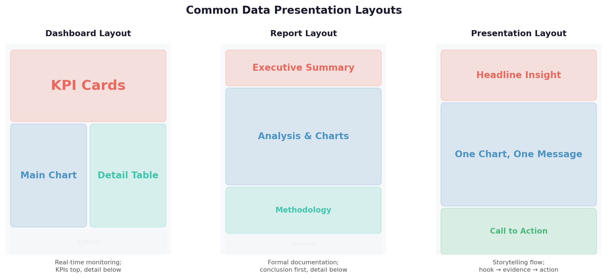

# Visual Storytelling: A Beginner's Guide to Data Visualization

You've probably seen it before: two people present the same data — same numbers, same findings — and one presentation gets questions and action while the other gets polite nods and nothing changes. The difference is almost always visual. How you show data changes what people understand, what they remember, and what they do. This lesson teaches you the grammar of visual communication so your charts work as hard as your analysis.

**After this lesson:** you can explain the core ideas in "Visual Storytelling: A Beginner's Guide to Data Visualization" and reproduce the examples here in your own notebook or environment.

> **Note:** This lesson focuses on **structure and communication** (titles, flow, emphasis). You can practice with any charting tool you already use from earlier in Module 3.

## Key Terms

| Term | Plain-English Definition |
|------|--------------------------|
| **Visual hierarchy** | The deliberate arrangement of elements so important things look important and secondary things recede |
| **Chart type** | The shape of a visualization — bar, line, scatter, etc. — chosen based on what comparison or pattern you want to show |
| **Color encoding** | Using color to carry meaning (e.g., red = bad, green = good, or blue = one category, orange = another) |
| **Axis** | The scale on a chart's edge — x-axis is horizontal, y-axis is vertical; both must be labelled and honestly scaled |
| **Annotation** | Text added directly to a chart to explain a specific point, spike, or pattern |
| **Whitespace** | Intentional empty space around elements — it reduces clutter and makes the important elements stand out |

## Helpful video

Framing insights for others—related context for storytelling.

<iframe width="560" height="315" src="https://www.youtube.com/embed/RBSUwFGa6Fk" title="What is Data Science?" frameborder="0" allow="accelerometer; autoplay; clipboard-write; encrypted-media; gyroscope; picture-in-picture" allowfullscreen></iframe>

## Introduction: The Power of Visual Communication

Imagine trying to explain a complex journey using only words versus showing a map. The map makes it instantly clear where you are, where you're going, and the best path to get there. That's the power of visual storytelling with data.

### Why Visuals Matter

Think of data visualization like a universal language:

- **Words** = One person speaking (linear, sequential)
- **Numbers** = Mathematical language (precise but abstract)
- **Visuals** = Universal language (instant understanding)

The human brain processes images roughly 60,000 times faster than text. A well-designed chart can communicate in seconds what a paragraph of prose communicates in a minute — but only if the chart is designed intentionally.

---

> **Try it yourself — The Words vs Visuals Test:**
> Write a paragraph describing this data: "Monday: 120, Tuesday: 145, Wednesday: 112, Thursday: 188, Friday: 205." Now sketch a simple bar chart of the same data. Show both to a friend and ask: "Which day had the highest value?" Time how long it takes them to answer from each format. The difference is your argument for visual communication.

---

## The Building Blocks of Visual Storytelling

### 1. Choosing the Right Chart: Your Visual Vocabulary

Think of charts like different types of sentences:

- **Bar Chart** = Simple statement (comparing quantities)
- **Line Chart** = Story over time (showing trends)
- **Pie Chart** = Parts of a whole (showing proportions)


The chart selection guide above helps you choose the right visualization based on your goal:

1. **Comparison**: Use bar charts or column charts
2. **Trend**: Use line charts or area charts
3. **Distribution**: Use histograms or box plots

#### Common Chart Types and When to Use Them

1. **Comparison Charts**
   - **Bar Charts**: Like comparing heights of different people
     - Best for: Comparing values across categories
     - Example: Monthly sales by product
     - Tip: Use horizontal bars when you have long category names

   - **Column Charts**: Like comparing weights of different objects
     - Best for: Comparing values across categories with time
     - Example: Quarterly revenue by region
     - Tip: Limit to 7-10 categories for clarity

   - **Bullet Charts**: Like comparing targets vs. actual performance
     - Best for: Showing progress toward a goal
     - Example: Sales targets vs. actual sales
     - Tip: Use color to indicate performance levels

2. **Trend Charts**
   - **Line Charts**: Like tracking a journey on a map
     - Best for: Showing trends over time
     - Example: Stock price movements
     - Tip: Use smooth lines for trends, sharp lines for actual data

   - **Area Charts**: Like showing volume over time
     - Best for: Showing cumulative values
     - Example: Total sales over time
     - Tip: Use transparency to show overlapping areas

   - **Sparklines**: Like a quick weather forecast
     - Best for: Showing trends in a small space
     - Example: Daily temperature trends
     - Tip: Include min/max markers for context

3. **Distribution Charts**
   - **Histograms**: Like a population pyramid
     - Best for: Showing distribution of values
     - Example: Age distribution of customers
     - Tip: Choose appropriate bin sizes

   - **Box Plots**: Like a weather report
     - Best for: Showing statistical distribution
     - Example: Test scores by class
     - Tip: Include outliers for complete picture

   > **Advanced (skip on first read):** Violin Plots show probability density on both sides of a center axis — they're box plots that also show the shape of the distribution. Useful for comparing distributions across groups, but require statistical literacy from your audience.

4. **Relationship Charts**
   - **Scatter Plots**: Like stars in a constellation
     - Best for: Showing correlation between variables
     - Example: Height vs. weight
     - Tip: Add trend line for clarity

   - **Bubble Charts**: Like a galaxy of data points
     - Best for: Showing three variables
     - Example: Sales vs. marketing spend vs. profit
     - Tip: Use size consistently for third variable

   - **Heat Maps**: Like a weather map
     - Best for: Showing patterns in large datasets
     - Example: Website traffic by time and day
     - Tip: Use intuitive color scales

5. **Composition Charts**
   - **Pie Charts**: Like slicing a pizza
     - Best for: Showing parts of a whole when there are 5 or fewer slices
     - Example: Market share by top 4 companies
     - Tip: If you have more than 5-6 slices, use a bar chart instead — pie charts with many slices are unreadable

   - **Donut Charts**: Like a pie chart with a hole
     - Best for: Showing parts with a center metric
     - Example: Budget allocation with total in center
     - Tip: Use for emphasis on total

   - **Stacked Bar Charts**: Like a layer cake
     - Best for: Showing parts and totals
     - Example: Sales by product and region
     - Tip: Order segments by size

6. **Hierarchical Charts**

   > **Advanced (skip on first read):** Treemaps, Sunburst charts, and Tree Diagrams all show hierarchical data — how a whole is made up of parts, which are made up of sub-parts. These are powerful but need careful labelling. Use a sorted bar chart for your first version, then upgrade to a treemap only if the hierarchy itself is the story.

---

> **Try it yourself — Chart Matching:**
> For each scenario below, choose the chart type that fits best and write one sentence explaining why:
> 1. You want to show how monthly website visits changed over the past year
> 2. You want to compare the number of support tickets by department
> 3. You want to show what percentage of revenue comes from each product category (4 categories)
> 4. You want to understand whether taller people tend to weigh more
>
> Answers: (1) Line chart — time series. (2) Bar chart — categorical comparison. (3) Pie or bar chart — composition with few categories. (4) Scatter plot — relationship between two continuous variables.

---

### 2. Color and Design: Your Visual Grammar

Think of color like traffic signals:

- **Red**: Stop and pay attention (key metrics)
- **Yellow**: Caution and consider (supporting data)
- **Green**: Go ahead and explore (background info)


The color schemes above demonstrate three key approaches:

1. **Sequential**: For showing progression or intensity (e.g., light to dark blue for "low to high")
2. **Categorical**: For distinguishing different categories (e.g., blue, orange, green for different products)
3. **Diverging**: For highlighting extremes from a center point (e.g., red-white-blue for below/at/above target)

#### Color Best Practices

1. **Use Color Purposefully**
   - One color per category, used consistently
   - Consistent meaning across all charts in a deck
   - High contrast for readability (check with a contrast checker)

2. **Consider Color Blindness**
   - About 8% of men and 0.5% of women have some form of color vision deficiency
   - Use colorblind-friendly palettes (e.g., Okabe-Ito, ColorBrewer)
   - Add patterns or shapes as backup — don't rely on color alone to encode data

3. **Create Visual Hierarchy**
   - Primary information: Bold, bright colors
   - Secondary information: Muted, desaturated colors
   - Background elements: Light, neutral colors (grays)

#### Modern Color Schemes

1. **Sequential Color Schemes**

   ```markdown
   Light to Dark (single hue):
   - Light blue → Dark blue
   - Light green → Dark green
   Use when: showing intensity, concentration, or magnitude
   ```

2. **Categorical Color Schemes**

   ```markdown
   Distinct Colors (max 6-8):
   - Blue, Orange, Green, Red, Purple, Brown
   Use when: distinguishing unordered categories (products, regions, teams)
   ```

3. **Diverging Color Schemes**

   ```markdown
   Two opposing hues with neutral center:
   - Red → White → Blue (e.g., for below/above budget)
   - Green → Gray → Red (e.g., for growth/decline)
   Use when: values can be positive or negative relative to a meaningful midpoint
   ```

---

> **Try it yourself — Color Audit:**
> Open any chart you've made. Ask yourself three questions:
> 1. Does every color carry a specific meaning, or are some colors just "default"?
> 2. Would a colorblind person be able to read this chart?
> 3. If you made all the non-essential elements gray, what would stand out?
>
> Re-make the chart applying your answers. The version where non-essential elements are gray and only 1-2 colors carry meaning is almost always clearer.

---

### 3. Layout and Composition: Your Visual Structure

Think of layout like arranging furniture in a room:

- **Focal Point**: The main piece (key insight)
- **Flow**: How people move through the space (story progression)
- **Balance**: Everything in its right place (visual harmony)



The layout examples above show three common structures:

1. **Dashboard Layout**: For interactive data exploration — key metrics at top, details below
2. **Report Layout**: For formal documentation — header, body, footer with sources
3. **Presentation Layout**: For storytelling flow — hook, evidence, conclusion

#### Layout Principles

1. **The Z-Pattern**
   - Eyes naturally move: top-left → top-right → bottom-left → bottom-right
   - Place the most important element at top-left
   - Good for: one-time reads like reports or slides

2. **The F-Pattern**
   - Eyes scan: across the top, then down the left edge, then across again at points of interest
   - Good for: dashboards users will scan repeatedly
   - Implication: Put critical metrics along the top row and left column

3. **The Golden Ratio**
   - 1:1.618 ratio creates naturally pleasing proportions
   - Used in dashboard grid design: a main chart that takes ~60% of width next to a 40% sidebar

---

> **Try it yourself — Layout Analysis:**
> Find a dashboard or report (could be a news infographic, a Tableau Public example, or your own work). Without reading the content, trace where your eye goes first, second, and third. Does that order match what's actually most important? If not, describe one change that would fix the visual hierarchy.

---

## Real-World Examples

### Example 1: Sales Dashboard

#### Bad Version

- Cluttered with too many charts
- Inconsistent colors — each chart uses a different palette
- No clear hierarchy — every element is the same visual weight
- No titles that state the insight (just "Sales by Region")

#### Good Version

- Focused on 5-7 key metrics at top
- Consistent color scheme (green = above target, red = below)
- Clear visual hierarchy: KPIs large at top, supporting detail below
- Insight titles: "Southeast underperforming by 23% — needs attention"

### Example 2: Customer Journey Map

#### Bad Version

- Linear, text-heavy — bullet points describing each step
- No visual cues for drop-off or problem stages
- Hard to follow — no flow, no connectors, no progression

#### Good Version

- Visual flow diagram with arrows showing progression
- Color-coded stages: green (healthy), yellow (warning), red (critical drop-off)
- Metrics at each step: "72% complete this step" or "40% drop-off here"

### Example 3: Financial Report

#### Bad Version

- Raw numbers only — a table of 50+ rows and columns
- No visual elements — no charts, no highlighting
- Hard to understand — what's the trend? What's changed?

#### Good Version

- Key metrics highlighted with large type and trend arrows
- Line charts for trend data, bar charts for comparisons
- Year-over-year deltas clearly labelled ("+12% vs prior year")

## Common Mistakes to Avoid

### 1. The Clutter Trap

**Don't**: Put everything on one screen — show every metric, every filter, every annotation.
**Do**: Focus on key insights. If something doesn't support the main message, remove it or move it to an appendix.

### 2. The Color Chaos

**Don't**: Use a different color for each data point or let the tool pick colors randomly.
**Do**: Use a consistent, purposeful color scheme. Assign colors to categories and keep them the same across all charts.

### 3. The Scale Problem

**Don't**: Let your chart tool auto-scale the y-axis to start near the data minimum — this visually exaggerates small differences.
**Do**: Start axes at zero for bar charts. For line charts showing small changes over time, truncating is acceptable — but label it clearly.

### 4. The Font Fiasco

**Don't**: Use more than 2-3 font styles in one visualization (font, bold font, and italics is already three).
**Do**: Use one readable sans-serif font. Use **bold** for emphasis. Use font size to signal hierarchy.

### 5. The Alignment Issue

**Don't**: Randomly place elements — let the tool position everything by default.
**Do**: Use consistent alignment. Left-align text. Align chart edges. Use a grid.

### 6. The Missing Title Problem

**Don't**: Title a chart "Sales by Month" — that describes the data, not the insight.
**Do**: Title it "Sales fell 18% in Q3 before recovering in October" — that tells the story.

---

> **Try it yourself — Mistake Hunt:**
> Apply all six mistake checks to a chart you've built or found online. Score it: how many does it pass? How many does it fail? Write one concrete fix for each failure. This is the habit professional data analysts use before every chart goes into a presentation.

---

## Practical Exercises

### Exercise 1: Chart Selection

Given these scenarios, choose the best chart type and explain your reasoning in one sentence:

1. Comparing sales across 6 regions for a single quarter
2. Showing monthly temperature change over 5 years
3. Displaying market share for 4 competitors

### Exercise 2: Color Scheme

Design a color scheme for each scenario (name the colors and explain what each one means):

1. A financial dashboard that shows actual vs. budget vs. forecast
2. A healthcare report comparing four patient age groups
3. A marketing campaign analysis comparing three channels

### Exercise 3: Layout Design

Sketch a simple layout (boxes on paper or ASCII art) for:

1. A one-page executive summary of quarterly results
2. A dashboard for a customer service team checking ticket volume
3. A slide deck showing a product recommendation

## Tips for Success

### 1. Start Simple

- One message per visualization — if a chart needs two messages, make two charts
- Clear, readable fonts — 12pt minimum for labels, 18pt+ for titles
- Adequate white space — if it feels cramped, it is

### 2. Test Your Visuals

- Show to a colleague and ask: "What's the main message of this chart?" — if they can't say it in 10 seconds, redesign
- Ask: "What would you do differently based on this?" — their answer shows whether the call to action is clear
- Iterate and improve — first drafts are almost never final

### 3. Consider Your Audience

- Technical audience: more detail, more axes, more statistical language is fine
- Executive audience: fewer charts, bigger numbers, clear "so what"
- Mixed audience: lead with the headline insight, put technical detail in an appendix

### 4. Use Interactive Elements Carefully

> **Advanced (skip on first read):** Interactive dashboards (Tableau, Power BI) let users filter and drill down. This is powerful but dangerous — it can make "the story" disappear because every user builds their own story. For executive presentations, use static views with the key insight pre-selected. Save interactive exploration for analysts.

### 5. Maintain Consistency

- Use templates — save your color palette and font choices as a reusable style
- Follow style guides if your organization has them
- Keep chart types consistent across related dashboards (don't use bar charts for the same data sometimes and line charts other times)

## Common Gotchas

- **Truncating the y-axis at a non-zero baseline exaggerates differences visually** — a bar chart where the y-axis starts at 90 makes a difference from 92 to 95 look massive compared to one starting at 0. Matplotlib and Tableau sometimes auto-scale axes near the data minimum. Always check axis origin before publishing.
- **Pie charts with more than 5–7 slices are unreadable, and "limit to 5-7 segments" doesn't solve the root problem** — if you have 12 product categories, the right solution is not a pie with "Other" collapsed; it's a sorted bar chart. Pie charts are only appropriate when proportions are the story and parts sum to a meaningful whole.
- **The Z-pattern and F-pattern describe how people scan, not how you should fill the canvas** — placing the most important chart top-left assumes a Western left-to-right audience and a non-interactive display. Dashboard tools let users click and filter, which breaks linear scan paths. Design for the decision, not the reading pattern.
- **Consistent color "across charts" breaks down when two charts encode different variables in the same color** — if blue means "Desktop" in a device chart and blue also means "Q1" in a quarterly chart on the same dashboard, color loses its meaning entirely. Map colors to semantic meaning (device type, region, status) not to chart position or order.
- **"Test with colleagues" only helps if you ask specific questions** — asking "does this look okay?" produces no useful signal. Ask instead: "What is the main message?" and "What would you do differently based on this?" Their answers reveal whether the story is landing.

## Next Steps

1. **Master chart selection** — practice choosing chart types without looking up a guide. The goal is intuition.
2. **Build your color toolkit** — save 2-3 color palettes you trust (one sequential, one categorical, one diverging) and use them consistently.
3. **Move to narrative** — once your individual charts are solid, read [Narrative Techniques](narrative-techniques.md) to learn how to connect charts into a story.
4. **Study real examples** — the [Case Studies](case-studies.md) file shows before/after transformations for real-world scenarios.

## Additional Resources

### Books

- "The Visual Display of Quantitative Information" by Edward Tufte
- "Information Dashboard Design" by Stephen Few
- "Visualize This" by Nathan Yau

### Online Courses

- Coursera: "Data Visualization and Communication"
- Udemy: "Data Visualization with Python"
- DataCamp: "Data Visualization with Tableau"

### Tools

- Tableau Public (Free)
- Power BI (Free)
- Python (matplotlib, seaborn)
- R (ggplot2)

Remember: The best visualizations are like good maps — they guide your audience to understanding without getting them lost in the details.
