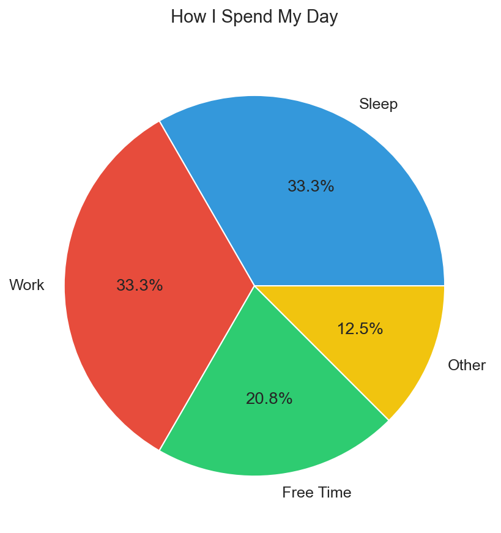
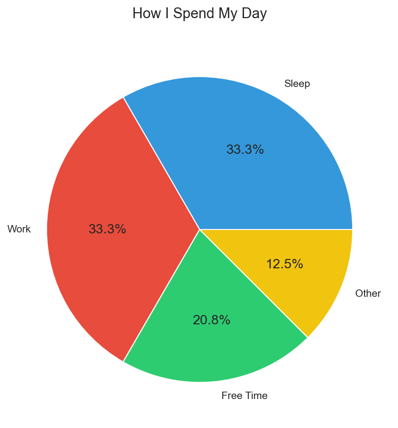
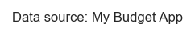

# Data Visualization: A Beginner's Guide

**After this lesson:** you can explain the core ideas in “Data Visualization: A Beginner's Guide” and reproduce the examples here in your own notebook or environment.

## Helpful video

Orientation for the course visualization materials.

<iframe width="560" height="315" src="https://www.youtube.com/embed/RBSUwFGa6Fk" title="What is Data Science?" frameborder="0" allow="accelerometer; autoplay; clipboard-write; encrypted-media; gyroscope; picture-in-picture" allowfullscreen></iframe>

## Prerequisites

- You can run short Python snippets or read charts in a slide deck; no advanced statistics required.
- Optional: [Quick start](quick-start.md) if you want a hands-on Matplotlib warm-up first.

## What is Data Visualization?

Think of data visualization like turning numbers into pictures. Just like how a photograph can tell a story better than a description, a good visualization helps us understand data better than looking at rows of numbers.

### Real-World Analogy

Imagine you're planning a road trip. You could read a list of distances between cities, or you could look at a map. The map (visualization) makes it instantly clear which route is shortest, where the mountains are, and which cities are close together. That's exactly what data visualization does for numbers!

### Why This Matters

- **Quick Understanding**: Spot patterns in seconds that might take hours to find in spreadsheets
- **Better Decisions**: Make informed choices by seeing the big picture
- **Clear Communication**: Share insights with others who might not be comfortable with raw data
- **Problem Solving**: Identify issues and opportunities more easily

## Your First Steps in Data Visualization

### 1. Understanding Your Data

Before you start visualizing, ask yourself:

- What story do you want to tell?
- Who is your audience?
- What type of data do you have? (numbers, categories, time-based, etc.)

### 2. Choosing the Right Chart

Think of charts like different types of maps:

- **Line Charts** are like road maps showing how things change over time
- **Bar Charts** are like comparing heights of buildings
- **Pie Charts** are like slicing a pizza to show portions
- **Scatter Plots** are like plotting stars on a night sky map

## Basic Chart Types (With Real Examples)

### 1. Line Chart

**Purpose:** Plot an ordered category (weekday) against a numeric measure (steps) to see day-to-day variation.

**Walkthrough:** `plot` with `marker='o'` emphasizes discrete days; grid and title explain units.

<div class="code-explainer" data-code-explainer>
<div class="code-explainer__code">


# The simplest line chart - like tracking your daily steps
import matplotlib.pyplot as plt

# Days of the week
days = ['Mon', 'Tue', 'Wed', 'Thu', 'Fri']
# Steps taken each day
steps = [8000, 7500, 9000, 8200, 8800]

# Create the chart
plt.figure(figsize=(10, 6))
plt.plot(days, steps, marker='o', color='#2ecc71', linewidth=2)
plt.title('My Daily Steps This Week', fontsize=14, pad=20)
plt.ylabel('Steps', fontsize=12)
plt.grid(True, linestyle='--', alpha=0.7)
plt.show()


</div>
<aside class="code-explainer__callouts" aria-label="Code walkthrough">
  <div class="code-callout" data-lines="1-2" data-tint="1">
    <div class="code-callout__meta">
      <span class="code-callout__lines"></span>
      <span class="code-callout__title">Import</span>
    </div>
    <div class="code-callout__body">
      <p><code>matplotlib.pyplot</code> is the only dependency for this basic chart—no additional libraries needed.</p>
    </div>
  </div>
  <div class="code-callout" data-lines="4-7" data-tint="2">
    <div class="code-callout__meta">
      <span class="code-callout__lines"></span>
      <span class="code-callout__title">Data Setup</span>
    </div>
    <div class="code-callout__body">
      <p>Parallel lists for weekday labels and step counts—the simplest way to define x/y data for Matplotlib.</p>
    </div>
  </div>
  <div class="code-callout" data-lines="9-15" data-tint="3">
    <div class="code-callout__meta">
      <span class="code-callout__lines"></span>
      <span class="code-callout__title">Styled Line Chart</span>
    </div>
    <div class="code-callout__body">
      <p><code>marker='o'</code> adds dots at each day; hex color and <code>linewidth=2</code> improve readability over the default thin grey line.</p>
    </div>
  </div>
</aside>
</div>




**When to use:**

- Tracking daily activities
- Monitoring progress over time
- Comparing trends

### 2. Bar Chart

**Purpose:** Compare counts across unordered categories (flavors) with bar height as the encoding.

**Walkthrough:** `bar` takes parallel lists of labels and values; per-bar `color` is optional; `xticks(rotation=45)` avoids label overlap.

<div class="code-explainer" data-code-explainer>
<div class="code-explainer__code">


# A simple bar chart - like comparing favorite ice cream flavors
import matplotlib.pyplot as plt

# Ice cream flavors
flavors = ['Chocolate', 'Vanilla', 'Strawberry', 'Mint']
# Number of people who prefer each flavor
preferences = [45, 30, 20, 15]

# Create the chart
plt.figure(figsize=(10, 6))
plt.bar(flavors, preferences, color=['#e74c3c', '#3498db', '#2ecc71', '#9b59b6'])
plt.title('Favorite Ice Cream Flavors', fontsize=14, pad=20)
plt.ylabel('Number of People', fontsize=12)
plt.xticks(rotation=45)
plt.show()


</div>
<aside class="code-explainer__callouts" aria-label="Code walkthrough">
  <div class="code-callout" data-lines="1-2" data-tint="1">
    <div class="code-callout__meta">
      <span class="code-callout__lines"></span>
      <span class="code-callout__title">Import</span>
    </div>
    <div class="code-callout__body">
      <p>Only <code>matplotlib.pyplot</code> is required for basic categorical bar charts.</p>
    </div>
  </div>
  <div class="code-callout" data-lines="4-7" data-tint="2">
    <div class="code-callout__meta">
      <span class="code-callout__lines"></span>
      <span class="code-callout__title">Category Data</span>
    </div>
    <div class="code-callout__body">
      <p>Parallel lists of flavor names and preference counts—<code>plt.bar</code> maps each name to a bar height.</p>
    </div>
  </div>
  <div class="code-callout" data-lines="9-15" data-tint="3">
    <div class="code-callout__meta">
      <span class="code-callout__lines"></span>
      <span class="code-callout__title">Colored Bars</span>
    </div>
    <div class="code-callout__body">
      <p>A list of hex colors assigns a distinct hue to each bar; <code>xticks(rotation=45)</code> prevents label overlap on narrow charts.</p>
    </div>
  </div>
</aside>
</div>


**When to use:**

- Comparing quantities
- Showing rankings
- Displaying survey results

### 3. Pie Chart

**Purpose:** Show how a day divides into parts that sum to 100%—appropriate when “share of total” is the question.

**Walkthrough:** `pie` takes magnitudes (hours); `autopct` prints percentages; `colors` overrides default palette.

```python
# A basic pie chart - like showing how you spend your day
import matplotlib.pyplot as plt

# Time spent during the day
activities = ['Sleep', 'Work', 'Free Time', 'Other']
hours = [8, 8, 5, 3]

# Create the chart
plt.figure(figsize=(10, 6))
plt.pie(hours, labels=activities, autopct='%1.1f%%', 
        colors=['#3498db', '#e74c3c', '#2ecc71', '#f1c40f'])
plt.title('How I Spend My Day', fontsize=14, pad=20)
plt.show()
```




**When to use:**

- Showing parts of a whole
- Displaying percentages
- Simple comparisons

## Common Mistakes to Avoid

1. **Too Much Information**
   - Don't try to show everything in one chart
   - Keep it simple and focused
   - Like trying to read a map with too many details

2. **Wrong Chart Type**
   - Don't use a pie chart for trends over time
   - Don't use a line chart for unrelated categories
   - Like using a road map when you need a star chart

3. **Missing Labels**
   - Always label your axes
   - Include a clear title
   - Explain what the numbers mean
   - Like a map without street names

## Making Your Charts Better

### 1. Add Colors

**Purpose:** Differentiate bars with fill and outline color instead of relying on the default single color.

**Walkthrough:** `edgecolor` outlines each bar; assumes `months` and `expenses` exist like earlier examples.

```python
# Instead of plain bars
plt.bar(months, expenses, color='skyblue', edgecolor='navy')
```

### 2. Add Some Style

**Purpose:** Apply a bundled Matplotlib style sheet so typography and colors stay consistent across figures.

**Walkthrough:** `plt.style.use('seaborn-v0_8-whitegrid')` selects a named style; run once per session or notebook.

```python
# Make it look nicer
plt.style.use('seaborn-v0_8-whitegrid')  # Uses a pre-made style
```

### 3. Add Explanations

**Purpose:** Anchor the chart with a small data-source note in figure coordinates—common in reports.

**Walkthrough:** `figtext` uses 0–1 figure coordinates; `ha='right'` aligns the caption to the bottom-right margin.

```python
# Add a note about the data
plt.figtext(0.99, 0.01, 'Data source: My Budget App',
            ha='right', va='bottom', fontsize=8)
```




**Captured output (notebook):** The last line may print the `Text` artist returned by `figtext`—that is normal; the annotation still appears on the figure.

## Tips for Beginners

1. **Start Simple**
   - Begin with basic charts
   - Add features one at a time
   - Practice with small datasets
   - Like learning to draw before painting

2. **Use Good Data**
   - Make sure your numbers are correct
   - Keep your data organized
   - Know what your numbers mean
   - Like using accurate measurements in cooking

3. **Tell a Story**
   - What do you want to show?
   - Why is it important?
   - What should people learn?
   - Like writing a good story with a clear message

4. **Get Feedback**
   - Show your charts to others
   - Ask if they understand
   - Make improvements based on feedback
   - Like testing a recipe before serving

## Next steps

1. **Practice With Real Data**
   - Use your own expenses
   - Track daily activities
   - Monitor habits or goals
   - Like keeping a diary of your progress

2. **Learn More Tools**
   - Try different Python libraries
   - Experiment with interactive charts
   - Learn about data cleaning
   - Like learning new cooking techniques

3. **Share Your Work**
   - Create a portfolio
   - Help others visualize their data
   - Join online communities
   - Like sharing your recipes with friends

## Resources for Learning

1. **Free Datasets**
   - Weather data
   - Sports statistics
   - Population data
   - Economic indicators

2. **Online Tools**
   - Google Colab (free Python environment)
   - Kaggle (for practice datasets)
   - DataCamp (for interactive learning)

3. **Books and Courses**
   - "Storytelling with Data" by Cole Nussbaumer Knaflic
   - "The Visual Display of Quantitative Information" by Edward Tufte
   - Coursera's "Data Visualization and Communication with Tableau"

## Common Questions

1. **Which chart should I use?**
   - For trends over time: Line chart
   - For comparing quantities: Bar chart
   - For parts of a whole: Pie chart
   - For relationships: Scatter plot

2. **How do I make my charts look professional?**
   - Use consistent colors
   - Add clear labels
   - Keep it simple
   - Tell a clear story

3. **What tools should I start with?**
   - Begin with matplotlib in Python
   - Try Google Colab for free practice
   - Move to more advanced tools as you grow

Remember: The best visualization is one that helps your audience understand the data quickly and clearly. Start simple, practice often, and don't be afraid to experiment!

- Structured follow-on: [3.1 Intro to data visualization](3.1-intro-data-viz/README.md) and [Choosing the right visualization](choosing-the-right-visualization.md).
