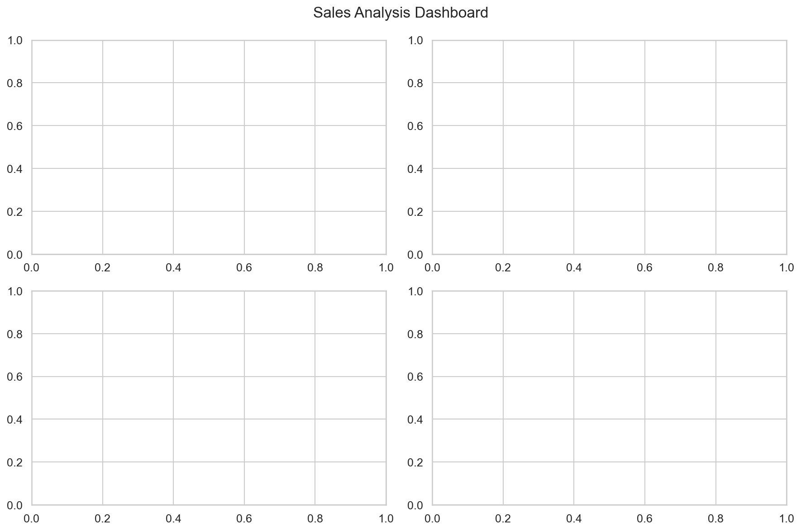
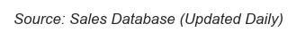

# Data Visualization Best Practices Guide

**After this lesson:** you can explain the core ideas in “Data Visualization Best Practices Guide” and reproduce the examples here in your own notebook or environment.

## Helpful video

Orientation for the course visualization materials.

<iframe width="560" height="315" src="https://www.youtube.com/embed/RBSUwFGa6Fk" title="What is Data Science?" frameborder="0" allow="accelerometer; autoplay; clipboard-write; encrypted-media; gyroscope; picture-in-picture" allowfullscreen></iframe>

## Overview

These practices apply whether you plot in Python or in a BI tool: one clear message per view, audience-appropriate complexity, honest scales, and accessible color and type.

> **Note:** See [Visualization principles](3.1-intro-data-viz/visualization-principles.md) for perception science and [Common mistakes](common-mistakes.md) for before/after patterns.

## Core Principles

### 1. Clarity First

#### Clear Purpose
- Each visualization should answer a specific question
- Focus on one main message
- Remove unnecessary elements
- Guide viewer's attention

#### Example

**Purpose:** Contrast an over-plotted figure with a reduced series count so the viewer can follow one comparison.

**Walkthrough:** Four `plot` calls without hierarchy vs. two labeled series with distinct colors—legend stays readable.

```python
# Bad: Too much information
plt.plot(data1, label='Sales')
plt.plot(data2, label='Revenue')
plt.plot(data3, label='Costs')
plt.plot(data4, label='Profits')

# Good: Focus on key message
plt.plot(data1, label='Sales', color='blue')
plt.plot(data4, label='Profits', color='green')
```

### 2. Know Your Audience

#### Audience Considerations
- Technical expertise
- Domain knowledge
- Time constraints
- Decision needs

#### Example Adaptations

**Purpose:** Show how axis titles and units shift between technical and general audiences for the same chart family.

**Walkthrough:** Line plot emphasizes rates and quarter labels; bar chart keeps language outcome-focused with dollars on the axis.

```python
# Technical Audience
plt.plot(data, label='Revenue Growth')
plt.title('Revenue Growth Rate (YoY)')
plt.xlabel('Time (Quarters)')
plt.ylabel('Growth Rate (%)')

# General Audience
plt.bar(categories, values)
plt.title('Sales Performance')
plt.ylabel('Sales ($M)')
```

### 3. Choose the Right Chart

#### Data Type Considerations
- Temporal: Line charts, area charts
- Categorical: Bar charts, pie charts
- Numerical: Histograms, box plots
- Relational: Scatter plots, bubble charts

#### Examples for Different Data Types

**Purpose:** Map four common data–task pairings to the minimal Matplotlib calls: trend, category compare, distribution, relationship.

**Walkthrough:** `plot`, `bar`, `hist`, `scatter`—each encodes a different visual question; swap in your real `dates`, `categories`, `x`, `y`.

```python
# Time Series
plt.plot(dates, values)

# Categories
plt.bar(categories, values)

# Distribution
plt.hist(values, bins=30)

# Correlation
plt.scatter(x, y)
```

## Design Principles

### 1. Color Usage

#### Color Purpose
- Highlight important data
- Show categories
- Represent values
- Create hierarchy

#### Color Best Practices

**Purpose:** Avoid assigning random per-point colors and instead map values to a single sequential colormap.

**Walkthrough:** `sns.color_palette` builds discrete blues; `as_cmap=True` feeds `scatter(..., c=values, cmap=...)`.

```python
# Bad: Rainbow colors
plt.scatter(x, y, c=np.random.rand(100))

# Good: Sequential palette
import seaborn as sns
palette = sns.color_palette("Blues", n_colors=5)
plt.scatter(x, y, c=values, cmap=sns.color_palette("Blues", as_cmap=True))
```

### 2. Typography

#### Text Hierarchy
- Clear titles
- Readable labels
- Appropriate font sizes
- Consistent styling

#### Example

**Purpose:** Set title, axis labels, and tick label sizes in one place so hierarchy (title > axis > ticks) stays consistent.

**Walkthrough:** `fontsize`/`pad` on title; `tick_params` scales tick numbers without touching each tick manually.

```python
plt.figure(figsize=(10, 6))
plt.plot(data)
plt.title('Revenue Growth', fontsize=16, pad=20)
plt.xlabel('Time Period', fontsize=12)
plt.ylabel('Revenue ($M)', fontsize=12)
plt.tick_params(labelsize=10)
```

### 3. Layout

#### Space Usage
- Maintain white space
- Align elements
- Group related items
- Use consistent spacing

#### Example

**Purpose:** Lay out four related panels in a 2×2 grid with a shared dashboard title and tightened margins.

**Walkthrough:** `plt.subplots` returns axes array; `suptitle` is figure-level; `tight_layout` reserves space for the title via `rect`.

```python
# Create grid layout
fig, ((ax1, ax2), (ax3, ax4)) = plt.subplots(2, 2, figsize=(12, 8))
fig.suptitle('Sales Analysis Dashboard', fontsize=16)
plt.tight_layout(rect=[0, 0.03, 1, 0.95])
```


<figure>

<figcaption>Figure 1: Generated visualization</figcaption>
</figure>


<figure>

<figcaption>Figure 2: Sales Analysis Dashboard</figcaption>
</figure>


## Interactive Features

### 1. Tooltips

#### Content Guidelines
- Show relevant details
- Use clear formatting
- Maintain consistency
- Avoid clutter

#### Example (Plotly)

**Purpose:** Enrich hover with extra columns and a stable row identifier without cluttering the markers.

**Walkthrough:** Plotly Express `hover_data` selects fields; `hover_name` sets the primary label in the tooltip.

```python
import plotly.express as px

fig = px.scatter(data, x='x', y='y',
                hover_data=['category', 'value'],
                hover_name='name',
                title='Sales by Region')
```

### 2. Filters

#### Implementation
- Clear controls
- Instant feedback
- Multiple options
- Reset capability

#### Example (Plotly)

**Purpose:** Let viewers scrub time (`animation_frame`) while keeping axes ranges fixed so comparisons stay stable.

**Walkthrough:** `color` splits series; `range_x`/`range_y` lock scales across frames.

```python
fig = px.scatter(data, x='x', y='y',
                color='category',
                animation_frame='year',
                range_x=[0, 100],
                range_y=[0, 100])
```

## Performance Optimization

### 1. Data Preparation

#### Best Practices
- Aggregate when possible
- Remove unnecessary data
- Use appropriate data types
- Cache results

#### Example

**Purpose:** Replace millions of scatter points with a 2D density grid when overplotting hides structure.

**Walkthrough:** `histogram2d` counts per cell; `pcolormesh` renders the grid—legible at a glance for dense data.

```python
# Bad: Plot all points
plt.scatter(large_dataset_x, large_dataset_y)

# Good: Aggregate or sample
bins = np.histogram2d(large_dataset_x, large_dataset_y, bins=50)
plt.pcolormesh(bins[1], bins[2], bins[0].T)
```

### 2. Rendering Optimization

#### Techniques
- Use appropriate formats
- Optimize resolution
- Minimize elements
- Consider file size

#### Example

**Purpose:** Choose DPI and format by medium: lower resolution and raster for web, vector or high-DPI raster for print.

**Walkthrough:** `dpi` sets pixels per inch; PDF stays scalable; `optimize` applies to PNG writers that support it.

```python
# Export for web
plt.savefig('plot.png', dpi=72, optimize=True)

# Export for print
plt.savefig('plot.pdf', dpi=300)
```

## Accessibility

### 1. Color Blindness

#### Considerations
- Use colorblind-friendly palettes
- Include patterns/shapes
- Maintain contrast
- Test with simulators

#### Example

**Purpose:** Distinguish series by both color and marker/line style so lines remain separable in grayscale or for color-vision deficiency.

**Walkthrough:** `sns.color_palette("colorblind")` returns a safe set; linestyle and marker add redundant encoding.

```python
# Use colorblind-friendly palette
plt.style.use('seaborn-v0_8-whitegrid')
colors = sns.color_palette("colorblind")
plt.plot(data1, color=colors[0], linestyle='-', marker='o')
plt.plot(data2, color=colors[1], linestyle='--', marker='s')
```

### 2. Text Readability

#### Guidelines
- Sufficient font size
- High contrast
- Clear hierarchy
- Alternative text

#### Example

**Purpose:** Keep title and axis text large enough and high-contrast for projection or small screens.

**Walkthrough:** Explicit `fontsize` on title and labels; black title on default white figure is a simple contrast baseline.

```python
plt.figure(figsize=(10, 6))
plt.plot(data)
plt.title('Sales Growth', fontsize=16, color='black')
plt.xlabel('Month', fontsize=12)
plt.ylabel('Sales ($)', fontsize=12)
```

## Documentation

### 1. Code Comments

#### Best Practices
- Explain complex logic
- Document assumptions
- Note data sources
- Include references

#### Example

**Purpose:** Document smoothing logic inline so readers know why a second line diverges from raw data.

**Walkthrough:** `rolling` + `mean` on a pandas-like series; two `plot` calls with `alpha` and `label` separate raw vs smoothed.

```python
# Calculate moving average for smoothing
window = 7  # 7-day window for weekly patterns
smoothed_data = data.rolling(window=window, center=True).mean()

# Plot original and smoothed data
plt.plot(data, alpha=0.3, label='Original')
plt.plot(smoothed_data, label='7-day Average')
```

### 2. Visualization Documentation

#### Elements to Include
- Data sources
- Processing steps
- Calculation methods
- Update frequency

#### Example

**Purpose:** Tie the figure to a documented data lineage and refresh cadence in the margin.

**Walkthrough:** Same `figtext` pattern as the beginner guide; `style='italic'` differentiates source from axis titles.

```python
# Add source annotation
plt.figtext(0.99, 0.01, 'Source: Sales Database (Updated Daily)',
            ha='right', va='bottom', fontsize=8, style='italic')
```


<figure>

<figcaption>Figure 3: Generated visualization</figcaption>
</figure>


<figure>

<figcaption>Figure 4: Generated visualization</figcaption>
</figure>

```
Text(0.99, 0.01, 'Source: Sales Database (Updated Daily)')
```


**Captured output (notebook):** Jupyter may display the `Text` object returned by `figtext`; the caption still renders on the figure.

## Quality Assurance

### 1. Testing

#### Check Points
- Data accuracy
- Visual accuracy
- Performance
- Accessibility

#### Example

**Purpose:** Guardrail plotted data with assertions and catch rendering failures before publishing.

**Walkthrough:** Assertions enforce domain rules; try/except around `savefig` isolates backend/export issues from data bugs.

```python
# Verify data ranges
assert data.min() >= 0, "Negative values found"
assert data.max() <= 100, "Values exceed maximum"

# Test plot generation
try:
    plt.plot(data)
    plt.savefig('test.png')
except Exception as e:
    print(f"Plot generation failed: {e}")
```

### 2. Review Process

#### Steps
- Peer review
- User testing
- Performance testing
- Documentation review

#### Checklist
1. Data accuracy verified
2. Visualization clarity checked
3. Performance tested
4. Accessibility confirmed
5. Documentation complete

## Gotchas

- **`plt.tight_layout(rect=[0, 0.03, 1, 0.95])` must be called after all subplot content is added** — calling it before `plt.plot` or `ax.set_title` means the layout engine does not know about those elements yet and cannot account for their size; always call it last, after all drawing and labeling is complete.
- **`sns.color_palette("Blues", as_cmap=True)` and `sns.color_palette("Blues", n_colors=5)` return different objects** — the first returns a `LinearSegmentedColormap` for continuous data (use as `cmap=`); the second returns a list of RGB tuples for discrete categories; confusing them causes either a `TypeError` or a flat single-color plot.
- **`data.rolling(window=7).mean()` produces NaN for the first 6 rows** — the rolling average only has enough data starting at position 7; plotting both the raw and smoothed series will show a gap at the beginning of the smoothed line unless you set `min_periods=1` or trim the raw data to the same range.
- **`assert data.min() >= 0` raises an `AssertionError` but does not tell you which rows are invalid** — in a production chart pipeline, a failing assertion will abort the notebook without printing the offending values; use `data[data < 0]` to inspect violations before asserting, or replace the assertion with a logged warning.
- **`plt.savefig('plot.png', dpi=72, optimize=True)` — the `optimize` parameter is silently ignored by most Matplotlib backends** — it is a hint for image compression libraries; DPI is the reliable lever for file size on raster exports.
- **Dual y-axes created with `twinx()` share the x-axis tick positions but draw two independent y-scales** — the visual alignment of the two lines will depend entirely on your axis limits, making it easy to imply a correlation or ratio that is purely an artifact of scaling; always label both y-axes clearly and consider whether two separate charts would be less misleading.

## Next steps

- Deepen design intuition in [Visualization principles](3.1-intro-data-viz/visualization-principles.md).
- Compare your habits against [Common mistakes](common-mistakes.md) before publishing or presenting.
