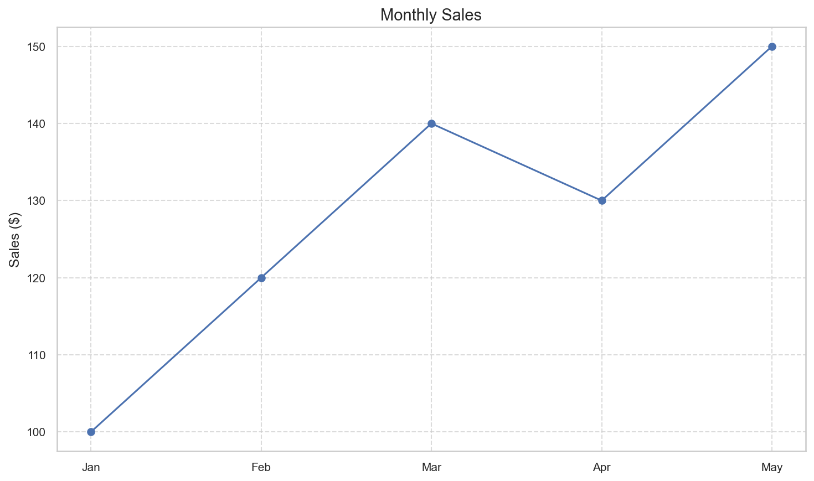
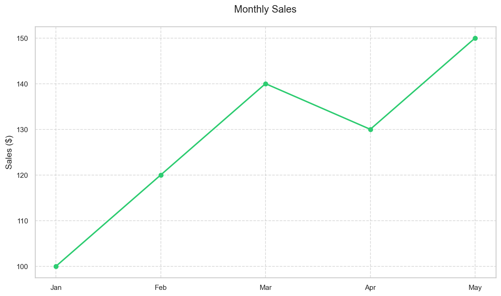
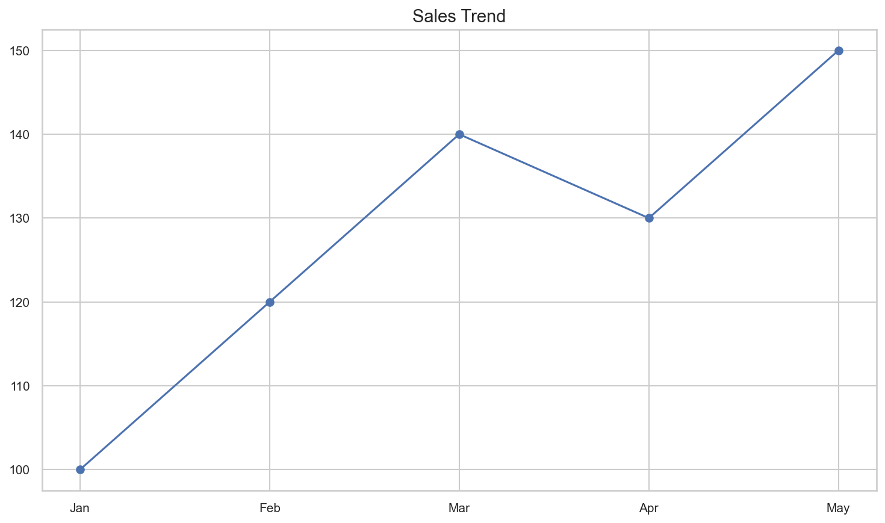
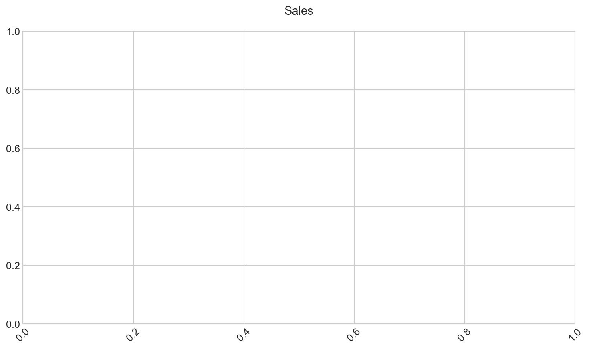
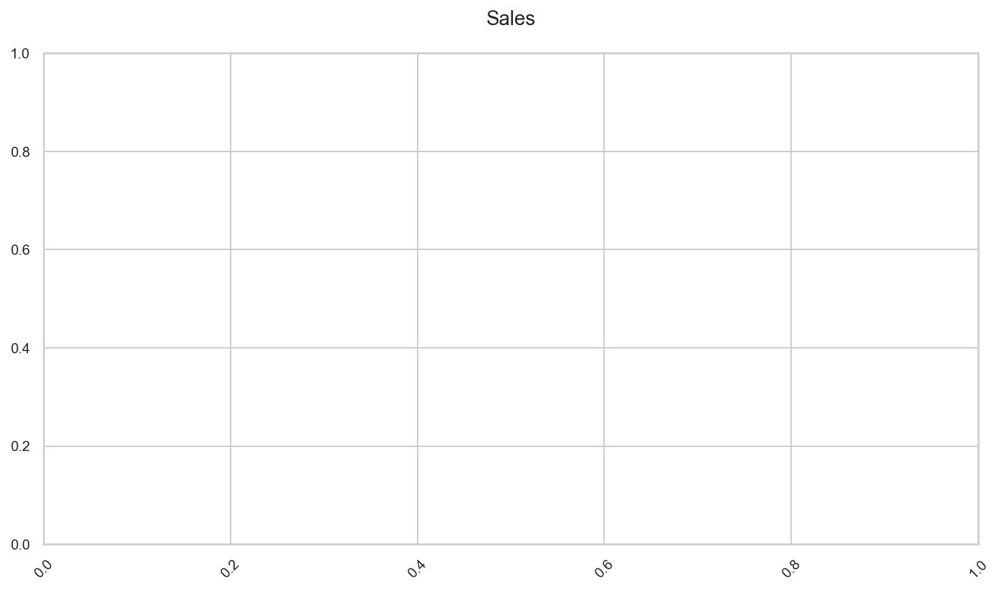

# Data Visualization Quick Start Guide

**After this lesson:** you can explain the core ideas in “Data Visualization Quick Start Guide” and reproduce the examples here in your own notebook or environment.

## Helpful video

Orientation for the course visualization materials.

<iframe width="560" height="315" src="https://www.youtube.com/embed/RBSUwFGa6Fk" title="What is Data Science?" frameborder="0" allow="accelerometer; autoplay; clipboard-write; encrypted-media; gyroscope; picture-in-picture" allowfullscreen></iframe>

## What you'll learn

In this quick start guide, you'll learn how to:

1. Create your first visualization
2. Choose the right chart type
3. Make your visualizations look professional

## Prerequisites

- Python with **matplotlib** and **numpy** installed (see [0-prep](../0-prep/README.md) if you need an environment refresher).
- A notebook or `.py` file where you can run the snippets.

> **Time needed:** About **15–30 minutes** for a first pass, longer if you experiment with variants.

## Your first visualization in about five minutes

### Step 1: Set Up Your Environment

**Purpose:** Import the plotting libraries and define shared month labels and sales values used by the rest of this page.

**Walkthrough:** Lists drive categorical x-positions for `plt.plot`; no pandas required for this minimal example.

```python
# Import the libraries we need
import matplotlib.pyplot as plt
import numpy as np

# Create some simple data
months = ['Jan', 'Feb', 'Mar', 'Apr', 'May']
sales = [100, 120, 140, 130, 150]
```

### Step 2: Create a Simple Line Chart

**Purpose:** Draw a first line chart with title, y-label, grid, and markers so the trend is readable at a glance.

**Walkthrough:** `figure` sets canvas size; `plot` connects `(months, sales)`; `grid` adds reference lines without extra packages.

```python
# Create the chart
plt.figure(figsize=(10, 6))  # Set the size
plt.plot(months, sales, marker='o')  # Plot with dots at each point
plt.title('Monthly Sales')  # Add a title
plt.ylabel('Sales ($)')  # Label the y-axis
plt.grid(True, linestyle='--', alpha=0.7)  # Add a grid
plt.show()  # Display the chart
```




### Step 3: Make it Look Better

**Purpose:** See how color, line width, and title typography change the same data without changing the numbers.

**Walkthrough:** Hex color `#2ecc71` and `linewidth=2` emphasize the series; `fontsize`/`pad` adjust hierarchy.

```python
# Create a more professional chart
plt.figure(figsize=(10, 6))
plt.plot(months, sales, marker='o', color='#2ecc71', linewidth=2)
plt.title('Monthly Sales', fontsize=14, pad=20)
plt.ylabel('Sales ($)', fontsize=12)
plt.grid(True, linestyle='--', alpha=0.7)
plt.show()
```




## Three Most Common Chart Types

### 1. Line Chart

**Best for:** Showing trends over time

**Purpose:** Reuse `months` and `sales` in a minimal trend chart for comparison with bar and pie variants below.

**Walkthrough:** Same `plot` call as Step 2 but stripped to essentials—good for copying into your own notebook.

```python
# Line chart example
plt.figure(figsize=(10, 6))
plt.plot(months, sales, marker='o')
plt.title('Sales Trend')
plt.show()
```




### 2. Bar Chart

**Best for:** Comparing categories

**Purpose:** Encode the same values as bar heights—better than lines when categories are not ordered time.

**Walkthrough:** `plt.bar` maps each month to a rectangle; axis defaults treat `months` as categorical positions.

```python
# Bar chart example
plt.figure(figsize=(10, 6))
plt.bar(months, sales)
plt.title('Sales by Month')
plt.show()
```


### 3. Pie Chart

**Best for:** Showing parts of a whole

**Purpose:** Show each month’s share of total sales—use only when “part of a whole” is the actual question.

**Walkthrough:** `autopct` formats wedge labels; `labels` ties slices back to month names.

```python
# Pie chart example
plt.figure(figsize=(10, 6))
plt.pie(sales, labels=months, autopct='%1.1f%%')
plt.title('Sales Distribution')
plt.show()
```




## Quick Tips for Better Charts

### 1. Keep it Simple

- One message per chart
- Remove unnecessary elements
- Use clear labels

### 2. Choose Colors Wisely

- Use consistent colors
- Avoid too many colors
- Consider colorblind viewers

### 3. Label Everything

- Add a clear title
- Label your axes
- Include units

## Simple Checklist for Every Chart

Before sharing your visualization, check:

- [ ] Does it have a clear title?
- [ ] Are all axes labeled?
- [ ] Is the font size readable?
- [ ] Are the colors appropriate?
- [ ] Is the message clear?

## Next steps

Once you are comfortable with basic charts:

1. Read [Visualization principles](3.1-intro-data-viz/visualization-principles.md) and [Matplotlib basics](3.1-intro-data-viz/matplotlib-basics.md).
2. Try [Choosing the right visualization](choosing-the-right-visualization.md).
3. Continue to [3.2 Advanced data visualization](3.2-adv-data-viz/README.md) for Seaborn and Plotly.

## Common Problems and Solutions

### Problem: Chart Too Cluttered

**Solution:**

**Purpose:** Compare an overcrowded multi-series line chart with a reduced chart that highlights one series and a legend.

**Walkthrough:** Multiple `plot` calls stack on the same axes; trimming series and adding `label`/`legend` clarifies the message.

```python
# Before: Too much data
plt.plot(data1, data2, data3, data4)

# After: Focus on key data
plt.plot(data1, label='Key Metric')
plt.legend()
```

### Problem: Unreadable Labels

**Solution:**

**Purpose:** Fix cramped or overlapping text by enlarging the title and rotating tick labels.

**Walkthrough:** `fontsize`/`pad` on `title`; `xticks(rotation=45)` rotates category labels on dense axes.

```python
# Before: Default size
plt.title('Sales')

# After: Larger, clearer text
plt.title('Sales', fontsize=14, pad=20)
plt.xticks(rotation=45)  # Rotate labels if needed
```




**Captured output (notebook):** The cell above may print the return value of `plt.xticks(rotation=45)`—a tuple of tick locations and label objects. That repr is normal; the figure shows the rotated labels.

### Problem: Poor Color Choice

**Solution:**

**Purpose:** Swap default colors for a single explicit hue and transparency so the line stays legible on white backgrounds.

**Walkthrough:** `color` takes a hex string; `alpha` softens saturation when overlaying other elements.

```python
# Before: Default colors
plt.plot(data)

# After: Professional color scheme
plt.plot(data, color='#2ecc71', alpha=0.7)
```

## Practice Exercises

**Note:** These are offline prompts—complete them in your own environment; there is no autograder in this repo.

1. **Basic Line Chart**
   Create a line chart showing temperature over a week

2. **Simple Bar Chart**
   Make a bar chart comparing your favorite fruits

3. **Basic Pie Chart**
   Show how you spend your time in a day

## Resources for Learning More

1. **Official Documentation**
   - Matplotlib Tutorial
   - Seaborn Gallery
   - Plotly Examples

2. **Practice Datasets**
   - Weather data
   - Sales figures
   - Population statistics

3. **Online Tools**
   - Google Colab
   - Jupyter Notebooks
   - Observable

Remember: The best way to learn is by doing. Start with simple charts and gradually add more features as you become comfortable!
