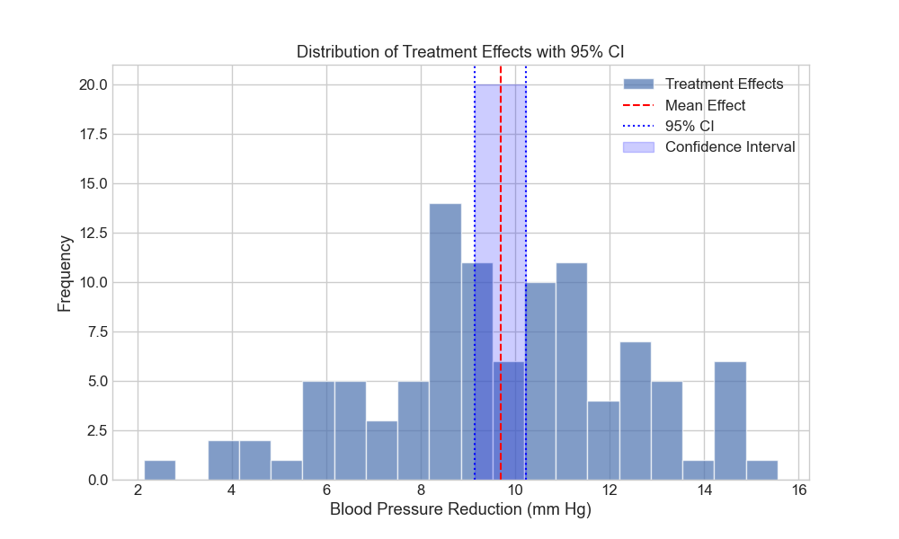
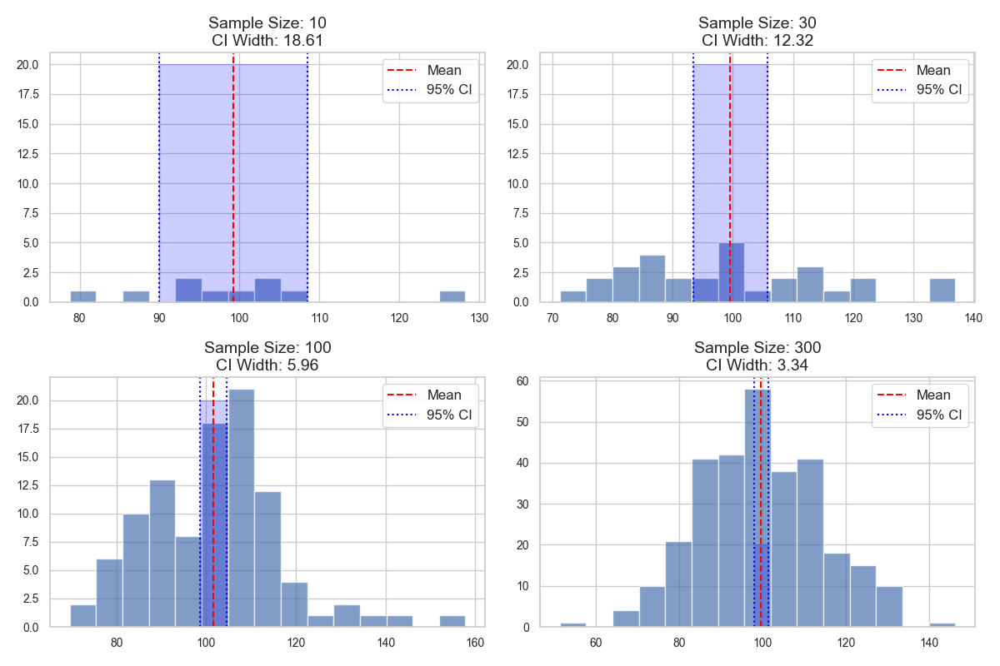
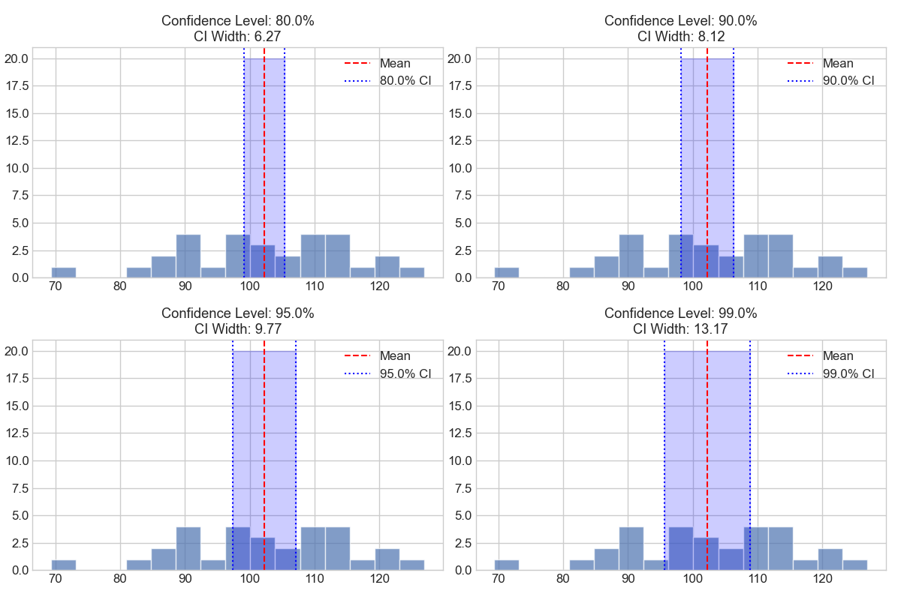
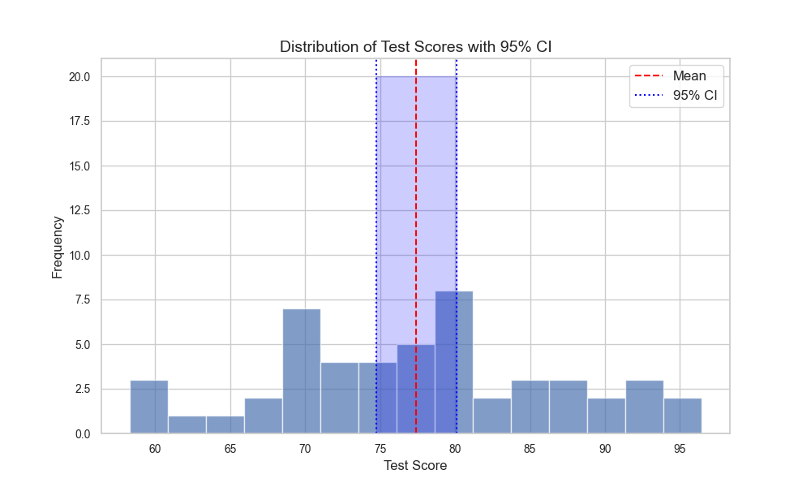
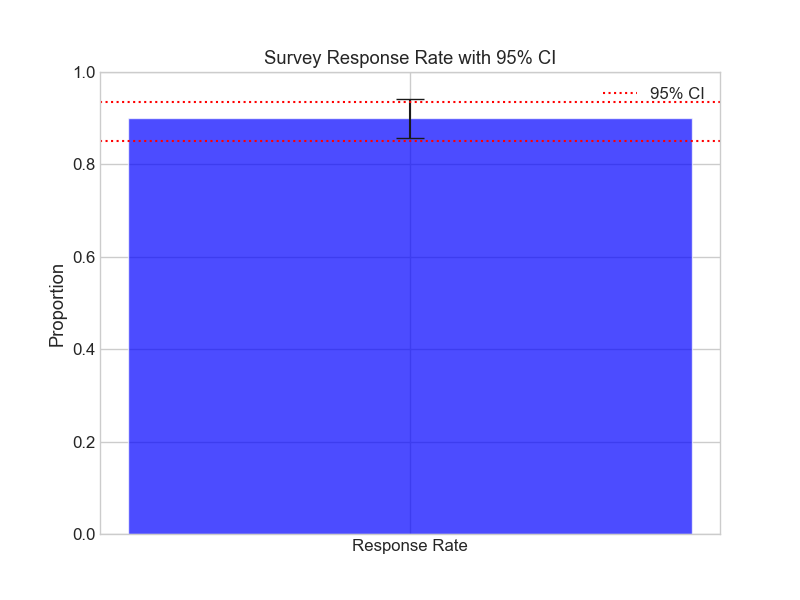
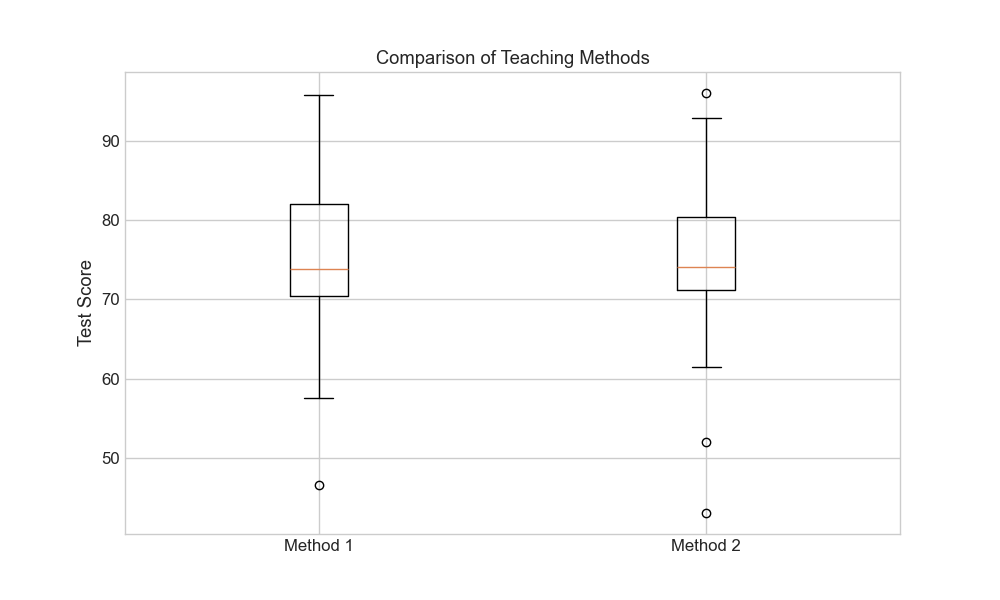

# Confidence Intervals: Quantifying Uncertainty in Statistics

**After this lesson:** you can explain the core ideas in “Confidence Intervals: Quantifying Uncertainty in Statistics” and reproduce the examples here in your own notebook or environment.

## Overview

A **point estimate** (for example, a sample mean) is one number. A **confidence interval** adds a range: plausible values for an unknown population quantity, tied to a stated procedure and confidence level. This lesson builds on [population vs sample](./population-sample.md) and [sampling distributions](./sampling-distributions.md)—the standard error \\(\sigma/\sqrt{n}\\) you met there is what makes the margin of error shrink as \\(n\\) grows.

## Why this matters

Reporting only \\(\bar x\\) hides how noisy the estimate might be. Intervals show **precision** as well as location. You will:

- Report **ranges** for unknown parameters, not only point estimates.
- Interpret intervals in plain language without overstating what “95% confidence” means.

## Prerequisites

- [Population vs sample](./population-sample.md) and [sampling distributions](./sampling-distributions.md) (especially the Central Limit Theorem and standard error).
- Comfort with the sample mean and a measure of spread (standard deviation or standard error in words).
- [P-values](./p-values.md) and formal hypothesis tests appear later in this submodule and in [module 4.2](../4.2-hypotheses-testing/README.md); you do not need them to follow the interval formulas here.

> **Tip:** Read the clinical-trial style example even if you skip plotting code on first pass. Re-read [sampling distributions](./sampling-distributions.md) if the \\(\sigma/\sqrt{n}\\) factor in the margin of error feels unmotivated.

## Introduction: Why Do We Need Confidence Intervals?

Imagine you're a weather forecaster trying to predict tomorrow's temperature. Instead of saying "it will be exactly 75°F," it's more realistic to say "it will be between 73°F and 77°F." That's the essence of confidence intervals - they help us express uncertainty in our estimates!

### Video Tutorial: Confidence Intervals Explained

<div class="video-embed">
<iframe width="560" height="315" src="https://www.youtube.com/embed/TqOeMYtOc1w" frameborder="0" allow="accelerometer; autoplay; clipboard-write; encrypted-media; gyroscope; picture-in-picture" allowfullscreen></iframe>
</div>

*StatQuest: Confidence Intervals, Clearly Explained!!! by Josh Starmer*


*Figure 1: The point estimate (red line) is surrounded by a range (blue shaded area) that likely contains the true parameter value.*

## What is a Confidence Interval?

A confidence interval is a range of values that likely contains the true population parameter, along with a measure of how confident we are in this range. Think of it as a "margin of error" around our best guess.

### The Mathematical Formula

For a mean with normal distribution:

$$CI = \bar{x} \pm \left(t_{\alpha/2} \times \frac{s}{\sqrt{n}}\right)$$

where:

- \\(\bar x\\) is the sample mean
- \\(t_{\alpha/2}\\) is the t-value for the desired confidence level (with \\(n-1\\) degrees of freedom)
- \\(s\\) is the sample standard deviation
- \\(n\\) is the sample size

#### Why t and not z?

The choice between the two reduces to a single question: **do you know the population standard deviation \\(\sigma\\)?**

- **Almost never.** Use the t-distribution and the formula above with sample SD \\(s\\) and \\(n-1\\) degrees of freedom. Every example in this lesson is the t-case.
- **You actually know \\(\sigma\\)** (rare, mostly textbook problems and a few process-control settings). Use the z-distribution and replace \\(t_{\alpha/2}\\) with \\(z_{\alpha/2}\\).

The t and z critical values converge as \\(n\\) grows; for \\(n \geq 100\\) the difference is small. For \\(n \approx 10\\) it is meaningful—using \\(z\\) when you should use \\(t\\) produces an interval that is too narrow and a coverage rate below the advertised confidence level.

## Components of a Confidence Interval

### 1. Point Estimate (Center)

- Our best single guess at the parameter
- Usually the sample statistic (mean, proportion, etc.)

### 2. Margin of Error (Width)

- Measures the precision of our estimate
- Affected by:
  - Sample size
  - Confidence level
  - Population variability

### 3. Confidence Level

- Usually 95% or 99%
- Higher confidence = wider interval
- Trade-off between confidence and precision

## Real-world Example: Clinical Trial

**t-based CI for one-sample mean effect**

**Purpose:** Walk through the textbook recipe—sample mean, sample SD with `ddof=1`, `t.ppf` critical value, margin \\(t \cdot s/\sqrt{n}\\)—and plot the interval on the effect histogram.

**Walkthrough:** `confidence = 0.95` implies two-sided \\(\alpha/2\\); vertical lines mark \\(\bar x\\) and endpoints; prose printout restates the frequentist CI wording used in reports.

<div class="code-explainer" data-code-explainer>
<div class="code-explainer__code">


import numpy as np
from scipy import stats
import matplotlib.pyplot as plt

# Simulate blood pressure reduction data
np.random.seed(42)

def analyze_clinical_trial():
    # Simulate blood pressure reduction in mm Hg
    treatment_effect = np.random.normal(loc=10, scale=3, size=100)

    # Calculate statistics
    mean_effect = np.mean(treatment_effect)
    std_effect = np.std(treatment_effect, ddof=1)

    # Calculate 95% CI
    confidence = 0.95
    df = len(treatment_effect) - 1
    # (1 + confidence) / 2 = 0.975: two-sided, so we want the upper tail at α/2.
    t_value = stats.t.ppf((1 + confidence) / 2, df)
    margin_error = t_value * (std_effect / np.sqrt(len(treatment_effect)))

    ci_lower = mean_effect - margin_error
    ci_upper = mean_effect + margin_error

    # Visualize the results
    plt.figure(figsize=(10, 6))
    plt.hist(treatment_effect, bins=20, alpha=0.7, label='Treatment Effects')
    plt.axvline(mean_effect, color='red', linestyle='--', label='Mean Effect')
    plt.axvline(ci_lower, color='blue', linestyle=':', label='95% CI')
    plt.axvline(ci_upper, color='blue', linestyle=':')
    plt.fill_between([ci_lower, ci_upper], [0, 0], [20, 20],
                     color='blue', alpha=0.2, label='Confidence Interval')
    plt.xlabel('Blood Pressure Reduction (mm Hg)')
    plt.ylabel('Frequency')
    plt.title('Distribution of Treatment Effects with 95% CI')
    plt.legend()
    plt.savefig('assets/treatment_effects_ci.png')
    plt.close()

    print("Clinical Trial Analysis")
    print(f"Average BP Reduction: {mean_effect:.1f} mm Hg")
    print(f"95% CI: ({ci_lower:.1f}, {ci_upper:.1f}) mm Hg")
    print(f"Interpretation: 95% of intervals built this way capture")
    print(f"the true average BP reduction; this one is ({ci_lower:.1f}, {ci_upper:.1f}) mm Hg")

analyze_clinical_trial()

```
Clinical Trial Analysis
Average BP Reduction: 9.7 mm Hg
95% CI: (9.1, 10.2) mm Hg
Interpretation: 95% of intervals built this way capture
the true average BP reduction; this one is (9.1, 10.2) mm Hg
```


</div>
<aside class="code-explainer__callouts" aria-label="Code walkthrough">
  <div class="code-callout" data-lines="11" data-tint="1">
    <div class="code-callout__meta">
      <span class="code-callout__lines"></span>
      <span class="code-callout__title">Simulate trial data</span>
    </div>
    <div class="code-callout__body">
      <p>Generate 100 blood-pressure-reduction values from a normal distribution centred at 10 mmHg.</p>
    </div>
  </div>
  <div class="code-callout" data-lines="20-22" data-tint="2">
    <div class="code-callout__meta">
      <span class="code-callout__lines"></span>
      <span class="code-callout__title">t critical value and margin</span>
    </div>
    <div class="code-callout__body">
      <p>Look up the t critical at n−1 degrees of freedom, multiply by s/√n to get the margin of error.</p>
    </div>
  </div>
  <div class="code-callout" data-lines="24-25" data-tint="3">
    <div class="code-callout__meta">
      <span class="code-callout__lines"></span>
      <span class="code-callout__title">Build the interval</span>
    </div>
    <div class="code-callout__body">
      <p>Lower and upper bounds are the sample mean ± margin of error.</p>
    </div>
  </div>
</aside>
</div>

```
Clinical Trial Analysis
Average BP Reduction: 9.7 mm Hg
95% CI: (9.1, 10.2) mm Hg
Interpretation: 95% of intervals built this way capture
the true average BP reduction; this one is (9.1, 10.2) mm Hg
```

*Note: The visualization shows the distribution of treatment effects with the mean (red dashed line) and 95% confidence interval (blue shaded area). This helps us understand both the central tendency and the uncertainty in our estimate.*


*Figure 5: Distribution of treatment effects with mean and 95% confidence interval.*

## Common Misconceptions: What CIs Are NOT

### NOT the Range of the Data

The CI is about the population parameter, not individual values.

### NOT the Probability of Containing the Parameter

A specific interval either contains the parameter or doesn't.

### NOT All Equally Likely Within the Interval

The point estimate is our best guess.

### A note for the curious: Bayesian credible intervals

If you have ever felt uneasy about the rule "you can't say 'there's a 95% chance the true value is in (a, b)' for a frequentist CI," you're not crazy — that's exactly the statement people *want* to make, and there is a different framework where it is correct.

In **Bayesian** statistics, you start with a **prior** belief about the parameter and update it with the data to get a **posterior** distribution. A **95% credible interval** is then the range that contains 95% of the posterior probability. For a credible interval, the statement "there's a 95% probability the true value is in this range" **is** valid — because in Bayesian thinking, the parameter is treated as random (reflecting our uncertainty), not fixed.

| | Frequentist 95% CI | Bayesian 95% credible interval |
|---|---|---|
| What's random | The interval (parameter is fixed) | The parameter (interval is fixed) |
| Needs a prior? | No | Yes |
| Plain reading | "95% of intervals built this way contain the true value" | "Given my data and prior, there's a 95% probability the true value is in here" |
| When they agree | Often, when priors are weak and \\(n\\) is large | — |

For the rest of this submodule, every interval is frequentist (the standard in textbooks, software defaults, and regulatory work). But knowing the Bayesian alternative exists prevents a lot of low-grade confusion when learners read "the parameter is in this range with 95% probability" in a real paper — *that paper might be using a credible interval, and it's correct for them to say so.*

## Factors Affecting CI Width

### 1. Sample Size Effect

**Grid of CIs: width shrinks with n**

**Purpose:** Show the same 95% t-interval machinery (`stats.t.interval` with `loc` and `scale=sem`) across increasing `n`, plus a toy “precision stars” printout scaling inversely with width.

**Walkthrough:** Fresh `np.random.normal` per panel (no fixed seed—widths vary run-to-run); `ci[1]-ci[0]` titles each subplot; second loop repeats draws for console output.

<div class="code-explainer" data-code-explainer>
<div class="code-explainer__code">


def demonstrate_sample_size_effect():
    population_mean = 100
    population_std = 15
    sizes = [10, 30, 100, 300]

    # Visualize the effect of sample size
    plt.figure(figsize=(12, 8))
    for i, n in enumerate(sizes):
        plt.subplot(2, 2, i+1)
        sample = np.random.normal(population_mean, population_std, n)
        ci = stats.t.interval(0.95, len(sample)-1,
                            loc=np.mean(sample),
                            scale=stats.sem(sample))

        plt.hist(sample, bins=15, alpha=0.7)
        plt.axvline(np.mean(sample), color='red', linestyle='--', label='Mean')
        plt.axvline(ci[0], color='blue', linestyle=':', label='95% CI')
        plt.axvline(ci[1], color='blue', linestyle=':')
        plt.fill_between([ci[0], ci[1]], [0, 0], [20, 20],
                        color='blue', alpha=0.2)
        plt.title(f'Sample Size: {n}\nCI Width: {ci[1]-ci[0]:.2f}')
        plt.legend()

    plt.tight_layout()
    plt.savefig('assets/sample_size_effect_ci.png')
    plt.close()

    print("\nSample Size Effect on CI Width")
    for n in sizes:
        sample = np.random.normal(population_mean, population_std, n)
        ci = stats.t.interval(0.95, len(sample)-1,
                            loc=np.mean(sample),
                            scale=stats.sem(sample))
        width = ci[1] - ci[0]
        print(f"\nSample size: {n}")
        print(f"CI width: {width:.2f}")
        print(f"Precision: {'*' * int(50/width)}")

demonstrate_sample_size_effect()

```

Sample Size Effect on CI Width

Sample size: 10
CI width: 24.51
Precision: **

Sample size: 30
CI width: 11.55
Precision: ****

Sample size: 100
CI width: 6.36
Precision: *******

Sample size: 300
CI width: 3.25
Precision: ***************
```


</div>
<aside class="code-explainer__callouts" aria-label="Code walkthrough">
  <div class="code-callout" data-lines="1-4" data-tint="1">
    <div class="code-callout__meta">
      <span class="code-callout__lines"></span>
      <span class="code-callout__title">Parameters</span>
    </div>
    <div class="code-callout__body">
      <p>Define population mean, standard deviation, and the four sample sizes to compare.</p>
    </div>
  </div>
  <div class="code-callout" data-lines="6-24" data-tint="2">
    <div class="code-callout__meta">
      <span class="code-callout__lines"></span>
      <span class="code-callout__title">Subplot grid</span>
    </div>
    <div class="code-callout__body">
      <p>For each sample size, draw a random sample, compute the 95% t-interval, and plot a histogram with the CI shaded in each subplot.</p>
    </div>
  </div>
  <div class="code-callout" data-lines="29-39" data-tint="3">
    <div class="code-callout__meta">
      <span class="code-callout__lines"></span>
      <span class="code-callout__title">Console output</span>
    </div>
    <div class="code-callout__body">
      <p>Print the CI width for each n and a visual "precision stars" indicator—more stars means a narrower interval.</p>
    </div>
  </div>
</aside>
</div>

```

Sample Size Effect on CI Width

Sample size: 10
CI width: 24.51
Precision: **

Sample size: 30
CI width: 11.55
Precision: ****

Sample size: 100
CI width: 6.36
Precision: *******

Sample size: 300
CI width: 3.25
Precision: ***************
```

*Note: The visualization shows how confidence intervals become narrower as sample size increases, demonstrating the relationship between sample size and precision.*


*Figure 6: Effect of sample size on confidence interval width.*

#### Interactive: how the CI shrinks with n

Move the slider to change \\(n\\). Left: the histogram of one sample with its 95% CI bounds (blue dotted). Right: the *width* of that CI plotted against \\(n\\) — the curve is the theoretical \\(2 t^* \sigma / \sqrt{n}\\) and the orange dot is the current sample's actual width.

<iframe src="assets/interactive/ci_sample_size_simulation.html" width="100%" height="480" frameborder="0" loading="lazy" title="Interactive CI sample size effect"></iframe>

**Try this:** start at \\(n = 30\\), then jump to \\(n = 500\\). The CI width drops by roughly \\(\sqrt{500/30} \approx 4\\)× — exactly the square-root law in action.

### 2. Confidence Level Effect

**Same data, wider z/t multiplier at higher confidence**

**Purpose:** Freeze one sample of size 30 and overlay intervals for 80/90/95/99% levels to visualize the precision–confidence trade-off.

**Walkthrough:** `stats.t.interval(level, df, loc, scale)` sweeps `level`; each subplot title shows CI width; reliability stars are illustrative only.

<div class="code-explainer" data-code-explainer>
<div class="code-explainer__code">


def demonstrate_confidence_level_effect():
    sample = np.random.normal(100, 15, 30)
    levels = [0.80, 0.90, 0.95, 0.99]

    # Visualize the effect of confidence level
    plt.figure(figsize=(12, 8))
    for i, level in enumerate(levels):
        plt.subplot(2, 2, i+1)
        ci = stats.t.interval(level, len(sample)-1,
                            loc=np.mean(sample),
                            scale=stats.sem(sample))

        plt.hist(sample, bins=15, alpha=0.7)
        plt.axvline(np.mean(sample), color='red', linestyle='--', label='Mean')
        plt.axvline(ci[0], color='blue', linestyle=':', label=f'{level*100}% CI')
        plt.axvline(ci[1], color='blue', linestyle=':')
        plt.fill_between([ci[0], ci[1]], [0, 0], [20, 20],
                        color='blue', alpha=0.2)
        plt.title(f'Confidence Level: {level*100}%\nCI Width: {ci[1]-ci[0]:.2f}')
        plt.legend()

    plt.tight_layout()
    plt.savefig('assets/confidence_level_effect.png')
    plt.close()

    print("\nConfidence Level Effect on CI Width")
    for level in levels:
        ci = stats.t.interval(level, len(sample)-1,
                            loc=np.mean(sample),
                            scale=stats.sem(sample))
        width = ci[1] - ci[0]
        print(f"\n{level*100}% Confidence Level:")
        print(f"CI width: {width:.2f}")
        print(f"Reliability: {'*' * int(level*10)}")

demonstrate_confidence_level_effect()

```

Confidence Level Effect on CI Width

80.0% Confidence Level:
CI width: 6.27
Reliability: ********

90.0% Confidence Level:
CI width: 8.12
Reliability: *********

95.0% Confidence Level:
CI width: 9.77
Reliability: *********

99.0% Confidence Level:
CI width: 13.17
Reliability: *********
```


</div>
<aside class="code-explainer__callouts" aria-label="Code walkthrough">
  <div class="code-callout" data-lines="1-2" data-tint="1">
    <div class="code-callout__meta">
      <span class="code-callout__lines"></span>
      <span class="code-callout__title">Shared sample</span>
    </div>
    <div class="code-callout__body">
      <p>Draw one sample of size 30 and define four confidence levels to compare across subplots.</p>
    </div>
  </div>
  <div class="code-callout" data-lines="4-22" data-tint="2">
    <div class="code-callout__meta">
      <span class="code-callout__lines"></span>
      <span class="code-callout__title">Subplot per level</span>
    </div>
    <div class="code-callout__body">
      <p>For each confidence level, compute the t-interval and overlay the mean, CI bounds, and shaded band on the same histogram.</p>
    </div>
  </div>
  <div class="code-callout" data-lines="27-36" data-tint="3">
    <div class="code-callout__meta">
      <span class="code-callout__lines"></span>
      <span class="code-callout__title">Width printout</span>
    </div>
    <div class="code-callout__body">
      <p>Print each level's CI width; 99% should produce the widest interval, showing the precision-confidence trade-off.</p>
    </div>
  </div>
</aside>
</div>

```

Confidence Level Effect on CI Width

80.0% Confidence Level:
CI width: 6.27
Reliability: ********

90.0% Confidence Level:
CI width: 8.12
Reliability: *********

95.0% Confidence Level:
CI width: 9.77
Reliability: *********

99.0% Confidence Level:
CI width: 13.17
Reliability: *********
```

*Note: The visualization shows how confidence intervals become wider as the confidence level increases, demonstrating the trade-off between confidence and precision.*


*Figure 7: Effect of confidence level on confidence interval width.*

## Different Types of Confidence Intervals

### 1. CI for a Mean (t-interval)

**Wrapper around `stats.t.interval` for arbitrary data**

**Purpose:** Encapsulate mean + SEM → CI in a two-line helper, then plot scores with bounds for a classroom-style “class average” narrative.

**Walkthrough:** `stats.sem` feeds the scale argument; histogram + vertical lines duplicate earlier lesson visuals with new variable names.

<div class="code-explainer" data-code-explainer>
<div class="code-explainer__code">


def mean_ci(data, confidence=0.95):
    """Calculate CI for a mean using t-distribution"""
    mean = np.mean(data)
    sem = stats.sem(data)
    ci = stats.t.interval(confidence, len(data)-1, mean, sem)
    return ci, mean

# Example: Student test scores
scores = np.random.normal(75, 10, 50)
ci, mean = mean_ci(scores)

# Visualize the results
plt.figure(figsize=(10, 6))
plt.hist(scores, bins=15, alpha=0.7)
plt.axvline(mean, color='red', linestyle='--', label='Mean')
plt.axvline(ci[0], color='blue', linestyle=':', label='95% CI')
plt.axvline(ci[1], color='blue', linestyle=':')
plt.fill_between([ci[0], ci[1]], [0, 0], [20, 20],
                 color='blue', alpha=0.2)
plt.xlabel('Test Score')
plt.ylabel('Frequency')
plt.title('Distribution of Test Scores with 95% CI')
plt.legend()
plt.savefig('assets/test_scores_ci.png')
plt.close()

print(f"\nTest Score Analysis")
print(f"Mean score: {mean:.1f}")
print(f"95% CI: ({ci[0]:.1f}, {ci[1]:.1f})")

```

Test Score Analysis
Mean score: 77.4
95% CI: (74.7, 80.1)
```


</div>
<aside class="code-explainer__callouts" aria-label="Code walkthrough">
  <div class="code-callout" data-lines="1-6" data-tint="1">
    <div class="code-callout__meta">
      <span class="code-callout__lines"></span>
      <span class="code-callout__title">Helper function</span>
    </div>
    <div class="code-callout__body">
      <p>Encapsulate mean, SEM, and <code>stats.t.interval</code> in a two-line helper that returns the CI tuple and the sample mean.</p>
    </div>
  </div>
  <div class="code-callout" data-lines="8-10" data-tint="2">
    <div class="code-callout__meta">
      <span class="code-callout__lines"></span>
      <span class="code-callout__title">Generate scores</span>
    </div>
    <div class="code-callout__body">
      <p>Simulate 50 student test scores from a normal distribution and compute the 95% CI using the helper.</p>
    </div>
  </div>
  <div class="code-callout" data-lines="12-25" data-tint="3">
    <div class="code-callout__meta">
      <span class="code-callout__lines"></span>
      <span class="code-callout__title">Plot histogram</span>
    </div>
    <div class="code-callout__body">
      <p>Plot the score histogram with the mean line and a blue shaded band for the confidence interval bounds.</p>
    </div>
  </div>
  <div class="code-callout" data-lines="27-29" data-tint="4">
    <div class="code-callout__meta">
      <span class="code-callout__lines"></span>
      <span class="code-callout__title">Print results</span>
    </div>
    <div class="code-callout__body">
      <p>Report the mean score and the interval endpoints for quick interpretation.</p>
    </div>
  </div>
</aside>
</div>

```

Test Score Analysis
Mean score: 77.4
95% CI: (74.7, 80.1)
```

*Note: The visualization shows the distribution of test scores with the mean and 95% confidence interval. This helps us understand both the average performance and the uncertainty in our estimate.*


*Figure 8: Distribution of test scores with mean and 95% confidence interval.*

### 2. CI for a Proportion

**Wilson score interval (not Wald)**

**Purpose:** Avoid boundary issues near 0 or 1 by using the Wilson center/margin formulas—better small-sample behavior than \\(\hat p \pm z SE\\) for some settings.

**Walkthrough:** `z = norm.ppf` for two-sided critical value; denominator `1 + z²/n` pulls the center toward ½; bar plot uses half-width as symmetric error.

#### Why Wilson and not the simpler Wald interval?

The textbook "Wald" interval for a proportion is \\(\hat p \pm z_{\alpha/2}\sqrt{\hat p(1-\hat p)/n}\\). It's easy to remember—but it behaves badly in two common situations:

- **\\(\hat p\\) near 0 or 1**, where the Wald interval can extend below 0 or above 1, which is impossible for a probability.
- **Small \\(n\\)**, where Wald's actual coverage rate often falls well below the advertised confidence level.

The **Wilson score** interval fixes both by inverting the score test: it shrinks the center toward 0.5 and shapes the margin so the bounds always stay in \\([0, 1]\\). It is the modern default for proportions; reach for Wald only when \\(n\hat p\\) and \\(n(1-\hat p)\\) are both comfortably above 10.

<div class="code-explainer" data-code-explainer>
<div class="code-explainer__code">


def proportion_ci(successes, n, confidence=0.95):
    """Calculate CI for a proportion using Wilson score interval"""
    # (1 + confidence) / 2 = 0.975: two-sided z critical value at α/2.
    z = stats.norm.ppf((1 + confidence) / 2)
    p_hat = successes / n

    # Wilson score interval
    denominator = 1 + z**2/n
    center = (p_hat + z**2/(2*n))/denominator
    margin = z * np.sqrt(p_hat*(1-p_hat)/n + z**2/(4*n**2))/denominator

    return (center - margin, center + margin)

# Example: Survey responses
responses = 180  # positive responses
total = 200      # total responses
ci = proportion_ci(responses, total)

# Visualize the results
plt.figure(figsize=(8, 6))
plt.bar(['Response Rate'], [responses/total], yerr=[(ci[1]-ci[0])/2],
        capsize=10, color='blue', alpha=0.7)
plt.axhline(y=ci[0], color='red', linestyle=':', label='95% CI')
plt.axhline(y=ci[1], color='red', linestyle=':')
plt.ylim(0, 1)
plt.ylabel('Proportion')
plt.title('Survey Response Rate with 95% CI')
plt.legend()
plt.savefig('assets/survey_response_ci.png')
plt.close()

print(f"\nSurvey Analysis")
print(f"Response rate: {responses/total:.1%}")
print(f"95% CI: ({ci[0]:.1%}, {ci[1]:.1%})")

```

Survey Analysis
Response rate: 90.0%
95% CI: (85.1%, 93.4%)
```


</div>
<aside class="code-explainer__callouts" aria-label="Code walkthrough">
  <div class="code-callout" data-lines="3-4" data-tint="1">
    <div class="code-callout__meta">
      <span class="code-callout__lines"></span>
      <span class="code-callout__title">z critical value</span>
    </div>
    <div class="code-callout__body">
      <p>Two-sided z value at α/2: for 95% confidence, this is ≈ 1.96.</p>
    </div>
  </div>
  <div class="code-callout" data-lines="7-9" data-tint="2">
    <div class="code-callout__meta">
      <span class="code-callout__lines"></span>
      <span class="code-callout__title">Center and margin</span>
    </div>
    <div class="code-callout__body">
      <p>The denominator <code>1 + z²/n</code> shrinks the center toward 0.5; the margin formula keeps endpoints inside [0, 1] even when p̂ is near a boundary.</p>
    </div>
  </div>
  <div class="code-callout" data-lines="14-16" data-tint="3">
    <div class="code-callout__meta">
      <span class="code-callout__lines"></span>
      <span class="code-callout__title">Survey numbers</span>
    </div>
    <div class="code-callout__body">
      <p>180 positive responses out of 200 — close to the upper boundary, where Wald would over-extend past 1 and Wilson stays well-behaved.</p>
    </div>
  </div>
</aside>
</div>

```

Survey Analysis
Response rate: 90.0%
95% CI: (85.1%, 93.4%)
```

*Note: The visualization shows the survey response rate with error bars representing the 95% confidence interval. This helps us understand both the proportion of positive responses and the uncertainty in our estimate.*


*Figure 9: Survey response rate with 95% confidence interval.*

### 3. CI for Difference Between Means

**Welch-style SE and df, two-sample t critical value**

**Purpose:** Build a CI on \\(\bar X_1 - \bar X_2\\) with unpooled variances—matches the unequal-variance two-sample t spirit—then visualize arms with a boxplot.

**Walkthrough:** `se = sqrt(s1²/n1 + s2²/n2)`; Welch–Satterthwaite `df` formula feeds `t.ppf`; margin is `t_val * se`.

<div class="code-explainer" data-code-explainer>
<div class="code-explainer__code">


def diff_means_ci(group1, group2, confidence=0.95):
    """Calculate CI for difference between two means"""
    diff = np.mean(group1) - np.mean(group2)

    # Pooled standard error
    n1, n2 = len(group1), len(group2)
    var1, var2 = np.var(group1, ddof=1), np.var(group2, ddof=1)
    se = np.sqrt(var1/n1 + var2/n2)

    # Welch-Satterthwaite degrees of freedom
    df = (var1/n1 + var2/n2)**2 / ((var1/n1)**2/(n1-1) + (var2/n2)**2/(n2-1))

    # Calculate CI
    # (1 + confidence) / 2 = 0.975: two-sided t critical value at α/2.
    t_val = stats.t.ppf((1 + confidence) / 2, df)
    margin = t_val * se

    return (diff - margin, diff + margin)

# Example: Comparing two teaching methods
method1_scores = np.random.normal(75, 10, 30)
method2_scores = np.random.normal(72, 10, 30)
ci = diff_means_ci(method1_scores, method2_scores)

# Visualize the results
plt.figure(figsize=(10, 6))
plt.boxplot([method1_scores, method2_scores], labels=['Method 1', 'Method 2'])
plt.title('Comparison of Teaching Methods')
plt.ylabel('Test Score')
plt.savefig('assets/teaching_methods_comparison.png')
plt.close()

print(f"\nTeaching Method Comparison")
print(f"Mean difference: {np.mean(method1_scores) - np.mean(method2_scores):.1f}")
print(f"95% CI: ({ci[0]:.1f}, {ci[1]:.1f})")

```

Teaching Method Comparison
Mean difference: 0.1
95% CI: (-5.5, 5.6)
```


</div>
<aside class="code-explainer__callouts" aria-label="Code walkthrough">
  <div class="code-callout" data-lines="6-7" data-tint="1">
    <div class="code-callout__meta">
      <span class="code-callout__lines"></span>
      <span class="code-callout__title">Unpooled standard error</span>
    </div>
    <div class="code-callout__body">
      <p>√(s₁²/n₁ + s₂²/n₂) — each group contributes its own variance, no equal-variance assumption.</p>
    </div>
  </div>
  <div class="code-callout" data-lines="10" data-tint="2">
    <div class="code-callout__meta">
      <span class="code-callout__lines"></span>
      <span class="code-callout__title">Welch–Satterthwaite df</span>
    </div>
    <div class="code-callout__body">
      <p>Approximate degrees of freedom when the two groups have unequal variances.</p>
    </div>
  </div>
  <div class="code-callout" data-lines="14-16" data-tint="3">
    <div class="code-callout__meta">
      <span class="code-callout__lines"></span>
      <span class="code-callout__title">Margin and CI</span>
    </div>
    <div class="code-callout__body">
      <p>Margin = t·SE; CI is centred on the observed difference. If it crosses zero, the data don't distinguish the groups.</p>
    </div>
  </div>
</aside>
</div>

```

Teaching Method Comparison
Mean difference: 0.1
95% CI: (-5.5, 5.6)
```

*Note: The visualization shows the distribution of test scores for both teaching methods using box plots. This helps us understand both the difference in means and the variability in each group.*


*Figure 10: Comparison of test scores between teaching methods.*

## Best Practices for Using CIs

### 1. Choose Appropriate Confidence Level

- 95% is standard but consider your needs
- Higher stakes = higher confidence level
- Remember the width trade-off

### 2. Report Complete Information

- Point estimate
- Confidence level
- Interval bounds
- Sample size

### 3. Consider Context

- Practical significance
- Cost of errors
- Required precision

### 4. Visualize When Possible

- Error bars
- Forest plots
- Confidence bands

## Practice Questions

Try each question on your own first, then expand the answer to check.

**1.** A 95% CI for mean customer satisfaction is (7.2, 7.8). What does this mean in practical terms?

<details>
<summary>Show answer</summary>

The procedure used to build this interval would, across many repeated surveys, produce intervals that contain the true average satisfaction about 95% of the time. This particular interval ranges from **7.2 to 7.8** out of (presumably) 10.

In plain terms: based on this survey, our best guess for the true average satisfaction is around **7.5**, and we're confident it's not as low as 7.2 or as high as 7.8.

What it does **not** mean:

- ❌ "There's a 95% chance the true value is between 7.2 and 7.8." The truth is fixed; the *interval* is what's random.
- ❌ "95% of customers rate satisfaction between 7.2 and 7.8." That's a description of individuals, not the mean.

Practical takeaway: satisfaction is comfortably above neutral (5) but well short of "delighted" (9–10). If your business goal is 8.0+, you have work to do.

</details>

**2.** Why might we prefer a 99% CI over a 95% CI in medical research?

<details>
<summary>Show answer</summary>

When the cost of being wrong is high — patient harm, regulatory action, public health risk — we want a tighter guarantee that we're not over-claiming. Moving from 95% to 99% confidence:

- **Pros:** Fewer false claims of effectiveness; more rigorous safety bar.
- **Cons:** Wider intervals (z goes from 1.96 to 2.58, so the margin grows ~32%). Real effects may go undetected unless the sample is big enough.

In safety-critical contexts the trade-off is usually worth it: you'd rather miss a real but small effect than wrongly approve a drug that doesn't help. For everyday A/B testing or marketing analyses, 95% is the standard because the cost of a wrong decision is much lower.

</details>

**3.** How would you explain confidence intervals to a non-technical stakeholder?

<details>
<summary>Show answer</summary>

> "If I survey 400 customers I get one number — say their average satisfaction is 7.5. But if I redo the survey with a fresh 400 customers I'd get a slightly different number, maybe 7.4 or 7.6.
>
> A confidence interval is just an honest range that says 'the true average is probably in here.' The interval (7.2, 7.8) means: my best guess is 7.5, and given how much surveys wobble, I'd expect the truth to land somewhere between 7.2 and 7.8.
>
> Two things to know:
>
> 1. A wider interval means more uncertainty (we'd want more data).
> 2. We say '95% confident' because the *method* of building these intervals captures the truth about 95 out of 100 times in the long run — not because *this specific* interval has a 95% chance."

Avoid the phrase "there's a 95% probability the true mean is in this range" — it's the most common technical error people make.

</details>

**4.** If we increase sample size from 100 to 400, what happens to CI width? Why?

<details>
<summary>Show answer</summary>

The CI width is roughly proportional to \\(1/\sqrt{n}\\). Going from \\(n = 100\\) to \\(n = 400\\) means:

\\[
\dfrac{1/\sqrt{400}}{1/\sqrt{100}} = \dfrac{1/20}{1/10} = \dfrac{1}{2}
\\]

So the CI shrinks to **half its width**. That matches the rule: to halve a CI you need to **quadruple** the sample size.

Why? The margin of error has \\(\sqrt{n}\\) in the denominator. Doubling \\(n\\) only divides the margin by \\(\sqrt{2} \approx 1.41\\) (≈ 29% reduction), so to actually halve it you need 4× more data.

</details>

**5.** When would you use different types of confidence intervals?

<details>
<summary>Show answer</summary>

| Setting | Type of CI | Why |
|---|---|---|
| Estimating an **average** (continuous outcome) from one group | **t-interval for a mean** | Standard recipe; use t (not z) since you almost never know \\(\sigma\\) |
| Estimating a **proportion** (yes/no outcome), especially near 0 or 1 | **Wilson score interval** | Stays inside [0, 1]; better small-sample coverage than Wald |
| Comparing **two group means** with possibly different spreads | **Welch t-interval for the difference** | Doesn't assume equal variances |
| Comparing **two proportions** (A/B test) | **Normal-approx CI on the difference** when \\(np \geq 10\\) for both groups; otherwise exact methods | Standard for conversion-rate lift analysis |
| **Skewed data, small sample**, or unusual estimators (medians, ratios) | **Bootstrap CI** | Works without distributional assumptions; just resample |

Practical rule: start with the simplest interval that fits your data type, and only reach for fancier methods (bootstrap, Bayesian credible intervals, exact tests) when assumptions are violated or sample sizes are small.

</details>

## Key Takeaways

1. CIs quantify uncertainty in estimates
2. Larger samples = narrower intervals
3. Higher confidence = wider intervals
4. Different types of CIs for different parameters
5. Always consider both statistical and practical significance
6. Visualize your data to better understand the results
7. Report complete information about your intervals

## Gotchas

- **"95% confidence" means the interval contains the parameter with 95% probability** — this is the most common misreading. The correct interpretation is that 95% of *intervals constructed this way* will contain the true parameter across repeated samples; any specific interval either contains it or it doesn't.
- **Using `ddof=0` instead of `ddof=1` for the sample standard deviation** — `np.std(data)` defaults to population SD (`ddof=0`), which underestimates variability in small samples. Always pass `ddof=1` when computing a sample SD for a t-interval, or use `scipy.stats.sem` which handles this automatically.
- **Plugging a z-critical value when you should use t** — when the population standard deviation is unknown (almost always), the t-distribution is correct for small-to-moderate samples. The z and t critical values converge only as n grows large; for n=10 the difference is substantial.
- **Wider interval does not mean better estimate** — raising the confidence level from 95% to 99% makes the interval wider but does *not* make the point estimate more accurate; it only means you are casting a wider net.
- **Treating a CI for the mean as a CI for individual values** — the interval bounds the *population mean*, not the range where most individual observations fall. A prediction interval is the right tool when you need to say where a new single observation will land.
- **Interpreting a CI that excludes zero as proof of an important effect** — a CI that does not contain zero indicates statistical significance, but the interval bounds also need to be checked for practical relevance; a CI of (0.001, 0.003) excludes zero but may be meaningless in context.

## Next steps

- Continue to [Understanding p-values](./p-values.md), then [Parameters and statistics](./parameters-statistics.md), and finally [Hypothesis testing (module 4.2)](../4.2-hypotheses-testing/README.md).

## Additional Resources

- [Interactive CI Simulator](https://seeing-theory.brown.edu/frequentist-inference/index.html)
- [Understanding CIs in Medical Research](https://www.ncbi.nlm.nih.gov/pmc/articles/PMC2689604/)
- [Common CI Mistakes](https://statisticsbyjim.com/hypothesis-testing/confidence-intervals/)

Remember: Confidence intervals are powerful tools for quantifying uncertainty, but they must be used and interpreted correctly!
