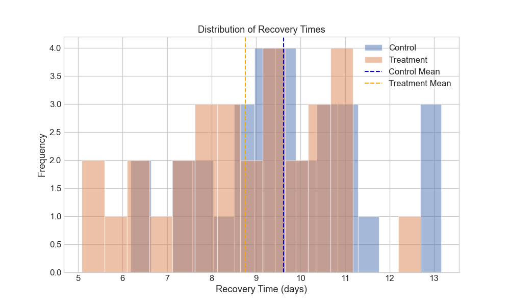
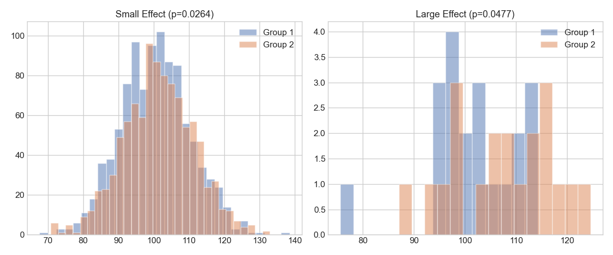
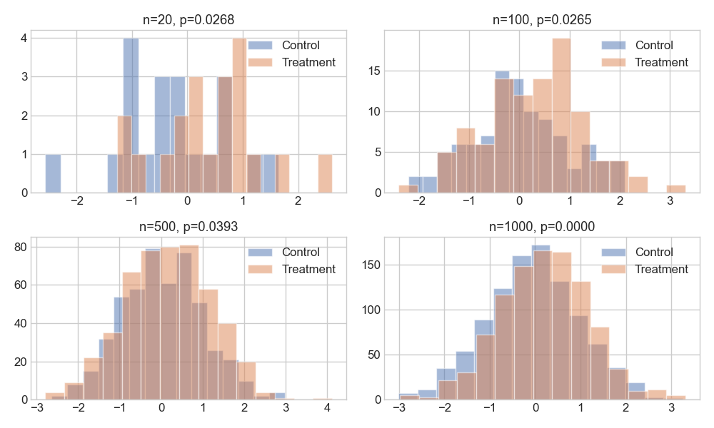
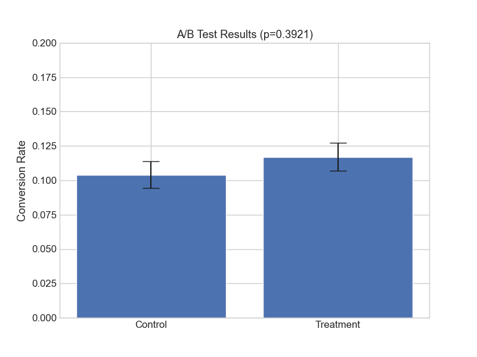
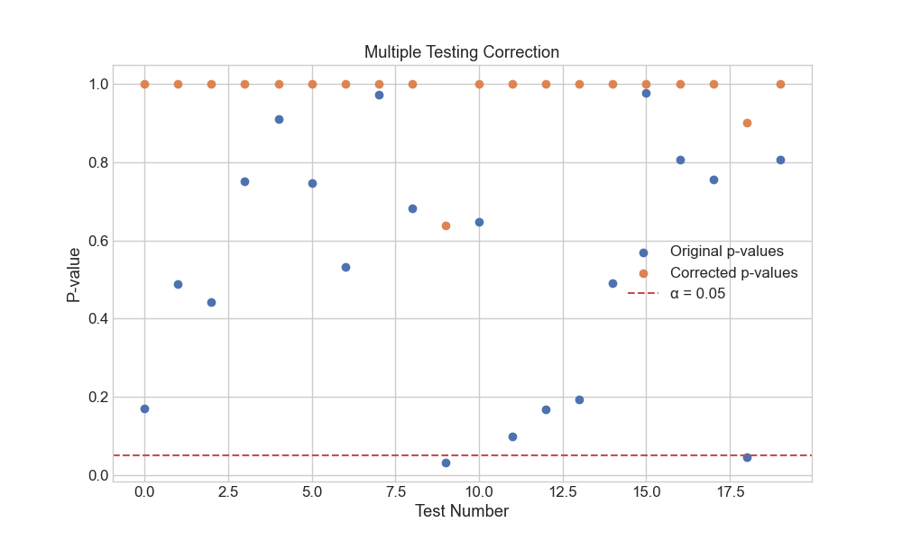

# Understanding P-values: Your Statistical Detective Tool

**After this lesson:** you can explain the core ideas in “Understanding P-values: Your Statistical Detective Tool” and reproduce the examples here in your own notebook or environment.

## Overview

A **p-value** answers a narrow question: “If the null hypothesis were true, how often would we see a test statistic this extreme or more?” It is not a probability that a hypothesis is true, and it is not the same as effect size. This lesson connects the definition to plots and common misreadings; [parameters and statistics](./parameters-statistics.md) next revisits notation and estimators in one place.

## Why this matters

Software and papers will keep showing p-values whether you like them or not. This lesson matters because:

- You will read **p-values** in papers, A/B tools, and software output; you will align words with what the number does (and does not) mean.
- You will avoid the common mistake of confusing **statistical significance** with **practical importance**.

## Prerequisites

- [Population vs sample](./population-sample.md), [confidence intervals](./confidence-intervals.md), and [sampling distributions](./sampling-distributions.md).
- Optional: [Module 1.3 statistics](../../1-data-fundamentals/1.3-intro-statistics/README.md) if you want a notation refresher before diving in.

> **Note:** P-values do not measure the probability that either hypothesis is true.

## Introduction: The Story of P-values

Imagine you're a detective trying to solve a mystery. You have a default theory (null hypothesis), but you've found some evidence that might suggest otherwise. How strong does this evidence need to be to convince you to reject your default theory? That's where p-values come in!

### Video Tutorial: P-values Explained

<div class="video-embed">
<iframe width="560" height="315" src="https://www.youtube.com/embed/UFhJefdVCjE" frameborder="0" allow="accelerometer; autoplay; clipboard-write; encrypted-media; gyroscope; picture-in-picture" allowfullscreen></iframe>
</div>

*StatQuest: P-values, Clearly Explained by Josh Starmer*


*Figure 1: Visual representation of p-value concept. The shaded area represents the probability of observing results as extreme or more extreme than what we got, assuming the null hypothesis is true.*

## What is a P-value?

A p-value is the **probability of observing results at least as extreme as what we got, assuming our null hypothesis is true**. Think of it as a measure of surprise - how unexpected are our results if nothing interesting is actually happening?

### The Mathematical Definition

$$p = P(|T| \geq |t| | H_0)$$

where:

- T is the test statistic
- t is the observed value
- H_0 is the null hypothesis


*Figure 2: Visual explanation of p-value calculation. The red line shows our observed test statistic, and the shaded area represents the p-value.*

## The Key Players in Hypothesis Testing

### 1. Null Hypothesis (H₀)

- The "nothing special happening" theory
- The default position we assume is true
- Examples:
  - "The new drug has no effect"
  - "The dice is fair"
  - "The new website design doesn't affect sales"

### 2. Alternative Hypothesis (H₁ or Hₐ)

- The "something's happening" theory
- What we're actually interested in proving
- Examples:
  - "The new drug affects recovery time"
  - "The dice is loaded"
  - "The new design increases sales"

### 3. Significance Level (α)

- Our threshold for "surprising enough"
- Usually 0.05 (5%) or 0.01 (1%)
- Must be set before analyzing data!


*Figure 3: Visual representation of the hypothesis testing framework. The diagram shows the relationship between null and alternative hypotheses, and how the significance level divides the decision space.*

## How to Interpret P-values: A Decision Guide

### The Basic Rules

```
if p < α:
    "Reject H₀ (Result is statistically significant)"
else:
    "Fail to reject H₀ (Result is not statistically significant)"
```

> Note the wording: when \\(p \geq \alpha\\) we say "**fail to reject** H₀," not "**accept** H₀." A non-significant result means the data are consistent with the null, not that the null has been proven true.

### What p-values do NOT tell you

The definition above is narrow on purpose. Three of the most common misreadings flip the conditional, swap the question, or confuse statistical significance with practical importance:

- **NOT the probability that H₀ is true.** The p-value is computed *assuming* H₀ is true; it cannot turn around and tell you the probability that H₀ itself is true. A Bayesian posterior probability answers that different question.
- **NOT the probability the result is due to chance.** A p-value of 0.03 does not mean "there is a 3% chance the effect is random"—it means "if the null were true, results this extreme would happen about 3% of the time."
- **NOT the probability of being wrong if you reject H₀.** That is a Type I error rate (\\(\alpha\\)) you set in advance for the procedure, not an attribute of one specific p-value.

A separate trap, covered next, is treating a small p-value as evidence of a *large* effect; sample size alone can drive p-values down.

**Two-sample t-test + overlapping histograms**

**Purpose:** Connect the definition of a p-value to a concrete pipeline—simulate two arms, run `ttest_ind`, and plot overlapping recovery-time distributions with vertical mean markers.

**Walkthrough:** `np.random.normal` fixes seed 42; `ttest_ind` yields the two-sided p-value used in the printout; figure writes to `assets/recovery_times_distribution.png` beside this lesson.

<div class="code-explainer" data-code-explainer>
<div class="code-explainer__code">


import numpy as np
from scipy import stats
import matplotlib.pyplot as plt

# Simulate patient recovery times (in days)
np.random.seed(42)  # For reproducibility

# Control group (standard treatment)
control = np.random.normal(loc=10, scale=2, size=30)  # Mean: 10 days

# Treatment group (new medicine)
treatment = np.random.normal(loc=9, scale=2, size=30)  # Mean: 9 days

# Perform t-test
t_stat, p_value = stats.ttest_ind(control, treatment)

# Visualize the distributions
plt.figure(figsize=(10, 6))
plt.hist(control, alpha=0.5, label='Control', bins=15)
plt.hist(treatment, alpha=0.5, label='Treatment', bins=15)
plt.axvline(np.mean(control), color='blue', linestyle='--', label='Control Mean')
plt.axvline(np.mean(treatment), color='orange', linestyle='--', label='Treatment Mean')
plt.xlabel('Recovery Time (days)')
plt.ylabel('Frequency')
plt.title('Distribution of Recovery Times')
plt.legend()
plt.savefig('assets/recovery_times_distribution.png')
plt.close()

print("Clinical Trial Analysis")
print(f"Control group mean: {np.mean(control):.2f} days")
print(f"Treatment group mean: {np.mean(treatment):.2f} days")
print(f"P-value: {p_value:.4f}")
print(f"Result: {'Significant' if p_value < 0.05 else 'Not significant'}")

```
Clinical Trial Analysis
Control group mean: 9.62 days
Treatment group mean: 8.76 days
P-value: 0.0722
Result: Not significant
```


</div>
<aside class="code-explainer__callouts" aria-label="Code walkthrough">
  <div class="code-callout" data-lines="9-12" data-tint="1">
    <div class="code-callout__meta">
      <span class="code-callout__lines"></span>
      <span class="code-callout__title">Two simulated arms</span>
    </div>
    <div class="code-callout__body">
      <p>30 control patients with mean recovery 10 days; 30 treatment patients with mean 9 days. Real difference: 1 day.</p>
    </div>
  </div>
  <div class="code-callout" data-lines="14" data-tint="2">
    <div class="code-callout__meta">
      <span class="code-callout__lines"></span>
      <span class="code-callout__title">The test itself</span>
    </div>
    <div class="code-callout__body">
      <p><code>ttest_ind</code> compares the two means and returns the two-sided p-value used in the decision.</p>
    </div>
  </div>
  <div class="code-callout" data-lines="33" data-tint="3">
    <div class="code-callout__meta">
      <span class="code-callout__lines"></span>
      <span class="code-callout__title">Decision rule</span>
    </div>
    <div class="code-callout__body">
      <p>Compare p to α = 0.05. With this small sample the real 1-day difference may not cross the threshold — power matters.</p>
    </div>
  </div>
</aside>
</div>


*Figure 4: Distribution of recovery times for control and treatment groups. The dashed lines indicate the mean recovery time for each group.*

## Common Misconceptions: What P-values Are NOT

### 1. NOT the Probability H₀ is True

P-values don't tell us the probability of our hypothesis being correct.

### 2. NOT the Probability of Getting Results by Chance

This common misinterpretation can lead to poor decisions.

### 3. NOT the Effect Size

A tiny p-value doesn't mean a huge effect!

**Small δ + huge n vs large δ + tiny n**

**Purpose:** Show that p-values respond to sample size and noise—not effect magnitude alone—by pairing standardized mean differences with `ttest_ind` side by side.

**Walkthrough:** Scenario 1 shifts means by 1% with n=1000; scenario 2 shifts by 10% with n=20; Cohen-style ratios use control SD; subplot titles embed live p-values from each run.

<div class="code-explainer" data-code-explainer>
<div class="code-explainer__code">


# Demonstrating effect size vs p-value
def compare_scenarios():
    # Scenario 1: Small effect, large sample
    large_sample1 = np.random.normal(100, 10, 1000)
    large_sample2 = np.random.normal(101, 10, 1000)  # Just 1% difference

    # Scenario 2: Large effect, small sample
    small_sample1 = np.random.normal(100, 10, 20)
    small_sample2 = np.random.normal(110, 10, 20)  # 10% difference

    # Calculate p-values and effect sizes
    _, p_value1 = stats.ttest_ind(large_sample1, large_sample2)
    _, p_value2 = stats.ttest_ind(small_sample1, small_sample2)

    effect_size1 = (np.mean(large_sample2) - np.mean(large_sample1)) / np.std(large_sample1)
    effect_size2 = (np.mean(small_sample2) - np.mean(small_sample1)) / np.std(small_sample1)

    # Visualize the scenarios
    plt.figure(figsize=(12, 5))

    plt.subplot(121)
    plt.hist(large_sample1, alpha=0.5, label='Group 1', bins=30)
    plt.hist(large_sample2, alpha=0.5, label='Group 2', bins=30)
    plt.title(f'Small Effect (p={p_value1:.4f})')
    plt.legend()

    plt.subplot(122)
    plt.hist(small_sample1, alpha=0.5, label='Group 1', bins=15)
    plt.hist(small_sample2, alpha=0.5, label='Group 2', bins=15)
    plt.title(f'Large Effect (p={p_value2:.4f})')
    plt.legend()

    plt.tight_layout()
    plt.savefig('assets/effect_size_comparison.png')
    plt.close()

    print("\nEffect Size vs P-value Comparison")
    print("\nScenario 1: Small Effect, Large Sample")
    print(f"P-value: {p_value1:.4f}")
    print(f"Effect size: {effect_size1:.2f}")

    print("\nScenario 2: Large Effect, Small Sample")
    print(f"P-value: {p_value2:.4f}")
    print(f"Effect size: {effect_size2:.2f}")

compare_scenarios()

```

Effect Size vs P-value Comparison

Scenario 1: Small Effect, Large Sample
P-value: 0.0264
Effect size: 0.10

Scenario 2: Large Effect, Small Sample
P-value: 0.0477
Effect size: 0.71
```


</div>
<aside class="code-explainer__callouts" aria-label="Code walkthrough">
  <div class="code-callout" data-lines="4-5" data-tint="1">
    <div class="code-callout__meta">
      <span class="code-callout__lines"></span>
      <span class="code-callout__title">Tiny shift, big n</span>
    </div>
    <div class="code-callout__body">
      <p>Means differ by only 1 unit but n=1000. The huge sample drives the p-value down despite a trivial real-world effect.</p>
    </div>
  </div>
  <div class="code-callout" data-lines="8-9" data-tint="2">
    <div class="code-callout__meta">
      <span class="code-callout__lines"></span>
      <span class="code-callout__title">Big shift, tiny n</span>
    </div>
    <div class="code-callout__body">
      <p>Means differ by 10 units but n=20. The large effect is real but the small sample produces a borderline p-value.</p>
    </div>
  </div>
  <div class="code-callout" data-lines="14-15" data-tint="3">
    <div class="code-callout__meta">
      <span class="code-callout__lines"></span>
      <span class="code-callout__title">Effect size = mean difference ÷ SD</span>
    </div>
    <div class="code-callout__body">
      <p>The ratio (Cohen's d-style) measures practical magnitude independently of sample size. Compare the two p-values against the two effect sizes.</p>
    </div>
  </div>
</aside>
</div>


*Figure 5: Comparison of small effect with large sample (left) vs large effect with small sample (right). This demonstrates how p-values can be misleading without considering effect size.*

## Factors Affecting P-values

### 1. Sample Size

Larger samples can make tiny effects statistically significant.

**Fixed lift, varying n (grid of histograms)**

**Purpose:** Drive home that holding the mean shift constant while growing `n` drives p-values down—why “significant” must be read next to effect size.

**Walkthrough:** Loop over `sizes`; each panel draws fresh normals (note: no fixed seed inside loop, so panels vary run-to-run); second loop prints a table of p-values vs n.

<div class="code-explainer" data-code-explainer>
<div class="code-explainer__code">


def show_sample_size_effect():
    effect_size = 0.2  # Fixed small effect
    sizes = [20, 100, 500, 1000]

    # Visualize the effect of sample size
    plt.figure(figsize=(10, 6))
    for n in sizes:
        control = np.random.normal(0, 1, n)
        treatment = np.random.normal(effect_size, 1, n)
        _, p_value = stats.ttest_ind(control, treatment)

        plt.subplot(2, 2, sizes.index(n) + 1)
        plt.hist(control, alpha=0.5, label='Control', bins=15)
        plt.hist(treatment, alpha=0.5, label='Treatment', bins=15)
        plt.title(f'n={n}, p={p_value:.4f}')
        plt.legend()

    plt.tight_layout()
    plt.savefig('assets/sample_size_effect.png')
    plt.close()

    print("\nSample Size Effect Demo")
    for n in sizes:
        control = np.random.normal(0, 1, n)
        treatment = np.random.normal(effect_size, 1, n)
        _, p_value = stats.ttest_ind(control, treatment)
        print(f"n={n:4d}: p={p_value:.4f} {'Significant' if p_value < 0.05 else 'Not significant'}")

show_sample_size_effect()

```

Sample Size Effect Demo
n=  20: p=0.1828 Not significant
n= 100: p=0.0227 Significant
n= 500: p=0.0022 Significant
n=1000: p=0.0000 Significant
```


</div>
<aside class="code-explainer__callouts" aria-label="Code walkthrough">
  <div class="code-callout" data-lines="2" data-tint="1">
    <div class="code-callout__meta">
      <span class="code-callout__lines"></span>
      <span class="code-callout__title">Effect size held fixed</span>
    </div>
    <div class="code-callout__body">
      <p>The real difference between groups stays at 0.2 SD across all four trials — only n changes.</p>
    </div>
  </div>
  <div class="code-callout" data-lines="8-10" data-tint="2">
    <div class="code-callout__meta">
      <span class="code-callout__lines"></span>
      <span class="code-callout__title">Same shift, different n</span>
    </div>
    <div class="code-callout__body">
      <p>Draw control and treatment with the fixed shift, then test. Watch the printed p-value: it drops as n grows from 20 → 1000 even though the underlying effect is unchanged.</p>
    </div>
  </div>
</aside>
</div>


*Figure 6: Effect of sample size on p-values. As sample size increases, the same effect size becomes more detectable (smaller p-value).*

#### Interactive: same effect, different n

The two groups in the left panel always differ by the same effect size (0.2 SD — small but real). Slide \\(n\\) from 10 to 2,000. Right panel: the resulting p-value plotted on a log scale, with the gold dot marking the current sample size. The red dashed line is the conventional \\(\alpha = 0.05\\) threshold.

<iframe src="assets/interactive/p_value_sample_size_simulation.html" width="100%" height="500" frameborder="0" loading="lazy" title="Interactive p-value vs sample size"></iframe>

**Takeaway:** at \\(n = 10\\) the p-value is huge — the effect is real but invisible. At \\(n = 2{,}000\\) the same effect produces \\(p < 0.001\\). The effect didn't get bigger; we just bought more statistical power.

### 2. Effect Size

Bigger differences are easier to detect.

### 3. Variability in Data

More consistent data makes effects easier to spot.

## Real-world Application: A/B Testing

### Website Conversion Rate Example

**Bernoulli arms → chi-square on a 2×2 table**

**Purpose:** Model click/conversion A/B data as independent Bernoulli draws, test association with `chi2_contingency`, and visualize mean ± SE bars for reporting.

**Walkthrough:** Rows of `table` are success/fail counts per arm; `np.mean` on 0/1 vectors gives rates; decision string is a toy business rule at α = 0.05.

<div class="code-explainer" data-code-explainer>
<div class="code-explainer__code">


def ab_test_simulation(n_visitors=1000):
    # Control: 10% conversion rate
    # Treatment: 12% conversion rate

    control = np.random.binomial(1, 0.10, n_visitors)
    treatment = np.random.binomial(1, 0.12, n_visitors)

    # Create contingency table
    table = np.array([
        [np.sum(control), len(control) - np.sum(control)],
        [np.sum(treatment), len(treatment) - np.sum(treatment)]
    ])

    _, p_value, _, _ = stats.chi2_contingency(table)

    # Visualize the results
    plt.figure(figsize=(8, 6))
    plt.bar(['Control', 'Treatment'],
            [np.mean(control), np.mean(treatment)],
            yerr=[np.std(control)/np.sqrt(len(control)),
                  np.std(treatment)/np.sqrt(len(treatment))],
            capsize=10)
    plt.title(f'A/B Test Results (p={p_value:.4f})')
    plt.ylabel('Conversion Rate')
    plt.ylim(0, 0.2)
    plt.savefig('assets/ab_test_results.png')
    plt.close()

    print("\nA/B Test Results")
    print(f"Control conversion: {np.mean(control):.1%}")
    print(f"Treatment conversion: {np.mean(treatment):.1%}")
    print(f"P-value: {p_value:.4f}")
    print(f"Decision: {'Launch new version' if p_value < 0.05 else 'Keep current version'}")

ab_test_simulation()

```

A/B Test Results
Control conversion: 10.4%
Treatment conversion: 11.7%
P-value: 0.3921
Decision: Keep current version
```


</div>
<aside class="code-explainer__callouts" aria-label="Code walkthrough">
  <div class="code-callout" data-lines="4-6" data-tint="1">
    <div class="code-callout__meta">
      <span class="code-callout__lines"></span>
      <span class="code-callout__title">Bernoulli arms</span>
    </div>
    <div class="code-callout__body">
      <p>Simulate binary conversion outcomes (0/1) for 1,000 visitors each in control (10%) and treatment (12%) groups.</p>
    </div>
  </div>
  <div class="code-callout" data-lines="8-14" data-tint="2">
    <div class="code-callout__meta">
      <span class="code-callout__lines"></span>
      <span class="code-callout__title">Chi-square test</span>
    </div>
    <div class="code-callout__body">
      <p>Build a 2×2 contingency table of success/failure counts and run <code>chi2_contingency</code> to test whether conversion rates differ.</p>
    </div>
  </div>
  <div class="code-callout" data-lines="16-26" data-tint="3">
    <div class="code-callout__meta">
      <span class="code-callout__lines"></span>
      <span class="code-callout__title">Bar chart with error bars</span>
    </div>
    <div class="code-callout__body">
      <p>Plot mean conversion rates with ±1 SE error bars and embed the p-value in the chart title.</p>
    </div>
  </div>
  <div class="code-callout" data-lines="28-33" data-tint="4">
    <div class="code-callout__meta">
      <span class="code-callout__lines"></span>
      <span class="code-callout__title">Launch decision</span>
    </div>
    <div class="code-callout__body">
      <p>Print rates, p-value, and a simple rule: launch if p &lt; 0.05, otherwise keep the current version.</p>
    </div>
  </div>
</aside>
</div>


*Figure 7: A/B test results showing conversion rates for control and treatment groups with error bars.*

## Type I error, Type II error, and statistical power

Every test can be wrong in two different ways. Naming them is the easiest way to think clearly about *why* p-values alone aren't enough.

### The 2×2 of decisions

|   | Reality: H₀ true (no effect) | Reality: H₀ false (real effect) |
|---|---|---|
| **You reject H₀** | **Type I error** (false alarm) — probability \\(\alpha\\) | Correct rejection — probability \\(1 - \beta\\) = **power** |
| **You fail to reject H₀** | Correct non-rejection — probability \\(1 - \alpha\\) | **Type II error** (missed effect) — probability \\(\beta\\) |

Three things to remember:

- **Type I error rate \\(\alpha\\)** is what you choose up front (usually 0.05). It's the long-run rate at which the test cries wolf when nothing is happening.
- **Type II error rate \\(\beta\\)** is harder to control because it depends on the true effect size, the sample size, and the noise. Smaller real effects are easier to miss.
- **Power = \\(1 - \beta\\)** is the probability of *catching* a real effect of a given size. The conventional target is **80% power**.

### The trade-off

You can always lower \\(\alpha\\) (be stricter), but that **raises \\(\beta\\)** — you'll miss more real effects. The only way to lower *both* simultaneously is to increase the sample size, which is why power calculations and sample-size planning matter.

### What drives power?

Power goes up when:

| Lever | Effect on power |
|---|---|
| **Effect size grows** (the real difference is bigger) | ↑ — easier to detect |
| **Sample size grows** | ↑ — less noise around the estimate |
| **\\(\alpha\\) is more lenient** (e.g., 0.10 instead of 0.01) | ↑ — easier to "cross the line," but you accept more false alarms |
| **Variability shrinks** (cleaner measurement) | ↑ — same effect against less noise |

### Why this matters for reading results

- A **non-significant** p-value (p > α) does **not** mean "no effect." It might mean the test was underpowered. Always ask: *"What size of effect would this study have been able to detect?"*
- A **significant** result (p < α) doesn't mean the effect is large or important. It just means it's not zero given the noise.
- When designing a study, you usually fix three of {effect size, n, α, power} and solve for the fourth. The most common case: "I want 80% power to detect a 5% lift at α = 0.05 — how many users do I need?"

### Interactive: Power vs sample size and effect size

Move the sliders to set the true effect size (in standardized units) and the per-group sample size. The widget shows the null and alternative distributions, shades the rejection region (Type I, in red) and the missed-detection region (Type II, in orange), and reports the resulting power.

<iframe src="assets/interactive/power_simulation.html" width="100%" height="520" frameborder="0" loading="lazy" title="Interactive power simulation"></iframe>

**Try this:**

- Set effect size = 0.2 (a small effect). Slide \\(n\\) up. How big does \\(n\\) need to be before power crosses 80%?
- Set effect size = 0.5 (medium). Notice power crosses 80% much sooner — bigger effects are cheaper to detect.
- Set α = 0.01 (stricter). Power drops at every \\(n\\) — the price of being more careful about false alarms.

## Best Practices for Using P-values

### 1. Set α Before Looking at Data

Avoid p-hacking by deciding your threshold in advance.

### 2. Consider Practical Significance

Statistical significance ≠ Practical importance.

### 3. Report Exact P-values

Don't just say "p < 0.05".

### 4. Use Multiple Testing Corrections

When performing multiple tests:

**Bonferroni on a batch of null t-tests**

**Purpose:** Show how aggressive family-wise correction shrinks the count of “significant” results when you reuse α = 0.05 on many noisy comparisons.

**Walkthrough:** List comprehension runs 20 independent two-sample t-tests on pure noise; `multipletests(..., method='bonferroni')[1]` returns adjusted p-values; scatter plot compares raw vs adjusted.

<div class="code-explainer" data-code-explainer>
<div class="code-explainer__code">


from statsmodels.stats.multitest import multipletests

# Simulate multiple tests
p_values = [stats.ttest_ind(np.random.normal(0, 1, 30),
                           np.random.normal(0, 1, 30)).pvalue
            for _ in range(20)]

# Apply Bonferroni correction
corrected_p = multipletests(p_values, method='bonferroni')[1]

# Visualize the correction
plt.figure(figsize=(10, 6))
plt.scatter(range(len(p_values)), p_values, label='Original p-values')
plt.scatter(range(len(corrected_p)), corrected_p, label='Corrected p-values')
plt.axhline(y=0.05, color='r', linestyle='--', label='α = 0.05')
plt.xlabel('Test Number')
plt.ylabel('P-value')
plt.title('Multiple Testing Correction')
plt.legend()
plt.savefig('assets/multiple_testing_correction.png')
plt.close()

print("\nMultiple Testing Correction")
print(f"Original significant results: {sum(np.array(p_values) < 0.05)}")
print(f"Corrected significant results: {sum(corrected_p < 0.05)}")

```

Multiple Testing Correction
Original significant results: 2
Corrected significant results: 0
```


</div>
<aside class="code-explainer__callouts" aria-label="Code walkthrough">
  <div class="code-callout" data-lines="1-6" data-tint="1">
    <div class="code-callout__meta">
      <span class="code-callout__lines"></span>
      <span class="code-callout__title">Twenty null tests</span>
    </div>
    <div class="code-callout__body">
      <p>Run 20 independent t-tests on pure noise; some will fall below 0.05 by chance alone (false positives).</p>
    </div>
  </div>
  <div class="code-callout" data-lines="8-9" data-tint="2">
    <div class="code-callout__meta">
      <span class="code-callout__lines"></span>
      <span class="code-callout__title">Bonferroni correction</span>
    </div>
    <div class="code-callout__body">
      <p>Apply Bonferroni adjustment via <code>multipletests</code>, which multiplies each p-value by the number of tests to control family-wise error rate.</p>
    </div>
  </div>
  <div class="code-callout" data-lines="11-21" data-tint="3">
    <div class="code-callout__meta">
      <span class="code-callout__lines"></span>
      <span class="code-callout__title">Scatter comparison</span>
    </div>
    <div class="code-callout__body">
      <p>Plot raw and corrected p-values together against the α = 0.05 threshold to show how correction shrinks apparent significance.</p>
    </div>
  </div>
  <div class="code-callout" data-lines="23-25" data-tint="4">
    <div class="code-callout__meta">
      <span class="code-callout__lines"></span>
      <span class="code-callout__title">Count comparison</span>
    </div>
    <div class="code-callout__body">
      <p>Print before-and-after counts of "significant" results to illustrate how Bonferroni reduces false discoveries.</p>
    </div>
  </div>
</aside>
</div>


*Figure 8: Effect of multiple testing correction. The Bonferroni method adjusts p-values to control for the increased chance of false positives when performing multiple tests.*

## Practice Questions

Try each question on your own first, then expand the answer to check.

**1.** A study finds p = 0.03. What does this mean in plain English?

<details>
<summary>Show answer</summary>

p = 0.03 means: **if the null hypothesis were true (i.e., no real effect), there's a 3% chance of seeing a result as extreme as ours, or more extreme, just by random sampling.**

That's small enough that most analysts would say "the data are surprising under the null, so we lean toward rejecting it."

What it does **not** mean:

- ❌ "There's a 3% chance the null hypothesis is true." (You can't flip the conditional like that — see the misconceptions section.)
- ❌ "There's a 97% chance our finding is real." (Same flip, same error.)
- ❌ "The effect is large." (p says nothing about size — it could be a tiny effect detected with a huge sample.)

Practical reading: it's evidence against the null, but you should still report the **effect size and confidence interval** to know whether the effect is meaningful.

</details>

**2.** Why might a study with n = 10,000 find "significant" results for tiny effects?

<details>
<summary>Show answer</summary>

The standard error shrinks like \\(1/\sqrt{n}\\), so test statistics like \\(t = \dfrac{\bar x - \mu_0}{s/\sqrt{n}}\\) get larger as \\(n\\) grows even if the actual difference \\(\bar x - \mu_0\\) is tiny. With \\(n = 10{,}000\\), almost any non-zero true effect is statistically detectable.

Concrete example: a true effect of 0.01 standard deviations is detectable at p < 0.05 once \\(n\\) is around 40,000. That tells you the effect is real, not zero — but a 0.01 SD difference is almost always meaningless in business or clinical terms.

Lesson: **always report effect size alongside p-values.** With huge samples, a p < 0.001 may be a triviality; with tiny samples, p = 0.20 may hide a real effect.

</details>

**3.** Your A/B test shows p = 0.04 but only a 0.1% increase in conversions. What should you do?

<details>
<summary>Show answer</summary>

**Don't ship blindly.** A statistically-significant 0.1% lift is probably not worth the cost of switching, and it might not even be real once you account for engineering, support, and ongoing maintenance trade-offs. Steps:

1. **Check the confidence interval, not just p.** A 95% CI of, say, [0.01%, 0.19%] tells you the lift could be near zero. If the CI includes a practically-meaningless region, the result is weak even if statistically significant.
2. **Compare against your minimum detectable effect (MDE).** Was 0.1% above what you considered worth pursuing when you designed the test? If not, this was an underpowered or over-powered test in the wrong direction.
3. **Look for novelty and seasonality effects.** A one-week test catching a Monday holiday or a launch announcement can show small lifts that disappear later.
4. **Consider business cost.** Engineering, QA, possible regression risk, and any user disruption all weigh against a 0.1% lift.
5. **Re-run with proper sizing** if you genuinely care about a 0.1% lift — you'll likely need many more users to confirm it stably.

The healthy default is "p < α is necessary but not sufficient — also need a meaningful effect size."

</details>

**4.** How would you explain p-values to a non-technical stakeholder?

<details>
<summary>Show answer</summary>

> "Imagine the boring outcome — the new design has *no* real effect on conversions. Even if that's true, sometimes by pure luck the test will show a difference. The p-value is just: 'how often would we see a difference this big purely by luck if nothing was actually going on?'
>
> A small p-value (say 0.03) means 'this would be quite surprising under "no effect" — only happens 3% of the time by luck — so we lean toward "something real is happening."'
>
> A big p-value means 'this could easily be noise — we don't have enough evidence to claim something changed.'
>
> Two warnings:
>
> 1. A small p-value tells us 'real, not zero' but not '*how big*' the effect is. We need a separate number for that.
> 2. A big p-value doesn't *prove* nothing's happening — sometimes our test is just too small to spot a real effect."

</details>

**5.** When would you use a stricter significance level (e.g., 0.01 instead of 0.05)?

<details>
<summary>Show answer</summary>

Use a stricter \\(\alpha\\) when the cost of a false positive is high. Common cases:

| Setting | Why stricter |
|---|---|
| **Medical / drug trials** | A wrongly-approved drug can harm patients. Regulatory bodies often demand 0.01 or stricter. |
| **Genome-wide association studies** | You're testing millions of genetic variants. Without a tiny α (e.g., 5×10⁻⁸), you'd get thousands of false positives. |
| **Multiple A/B tests in parallel** | If you run 20 tests at α = 0.05, ~1 will be a false positive by chance. Use Bonferroni (α/20 = 0.0025) or FDR control. |
| **High-stakes business decisions** | E.g., shutting down a product line. Cost of acting on a false positive is huge. |
| **Physics, particle discovery** | The "5-sigma" rule (~3×10⁻⁷) is the standard for claiming new fundamental discoveries. |

You **shouldn't** make α stricter just because you want to be "extra sure" — wider α tightens Type I but loosens Type II (you'll miss real effects). Match the threshold to the actual cost of each error type.

</details>

## Key Takeaways

1. P-values measure evidence against H₀
2. Small p-values don't mean large effects
3. Sample size strongly influences p-values
4. Statistical significance ≠ Practical significance
5. Correct for multiple testing
6. Always consider both statistical and practical importance
7. Visualize your data to better understand the results

## Gotchas

- **Choosing α after seeing the data** — setting your significance threshold to 0.05 (or any value) *after* computing the p-value invalidates the Type I error guarantee. Always fix α before you run the test; changing it post-hoc to make a result "significant" is p-hacking.
- **p = 0.049 is not meaningfully different from p = 0.051** — the binary significant/not-significant framing treats a bright line as though the underlying evidence is radically different on either side. Report exact p-values and consider the full context rather than the threshold alone.
- **A large p-value does not prove the null hypothesis** — "fail to reject H₀" means the data are consistent with no effect, not that no effect exists. Underpowered studies routinely produce large p-values even when a real effect is present.
- **Confusing p-value with the probability that H₀ is true** — the p-value is computed *assuming* H₀ is true; it cannot tell you how likely H₀ is. Bayesian posterior probabilities answer that different question.
- **Running multiple tests without correction inflates false-positive rate** — if you run 20 independent tests at α=0.05, you expect about one false positive by chance alone. Use Bonferroni or FDR corrections (as shown in the lesson's `multipletests` example) whenever you test several hypotheses.
- **Treating `ttest_ind` as the only option for comparing two groups** — `ttest_ind` assumes approximately normal data with independent observations. For paired measurements use `ttest_rel`; for non-normal data with small samples prefer `mannwhitneyu`; the wrong test can produce a misleading p-value silently.

## Next steps

- Continue to [Parameters and statistics](./parameters-statistics.md) to consolidate notation and estimation, then finish the submodule and move on to [Hypothesis testing (module 4.2)](../4.2-hypotheses-testing/README.md).

## Additional Resources

- [Interactive P-value Simulator](https://seeing-theory.brown.edu/frequentist-inference/index.html)
- [ASA Statement on P-values](https://www.amstat.org/asa/files/pdfs/p-valuestatement.pdf)
- [Common P-value Mistakes](https://statisticsbyjim.com/hypothesis-testing/interpreting-p-values/)

Remember: P-values are just one tool in your statistical toolbox. Use them wisely, but don't rely on them exclusively!
