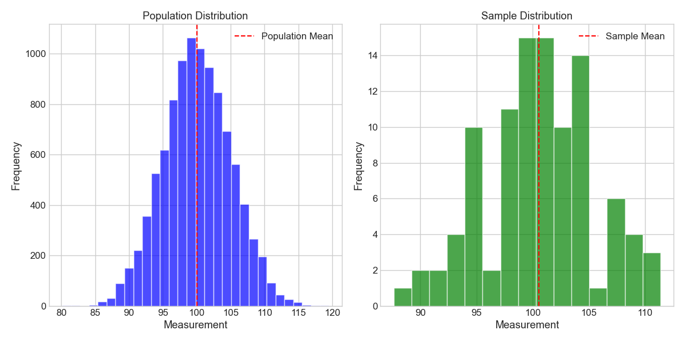
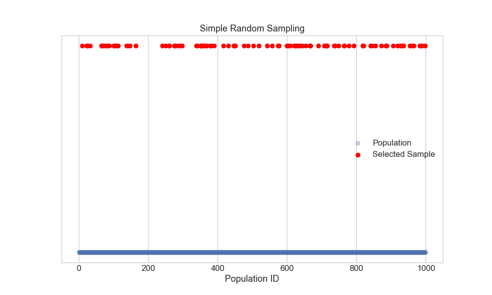
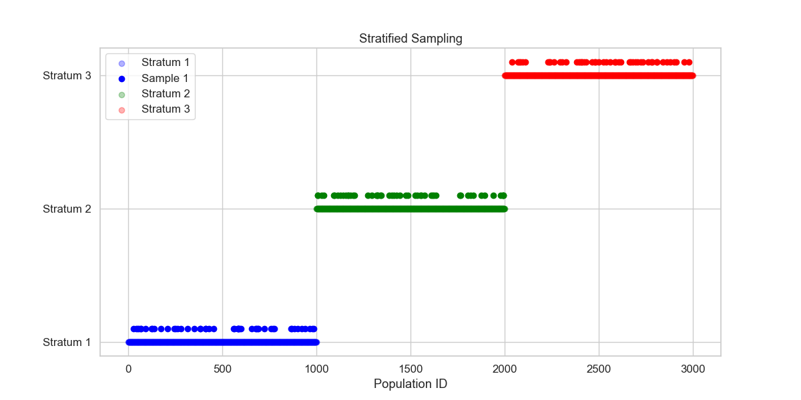
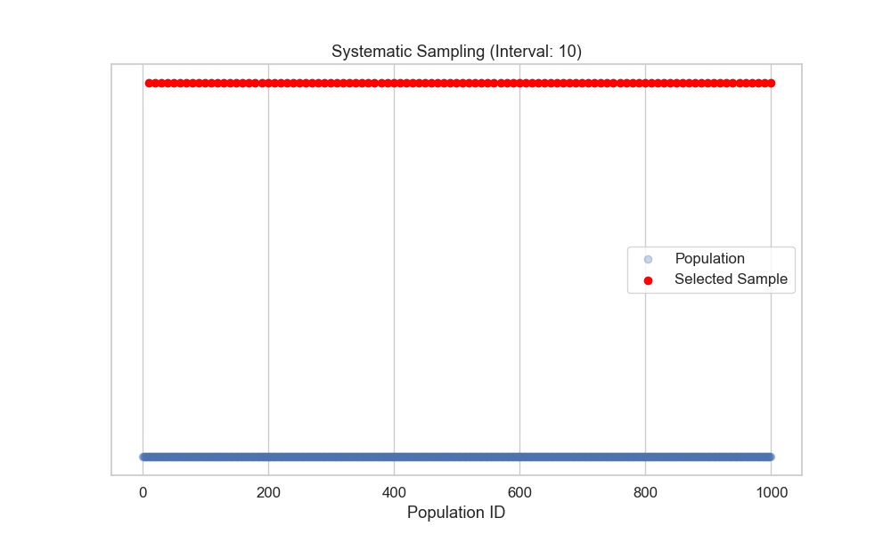
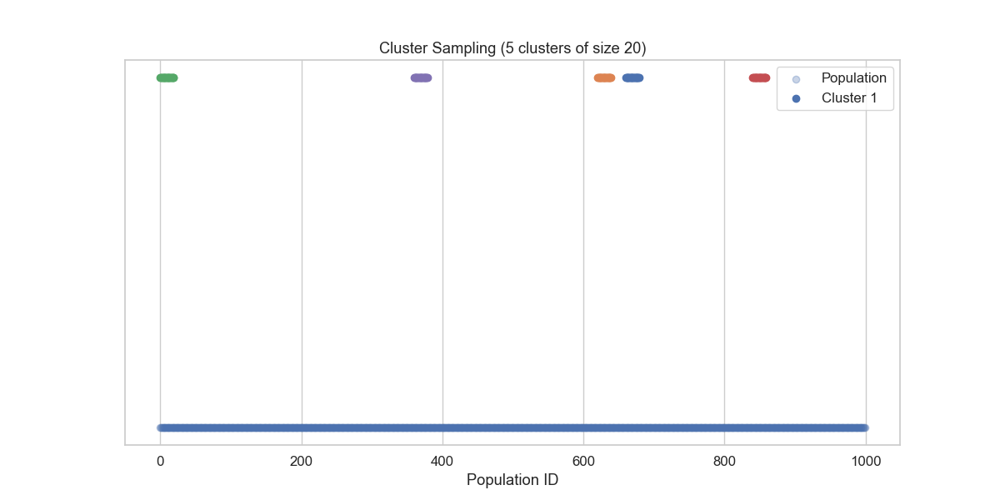
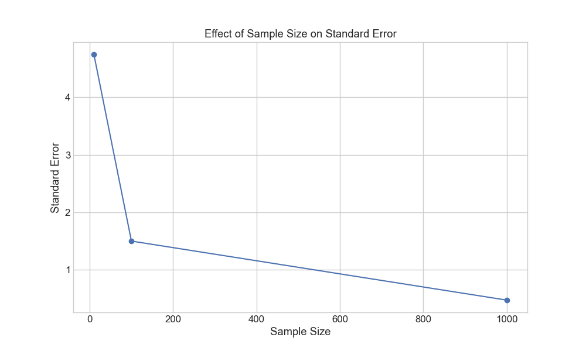
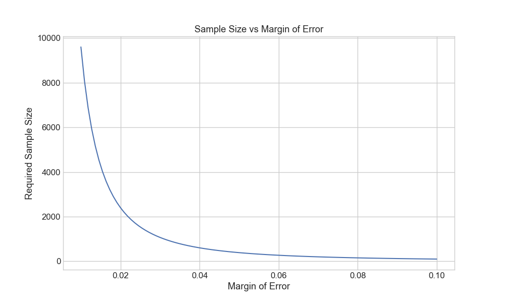

# Population vs Sample: The Foundation of Statistical Inference

**After this lesson:** you can explain the core ideas in “Population vs Sample: The Foundation of Statistical Inference” and reproduce the examples here in your own notebook or environment.

## Overview

This lesson fixes vocabulary: **population** (what you want to learn about), **sample** (what you actually measure), and **how you pick** the sample. Every later idea—intervals, tests, models—assumes you can say clearly what was and was not included in the data.

## Helpful video

StatQuest introduction to confidence intervals.

<iframe width="560" height="315" src="https://www.youtube.com/embed/TqOeMYtOc1w" title="Confidence Intervals, Clearly Explained" frameborder="0" allow="accelerometer; autoplay; clipboard-write; encrypted-media; gyroscope; picture-in-picture" allowfullscreen></iframe>

## Why this matters

If “population” and “sample” are vague, every number you compute is easy to misread. This lesson matters because:

- You need precise **population** and **sample** language before confidence intervals, tests, or models.
- Sampling choices affect whether conclusions generalize beyond the rows in your spreadsheet.

## Prerequisites

- Descriptive statistics (mean, median, spread).
- Basic probability (random variables, variation). Optional: [Intro statistics (module 1.3)](../../1-data-fundamentals/1.3-intro-statistics/README.md).
- Short Python examples are optional to read; focus on the ideas first.

> **Note:** This is the first lesson in [4.1 Inferential statistics](./README.md).

## Key terms

The rest of the module reuses these words constantly. Memorize the definitions, not the metaphors.

- **Population**: The complete set of all items or individuals we want to study
- **Sample**: A subset of the population that we actually measure
- **Sampling**: The process of selecting a sample from a population
- **Parameter**: A numerical characteristic of a population
- **Statistic**: A numerical characteristic of a sample

*Figure 1: Visual representation of key terms in sampling. The diagram shows how parameters describe populations and statistics describe samples.*

## Introduction: The Detective Analogy

Imagine you're a detective trying to understand a city's crime patterns. You can't investigate every single crime (population), but you can study a carefully selected set of cases (sample) to make informed conclusions about the whole city. This is the essence of sampling in statistics!



## What is a Population?

### Definition

A population is the **complete set** of all items, individuals, or measurements that we're interested in studying. It's the "big picture" we want to understand.

### Real-world Examples

1. **Business Context**:
   - All customers who have ever shopped at an e-commerce store
   - Every transaction processed by a payment system
   - All products in a company's inventory

2. **Research Context**:
   - All students in a university
   - Every patient with a specific medical condition
   - All trees in a forest

### Visual Representation

*Figure 2: The relationship between population and sample. The larger circle represents the entire population, while the smaller circle inside represents our sample.*

## What is a Sample?

### Definition

A sample is a carefully selected **subset** of the population that we actually measure and analyze. Think of it as our "window" into the larger population.

### Real-world Examples

1. **Business Context**:
   - 1,000 randomly selected customers for a satisfaction survey
   - 10,000 transactions from last month for fraud analysis
   - 100 products for quality testing

2. **Research Context**:
   - 200 students surveyed about campus facilities
   - 50 patients participating in a clinical trial
   - 500 trees measured in a forest study

## Why Do We Need Samples?

### Practical Reasons

1. **Cost**: Studying entire populations is often expensive
2. **Time**: Complete enumeration takes too long
3. **Feasibility**: Some populations are infinite or constantly changing
4. **Destructive Testing**: Some measurements destroy the item being measured

### Example: Quality Control in Manufacturing

**Finite population vs one SRS**

**Purpose:** Show side-by-side histograms for “everything produced” versus `replace=False` draw of 100 units and compare \\(\mu\\) vs \\(\bar x\\)—the core idea behind inspection without full enumeration.

**Walkthrough:** `np.random.choice(..., replace=False)` mimics sampling without replacement from a finite batch; twin subplots emphasize mean alignment, not equality on every draw.


import numpy as np
import matplotlib.pyplot as plt

# Simulate a production batch of 10,000 items
population = np.random.normal(loc=100, scale=5, size=10000)  # Target: 100 units

# Take a sample of 100 items
sample = np.random.choice(population, size=100, replace=False)

# Visualize population and sample
plt.figure(figsize=(12, 6))
plt.subplot(121)
plt.hist(population, bins=30, alpha=0.7, color='blue')
plt.axvline(np.mean(population), color='red', linestyle='--', label='Population Mean')
plt.title('Population Distribution')
plt.xlabel('Measurement')
plt.ylabel('Frequency')
plt.legend()

plt.subplot(122)
plt.hist(sample, bins=15, alpha=0.7, color='green')
plt.axvline(np.mean(sample), color='red', linestyle='--', label='Sample Mean')
plt.title('Sample Distribution')
plt.xlabel('Measurement')
plt.ylabel('Frequency')
plt.legend()

plt.tight_layout()
plt.savefig('assets/population_sample_dist.png')
plt.close()

# Print statistics
print("\nQuality Control Analysis")
print(f"Population mean: {np.mean(population):.2f}")
print(f"Sample mean: {np.mean(sample):.2f}")
print(f"Difference: {abs(np.mean(population) - np.mean(sample)):.2f}")


<aside class="code-explainer__callouts" aria-label="Code walkthrough">
  

    

      
      Population and sample
    

    

      
Generate a production population of 10,000 items with mean 100, then draw a without-replacement sample of 100 items.

    

  

  

    

      
      Side-by-side histograms
    

    

      
Plot population and sample distributions in two subplots, each with a dashed red line marking the respective mean.

    

  

  

    

      
      Mean comparison
    

    

      
Print population mean, sample mean, and the absolute difference to illustrate how close a well-drawn sample can be to the truth.

    

  

</aside>

*Figure 3: Comparison of population and sample distributions in a quality control example. The red dashed lines indicate the means, showing how well the sample represents the population.*

## Sampling Methods: Choosing Your Strategy

### 1. Simple Random Sampling (SRS)

The statistical equivalent of drawing names from a hat - every member has an equal chance.

**SRS on IDs with scatter “strip” plot**

**Purpose:** Visualize that simple random sampling scatters draws evenly across the frame ID space—useful for spotting accidental clustering if your real process is not SRS.

**Walkthrough:** `np.arange(1000)` stands in for labeled units; `choice(..., replace=False)` enforces no duplicates; first five IDs printed for sanity checks.


def simple_random_sample(population, sample_size):
    """Generate a simple random sample"""
    return np.random.choice(population, size=sample_size, replace=False)

# Example usage with visualization
population = np.arange(1000)  # IDs 0-999
sample = simple_random_sample(population, 100)

# Visualize the sampling process
plt.figure(figsize=(10, 6))
plt.scatter(population, [0]*len(population), alpha=0.3, label='Population')
plt.scatter(sample, [0.1]*len(sample), color='red', label='Selected Sample')
plt.title('Simple Random Sampling')
plt.xlabel('Population ID')
plt.yticks([])
plt.legend()
plt.savefig('assets/simple_random_sampling.png')
plt.close()

print(f"Random sample IDs: {sample[:5]}...")  # Show first 5 IDs


<aside class="code-explainer__callouts" aria-label="Code walkthrough">
  

    

      
      SRS function
    

    

      
Use <code>np.random.choice(..., replace=False)</code> to draw IDs without replacement, ensuring each unit appears at most once in the sample.

    

  

  

    

      
      Strip plot
    

    

      
Scatter all 1,000 IDs at y=0 and the 100 selected IDs slightly above at y=0.1 in red to show how SRS spreads draws evenly across the frame.

    

  

</aside>

*Figure 4: Visualization of simple random sampling. Each point represents a member of the population, with red points indicating selected sample members.*

### 2. Stratified Sampling

Like organizing a party where you ensure representation from different departments.

**Independent SRS within each stratum**

**Purpose:** Guarantee minimum representation per group by slicing the frame into contiguous blocks (here, age bands) and sampling fixed counts from each.

**Walkthrough:** Loop advances `start_idx`; each stratum uses `choice` without replacement; y-offset separates strata on the scatter for clarity.


def stratified_sample(population, strata_sizes, sample_sizes):
    """Generate a stratified sample"""
    samples = []
    start_idx = 0

    # Visualize the strata
    plt.figure(figsize=(12, 6))
    colors = ['blue', 'green', 'red']

    for i, (stratum_size, sample_size) in enumerate(zip(strata_sizes, sample_sizes)):
        stratum = population[start_idx:start_idx + stratum_size]
        sample = np.random.choice(stratum, size=sample_size, replace=False)
        samples.extend(sample)

        # Plot stratum
        plt.scatter(stratum, [i]*len(stratum), alpha=0.3, color=colors[i],
                   label=f'Stratum {i+1}')
        plt.scatter(sample, [i+0.1]*len(sample), color=colors[i],
                   label=f'Sample {i+1}' if i==0 else "")

        start_idx += stratum_size

    plt.title('Stratified Sampling')
    plt.xlabel('Population ID')
    plt.yticks(range(len(strata_sizes)), [f'Stratum {i+1}' for i in range(len(strata_sizes))])
    plt.legend()
    plt.savefig('assets/stratified_sampling.png')
    plt.close()

    return np.array(samples)

# Example: Sampling by age groups
population = np.arange(3000)  # 3000 people
strata_sizes = [1000, 1000, 1000]  # Equal size strata
sample_sizes = [50, 50, 50]  # Equal size samples
sample = stratified_sample(population, strata_sizes, sample_sizes)


<aside class="code-explainer__callouts" aria-label="Code walkthrough">
  

    

      
      Function signature
    

    

      
Accept a population array, a list of stratum sizes, and a list of per-stratum sample counts to build a stratified draw.

    

  

  

    

      
      Per-stratum loop
    

    

      
Slice each stratum from the population, sample without replacement, and plot both stratum members and selected units at staggered y-positions.

    

  

  

    

      
      Usage example
    

    

      
Demonstrate with 3,000 people split into three equal strata of 1,000, drawing 50 from each to guarantee representation.

    

  

</aside>

*Figure 5: Visualization of stratified sampling. The population is divided into three strata (blue, green, red), and samples are taken from each stratum.*

### 3. Systematic Sampling

Like picking every 10th person who walks into a store.

**Random start, fixed skip interval**

**Purpose:** Implement the textbook systematic route—pick a random offset in `[0, k-1)`, then take every `k`th element—while plotting selected indices.

**Walkthrough:** `population[start::interval]` performs the stride; works cleanly when frame order is unrelated to outcome (otherwise risk of periodic bias).


def systematic_sample(population, interval):
    """Generate a systematic sample"""
    start = np.random.randint(0, interval)
    sample = population[start::interval]

    # Visualize the sampling process
    plt.figure(figsize=(10, 6))
    plt.scatter(population, [0]*len(population), alpha=0.3, label='Population')
    plt.scatter(sample, [0.1]*len(sample), color='red', label='Selected Sample')
    plt.title(f'Systematic Sampling (Interval: {interval})')
    plt.xlabel('Population ID')
    plt.yticks([])
    plt.legend()
    plt.savefig('assets/systematic_sampling.png')
    plt.close()

    return sample

# Example: Select every 10th customer
population = np.arange(1000)
sample = systematic_sample(population, 10)


<aside class="code-explainer__callouts" aria-label="Code walkthrough">
  

    

      
      Random start and stride
    

    

      
Pick a random offset in [0, interval) and use Python slice notation <code>start::interval</code> to select every kth element, giving equal spacing throughout the frame.

    

  

  

    

      
      Strip plot
    

    

      
Visualise population and selected IDs on a 1D strip to show the regular spacing pattern that distinguishes systematic from random selection.

    

  

</aside>

*Figure 6: Visualization of systematic sampling. The red points show how every 10th member is selected from the population.*

### 4. Cluster Sampling

Like studying a few neighborhoods to understand a city.

**Take all units from randomly chosen blocks**

**Purpose:** Contrast with SRS—here entire contiguous blocks enter the sample, mimicking “survey all households in sampled blocks.”

**Walkthrough:** `clusters` draws which block indices to keep; inner slice `population[start:end]` takes everyone in that block; colors distinguish clusters on the strip plot.


def cluster_sample(population, n_clusters, cluster_size):
    """Generate a cluster sample"""
    clusters = np.random.choice(len(population) // cluster_size, size=n_clusters, replace=False)
    samples = []

    # Visualize the clusters
    plt.figure(figsize=(12, 6))
    plt.scatter(population, [0]*len(population), alpha=0.3, label='Population')

    for i, cluster in enumerate(clusters):
        start = cluster * cluster_size
        end = start + cluster_size
        cluster_members = population[start:end]
        samples.extend(cluster_members)

        # Plot cluster
        plt.scatter(cluster_members, [0.1]*len(cluster_members),
                   color=f'C{i}', label=f'Cluster {i+1}' if i==0 else "")

    plt.title(f'Cluster Sampling ({n_clusters} clusters of size {cluster_size})')
    plt.xlabel('Population ID')
    plt.yticks([])
    plt.legend()
    plt.savefig('assets/cluster_sampling.png')
    plt.close()

    return np.array(samples)

# Example: Sample 5 clusters of 20 people each
population = np.arange(1000)
sample = cluster_sample(population, 5, 20)


<aside class="code-explainer__callouts" aria-label="Code walkthrough">
  

    

      
      Select clusters
    

    

      
Randomly choose which cluster blocks to include; all units within selected blocks enter the sample.

    

  

  

    

      
      Per-cluster loop
    

    

      
For each selected block, take all units in the contiguous slice and plot them at a raised y-position with a distinct colour.

    

  

  

    

      
      Usage example
    

    

      
Sample 5 clusters of 20 people each from a population of 1,000 to demonstrate the whole-block selection pattern.

    

  

</aside>

*Figure 7: Visualization of cluster sampling. The colored points show how entire clusters are selected from the population.*

### Visual Comparison of Sampling Methods

*Figure 8: Visual comparison of different sampling methods. From top-left: Simple Random, Stratified, Systematic, and Cluster sampling.*

## Common Sampling Errors and How to Avoid Them

### 1. Selection bias

Selection bias means the people or units in your data **do not represent** the population you claim to study. The sample is often easy to reach, willing to respond, or already filtered by another process—none of which guarantees a fair picture of everyone.

#### Example

- **Risky:** Surveying only mall shoppers about *online* shopping habits (people who still go to malls may differ from those who shop only online).
- **Better:** Draw from a frame that mixes channels, or separate reporting by segment so you do not overclaim.

### 2. Sampling error

Even with a perfect design, **random samples differ** from each other and from the population. That unavoidable wiggle is sampling error—not a mistake, but variation you account for with intervals, standard errors, and larger *n* when feasible.

**SE curve vs sample size**

**Purpose:** Plot \\(\sigma/\sqrt{n}\\) for a few `n` values to reinforce the square-root law driving precision gains.

**Walkthrough:** `calculate_sampling_error` is the mean’s standard error when \\(\sigma\\) is known; loop prints the numeric sequence feeding the line plot.


def calculate_sampling_error(population_std, sample_size):
    """Calculate standard error of the mean"""
    return population_std / np.sqrt(sample_size)

# Example with visualization
population_std = 15
sample_sizes = [10, 100, 1000]
ses = []

plt.figure(figsize=(10, 6))
for n in sample_sizes:
    se = calculate_sampling_error(population_std, n)
    ses.append(se)
    print(f"Sample size {n}: Standard Error = {se:.2f}")

plt.plot(sample_sizes, ses, 'bo-')
plt.xlabel('Sample Size')
plt.ylabel('Standard Error')
plt.title('Effect of Sample Size on Standard Error')
plt.grid(True)
plt.savefig('assets/sampling_error_effect.png')
plt.close()


<aside class="code-explainer__callouts" aria-label="Code walkthrough">
  

    

      
      SE formula
    

    

      
Implement σ/√n as a one-liner to compute the standard error of the mean when the population standard deviation is known.

    

  

  

    

      
      SE curve
    

    

      
Evaluate SE at sizes 10, 100, and 1,000; print each result and plot the curve to show the square-root law driving diminishing returns from larger samples.

    

  

</aside>

*Figure 9: Effect of sample size on standard error. As sample size increases, the standard error decreases, showing improved precision.*

### 3. Coverage error

Coverage error happens when your **sampling frame**—the list or mechanism you draw from—does not cover the full population. You might still run a clean random draw *within* the frame and still miss entire groups.

#### Example

- **Risky:** Email-only survey for “all customers” when many never gave an email.
- **Better:** Combine contact modes where appropriate, document who is excluded, or narrow the claim to “customers with email on file.”

## Sample Size Determination

### The Sample Size Formula

For estimating a proportion with specified margin of error:

**Normal-approx sample size for a proportion**

**Purpose:** Connect desired MOE and confidence level to a closed-form `n`, and plot how tightening MOE explodes required size when \\(p(1-p)\\) is fixed at 0.25.

**Walkthrough:** `norm.ppf` supplies \\(z_{\alpha/2}\\); formula is the standard Wald-style planning equation; curve plots `n` vs a grid of margins.


def calculate_sample_size(confidence_level=0.95, margin_of_error=0.05, p=0.5):
    """Calculate required sample size for proportion estimation"""
    from scipy.stats import norm

    z_score = norm.ppf(1 - (1 - confidence_level) / 2)
    n = (z_score**2 * p * (1-p)) / margin_of_error**2

    # Visualize the relationship
    margins = np.linspace(0.01, 0.1, 100)
    sizes = [(z_score**2 * p * (1-p)) / m**2 for m in margins]

    plt.figure(figsize=(10, 6))
    plt.plot(margins, sizes)
    plt.xlabel('Margin of Error')
    plt.ylabel('Required Sample Size')
    plt.title('Sample Size vs Margin of Error')
    plt.grid(True)
    plt.savefig('assets/sample_size_relationship.png')
    plt.close()

    return int(n)

# Example usage
n = calculate_sample_size()
print(f"\nRequired sample size: {n}")


<aside class="code-explainer__callouts" aria-label="Code walkthrough">
  

    

      
      Wald formula
    

    

      
Compute the z critical value then apply the standard sample-size formula: n = z²·p(1-p) / MOE².

    

  

  

    

      
      Curve of n vs MOE
    

    

      
Plot required n against a range of margins from 1% to 10% to visualise the hyperbolic trade-off between precision and cost.

    

  

  

    

      
      Example call
    

    

      
Call with defaults (95% confidence, 5% MOE, p=0.5) and print the recommended sample size.

    

  

</aside>

*Figure 10: Relationship between margin of error and required sample size. As the desired margin of error decreases, the required sample size increases.*

## Practice Questions

1. Why might a simple random sample not be the best choice for studying a city's crime patterns?
2. How would you design a sampling strategy for estimating the average income of a country's population?
3. What sampling method would you use to study the effectiveness of a new teaching method across different schools?
4. How does sample size affect the reliability of your estimates?
5. What are the advantages and disadvantages of each sampling method?

## Key Takeaways

1. Populations are complete sets, samples are subsets
2. Different sampling methods suit different situations
3. Sample size affects estimation precision
4. Sampling errors can be minimized with proper design
5. Visualizing sampling processes aids understanding
6. Real-world applications require careful sampling design
7. Common sampling errors can be avoided with proper planning

## Gotchas

- **Confusing the sampling frame with the population** — the sampling frame is the *list or mechanism you actually draw from* (e.g., email addresses on file), which often covers only a subset of the true population (e.g., all customers). Conclusions drawn from the sample technically apply only to the frame, not the full population.
- **`np.random.choice(..., replace=False)` on a large array is slow for small samples** — for simple random sampling when n is much smaller than N, drawing without replacement from a huge array using `choice` is fine, but the lesson's `systematic_sample` pattern (`population[start::interval]`) will silently include periodicities if the frame has any cyclic structure aligned with your interval.
- **Equating stratified sampling with representative sampling** — stratified sampling guarantees minimum representation per stratum, but if the strata themselves are defined incorrectly or key segments are omitted entirely, the combined sample can still be badly biased.
- **Assuming a larger sample fixes a biased design** — collecting 100,000 responses from a convenience sample does not reduce selection bias; it only reduces sampling error. A small, well-drawn probability sample is more valuable than a massive but non-representative one.
- **Using the Wald sample-size formula (`n = z²·p(1-p)/MOE²`) when p is near 0 or 1** — the normal approximation behind this formula breaks down for extreme proportions. For rare events (p < 0.1 or p > 0.9) the formula tends to underestimate the required n; use exact or Wilson-based planning equations instead.
- **Forgetting to set a random seed before sharing code** — sampling code without a fixed seed produces different splits every run, making results unreproducible. Always set `np.random.seed` (or pass `rng=np.random.default_rng(seed)`) in any sampling demo you share or submit.

## Next steps

- Continue to [Confidence intervals](./confidence-intervals.md).

## Additional Resources

- [Interactive Sampling Simulator](https://seeing-theory.brown.edu/frequentist-inference/index.html)
- [Understanding Sampling Methods](https://statisticsbyjim.com/basics/sampling-methods/)
- [Sample Size Calculator](https://www.surveymonkey.com/mp/sample-size-calculator/)

Remember: Good sampling is the foundation of reliable statistical inference. Choose your sampling method wisely!
