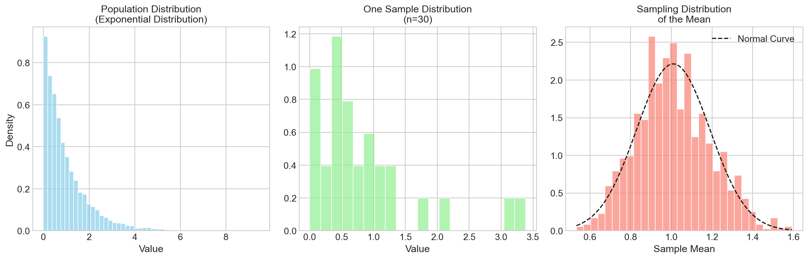
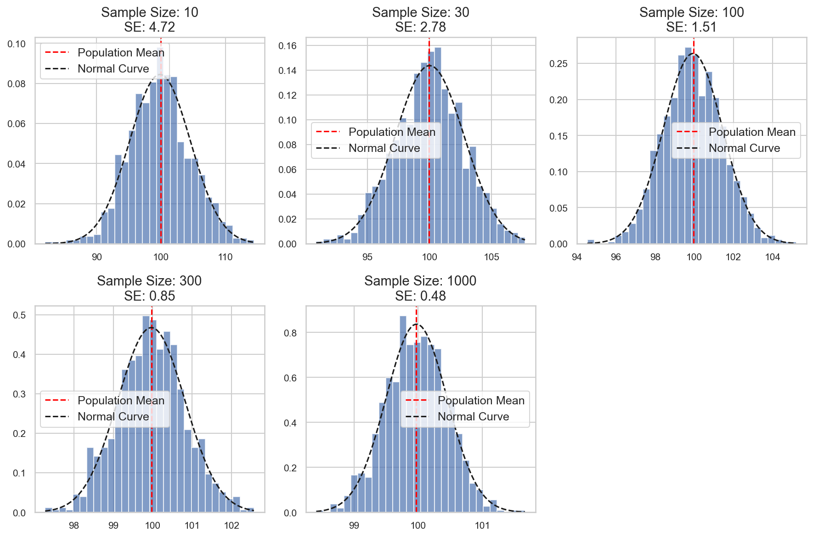
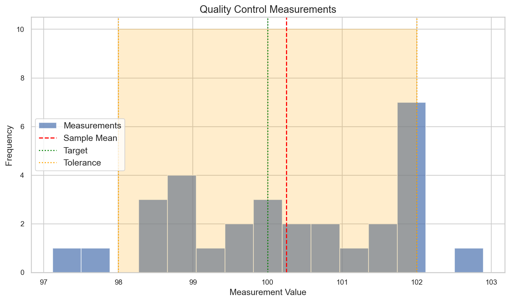
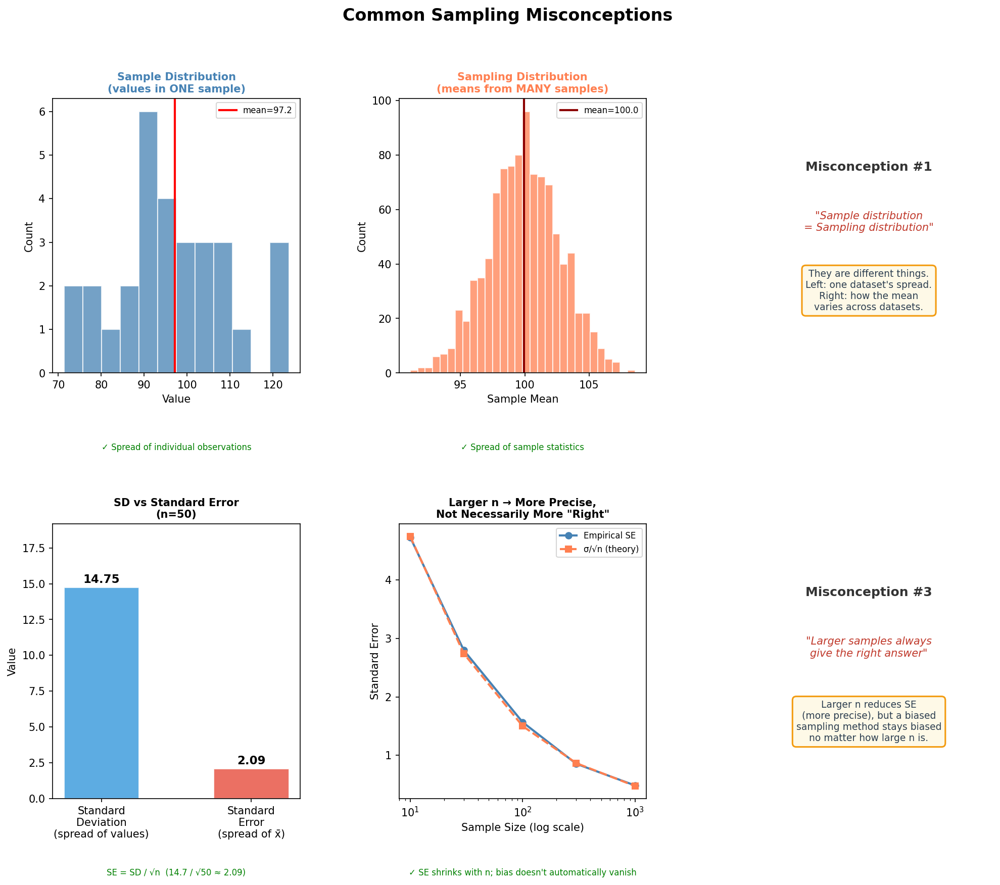

# Sampling Distributions: The Heart of Statistical Inference

**After this lesson:** you can explain the core ideas in “Sampling Distributions: The Heart of Statistical Inference” and reproduce the examples here in your own notebook or environment.

## Overview

If you drew another sample tomorrow, your mean would change slightly. A **sampling distribution** describes how a statistic (like \\(\bar x\\)) would vary under repeated sampling. That distribution is what makes [confidence intervals](./confidence-intervals.md), p-values, and tests behave the way they do—including the famous **Central Limit Theorem** for means. Read this lesson before confidence intervals so the margin-of-error formula has a foundation.

## Helpful video

StatQuest introduction to confidence intervals.

<iframe width="560" height="315" src="https://www.youtube.com/embed/TqOeMYtOc1w" title="Confidence Intervals, Clearly Explained" frameborder="0" allow="accelerometer; autoplay; clipboard-write; encrypted-media; gyroscope; picture-in-picture" allowfullscreen></iframe>

## Why this matters

- **Sampling distributions** explain why means and proportions vary from sample to sample.
- The **Central Limit Theorem** and **standard error** underpin confidence intervals and tests.

## Prerequisites

- [Population vs sample](./population-sample.md) for the population/sample/parameter/statistic vocabulary.
- Comfort with means, standard deviation, and basic probability.

> **Note:** Simulation plots in this lesson are optional; the written CLT summary is the core outcome.

## Introduction: Why Sampling Distributions Matter

Imagine you're a chef trying to perfect a recipe. You taste-test small portions (samples) to understand how the entire dish (population) tastes. But how reliable are these taste tests? That's where sampling distributions come in - they help us understand how sample statistics vary and how well they represent the true population!

*Figure 1: Visual representation of sampling distributions. The diagram shows how multiple samples from a population create a distribution of sample statistics.*

## What is a Sampling Distribution?

A sampling distribution is the distribution of a statistic (like mean or proportion) calculated from repeated random samples of the same size from a population. Think of it as the "distribution of distributions" - it shows us how sample statistics bounce around the true population value.

### Mathematical Definition

For a sample mean X̄:

- Mean: $$E(X̄) = μ$$ (population mean)
- Standard Error: $$SE(X̄) = \frac{σ}{\sqrt{n}}$$
  - where σ is population standard deviation
  - and n is sample size

*Figure 2: Visual explanation of the sampling distribution formula. The diagram shows how the standard error decreases as sample size increases.*

## The Central Limit Theorem (CLT): Statistical Magic

### What is CLT?

The Central Limit Theorem states that for sufficiently large samples:

1. The sampling distribution of the mean is approximately normal
2. This holds true regardless of the population's distribution
3. The larger the sample size, the more normal it becomes

#### How large is "sufficiently large"?

The folklore answer is "n ≥ 30," which is fine as a default but hides important nuance: how fast the sampling distribution becomes approximately normal depends on the *shape* of the underlying population. A useful rule of thumb:

| Population shape | Approximate \\(n\\) needed |
|---|---|
| Already normal | any \\(n\\) (the sampling distribution of \\(\bar x\\) is exactly normal) |
| Roughly symmetric, light tails (e.g., uniform) | \\(n \approx 15\text{–}20\\) |
| Mild skew or moderate outliers | \\(n \approx 30\text{–}40\\) (the textbook rule) |
| Strong skew (e.g., exponential, income, waiting times) | \\(n \approx 50\text{–}100\\) or more |
| Binomial with \\(p\\) near 0 or 1 | typically \\(np \geq 10\\) and \\(n(1-p) \geq 10\\) |

So when you read "n=30 is enough," ask: *enough for what kind of population?* The simulations later in this lesson will let you see the convergence speed for several shapes.

Let's see it in action!

**CLT simulation: population → one sample → distribution of \\(\bar x\\)**

**Purpose:** Visualize three panels—population shape, a single sample, and the histogram of many sample means—with an overlaid normal curve so the sampling distribution looks approximately Gaussian even when the population is not.

**Walkthrough:** `np.random.choice` with replacement builds bootstrap-style means; subplot 133 compares empirical spread to `stats.norm.pdf` matched to the simulated mean and SD of `sample_means`; PNGs write under `assets/clt_*.png`.


import numpy as np
import matplotlib.pyplot as plt
from scipy import stats

def demonstrate_clt(distribution='exponential', sample_size=30, n_samples=1000):
    """
    Demonstrate CLT with different distributions
    """
    plt.figure(figsize=(15, 5))

    # Generate population
    if distribution == 'exponential':
        population = np.random.exponential(scale=1.0, size=10000)
        title = 'Exponential Distribution'
    elif distribution == 'uniform':
        population = np.random.uniform(0, 1, 10000)
        title = 'Uniform Distribution'
    else:  # Skewed custom distribution
        population = np.concatenate([
            np.random.normal(0, 1, 7000),
            np.random.normal(3, 0.5, 3000)
        ])
        title = 'Skewed Distribution'

    # Take many samples and calculate their means
    sample_means = [
        np.mean(np.random.choice(population, size=sample_size))
        for _ in range(n_samples)
    ]

    # Plot results
    plt.subplot(131)
    plt.hist(population, bins=50, density=True, alpha=0.7, color='skyblue')
    plt.title(f'Population Distribution\n({title})')
    plt.xlabel('Value')
    plt.ylabel('Density')

    plt.subplot(132)
    sample = np.random.choice(population, size=sample_size)
    plt.hist(sample, bins=20, density=True, alpha=0.7, color='lightgreen')
    plt.title(f'One Sample Distribution\n(n={sample_size})')
    plt.xlabel('Value')

    plt.subplot(133)
    plt.hist(sample_means, bins=30, density=True, alpha=0.7, color='salmon')
    x = np.linspace(min(sample_means), max(sample_means), 100)
    plt.plot(x, stats.norm.pdf(x, np.mean(sample_means), np.std(sample_means)),
             'k--', label='Normal Curve')
    plt.title(f'Sampling Distribution\nof the Mean')
    plt.xlabel('Sample Mean')
    plt.legend()

    plt.tight_layout()
    return plt

# Create and save plots for different distributions
distributions = ['exponential', 'uniform', 'skewed']
for dist in distributions:
    plt = demonstrate_clt(distribution=dist)
    plt.savefig(f'docs/4-stat-analysis/4.1-inferential-stats/assets/clt_{dist}.png')
    plt.close()


<aside class="code-explainer__callouts" aria-label="Code walkthrough">
  

    

      
      Imports
    

    

      
Import NumPy, Matplotlib, and SciPy stats for population generation and curve fitting.

    

  

  

    

      
      Build population
    

    

      
Switch on <code>distribution</code> to build an exponential, uniform, or bimodal skewed population of 10,000 values.

    

  

  

    

      
      Sampling distribution
    

    

      
Collect 1,000 sample means; this list is the empirical sampling distribution shown in subplot 3.

    

  

  

    

      
      Three-panel figure
    

    

      
Panel 1: raw population. Panel 2: one sample. Panel 3: histogram of many means with an overlaid normal curve to illustrate CLT convergence.

    

  

  

    

      
      Save all variants
    

    

      
Loop over three population shapes and save each three-panel figure as a PNG for the lesson assets.

    

  

</aside>

*Note: The visualization shows how the sampling distribution of the mean becomes approximately normal regardless of the population distribution. This is the essence of the Central Limit Theorem.*

## Standard Error: Measuring the Spread

The standard error (SE) tells us how much sample statistics typically deviate from the population parameter. It's like a "margin of wobble" for our estimates!

### Formula for Different Statistics

1. For means: $$SE(X̄) = \frac{σ}{\sqrt{n}}$$
2. For proportions: $$SE(p) = \sqrt{\frac{p(1-p)}{n}}$$
3. For differences: $$SE(X̄_1 - X̄_2) = \sqrt{\frac{σ_1^2}{n_1} + \frac{σ_2^2}{n_2}}$$

Let's see how sample size affects SE:

**Empirical vs theoretical standard error across n**

**Purpose:** Tie the \\(1/\sqrt{n}\\) formula to a Monte Carlo: for each `n`, estimate the spread of \\(\bar x\\) and compare to \\(\sigma/\sqrt{n}\\) from the fixed synthetic population.

**Walkthrough:** Nested list comprehensions draw repeated means; subplot titles print empirical SE (`np.std(sample_means)`); bottom loop prints a table aligning theoretical and empirical columns.


def demonstrate_standard_error():
    """
    Show how SE changes with sample size
    """
    # Generate population
    np.random.seed(42)
    population = np.random.normal(100, 15, 10000)

    # Test different sample sizes
    sizes = [10, 30, 100, 300, 1000]
    results = []

    # Visualize the effect of sample size on SE
    plt.figure(figsize=(12, 8))
    for i, n in enumerate(sizes):
        plt.subplot(2, 3, i+1)

        # Take multiple samples
        sample_means = [
            np.mean(np.random.choice(population, size=n))
            for _ in range(1000)
        ]

        # Plot sampling distribution
        plt.hist(sample_means, bins=30, density=True, alpha=0.7)
        plt.axvline(np.mean(population), color='red', linestyle='--',
                   label='Population Mean')

        # Add normal curve
        x = np.linspace(min(sample_means), max(sample_means), 100)
        plt.plot(x, stats.norm.pdf(x, np.mean(sample_means), np.std(sample_means)),
                'k--', label='Normal Curve')

        plt.title(f'Sample Size: {n}\nSE: {np.std(sample_means):.2f}')
        plt.legend()

    plt.tight_layout()
    plt.savefig('docs/4-stat-analysis/4.1-inferential-stats/assets/standard_error_effect.png')
    plt.close()

    # Calculate theoretical and empirical SE
    for n in sizes:
        # Theoretical SE
        theoretical_se = np.std(population) / np.sqrt(n)

        # Empirical SE (from sampling distribution)
        sample_means = [
            np.mean(np.random.choice(population, size=n))
            for _ in range(1000)
        ]
        empirical_se = np.std(sample_means)

        results.append({
            'size': n,
            'theoretical': theoretical_se,
            'empirical': empirical_se
        })

    return results

# Run demonstration
se_results = demonstrate_standard_error()
print("\nStandard Error Analysis")
print("Sample Size | Theoretical SE | Empirical SE")
print("-" * 45)
for r in se_results:
    print(f"{r['size']:^10d} | {r['theoretical']:^13.3f} | {r['empirical']:^11.3f}")


<aside class="code-explainer__callouts" aria-label="Code walkthrough">
  

    

      
      Population setup
    

    

      
Create a synthetic normal population of 10,000 values with mean 100 and SD 15 as the reference distribution.

    

  

  

    

      
      Subplot grid
    

    

      
For each n, simulate 1,000 sample means, plot the sampling distribution as a histogram with a normal curve overlay and the SE in the title.

    

  

  

    

      
      Theoretical vs empirical
    

    

      
Compute both the formula-based SE (σ/√n) and the Monte Carlo SE for each sample size and store them for the table printout.

    

  

  

    

      
      Comparison table
    

    

      
Print a formatted table comparing theoretical and empirical SE values so students can verify the formula against simulation.

    

  

</aside>

*Note: The visualization shows how the sampling distribution becomes narrower (smaller standard error) as sample size increases. This demonstrates the relationship between sample size and estimation precision.*

## Real-world Applications

### 1. Quality Control in Manufacturing

**Single hour’s sample vs spec band**

**Purpose:** Practice reading `stats.sem` as the SE of the hourly mean and mapping it to a tolerance window around a nominal target—process-control intuition before formal control charts.

**Walkthrough:** One draw of `n=30` measurements; `fill_between` shades the spec window; status compares |sample mean − target| to `tolerance` (coarse rule).


def quality_control_demo():
    """
    Simulate quality control in manufacturing
    """
    # Target specification: 100 ± 2 units
    target = 100
    tolerance = 2

    # Production line measurements (30 samples per hour)
    measurements = np.random.normal(100.5, 1.5, 30)
    mean = np.mean(measurements)
    se = stats.sem(measurements)

    # Visualize the results
    plt.figure(figsize=(10, 6))
    plt.hist(measurements, bins=15, alpha=0.7, label='Measurements')
    plt.axvline(mean, color='red', linestyle='--', label='Sample Mean')
    plt.axvline(target, color='green', linestyle=':', label='Target')
    plt.axvline(target + tolerance, color='orange', linestyle=':', label='Tolerance')
    plt.axvline(target - tolerance, color='orange', linestyle=':')
    plt.fill_between([target-tolerance, target+tolerance], [0, 0], [10, 10],
                     color='orange', alpha=0.2)
    plt.title('Quality Control Measurements')
    plt.xlabel('Measurement Value')
    plt.ylabel('Frequency')
    plt.legend()
    plt.savefig('docs/4-stat-analysis/4.1-inferential-stats/assets/quality_control.png')
    plt.close()

    print("\nQuality Control Report")
    print(f"Specification: {target} ± {tolerance}")
    print(f"Sample Mean: {mean:.2f}")
    print(f"Standard Error: {se:.3f}")
    print(f"Status: {'In Control' if abs(mean - target) <= tolerance else 'Out of Control'}")

quality_control_demo()


<aside class="code-explainer__callouts" aria-label="Code walkthrough">
  

    

      
      Spec limits
    

    

      
Define the nominal target (100) and acceptable tolerance band (±2 units) for the production specification.

    

  

  

    

      
      Hourly sample
    

    

      
Simulate 30 production measurements drawn from a slightly off-target normal and compute the mean and standard error.

    

  

  

    

      
      Control chart
    

    

      
Plot the histogram with lines for the sample mean, nominal target, and tolerance bounds shaded in orange.

    

  

  

    

      
      Status report
    

    

      
Print mean, SE, and a simple "In Control / Out of Control" status based on whether the mean falls within tolerance.

    

  

</aside>

*Note: The visualization shows the distribution of quality control measurements with the target value and tolerance limits. This helps us understand if the production process is in control.*

### 2. Political Polling

**Monte Carlo distribution of \\(\hat p\\) and one poll’s MOE**

**Purpose:** Show how repeated polls of the same size vary around the true support, then compute \\(\hat p\\) and a normal-approx margin \\(\pm 1.96 \times SE\\) for a single survey.

**Walkthrough:** `poll_results` lists means of Bernoulli draws; second block uses \\(\sqrt{\hat p(1-\hat p)/n}\\) for SE; figure saved as `polling_results.png`.


def polling_demo():
    """
    Simulate political polling
    """
    # True population support: 52%
    true_support = 0.52
    sample_size = 1000

    # Simulate multiple polls
    n_polls = 100
    poll_results = [
        np.mean(np.random.binomial(1, true_support, sample_size))
        for _ in range(n_polls)
    ]

    # Visualize the results
    plt.figure(figsize=(10, 6))
    plt.hist(poll_results, bins=20, alpha=0.7, label='Poll Results')
    plt.axvline(true_support, color='red', linestyle='--', label='True Support')
    plt.axvline(np.mean(poll_results), color='blue', linestyle=':', label='Mean Support')
    plt.title('Distribution of Poll Results')
    plt.xlabel('Support Proportion')
    plt.ylabel('Frequency')
    plt.legend()
    plt.savefig('docs/4-stat-analysis/4.1-inferential-stats/assets/polling_results.png')
    plt.close()

    # Calculate statistics for a single poll
    poll = np.random.binomial(1, true_support, sample_size)
    p_hat = np.mean(poll)
    se = np.sqrt(p_hat * (1-p_hat) / sample_size)

    print("\nPolitical Poll Results")
    print(f"Support: {p_hat:.1%}")
    print(f"Margin of Error (95% CI): ±{1.96*se:.1%}")
    print(f"Sample Size: {sample_size:,}")


<figure>

<figcaption>Figure 1: Population Distribution
(Exponential Distribution)</figcaption>
</figure>

<figure>

<figcaption>Figure 2: Sample Size: 10
SE: 4.72</figcaption>
</figure>

<figure>

<figcaption>Figure 3: Quality Control Measurements</figcaption>
</figure>

<aside class="code-explainer__callouts" aria-label="Code walkthrough">
  

    

      
      Poll parameters
    

    

      
Set the true support level at 52% and simulate 100 independent polls of 1,000 voters each.

    

  

  

    

      
      Sampling distribution of p̂
    

    

      
List comprehension builds 100 Bernoulli-draw means, creating an empirical sampling distribution of the proportion.

    

  

  

    

      
      Poll histogram
    

    

      
Visualize the spread of poll results with vertical lines marking the true support and the mean of simulated polls.

    

  

  

    

      
      Single poll margin
    

    

      
Compute p̂ and the normal-approximation SE for one poll, then print the margin of error (±1.96·SE) as a percentage.

    

  

</aside>

*Note: The visualization shows the distribution of poll results from multiple samples. This helps us understand the variability in polling estimates and the role of sampling error.*

## Common Misconceptions: Let's Clear Them Up

### 1. Sampling Distribution vs. Sample Distribution

- Sample Distribution: The spread of values in ONE sample
- Sampling Distribution: The spread of statistics from MANY samples

### 2. Standard Deviation vs. Standard Error

- Standard Deviation: Spread of individual values
- Standard Error: Spread of sample statistics

### 3. Sample Size Effects

- "Larger samples always give the right answer"
- "Larger samples give more precise estimates"

*Figure 3: Visual explanation of common sampling misconceptions. The diagram contrasts correct and incorrect interpretations of sampling concepts.*

## Interactive Learning: Try It Yourself

### Mini-Exercise: The Sampling Game

**One draw + approximate 95% band (z = 1.96)**

**Purpose:** Let learners see sampling variability in one shot: overlay population, single sample, and a rough CI using sample-derived SE (pedagogical; for inference you’d use t).

**Walkthrough:** `se = np.std(sample)/sqrt(n)` uses sample SD; shaded band is \\(\bar x \pm 1.96\cdot SE\\); the “contains true mean?” printout is a single-check narrative exercise.


def sampling_game(true_mean=100, true_std=15, sample_size=30):
    """
    Interactive demonstration of sampling variability
    """
    population = np.random.normal(true_mean, true_std, 10000)
    sample = np.random.choice(population, size=sample_size)
    sample_mean = np.mean(sample)
    se = np.std(sample) / np.sqrt(sample_size)

    # Visualize the results
    plt.figure(figsize=(10, 6))
    plt.hist(population, bins=50, alpha=0.3, label='Population')
    plt.hist(sample, bins=15, alpha=0.7, label='Sample')
    plt.axvline(true_mean, color='red', linestyle='--', label='True Mean')
    plt.axvline(sample_mean, color='blue', linestyle=':', label='Sample Mean')
    plt.fill_between([sample_mean-1.96*se, sample_mean+1.96*se], [0, 0], [100, 100],
                     color='blue', alpha=0.2, label='95% CI')
    plt.title('The Sampling Game')
    plt.xlabel('Value')
    plt.ylabel('Frequency')
    plt.legend()
    plt.savefig('docs/4-stat-analysis/4.1-inferential-stats/assets/sampling_game.png')
    plt.close()

    print("\nThe Sampling Game")
    print(f"Sample Mean: {sample_mean:.1f}")
    print(f"Standard Error: {se:.2f}")
    print(f"95% CI: ({sample_mean - 1.96*se:.1f}, {sample_mean + 1.96*se:.1f})")
    print(f"Contains true mean? {'Yes' if true_mean-1.96*se <= sample_mean <= true_mean+1.96*se else 'No'}")

sampling_game()


<aside class="code-explainer__callouts" aria-label="Code walkthrough">
  

    

      
      One draw
    

    

      
Generate a population and take one random sample; compute the sample mean and approximate SE using the sample SD.

    

  

  

    

      
      Overlaid histograms
    

    

      
Plot the population (transparent) and sample (opaque) with vertical lines for both means and a shaded approximate 95% CI band.

    

  

  

    

      
      Coverage check
    

    

      
Print the CI and check whether the true mean falls inside it—a simple illustration of what "95% confidence" means in one run.

    

  

</aside>

*Note: The visualization shows how a single sample relates to the population distribution. The confidence interval helps us understand the uncertainty in our sample mean estimate.*

## Practice Questions

1. A sample of 100 customers shows mean spending of $85 with SE=$5. What's the 95% CI?
2. How would doubling sample size affect the standard error? Show the math!
3. Why might the CLT not work well with very small samples?
4. Design a sampling strategy for estimating average daily website traffic.
5. How would you explain sampling distributions to a non-technical stakeholder?

## Key Takeaways

1. Sampling distributions help us understand estimation uncertainty
2. The Central Limit Theorem is a powerful tool for inference
3. Standard error decreases with larger sample sizes
4. Different statistics have different sampling distributions
5. Visualizing sampling distributions aids understanding
6. Real-world applications include quality control and polling
7. Common misconceptions can lead to incorrect interpretations

## Gotchas

- **Confusing the sampling distribution with the sample distribution** — the *sample distribution* is the histogram of values in one dataset; the *sampling distribution* is the distribution of a statistic (e.g., x̄) across hypothetical repeated samples. The CLT applies to the second, not the first.
- **Believing the CLT means "your data become normal with more observations"** — the CLT says the *sampling distribution of the mean* becomes approximately normal; the raw data can stay skewed or bimodal regardless of n. Using CLT to justify normality of individual values leads to wrong model choices downstream.
- **Using `np.random.choice(population, size=n)` to build a sampling distribution when n is small** — for a population of size 10,000 and n=5, each resample is highly sensitive to outliers and the normal approximation is poor. The lesson's threshold of n=30 is a common rule of thumb; skewed populations may need n>50 before the CLT kicks in.
- **Equating standard deviation with standard error** — `np.std(data)` gives the spread of individual observations; `scipy.stats.sem(data)` gives how much the *mean* varies across samples. Using the wrong one in a CI formula inflates or deflates the interval by a factor of √n.
- **Overlaying a normal curve on a sampling distribution and concluding CLT "proved"** — the lesson's `stats.norm.pdf` overlay is fitted to the simulated means, so it will always look like a decent fit. A formal normality check (Shapiro-Wilk or Q-Q plot) is needed to verify CLT has kicked in adequately for a given n and population shape.
- **Running the demonstration code without a fixed seed and expecting stable output** — the lesson's CLT simulation uses `np.random.choice` inside a loop without a per-run seed; re-running will produce slightly different empirical SEs. Always seed before benchmarking or sharing, and report that values are approximate.

## Next steps

- Continue to [Confidence intervals](./confidence-intervals.md), where the σ/√n formula you just met becomes the margin of error.

## Additional Resources

- [Interactive Sampling Distribution Simulator](https://seeing-theory.brown.edu/frequentist-inference/index.html)
- [Understanding Sampling Distributions](https://statisticsbyjim.com/basics/sampling-distribution/)
- [CLT in Practice](https://www.khanacademy.org/math/statistics-probability/sampling-distributions-library)

Remember: Sampling distributions are the foundation of statistical inference. Understanding them helps us make better decisions with data!
