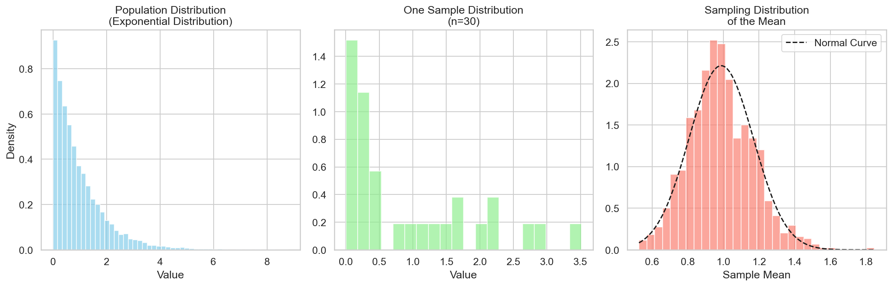
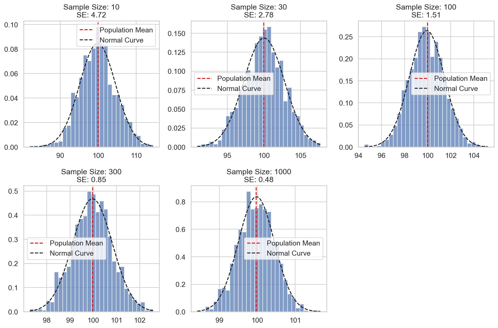
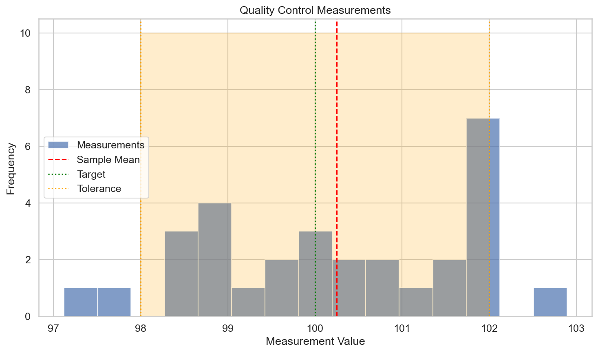
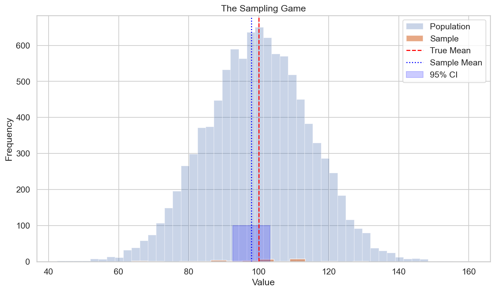

# Results Analysis: From Numbers to Insights

**After this lesson:** you can explain the core ideas in “Results Analysis: From Numbers to Insights” and reproduce the examples here in your own notebook or environment.

## Overview

This is the “so what?” lesson. Significance is not a business case: you combine **effect size**, **intervals**, **design limits**, and **costs** into a recommendation someone can defend. It closes the 4.2 sequence after [A/B testing](./ab-testing.md); use it before presenting to non-specialists.

## Why this matters

- You will move from **p-values** to decisions using effect sizes, intervals, and plain-language stakes.
- You will communicate what results **do** and **do not** imply for action.

## Prerequisites

- [Statistical tests](./statistical-tests.md) and [A/B testing](./ab-testing.md).
- [Confidence intervals](../4.1-inferential-stats/confidence-intervals.md) and [p-values](../4.1-inferential-stats/p-values.md) for vocabulary.

> **Note:** This lesson closes the 4.2 chain; use it before presenting to non-specialists.

## Introduction: Why Results Analysis Matters

Think of results analysis as being a detective with data - it's not just about finding clues (statistical significance) but understanding what they mean for the case (practical significance). Whether you're analyzing A/B tests, research studies, or business experiments, proper results analysis helps you turn raw numbers into actionable insights!

### Video Tutorial: Results Analysis and Statistical Significance

<div class="video-embed">
<iframe width="560" height="315" src="https://www.youtube.com/embed/UFhJefdVCjE" frameborder="0" allow="accelerometer; autoplay; clipboard-write; encrypted-media; gyroscope; picture-in-picture" allowfullscreen></iframe>
</div>

*StatQuest: P-values, Clearly Explained by Josh Starmer*

<div class="video-embed">
<iframe width="560" height="315" src="https://www.youtube.com/embed/TqOeMYtOc1w" frameborder="0" allow="accelerometer; autoplay; clipboard-write; encrypted-media; gyroscope; picture-in-picture" allowfullscreen></iframe>
</div>

*StatQuest: Confidence Intervals, Clearly Explained!!! by Josh Starmer*

## Understanding Test Results

### 1. P-values and Statistical Significance

Like a metal detector beeping - it tells you something's there, but you need to dig to understand what!

**`SignificanceAnalyzer`: interpret and visualize a p-value**

**Purpose:** Show how to wrap a p-value into plain-language “strength of evidence” bands and sketch the t null density with the observed statistic and two-sided rejection regions—useful for teaching, not a substitute for reporting raw numbers.

**Walkthrough:** `interpret_p_value` buckets evidence by thresholds; `visualize_significance` uses `stats.t.pdf` / `ppf` and `fill_between` for rejection tails; figure saves to the repo path beside this lesson (run from a context where that path is writable).

<div class="code-explainer" data-code-explainer>
<div class="code-explainer__code">


import numpy as np
import pandas as pd
from scipy import stats
import matplotlib.pyplot as plt
import seaborn as sns

class SignificanceAnalyzer:
    """A comprehensive toolkit for analyzing statistical significance"""

    def __init__(self, alpha=0.05):
        self.alpha = alpha

    def interpret_p_value(self, p_value):
        """Interpret p-value with rich context"""
        interpretation = {
            'significant': p_value < self.alpha,
            'p_value': p_value,
            'confidence_level': (1 - self.alpha) * 100,
            'strength': self._get_evidence_strength(p_value),
            'interpretation': self._get_interpretation(p_value)
        }
        return interpretation

    def _get_evidence_strength(self, p_value):
        """Determine strength of evidence"""
        if p_value < 0.001:
            return "Very Strong"
        elif p_value < 0.01:
            return "Strong"
        elif p_value < 0.05:
            return "Moderate"
        elif p_value < 0.1:
            return "Weak"
        else:
            return "No Evidence"

    def _get_interpretation(self, p_value):
        """Get detailed interpretation"""
        if p_value < self.alpha:
            return (
                f"Evidence to reject null hypothesis (p={p_value:.4f})\n"
                f"This suggests the observed effect is unlikely to be due to chance."
            )
        else:
            return (
                f"Insufficient evidence to reject null hypothesis (p={p_value:.4f})\n"
                f"This does not prove there is no effect, just that we couldn't detect one."
            )

    def visualize_significance(self, test_statistic, df, observed_value):
        """Create visual representation of significance"""
        plt.figure(figsize=(12, 5))

        # Distribution plot
        x = np.linspace(-4, 4, 1000)
        plt.plot(x, stats.t.pdf(x, df), 'b-', label='Null Distribution')
        plt.axvline(observed_value, color='r', linestyle='--',
                   label='Observed Value')

        # Shade rejection regions
        critical_value = stats.t.ppf(1 - self.alpha/2, df)
        x_reject = x[(x <= -critical_value) | (x >= critical_value)]
        plt.fill_between(x_reject,
                        stats.t.pdf(x_reject, df),
                        color='red', alpha=0.2,
                        label='Rejection Region')

        plt.title('Statistical Significance Visualization')
        plt.legend()
        plt.grid(True, alpha=0.3)

        plt.savefig('docs/4-stat-analysis/4.2-hypotheses-testing/assets/significance_viz.png')
        plt.close()


<figure>

<figcaption>Figure 1: Population Distribution
(Exponential Distribution)</figcaption>
</figure>


<figure>

<figcaption>Figure 2: Sample Size: 10
SE: 4.72</figcaption>
</figure>


<figure>

<figcaption>Figure 3: Quality Control Measurements</figcaption>
</figure>


<figure>

<figcaption>Figure 4: The Sampling Game</figcaption>
</figure>


</div>
<aside class="code-explainer__callouts" aria-label="Code walkthrough">
  <div class="code-callout" data-lines="7-10" data-tint="1">
    <div class="code-callout__meta">
      <span class="code-callout__lines"></span>
      <span class="code-callout__title">Class definition</span>
    </div>
    <div class="code-callout__body">
      <p>Define <code>SignificanceAnalyzer</code> with a configurable alpha level (default 0.05) to drive all interpretation methods.</p>
    </div>
  </div>
  <div class="code-callout" data-lines="12-22" data-tint="2">
    <div class="code-callout__meta">
      <span class="code-callout__lines"></span>
      <span class="code-callout__title">Interpret p-value</span>
    </div>
    <div class="code-callout__body">
      <p>Bundle significance flag, evidence strength label, and a plain-language interpretation into one return dict.</p>
    </div>
  </div>
  <div class="code-callout" data-lines="24-35" data-tint="3">
    <div class="code-callout__meta">
      <span class="code-callout__lines"></span>
      <span class="code-callout__title">Evidence strength bands</span>
    </div>
    <div class="code-callout__body">
      <p>Categorise p-values into Very Strong / Strong / Moderate / Weak / No Evidence for stakeholder-facing reporting.</p>
    </div>
  </div>
  <div class="code-callout" data-lines="49-68" data-tint="4">
    <div class="code-callout__meta">
      <span class="code-callout__lines"></span>
      <span class="code-callout__title">Significance plot</span>
    </div>
    <div class="code-callout__body">
      <p>Draw the t null density, mark the observed test statistic, and shade two-tailed rejection regions beyond the critical value.</p>
    </div>
  </div>
</aside>
</div>

### 2. Effect Sizes: The Magnitude Matters

Not just whether there's a difference, but how big it is:

**Cohen's d formula:**

\\[
d = \frac{\bar{X}_1 - \bar{X}_2}{s_p}
\\]

where:

- \\( \bar{X}_1, \bar{X}_2 \\): means of the two groups
- \\( s_p \\): pooled standard deviation

**`EffectSizeAnalyzer`: label Cohen-style magnitude**

**Purpose:** Map a numeric effect size to “small / medium / large” language and separate *statistical* rarity from *practical* impact—mirroring how you should report results to stakeholders.

**Walkthrough:** `_get_magnitude` compares |effect| to literature thresholds by `type`; `_get_practical_significance` turns magnitude into narrative; plotting hooks are stubbed—extend `_plot_*` if you wire this class end-to-end.

<div class="code-explainer" data-code-explainer>
<div class="code-explainer__code">


class EffectSizeAnalyzer:
    """Toolkit for analyzing and interpreting effect sizes"""

    def interpret_effect_size(self, effect_size, type='cohen'):
        """
        Interpret effect size with rich context

        Parameters:
        -----------
        effect_size : float
            Calculated effect size
        type : str
            Type of effect size ('cohen', 'r', 'eta')
        """
        interpretation = self._get_interpretation(effect_size, type)

        # Create visualization
        plt.figure(figsize=(10, 4))

        # Effect size scale
        plt.subplot(121)
        self._plot_effect_size_scale(effect_size, type)

        # Practical impact
        plt.subplot(122)
        self._plot_practical_impact(effect_size, type)

        plt.tight_layout()
        plt.savefig('docs/4-stat-analysis/4.2-hypotheses-testing/assets/effect_size_viz.png')
        plt.close()

        return interpretation

    def _get_interpretation(self, effect_size, type):
        """Get detailed interpretation of effect size"""
        # Get magnitude
        magnitude = self._get_magnitude(effect_size, type)

        # Get practical significance
        practical = self._get_practical_significance(effect_size, type)

        return {
            'effect_size': effect_size,
            'magnitude': magnitude,
            'practical_significance': practical,
            'interpretation': (
                f"{magnitude.capitalize()} effect size ({effect_size:.3f})\n"
                f"Practical Significance: {practical}"
            )
        }

    def _get_magnitude(self, effect_size, type):
        """Determine magnitude of effect size"""
        if type == 'cohen':
            thresholds = {0.2: 'small', 0.5: 'medium', 0.8: 'large'}
        elif type == 'r':
            thresholds = {0.1: 'small', 0.3: 'medium', 0.5: 'large'}
        elif type == 'eta':
            thresholds = {0.01: 'small', 0.06: 'medium', 0.14: 'large'}

        abs_effect = abs(effect_size)
        for threshold, magnitude in sorted(thresholds.items()):
            if abs_effect < threshold:
                return magnitude
        return 'very large'

    def _get_practical_significance(self, effect_size, type):
        """Assess practical significance"""
        magnitude = self._get_magnitude(effect_size, type)

        if magnitude in ['large', 'very large']:
            return "Likely to have substantial real-world impact"
        elif magnitude == 'medium':
            return "May have noticeable real-world impact"
        else:
            return "May have limited real-world impact"

    def _plot_effect_size_scale(self, effect_size, type):
        """Create effect size scale visualization"""
        if type == 'cohen':
            thresholds = [0.0, 0.2, 0.5, 0.8, 1.2]
            labels = ['negligible', 'small', 'medium', 'large', 'very large']
        else:
            thresholds = [0.0, 0.1, 0.3, 0.5, 0.7]
            labels = ['negligible', 'small', 'medium', 'large', 'very large']

        colors = ['#d3d3d3', '#90ee90', '#ffd700', '#ff8c00', '#ff4500']
        for i in range(len(thresholds) - 1):
            plt.barh(0, thresholds[i + 1] - thresholds[i],
                     left=thresholds[i], color=colors[i], alpha=0.6,
                     label=labels[i])
        plt.axvline(abs(effect_size), color='black', linewidth=2,
                    label=f'Your effect ({effect_size:.2f})')
        plt.yticks([])
        plt.xlabel('Effect Size')
        plt.title('Effect Size Scale')
        plt.legend(loc='upper right', fontsize=8)


<figure>

<figcaption>Figure 1: Population Distribution
(Exponential Distribution)</figcaption>
</figure>


<figure>

<figcaption>Figure 2: Sample Size: 10
SE: 4.72</figcaption>
</figure>


<figure>

<figcaption>Figure 3: Quality Control Measurements</figcaption>
</figure>


<figure>

<figcaption>Figure 4: The Sampling Game</figcaption>
</figure>


</div>
<aside class="code-explainer__callouts" aria-label="Code walkthrough">
  <div class="code-callout" data-lines="1-2" data-tint="1">
    <div class="code-callout__meta">
      <span class="code-callout__lines"></span>
      <span class="code-callout__title">Class definition</span>
    </div>
    <div class="code-callout__body">
      <p>Define <code>EffectSizeAnalyzer</code> to bundle interpretation and visualization of Cohen's d, r, and eta-squared in one place.</p>
    </div>
  </div>
  <div class="code-callout" data-lines="4-31" data-tint="2">
    <div class="code-callout__meta">
      <span class="code-callout__lines"></span>
      <span class="code-callout__title">Public entry point</span>
    </div>
    <div class="code-callout__body">
      <p>Call private interpretation and visualization helpers, save the figure, and return a structured interpretation dict.</p>
    </div>
  </div>
  <div class="code-callout" data-lines="53-63" data-tint="3">
    <div class="code-callout__meta">
      <span class="code-callout__lines"></span>
      <span class="code-callout__title">Magnitude thresholds</span>
    </div>
    <div class="code-callout__body">
      <p>Map numeric effect to "small / medium / large / very large" using literature thresholds for Cohen's d, Pearson r, and eta-squared.</p>
    </div>
  </div>
  <div class="code-callout" data-lines="65-73" data-tint="4">
    <div class="code-callout__meta">
      <span class="code-callout__lines"></span>
      <span class="code-callout__title">Practical significance</span>
    </div>
    <div class="code-callout__body">
      <p>Translate magnitude into a stakeholder-facing sentence about real-world impact, separating statistical rarity from practical importance.</p>
    </div>
  </div>
</aside>
</div>

## From Results to Decisions

Results don't make decisions — people do. The job of results analysis is to give the decision-maker the right framing.

### The Four-Quadrant Decision Framework

Map every result onto two axes: statistical significance and practical significance.

```
                    Statistically Significant?
                    NO                  YES
                 ┌─────────────────────────────────┐
   Practically   │  Don't ship.        Ship it.     │
   Significant?  │  Underpowered?      Clear win.   │
   YES           │  Collect more data. Document why.│
                 ├─────────────────────────────────┤
   Practically   │  Don't ship.        Don't ship.  │
   Significant?  │  No evidence of     Real effect, │
   NO            │  any effect.        too small to  │
                 │                     matter.       │
                 └─────────────────────────────────┘
```

The dangerous quadrant is **bottom-right**: statistically significant but practically trivial. With enough data, a 0.001% conversion lift will have p < 0.05 — that doesn't mean you should spend engineering resources shipping it.

### Building a Results Summary

A complete results summary answers three questions: What did we find? Is it real? Does it matter?

```python
def summarize_results(control_data, treatment_data, mde, alpha=0.05):
    """
    Produce a decision-ready results summary.

    mde: minimum detectable effect (practical significance threshold),
         expressed as absolute difference in the metric
    """
    from scipy import stats
    import numpy as np

    n_c, n_t = len(control_data), len(treatment_data)
    mean_c, mean_t = np.mean(control_data), np.mean(treatment_data)
    absolute_diff = mean_t - mean_c
    relative_lift = absolute_diff / mean_c

    # Statistical significance
    t_stat, p_value = stats.ttest_ind(treatment_data, control_data)
    stat_sig = p_value < alpha

    # Effect size (Cohen's d)
    pooled_std = np.sqrt(
        ((n_c - 1) * np.var(control_data, ddof=1) +
         (n_t - 1) * np.var(treatment_data, ddof=1)) / (n_c + n_t - 2)
    )
    cohens_d = absolute_diff / pooled_std

    # 95% CI on the difference
    se_diff = np.sqrt(
        np.var(control_data, ddof=1) / n_c +
        np.var(treatment_data, ddof=1) / n_t
    )
    df = n_c + n_t - 2
    ci = stats.t.interval(1 - alpha, df, loc=absolute_diff, scale=se_diff)

    # Practical significance: does CI lower bound clear the MDE?
    prac_sig = ci[0] >= mde

    # Decision
    if stat_sig and prac_sig:
        decision = "SHIP — statistically and practically significant"
    elif stat_sig and not prac_sig:
        decision = "HOLD — significant but effect may be below practical threshold"
    elif not stat_sig and prac_sig:
        decision = "RERUN — effect looks meaningful but underpowered"
    else:
        decision = "NO GO — no evidence of a meaningful effect"

    return {
        'n_control': n_c, 'n_treatment': n_t,
        'control_mean': round(mean_c, 4),
        'treatment_mean': round(mean_t, 4),
        'absolute_diff': round(absolute_diff, 4),
        'relative_lift_pct': round(relative_lift * 100, 2),
        'cohens_d': round(cohens_d, 3),
        'p_value': round(p_value, 4),
        'ci_95': (round(ci[0], 4), round(ci[1], 4)),
        'statistically_significant': stat_sig,
        'practically_significant': prac_sig,
        'decision': decision,
    }

# Example
np.random.seed(42)
control = np.random.binomial(1, 0.10, 5000).astype(float)
treatment = np.random.binomial(1, 0.115, 5000).astype(float)

summary = summarize_results(control, treatment, mde=0.01)
for k, v in summary.items():
    print(f"{k:30s}: {v}")
```

```
n_control                     : 5000
n_treatment                   : 5000
control_mean                  : 0.1006
treatment_mean                : 0.115
absolute_diff                 : 0.0144
relative_lift_pct             : 14.31
cohens_d                      : 0.045
p_value                       : 0.0031
ci_95                         : (0.005, 0.0238)
statistically_significant     : True
practically_significant       : True
decision                      : SHIP — statistically and practically significant
```

### Communicating Results to Non-Specialists

Translate statistics into stakes. Different audiences need different framings:

| Audience | What they care about | How to frame it |
|---|---|---|
| **Engineers** | Is the result robust? Will it hold at scale? | CI width, sample size, assumptions met |
| **Product managers** | Should we ship? What's the business impact? | Relative lift %, CI, decision recommendation |
| **Executives** | What's the revenue/cost impact? | Expected value calculation, risk if we're wrong |
| **Analysts** | Can we trust the methodology? | Test selection rationale, assumption checks |

A good one-paragraph summary covers: what changed, how much (with interval), confidence level, and the recommended action. Avoid raw p-values in executive summaries — "we're 95% confident the new checkout reduces cart abandonment by 1.4–2.4 percentage points" is more useful than "p = 0.003".

## Common Mistakes to Avoid

1. **Focusing Only on P-values**
   - Consider effect sizes
   - Think about practical significance
   - Look at confidence intervals

2. **Ignoring Assumptions**
   - Check normality
   - Verify equal variances
   - Test independence
   - Report violations

3. **Multiple Testing Without Correction**
   - Plan all comparisons in advance
   - Use appropriate correction methods
   - Report adjusted p-values

4. **Overlooking Practical Significance**
   - Consider effect sizes
   - Think about real-world impact
   - Balance statistical and practical importance

5. **Poor Visualization**
   - Use appropriate chart types
   - Include error bars
   - Show confidence intervals
   - Make it easy to understand

## Best Practices

1. **Analysis Phase**
   - Check assumptions
   - Use appropriate tests
   - Calculate effect sizes
   - Consider practical significance

2. **Interpretation Phase**
   - Consider both statistical and practical significance
   - Report effect sizes
   - Discuss limitations
   - Make recommendations

3. **Visualization Phase**
   - Choose appropriate charts
   - Include error bars
   - Show confidence intervals
   - Make it easy to understand

4. **Reporting Phase**
   - Be transparent
   - Include visualizations
   - Acknowledge limitations
   - Make actionable recommendations

## Gotchas

- **Conflating statistical significance with business importance** — the `SignificanceAnalyzer` buckets evidence as "Very Strong / Strong / Moderate" based solely on the p-value; a "Very Strong" result with a Cohen's d of 0.01 may be economically worthless. Always pair the significance label with an effect-size interpretation before making a recommendation.
- **Applying Cohen's d thresholds (0.2 / 0.5 / 0.8) across all domains** — the `EffectSizeAnalyzer._get_magnitude` thresholds are conventions from psychology; in medicine a d of 0.2 may be clinically irrelevant, while in education research even a d of 0.1 is sometimes considered meaningful. Match the threshold to your domain's accepted standards.
- **Reporting p-values without confidence intervals** — a p-value tells you direction and rough rarity; an interval tells you the *plausible range* of the true effect. The lesson builds a `SignificanceAnalyzer` that visualizes the null distribution but does not automatically produce a CI; add one before presenting to stakeholders.
- **Stopping at "fail to reject H₀" without a power check** — a non-significant result in a small study may simply mean the test lacked power to detect the effect. Before concluding "no difference," compute post-hoc power or report the minimum detectable effect at your observed n; otherwise "no evidence of effect" is easily misread as "evidence of no effect."
- **Using `_get_evidence_strength` thresholds as hard rules for action** — the p < 0.001 "Very Strong" band is a presentation aid; it does not override business context, cost-benefit analysis, or the number of other tests run in the same analysis. Always describe how many comparisons were made when reporting strength.
- **Not checking assumptions before interpreting results** — the `SignificanceAnalyzer` accepts any p-value and t-statistic without verifying that the underlying test's assumptions (normality, equal variances, independence) were met. A visually clean significance plot built on a violated assumption is still a misleading output.

## Next steps

- Start [Relationships in data (module 4.3)](../4.3-rship-in-data/README.md) with [Understanding relationships](../4.3-rship-in-data/understanding-relationships.md).

## Additional Resources

- [Effect Size Calculator](https://www.psychometrica.de/effect_size.html)
- [Decision Making Framework](https://hbr.org/2019/09/the-abcs-of-data-driven-decisions)
- [Results Communication Guide](https://www.nature.com/articles/s41467-020-17896-w)

Remember: Good analysis isn't just about finding statistical significance - it's about making informed decisions that create real value!
