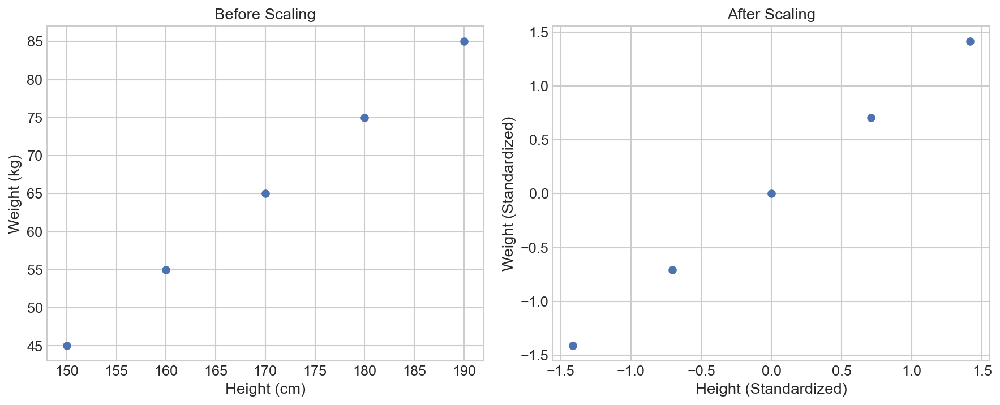
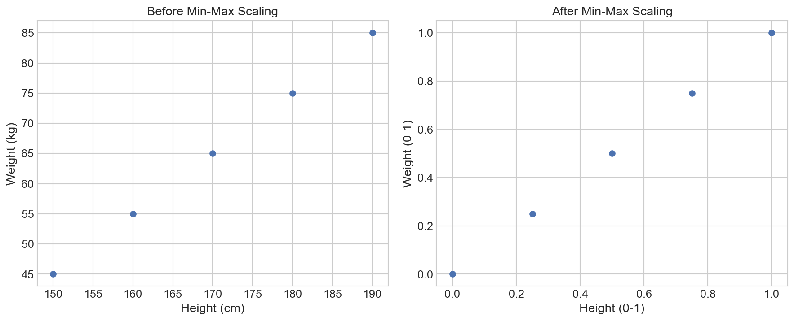
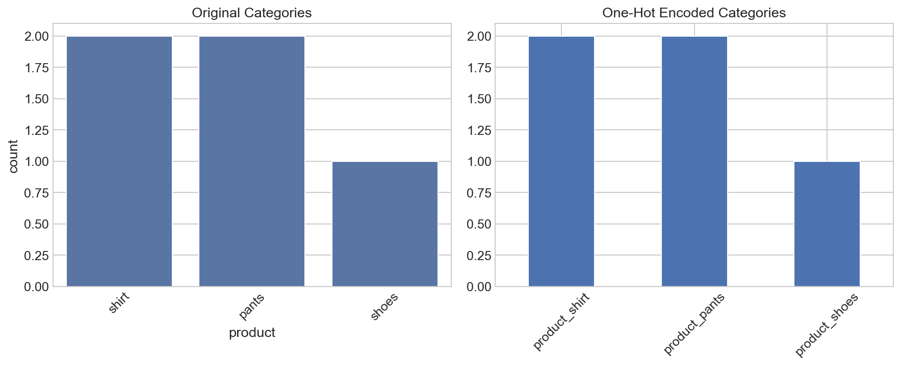
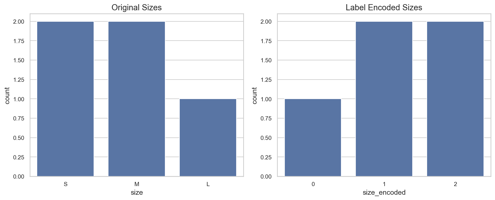

# Feature Engineering in Machine Learning: A Beginner's Guide

**After this lesson:** you can explain the core ideas in “Feature Engineering in Machine Learning: A Beginner's Guide” and reproduce the examples here in your own notebook or environment.

## Overview

**Feature engineering** means turning raw columns into inputs that algorithms can use: scaling numbers, encoding categories, and sometimes creating domain-informed combinations. This lesson groups features by type (numeric, categorical, time, text) and walks through scaling and encoding with small pandas and scikit-learn examples. **Prerequisites:** [pandas basics](../../2-data-wrangling/2.2-data-wrangling/) from Module 2 helps; [What is ML?](what-is-ml.md) clarifies how features feed supervised learning.

## Why this matters

Most real gains come from better inputs and problem framing, not from swapping the latest algorithm. Learning a small toolkit here saves time before you tune more complex models in [5.2](../5.2-supervised-learning-1/) and [5.5](../5.5-model-eval/).

## Helpful video

Crash Course AI: how supervised learning fits into ML workflows.

<iframe width="560" height="315" src="https://www.youtube.com/embed/4qVRBYAdLAo" title="Supervised Learning: Crash Course AI" frameborder="0" allow="accelerometer; autoplay; clipboard-write; encrypted-media; gyroscope; picture-in-picture" allowfullscreen></iframe>

## Introduction: What is Feature Engineering?

Imagine you're a chef preparing a meal. The raw ingredients (your data) need to be properly prepared (feature engineering) before they can be cooked (used in a machine learning model). Just as a chef might chop, marinate, or season ingredients to bring out their best flavors, feature engineering helps prepare your data to bring out its most useful patterns.

Feature engineering is the process of creating new features or transforming existing ones to help machine learning models better understand and learn from your data. It's like giving your model a better set of tools to work with.

### Why Should You Care About Feature Engineering?

Think of feature engineering as the secret sauce that can make or break your machine learning project. Here's why it's crucial:

1. **Better Model Performance**: Just like a well-prepared dish tastes better, well-engineered features help your model make better predictions
2. **Domain Knowledge**: It lets you incorporate your understanding of the problem into the model
3. **Data Understanding**: The process helps you understand your data better
4. **Problem-Solving**: It can help solve common data problems like missing values or different scales



## Types of Features: Understanding Your Ingredients

Before we start cooking (engineering features), let's understand the different types of ingredients (features) we might work with:

### 1. Numerical Features: The Measurable Ingredients

These are features that represent quantities or measurements. Think of them like recipe measurements:

- **Continuous Values**: Like temperature or weight - they can take any value within a range
  - Example: A patient's temperature (36.5°C, 37.2°C, etc.)
  - Real-world analogy: Like a thermometer that can show any temperature within its range

- **Discrete Values**: Like counting items - they can only take specific values
  - Example: Number of bedrooms in a house (1, 2, 3, etc.)
  - Real-world analogy: Like counting apples - you can't have half an apple

### 2. Categorical Features: The Labels and Categories

These features represent groups or categories. Think of them like different types of ingredients:

- **Nominal Categories**: Groups with no particular order
  - Example: Colors (red, blue, green) or brands (Nike, Adidas, Puma)
  - Real-world analogy: Like different types of fruits - there's no inherent order between apples and oranges

- **Ordinal Categories**: Groups with a meaningful order
  - Example: Size (S, M, L) or education level (High School, Bachelor's, Master's)
  - Real-world analogy: Like a race finish - 1st, 2nd, 3rd place have a clear order

### 3. Temporal Features: The Time-Based Ingredients

These features represent time-related information. Think of them like cooking timers:

- **Timestamps**: Specific points in time
  - Example: Transaction time, appointment date
  - Real-world analogy: Like marking when you started cooking a dish

- **Time Series Data**: Measurements taken over time
  - Example: Daily temperature readings, stock prices
  - Real-world analogy: Like monitoring the temperature of your oven over time

### 4. Text Features: The Written Ingredients

These features contain written information. Think of them like recipe instructions:

- **Documents**: Full text content
  - Example: Product descriptions, customer reviews
  - Real-world analogy: Like reading a recipe book

- **Social Media Posts**: Short-form text
  - Example: Tweets, comments
  - Real-world analogy: Like quick cooking tips

## Why This Matters

Understanding these different types of features is crucial because:

1. Each type requires different preparation techniques
2. The way you handle features affects your model's performance
3. Different machine learning algorithms work better with different types of features
4. It helps you choose the right feature engineering techniques

## Common Feature Engineering Techniques

### 1. Scaling and Normalization: Making Features Comparable

Imagine you're comparing the performance of athletes in different sports. A basketball player's height (in cm) and a weightlifter's strength (in kg) are on completely different scales. To compare them fairly, we need to put them on the same scale - this is what scaling does for your features.

#### Why Scaling Matters

1. **Fair Comparison**: Just like comparing athletes, scaling helps your model compare features fairly
2. **Algorithm Performance**: Many machine learning algorithms work better when features are on similar scales
3. **Speed**: Some algorithms converge faster with scaled features
4. **Interpretation**: Makes it easier to understand feature importance

#### Standard Scaling (Z-score normalization)

Think of this like converting temperatures from different scales (Celsius, Fahrenheit) to a standard scale. It centers your data around 0 and makes the spread consistent.

The formula might look complex, but it's actually simple:
$$z = \frac{x - \mu}{\sigma}$$

Where:

- $x$ is your original value (like a temperature in Celsius)
- $\mu$ is the average of all values (mean)
- $\sigma$ is how spread out the values are (standard deviation)

**Real-world analogy**: It's like converting everyone's height to "how many standard deviations they are from the average height"

#### Standardize numeric columns with `StandardScaler`

**Purpose:** See how z-score scaling shifts features to mean 0 and variance 1, and how scatter plots change relative spread (not the relationship shape).

**Walkthrough:** `fit_transform` on `df` learns $\mu$ and $\sigma$ per column; `pd.DataFrame` restores column names for plotting.

<div class="code-explainer" data-code-explainer>
<div class="code-explainer__code">


# Before running this code, make sure you have pandas and sklearn installed
# You can install them using: pip install pandas scikit-learn

import pandas as pd
import numpy as np
from sklearn.preprocessing import StandardScaler
import matplotlib.pyplot as plt

# Let's create some example data
data = {
    'height_cm': [150, 160, 170, 180, 190],
    'weight_kg': [45, 55, 65, 75, 85]
}
df = pd.DataFrame(data)

# Before scaling
print("Original Data:")
print(df)

# Create a scaler
scaler = StandardScaler()

# Scale the data
scaled_data = scaler.fit_transform(df)
scaled_df = pd.DataFrame(scaled_data, columns=df.columns)

# After scaling
print("\nScaled Data:")
print(scaled_df)

# Visualize the effect of scaling
plt.figure(figsize=(12, 5))

# Before scaling
plt.subplot(1, 2, 1)
plt.scatter(df['height_cm'], df['weight_kg'])
plt.title('Before Scaling')
plt.xlabel('Height (cm)')
plt.ylabel('Weight (kg)')

# After scaling
plt.subplot(1, 2, 2)
plt.scatter(scaled_df['height_cm'], scaled_df['weight_kg'])
plt.title('After Scaling')
plt.xlabel('Height (Standardized)')
plt.ylabel('Weight (Standardized)')

plt.tight_layout()
plt.show()


</div>
<aside class="code-explainer__callouts" aria-label="Code walkthrough">
  <div class="code-callout" data-lines="1-7" data-tint="1">
    <div class="code-callout__meta">
      <span class="code-callout__lines"></span>
      <span class="code-callout__title">Imports</span>
    </div>
    <div class="code-callout__body">
      <p>Import pandas, numpy, StandardScaler, and matplotlib for data creation, scaling, and visualization.</p>
    </div>
  </div>
  <div class="code-callout" data-lines="9-16" data-tint="2">
    <div class="code-callout__meta">
      <span class="code-callout__lines"></span>
      <span class="code-callout__title">Sample Data</span>
    </div>
    <div class="code-callout__body">
      <p>Create a small DataFrame with height and weight columns to demonstrate the effect of scaling on different scales.</p>
    </div>
  </div>
  <div class="code-callout" data-lines="19-26" data-tint="3">
    <div class="code-callout__meta">
      <span class="code-callout__lines"></span>
      <span class="code-callout__title">Fit and Transform</span>
    </div>
    <div class="code-callout__body">
      <p><code>fit_transform</code> learns mean and standard deviation per column, then applies z-score normalization; the result is wrapped back into a DataFrame with original column names.</p>
    </div>
  </div>
  <div class="code-callout" data-lines="28-43" data-tint="4">
    <div class="code-callout__meta">
      <span class="code-callout__lines"></span>
      <span class="code-callout__title">Side-by-side Plot</span>
    </div>
    <div class="code-callout__body">
      <p>Scatter plots before and after scaling show the relationship shape is unchanged—only the axis units shift to standardized values.</p>
    </div>
  </div>
</aside>
</div>




**Captured stdout** (from running the snippet above; may be auto-injected on build):

```
Original Data:
   height_cm  weight_kg
0        150         45
1        160         55
2        170         65
3        180         75
4        190         85

Scaled Data:
   height_cm  weight_kg
0  -1.414214  -1.414214
1  -0.707107  -0.707107
2   0.000000   0.000000
3   0.707107   0.707107
4   1.414214   1.414214
```

#### Min-Max Scaling

This is like converting a temperature range to a 0-1 scale. It's useful when you need all values to be between 0 and 1.

The formula is:
$$x_{norm} = \frac{x - x_{min}}{x_{max} - x_{min}}$$

Where:

- $x$ is your original value
- $x_{min}$ is the smallest value in your data
- $x_{max}$ is the largest value in your data

**Real-world analogy**: It's like converting a test score to a percentage (0-100%)

#### Map features into the `[0, 1]` range with `MinMaxScaler`

**Purpose:** Compare standard scaling with min–max scaling when you need bounded inputs (e.g., neural nets) or interpretable 0–1 magnitudes.

**Walkthrough:** Same `df` as before; `MinMaxScaler` squeezes each column between min and max of the training set.

<div class="code-explainer" data-code-explainer>
<div class="code-explainer__code">


from sklearn.preprocessing import MinMaxScaler

# Create a min-max scaler
minmax_scaler = MinMaxScaler()

# Scale the data
minmax_scaled_data = minmax_scaler.fit_transform(df)
minmax_scaled_df = pd.DataFrame(minmax_scaled_data, columns=df.columns)

# After min-max scaling
print("\nMin-Max Scaled Data:")
print(minmax_scaled_df)

# Visualize the effect of min-max scaling
plt.figure(figsize=(12, 5))

# Before scaling
plt.subplot(1, 2, 1)
plt.scatter(df['height_cm'], df['weight_kg'])
plt.title('Before Min-Max Scaling')
plt.xlabel('Height (cm)')
plt.ylabel('Weight (kg)')

# After min-max scaling
plt.subplot(1, 2, 2)
plt.scatter(minmax_scaled_df['height_cm'], minmax_scaled_df['weight_kg'])
plt.title('After Min-Max Scaling')
plt.xlabel('Height (0-1)')
plt.ylabel('Weight (0-1)')

plt.tight_layout()
plt.show()


</div>
<aside class="code-explainer__callouts" aria-label="Code walkthrough">
  <div class="code-callout" data-lines="1-8" data-tint="1">
    <div class="code-callout__meta">
      <span class="code-callout__lines"></span>
      <span class="code-callout__title">MinMaxScaler</span>
    </div>
    <div class="code-callout__body">
      <p>Import and apply <code>MinMaxScaler</code>; <code>fit_transform</code> squeezes each column into [0, 1] based on its observed min and max.</p>
    </div>
  </div>
  <div class="code-callout" data-lines="10-12" data-tint="2">
    <div class="code-callout__meta">
      <span class="code-callout__lines"></span>
      <span class="code-callout__title">Print Results</span>
    </div>
    <div class="code-callout__body">
      <p>Print the scaled DataFrame to confirm all values fall between 0 and 1 after transformation.</p>
    </div>
  </div>
  <div class="code-callout" data-lines="14-31" data-tint="3">
    <div class="code-callout__meta">
      <span class="code-callout__lines"></span>
      <span class="code-callout__title">Comparison Plot</span>
    </div>
    <div class="code-callout__body">
      <p>Side-by-side scatter plots show the original scale vs the [0, 1] range—the relationship shape is preserved while units change.</p>
    </div>
  </div>
</aside>
</div>




**Captured stdout** (from running the snippet above; may be auto-injected on build):

```

Min-Max Scaled Data:
   height_cm  weight_kg
0       0.00       0.00
1       0.25       0.25
2       0.50       0.50
3       0.75       0.75
4       1.00       1.00
```

### When to Use Which Scaling Method?

| Method | Best For | Not Good For |
|--------|----------|--------------|
| Standard Scaling | Most cases, especially when data follows normal distribution | When you need specific range (0-1) |
| Min-Max Scaling | When you need values between 0 and 1 | When you have outliers |

### Common Mistakes to Avoid

1. **Scaling Before Splitting**: Always split your data into training and test sets before scaling
2. **Scaling Categorical Data**: Don't scale categorical variables (like colors or categories)
3. **Forgetting to Scale New Data**: Remember to scale new data using the same scaler you used for training
4. **Choosing the Wrong Method**: Consider your data distribution and algorithm requirements

### 2. Handling Categorical Variables: Converting Categories to Numbers

Imagine you're organizing a clothing store. You have different categories of items (shirts, pants, shoes) and sizes (S, M, L). To help your computer understand these categories, we need to convert them into numbers - this is what handling categorical variables is all about.

#### Why Handle Categorical Variables?

1. **Computer Understanding**: Computers work with numbers, not categories
2. **Model Compatibility**: Most machine learning algorithms need numerical input
3. **Pattern Recognition**: Helps models find patterns in categorical data
4. **Feature Importance**: Makes it easier to understand which categories matter most

#### One-Hot Encoding: Creating Separate Columns

Think of this like creating separate sections in your store for each category. Instead of having one "category" column, we create a new column for each category.

**Real-world analogy**: It's like having separate checkboxes for each size (S, M, L) instead of one dropdown menu

#### One-hot encode nominal columns with `pd.get_dummies`

**Purpose:** Turn categorical columns into binary columns so linear models and tree ensembles can consume them without assuming a fake ordering.

**Walkthrough:** `get_dummies` expands `product` and `size`; the bar chart compares category counts before vs summed indicator columns after.

<div class="code-explainer" data-code-explainer>
<div class="code-explainer__code">


import pandas as pd
import matplotlib.pyplot as plt
import seaborn as sns

# Create example data
data = {
    'product': ['shirt', 'pants', 'shoes', 'shirt', 'pants'],
    'size': ['S', 'M', 'L', 'M', 'S']
}
df = pd.DataFrame(data)

# Before encoding
print("Original Data:")
print(df)

# One-hot encode the data
encoded_df = pd.get_dummies(df)

# After encoding
print("\nOne-Hot Encoded Data:")
print(encoded_df)

# Visualize the encoding
plt.figure(figsize=(12, 5))

# Before encoding
plt.subplot(1, 2, 1)
sns.countplot(data=df, x='product')
plt.title('Original Categories')
plt.xticks(rotation=45)

# After encoding
plt.subplot(1, 2, 2)
encoded_df[['product_shirt', 'product_pants', 'product_shoes']].sum().plot(kind='bar')
plt.title('One-Hot Encoded Categories')
plt.xticks(rotation=45)

plt.tight_layout()
plt.show()


</div>
<aside class="code-explainer__callouts" aria-label="Code walkthrough">
  <div class="code-callout" data-lines="1-10" data-tint="1">
    <div class="code-callout__meta">
      <span class="code-callout__lines"></span>
      <span class="code-callout__title">Sample Categorical Data</span>
    </div>
    <div class="code-callout__body">
      <p>Create a DataFrame with <code>product</code> and <code>size</code> columns to demonstrate one-hot encoding on nominal categories.</p>
    </div>
  </div>
  <div class="code-callout" data-lines="15-21" data-tint="2">
    <div class="code-callout__meta">
      <span class="code-callout__lines"></span>
      <span class="code-callout__title">One-Hot Encoding</span>
    </div>
    <div class="code-callout__body">
      <p><code>pd.get_dummies</code> expands each categorical column into binary indicator columns—one per unique value.</p>
    </div>
  </div>
  <div class="code-callout" data-lines="23-39" data-tint="3">
    <div class="code-callout__meta">
      <span class="code-callout__lines"></span>
      <span class="code-callout__title">Before/After Plot</span>
    </div>
    <div class="code-callout__body">
      <p>Bar charts compare original category counts to the summed indicator columns, showing the same information in numeric form.</p>
    </div>
  </div>
</aside>
</div>




**Captured stdout** (from running the snippet above; may be auto-injected on build):

```
Original Data:
  product size
0   shirt    S
1   pants    M
2   shoes    L
3   shirt    M
4   pants    S

One-Hot Encoded Data:
   product_pants  product_shirt  product_shoes  size_L  size_M  size_S
0          False           True          False   False   False    True
1           True          False          False   False    True   False
2          False          False           True    True   False   False
3          False           True          False   False    True   False
4           True          False          False   False   False    True
```

#### Label Encoding: Assigning Numbers to Categories

This is like giving each category a unique number. It's simpler than one-hot encoding but works best when categories have a natural order.

**Real-world analogy**: It's like assigning numbers to race positions (1st, 2nd, 3rd)

#### Integer codes for categories with `LabelEncoder`

**Purpose:** Use when order is meaningful or tree models will split on integer codes; know that ordinals can be misused for nominal data (false ordering).

**Walkthrough:** Separate `LabelEncoder` per column; `fit_transform` maps each string category to an integer in arbitrary order—check `classes_` when interpreting.

<div class="code-explainer" data-code-explainer>
<div class="code-explainer__code">


from sklearn.preprocessing import LabelEncoder

# Create label encoders
product_encoder = LabelEncoder()
size_encoder = LabelEncoder()

# Encode the data
df['product_encoded'] = product_encoder.fit_transform(df['product'])
df['size_encoded'] = size_encoder.fit_transform(df['size'])

# After label encoding
print("\nLabel Encoded Data:")
print(df[['product', 'product_encoded', 'size', 'size_encoded']])

# Visualize the encoding
plt.figure(figsize=(12, 5))

# Before encoding
plt.subplot(1, 2, 1)
sns.countplot(data=df, x='size')
plt.title('Original Sizes')

# After encoding
plt.subplot(1, 2, 2)
sns.countplot(data=df, x='size_encoded')
plt.title('Label Encoded Sizes')

plt.tight_layout()
plt.show()


</div>
<aside class="code-explainer__callouts" aria-label="Code walkthrough">
  <div class="code-callout" data-lines="1-6" data-tint="1">
    <div class="code-callout__meta">
      <span class="code-callout__lines"></span>
      <span class="code-callout__title">Separate Encoders</span>
    </div>
    <div class="code-callout__body">
      <p>Create separate <code>LabelEncoder</code> instances per column so each encoder tracks its own class-to-integer mapping independently.</p>
    </div>
  </div>
  <div class="code-callout" data-lines="8-13" data-tint="2">
    <div class="code-callout__meta">
      <span class="code-callout__lines"></span>
      <span class="code-callout__title">Fit and Assign</span>
    </div>
    <div class="code-callout__body">
      <p><code>fit_transform</code> maps each string category to an integer in alphabetical order; check <code>.classes_</code> to interpret the mapping.</p>
    </div>
  </div>
  <div class="code-callout" data-lines="15-29" data-tint="3">
    <div class="code-callout__meta">
      <span class="code-callout__lines"></span>
      <span class="code-callout__title">Visual Comparison</span>
    </div>
    <div class="code-callout__body">
      <p>Count plots before and after encoding show that frequency distributions are preserved—only the axis labels change from strings to integers.</p>
    </div>
  </div>
</aside>
</div>




**Captured stdout** (from running the snippet above; may be auto-injected on build):

```

Label Encoded Data:
  product  product_encoded size  size_encoded
0   shirt                1    S             2
1   pants                0    M             1
2   shoes                2    L             0
3   shirt                1    M             1
4   pants                0    S             2
```

### When to Use Which Encoding Method?

| Method | Best For | Not Good For |
|--------|----------|--------------|
| One-Hot Encoding | Nominal categories (no order) | Many categories (creates many columns) |
| Label Encoding | Ordinal categories (natural order) | Nominal categories (can imply false order) |

### Common Mistakes to Avoid

1. **Using Label Encoding for Nominal Data**: This can imply false relationships between categories
2. **Too Many Categories**: One-hot encoding can create too many columns if you have many categories
3. **Forgetting to Handle New Categories**: Always plan for new categories in your data
4. **Mixing Encoding Methods**: Be consistent in how you encode similar types of categories

### Best Practices

1. **Start Simple**: Begin with basic encoding methods
2. **Consider Cardinality**: Think about how many unique values each category has
3. **Handle Missing Values**: Decide how to handle missing categories
4. **Document Your Choices**: Keep track of how you encoded each category

## Gotchas

- **Fitting the scaler on the full dataset before splitting** — `StandardScaler` and `MinMaxScaler` must be `fit` on training data only, then `transform` applied to both train and test; fitting on all data leaks test statistics into the model and produces optimistic evaluation scores.
- **Using label encoding for nominal (unordered) categories** — assigning integers 0, 1, 2 to `red`, `blue`, `green` implies an ordering (`green > blue > red`) that doesn't exist; most linear and distance-based models will treat the numbers as meaningful, introducing false relationships.
- **One-hot encoding high-cardinality columns without capping** — a column with 500 unique city names expands to 500 binary columns, increasing memory use and giving tree-based models many near-zero-importance splits to waste time on; consider target encoding, frequency encoding, or grouping rare values into an "other" bucket.
- **Forgetting to apply the same transformations to new data at inference time** — the scaler fitted during training must be saved (e.g., with `joblib`) and reused on every new batch; re-fitting on new data changes the reference statistics and breaks calibration.
- **Creating interaction features that include the target column** — dividing price by square footage is fine when both are features, but deriving a feature that is mathematically dependent on your target variable (`y`) introduces data leakage and produces inflated training scores.
- **Deriving time-based features without respecting temporal order** — if you compute `day_of_week` or `hour_of_day` without first sorting and splitting on time, future information can appear in training folds and the model will not generalise to truly unseen future dates.
