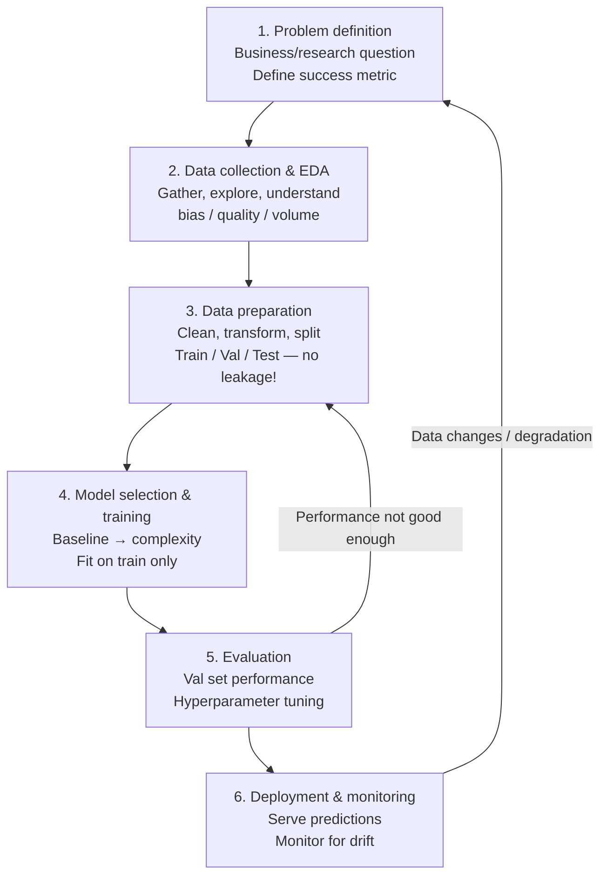

# Machine Learning Workflow: A Step-by-Step Guide

**After this lesson:** you can explain the core ideas in “Machine Learning Workflow: A Step-by-Step Guide” and reproduce the examples here in your own notebook or environment.

## Overview

A **workflow** is the repeatable path from a business or research question through data, modeling, evaluation, and (when appropriate) deployment. This page walks that path with house-price-style examples so you see how each stage connects to the next. Read [What is Machine Learning?](what-is-ml.md) first if the problem types are still new.

## Why this matters

Skipping steps—especially clear problem definition, honest splits, and evaluation—produces models that look good in a notebook and fail in production. A shared workflow also keeps teams aligned on what “done” means and what to document.

Welcome to our comprehensive guide on the machine learning workflow! This guide will walk you through each step of building a machine learning solution, with practical examples and clear explanations.

## Helpful video

Crash Course AI: how supervised learning fits into ML workflows.

<iframe width="560" height="315" src="https://www.youtube.com/embed/4qVRBYAdLAo" title="Supervised Learning: Crash Course AI" frameborder="0" allow="accelerometer; autoplay; clipboard-write; encrypted-media; gyroscope; picture-in-picture" allowfullscreen></iframe>

## What is a Machine Learning Workflow?

A machine learning workflow is a systematic process that helps us build effective ML solutions. Think of it as a recipe for creating machine learning models. Just like a recipe has specific steps to follow, the ML workflow has clear stages that help us build better models.

> **Figure (add screenshot or diagram):** Linear diagram of the 6-step ML workflow — Problem Definition → Data Collection → Data Preparation → Model Training → Evaluation → Deployment — with feedback arrows from Evaluation back to Data Preparation and from Deployment back to Problem Definition.

## Why is a Workflow Important?

Structured stages reduce rework: you discover data issues before training, pick metrics that match the problem before tuning, and keep a validation set untouched until you are ready to estimate generalization. In short, the workflow is how you turn ad hoc experiments into something you can ship and maintain.

Following a structured workflow helps us:

1. Stay organized and systematic
2. Avoid common mistakes
3. Build better models
4. Save time and resources
5. Make our work reproducible

## The Machine Learning Workflow Steps



The workflow consists of six main steps:

1. Problem Definition
2. Data Collection and Exploration
3. Data Preparation
4. Model Selection and Training
5. Model Evaluation
6. Model Deployment

Let's explore each step in detail.

## 1. Problem Definition

### Understanding the Problem

Before writing any code, we need to clearly understand what we're trying to solve. This is like planning a journey - we need to know our destination before we start.

Key questions to ask:

- What problem are we trying to solve?
- What are our success metrics?
- What data do we need?
- How will the solution be used?

### Types of Machine Learning Problems

There are three main types of ML problems:

1. **Regression**: Predicting continuous values
   - Example: House prices, temperature forecasting
   - Metrics: Mean Absolute Error (MAE), Root Mean Squared Error (RMSE), R²
   - Formula: $$y = \beta_0 + \beta_1x_1 + \beta_2x_2 + ... + \beta_nx_n + \epsilon$$

2. **Classification**: Predicting categories
   - Example: Spam detection, image recognition
   - Metrics: Accuracy, Precision, Recall, F1-score
   - Formula: $$P(y=1|x) = \frac{1}{1 + e^{-(\beta_0 + \beta_1x_1 + ... + \beta_nx_n)}}$$

3. **Clustering**: Finding natural groups
   - Example: Customer segmentation
   - Metrics: Silhouette Score, Davies-Bouldin Index
   - Formula: $$J = \sum_{i=1}^{k} \sum_{x \in C_i} ||x - \mu_i||^2$$

### Example Problem Statement

Let's look at a concrete example:

#### Document the problem before writing modeling code

**Purpose:** Practice writing a short problem spec (goal, problem type, metric, data needs, business impact) so downstream choices stay aligned with the task.

**Walkthrough:** The triple-quoted string is documentation only—running it prints the same text via stdout in the build pipeline.

```python
"""
Problem Statement Example:
Goal: Predict house prices
Type: Regression problem
Success Metric: Predictions within $50,000 of actual price
Required Data: House features (size, location, etc.)
Business Impact: Help real estate agents price houses accurately
"""
```

**Captured stdout** (from running the snippet above; may be auto-injected on build):

```

Problem Statement Example:
Goal: Predict house prices
Type: Regression problem
Success Metric: Predictions within $50,000 of actual price
Required Data: House features (size, location, etc.)
Business Impact: Help real estate agents price houses accurately
```

## 2. Data Collection and Exploration

### Understanding Your Data

Before we can build a model, we need to understand our data. This is like getting to know the ingredients before cooking.

### Initial Data Assessment

Let's start by loading and examining our data:

#### Load CSV and inspect shape, dtypes, and missing values

**Purpose:** Know how to sanity-check a new dataset: dimensions, column types, missingness, and `describe()` for numeric ranges.

**Walkthrough:** Adjust `house_data.csv` to your path; `isnull().sum()` counts gaps per column before imputation.

<div class="code-explainer" data-code-explainer>
<div class="code-explainer__code">


import pandas as pd
import numpy as np
import matplotlib.pyplot as plt
import seaborn as sns

# Load data
df = pd.read_csv('house_data.csv')

# Quick overview
print("Dataset Shape:", df.shape)
print("\nFeature Types:\n", df.dtypes)
print("\nMissing Values:\n", df.isnull().sum())

# Basic statistics
print("\nSummary Statistics:")
print(df.describe())


</div>
<aside class="code-explainer__callouts" aria-label="Code walkthrough">
  <div class="code-callout" data-lines="1-8" data-tint="1">
    <div class="code-callout__meta">
      <span class="code-callout__lines"></span>
      <span class="code-callout__title">Imports and Load</span>
    </div>
    <div class="code-callout__body">
      <p>Standard ML imports — pandas for the dataframe, numpy for numerics, matplotlib and seaborn for plots; <code>read_csv</code> loads the raw house dataset.</p>
    </div>
  </div>
  <div class="code-callout" data-lines="10-17" data-tint="2">
    <div class="code-callout__meta">
      <span class="code-callout__lines"></span>
      <span class="code-callout__title">Shape and Missingness</span>
    </div>
    <div class="code-callout__body">
      <p>Print row/column counts, column dtypes, and per-column null counts before any modeling; <code>describe()</code> adds numeric range summaries to spot outliers early.</p>
    </div>
  </div>
</aside>
</div>

### Exploratory Data Analysis (EDA)

EDA helps us understand patterns and relationships in our data:

#### Visualize the target and feature correlations

**Purpose:** Connect EDA to modeling—distribution of `price` and a correlation heatmap highlight skew, outliers, and redundant features.

**Walkthrough:** `histplot` for univariate shape; `heatmap` on `df.corr()` for linear relationships (nonlinear links may still hide).

<div class="code-explainer" data-code-explainer>
<div class="code-explainer__code">


# Distribution of house prices
plt.figure(figsize=(10, 6))
sns.histplot(data=df, x='price', bins=50)
plt.title('Distribution of House Prices')
plt.xlabel('Price ($)')
plt.ylabel('Count')
plt.show()

# Correlation heatmap
plt.figure(figsize=(12, 8))
sns.heatmap(df.corr(), annot=True, cmap='coolwarm')
plt.title('Feature Correlations')
plt.show()


</div>
<aside class="code-explainer__callouts" aria-label="Code walkthrough">
  <div class="code-callout" data-lines="1-7" data-tint="1">
    <div class="code-callout__meta">
      <span class="code-callout__lines"></span>
      <span class="code-callout__title">Price Distribution</span>
    </div>
    <div class="code-callout__body">
      <p><code>histplot</code> shows whether house prices are skewed or multimodal — skew suggests a log transform may help the model; multimodal peaks can indicate distinct market segments.</p>
    </div>
  </div>
  <div class="code-callout" data-lines="9-14" data-tint="2">
    <div class="code-callout__meta">
      <span class="code-callout__lines"></span>
      <span class="code-callout__title">Correlation Heatmap</span>
    </div>
    <div class="code-callout__body">
      <p><code>df.corr()</code> computes pairwise Pearson correlations; the heatmap with annotations reveals which features move together — high inter-feature correlation flags potential multicollinearity.</p>
    </div>
  </div>
</aside>
</div>

The histogram shows whether the target is skewed or multimodal (which can affect metrics and transforms). The correlation matrix is a first pass at **linear** relationships only; strong nonlinear links may not appear here.

## 3. Data Preparation

### Why Prepare Data?

Data preparation is like preparing ingredients for cooking. We need to clean and transform our data to make it suitable for modeling.

### Data Cleaning

Let's create a helper class to clean our data:

#### Encapsulate imputation and outlier clipping

**Purpose:** See a reusable cleaning pattern: median/mode imputation by dtype, then z-score filtering on a chosen column.

**Walkthrough:** `select_dtypes` splits numeric vs object columns; `remove_outliers` keeps rows within `n_std` standard deviations of the mean for one column.

<div class="code-explainer" data-code-explainer>
<div class="code-explainer__code">


class DataCleaner:
    """Helper class for data cleaning"""

    def __init__(self, df):
        self.df = df.copy()

    def handle_missing_values(self):
        """Fill missing values appropriately"""
        # Numerical: use median for skewed data
        numeric_cols = self.df.select_dtypes(include=[np.number]).columns
        for col in numeric_cols:
            if self.df[col].isnull().any():
                median = self.df[col].median()
                self.df[col] = self.df[col].fillna(median)

        # Categorical: use mode
        categorical_cols = self.df.select_dtypes(include=['object']).columns
        for col in categorical_cols:
            if self.df[col].isnull().any():
                mode = self.df[col].mode()[0]
                self.df[col] = self.df[col].fillna(mode)

    def remove_outliers(self, column, n_std=3):
        """Remove outliers using the z-score method"""
        mean = self.df[column].mean()
        std = self.df[column].std()
        self.df = self.df[
            (self.df[column] <= mean + (n_std * std)) &
            (self.df[column] >= mean - (n_std * std))
        ]

# Example usage
cleaner = DataCleaner(df)
cleaner.handle_missing_values()
cleaner.remove_outliers('price')


</div>
<aside class="code-explainer__callouts" aria-label="Code walkthrough">
  <div class="code-callout" data-lines="1-6" data-tint="1">
    <div class="code-callout__meta">
      <span class="code-callout__lines"></span>
      <span class="code-callout__title">Class Setup</span>
    </div>
    <div class="code-callout__body">
      <p>The class stores a copy of the dataframe so the original is never modified in place.</p>
    </div>
  </div>
  <div class="code-callout" data-lines="8-21" data-tint="2">
    <div class="code-callout__meta">
      <span class="code-callout__lines"></span>
      <span class="code-callout__title">Fill Missing Values</span>
    </div>
    <div class="code-callout__body">
      <p>Numeric columns get median imputation (robust to skew); categorical columns use the most frequent value (mode).</p>
    </div>
  </div>
  <div class="code-callout" data-lines="23-31" data-tint="3">
    <div class="code-callout__meta">
      <span class="code-callout__lines"></span>
      <span class="code-callout__title">Remove Outliers</span>
    </div>
    <div class="code-callout__body">
      <p>Rows whose value on the chosen column falls beyond <code>n_std</code> standard deviations from the mean are dropped via z-score filtering.</p>
    </div>
  </div>
  <div class="code-callout" data-lines="33-36" data-tint="4">
    <div class="code-callout__meta">
      <span class="code-callout__lines"></span>
      <span class="code-callout__title">Usage Example</span>
    </div>
    <div class="code-callout__body">
      <p>Instantiate the cleaner, run both methods in sequence to get a clean dataframe ready for feature engineering.</p>
    </div>
  </div>
</aside>
</div>

### Feature Engineering

Feature engineering is about creating new features that might help our model:

#### Derive ratios, totals, and one-hot encodings

**Purpose:** Practice turning domain ideas (price per sqft, room counts, renovation flag) into columns models can use; encode categoricals with `get_dummies`.

**Walkthrough:** `price_per_sqft` and `total_rooms` combine existing fields; `get_dummies` expands `view` and `condition` into binary columns.

<div class="code-explainer" data-code-explainer>
<div class="code-explainer__code">


def create_features(df):
    """Create new features from existing ones"""
    # Example feature engineering
    df['price_per_sqft'] = df['price'] / df['sqft_living']
    df['total_rooms'] = df['bedrooms'] + df['bathrooms']
    df['is_renovated'] = (df['yr_renovated'] > 0).astype(int)

    # Handle categorical variables
    df = pd.get_dummies(df, columns=['view', 'condition'])

    return df

# Create new features
df = create_features(df)


</div>
<aside class="code-explainer__callouts" aria-label="Code walkthrough">
  <div class="code-callout" data-lines="1-9" data-tint="1">
    <div class="code-callout__meta">
      <span class="code-callout__lines"></span>
      <span class="code-callout__title">Numeric Features</span>
    </div>
    <div class="code-callout__body">
      <p>Three derived numeric columns — price per sqft, total rooms, and a renovation flag — encode domain knowledge that raw columns alone cannot express for a linear model.</p>
    </div>
  </div>
  <div class="code-callout" data-lines="11-15" data-tint="2">
    <div class="code-callout__meta">
      <span class="code-callout__lines"></span>
      <span class="code-callout__title">Categorical Encoding</span>
    </div>
    <div class="code-callout__body">
      <p><code>pd.get_dummies</code> one-hot encodes <code>view</code> and <code>condition</code> into binary columns; <code>create_features(df)</code> returns the expanded dataframe ready for splitting and modeling.</p>
    </div>
  </div>
</aside>
</div>

## 4. Model Selection and Training

### Why Split Data?

We need to split our data to evaluate our model properly. Think of it as having a practice test and a real test.

### Splitting the Data

#### Train / validation / test split for honest evaluation

**Purpose:** Reserve held-out data for final evaluation while keeping a validation fold for model comparison and tuning.

**Walkthrough:** First `train_test_split` peels off 30% as `X_temp`/`y_temp`; second split halves that into validation and test (15% each of original when sizes match).

```python
from sklearn.model_selection import train_test_split

# Split features and target
X = df.drop('price', axis=1)
y = df['price']

# Create train, validation, and test sets
X_train, X_temp, y_train, y_temp = train_test_split(X, y, test_size=0.3, random_state=42)
X_val, X_test, y_val, y_test = train_test_split(X_temp, y_temp, test_size=0.5, random_state=42)
```

### Training Multiple Models

Let's try different models to find the best one:

#### Compare baselines with the same MAE / R² reporting

**Purpose:** Train several regressors with one evaluation helper so you compare on validation MAE and R² without copy-paste bugs.

**Walkthrough:** `train_evaluate_model` fits each model, predicts train and val sets, then packs `mean_absolute_error` and `r2_score` into a dict; the loop fills `results` per model name.

<div class="code-explainer" data-code-explainer>
<div class="code-explainer__code">


from sklearn.linear_model import LinearRegression, Ridge
from sklearn.ensemble import RandomForestRegressor
from sklearn.metrics import mean_absolute_error, r2_score

def train_evaluate_model(model, X_train, X_val, y_train, y_val):
    """Train and evaluate a model"""
    # Train the model
    model.fit(X_train, y_train)

    # Make predictions
    train_pred = model.predict(X_train)
    val_pred = model.predict(X_val)

    # Calculate metrics
    results = {
        'train_mae': mean_absolute_error(y_train, train_pred),
        'val_mae': mean_absolute_error(y_val, val_pred),
        'train_r2': r2_score(y_train, train_pred),
        'val_r2': r2_score(y_val, val_pred)
    }

    return results

# Try different models
models = {
    'Linear Regression': LinearRegression(),
    'Ridge Regression': Ridge(alpha=1.0),
    'Random Forest': RandomForestRegressor(n_estimators=100)
}

results = {}
for name, model in models.items():
    results[name] = train_evaluate_model(model, X_train, X_val, y_train, y_val)


</div>
<aside class="code-explainer__callouts" aria-label="Code walkthrough">
  <div class="code-callout" data-lines="1-3" data-tint="1">
    <div class="code-callout__meta">
      <span class="code-callout__lines"></span>
      <span class="code-callout__title">Imports</span>
    </div>
    <div class="code-callout__body">
      <p>Three regressor classes plus MAE and R² metric functions are imported for the comparison loop.</p>
    </div>
  </div>
  <div class="code-callout" data-lines="5-23" data-tint="2">
    <div class="code-callout__meta">
      <span class="code-callout__lines"></span>
      <span class="code-callout__title">Train and Evaluate</span>
    </div>
    <div class="code-callout__body">
      <p>The helper fits any sklearn estimator, predicts on both splits, and returns a dict of four metrics to detect train/val divergence.</p>
    </div>
  </div>
  <div class="code-callout" data-lines="25-34" data-tint="3">
    <div class="code-callout__meta">
      <span class="code-callout__lines"></span>
      <span class="code-callout__title">Model Comparison Loop</span>
    </div>
    <div class="code-callout__body">
      <p>Three models are defined in a dict and evaluated with the same helper; <code>results</code> collects each model's metrics for side-by-side comparison.</p>
    </div>
  </div>
</aside>
</div>

## 5. Model Evaluation

### Why Evaluate Models?

Evaluation helps us understand how well our model performs and where it needs improvement.

### Comprehensive Evaluation

#### Metrics plus an actual-vs-predicted scatter on the test set

**Purpose:** Report error scalars (MAE, RMSE, R²) and visualize systematic bias or heteroscedasticity in residuals via a scatter plot.

**Walkthrough:** `mean_squared_error` with `sqrt` gives RMSE; the red diagonal line is perfect calibration.

<div class="code-explainer" data-code-explainer>
<div class="code-explainer__code">


def evaluate_model(model, X_test, y_test):
    """Evaluate model on test set"""
    predictions = model.predict(X_test)

    # Calculate metrics
    mae = mean_absolute_error(y_test, predictions)
    mse = mean_squared_error(y_test, predictions)
    rmse = np.sqrt(mse)
    r2 = r2_score(y_test, predictions)

    print("Model Performance Metrics:")
    print(f"MAE: ${mae:,.2f}")
    print(f"RMSE: ${rmse:,.2f}")
    print(f"R² Score: {r2:.3f}")

    # Plot actual vs predicted
    plt.figure(figsize=(10, 6))
    plt.scatter(y_test, predictions, alpha=0.5)
    plt.plot([y_test.min(), y_test.max()], [y_test.min(), y_test.max()], 'r--')
    plt.xlabel('Actual Price')
    plt.ylabel('Predicted Price')
    plt.title('Actual vs Predicted House Prices')
    plt.show()

# Evaluate best model
best_model = models['Random Forest']  # Example
evaluate_model(best_model, X_test, y_test)


</div>
<aside class="code-explainer__callouts" aria-label="Code walkthrough">
  <div class="code-callout" data-lines="1-14" data-tint="1">
    <div class="code-callout__meta">
      <span class="code-callout__lines"></span>
      <span class="code-callout__title">Compute Metrics</span>
    </div>
    <div class="code-callout__body">
      <p>MAE, RMSE (via <code>sqrt(mse)</code>), and R² are computed then printed with dollar-formatted strings for interpretability.</p>
    </div>
  </div>
  <div class="code-callout" data-lines="16-24" data-tint="2">
    <div class="code-callout__meta">
      <span class="code-callout__lines"></span>
      <span class="code-callout__title">Actual vs Predicted Plot</span>
    </div>
    <div class="code-callout__body">
      <p>The scatter plot shows each test sample; the red dashed diagonal is perfect calibration—points above or below reveal systematic over- or under-prediction.</p>
    </div>
  </div>
  <div class="code-callout" data-lines="26-28" data-tint="3">
    <div class="code-callout__meta">
      <span class="code-callout__lines"></span>
      <span class="code-callout__title">Run on Best Model</span>
    </div>
    <div class="code-callout__body">
      <p>Pull the Random Forest from the <code>models</code> dict and pass it with the held-out test set to get final, unbiased evaluation numbers.</p>
    </div>
  </div>
</aside>
</div>

### Learning Curves Analysis

Learning curves help us understand if our model is learning well:

#### Plot learning curves to spot under- vs overfitting

**Purpose:** See whether adding training data would help (large gap) or the model is too simple (both curves low).

**Walkthrough:** `learning_curve` returns scores per train size; plotting mean train vs mean CV score shows the bias–variance story.

<div class="code-explainer" data-code-explainer>
<div class="code-explainer__code">


from sklearn.model_selection import learning_curve

def plot_learning_curves(model, X, y):
    """Plot learning curves to detect overfitting"""
    train_sizes, train_scores, val_scores = learning_curve(
        model, X, y, cv=5, n_jobs=-1,
        train_sizes=np.linspace(0.1, 1.0, 10))

    plt.figure(figsize=(10, 6))
    plt.plot(train_sizes, np.mean(train_scores, axis=1), 'o-', label='Training Score')
    plt.plot(train_sizes, np.mean(val_scores, axis=1), 'o-', label='Cross-validation Score')
    plt.xlabel('Training Examples')
    plt.ylabel('Score')
    plt.title('Learning Curves')
    plt.legend(loc='best')
    plt.grid(True)
    plt.show()

# Plot learning curves
plot_learning_curves(best_model, X, y)


</div>
<aside class="code-explainer__callouts" aria-label="Code walkthrough">
  <div class="code-callout" data-lines="1-7" data-tint="1">
    <div class="code-callout__meta">
      <span class="code-callout__lines"></span>
      <span class="code-callout__title">Compute Curves</span>
    </div>
    <div class="code-callout__body">
      <p><code>learning_curve</code> re-fits the model at 10 linearly-spaced training sizes using 5-fold CV, returning raw scores for both the train and validation sets.</p>
    </div>
  </div>
  <div class="code-callout" data-lines="9-18" data-tint="2">
    <div class="code-callout__meta">
      <span class="code-callout__lines"></span>
      <span class="code-callout__title">Plot Both Curves</span>
    </div>
    <div class="code-callout__body">
      <p>Mean train and CV scores are plotted against sample count; a persistent gap indicates overfitting, while both curves being low indicates underfitting.</p>
    </div>
  </div>
</aside>
</div>

## 6. Model Deployment

### Why Deploy Models?

Deployment makes our model available for real-world use. It's like opening a restaurant after perfecting a recipe.

### Saving the Model

#### Persist estimator and preprocessing artifacts

**Purpose:** Serialize the trained model and related objects so scoring code can reload the exact same pipeline later.

**Walkthrough:** `joblib.dump` writes binary blobs under `model/`; paths are illustrative—match your deployment layout.

<div class="code-explainer" data-code-explainer>
<div class="code-explainer__code">


import joblib

def save_model(model, scaler, feature_names, path='model/'):
    """Save model and associated objects"""
    import os
    os.makedirs(path, exist_ok=True)

    # Save model and preprocessing objects
    joblib.dump(model, f'{path}model.joblib')
    joblib.dump(scaler, f'{path}scaler.joblib')
    joblib.dump(feature_names, f'{path}features.joblib')

# Save the model
save_model(best_model, scaler, X.columns)


</div>
<aside class="code-explainer__callouts" aria-label="Code walkthrough">
  <div class="code-callout" data-lines="1-5" data-tint="1">
    <div class="code-callout__meta">
      <span class="code-callout__lines"></span>
      <span class="code-callout__title">Directory Setup</span>
    </div>
    <div class="code-callout__body">
      <p><code>os.makedirs(path, exist_ok=True)</code> creates the output directory if it doesn't exist, ensuring <code>joblib.dump</code> never fails on a missing path.</p>
    </div>
  </div>
  <div class="code-callout" data-lines="7-14" data-tint="2">
    <div class="code-callout__meta">
      <span class="code-callout__lines"></span>
      <span class="code-callout__title">Serialize All Artifacts</span>
    </div>
    <div class="code-callout__body">
      <p>Model, scaler, and feature names are saved as separate <code>.joblib</code> files — storing all three together ensures inference code can reconstruct the exact preprocessing + scoring pipeline.</p>
    </div>
  </div>
</aside>
</div>

### Making Predictions

#### Load artifacts and score new rows

**Purpose:** Show the inference path: load model + scaler + feature list, align columns, transform, then `predict`.

**Walkthrough:** Column order must match training; `scaler.transform` expects the same feature matrix shape the scaler saw at fit time.

<div class="code-explainer" data-code-explainer>
<div class="code-explainer__code">


def predict_house_price(features_df, model_path='model/'):
    """Load model and make predictions"""
    # Load model and preprocessing objects
    model = joblib.load(f'{model_path}model.joblib')
    scaler = joblib.load(f'{model_path}scaler.joblib')
    features = joblib.load(f'{model_path}features.joblib')

    # Ensure correct features
    features_df = features_df[features]

    # Scale features
    scaled_features = scaler.transform(features_df)

    # Predict
    prediction = model.predict(scaled_features)

    return prediction[0]

# Example prediction
new_house = pd.DataFrame({
    'sqft_living': [2000],
    'bedrooms': [3],
    'bathrooms': [2],
    'age': [15]
})

predicted_price = predict_house_price(new_house)
print(f"\nPredicted House Price: ${predicted_price:,.2f}")


</div>
<aside class="code-explainer__callouts" aria-label="Code walkthrough">
  <div class="code-callout" data-lines="1-6" data-tint="1">
    <div class="code-callout__meta">
      <span class="code-callout__lines"></span>
      <span class="code-callout__title">Load Artifacts</span>
    </div>
    <div class="code-callout__body">
      <p>All three saved objects—model, scaler, and feature list—are loaded from disk so inference is fully self-contained.</p>
    </div>
  </div>
  <div class="code-callout" data-lines="8-16" data-tint="2">
    <div class="code-callout__meta">
      <span class="code-callout__lines"></span>
      <span class="code-callout__title">Align and Transform</span>
    </div>
    <div class="code-callout__body">
      <p>Columns are reordered to match training, then the same scaler is applied so new data arrives in the same numeric range the model saw at fit time.</p>
    </div>
  </div>
  <div class="code-callout" data-lines="18-29" data-tint="3">
    <div class="code-callout__meta">
      <span class="code-callout__lines"></span>
      <span class="code-callout__title">Predict New House</span>
    </div>
    <div class="code-callout__body">
      <p>A single-row DataFrame with four features is passed to the function and the formatted price is printed—this is the minimal inference path.</p>
    </div>
  </div>
</aside>
</div>

## Best Practices and Tips

These habits support the same workflow: reproducibility (version control), trust (documentation), and sustainability (monitoring and error analysis).

### 1. Version Control

- Keep track of your code changes
- Document model versions and performance
- Save model artifacts systematically

### 2. Documentation

- Document your assumptions
- Keep track of preprocessing steps
- Record model performance metrics

### 3. Monitoring

- Monitor model performance over time
- Watch for data drift
- Set up alerts for performance degradation

### 4. Error Analysis

- Analyze where your model makes mistakes
- Look for patterns in errors
- Use insights to improve the model

## Next Steps

Now that you understand the ML workflow:

1. Practice with different datasets
2. Try various algorithms
3. Experiment with feature engineering
4. Build end-to-end projects

Remember: The key to success in machine learning is iteration and experimentation. Don't expect perfect results on your first try!
